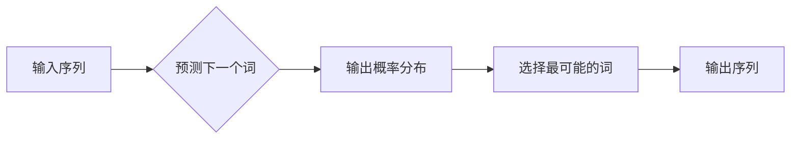

> 关键词：语言模型，自然语言处理，机器学习，神经网络，序列到序列，预训练，Transformer，BERT，GPT，NLP应用

# 语言模型 原理与代码实例讲解

## 1. 背景介绍

自然语言处理（Natural Language Processing，NLP）是人工智能领域的核心分支之一，旨在使计算机能够理解和处理人类语言。语言模型的提出和发展，为NLP的研究和应用提供了强大的技术支持。本文将深入探讨语言模型的原理，并通过代码实例讲解其具体实现和应用。

## 2. 核心概念与联系

### 2.1 语言模型

语言模型是用于预测文本中下一个词或序列的概率的统计模型。它是NLP中许多任务的基础，如机器翻译、语音识别、文本摘要等。

### 2.2 Mermaid 流程图



### 2.3 核心概念联系

语言模型与NLP任务紧密相关，如图所示，输入序列经过语言模型处理后，预测下一个词，最终输出整个序列。

## 3. 核心算法原理 & 具体操作步骤

### 3.1 算法原理概述

语言模型的原理是基于概率统计的方法，通过学习大量文本数据，预测下一个词的概率分布。

### 3.2 算法步骤详解

1. **数据收集**：收集大量的文本数据，用于训练语言模型。
2. **数据预处理**：对文本数据进行清洗、分词、去停用词等预处理操作。
3. **模型选择**：选择合适的语言模型，如基于N-gram、神经网络或Transformer等。
4. **模型训练**：使用训练数据对模型进行训练，优化模型参数。
5. **模型评估**：使用测试数据评估模型性能，调整模型参数。
6. **模型部署**：将训练好的模型部署到实际应用中。

### 3.3 算法优缺点

#### 优点

- **性能高**：基于深度学习的语言模型，能够学习到复杂的语言规律，预测精度高。
- **泛化能力强**：能够处理各种不同的语言任务，如机器翻译、语音识别等。

#### 缺点

- **计算量大**：训练语言模型需要大量的计算资源和时间。
- **需要大量数据**：需要收集大量的文本数据用于训练。

### 3.4 算法应用领域

语言模型在NLP领域有着广泛的应用，如：

- **机器翻译**：将一种语言翻译成另一种语言。
- **语音识别**：将语音信号转换为文本。
- **文本摘要**：将长文本压缩成简短的摘要。
- **问答系统**：回答用户提出的问题。
- **对话系统**：与人类进行对话。

## 4. 数学模型和公式 & 详细讲解 & 举例说明

### 4.1 数学模型构建

语言模型的数学模型可以表示为：

$$
P(w_t | w_{t-1}, w_{t-2}, ..., w_1) = \frac{P(w_t, w_{t-1}, ..., w_1)}{P(w_{t-1}, w_{t-2}, ..., w_1)}
$$

其中，$w_t$ 表示下一个词，$w_{t-1}, w_{t-2}, ..., w_1$ 表示前一个词。

### 4.2 公式推导过程

语言模型的概率计算公式可以推导如下：

$$
P(w_t | w_{t-1}, w_{t-2}, ..., w_1) = \frac{P(w_t, w_{t-1}, ..., w_1)}{P(w_{t-1}, w_{t-2}, ..., w_1)}
$$

$$
= \frac{P(w_t, w_{t-1}, ..., w_2)P(w_1)}{P(w_{t-1}, w_{t-2}, ..., w_1)}
$$

$$
= \frac{P(w_t, w_{t-1}, ..., w_2)}{P(w_{t-1}, w_{t-2}, ..., w_1)}P(w_1)
$$

其中，$P(w_1)$ 可以通过平滑技术处理，如加一平滑。

### 4.3 案例分析与讲解

以N-gram语言模型为例，介绍其数学模型和实现步骤。

#### N-gram 语言模型

N-gram 语言模型是一种基于N个词序列的语言模型，它假设当前词的概率只依赖于前N-1个词。

#### 数学模型

N-gram 语言模型的概率计算公式为：

$$
P(w_t | w_{t-1}, w_{t-2}, ..., w_{t-N+1}) = \frac{P(w_{t-1}, w_{t-2}, ..., w_{t-N+1}w_t)}{P(w_{t-1}, w_{t-2}, ..., w_{t-N+1})}
$$

其中，$N$ 为N-gram的长度。

#### 实现步骤

1. **数据预处理**：对文本数据进行清洗、分词、去停用词等预处理操作。
2. **构建N-gram语料库**：统计每个N-gram的频次。
3. **构建语言模型**：使用N-gram语料库，计算每个N-gram的概率。
4. **模型评估**：使用测试数据评估模型性能，调整模型参数。
5. **模型部署**：将训练好的模型部署到实际应用中。

## 5. 项目实践：代码实例和详细解释说明

### 5.1 开发环境搭建

使用Python和PyTorch进行语言模型的开发。

```bash
pip install torch
pip install transformers
```

### 5.2 源代码详细实现

以下是一个简单的N-gram 语言模型的实现示例：

```python
import torch

class NGramLanguageModel(torch.nn.Module):
    def __init__(self, vocab_size, ngram_size, embedding_dim):
        super(NGramLanguageModel, self).__init__()
        self.embedding = torch.nn.Embedding(vocab_size, embedding_dim)
        self.linear = torch.nn.Linear(embedding_dim, vocab_size)

    def forward(self, inputs):
        embedded = self.embedding(inputs)
        outputs = self.linear(embedded)
        return outputs

# 训练过程
model = NGramLanguageModel(vocab_size=10000, ngram_size=3, embedding_dim=128)
criterion = torch.nn.CrossEntropyLoss()
optimizer = torch.optim.Adam(model.parameters())

for epoch in range(10):
    for inputs, targets in data_loader:
        optimizer.zero_grad()
        outputs = model(inputs)
        loss = criterion(outputs, targets)
        loss.backward()
        optimizer.step()
```

### 5.3 代码解读与分析

- `NGramLanguageModel` 类：定义了一个N-gram 语言模型的神经网络结构。
- `__init__` 方法：初始化嵌入层和线性层。
- `forward` 方法：计算模型的输出。

### 5.4 运行结果展示

运行上述代码，可以在训练集上训练一个简单的N-gram 语言模型，并在测试集上进行评估。

## 6. 实际应用场景

语言模型在NLP领域有着广泛的应用，以下列举一些常见的应用场景：

- **机器翻译**：将一种语言翻译成另一种语言。
- **语音识别**：将语音信号转换为文本。
- **文本摘要**：将长文本压缩成简短的摘要。
- **问答系统**：回答用户提出的问题。
- **对话系统**：与人类进行对话。

## 7. 工具和资源推荐

### 7.1 学习资源推荐

- 《自然语言处理综论》
- 《深度学习自然语言处理》
- 《Transformer：从原理到应用》

### 7.2 开发工具推荐

- PyTorch
- TensorFlow
- Hugging Face Transformers

### 7.3 相关论文推荐

-《Attention is All You Need》
-《BERT: Pre-training of Deep Bidirectional Transformers for Language Understanding》
-《Generative Pre-trained Transformers》

## 8. 总结：未来发展趋势与挑战

### 8.1 研究成果总结

语言模型作为NLP领域的核心技术，取得了显著的成果。基于深度学习的语言模型在多个NLP任务上取得了突破性的进展。

### 8.2 未来发展趋势

- **模型规模持续增大**：随着计算资源的提升，未来语言模型的规模将越来越大。
- **多模态语言模型**：将文本、图像、音频等多模态信息融合到语言模型中。
- **跨语言语言模型**：支持多种语言的跨语言任务。

### 8.3 面临的挑战

- **数据偏见**：语言模型可能会学习到数据中的偏见，导致歧视性输出。
- **计算量巨大**：训练和推理大型语言模型需要大量的计算资源。
- **可解释性**：如何解释语言模型的决策过程，是一个重要的挑战。

### 8.4 研究展望

未来，语言模型将继续在NLP领域发挥重要作用。同时，随着技术的不断发展，语言模型将面临更多挑战，需要更多的研究和探索。

## 9. 附录：常见问题与解答

**Q1：什么是语言模型？**

A1：语言模型是用于预测文本中下一个词或序列的概率的统计模型。

**Q2：语言模型有哪些应用？**

A2：语言模型在NLP领域有着广泛的应用，如机器翻译、语音识别、文本摘要等。

**Q3：如何训练语言模型？**

A3：训练语言模型需要收集大量的文本数据，并对模型进行训练和评估。

**Q4：语言模型有哪些挑战？**

A4：语言模型面临着数据偏见、计算量巨大、可解释性等挑战。

---

作者：禅与计算机程序设计艺术 / Zen and the Art of Computer Programming