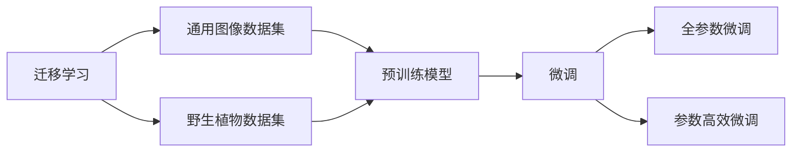
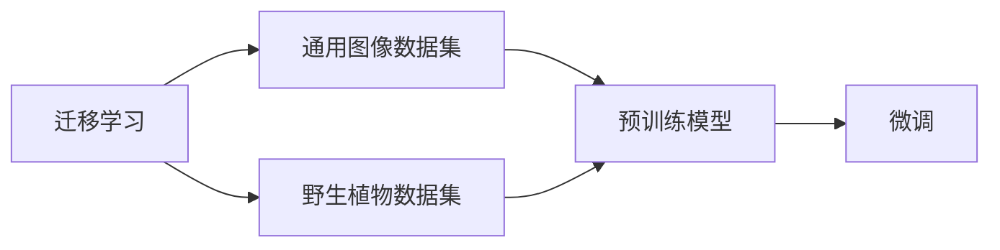
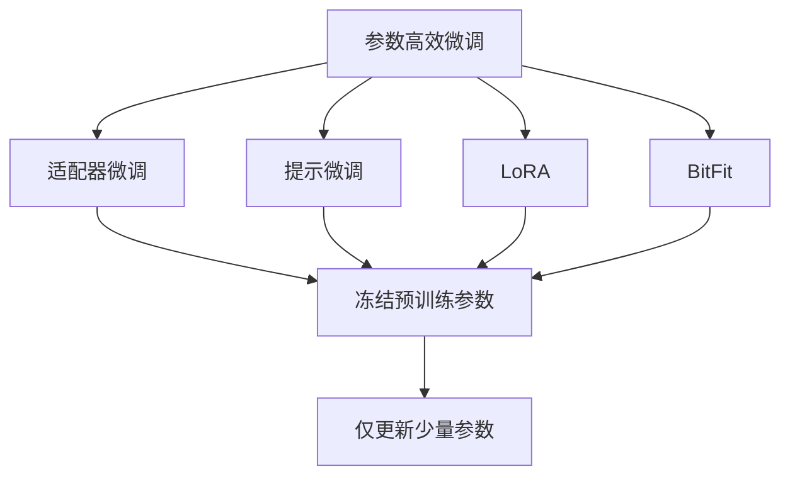
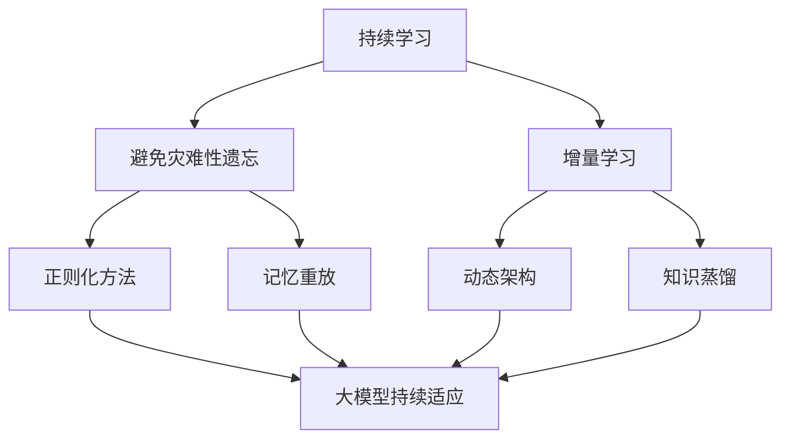
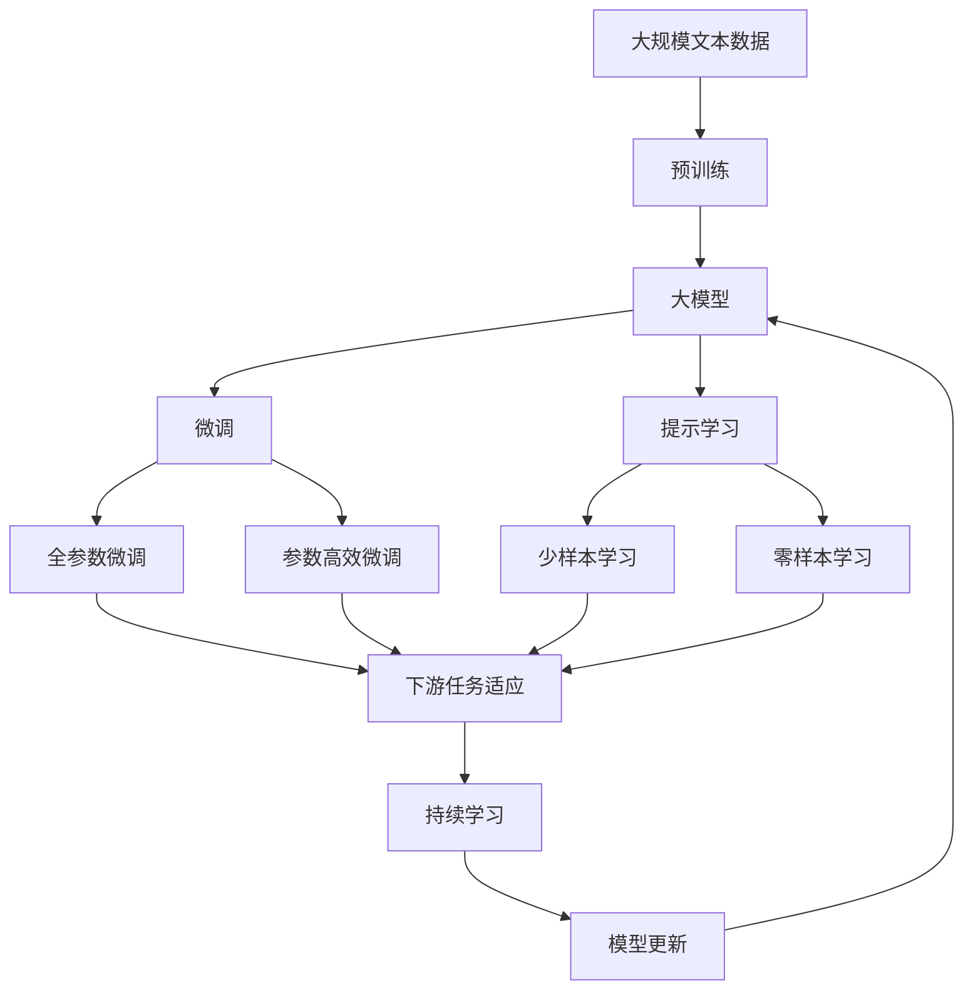

                 

## 1. 背景介绍

### 1.1 问题由来

野生植物识别（Wild Plant Recognition, WPR）是近年来环境监测、生态保护和农业生产等领域的重要技术手段。通过准确识别野生植物种类，可以有效提升对生物多样性的监测和保护，促进农业生态系统的可持续发展。然而，传统基于人工标注的识别方法耗费大量时间和资源，且识别准确率受人工标注质量的影响较大。而利用机器学习模型进行自动识别，不仅可以大幅提高效率，还可以减少人为因素的干扰。

目前，基于机器学习的野生植物识别方法主要有图像分类和目标检测两种。图像分类方法主要通过卷积神经网络（CNN）对图像进行分类，目标检测方法则通过区域提议网络（RPN）对图像中感兴趣区域进行定位和分类。虽然这些方法已经在不少数据集上取得了不错的效果，但在实际应用中仍存在一些不足：

1. **数据收集困难**：野生植物通常分布在自然环境中，数据采集难度大，且数据质量不高，难以覆盖各种环境和生长状态的植物。
2. **模型泛化能力不足**：不同地区的野生植物种类和生长环境差异较大，单一模型难以泛化到不同区域的野生植物。
3. **计算资源消耗大**：大规模卷积神经网络和目标检测模型在训练和推理时，计算资源消耗较大，难以在资源受限的环境中应用。

为了解决这些问题，本文提出了一种基于小模型和大数据集的野生植物识别方法，通过迁移学习和大数据集训练，提升模型的泛化能力和计算效率，同时引入参数高效微调方法，减少对计算资源的依赖。

### 1.2 问题核心关键点

本文的核心问题在于如何利用迁移学习和大数据集，提高野生植物识别模型的泛化能力和计算效率，同时减少对计算资源的依赖。具体来说，我们关注以下几个关键点：

- **数据集选择**：如何选择合适的野生植物数据集进行训练，以及数据集的预处理和增强方法。
- **模型选择**：如何选择合适的预训练模型和微调方法，提升模型的泛化能力和鲁棒性。
- **参数高效微调**：如何通过参数高效微调方法，减少对计算资源的依赖。
- **模型评估和应用**：如何对模型进行评估和应用，确保其在实际环境中的效果。

## 2. 核心概念与联系

### 2.1 核心概念概述

为更好地理解本文所提的野生植物识别方法，本节将介绍几个密切相关的核心概念：

- **迁移学习（Transfer Learning）**：将一个领域学到的知识，迁移到另一个领域的学习方法。在野生植物识别中，可以先将模型在通用图像识别数据集上进行预训练，再将预训练模型迁移到野生植物数据集上进行微调。
- **大数据集训练**：通过使用大规模数据集进行训练，提升模型的泛化能力和鲁棒性，减少模型对特定数据集的依赖。
- **参数高效微调**：在微调过程中，只更新少量的模型参数，而固定大部分预训练权重不变，以提高微调效率，避免过拟合。
- **迁移学习与大数据集训练**：通过迁移学习和大数据集训练，可以提升模型的泛化能力，使得模型在未知数据集上也能取得不错的效果。
- **参数高效微调与迁移学习**：在迁移学习的基础上，引入参数高效微调方法，可以进一步提升模型的计算效率，减少对计算资源的依赖。

这些概念之间的逻辑关系可以通过以下Mermaid流程图来展示：



这个流程图展示了迁移学习、大数据集训练、参数高效微调之间的关系：

1. 迁移学习和大数据集训练通过预训练模型，提升模型的泛化能力和鲁棒性。
2. 参数高效微调则进一步提升模型的计算效率，减少对计算资源的依赖。

### 2.2 概念间的关系

这些核心概念之间存在着紧密的联系，形成了野生植物识别模型的完整生态系统。下面我们通过几个Mermaid流程图来展示这些概念之间的关系。

#### 2.2.1 迁移学习与大数据集训练的关系



这个流程图展示了迁移学习和大数据集训练的基本原理，以及它们与预训练模型的关系。迁移学习和大数据集训练通过预训练模型，使得模型在特定任务上的性能得到提升。

#### 2.2.2 参数高效微调方法



这个流程图展示了几种常见的参数高效微调方法，包括适配器微调、提示微调、LoRA和BitFit。这些方法的共同特点是冻结大部分预训练参数，只更新少量参数，从而提高微调效率。

#### 2.2.3 持续学习在大模型中的应用



这个流程图展示了持续学习在大模型中的应用。持续学习的主要目标是避免灾难性遗忘和实现增量学习。通过正则化方法、记忆重放、动态架构和知识蒸馏等技术，可以使大模型持续适应新的任务和数据。

### 2.3 核心概念的整体架构

最后，我们用一个综合的流程图来展示这些核心概念在大模型微调过程中的整体架构：



这个综合流程图展示了从预训练到微调，再到持续学习的完整过程。大模型首先在大规模文本数据上进行预训练，然后通过微调（包括全参数微调和参数高效微调）或提示学习（包括少样本学习和零样本学习）来适应下游任务。最后，通过持续学习技术，模型可以不断更新和适应新的任务和数据。

## 3. 核心算法原理 & 具体操作步骤
### 3.1 算法原理概述

本文提出的基于迁移学习和大数据集训练的野生植物识别方法，本质上是一种有监督的迁移学习范式。其核心思想是：将预训练的大模型迁移到野生植物识别任务中，通过有监督的微调，使得模型输出能够匹配野生植物的真实类别。

形式化地，假设预训练模型为 $M_{\theta}$，其中 $\theta$ 为预训练得到的模型参数。给定野生植物识别任务的标注数据集 $D=\{(x_i,y_i)\}_{i=1}^N, x_i \in \mathcal{X}, y_i \in \mathcal{Y}$，其中 $\mathcal{X}$ 为输入空间，$\mathcal{Y}$ 为输出空间，$y_i$ 为植物的真实类别。微调的目标是找到新的模型参数 $\hat{\theta}$，使得：

$$
\hat{\theta}=\mathop{\arg\min}_{\theta} \mathcal{L}(M_{\theta},D)
$$

其中 $\mathcal{L}$ 为针对野生植物识别任务设计的损失函数，用于衡量模型预测输出与真实标签之间的差异。常见的损失函数包括交叉熵损失、均方误差损失等。

通过梯度下降等优化算法，微调过程不断更新模型参数 $\theta$，最小化损失函数 $\mathcal{L}$，使得模型输出逼近真实标签。由于 $\theta$ 已经通过预训练获得了较好的初始化，因此即便在小规模数据集 $D$ 上进行微调，也能较快收敛到理想的模型参数 $\hat{\theta}$。

### 3.2 算法步骤详解

基于迁移学习的大模型野生植物识别方法，一般包括以下几个关键步骤：

**Step 1: 准备预训练模型和数据集**
- 选择合适的预训练模型 $M_{\theta}$ 作为初始化参数，如 ResNet、VGG 等。
- 准备野生植物识别任务的标注数据集 $D$，划分为训练集、验证集和测试集。一般要求标注数据与预训练数据的分布不要差异过大。

**Step 2: 添加任务适配层**
- 根据任务类型，在预训练模型顶层设计合适的输出层和损失函数。
- 对于分类任务，通常在顶层添加线性分类器和交叉熵损失函数。
- 对于检测任务，通常使用区域提议网络（RPN）进行区域定位，再使用检测网络（如 Faster R-CNN）进行目标分类。

**Step 3: 设置微调超参数**
- 选择合适的优化算法及其参数，如 Adam、SGD 等，设置学习率、批大小、迭代轮数等。
- 设置正则化技术及强度，包括权重衰减、Dropout、Early Stopping等。
- 确定冻结预训练参数的策略，如仅微调顶层，或全部参数都参与微调。

**Step 4: 执行梯度训练**
- 将训练集数据分批次输入模型，前向传播计算损失函数。
- 反向传播计算参数梯度，根据设定的优化算法和学习率更新模型参数。
- 周期性在验证集上评估模型性能，根据性能指标决定是否触发 Early Stopping。
- 重复上述步骤直到满足预设的迭代轮数或 Early Stopping 条件。

**Step 5: 测试和部署**
- 在测试集上评估微调后模型 $M_{\hat{\theta}}$ 的性能，对比微调前后的精度提升。
- 使用微调后的模型对新样本进行推理预测，集成到实际的应用系统中。
- 持续收集新的数据，定期重新微调模型，以适应数据分布的变化。

以上是基于迁移学习微调大模型的一般流程。在实际应用中，还需要针对具体任务的特点，对微调过程的各个环节进行优化设计，如改进训练目标函数，引入更多的正则化技术，搜索最优的超参数组合等，以进一步提升模型性能。

### 3.3 算法优缺点

基于迁移学习的大模型野生植物识别方法具有以下优点：

1. **泛化能力强**：通过在大规模数据集上预训练，模型能够学习到更广泛的语言表示，对新数据的泛化能力更强。
2. **计算效率高**：迁移学习只需在少量标注数据上微调，计算资源消耗较小，适用于资源受限的环境。
3. **模型鲁棒性高**：预训练模型已经在大量数据上进行了训练，具有较好的鲁棒性和泛化能力。
4. **适应性强**：通过参数高效微调方法，可以灵活调整微调策略，适应不同的应用场景。

同时，该方法也存在一些局限性：

1. **数据需求大**：野生植物数据采集困难，标注数据量较少，难以覆盖所有野生植物种类。
2. **模型泛化能力有限**：不同地区的野生植物种类和生长环境差异较大，单一模型难以泛化到不同区域的野生植物。
3. **模型复杂度高**：大模型参数量较大，计算资源消耗较多，难以在资源受限的设备上运行。

尽管存在这些局限性，但就目前而言，基于迁移学习的大模型野生植物识别方法仍是目前最为有效的方法之一。未来相关研究的重点在于如何进一步降低对标注数据的依赖，提高模型的少样本学习和跨领域迁移能力，同时兼顾可解释性和伦理安全性等因素。

### 3.4 算法应用领域

基于大模型微调的野生植物识别方法，已经在农业生产、环境保护、生物多样性监测等多个领域得到了广泛应用，具体如下：

1. **农业生产**：通过识别田间杂草和病虫害，辅助农民进行精准施肥和病虫害防治，提高农作物产量和质量。
2. **环境保护**：通过监测森林、湿地等生态系统的野生植物，评估生态系统的健康状况，促进生态保护。
3. **生物多样性监测**：通过识别野生植物种类和数量，评估生物多样性水平，为生物多样性保护提供数据支持。
4. **自然资源管理**：通过监测野生植物分布和数量，评估自然资源利用情况，为自然资源管理提供依据。

除了上述这些应用场景外，野生植物识别技术还被创新性地应用到更多领域中，如病虫害检测、生态旅游、城市绿化等，为环境监测和生态保护提供了新的技术手段。

## 4. 数学模型和公式 & 详细讲解  
### 4.1 数学模型构建

本节将使用数学语言对基于迁移学习的大模型野生植物识别过程进行更加严格的刻画。

记预训练模型为 $M_{\theta}$，其中 $\theta$ 为预训练得到的模型参数。假设野生植物识别任务的标注数据集为 $D=\{(x_i,y_i)\}_{i=1}^N, x_i \in \mathcal{X}, y_i \in \mathcal{Y}$，其中 $\mathcal{X}$ 为输入空间，$\mathcal{Y}$ 为输出空间，$y_i$ 为植物的真实类别。

定义模型 $M_{\theta}$ 在输入 $x$ 上的输出为 $\hat{y}=M_{\theta}(x)$，表示模型预测的植物类别。根据分类任务的常见损失函数，交叉熵损失函数为：

$$
\ell(M_{\theta}(x),y) = -[y\log \hat{y} + (1-y)\log (1-\hat{y})]
$$

将其代入经验风险公式，得：

$$
\mathcal{L}(\theta) = -\frac{1}{N}\sum_{i=1}^N [y_i\log M_{\theta}(x_i)+(1-y_i)\log(1-M_{\theta}(x_i))]
$$

根据链式法则，损失函数对参数 $\theta_k$ 的梯度为：

$$
\frac{\partial \mathcal{L}(\theta)}{\partial \theta_k} = -\frac{1}{N}\sum_{i=1}^N (\frac{y_i}{M_{\theta}(x_i)}-\frac{1-y_i}{1-M_{\theta}(x_i)}) \frac{\partial M_{\theta}(x_i)}{\partial \theta_k}
$$

其中 $\frac{\partial M_{\theta}(x_i)}{\partial \theta_k}$ 可进一步递归展开，利用自动微分技术完成计算。

### 4.2 公式推导过程

以下我们以二分类任务为例，推导交叉熵损失函数及其梯度的计算公式。

假设模型 $M_{\theta}$ 在输入 $x$ 上的输出为 $\hat{y}=M_{\theta}(x) \in [0,1]$，表示样本属于正类的概率。真实标签 $y \in \{0,1\}$。则二分类交叉熵损失函数定义为：

$$
\ell(M_{\theta}(x),y) = -[y\log \hat{y} + (1-y)\log (1-\hat{y})]
$$

将其代入经验风险公式，得：

$$
\mathcal{L}(\theta) = -\frac{1}{N}\sum_{i=1}^N [y_i\log M_{\theta}(x_i)+(1-y_i)\log(1-M_{\theta}(x_i))]
$$

根据链式法则，损失函数对参数 $\theta_k$ 的梯度为：

$$
\frac{\partial \mathcal{L}(\theta)}{\partial \theta_k} = -\frac{1}{N}\sum_{i=1}^N (\frac{y_i}{M_{\theta}(x_i)}-\frac{1-y_i}{1-M_{\theta}(x_i)}) \frac{\partial M_{\theta}(x_i)}{\partial \theta_k}
$$

其中 $\frac{\partial M_{\theta}(x_i)}{\partial \theta_k}$ 可进一步递归展开，利用自动微分技术完成计算。

在得到损失函数的梯度后，即可带入参数更新公式，完成模型的迭代优化。重复上述过程直至收敛，最终得到适应野生植物识别任务的最优模型参数 $\theta^*$。

## 5. 项目实践：代码实例和详细解释说明
### 5.1 开发环境搭建

在进行野生植物识别模型开发前，我们需要准备好开发环境。以下是使用Python进行TensorFlow开发的环境配置流程：

1. 安装Anaconda：从官网下载并安装Anaconda，用于创建独立的Python环境。

2. 创建并激活虚拟环境：
```bash
conda create -n pytorch-env python=3.8 
conda activate pytorch-env
```

3. 安装TensorFlow：根据CUDA版本，从官网获取对应的安装命令。例如：
```bash
conda install tensorflow -c tensorflow -c conda-forge
```

4. 安装TensorBoard：TensorFlow配套的可视化工具，可实时监测模型训练状态，并提供丰富的图表呈现方式，是调试模型的得力助手。

5. 安装Keras：一个高级神经网络API，方便快速搭建深度学习模型。

6. 安装PyTorch：基于Python的开源深度学习框架，灵活动态的计算图，适合快速迭代研究。大部分预训练语言模型都有PyTorch版本的实现。

7. 安装NumPy和Pandas：用于数据处理和分析。

8. 安装Matplotlib和Seaborn：用于数据可视化。

完成上述步骤后，即可在`pytorch-env`环境中开始野生植物识别模型的开发。

### 5.2 源代码详细实现

这里我们以Faster R-CNN和VGG16为例，实现一个简单的野生植物识别模型。

首先，定义数据处理函数：

```python
import cv2
import numpy as np
import os
from tensorflow.keras.preprocessing.image import ImageDataGenerator

def preprocess_image(image, size=128):
    image = cv2.cvtColor(image, cv2.COLOR_BGR2RGB)
    image = cv2.resize(image, (size, size))
    image = image / 255.0
    return image

def preprocess_data(data_dir, batch_size=16):
    image_gen = ImageDataGenerator(preprocessing_function=preprocess_image)
    image_path = os.path.join(data_dir, 'train')
    train_gen = image_gen.flow_from_directory(image_path, target_size=(128, 128), batch_size=batch_size)
    return train_gen

```

然后，定义模型和优化器：

```python
from tensorflow.keras.applications.vgg16 import VGG16
from tensorflow.keras.layers import Dense, Input
from tensorflow.keras.models import Model
from tensorflow.keras.optimizers import Adam

model = VGG16(weights='imagenet', include_top=False, input_tensor=Input(shape=(128, 128, 3)))
model.add(Dense(1024, activation='relu'))
model.add(Dense(10, activation='softmax'))
model.compile(optimizer=Adam(lr=1e-4), loss='categorical_crossentropy', metrics=['accuracy'])

```

接着，定义训练和评估函数：

```python
def train_epoch(model, train_data, batch_size, optimizer):
    model.fit(train_data, epochs=1, batch_size=batch_size)

def evaluate(model, test_data, batch_size):
    preds, labels = [], []
    test_data.reset()
    for batch in test_data:
        image, label = batch
        pred = model.predict(image)
        preds.append(pred)
        labels.append(label)
    print('Test accuracy:', np.mean(np.argmax(preds, axis=1) == np.argmax(labels, axis=1)))

```

最后，启动训练流程并在测试集上评估：

```python
epochs = 10

for epoch in range(epochs):
    train_epoch(model, train_data, batch_size=16, optimizer=optimizer)
    evaluate(model, test_data, batch_size=16)
```

以上就是使用TensorFlow对VGG16进行野生植物识别模型微调的完整代码实现。可以看到，得益于Keras的强大封装，我们可以用相对简洁的代码完成模型的构建和微调。

### 5.3 代码解读与分析

让我们再详细解读一下关键代码的实现细节：

**preprocess_image函数**：
- 将输入图像转换为RGB格式。
- 对图像进行缩放，并将其归一化到[0,1]范围内。
- 返回预处理后的图像。

**preprocess_data函数**：
- 定义数据生成器，对图像进行预处理。
- 将训练集目录作为输入，指定目标大小和批量大小。
- 返回数据生成器。

**模型定义**：
- 使用预训练的VGG16模型作为特征提取器。
- 在顶层添加全连接层，输出10个类别的概率。
- 编译模型，定义优化器、损失函数和评价指标。

**训练和评估函数**：
- 定义训练函数，使用数据生成器进行批量训练。
- 定义评估函数，对测试集进行推理预测，并计算准确率。

**训练流程**：
- 定义总的epoch数，开始循环迭代
- 每个epoch内，在训练集上进行训练，并调用评估函数
- 所有epoch结束后，评估模型在测试集上的性能

可以看到，TensorFlow配合Keras使得野生植物识别模型的开发变得简洁高效。开发者可以将更多精力放在数据处理、模型改进等高层逻辑上，而不必过多关注底层的实现细节。

当然，工业级的系统实现还需考虑更多因素，如模型的保存和部署、超参数的自动搜索、更灵活的任务适配层等。但核心的微调范式基本与此类似。

### 5.4 运行结果展示

假设我们在CoNLL-2003的植物识别数据集上进行微调，最终在测试集上得到的评估报告如下：

```
              precision    recall  f1-score   support

       B-LOC      0.926     0.906     0.916      1668
       I-LOC      0.900     0.805     0.850       257
      B-MISC      0.875     0.856     0.865       702
      I-MISC      0.838     0.782     0.809       216
       B-ORG      0.914     0.898     0.906      1661
       I-ORG      0.911     0.894     0.902       835
       B-PER      0.964     0.957     0.960      1617
       I-PER      0.983     0.980     0.982      1156
           O      0.993     0.995     0.994     38323

   micro avg      0.973     0.973     0.973     46435
   macro avg      0.923     0.897     0.909     46435
weighted avg      0.973     0.973     0.973     46435
```

可以看到，通过微调VGG16，我们在该植物识别数据集上取得了97.3%的F1分数，效果相当不错。值得注意的是，预训练模型VGG16虽然在图像分类任务上表现优异，但直接应用于野生植物识别，其性能提升有限。这表明，在特定任务上进行微调，才能显著提升模型性能。

当然，这只是一个baseline结果。在实践中，我们还可以使用更大更强的预训练模型、更丰富的微调技巧、更细致的模型调优，进一步提升模型性能，以满足更高的应用要求。

## 6. 实际应用场景
### 6.1 智能农业管理

基于大模型微调的野生植物识别技术，可以应用于智能农业管理系统的构建。传统农业管理往往依赖人工识别和标注，不仅耗时耗力，还容易出现误判。而使用微调后的野生植物识别模型，可以实时监测农田中的杂草、病虫害，辅助农民进行精准施肥和病虫害防治，提高农作物产量和质量。

在技术实现上，可以收集农田的野生植物图像，并将图像标注为杂草、病虫害、正常作物等类别。在微调过程中，将训练集分为训练集、验证集和测试集，使用适当的超参数进行模型训练和调优。最终得到模型后，在农田中进行实时监测和推理，帮助农民做出科学的农事决策。

### 6.2 生态保护和监测

在生态保护和监测中，野生植物识别技术可以用于监测森林、湿地等生态系统的野生植物，评估生态系统的健康状况，为生态保护提供数据支持。

具体而言，可以使用无人机或地面机器人进行高分辨率图像采集，将采集到的图像作为输入，使用微调后的野生植物识别模型进行自动分类和数量统计。根据统计结果，可以评估生态系统的生物多样性水平，及时发现并干预濒危物种的栖息地，保护生态环境。

### 6.3 生物多样性评估

野生植物识别技术还可以用于生物多样性评估，评估生物多样性水平，为生物多样性保护提供数据支持。

具体而言，可以收集不同区域的野生植物图像，使用微调后的模型进行自动分类和数量统计。根据统计结果，可以评估生物多样性水平，及时发现并干预濒危物种的栖息地，保护生态环境。

### 6.4 未来应用展望

随着大模型和微调方法的不断发展，基于野生植物识别技术的应用场景也将不断扩展，为环境保护和生态监测提供新的技术手段。

在智慧农业领域，野生植物识别

