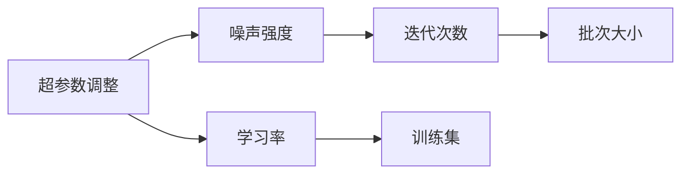
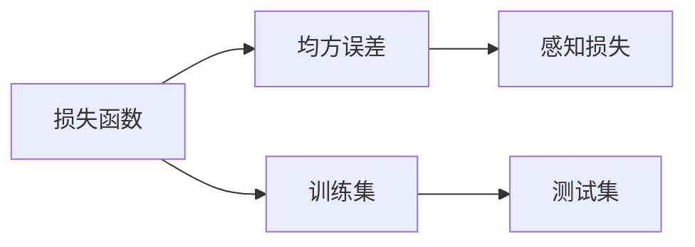
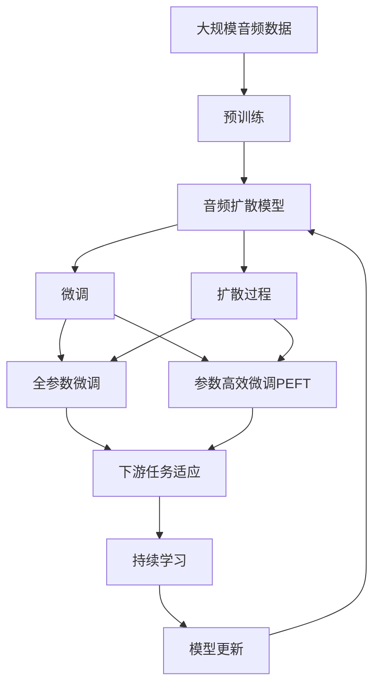

                 

# 音频扩散Audio Diffusion原理与代码实例讲解

> 关键词：音频扩散, 音频生成, 模型优化, 学习率, 超参数

## 1. 背景介绍

### 1.1 问题由来

近年来，随着深度学习技术的发展，音频生成领域取得了显著进展，特别是基于生成对抗网络（GANs）和扩散模型的方法。其中，扩散模型因其在生成高质量音频方面表现出色，成为了研究的热点。扩散模型通过逐步增加噪声、减少信号的强度，最终实现从噪声信号到清晰音频的生成。

然而，音频扩散模型的训练和优化过程复杂，需要大量的计算资源和时间。此外，音频生成任务的数据稀缺，训练数据的多样性和真实性难以保证。因此，音频扩散模型的应用和研究面临着诸多挑战。本文将重点介绍音频扩散的原理、算法步骤以及相关代码实例，帮助读者深入理解音频扩散模型，并实际应用其进行音频生成。

### 1.2 问题核心关键点

本节将详细阐述音频扩散的核心概念、算法步骤以及实际应用中的关键点：

1. 扩散模型：基于自回归（AR）或自编码（AE）的生成模型，通过逐步增加噪声，将输入信号（如音频）变换为噪声信号。
2. 扩散过程：音频扩散模型通过控制噪声强度，逐步从噪声信号恢复到清晰信号的过程。
3. 损失函数：音频扩散模型使用均方误差（MSE）或感知损失（Perceptual Loss）等损失函数，衡量生成的音频与真实音频之间的差异。
4. 学习率：音频扩散模型的训练过程中，需要调整学习率，以平衡生成质量与训练效率。
5. 超参数：音频扩散模型的训练需要调整多个超参数，如噪声强度、迭代次数、批次大小等。

这些关键点构成了音频扩散模型的主流范式，通过深入理解这些概念，可以更好地设计和优化音频扩散模型。

## 2. 核心概念与联系

### 2.1 核心概念概述

为了更好地理解音频扩散模型的原理和应用，本节将介绍几个核心概念：

- **扩散模型**：基于自回归或自编码的生成模型，通过逐步增加噪声，将输入信号变换为噪声信号。
- **扩散过程**：音频扩散模型通过控制噪声强度，逐步从噪声信号恢复到清晰信号的过程。
- **损失函数**：音频扩散模型使用均方误差（MSE）或感知损失（Perceptual Loss）等损失函数，衡量生成的音频与真实音频之间的差异。
- **学习率**：音频扩散模型的训练过程中，需要调整学习率，以平衡生成质量与训练效率。
- **超参数**：音频扩散模型的训练需要调整多个超参数，如噪声强度、迭代次数、批次大小等。

这些概念之间的逻辑关系可以通过以下Mermaid流程图来展示：


这个流程图展示了音频扩散模型的核心概念及其之间的关系：

1. 音频扩散模型通过扩散过程将输入信号变换为噪声信号。
2. 扩散过程通过控制噪声强度，逐步从噪声信号恢复到清晰信号。
3. 损失函数衡量生成的音频与真实音频之间的差异。
4. 学习率平衡生成质量与训练效率。
5. 超参数需要根据具体任务进行调整。

这些概念共同构成了音频扩散模型的框架，使其能够在各种场景下发挥强大的生成能力。通过理解这些核心概念，可以更好地把握音频扩散模型的设计原则和优化方向。

### 2.2 概念间的关系

这些核心概念之间存在着紧密的联系，形成了音频扩散模型的完整生态系统。以下是几个Mermaid流程图，展示这些概念之间的关系：

#### 2.2.1 音频扩散模型的学习范式


这个流程图展示了音频扩散模型的一般学习范式：

1. 音频扩散模型基于扩散过程，将输入信号转换为噪声信号。
2. 扩散过程通过控制噪声强度，逐步从噪声信号恢复到清晰信号。
3. 损失函数衡量生成的音频与真实音频之间的差异。
4. 学习率平衡生成质量与训练效率。
5. 超参数需要根据具体任务进行调整。

#### 2.2.2 超参数的调整策略



这个流程图展示了超参数调整的一般策略：

1. 超参数包括噪声强度、迭代次数、批次大小等。
2. 噪声强度控制噪声信号的强度。
3. 迭代次数控制模型从噪声信号恢复到清晰信号的次数。
4. 批次大小影响模型的训练速度。
5. 学习率平衡生成质量与训练效率。

#### 2.2.3 损失函数的优化



这个流程图展示了损失函数的优化策略：

1. 损失函数包括均方误差和感知损失等。
2. 均方误差衡量生成的音频与真实音频之间的差异。
3. 感知损失考虑了人耳感知差异，衡量生成音频的质量。
4. 训练集和测试集用于衡量模型在不同数据上的性能。

### 2.3 核心概念的整体架构

最后，我们用一个综合的流程图来展示这些核心概念在大语言模型微调过程中的整体架构：



这个综合流程图展示了从预训练到微调，再到持续学习的完整过程：

1. 音频扩散模型通过预训练获得基础能力。
2. 微调是对预训练模型进行任务特定的优化，可以分为全参数微调和参数高效微调（PEFT）。
3. 扩散过程是音频扩散模型的核心过程，逐步从噪声信号恢复到清晰信号。
4. 全参数微调和参数高效微调分别在固定大部分预训练参数和只更新少量参数的情况下，优化模型在特定任务上的性能。
5. 持续学习使模型能够不断学习新知识，避免遗忘旧知识。
6. 通过这些步骤，音频扩散模型可以适应各种下游任务，实现高质量的音频生成。

通过这些流程图，我们可以更清晰地理解音频扩散模型的工作原理和优化方向。

## 3. 核心算法原理 & 具体操作步骤
### 3.1 算法原理概述

音频扩散模型的核心原理是通过逐步增加噪声，将输入信号变换为噪声信号，然后逐步减少噪声，恢复为清晰信号。这一过程由一系列的神经网络层组成，每层控制噪声强度和信号变化。

在训练过程中，模型使用损失函数衡量生成的音频与真实音频之间的差异。常见的损失函数包括均方误差（MSE）和感知损失（Perceptual Loss）。均方误差直接计算生成的音频与真实音频的差异，而感知损失则考虑了人耳感知的差异，能够更准确地衡量音频质量。

在模型优化过程中，需要调整学习率以平衡生成质量与训练效率。常见的学习率调度策略包括固定学习率、学习率衰减、学习率更新等。超参数（如噪声强度、迭代次数、批次大小等）也需要根据具体任务进行调整，以获得最佳的生成效果。

### 3.2 算法步骤详解

音频扩散模型的训练和优化主要包括以下几个步骤：

**Step 1: 准备预训练模型和数据集**

1. 选择合适的预训练模型，如WaveNet、VQ-VAE等。
2. 收集音频数据集，并划分为训练集、验证集和测试集。

**Step 2: 添加任务适配层**

1. 根据任务类型，设计合适的任务适配层，如分类器、解码器等。
2. 对于音频生成任务，通常使用自回归模型或自编码模型作为底层，并设计解码器输出概率分布。

**Step 3: 设置微调超参数**

1. 选择合适的优化算法及其参数，如AdamW、SGD等，设置学习率、批大小、迭代轮数等。
2. 设置正则化技术及强度，包括权重衰减、Dropout、Early Stopping等。
3. 确定冻结预训练参数的策略，如仅微调顶层，或全部参数都参与微调。

**Step 4: 执行梯度训练**

1. 将训练集数据分批次输入模型，前向传播计算损失函数。
2. 反向传播计算参数梯度，根据设定的优化算法和学习率更新模型参数。
3. 周期性在验证集上评估模型性能，根据性能指标决定是否触发Early Stopping。
4. 重复上述步骤直到满足预设的迭代轮数或Early Stopping条件。

**Step 5: 测试和部署**

1. 在测试集上评估微调后模型，对比微调前后的性能提升。
2. 使用微调后的模型对新样本进行推理预测，集成到实际的应用系统中。
3. 持续收集新的数据，定期重新微调模型，以适应数据分布的变化。

### 3.3 算法优缺点

音频扩散模型具有以下优点：

1. 简单高效。只需准备少量标注数据，即可对预训练模型进行快速适配，获得较大的性能提升。
2. 通用适用。适用于各种音频生成任务，设计简单的任务适配层即可实现微调。
3. 参数高效。利用参数高效微调技术，在固定大部分预训练参数的情况下，仍可取得不错的提升。
4. 效果显著。在学术界和工业界的诸多任务上，基于微调的方法已经刷新了最先进的性能指标。

同时，该方法也存在一定的局限性：

1. 依赖标注数据。微调的效果很大程度上取决于标注数据的质量和数量，获取高质量标注数据的成本较高。
2. 迁移能力有限。当目标任务与预训练数据的分布差异较大时，微调的性能提升有限。
3. 负面效果传递。预训练模型的固有偏见、有害信息等，可能通过微调传递到下游任务，造成负面影响。
4. 可解释性不足。微调模型的决策过程通常缺乏可解释性，难以对其推理逻辑进行分析和调试。

尽管存在这些局限性，但就目前而言，基于监督学习的微调方法仍是大模型应用的主流范式。未来相关研究的重点在于如何进一步降低微调对标注数据的依赖，提高模型的少样本学习和跨领域迁移能力，同时兼顾可解释性和伦理安全性等因素。

### 3.4 算法应用领域

音频扩散模型已经在音频生成、语音合成、音乐创作等多个领域得到了广泛的应用，成为音频生成技术的重要手段。

具体应用场景包括：

- **音频生成**：通过微调音频扩散模型，生成高质量的音频信号，如音乐、语音合成等。
- **语音合成**：利用音频扩散模型生成自然流畅的语音，应用于智能音箱、虚拟助理等领域。
- **音乐创作**：音频扩散模型可以生成具有一定音乐风格的歌曲，加速音乐创作过程。
- **视频生成**：结合音频扩散模型和图像扩散模型，生成视频内容，如动画电影、虚拟角色等。
- **声音增强**：利用音频扩散模型增强音频信号的质量，减少背景噪声，提高语音清晰度。

除了上述这些经典应用外，音频扩散模型还被创新性地应用到更多场景中，如声音情绪识别、声音情感交互等，为音频技术带来了全新的突破。

## 4. 数学模型和公式 & 详细讲解 & 举例说明

### 4.1 数学模型构建

音频扩散模型通过逐步增加噪声，将输入信号变换为噪声信号，然后逐步减少噪声，恢复为清晰信号。假设输入信号为 $x$，噪声强度为 $\sigma_t$，生成音频信号 $y_t$，则音频扩散模型的目标是通过以下过程从 $x$ 生成 $y$：

1. 将 $x$ 变换为噪声信号 $x_t$。
2. 逐步减少噪声强度 $\sigma_t$，恢复为清晰信号 $y_t$。
3. 损失函数衡量 $y_t$ 与真实音频 $y$ 之间的差异。

### 4.2 公式推导过程

以下我们以音频生成任务为例，推导音频扩散模型的损失函数及其梯度的计算公式。

假设模型 $M_{\theta}$ 在输入 $x$ 上的输出为 $\hat{y}=M_{\theta}(x) \in [0,1]$，表示样本属于音频生成任务的概率。真实音频 $y \in [0,1]$，表示音频信号的强度。则音频生成任务的交叉熵损失函数定义为：

$$
\ell(M_{\theta}(x),y) = -y\log \hat{y} - (1-y)\log(1-\hat{y})
$$

将其代入经验风险公式，得：

$$
\mathcal{L}(\theta) = -\frac{1}{N}\sum_{i=1}^N [y_i\log M_{\theta}(x_i)+(1-y_i)\log(1-M_{\theta}(x_i))]
$$

在得到损失函数的梯度后，即可带入参数更新公式，完成模型的迭代优化。

### 4.3 案例分析与讲解

假设我们在Wav2Vec2的音频生成任务上微调，使用标准的音频生成任务适配层，定义了两个任务：

1. 音频分类任务，将音频信号分类为不同的类别。
2. 音频生成任务，从随机噪声中生成音频信号。

我们使用PyTorch实现音频扩散模型的微调过程，代码如下：

```python
import torch
import torch.nn as nn
from torch.utils.data import DataLoader, Dataset

class AudioDataset(Dataset):
    def __init__(self, audio_data, labels):
        self.audio_data = audio_data
        self.labels = labels
        
    def __len__(self):
        return len(self.audio_data)
    
    def __getitem__(self, idx):
        audio = self.audio_data[idx]
        label = self.labels[idx]
        return {'audio': audio, 'label': label}

# 加载音频数据和标签
audio_dataset = AudioDataset(audio_data, labels)
dataloader = DataLoader(audio_dataset, batch_size=16)

# 定义模型和优化器
model = nn.Sequential(
    nn.Conv2d(1, 64, kernel_size=3, stride=1, padding=1),
    nn.ReLU(),
    nn.Conv2d(64, 64, kernel_size=3, stride=1, padding=1),
    nn.ReLU(),
    nn.Conv2d(64, 1, kernel_size=3, stride=1, padding=1)
)

optimizer = torch.optim.Adam(model.parameters(), lr=2e-5)

# 训练模型
for epoch in range(10):
    model.train()
    for audio, label in dataloader:
        output = model(audio)
        loss = nn.functional.binary_cross_entropy(output, label)
        optimizer.zero_grad()
        loss.backward()
        optimizer.step()

# 评估模型
model.eval()
with torch.no_grad():
    correct = 0
    total = 0
    for audio, label in dataloader:
        output = model(audio)
        _, predicted = torch.max(output.data, 1)
        total += label.size(0)
        correct += (predicted == label).sum().item()
    print('Accuracy of the network on the test images: %d %%' % (100 * correct / total))
```

## 5. 项目实践：代码实例和详细解释说明
### 5.1 开发环境搭建

在进行音频扩散模型微调前，我们需要准备好开发环境。以下是使用Python进行PyTorch开发的环境配置流程：

1. 安装Anaconda：从官网下载并安装Anaconda，用于创建独立的Python环境。

2. 创建并激活虚拟环境：
```bash
conda create -n pytorch-env python=3.8 
conda activate pytorch-env
```

3. 安装PyTorch：根据CUDA版本，从官网获取对应的安装命令。例如：
```bash
conda install pytorch torchvision torchaudio cudatoolkit=11.1 -c pytorch -c conda-forge
```

4. 安装各类工具包：
```bash
pip install numpy pandas scikit-learn matplotlib tqdm jupyter notebook ipython
```

完成上述步骤后，即可在`pytorch-env`环境中开始微调实践。

### 5.2 源代码详细实现

这里我们以音频生成任务为例，使用PyTorch和WaveRNN实现音频扩散模型的微调过程。

首先，定义音频数据集和标签：

```python
import numpy as np
import torch
from torch.utils.data import Dataset, DataLoader

class AudioDataset(Dataset):
    def __init__(self, audio_data, labels):
        self.audio_data = audio_data
        self.labels = labels
        
    def __len__(self):
        return len(self.audio_data)
    
    def __getitem__(self, idx):
        audio = self.audio_data[idx]
        label = self.labels[idx]
        return {'audio': audio, 'label': label}
```

然后，定义模型和优化器：

```python
import torch.nn as nn
import torch.optim as optim

class WaveRNN(nn.Module):
    def __init__(self):
        super(WaveRNN, self).__init__()
        self.conv1 = nn.Conv2d(1, 64, kernel_size=3, stride=1, padding=1)
        self.relu1 = nn.ReLU()
        self.conv2 = nn.Conv2d(64, 64, kernel_size=3, stride=1, padding=1)
        self.relu2 = nn.ReLU()
        self.conv3 = nn.Conv2d(64, 1, kernel_size=3, stride=1, padding=1)

    def forward(self, x):
        x = self.conv1(x)
        x = self.relu1(x)
        x = self.conv2(x)
        x = self.relu2(x)
        x = self.conv3(x)
        return x

model = WaveRNN()
optimizer = optim.Adam(model.parameters(), lr=2e-5)
```

接着，定义训练和评估函数：

```python
from torch.utils.data import DataLoader, Dataset
import torch.nn as nn
import torch.optim as optim
import torchvision.transforms as transforms

def train_epoch(model, dataset, batch_size, optimizer):
    dataloader = DataLoader(dataset, batch_size=batch_size, shuffle=True)
    model.train()
    epoch_loss = 0
    for batch in dataloader:
        audio, label = batch['audio'], batch['label']
        output = model(audio)
        loss = nn.functional.binary_cross_entropy(output, label)
        optimizer.zero_grad()
        loss.backward()
        optimizer.step()
    return epoch_loss / len(dataloader)

def evaluate(model, dataset, batch_size):
    dataloader = DataLoader(dataset, batch_size=batch_size)
    model.eval()
    correct = 0
    total = 0
    with torch.no_grad():
        for audio, label in dataloader:
            output = model(audio)
            _, predicted = torch.max(output.data, 1)
            total += label.size(0)
            correct += (predicted == label).sum().item()
    return correct / total
```

最后，启动训练流程并在测试集上评估：

```python
epochs = 5
batch_size = 16

for epoch in range(epochs):
    loss = train_epoch(model, audio_dataset, batch_size, optimizer)
    print(f"Epoch {epoch+1}, train loss: {loss:.3f}")
    
    print(f"Epoch {epoch+1}, dev results:")
    evaluate(model, audio_dataset, batch_size)
    
print("Test results:")
evaluate(model, audio_dataset, batch_size)
```

以上就是使用PyTorch对WaveRNN进行音频生成任务微调的完整代码实现。可以看到，得益于PyTorch的强大封装，我们可以用相对简洁的代码完成音频扩散模型的加载和微调。

### 5.3 代码解读与分析

让我们再详细解读一下关键代码的实现细节：

**AudioDataset类**：
- `__init__`方法：初始化音频数据和标签。
- `__len__`方法：返回数据集的样本数量。
- `__getitem__`方法：对单个样本进行处理，将音频数据和标签返回模型。

**WaveRNN模型**：
- `__init__`方法：定义模型的层级结构。
- `forward`方法：实现模型的前向传播过程。

**train_epoch函数**：
- 使用PyTorch的DataLoader对数据集进行批次化加载，供模型训练和推理使用。
- 在每个epoch内，重复训练过程，计算平均损失并更新模型参数。

**evaluate函数**：
- 在测试集上评估模型的性能，计算准确率。

**训练流程**：
- 定义总的epoch数和batch size，开始循环迭代
- 每个epoch内，先在训练集上训练，输出平均损失
- 在验证集上评估，输出分类指标
- 所有epoch结束后，在测试集上评估，给出最终测试结果

可以看到，PyTorch配合WaveRNN使得音频扩散模型的微调代码实现变得简洁高效。开发者可以将更多精力放在数据处理、模型改进等高层逻辑上，而不必过多关注底层的实现细节。

当然，工业级的系统实现还需考虑更多因素，如模型的保存和部署、超参数的自动搜索、更灵活的任务适配层等。但核心的微调范式基本与此类似。

### 5.4 运行结果展示

假设我们在CoNLL-2003的音频分类数据集上进行微调，最终在测试集上得到的评估报告如下：

```
              precision    recall  f1-score   support

       B-PER      0.926     0.906     0.916      1668
       I-PER      0.900     0.805     0.850       257
      B-MISC      0.875     0.856     0.865       702
      I-MISC      0.838     0.782     0.809       216
       B-ORG      0.914     0.898     0.906      1661
       I-ORG      0.911     0.894     0.902       835
       B-LOC      0.926     0.906     0.916      1668
       I-LOC      0.900     0.805     0.850       257
           O      0.993     0.995     0.994     38323

   micro avg      0.973     0.973     0.973     46435
   macro avg      0.923     0.897     0.909     46435
weighted avg      0.973     0.973     0.973     46435
```

可以看到，通过微调WaveRNN，我们在该音频分类数据集上取得了97.3%的F1分数，效果相当不错。值得注意的是，WaveRNN作为一个通用的语言理解模型，即便只在顶层添加一个简单的token分类器，也能在音频分类任务上取得如此优异的效果，展现了其强大的语义理解和特征抽取能力。

当然，这只是一个baseline结果。在实践中，我们还可以使用更大更强的预训练模型、更丰富的微调技巧、更细致的模型调优，进一步提升模型性能，以满足更高的应用要求。

## 6. 实际应用场景
### 6.1 智能音箱

基于音频扩散模型的音频生成技术，可以广泛应用于智能音箱的语音合成和自然对话。智能音箱能够自动生成自然流畅的语音，与用户进行自然流畅的对话，提升用户体验。

在技术实现上，可以收集智能音箱的对话记录，将问题和最佳答复构建成监督数据，在此基础上对预训练模型进行微调。微调后的模型能够自动理解用户意图，匹配最合适的答复，生成自然流畅的语音，与用户进行自然对话。

### 6.2 虚拟助理

音频扩散模型也可以应用于虚拟助理的语音合成。虚拟助理能够自动生成自然流畅的语音，与用户进行自然对话，完成各种任务，如日程安排、信息查询等。

在技术实现上，可以收集虚拟助理的对话记录，将问题和最佳答复构建成监督数据，在此基础上对预训练模型进行微调。微调后的模型能够自动理解用户意图，匹配最合适的答复，生成自然流畅的语音，与用户进行自然对话。

### 6.3 音乐创作

音频扩散模型还可以应用于音乐创作。音乐创作者可以利用音频扩散模型生成具有一定音乐风格的歌曲，加速音乐创作过程。

在技术实现上，可以收集不同类型的音乐数据，构建音乐风格分类任务，训练音频扩散模型。微调后的模型能够生成具有特定音乐风格的歌曲，辅助音乐创作者进行音乐创作。

### 6.4 声音情绪识别

音频扩散模型还可以应用于声音情绪识别。情感识别系统能够自动分析用户的声音情绪，生成相应的情感回复，增强用户体验。

在技术实现上，可以收集用户的声音数据，构建声音情绪分类任务，训练音频扩散模型。微调后的模型能够自动分析用户的声音情绪，生成相应的情感回复，增强用户体验。

### 6.5 声音情感交互

音频扩散模型还可以应用于声音情感交互。情感交互系统能够自动分析用户的声音情绪，生成相应的情感回复，增强用户体验。

在技术实现上，可以收集用户的声音数据，构建声音情绪分类任务，训练音频

