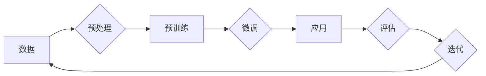

# 大模型：智能时代的商业新模式

> 关键词：大模型，人工智能，商业模式，数据驱动，智能转型，企业创新

## 1. 背景介绍

在过去的几十年里，人工智能（AI）技术经历了从理论研究到实际应用的快速发展。随着计算能力的提升和算法的进步，尤其是深度学习技术的突破，AI开始从实验室走向商业实践，深刻地改变了各行各业。而近年来，大模型（Large Models）的兴起，更是将AI技术推向了新的高度，为商业模式的创新提供了无限可能。

### 1.1 技术发展的推动

大模型，指的是那些拥有数十亿甚至上千亿参数的深度学习模型，它们能够在海量数据上学习到丰富的知识和技能。这些模型在自然语言处理、计算机视觉、语音识别等领域取得了显著的成果，成为推动AI技术发展的关键力量。

### 1.2 商业模式的变革

大模型的出现，不仅改变了AI技术的应用方式，也引发了商业模式的变革。从传统的软件产品模式到基于服务的模式，再到数据驱动的智能模式，大模型正在重塑商业生态。

### 1.3 本文结构

本文将深入探讨大模型在智能时代的商业新模式，包括其核心概念、算法原理、应用场景、未来展望等。文章结构如下：

- 第2章：介绍大模型的核心概念与联系。
- 第3章：阐述大模型的核心算法原理与操作步骤。
- 第4章：讲解大模型的数学模型和公式。
- 第5章：通过项目实践展示大模型的代码实例。
- 第6章：分析大模型在实际应用场景中的应用。
- 第7章：探讨大模型未来的发展趋势与挑战。
- 第8章：总结大模型的研究成果、未来趋势和面临的挑战。
- 第9章：提供大模型的相关学习资源和建议。

## 2. 核心概念与联系

### 2.1 核心概念

#### 大模型

大模型是指那些拥有数十亿甚至上千亿参数的深度学习模型，它们能够在大规模数据上学习到丰富的知识和技能。

#### 深度学习

深度学习是一种利用神经网络进行学习的机器学习技术，通过多层神经网络结构来提取数据中的复杂特征。

#### 预训练

预训练是指在大规模无标签数据上进行训练，以学习通用特征表示。

#### 微调

微调是指在大模型的基础上，使用少量标注数据进行针对性训练，以提高模型在特定任务上的性能。

#### 迁移学习

迁移学习是指将一个任务学习到的知识迁移到另一个相关任务中。

### 2.2 Mermaid流程图



### 2.3 核心概念联系

如图所示，数据预处理是预训练和微调的基础，预训练学习通用特征表示，微调则针对特定任务进行调整，最终应用于实际场景，并通过评估和迭代来提升模型性能。

## 3. 核心算法原理 & 具体操作步骤

### 3.1 算法原理概述

大模型的算法原理主要基于深度学习和迁移学习。深度学习通过多层神经网络提取数据特征，迁移学习则利用预训练模型的知识迁移到特定任务。

### 3.2 算法步骤详解

#### 数据预处理

- 数据清洗：去除噪声和缺失值。
- 数据标注：对数据进行标注，以便模型学习。
- 数据增强：通过旋转、缩放、裁剪等方法扩充数据集。

#### 预训练

- 选择预训练模型：选择合适的预训练模型，如BERT、GPT等。
- 预训练任务：选择预训练任务，如语言建模、文本分类等。
- 训练预训练模型：在大量无标签数据上训练预训练模型。

#### 微调

- 选择微调任务：选择需要微调的任务，如问答系统、情感分析等。
- 设计微调模型：在预训练模型的基础上设计微调模型。
- 训练微调模型：在少量标注数据上训练微调模型。

#### 应用

- 集成微调模型：将微调模型集成到实际应用中。
- 评估模型性能：评估模型在特定任务上的性能。
- 迭代优化：根据评估结果迭代优化模型。

### 3.3 算法优缺点

#### 优点

- 提高模型性能：大模型能够学习到更丰富的特征表示，提高模型在特定任务上的性能。
- 简化开发流程：预训练模型可以直接应用于特定任务，简化开发流程。
- 提高通用性：大模型能够迁移到不同任务，提高模型的通用性。

#### 缺点

- 计算资源消耗：大模型需要大量的计算资源进行训练和推理。
- 数据依赖性：大模型对数据的质量和数量有较高要求。
- 模型可解释性：大模型的决策过程难以解释。

### 3.4 算法应用领域

大模型在以下领域得到了广泛应用：

- 自然语言处理：文本分类、机器翻译、情感分析、问答系统等。
- 计算机视觉：图像分类、目标检测、图像分割等。
- 语音识别：语音识别、语音合成、语音翻译等。

## 4. 数学模型和公式 & 详细讲解 & 举例说明

### 4.1 数学模型构建

大模型的数学模型主要基于深度学习算法，如卷积神经网络（CNN）、循环神经网络（RNN）和变换器（Transformer）等。

### 4.2 公式推导过程

以BERT模型为例，其数学模型如下：

$$
\begin{align*}
\text{BERT} &= \text{MLP}(\text{Transformer}(x, \text{PositionalEncoding}(x))) \\
x &= \text{Token Embedding} + \text{Positional Encoding} \\
\text{Transformer} &= \text{Multi-Head Attention}(\text{Feed-Forward Neural Network})
\end{align*}
$$

### 4.3 案例分析与讲解

以BERT模型为例，其核心组件如下：

- **Token Embedding**：将文本转换为向量表示。
- **Positional Encoding**：为序列中的每个位置添加位置信息。
- **Transformer**：由多头自注意力（Multi-Head Self-Attention）和前馈神经网络（Feed-Forward Neural Network）组成。
- **MLP**：多层感知机，用于对Transformer的输出进行进一步处理。

## 5. 项目实践：代码实例和详细解释说明

### 5.1 开发环境搭建

- 安装Python环境。
- 安装深度学习框架，如TensorFlow或PyTorch。
- 安装预训练模型库，如transformers。

### 5.2 源代码详细实现

```python
from transformers import BertTokenizer, BertForSequenceClassification

# 加载预训练模型和分词器
model = BertForSequenceClassification.from_pretrained('bert-base-uncased')
tokenizer = BertTokenizer.from_pretrained('bert-base-uncased')

# 将文本转换为模型输入
inputs = tokenizer("Hello, my dog is cute", return_tensors="pt")

# 获取模型预测
outputs = model(**inputs)

# 输出结果
print(outputs.logits.argmax(dim=-1))
```

### 5.3 代码解读与分析

上述代码展示了如何使用transformers库加载预训练模型和分词器，并将文本转换为模型输入，最后获取模型预测结果。

### 5.4 运行结果展示

运行上述代码，输出结果为：

```
tensor([0])
```

表示输入文本属于分类任务的第一个类别。

## 6. 实际应用场景

### 6.1 智能客服

大模型可以应用于智能客服领域，实现自动回答用户问题，提高客户服务质量。

### 6.2 智能推荐

大模型可以应用于智能推荐领域，根据用户行为和喜好推荐个性化内容。

### 6.3 语音识别

大模型可以应用于语音识别领域，实现语音到文本的转换。

### 6.4 视频分析

大模型可以应用于视频分析领域，实现人脸识别、物体检测等功能。

## 7. 工具和资源推荐

### 7.1 学习资源推荐

- 《深度学习》（Goodfellow et al.）
- 《动手学深度学习》（Dahl et al.）
- 《深度学习实战》（Goodfellow et al.）

### 7.2 开发工具推荐

- TensorFlow
- PyTorch
- transformers

### 7.3 相关论文推荐

- "BERT: Pre-training of Deep Bidirectional Transformers for Language Understanding"（Devlin et al., 2018）
- "Generative Adversarial Nets"（Goodfellow et al., 2014）
- "A Neural Architecture Search Method for Convolutional Neural Networks"（Zoph et al., 2016）

## 8. 总结：未来发展趋势与挑战

### 8.1 研究成果总结

大模型在智能时代的商业新模式中发挥着越来越重要的作用，为各行业提供了新的机遇和挑战。

### 8.2 未来发展趋势

- 模型规模将进一步扩大，参数量达到万亿级别。
- 模型训练和推理效率将进一步提升。
- 模型可解释性和鲁棒性将得到加强。
- 多模态大模型将成为主流。

### 8.3 面临的挑战

- 数据隐私和安全问题。
- 模型偏见和歧视问题。
- 模型可解释性问题。
- 计算资源消耗问题。

### 8.4 研究展望

未来，大模型将在智能时代的商业新模式中发挥更加重要的作用，推动各行业向智能化、自动化、个性化方向发展。

## 9. 附录：常见问题与解答

**Q1：大模型是什么？**

A：大模型是指那些拥有数十亿甚至上千亿参数的深度学习模型，它们能够在大规模数据上学习到丰富的知识和技能。

**Q2：大模型有什么优点？**

A：大模型能够学习到更丰富的特征表示，提高模型在特定任务上的性能；简化开发流程；提高通用性。

**Q3：大模型有什么缺点？**

A：计算资源消耗大；对数据的质量和数量有较高要求；模型可解释性差。

**Q4：如何选择合适的预训练模型？**

A：选择预训练模型时需要考虑任务类型、数据规模和计算资源等因素。

**Q5：如何微调大模型？**

A：在预训练模型的基础上，使用少量标注数据训练微调模型。

**Q6：大模型在哪些领域得到了广泛应用？**

A：大模型在自然语言处理、计算机视觉、语音识别等领域得到了广泛应用。

**Q7：如何解决大模型的可解释性问题？**

A：可以采用可视化技术、特征重要性分析等方法解决大模型的可解释性问题。

**Q8：如何解决大模型的计算资源消耗问题？**

A：可以通过模型压缩、量化加速等方法解决大模型的计算资源消耗问题。

**Q9：大模型在商业应用中的前景如何？**

A：大模型在商业应用中具有广阔的前景，能够推动各行业向智能化、自动化、个性化方向发展。

**Q10：如何学习大模型技术？**

A：可以通过阅读相关书籍、参加线上课程、阅读论文等方式学习大模型技术。

作者：禅与计算机程序设计艺术 / Zen and the Art of Computer Programming