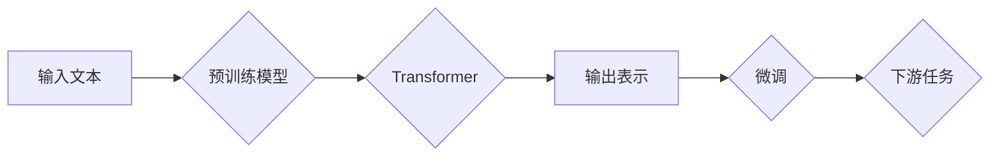

> 关键词：大语言模型，预训练，Transformer，BERT，微调，代码实例，NLP

# 大语言模型原理与代码实例讲解

大语言模型（Large Language Models, LLMs）是自然语言处理（Natural Language Processing, NLP）领域的一项革命性技术。它们通过在庞大的文本语料库上进行预训练，学习到了丰富的语言知识，能够进行各种复杂的语言任务，如文本分类、问答系统、机器翻译等。本文将深入探讨大语言模型的原理，并通过代码实例展示如何实现和部署这些模型。

## 1. 背景介绍

近年来，随着计算能力的提升和深度学习技术的发展，大语言模型取得了显著的进步。这些模型通过在互联网上的海量文本上训练，学习到了语言的模式和结构，从而能够理解和生成自然语言。

## 2. 核心概念与联系

### 2.1 核心概念

- **预训练（Pre-training）**：在特定任务之前，在大量无标注数据上训练模型，使其学习到通用语言知识。
- **Transformer（变换器）**：一种基于自注意力机制的深度神经网络架构，广泛应用于NLP任务中。
- **BERT（双向编码器表示Transformer）**：一种基于Transformer的预训练语言表示模型，能够捕捉上下文信息。
- **微调（Fine-tuning）**：在预训练模型的基础上，使用特定任务的标注数据进行训练，以适应特定任务。
- **下游任务（Downstream Task）**：在大语言模型上应用预训练模型，解决具体的NLP问题，如文本分类、命名实体识别等。

### 2.2 架构流程图



## 3. 核心算法原理 & 具体操作步骤

### 3.1 算法原理概述

大语言模型通常由预训练和微调两个阶段组成。在预训练阶段，模型学习到通用的语言表示；在微调阶段，模型根据具体任务进行调整。

### 3.2 算法步骤详解

1. **预训练**：在无标注数据上训练模型，学习通用的语言知识。
2. **微调**：使用特定任务的标注数据，调整模型参数，使其适应特定任务。
3. **下游任务**：使用微调后的模型解决具体的NLP问题。

### 3.3 算法优缺点

**优点**：

- **强大的语言理解能力**：能够理解复杂的语言结构。
- **多任务学习能力**：能够同时处理多个NLP任务。
- **泛化能力强**：能够适应不同的任务和数据。

**缺点**：

- **训练成本高**：需要大量的计算资源和数据。
- **模型复杂度高**：难以理解和解释。

### 3.4 算法应用领域

大语言模型可以应用于各种NLP任务，包括：

- 文本分类
- 命名实体识别
- 问答系统
- 机器翻译
- 情感分析
- 自动摘要

## 4. 数学模型和公式 & 详细讲解 & 举例说明

### 4.1 数学模型构建

大语言模型通常基于Transformer模型。Transformer模型是一种基于自注意力机制的深度神经网络架构。

### 4.2 公式推导过程

$$
\text{self-attention} = \text{softmax}\left(\frac{\text{Q} \cdot \text{K}^T}{\sqrt{d_k}}\right) \cdot \text{V}
$$

其中，Q、K、V 分别是查询、键、值矩阵，d_k 是键的维度。

### 4.3 案例分析与讲解

以下是一个简单的Transformer模型代码示例：

```python
import torch
import torch.nn as nn

class TransformerModel(nn.Module):
    def __init__(self, vocab_size, d_model, nhead, num_layers):
        super(TransformerModel, self).__init__()
        self.embedding = nn.Embedding(vocab_size, d_model)
        self.transformer = nn.Transformer(d_model, nhead, num_layers)
        self.fc = nn.Linear(d_model, vocab_size)

    def forward(self, src):
        src = self.embedding(src)
        output = self.transformer(src)
        output = self.fc(output)
        return output
```

## 5. 项目实践：代码实例和详细解释说明

### 5.1 开发环境搭建

为了运行以下代码，需要安装PyTorch和Transformers库。

```bash
pip install torch transformers
```

### 5.2 源代码详细实现

以下是一个使用BERT模型进行文本分类的示例：

```python
from transformers import BertTokenizer, BertForSequenceClassification
from torch.utils.data import DataLoader, RandomSampler, SequentialSampler
from torch.optim import AdamW

# 加载预训练的BERT模型和分词器
tokenizer = BertTokenizer.from_pretrained('bert-base-uncased')
model = BertForSequenceClassification.from_pretrained('bert-base-uncased')

# 准备数据
train_texts = ["This is a great movie", "This movie is terrible"]
train_labels = [1, 0]

# 编码数据
train_encodings = tokenizer(train_texts, truncation=True, padding=True, return_tensors='pt')

# 创建数据加载器
train_loader = DataLoader(train_encodings, sampler=RandomSampler(train_encodings))

# 定义优化器
optimizer = AdamW(model.parameters(), lr=5e-5)

# 训练模型
for epoch in range(3):
    for batch in train_loader:
        optimizer.zero_grad()
        outputs = model(**batch)
        loss = outputs.loss
        loss.backward()
        optimizer.step()
```

### 5.3 代码解读与分析

这段代码演示了如何使用PyTorch和Transformers库加载预训练的BERT模型，进行文本分类任务。首先，我们加载了预训练的BERT模型和分词器。然后，我们准备了一些文本和对应的标签，并将这些数据编码为BERT模型所需的格式。接下来，我们创建了一个数据加载器，用于迭代训练数据。最后，我们定义了优化器，并开始训练模型。

### 5.4 运行结果展示

运行上述代码后，模型将在训练数据上进行训练。训练结束后，模型可以在测试数据上进行评估，以检查其性能。

## 6. 实际应用场景

大语言模型在实际应用中有着广泛的应用，以下是一些例子：

- **问答系统**：使用BERT模型构建问答系统，能够理解用户的问题，并从知识库中检索出合适的答案。
- **机器翻译**：使用BERT模型构建机器翻译系统，能够将一种语言的文本翻译成另一种语言。
- **文本摘要**：使用BERT模型构建文本摘要系统，能够自动生成文本的摘要。

## 7. 工具和资源推荐

### 7.1 学习资源推荐

- 《Deep Learning for Natural Language Processing》
- 《Natural Language Processing with Python》
- 《BERT: Pre-training of Deep Bidirectional Transformers for Language Understanding》

### 7.2 开发工具推荐

- PyTorch
- Transformers库
- Hugging Face

### 7.3 相关论文推荐

- Attention is All You Need
- BERT: Pre-training of Deep Bidirectional Transformers for Language Understanding

## 8. 总结：未来发展趋势与挑战

### 8.1 研究成果总结

大语言模型在NLP领域取得了显著的成果，为各种NLP任务提供了强大的工具。

### 8.2 未来发展趋势

- 模型规模将越来越大，能够处理更复杂的任务。
- 微调技术将更加高效，减少对标注数据的依赖。
- 模型将更加可解释，提高用户信任度。

### 8.3 面临的挑战

- 训练成本高，需要大量的计算资源和数据。
- 模型复杂度高，难以理解和解释。
- 模型可能存在偏见，需要采取措施消除。

### 8.4 研究展望

大语言模型将继续在NLP领域发挥重要作用，并推动其他领域的发展。

## 9. 附录：常见问题与解答

**Q1：大语言模型是如何工作的？**

A：大语言模型通过在大量文本语料库上进行预训练，学习到了丰富的语言知识，从而能够理解和生成自然语言。

**Q2：大语言模型的优点和缺点是什么？**

A：优点是强大的语言理解能力和多任务学习能力；缺点是训练成本高和模型复杂度高。

**Q3：如何使用大语言模型进行下游任务？**

A：在预训练模型的基础上，使用特定任务的标注数据进行微调，使其适应特定任务。

**Q4：大语言模型有哪些应用场景？**

A：大语言模型可以应用于问答系统、机器翻译、文本摘要等NLP任务。

**Q5：如何降低大语言模型的训练成本？**

A：可以使用更高效的模型架构、更有效的训练算法和更丰富的预训练数据。

作者：禅与计算机程序设计艺术 / Zen and the Art of Computer Programming