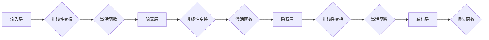

# 大语言模型应用指南：什么是神经网络

> 关键词：神经网络，深度学习，人工神经网络，深度神经网络，激活函数，反向传播，前向传播，学习率，参数优化，机器学习

## 1. 背景介绍

随着人工智能技术的飞速发展，深度学习成为了机器学习领域的一大突破。而神经网络作为深度学习的基础，已经在图像识别、自然语言处理、语音识别等多个领域取得了显著成果。本文将深入探讨神经网络的原理、应用以及未来发展趋势。

## 2. 核心概念与联系

### 2.1 核心概念

**神经网络**：由大量相互连接的神经元组成的信息处理系统，能够通过学习数据集来提取特征和模式，从而进行预测或分类。

**深度神经网络**：包含多层隐藏层的神经网络，能够学习更复杂的特征和模式。

**激活函数**：对神经元输出进行非线性变换，使神经网络具备非线性学习能力。

**反向传播**：一种用于计算神经网络参数梯度的算法，是神经网络训练的核心。

**前向传播**：数据从输入层流向输出层的计算过程。

**学习率**：反向传播算法中用于控制参数更新步长的参数。

**参数优化**：通过优化算法调整神经网络参数，使其在给定数据集上取得更好的性能。

### 2.2 架构的 Mermaid 流程图



## 3. 核心算法原理 & 具体操作步骤

### 3.1 算法原理概述

神经网络通过前向传播和反向传播两个步骤来学习数据：

- **前向传播**：将输入数据传入网络，经过每层神经元的非线性变换和激活函数处理后，最终输出预测结果。
- **反向传播**：根据预测结果和真实标签计算损失函数，然后通过反向传播算法计算每一层神经元的梯度，用于更新网络参数。

### 3.2 算法步骤详解

1. **初始化参数**：随机初始化网络权重和偏置。
2. **前向传播**：将输入数据传入网络，计算预测结果。
3. **计算损失**：使用损失函数计算预测结果与真实标签之间的差异。
4. **反向传播**：计算损失函数关于网络参数的梯度。
5. **参数更新**：根据梯度更新网络参数。
6. **重复步骤2-5**：直到满足停止条件（如迭代次数、损失函数收敛等）。

### 3.3 算法优缺点

**优点**：
- 能够学习复杂的特征和模式。
- 不需要手动设计特征提取器。
- 可以处理非线性问题。

**缺点**：
- 计算复杂度高，需要大量计算资源。
- 对初始化参数敏感。
- 过拟合风险较高。

### 3.4 算法应用领域

- 图像识别
- 自然语言处理
- 语音识别
- 机器翻译
- 机器人控制
- 金融市场分析

## 4. 数学模型和公式 & 详细讲解 & 举例说明

### 4.1 数学模型构建

神经网络可以用以下数学模型表示：

$$
y = f(W \cdot x + b)
$$

其中，$y$ 为输出，$x$ 为输入，$W$ 为权重矩阵，$b$ 为偏置向量，$f$ 为激活函数。

### 4.2 公式推导过程

以全连接神经网络为例，其输出层的损失函数可以表示为：

$$
L = \frac{1}{2} \sum_{i=1}^N (y_i - \hat{y}_i)^2
$$

其中，$N$ 为样本数量，$y_i$ 为真实标签，$\hat{y}_i$ 为预测结果。

### 4.3 案例分析与讲解

以下是一个简单的神经网络示例，用于实现二分类任务。

输入层：包含两个神经元，分别代表特征 $x_1$ 和 $x_2$。

隐藏层：包含一个神经元，使用ReLU激活函数。

输出层：包含一个神经元，使用Sigmoid激活函数。

损失函数：二元交叉熵损失。

初始化参数：随机初始化权重和偏置。

训练过程：

1. 前向传播：计算预测结果。
2. 计算损失。
3. 反向传播：计算梯度。
4. 更新参数。

通过迭代训练，模型将学习到特征 $x_1$ 和 $x_2$ 之间的关系，并能够对新的样本进行分类。

## 5. 项目实践：代码实例和详细解释说明

### 5.1 开发环境搭建

- 安装Python和NumPy库。

### 5.2 源代码详细实现

以下是一个简单的神经网络实现：

```python
import numpy as np

# 定义激活函数
def sigmoid(x):
    return 1 / (1 + np.exp(-x))

# 定义反向传播算法
def backpropagation(x, y, W, b):
    # 计算预测结果
    y_pred = sigmoid(np.dot(x, W) + b)
    # 计算损失
    loss = 0.5 * (y_pred - y) ** 2
    # 计算梯度
    dW = (y_pred - y) * x
    db = (y_pred - y)
    return loss, dW, db

# 定义参数更新
def update_params(W, b, dW, db, learning_rate):
    W -= learning_rate * dW
    b -= learning_rate * db
    return W, b

# 初始化参数
x = np.array([1, 2])
y = np.array([0])
W = np.random.randn(1, 2)
b = np.random.randn(1, 1)
learning_rate = 0.01

# 训练过程
for epoch in range(100):
    loss, dW, db = backpropagation(x, y, W, b)
    W, b = update_params(W, b, dW, db, learning_rate)
    print(f"Epoch {epoch+1}, Loss: {loss:.4f}")

# 预测
print(f"Predict: {sigmoid(np.dot(x, W) + b):.4f}")
```

### 5.3 代码解读与分析

上述代码实现了一个简单的神经网络，用于实现二分类任务。代码主要分为以下几个部分：

- `sigmoid` 函数：实现Sigmoid激活函数。
- `backpropagation` 函数：计算损失、梯度，并更新参数。
- `update_params` 函数：根据梯度和学习率更新参数。
- 初始化参数：设置初始权重、偏置和学习率。
- 训练过程：迭代训练模型，更新参数。
- 预测：使用训练好的模型对新的样本进行预测。

通过运行上述代码，我们可以看到模型在训练过程中损失逐渐减小，最终能够对新的样本进行预测。

## 6. 实际应用场景

神经网络在实际应用场景中取得了显著成果，以下是一些典型的应用案例：

- **图像识别**：使用卷积神经网络(CNN)识别图像中的对象。
- **自然语言处理**：使用循环神经网络(RNN)和长短时记忆网络(LSTM)进行文本处理。
- **语音识别**：使用深度神经网络将语音信号转换为文本。
- **推荐系统**：使用神经网络分析用户行为，进行个性化推荐。
- **医疗诊断**：使用神经网络分析医学图像，辅助医生进行疾病诊断。

## 7. 工具和资源推荐

### 7.1 学习资源推荐

- 《深度学习》：Goodfellow、Bengio和Courville合著，是深度学习领域的经典教材。
- 《神经网络与深度学习》：邱锡鹏著，深入浅出地介绍了神经网络和深度学习的基本概念。
- fast.ai：fast.ai提供了一系列免费在线课程，适合初学者快速入门深度学习。

### 7.2 开发工具推荐

- TensorFlow：Google开源的深度学习框架，拥有丰富的功能和生态。
- PyTorch：由Facebook开源的深度学习框架，易于使用且具有动态计算图。
- Keras：用于构建和训练深度学习模型的Python库，与TensorFlow和PyTorch兼容。

### 7.3 相关论文推荐

- "A Few Useful Things to Know about Machine Learning"：Goodfellow等人撰写的综述文章，介绍了机器学习的基本概念和常见问题。
- "Deep Learning for Computer Vision with Python"：François Chollet撰写的教材，介绍了深度学习在计算机视觉领域的应用。
- "Sequence to Sequence Learning with Neural Networks"：Sutskever等人撰写的论文，介绍了神经网络在序列到序列学习中的应用。

## 8. 总结：未来发展趋势与挑战

### 8.1 研究成果总结

神经网络作为一种强大的机器学习模型，在众多领域取得了显著的成果。然而，神经网络仍面临着一些挑战，如过拟合、计算复杂度等。

### 8.2 未来发展趋势

- 模型轻量化：开发更加轻量级的神经网络模型，降低计算成本。
- 可解释性：提高神经网络的可解释性，使其决策过程更加透明。
- 多模态学习：实现多模态数据的融合，提高模型对现实世界的理解能力。
- 强化学习：将强化学习与神经网络相结合，实现更加智能的决策。

### 8.3 面临的挑战

- 过拟合：提高神经网络的泛化能力，防止过拟合。
- 计算复杂度：降低神经网络的计算复杂度，使其在资源受限的设备上运行。
- 数据隐私：保护用户隐私，防止数据泄露。
- 道德伦理：确保神经网络的应用符合道德伦理标准。

### 8.4 研究展望

随着研究的深入，神经网络将在更多领域得到应用，为人类社会带来更多便利。同时，研究者需要关注神经网络的挑战，努力提高其性能和可靠性。

## 9. 附录：常见问题与解答

**Q1：神经网络与机器学习的关系是什么？**

A：神经网络是机器学习的一种方法，它通过学习数据集来提取特征和模式，从而进行预测或分类。

**Q2：如何选择合适的神经网络结构？**

A：选择合适的神经网络结构需要考虑以下因素：
- 任务类型：分类、回归还是生成？
- 数据特征：输入数据的类型和数量。
- 计算资源：可用的计算资源。

**Q3：如何解决神经网络过拟合问题？**

A：解决神经网络过拟合问题可以采用以下方法：
- 使用更多的数据。
- 增加正则化。
- 使用早停技术。
- 减少网络层数或神经元数量。

**Q4：神经网络在哪些领域有应用？**

A：神经网络在图像识别、自然语言处理、语音识别、推荐系统、医疗诊断等多个领域有广泛应用。

**Q5：未来神经网络将有哪些发展趋势？**

A：未来神经网络将朝着轻量化、可解释性、多模态学习等方向发展。

---

作者：禅与计算机程序设计艺术 / Zen and the Art of Computer Programming