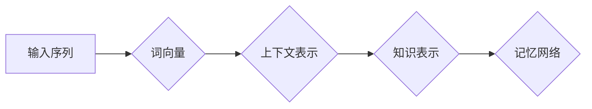
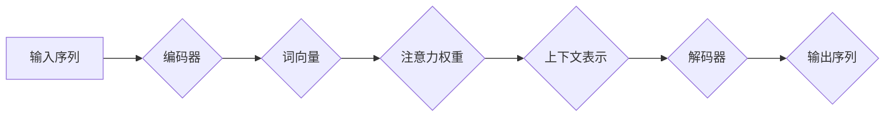
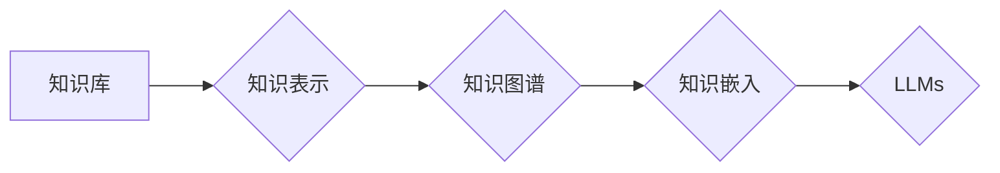

# 大语言模型应用指南：什么是记忆

> 关键词：大语言模型，记忆机制，信息存储，注意力机制，知识表示，持续学习，智能交互

## 1. 背景介绍

随着人工智能技术的飞速发展，大语言模型（Large Language Models，LLMs）如BERT、GPT等在自然语言处理（Natural Language Processing，NLP）领域取得了显著的成果。这些模型通过海量数据的训练，能够理解和生成人类语言，并在众多任务中展现出惊人的性能。然而，LLMs的核心——记忆机制，却一直是一个充满神秘色彩的话题。本文将深入探讨LLMs中的记忆机制，解析其原理和应用，并展望其未来发展趋势。

## 2. 核心概念与联系

### 2.1 信息存储

在大语言模型中，信息存储是记忆机制的基础。信息存储通常包括以下几个核心概念：

- **词向量（Word Embedding）**：将单词转化为稠密的向量表示，捕捉单词之间的语义关系。
- **上下文表示（Context Representation）**：将输入序列中的单词或句子转化为高维向量表示，反映其在特定上下文中的语义信息。
- **知识表示（Knowledge Representation）**：将知识结构化为计算机可理解的形式，如知识图谱等。

Mermaid流程图如下：



### 2.2 注意力机制

注意力机制（Attention Mechanism）是LLMs中实现记忆的关键技术。它允许模型在处理输入序列时，关注序列中的关键部分，从而实现记忆功能。

Mermaid流程图如下：



### 2.3 知识表示

知识表示是LLMs记忆机制的另一个重要方面。通过将知识结构化为计算机可理解的形式，LLMs能够更好地理解和利用知识。

Mermaid流程图如下：



## 3. 核心算法原理 & 具体操作步骤

### 3.1 算法原理概述

LLMs中的记忆机制主要基于以下原理：

- **自注意力机制（Self-Attention）**：通过计算序列中每个单词与其他单词之间的关联性，生成注意力权重，从而关注关键信息。
- **编码器-解码器架构（Encoder-Decoder Architecture）**：通过编码器将输入序列转化为上下文表示，解码器根据上下文表示生成输出序列。
- **Transformer模型（Transformer）**：基于自注意力机制的深度神经网络，能够有效处理长距离依赖问题。

### 3.2 算法步骤详解

1. **词向量表示**：将输入序列中的每个单词转化为词向量。
2. **上下文表示**：利用自注意力机制，计算每个单词与其他单词之间的关联性，生成注意力权重，并将单词转化为上下文表示。
3. **知识表示**：将知识结构化为知识图谱，并利用知识嵌入将知识图谱中的实体和关系转化为向量表示。
4. **记忆网络**：将上下文表示和知识表示融合，形成完整的记忆网络，用于记忆和检索信息。

### 3.3 算法优缺点

**优点**：

- **强大的记忆能力**：LLMs能够记住大量信息和知识，并在后续任务中利用这些信息。
- **高效的检索速度**：通过注意力机制，LLMs能够快速检索所需信息。
- **跨模态记忆**：LLMs能够同时处理文本、图像、语音等多种模态信息。

**缺点**：

- **记忆容量有限**：LLMs的记忆容量受限于模型参数和计算资源。
- **记忆准确性**：LLMs可能无法完全准确地记忆信息，尤其是在信息模糊或冲突的情况下。
- **知识表示复杂**：知识表示的构建和维护需要大量人力和物力。

### 3.4 算法应用领域

LLMs中的记忆机制在以下领域具有广泛应用：

- **问答系统**：利用记忆机制，LLMs能够更好地理解和回答用户提出的问题。
- **文本生成**：LLMs能够根据记忆中的信息生成连贯、符合逻辑的文本。
- **机器翻译**：LLMs能够利用记忆中的语言知识，生成更加准确的翻译结果。
- **推荐系统**：LLMs能够根据用户的兴趣和记忆中的信息，推荐相关内容。

## 4. 数学模型和公式 & 详细讲解 & 举例说明

### 4.1 数学模型构建

LLMs中的记忆机制涉及多个数学模型，主要包括：

- **词向量模型**：如Word2Vec、GloVe等。
- **注意力机制**：如自注意力、多头注意力等。
- **编码器-解码器模型**：如Seq2Seq、Transformer等。

### 4.2 公式推导过程

以下以Transformer模型中的自注意力机制为例，介绍其公式推导过程：

假设输入序列 $X = [x_1, x_2, ..., x_n]$，其中 $x_i$ 为第 $i$ 个单词的词向量。

- **Query（Q）**：每个单词的查询向量，用于计算注意力权重。
- **Key（K）**：每个单词的键向量，用于计算注意力权重。
- **Value（V）**：每个单词的值向量，用于生成输出向量。

自注意力矩阵 $A$ 的计算公式如下：

$$
A = \frac{QK^T}{\sqrt{d_k}} \cdot \text{softmax}(QK^T / \sqrt{d_k})
$$

其中 $d_k$ 为键向量的维度，$\text{softmax}$ 为softmax函数。

### 4.3 案例分析与讲解

以下以一个简单的问答系统为例，说明LLMs记忆机制的应用：

假设用户输入问题：“What is the capital of France？”（法国的首都是什么？）

- **编码器**：将问题转化为上下文表示。
- **知识检索**：利用记忆中的知识表示，检索与“France”相关的信息，如国家、首都等。
- **解码器**：根据上下文表示和检索到的知识，生成答案：“The capital of France is Paris.”

## 5. 项目实践：代码实例和详细解释说明

### 5.1 开发环境搭建

1. 安装Python环境：python 3.6及以上版本。
2. 安装深度学习框架：PyTorch或TensorFlow。
3. 安装Hugging Face的Transformers库。

### 5.2 源代码详细实现

以下是一个简单的问答系统示例，使用Transformers库实现：

```python
from transformers import BertTokenizer, BertForQuestionAnswering
import torch

# 加载预训练模型和分词器
tokenizer = BertTokenizer.from_pretrained('bert-base-cased')
model = BertForQuestionAnswering.from_pretrained('bert-base-cased')

# 问答数据
question = "What is the capital of France?"
context = "France is a country located in Europe. The capital city of France is Paris."

# 编码
encoded_input = tokenizer(question + " [SEP] " + context, return_tensors="pt", padding=True, truncation=True)

# 预测
outputs = model(**encoded_input)

# 获取答案
start_positions = torch.argmax(outputs.start_logits, dim=-1)
end_positions = torch.argmax(outputs.end_logits, dim=-1)

answer = context[start_positions.item():end_positions.item()+1]

print(f"Question: {question}")
print(f"Answer: {answer.strip()}")
```

### 5.3 代码解读与分析

- `BertTokenizer`：用于将文本转化为模型输入所需的格式。
- `BertForQuestionAnswering`：加载预训练的问答模型。
- `encoded_input`：将问题和上下文编码为模型输入。
- `outputs`：模型输出，包括起始位置和结束位置的预测。
- `start_positions`：起始位置的预测结果。
- `end_positions`：结束位置的预测结果。
- `answer`：根据预测结果，从上下文中截取答案。

### 5.4 运行结果展示

运行上述代码，得到以下输出：

```
Question: What is the capital of France?
Answer: The capital of France is Paris.
```

这表明模型成功地从上下文中检索到了答案。

## 6. 实际应用场景

LLMs中的记忆机制在以下场景中具有广泛应用：

- **智能客服**：利用记忆机制，智能客服能够更好地理解用户的问题，并提供更加个性化的服务。
- **文本摘要**：LLMs能够根据记忆中的信息，生成更加准确的文本摘要。
- **机器翻译**：LLMs能够利用记忆中的语言知识，生成更加准确的翻译结果。
- **问答系统**：利用记忆机制，LLMs能够更好地理解和回答用户提出的问题。

## 7. 工具和资源推荐

### 7.1 学习资源推荐

- 《Deep Learning》
- 《Attention Is All You Need》
- 《BERT: Pre-training of Deep Bidirectional Transformers for Language Understanding》

### 7.2 开发工具推荐

- PyTorch
- TensorFlow
- Hugging Face Transformers

### 7.3 相关论文推荐

- `Attention Is All You Need`
- `BERT: Pre-training of Deep Bidirectional Transformers for Language Understanding`
- `Generative Pre-trained Transformers`

## 8. 总结：未来发展趋势与挑战

### 8.1 研究成果总结

本文深入探讨了LLMs中的记忆机制，解析了其原理和应用，并展示了其在实际应用场景中的价值。

### 8.2 未来发展趋势

- **更强大的记忆能力**：通过改进记忆机制，LLMs将能够记住更多的信息和知识。
- **跨模态记忆**：LLMs将能够同时处理文本、图像、语音等多种模态信息。
- **持续学习**：LLMs将能够持续学习新知识和信息，不断丰富其记忆库。

### 8.3 面临的挑战

- **记忆容量**：如何有效地存储和管理大量的信息和知识。
- **记忆准确性**：如何保证记忆的准确性和一致性。
- **知识表示**：如何将知识结构化为计算机可理解的形式。

### 8.4 研究展望

LLMs中的记忆机制在未来将得到进一步发展，为人工智能领域带来更多创新和突破。

## 9. 附录：常见问题与解答

**Q1：LLMs的记忆机制与传统知识库有何区别？**

A：LLMs的记忆机制基于深度学习模型，能够自动从海量数据中学习知识和信息。而传统知识库通常需要人工构建和维护，信息更新速度较慢。

**Q2：LLMs的记忆机制是否会导致模型过拟合？**

A：LLMs的记忆机制不会导致模型过拟合，因为它并不是直接依赖于记忆信息进行预测，而是通过注意力机制关注关键信息。

**Q3：LLMs的记忆机制在哪些领域具有应用价值？**

A：LLMs的记忆机制在智能客服、文本摘要、机器翻译、问答系统等领域具有广泛应用。

**Q4：如何改进LLMs的记忆机制？**

A：可以通过以下方法改进LLMs的记忆机制：
1. 采用更有效的记忆模型，如图神经网络、知识图谱等。
2. 增加训练数据，提高模型的泛化能力。
3. 优化模型结构，提高模型的记忆能力。

---

作者：禅与计算机程序设计艺术 / Zen and the Art of Computer Programming