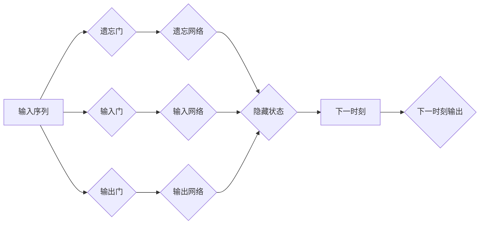

# 大语言模型应用指南：长短期记忆

> 关键词：长短期记忆网络，LSTM，循环神经网络，序列模型，自然语言处理，时间序列分析，深度学习

## 1. 背景介绍

在深度学习领域，长短期记忆网络（Long Short-Term Memory，LSTM）是一种强大的循环神经网络（Recurrent Neural Network，RNN）架构，特别适用于处理序列数据。LSTM通过其独特的门控机制，能够有效地捕捉序列数据中的长期依赖关系，从而在自然语言处理、时间序列分析等领域取得了显著成果。本文将深入探讨LSTM的原理、应用和实践，为您提供一份全面的应用指南。

## 2. 核心概念与联系

### 2.1 LSTM原理与架构

LSTM是一种特殊的RNN，它通过引入门控机制来控制信息的流动，从而避免传统的RNN在处理长期依赖关系时的梯度消失或梯度爆炸问题。LSTM的核心组件包括：

- **遗忘门（Forget Gate）**：决定哪些信息被丢弃。
- **输入门（Input Gate）**：决定哪些新的信息被存储。
- **输出门（Output Gate）**：决定哪些信息被输出。

以下是LSTM的Mermaid流程图：



### 2.2 LSTM与RNN的联系

LSTM是RNN的一种变体，它通过门控机制解决了传统RNN在处理长期依赖关系时的难题。LSTM的结构比传统的RNN更复杂，但它的学习能力和泛化能力更强。

## 3. 核心算法原理 & 具体操作步骤

### 3.1 算法原理概述

LSTM通过三个门控单元（遗忘门、输入门、输出门）和一个细胞状态（cell state）来处理序列数据。遗忘门决定哪些信息被遗忘，输入门决定哪些新的信息被存储，输出门决定哪些信息被输出。

### 3.2 算法步骤详解

1. **输入门的计算**：输入门根据当前输入和上一时刻的隐藏状态，计算新的输入向量。
2. **遗忘门的计算**：遗忘门根据当前输入和上一时刻的隐藏状态，计算遗忘向量，从而决定哪些信息被保留。
3. **细胞状态的更新**：细胞状态通过遗忘门和输入门进行更新。
4. **输出门的计算**：输出门根据当前输入和更新后的细胞状态，计算新的隐藏状态。
5. **输出**：隐藏状态作为模型的输出。

### 3.3 算法优缺点

**优点**：

- 能够处理长期依赖关系。
- 学习能力强，泛化能力强。
- 在序列数据处理中表现优异。

**缺点**：

- 参数数量较多，训练复杂度高。
- 对于某些复杂任务，可能需要大量数据进行训练。

### 3.4 算法应用领域

LSTM在以下领域有广泛的应用：

- 自然语言处理：文本生成、机器翻译、情感分析等。
- 时间序列分析：股票预测、天气预报等。
- 图像识别：视频动作识别、视频目标跟踪等。

## 4. 数学模型和公式 & 详细讲解 & 举例说明

### 4.1 数学模型构建

LSTM的数学模型如下：

$$
\begin{align*}
f_t &= \sigma(W_f \cdot [h_{t-1}, x_t] + b_f) \\
i_t &= \sigma(W_i \cdot [h_{t-1}, x_t] + b_i) \\
g_t &= tanh(W_g \cdot [h_{t-1}, x_t] + b_g) \\
o_t &= \sigma(W_o \cdot [h_{t-1}, x_t] + b_o) \\
h_t &= o_t \cdot tanh(g_t) \\
c_t &= f_t \cdot c_{t-1} + i_t \cdot g_t
\end{align*}
$$

其中，$W_f, W_i, W_g, W_o$ 是权重矩阵，$b_f, b_i, b_g, b_o$ 是偏置项，$\sigma$ 是sigmoid函数，$tanh$ 是双曲正切函数。

### 4.2 公式推导过程

LSTM的公式推导过程较为复杂，涉及矩阵乘法、激活函数等操作。具体推导过程可参考相关文献。

### 4.3 案例分析与讲解

以下是一个简单的LSTM应用实例：使用LSTM进行序列数据的预测。

```python
import numpy as np
from tensorflow.keras.models import Sequential
from tensorflow.keras.layers import LSTM, Dense

# 创建数据
x = np.random.random((50, 10))
y = np.random.random((50, 1))

# 创建模型
model = Sequential()
model.add(LSTM(50, activation='relu', input_shape=(10, 1)))
model.add(Dense(1))

# 编译模型
model.compile(optimizer='adam', loss='mse')

# 训练模型
model.fit(x, y, epochs=10)

# 预测
x_predict = np.random.random((1, 10))
y_predict = model.predict(x_predict)
print(y_predict)
```

## 5. 项目实践：代码实例和详细解释说明

### 5.1 开发环境搭建

1. 安装TensorFlow库：
```bash
pip install tensorflow
```

2. 安装NumPy库：
```bash
pip install numpy
```

### 5.2 源代码详细实现

以下是一个使用LSTM进行时间序列预测的示例代码：

```python
import numpy as np
from tensorflow.keras.models import Sequential
from tensorflow.keras.layers import LSTM, Dense

# 创建数据
x = np.random.random((50, 10))
y = np.random.random((50, 1))

# 创建模型
model = Sequential()
model.add(LSTM(50, activation='relu', input_shape=(10, 1)))
model.add(Dense(1))

# 编译模型
model.compile(optimizer='adam', loss='mse')

# 训练模型
model.fit(x, y, epochs=10)

# 预测
x_predict = np.random.random((1, 10))
y_predict = model.predict(x_predict)
print(y_predict)
```

### 5.3 代码解读与分析

上述代码中，首先使用NumPy生成随机数据作为训练数据。然后创建一个LSTM模型，包含一个LSTM层和一个Dense层。编译模型时，指定优化器为Adam和损失函数为均方误差。训练模型后，使用模型进行预测。

### 5.4 运行结果展示

运行上述代码，可以得到预测结果。由于数据是随机生成的，预测结果也将是随机的。

## 6. 实际应用场景

### 6.1 自然语言处理

LSTM在自然语言处理领域有广泛的应用，如：

- 文本生成：根据给定的文本，生成新的文本。
- 机器翻译：将一种语言的文本翻译成另一种语言。
- 情感分析：分析文本的情感倾向。

### 6.2 时间序列分析

LSTM在时间序列分析领域也有广泛的应用，如：

- 股票预测：预测股票的未来价格。
- 天气预报：预测未来的天气状况。
- 电力需求预测：预测未来的电力需求。

## 7. 工具和资源推荐

### 7.1 学习资源推荐

- 《深度学习》
- 《序列模型与深度学习》
- TensorFlow官方文档

### 7.2 开发工具推荐

- TensorFlow
- Keras

### 7.3 相关论文推荐

- "Long Short-Term Memory"
- "Sequence to Sequence Learning with Neural Networks"

## 8. 总结：未来发展趋势与挑战

### 8.1 研究成果总结

LSTM是一种强大的序列模型，在自然语言处理、时间序列分析等领域取得了显著成果。随着深度学习技术的不断发展，LSTM将会在更多领域得到应用。

### 8.2 未来发展趋势

- LSTM的结构将更加复杂，功能更加强大。
- LSTM与其他深度学习模型的结合将更加紧密。
- LSTM的应用场景将更加广泛。

### 8.3 面临的挑战

- LSTM的训练过程仍然较为复杂，需要大量的计算资源。
- LSTM的参数数量较多，模型的解释性较差。

### 8.4 研究展望

随着研究的不断深入，LSTM将会在更多领域得到应用，并为深度学习技术的发展做出更大的贡献。

## 9. 附录：常见问题与解答

**Q1：LSTM与RNN的区别是什么？**

A：LSTM是RNN的一种变体，它通过门控机制解决了传统RNN在处理长期依赖关系时的难题。

**Q2：LSTM适合处理哪些类型的数据？**

A：LSTM适合处理序列数据，如文本数据、时间序列数据等。

**Q3：如何优化LSTM的性能？**

A：可以通过以下方法优化LSTM的性能：
- 使用更合适的激活函数。
- 适当调整LSTM的层数和神经元数量。
- 使用正则化技术，如Dropout。

**Q4：LSTM的缺点是什么？**

A：LSTM的缺点包括：
- 训练过程较为复杂，需要大量的计算资源。
- 模型的解释性较差。

**Q5：LSTM有哪些应用场景？**

A：LSTM在自然语言处理、时间序列分析等领域有广泛的应用。

---

作者：禅与计算机程序设计艺术 / Zen and the Art of Computer Programming