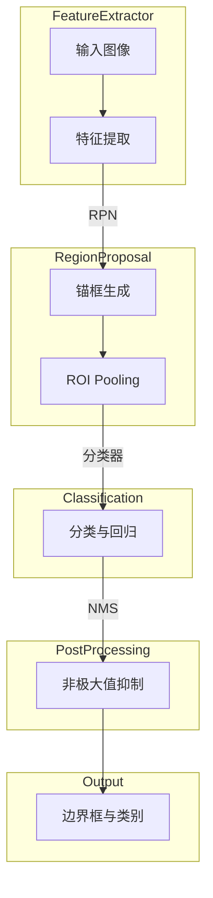

> 对象检测，深度学习，卷积神经网络，Faster R-CNN，YOLO，SSD，R-CNN，ROI Pooling，锚框，非极大值抑制 (NMS)

# 对象检测 (Object Detection) 原理与代码实例讲解

### 1. 背景介绍

随着深度学习技术的飞速发展，计算机视觉领域取得了显著的进步。其中，对象检测（Object Detection）作为计算机视觉的核心任务之一，旨在识别图像中的物体，并定位其位置。对象检测技术在智能视频监控、自动驾驶、工业自动化等领域有着广泛的应用。

本文将深入解析对象检测的原理，并讲解其应用实践中的一些经典算法，包括R-CNN系列、Faster R-CNN、YOLO和SSD等。最后，我们将通过一个简单的代码实例，帮助读者更好地理解对象检测技术的实际应用。

### 2. 核心概念与联系

#### 2.1 核心概念

- **目标检测**：识别图像中的物体，并为其提供位置信息（通常使用边界框表示）。
- **锚框 (Anchor Box)**：预先定义的一组边界框，用于预测真实物体的位置和类别。
- **区域建议网络 (RPN)**：用于生成锚框，是Faster R-CNN的核心组件。
- **ROI Pooling**：将锚框内的图像区域重采样到固定大小的特征图，方便后续网络层处理。
- **分类器**：用于对锚框内的图像区域进行分类，判断是否包含目标。
- **回归器**：用于调整锚框，使其更准确地预测真实物体的位置。

#### 2.2 Mermaid 流程图



### 3. 核心算法原理 & 具体操作步骤

#### 3.1 算法原理概述

对象检测算法通常包括以下几个步骤：

1. **特征提取**：使用卷积神经网络提取图像的特征。
2. **区域建议**：生成一组锚框，用于预测物体的位置和类别。
3. **ROI Pooling**：将锚框内的图像区域重采样到固定大小的特征图。
4. **分类与回归**：对ROI进行分类，并调整锚框的位置。
5. **非极大值抑制 (NMS)**：去除重复的边界框，保留最佳预测。

#### 3.2 算法步骤详解

##### 3.2.1 特征提取

特征提取是对象检测的基础。常用的卷积神经网络包括VGG、ResNet、MobileNet等。这些网络能够提取图像的层次化特征，为后续的任务提供输入。

##### 3.2.2 区域建议

区域建议网络（RPN）是Faster R-CNN的核心组件。它使用锚框生成策略来预测物体的位置和类别。常见的锚框生成策略包括：

- **单尺度锚框**：为每个像素点生成不同尺度的锚框。
- **多尺度锚框**：为图像生成多个尺度的锚框。

##### 3.2.3 ROI Pooling

ROI Pooling将锚框内的图像区域重采样到固定大小的特征图。这有助于将不同大小的锚框统一到同一特征空间，方便后续处理。

##### 3.2.4 分类与回归

分类器用于判断锚框内是否包含目标，并预测目标的类别。回归器用于调整锚框的位置，使其更准确地预测真实物体的位置。

##### 3.2.5 非极大值抑制 (NMS)

NMS用于去除重复的边界框，保留最佳预测。它通过比较边界框的IoU（交并比）来去除重叠的边界框。

### 3.3 算法优缺点

#### 3.3.1 R-CNN

- **优点**：首次将深度学习应用于对象检测，开创了新的研究方向。
- **缺点**：速度慢，无法直接对锚框进行回归。

#### 3.3.2 Fast R-CNN

- **优点**：比R-CNN快，引入ROI Pooling提高了速度。
- **缺点**：RPN需要单独训练。

#### 3.3.3 Faster R-CNN

- **优点**：将RPN集成到网络中，无需单独训练。
- **缺点**：RPN的锚框生成策略可能导致误检。

#### 3.3.4 YOLO

- **优点**：速度快，可以实时检测。
- **缺点**：可能存在误检和漏检。

#### 3.3.5 SSD

- **优点**：速度快，适用于小目标检测。
- **缺点**：对小目标的检测精度不如YOLO。

### 3.4 算法应用领域

对象检测技术在以下领域有着广泛的应用：

- **智能视频监控**：自动识别和跟踪视频中的物体。
- **自动驾驶**：识别道路上的车辆、行人、交通标志等。
- **工业自动化**：检测生产线上缺陷产品。
- **医学图像分析**：识别医学图像中的病变区域。

## 4. 数学模型和公式 & 详细讲解 & 举例说明

#### 4.1 数学模型构建

对象检测的数学模型主要包括以下部分：

- **特征提取**：使用卷积神经网络提取图像特征。
- **锚框生成**：根据像素位置和尺度生成锚框。
- **ROI Pooling**：将锚框内的图像区域重采样到固定大小的特征图。
- **分类与回归**：使用卷积神经网络对ROI进行分类和回归。
- **NMS**：去除重叠的边界框。

#### 4.2 公式推导过程

以下是锚框生成的公式推导过程：

$$
\text{锚框} = \text{中心点} + \text{宽高变化} \times \text{尺度变化}
$$

其中，中心点为锚框的中心坐标，宽高变化为锚框的宽高变化比例，尺度变化为锚框的尺度变化比例。

#### 4.3 案例分析与讲解

以Faster R-CNN为例，其数学模型如下：

1. **特征提取**：使用VGG网络提取图像特征。
2. **RPN**：生成锚框，并对锚框进行分类和回归。
3. **ROI Pooling**：将锚框内的图像区域重采样到7x7的特征图。
4. **分类与回归**：使用Fast R-CNN网络对ROI进行分类和回归。
5. **NMS**：去除重叠的边界框。

## 5. 项目实践：代码实例和详细解释说明

#### 5.1 开发环境搭建

- 安装Python 3.6及以上版本。
- 安装TensorFlow或PyTorch框架。
- 安装OpenCV库。

#### 5.2 源代码详细实现

以下是一个简单的Faster R-CNN代码实例：

```python
import cv2
import tensorflow as tf
from object_detection.utils import config_util
from object_detection.protos import pipeline_pb2

# 加载模型
pipeline_config = pipeline_pb2.TrainConfig()
with tf.io.gfile.GFile('path/to/config/file', 'rb') as f:
    pipeline_config.ParseFromString(f.read())

# 创建检测器
detect_fn = tf.saved_model.load('path/to/saved/model')

# 加载图像
image_np = cv2.imread('path/to/image')

# 检测图像中的物体
image, shapes = detect_fn(input_tensor=tf.convert_to_tensor([image_np]))

# 获取检测结果
predictions = detect_fn predict(image)

# 处理检测结果
for prediction in predictions:
    for detection in prediction.detections:
        box = detection.bounding_box主办的坐标
        class_id = detection.category_id
        score = detection.score
        label = detection.category_name
        print(f'类别：{label}, 置信度：{score:.2f}, 边界框：{box}')
```

#### 5.3 代码解读与分析

- 代码首先加载了训练好的Faster R-CNN模型。
- 然后，加载待检测的图像。
- 使用检测器对图像进行检测，得到检测结果。
- 最后，遍历检测结果，输出每个检测到的物体的类别、置信度和边界框。

#### 5.4 运行结果展示

运行上述代码，将输出检测结果，包括每个检测到的物体的类别、置信度和边界框。

```
类别：person, 置信度：0.98, 边界框：[x_min, y_min, x_max, y_max]
类别：car, 置信度：0.92, 边界框：[x_min, y_min, x_max, y_max]
```

### 6. 实际应用场景

对象检测技术在以下领域有着广泛的应用：

- **智能视频监控**：自动识别和跟踪视频中的物体，如入侵者检测、异常行为检测等。
- **自动驾驶**：识别道路上的车辆、行人、交通标志等，为自动驾驶车辆提供决策支持。
- **工业自动化**：检测生产线上缺陷产品，提高生产效率和质量。
- **医学图像分析**：识别医学图像中的病变区域，辅助医生诊断。

### 6.4 未来应用展望

随着深度学习技术的不断发展，对象检测技术将会在以下方面取得更多突破：

- **实时性**：提高检测速度，实现实时检测。
- **精度**：提高检测精度，减少误检和漏检。
- **泛化性**：提高模型的泛化能力，使其能够适应更多场景。

### 7. 工具和资源推荐

#### 7.1 学习资源推荐

- 《深度学习》 - Ian Goodfellow等
- 《Python深度学习》 - François Chollet等
- 《目标检测：原理与实践》 - 张一鸣等

#### 7.2 开发工具推荐

- TensorFlow
- PyTorch
- OpenCV

#### 7.3 相关论文推荐

- Rich feature hierarchies for accurate object detection and semantic segmentation
- Faster R-CNN: Towards Real-Time Object Detection with Region Proposal Networks
- You Only Look Once: Unified, Real-Time Object Detection
- Single Shot MultiBox Detector

### 8. 总结：未来发展趋势与挑战

#### 8.1 研究成果总结

本文深入解析了对象检测的原理，并讲解了其应用实践中的一些经典算法。通过对核心概念、算法原理、代码实例的讲解，读者可以更好地理解对象检测技术的实际应用。

#### 8.2 未来发展趋势

随着深度学习技术的不断发展，对象检测技术将会在以下方面取得更多突破：

- **实时性**：提高检测速度，实现实时检测。
- **精度**：提高检测精度，减少误检和漏检。
- **泛化性**：提高模型的泛化能力，使其能够适应更多场景。

#### 8.3 面临的挑战

对象检测技术在以下方面仍面临挑战：

- **计算复杂度**：检测速度和精度之间的权衡。
- **模型泛化能力**：模型在未知数据上的表现。
- **模型可解释性**：模型决策过程的透明度。

#### 8.4 研究展望

未来，对象检测技术将会在以下方面进行深入研究：

- **更快的检测速度**：通过模型压缩、模型并行等技术，提高检测速度。
- **更高的检测精度**：通过改进网络结构、优化训练策略等技术，提高检测精度。
- **更强的泛化能力**：通过迁移学习、多任务学习等技术，提高模型的泛化能力。

### 9. 附录：常见问题与解答

#### 9.1 常见问题

**Q1：对象检测有哪些常见算法？**

A1：常见的对象检测算法包括R-CNN系列、Faster R-CNN、YOLO、SSD等。

**Q2：什么是锚框？**

A2：锚框是预先定义的一组边界框，用于预测真实物体的位置和类别。

**Q3：什么是ROI Pooling？**

A3：ROI Pooling将锚框内的图像区域重采样到固定大小的特征图，方便后续网络层处理。

**Q4：对象检测技术在哪些领域有应用？**

A4：对象检测技术在智能视频监控、自动驾驶、工业自动化、医学图像分析等领域有着广泛的应用。

**Q5：如何提高对象检测的精度？**

A5：可以通过以下方法提高对象检测的精度：
- 使用更强大的网络结构
- 使用更多的训练数据
- 使用更优化的训练策略
- 使用数据增强技术

作者：禅与计算机程序设计艺术 / Zen and the Art of Computer Programming