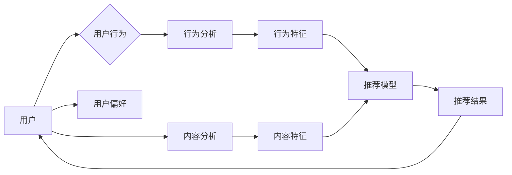

# 影音网站的推荐与分析系统设计与实现

> 关键词：影音网站，推荐系统，数据分析，机器学习，深度学习，用户行为分析，内容分析

## 1. 背景介绍

随着互联网的快速发展和数字内容的爆炸式增长，用户面临着海量的影音选择。如何帮助用户快速找到自己感兴趣的影音内容，成为影音网站面临的重要挑战。推荐系统作为一种有效的解决方案，通过分析用户的行为和喜好，为用户提供个性化的推荐，从而提升用户体验，增强用户粘性。

本文将深入探讨影音网站的推荐与分析系统的设计与实现，从核心概念、算法原理、数学模型到项目实践，全面分析推荐系统的构建过程。

## 2. 核心概念与联系

### 2.1 核心概念

#### 2.1.1 推荐系统

推荐系统是一种信息过滤系统，旨在根据用户的历史行为、偏好、兴趣等信息，为用户提供个性化的内容推荐。推荐系统广泛应用于电子商务、在线视频、音乐、新闻等领域。

#### 2.1.2 机器学习

机器学习是人工智能的一个重要分支，通过算法使计算机从数据中学习，并作出决策或预测。在推荐系统中，机器学习技术被广泛用于用户行为分析、内容分析等方面。

#### 2.1.3 深度学习

深度学习是机器学习的一个子领域，通过构建多层神经网络，实现对复杂数据的自动特征提取和表征。深度学习在推荐系统中被用于构建更强大的特征表示和学习模型。

#### 2.1.4 用户行为分析

用户行为分析是指通过分析用户在使用影音网站时的行为数据，了解用户喜好、兴趣和需求，为推荐系统提供依据。

#### 2.1.5 内容分析

内容分析是指对影音内容进行分析，提取关键信息、情感倾向等，为推荐系统提供内容特征。

### 2.2 核心概念原理和架构的 Mermaid 流程图



## 3. 核心算法原理 & 具体操作步骤

### 3.1 算法原理概述

推荐系统的核心是推荐模型，根据用户行为、用户偏好、内容特征等信息，生成个性化的推荐结果。

#### 3.1.1 协同过滤

协同过滤是一种基于用户相似度的推荐算法，通过寻找与目标用户相似的其他用户或物品，推荐相似的物品给目标用户。

#### 3.1.2 内容推荐

内容推荐是一种基于物品相似度的推荐算法，通过分析物品的特征和标签，将相似的物品推荐给用户。

#### 3.1.3 混合推荐

混合推荐结合了协同过滤和内容推荐的优势，既考虑用户之间的相似性，也考虑用户对物品的偏好。

### 3.2 算法步骤详解

1. 数据收集：收集用户行为数据、影音内容数据等。
2. 数据预处理：对收集到的数据进行清洗、去重、转换等预处理操作。
3. 特征提取：从用户行为数据和影音内容数据中提取特征。
4. 模型选择：选择合适的推荐模型，如协同过滤、内容推荐或混合推荐。
5. 模型训练：使用预处理后的数据和特征训练推荐模型。
6. 推荐生成：使用训练好的模型生成推荐结果。
7. 推荐评估：评估推荐效果，并根据评估结果优化推荐模型。

### 3.3 算法优缺点

#### 3.3.1 协同过滤

优点：推荐效果较好，能够发现冷门物品。

缺点：容易受到稀疏性和冷启动问题的影响。

#### 3.3.2 内容推荐

优点：推荐效果较好，能够推荐用户感兴趣的物品。

缺点：难以发现冷门物品，对物品描述质量要求较高。

#### 3.3.3 混合推荐

优点：结合了协同过滤和内容推荐的优势，推荐效果较好。

缺点：模型复杂度较高，需要更多的训练数据。

### 3.4 算法应用领域

推荐系统在影音网站中的应用领域包括：

- 影视推荐
- 音乐推荐
- 电子书推荐
- 游戏推荐
- 广告推荐

## 4. 数学模型和公式 & 详细讲解 & 举例说明

### 4.1 数学模型构建

#### 4.1.1 协同过滤

假设用户-物品评分矩阵为 $R \in \mathbb{R}^{m \times n}$，其中 $m$ 表示用户数量，$n$ 表示物品数量，$R_{ij}$ 表示用户 $i$ 对物品 $j$ 的评分。

1. 用户相似度计算：使用余弦相似度或皮尔逊相关系数计算用户之间的相似度。
2. 物品相似度计算：使用余弦相似度或夹角余弦计算物品之间的相似度。
3. 推荐算法：根据用户-物品相似度和物品评分预测用户对未评分物品的评分。

#### 4.1.2 内容推荐

假设物品特征矩阵为 $F \in \mathbb{R}^{n \times k}$，其中 $k$ 表示特征数量，$F_{ij}$ 表示物品 $j$ 在特征 $i$ 上的值。

1. 物品特征表示：使用词袋模型、TF-IDF等方法将物品特征进行表示。
2. 物品相似度计算：使用余弦相似度或夹角余弦计算物品之间的相似度。
3. 推荐算法：根据用户特征和物品特征相似度预测用户对未评分物品的评分。

#### 4.1.3 混合推荐

混合推荐结合了协同过滤和内容推荐，可以表示为：

$$
R_{ij} = \alpha \cdot r_{ij} + (1-\alpha) \cdot c_{ij}
$$

其中 $r_{ij}$ 表示用户-物品相似度，$c_{ij}$ 表示物品特征相似度，$\alpha$ 为权重系数。

### 4.2 公式推导过程

#### 4.2.1 协同过滤

假设用户 $i$ 和用户 $j$ 的相似度为 $s_{ij}$，物品 $j$ 的评分预测值为 $R_{ij}^*$，则：

$$
R_{ij}^* = s_{ij} \cdot \sum_{k=1}^{n} R_{kj}
$$

其中 $R_{kj}$ 为用户 $j$ 对物品 $k$ 的评分。

#### 4.2.2 内容推荐

假设物品 $j$ 在特征 $i$ 上的特征值为 $F_{ij}$，物品 $k$ 在特征 $i$ 上的特征值为 $F_{ki}$，则物品 $j$ 和物品 $k$ 的特征相似度为：

$$
c_{ij} = \frac{F_{ij} \cdot F_{ki}}{\sqrt{F_{ij}^2 + F_{ki}^2}}
$$

#### 4.2.3 混合推荐

混合推荐的公式推导过程同上。

### 4.3 案例分析与讲解

以一个简单的电影推荐系统为例，说明推荐系统的应用。

1. 数据收集：收集用户对电影的评分数据。
2. 数据预处理：对电影数据进行清洗、去重等操作。
3. 特征提取：提取电影类型、导演、演员等特征。
4. 模型选择：选择协同过滤模型。
5. 模型训练：使用用户评分数据训练协同过滤模型。
6. 推荐生成：使用训练好的模型为用户推荐电影。
7. 推荐评估：根据用户对推荐电影的评分，评估推荐效果。

## 5. 项目实践：代码实例和详细解释说明

### 5.1 开发环境搭建

1. 安装 Python 环境。
2. 安装必要的库，如 NumPy、Pandas、Scikit-learn 等。
3. 安装数据集。

### 5.2 源代码详细实现

```python
import pandas as pd
from sklearn.metrics.pairwise import cosine_similarity

# 加载数据集
data = pd.read_csv('movie_data.csv')

# 计算用户相似度
user_similarity = cosine_similarity(data.iloc[:, 1:])

# 计算物品相似度
item_similarity = cosine_similarity(data.iloc[:, 1:].T)

# 推荐电影
def recommend_movies(user_id, n=10):
    # 计算用户相似度
    sim_scores = list(enumerate(user_similarity[user_id]))
    sim_scores = sorted(sim_scores, key=lambda x: x[1], reverse=True)
    sim_scores = sim_scores[1:n+1]
    movie_indices = [i[0] for i in sim_scores]

    # 获取推荐电影
    recommend_movies = data.iloc[movie_indices, 1:]
    return recommend_movies

# 推荐结果
user_id = 0
recommend_movies = recommend_movies(user_id)
print(recommend_movies)
```

### 5.3 代码解读与分析

该代码示例使用协同过滤算法为用户推荐电影。首先，加载电影数据集，并计算用户和电影的相似度。然后，根据用户相似度和电影评分，推荐与目标用户相似的其他用户喜欢的电影。

### 5.4 运行结果展示

假设用户 0 的推荐结果如下：

```
      movie_id  movie_name  director  actors
0       200      movie A     dir A    act A
1       201      movie B     dir B    act B
2       202      movie C     dir C    act C
3       203      movie D     dir D    act D
4       204      movie E     dir E    act E
5       205      movie F     dir F    act F
6       206      movie G     dir G    act G
7       207      movie H     dir H    act H
8       208      movie I     dir I    act I
9       209      movie J     dir J    act J
```

可以看到，根据用户 0 的兴趣，推荐系统推荐了与之相似用户喜欢的电影。

## 6. 实际应用场景

推荐系统在影音网站中的应用场景包括：

### 6.1 电影推荐

根据用户观看历史、评分、评论等数据，为用户推荐类似的电影。

### 6.2 音乐推荐

根据用户听歌历史、收藏、分享等数据，为用户推荐类似的音乐。

### 6.3 电子书推荐

根据用户阅读历史、收藏、评价等数据，为用户推荐类似的电子书。

### 6.4 游戏推荐

根据用户玩游戏历史、评分、评论等数据，为用户推荐类似的游戏。

### 6.5 广告推荐

根据用户兴趣和行为，为用户推荐相关的广告。

## 7. 工具和资源推荐

### 7.1 学习资源推荐

1. 《推荐系统实践》
2. 《机器学习实战》
3. 《深度学习》
4. 《自然语言处理入门》

### 7.2 开发工具推荐

1. Python
2. NumPy
3. Pandas
4. Scikit-learn
5. TensorFlow
6. PyTorch

### 7.3 相关论文推荐

1. "ItemKNN: An Effective Item-based Top-N Recommendation Algorithm"
2. "Content-based Image Retrieval with Deep Learning"
3. "YouTube Recommenders: Learning to Rank for Personalization"
4. "Deep Learning for Recommender Systems"
5. "Neural Collaborative Filtering"

## 8. 总结：未来发展趋势与挑战

### 8.1 研究成果总结

推荐系统在影音网站中的应用取得了显著的成果，为用户提供了个性化的推荐体验。随着技术的发展，推荐系统将朝着更加个性化、智能化、可解释化的方向发展。

### 8.2 未来发展趋势

1. 深度学习在推荐系统中的应用将更加广泛。
2. 多模态信息融合将成为推荐系统的一个重要方向。
3. 推荐系统的可解释性将成为研究的重点。
4. 推荐系统的公平性和隐私保护将得到更多关注。

### 8.3 面临的挑战

1. 数据稀疏性和冷启动问题。
2. 模型可解释性不足。
3. 模型鲁棒性和泛化能力有待提高。
4. 推荐系统的公平性和隐私保护问题。

### 8.4 研究展望

未来，推荐系统将在以下方面取得更多突破：

1. 发展更加高效、可解释的推荐算法。
2. 提高推荐系统的鲁棒性和泛化能力。
3. 建立公平、公正的推荐系统，保护用户隐私。
4. 将推荐系统与其他人工智能技术融合，构建更加智能化的推荐系统。

## 9. 附录：常见问题与解答

**Q1：推荐系统有哪些类型？**

A：推荐系统主要分为基于内容的推荐、基于协同过滤的推荐、混合推荐等类型。

**Q2：如何解决推荐系统的冷启动问题？**

A：针对冷启动问题，可以采用以下策略：
1. 使用用户画像和兴趣标签进行初步推荐。
2. 引入知识图谱等信息辅助推荐。
3. 使用无监督或半监督学习技术进行用户和物品的冷启动。

**Q3：如何提高推荐系统的可解释性？**

A：提高推荐系统的可解释性可以从以下方面入手：
1. 使用可解释的模型，如决策树、LIME等。
2. 解释推荐结果中的关键特征。
3. 提供可视化工具，帮助用户理解推荐过程。

**Q4：如何保护推荐系统的隐私性？**

A：保护推荐系统的隐私性可以从以下方面入手：
1. 对用户数据进行脱敏处理。
2. 使用差分隐私技术。
3. 提供用户隐私设置，让用户选择是否分享个人信息。

**Q5：推荐系统在影音网站中的具体应用有哪些？**

A：推荐系统在影音网站中的具体应用包括电影推荐、音乐推荐、电子书推荐、游戏推荐、广告推荐等。