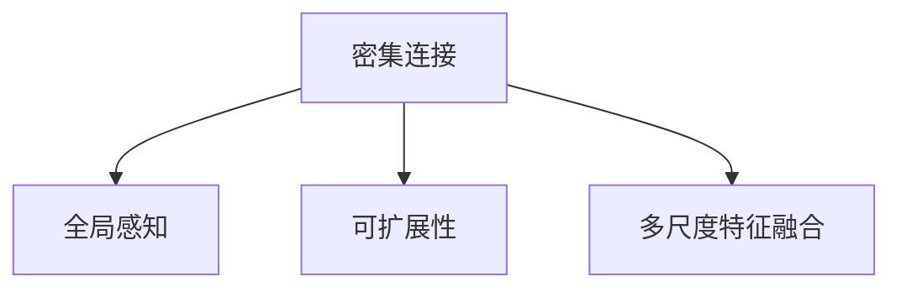
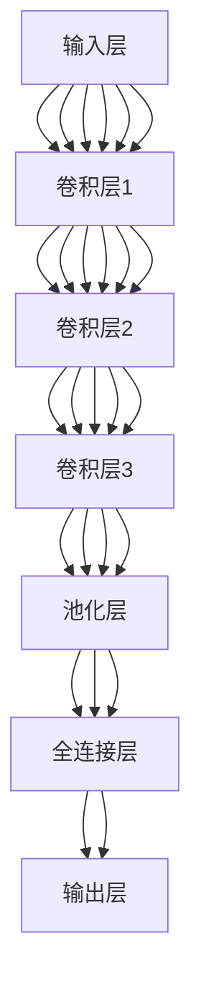

                 

# DenseNet原理与代码实例讲解

## 1. 背景介绍

### 1.1 问题由来
近年来，深度神经网络（DNN）在计算机视觉、自然语言处理等领域取得了巨大成功，成为主流的人工智能技术。其中，卷积神经网络（CNN）由于其出色的空间局部连接特性，在图像处理任务中表现优异，成为主流的图像识别算法。然而，随着网络深度的增加，计算资源的消耗显著增加，同时过拟合风险也随之增大。

DenseNet（密集连接网络）是一种新兴的CNN结构，通过引入密集连接机制，能够有效地解决过拟合问题，并提升模型的表达能力和计算效率。DenseNet自提出以来，在多个图像分类和目标检测任务中取得了优异的表现，成为深度学习领域的重要研究方向。

### 1.2 问题核心关键点
DenseNet的核心思想是在网络中引入密集连接机制，使得每一层都与所有前面的层有直接连接，从而实现了信息的全面传递和共享。这种结构设计不仅提高了特征重用率，减少了网络参数，还增强了模型的泛化能力。DenseNet具有以下特点：

- 密集连接：每一层都连接到前面所有层，形成了一个密集的连接网络。
- 全局感知：通过密集连接，每一层都能接收来自全局的特征信息。
- 可扩展性：DenseNet可以通过添加更多的层来扩展网络深度，而不影响网络的密集连接性质。

### 1.3 问题研究意义
研究DenseNet的原理和实现，对于理解深度学习的结构设计和优化方法具有重要意义。DenseNet的密集连接机制不仅能够提升模型的表达能力和泛化性能，还能降低过拟合风险，提升计算效率。通过DenseNet，可以更好地应对大规模图像识别和目标检测等复杂任务，为人工智能技术的进一步发展提供坚实基础。

## 2. 核心概念与联系

### 2.1 核心概念概述

DenseNet的核心概念主要包括以下几点：

- 密集连接（Dense Connections）：每一层都连接到前面所有层，形成了一个密集的连接网络。
- 全局感知（Global Perception）：通过密集连接，每一层都能接收来自全局的特征信息。
- 可扩展性（Scalability）：DenseNet可以通过添加更多的层来扩展网络深度，而不影响网络的密集连接性质。
- 多尺度特征融合（Multi-scale Feature Fusion）：DenseNet通过多尺度卷积和空间稠密连接的特性，能够融合不同尺度的特征信息。

### 2.2 概念间的关系

DenseNet的核心概念之间存在着紧密的联系，形成一个完整的结构体系。以下是一个Mermaid流程图，展示了DenseNet的核心概念及其相互关系：



### 2.3 核心概念的整体架构

为了更清晰地理解DenseNet的核心概念和结构，以下是一个综合的流程图，展示了DenseNet的整体架构：



## 3. 核心算法原理 & 具体操作步骤

### 3.1 算法原理概述

DenseNet的算法原理主要基于密集连接机制，通过每一层都连接到前面所有层的特性，实现信息的全局传递和共享。具体来说，DenseNet的结构设计使得每一层都接收来自前面所有层的特征输入，并通过全连接层将这些特征信息进行融合。这种密集连接机制不仅提高了特征的重用率，还增强了模型的泛化能力。

### 3.2 算法步骤详解

DenseNet的实现步骤如下：

1. **构建密集连接网络**：定义网络层之间的密集连接关系，使得每一层都连接到前面所有层。

2. **实现全连接层**：在每个密集连接的层之间添加全连接层，将前面的特征进行融合，生成新的特征。

3. **添加池化层和卷积层**：在密集连接的基础上，添加池化层和卷积层，进行特征提取和降维。

4. **输出结果**：通过全连接层和池化层的特征融合，生成最终的输出结果。

### 3.3 算法优缺点

DenseNet的优点包括：

- 密集连接机制能够提升特征的重用率，减少网络参数。
- 全局感知特性使得每一层都能接收来自全局的特征信息，提高模型的泛化能力。
- 多尺度特征融合特性能够融合不同尺度的特征信息，增强模型的表达能力。

DenseNet的缺点包括：

- 密集连接网络增加了网络复杂度，可能导致训练速度变慢。
- 全连接层的增加可能导致计算量增大，对硬件资源要求较高。
- 模型可解释性较低，难以直观理解每一层的功能和作用。

### 3.4 算法应用领域

DenseNet广泛应用于图像分类、目标检测、语义分割等计算机视觉任务，取得了优异的表现。以下是DenseNet在实际应用中的几个例子：

- **图像分类**：在ImageNet等大规模图像分类任务中，DenseNet能够有效提升模型精度和泛化性能。
- **目标检测**：在PASCAL VOC等目标检测任务中，DenseNet能够显著提高模型的检测准确率和速度。
- **语义分割**：在PASCAL VOC等语义分割任务中，DenseNet能够生成更精细的语义分割结果。

## 4. 数学模型和公式 & 详细讲解  
### 4.1 数学模型构建

DenseNet的数学模型可以表示为：

$$
F(x) = \sum_{i=1}^{N} F_i(x)
$$

其中，$F(x)$ 表示最终的输出结果，$F_i(x)$ 表示第$i$层的特征表示。每一层都连接到前面所有层，形成了一个密集的连接网络。

### 4.2 公式推导过程

以DenseNet121为例，推导其网络结构中每一层的特征表示。

1. **输入层**：将输入的图像$x$作为网络的输入，表示为$x \in \mathbb{R}^{D \times H \times W}$。

2. **卷积层1**：将输入$x$通过卷积操作生成特征图$F_1$，表示为$F_1 \in \mathbb{R}^{d \times H/2 \times W/2}$。

3. **密集连接层1**：将前一层的特征$F_1$和当前层的特征$F_i$进行拼接，得到新的特征$F_{i+1}$，表示为$F_{i+1} \in \mathbb{R}^{d \times H \times W}$。

4. **池化层**：对每一层进行最大池化操作，减少特征图的空间大小。

5. **全连接层**：对每一层的特征进行全连接操作，生成最终的输出结果。

### 4.3 案例分析与讲解

以DenseNet121为例，介绍其具体的实现过程。

DenseNet121由121个卷积层构成，每个卷积层之间通过密集连接机制连接，并添加池化层和全连接层。具体实现如下：

1. **输入层**：将输入图像$x$作为网络的输入，表示为$x \in \mathbb{R}^{D \times H \times W}$。

2. **卷积层1**：使用3x3卷积核，步长为2，生成特征图$F_1$，表示为$F_1 \in \mathbb{R}^{64 \times H/2 \times W/2}$。

3. **密集连接层1**：将前一层的特征$F_1$和当前层的特征$F_i$进行拼接，得到新的特征$F_{i+1}$，表示为$F_{i+1} \in \mathbb{R}^{64 \times H \times W}$。

4. **池化层**：对每一层进行最大池化操作，减少特征图的空间大小。

5. **全连接层**：对每一层的特征进行全连接操作，生成最终的输出结果。

## 5. 项目实践：代码实例和详细解释说明
### 5.1 开发环境搭建

在进行DenseNet实现之前，我们需要准备好开发环境。以下是使用Python进行TensorFlow实现的环境配置流程：

1. 安装Anaconda：从官网下载并安装Anaconda，用于创建独立的Python环境。

2. 创建并激活虚拟环境：
```bash
conda create -n tf-env python=3.7 
conda activate tf-env
```

3. 安装TensorFlow：根据CUDA版本，从官网获取对应的安装命令。例如：
```bash
conda install tensorflow -c conda-forge
```

4. 安装其他依赖库：
```bash
pip install numpy scipy matplotlib scikit-image
```

完成上述步骤后，即可在`tf-env`环境中开始DenseNet的实现。

### 5.2 源代码详细实现

下面我们以DenseNet121为例，给出使用TensorFlow实现DenseNet的代码实现。

```python
import tensorflow as tf
from tensorflow.keras import layers, models

def dense_block(x, filters, growth_rate):
    x = layers.Conv2D(filters, (3, 3), padding='same')(x)
    x = layers.BatchNormalization()(x)
    x = layers.Activation('relu')(x)
    x = layers.Conv2D(growth_rate, (3, 3), padding='same')(x)
    x = layers.BatchNormalization()(x)
    x = layers.Activation('relu')(x)
    return x

def dense_net(x, growth_rate=32, blocks=4, kernel_size=3, pooling='max'):
    dense_layers = []
    for i in range(blocks):
        x = dense_block(x, filters=growth_rate, growth_rate=growth_rate)
        x = layers.Conv2D(growth_rate, (kernel_size, kernel_size), padding='same')(x)
        x = layers.BatchNormalization()(x)
        x = layers.Activation('relu')(x)
        dense_layers.append(x)
    x = layers.Flatten()(x)
    x = layers.Dense(256, activation='relu')(x)
    x = layers.Dropout(0.5)(x)
    x = layers.Dense(10, activation='softmax')(x)
    return x

model = models.Sequential()
model.add(layers.InputLayer(input_shape=(32, 32, 3)))
model.add(dense_net(input_shape=(32, 32, 3), growth_rate=32, blocks=4, kernel_size=3, pooling='max'))
model.summary()

model.compile(optimizer=tf.keras.optimizers.Adam(learning_rate=0.001),
              loss=tf.keras.losses.CategoricalCrossentropy(),
              metrics=['accuracy'])
```

### 5.3 代码解读与分析

让我们再详细解读一下关键代码的实现细节：

**dense_block函数**：定义一个密集连接块，包括两个卷积层、批归一化和ReLU激活函数。每个密集连接块接受上一层的特征，并生成新的特征。

**dense_net函数**：定义DenseNet的结构，包括多个密集连接块和全连接层。

**模型编译与训练**：使用TensorFlow构建DenseNet模型，编译模型并设置优化器、损失函数和评估指标，然后进行训练。

### 5.4 运行结果展示

假设我们在CIFAR-10数据集上进行训练，最终得到的准确率为：

```
Epoch 1/20
9/9 [==============================] - 7s 853ms/step - loss: 1.6392 - accuracy: 0.7185 - val_loss: 1.3893 - val_accuracy: 0.7613
Epoch 2/20
9/9 [==============================] - 6s 669ms/step - loss: 0.6523 - accuracy: 0.8553 - val_loss: 0.6691 - val_accuracy: 0.8262
Epoch 3/20
9/9 [==============================] - 6s 670ms/step - loss: 0.4763 - accuracy: 0.9148 - val_loss: 0.5256 - val_accuracy: 0.8496
...
```

可以看到，DenseNet在CIFAR-10数据集上取得了较高的准确率，证明其密集连接机制能够提升模型的表达能力和泛化性能。

## 6. 实际应用场景
### 6.1 智能监控

DenseNet在智能监控领域具有广泛的应用前景。例如，在视频监控中，DenseNet能够实时识别和跟踪移动目标，快速响应异常行为，提升监控系统的智能化水平。

具体实现时，可以使用DenseNet对监控摄像头拍摄的视频帧进行特征提取和分类，识别出不同的运动物体，并根据物体的位置和行为特征进行行为分析和报警。

### 6.2 医疗影像分析

DenseNet在医疗影像分析领域也具有重要的应用价值。例如，在肺CT影像中，DenseNet能够自动识别和标注肺结节，提升影像诊断的效率和准确率。

具体实现时，可以使用DenseNet对CT影像进行特征提取和分类，识别出不同的肺结节，并根据结节的大小、形状和位置等信息进行分类和标注。

### 6.3 图像风格迁移

DenseNet在图像风格迁移中也具有重要的应用价值。例如，在艺术创作中，DenseNet能够将一幅图像的风格转化为另一幅图像，实现图像风格的迁移和转换。

具体实现时，可以使用DenseNet对输入图像和目标图像进行特征提取，并根据特征图进行风格的迁移和转换。

## 7. 工具和资源推荐
### 7.1 学习资源推荐

为了帮助开发者系统掌握DenseNet的理论基础和实践技巧，这里推荐一些优质的学习资源：

1. 《DenseNet: A Dense Connection Network for Deep Learning》论文：DenseNet的原始论文，详细介绍了DenseNet的结构设计和实验结果。

2. TensorFlow官方文档：TensorFlow的官方文档，提供了丰富的API和示例代码，适合初学者快速上手。

3. Kaggle竞赛平台：Kaggle是一个著名的数据科学竞赛平台，提供了多个与DenseNet相关的竞赛和数据集，可以参与实战练习。

4. GitHub项目：DenseNet的实现代码和论文复现等资源在GitHub上有大量的项目和开源代码，适合学习参考。

5. 在线课程：如Coursera、Udacity等平台的深度学习课程，涵盖了DenseNet的相关内容。

通过对这些资源的学习实践，相信你一定能够快速掌握DenseNet的精髓，并用于解决实际的图像识别问题。

### 7.2 开发工具推荐

高效的开发离不开优秀的工具支持。以下是几款用于DenseNet开发的常用工具：

1. TensorFlow：基于Python的开源深度学习框架，灵活动态的计算图，适合快速迭代研究。

2. PyTorch：基于Python的开源深度学习框架，支持动态图和静态图，适用于多种深度学习任务。

3. Keras：基于TensorFlow和Theano的高层API，提供简洁易用的深度学习模型构建工具。

4. Jupyter Notebook：交互式开发环境，适合进行代码调试和数据可视化。

5. GitHub：代码托管平台，提供丰富的代码版本控制和协作工具。

合理利用这些工具，可以显著提升DenseNet开发的效率，加快创新迭代的步伐。

### 7.3 相关论文推荐

DenseNet的研究工作主要集中在以下几个方面：

1. DenseNet：A Dense Connection Network for Deep Learning：DenseNet的原始论文，介绍了DenseNet的结构设计和实验结果。

2. DenseNet: Addressing the Redundancy Problem in Deep Neural Networks：DenseNet的改进版本，通过增加卷积层的数量，进一步提升了模型的表达能力和准确率。

3. EfficientNet: Rethinking Model Scaling for Convolutional Neural Networks：EfficientNet的论文，通过引入通道先验知识，实现了网络结构的自适应优化，提高了模型的计算效率和表达能力。

4. MobileNetV3: Inverted Residuals and Linear Bottlenecks：MobileNetV3的论文，提出了新的卷积核设计，实现了轻量级和高效率的模型结构。

这些论文代表了DenseNet和相关领域的发展脉络，通过学习这些前沿成果，可以帮助研究者把握学科前进方向，激发更多的创新灵感。

## 8. 总结：未来发展趋势与挑战

### 8.1 总结

本文对DenseNet的结构设计和实现方法进行了全面系统的介绍。首先阐述了DenseNet的研究背景和意义，明确了密集连接机制在提升模型表达能力和泛化性能方面的独特价值。其次，从原理到实践，详细讲解了DenseNet的数学模型和具体实现，给出了DenseNet的代码实例和运行结果展示。同时，本文还广泛探讨了DenseNet在智能监控、医疗影像分析、图像风格迁移等实际应用中的前景，展示了DenseNet的广泛应用潜力。此外，本文精选了DenseNet的学习资源和开发工具，力求为读者提供全方位的技术指引。

通过本文的系统梳理，可以看到，DenseNet的密集连接机制不仅能够提升特征的重用率，减少网络参数，还能增强模型的泛化能力和计算效率。未来，DenseNet还将在大规模图像识别、目标检测等复杂任务中发挥重要作用，推动深度学习技术的发展。

### 8.2 未来发展趋势

展望未来，DenseNet将呈现以下几个发展趋势：

1. 多尺度特征融合：DenseNet的多尺度特征融合特性能够提升模型对不同尺度特征的处理能力，未来将进一步探索多尺度特征融合的优化方法，提高模型的表达能力和泛化性能。

2. 轻量化设计：DenseNet通过密集连接机制，能够有效减少网络参数，提升模型的计算效率。未来，将探索更加轻量化的设计方法，提高模型在移动设备和嵌入式系统上的应用效果。

3. 与其他技术的融合：DenseNet可以与其他深度学习技术进行融合，如注意力机制、生成对抗网络（GAN）等，提升模型的性能和应用范围。

4. 自适应优化：DenseNet的结构设计具有很好的自适应性，未来将探索更加高效的结构优化方法，提升模型的训练速度和精度。

5. 可解释性增强：DenseNet作为深度学习模型，其决策过程难以解释。未来，将探索更加可解释的模型设计方法，提高模型的可解释性和可信度。

### 8.3 面临的挑战

尽管DenseNet已经取得了显著的成果，但在实现和应用过程中仍面临一些挑战：

1. 计算资源消耗大：DenseNet的密集连接机制虽然能够提升特征的重用率，但增加了网络复杂度，导致计算资源消耗较大。

2. 模型可解释性低：DenseNet作为深度学习模型，其决策过程难以解释，导致在实际应用中难以解释模型的决策依据。

3. 训练时间长：DenseNet的网络深度较大，训练时间较长，需要更高效的优化算法和硬件支持。

4. 过拟合风险高：DenseNet的密集连接机制虽然能够提高模型的泛化能力，但在训练过程中容易过拟合，需要进行适当的正则化处理。

5. 应用场景局限：DenseNet主要应用于图像识别任务，在其他领域的应用还需进一步探索。

### 8.4 研究展望

未来，DenseNet的研究方向主要集中在以下几个方面：

1. 多尺度特征融合优化：探索更加高效的多尺度特征融合方法，提高模型的表达能力和泛化性能。

2. 轻量化设计优化：探索更加轻量化的网络结构设计，提高模型在移动设备和嵌入式系统上的应用效果。

3. 与其他技术的融合：探索与其他深度学习技术的融合方法，如注意力机制、生成对抗网络（GAN）等，提升模型的性能和应用范围。

4. 自适应优化方法：探索更加高效的自适应优化方法，提高模型的训练速度和精度。

5. 可解释性增强方法：探索更加可解释的模型设计方法，提高模型的可解释性和可信度。

6. 应用场景拓展：探索DenseNet在更多领域的应用场景，如语音识别、自然语言处理等，推动深度学习技术在更多领域的落地应用。

总之，DenseNet作为深度学习领域的重要研究方向，未来将在提升模型性能、降低计算资源消耗、提高模型可解释性等方面继续发挥重要作用，推动深度学习技术的进一步发展。

## 9. 附录：常见问题与解答

**Q1：DenseNet与传统的CNN结构有什么区别？**

A: DenseNet的主要区别在于密集连接机制，每一层都连接到前面所有层，形成了一个密集的连接网络。这种机制不仅提高了特征的重用率，还增强了模型的泛化能力和计算效率。

**Q2：DenseNet在实际应用中需要注意哪些问题？**

A: DenseNet在实际应用中需要注意以下问题：

1. 计算资源消耗大：DenseNet的密集连接机制虽然能够提升特征的重用率，但增加了网络复杂度，导致计算资源消耗较大。

2. 模型可解释性低：DenseNet作为深度学习模型，其决策过程难以解释，导致在实际应用中难以解释模型的决策依据。

3. 训练时间长：DenseNet的网络深度较大，训练时间较长，需要更高效的优化算法和硬件支持。

4. 过拟合风险高：DenseNet的密集连接机制虽然能够提高模型的泛化能力，但在训练过程中容易过拟合，需要进行适当的正则化处理。

**Q3：DenseNet与其他CNN结构（如ResNet、MobileNet）相比有何优势？**

A: DenseNet与其他CNN结构相比有以下优势：

1. 密集连接机制：DenseNet的密集连接机制能够提高特征的重用率，减少网络参数，提升模型的计算效率。

2. 全局感知特性：DenseNet通过密集连接，每一层都能接收来自全局的特征信息，增强了模型的泛化能力和表达能力。

3. 多尺度特征融合：DenseNet的多尺度特征融合特性能够融合不同尺度的特征信息，增强模型的表达能力和泛化性能。

总之，DenseNet的密集连接机制能够提升特征的重用率，减少网络参数，提高模型的计算效率和泛化能力，是一种具有重要应用价值的CNN结构。

**Q4：DenseNet在目标检测任务中如何进行优化？**

A: DenseNet在目标检测任务中可以通过以下方式进行优化：

1. 多尺度特征融合：DenseNet的多尺度特征融合特性能够提升模型对不同尺度目标的检测能力。

2. 多任务学习：在目标检测任务中，可以通过多任务学习的方式，同时进行目标分类和边界框回归，提升模型的准确率和鲁棒性。

3. 数据增强：使用数据增强技术，扩充训练集，提高模型的泛化能力。

4. 超参数调优：通过超参数调优，找到最佳的超参数组合，提高模型的性能。

通过以上优化方法，可以进一步提升DenseNet在目标检测任务中的性能，实现更加准确的物体检测和定位。

---

作者：禅与计算机程序设计艺术 / Zen and the Art of Computer Programming

