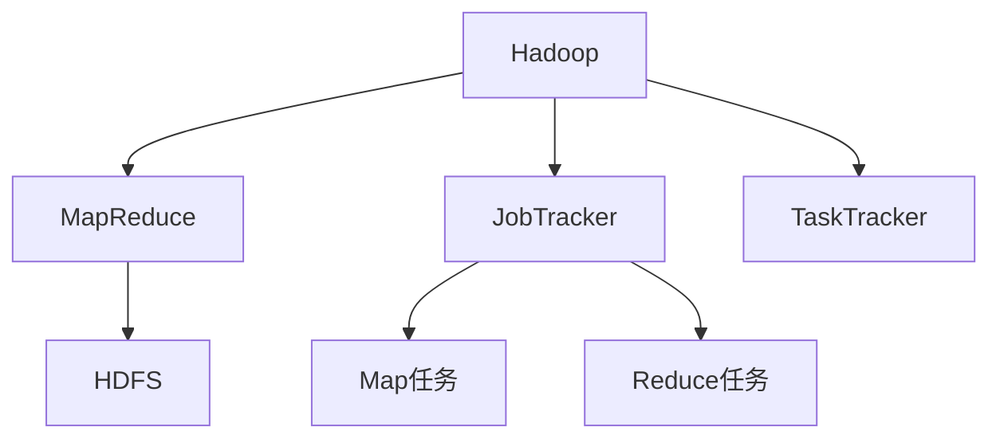
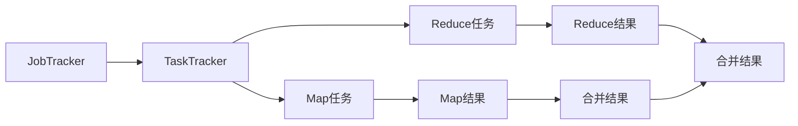
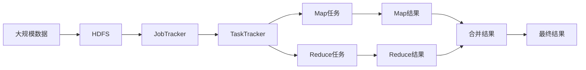

                 

# Hadoop MapReduce计算框架原理与代码实例讲解

## 1. 背景介绍

### 1.1 问题由来
随着互联网和数据存储技术的飞速发展，海量数据的存储和分析需求日益增长。传统的关系型数据库在处理大规模数据时显得力不从心，性能瓶颈明显。Hadoop MapReduce计算框架应运而生，以其高扩展性和处理海量数据的能力，成为数据处理领域的主流技术。

Hadoop MapReduce的核心思想是将大规模数据处理任务划分为多个小任务，利用并行计算的方式高效地完成。每个小任务又进一步划分为Map和Reduce两个阶段，通过将数据切分、分布式处理、合并结果的方式，大幅提升了数据处理效率。

### 1.2 问题核心关键点
Hadoop MapReduce的核心在于其独特的“分而治之”的设计理念和并行计算框架。其主要思想是将大规模的数据集切分成小数据块，通过分布式计算将每个数据块分配给不同的计算节点处理，最终将各个节点的中间结果进行合并和汇总，得到最终的结果。

## 2. 核心概念与联系

### 2.1 核心概念概述

为了更好地理解Hadoop MapReduce框架，本节将介绍几个密切相关的核心概念：

- **Hadoop**：一个开源的分布式计算框架，支持大规模数据处理、分布式存储和计算。Hadoop MapReduce是Hadoop的核心组件之一，用于分布式计算大规模数据。

- **MapReduce**：一种编程模型和算法框架，用于分布式计算大规模数据集。其核心思想是将大规模数据集分解成多个小数据块，通过Map和Reduce两个阶段进行并行处理。

- **JobTracker**：负责作业调度和节点管理，决定Map和Reduce任务分配给哪些节点。

- **TaskTracker**：具体执行Map和Reduce任务的节点。

- **HDFS（Hadoop Distributed File System）**：Hadoop的分布式文件系统，用于存储海量数据。

- **Map任务**：将输入数据切分成多个小数据块，并行处理。

- **Reduce任务**：将Map任务处理结果进行合并、汇总，生成最终结果。

这些核心概念之间的逻辑关系可以通过以下Mermaid流程图来展示：



这个流程图展示了Hadoop和MapReduce的基本架构，以及JobTracker和TaskTracker的作用。

### 2.2 概念间的关系

这些核心概念之间存在着紧密的联系，形成了Hadoop MapReduce的完整生态系统。下面我通过几个Mermaid流程图来展示这些概念之间的关系。

#### 2.2.1 数据处理流程


这个流程图展示了Hadoop MapReduce的基本数据处理流程：大规模数据输入，通过JobTracker调度分配Map和Reduce任务，最终在TaskTracker上并行执行，生成最终结果。

#### 2.2.2 JobTracker与TaskTracker的交互



这个流程图展示了JobTracker与TaskTracker之间的交互，以及Map和Reduce任务的执行过程。JobTracker负责调度和监控任务，TaskTracker则具体执行Map和Reduce任务，并将中间结果反馈给JobTracker，最后JobTracker将各个节点的中间结果合并生成最终结果。

### 2.3 核心概念的整体架构

最后，我们用一个综合的流程图来展示这些核心概念在大规模数据处理中的整体架构：



这个综合流程图展示了Hadoop MapReduce在处理大规模数据时的整体架构：大规模数据存储在HDFS中，通过JobTracker调度分配Map和Reduce任务，在TaskTracker上并行执行，最终将各个节点的中间结果合并生成最终结果。

## 3. 核心算法原理 & 具体操作步骤
### 3.1 算法原理概述

Hadoop MapReduce的核心算法原理是“分而治之”的思想，即通过将大规模数据集切分成多个小数据块，通过分布式计算的方式并行处理，最终将各个节点的中间结果进行合并和汇总，得到最终的结果。

其核心思想如下：
1. **数据切分（Split）**：将大规模数据集切分成多个小数据块，每个小数据块大小通常为100MB到1GB。
2. **Map任务处理**：在多个节点上并行执行Map任务，每个节点处理一个或多个小数据块，生成中间结果。
3. **中间结果合并（Shuffle）**：将各个节点的中间结果进行合并和排序，形成新的数据块。
4. **Reduce任务处理**：在多个节点上并行执行Reduce任务，对中间结果进行汇总和处理，生成最终结果。

### 3.2 算法步骤详解

Hadoop MapReduce的运行过程大致分为以下几个步骤：

1. **Job提交**：用户提交一个Hadoop作业，包括输入数据、输出路径、作业类型等信息。
2. **作业调度**：JobTracker将作业拆分成多个任务，并将任务调度到TaskTracker上执行。
3. **Map任务执行**：TaskTracker根据调度信息，执行Map任务，将输入数据切分成小数据块，并行处理。
4. **中间结果合并**：将各个Map任务的中间结果进行合并和排序，形成新的数据块。
5. **Reduce任务执行**：TaskTracker根据调度信息，执行Reduce任务，对中间结果进行汇总和处理，生成最终结果。
6. **结果输出**：将最终结果写入HDFS输出路径，完成作业执行。

### 3.3 算法优缺点

Hadoop MapReduce的优点在于其高扩展性和高容错性，能够处理大规模数据集，并支持多节点分布式计算。然而，其也存在一些缺点：

- **编程复杂**：用户需要编写复杂的Map和Reduce函数，代码可读性和维护性较差。
- **延迟较高**：Map和Reduce任务之间的数据传输和合并操作需要消耗一定的时间，导致延迟较高。
- **资源利用率低**：在数据切分和合并过程中，存在大量的数据传输和存储，资源利用率较低。

### 3.4 算法应用领域

Hadoop MapReduce在数据处理领域有着广泛的应用，覆盖了几乎所有常见的大数据处理任务，例如：

- **数据仓库**：将海量的日志、用户行为等数据存储在HDFS中，通过MapReduce进行数据清洗、汇总、分析等操作，生成数据仓库。
- **搜索引擎**：将海量的网页数据存储在HDFS中，通过MapReduce进行数据索引和查询优化，提升搜索引擎的效率和准确性。
- **推荐系统**：将用户行为数据、商品信息等数据存储在HDFS中，通过MapReduce进行数据分析和模型训练，生成推荐结果。
- **图像处理**：将大量的图像数据存储在HDFS中，通过MapReduce进行图像分割、特征提取、分类等操作，生成图像处理结果。
- **视频处理**：将大量的视频数据存储在HDFS中，通过MapReduce进行视频编码、压缩、存储等操作，生成视频处理结果。
- **自然语言处理**：将大量的文本数据存储在HDFS中，通过MapReduce进行文本分词、词性标注、情感分析等操作，生成自然语言处理结果。

除了这些常见应用外，Hadoop MapReduce还被创新性地应用到更多场景中，如数据挖掘、社交网络分析、物联网数据处理等，为大数据处理带来了全新的突破。

## 4. 数学模型和公式 & 详细讲解 & 举例说明
### 4.1 数学模型构建

假设输入数据集为 $D=\{x_1,x_2,\ldots,x_n\}$，每个数据点 $x_i$ 被切分成若干个小数据块 $s_i$，Map任务处理每个小数据块 $s_i$ 生成中间结果 $m_i$，Reduce任务将 $m_i$ 合并生成最终结果 $y$。

数学上，MapReduce的计算过程可以表示为：

$$
y = f(\{m_i\})
$$

其中 $f$ 为Reduce函数。

### 4.2 公式推导过程

以下是MapReduce中Map任务的详细公式推导过程。

假设输入数据集为 $D=\{x_1,x_2,\ldots,x_n\}$，每个数据点 $x_i$ 被切分成若干个小数据块 $s_i$，Map任务处理每个小数据块 $s_i$ 生成中间结果 $m_i$。

Map函数的输入为 $(k,v)$，其中 $k$ 为键，$v$ 为值。Map函数的输出为 $(k',v')$，其中 $k'$ 为键，$v'$ 为值。Map函数的一般形式为：

$$
(k',v') = f(k,v)
$$

其中 $f$ 为Map函数。

### 4.3 案例分析与讲解

以文本处理为例，假设我们有一篇英文文章，需要进行单词计数。我们可以将文章中的每个单词作为输入数据，每个单词被切分成若干个小数据块，每个小数据块由单词和出现次数组成。Map任务对每个小数据块进行处理，生成中间结果，Reduce任务将中间结果合并，生成最终单词计数结果。

具体步骤如下：

1. 将文章中的每个单词作为输入数据，切分成若干个小数据块，每个小数据块由单词和出现次数组成。
2. 对每个小数据块进行处理，生成中间结果 $(k',v')$，其中 $k'$ 为单词，$v'$ 为出现次数。
3. 将中间结果 $(k',v')$ 合并，生成最终单词计数结果 $y$。

## 5. 项目实践：代码实例和详细解释说明
### 5.1 开发环境搭建

在进行MapReduce实践前，我们需要准备好开发环境。以下是使用Java进行MapReduce开发的环境配置流程：

1. 安装Java JDK：从官网下载并安装Java JDK，用于编译和运行MapReduce程序。
2. 安装Hadoop：从官网下载并安装Hadoop，包含HDFS和MapReduce组件。
3. 配置Hadoop环境：在`$HADOOP_HOME/conf/core-site.xml`、`$HADOOP_HOME/conf/hdfs-site.xml`、`$HADOOP_HOME/conf/yarn-site.xml`等配置文件中，配置Hadoop的运行参数和数据存储路径。
4. 安装IDE：如Eclipse、IntelliJ IDEA等IDE工具，便于编写和调试MapReduce程序。

完成上述步骤后，即可在Hadoop环境中开始MapReduce实践。

### 5.2 源代码详细实现

下面我们以WordCount为例，给出使用Java实现MapReduce程序的详细代码实现。

```java
import java.io.IOException;
import org.apache.hadoop.conf.Configuration;
import org.apache.hadoop.fs.Path;
import org.apache.hadoop.io.IntWritable;
import org.apache.hadoop.io.Text;
import org.apache.hadoop.mapreduce.Job;
import org.apache.hadoop.mapreduce.Mapper;
import org.apache.hadoop.mapreduce.Reducer;
import org.apache.hadoop.mapreduce.lib.input.FileInputFormat;
import org.apache.hadoop.mapreduce.lib.output.FileOutputFormat;

public class WordCount {

    public static class TokenizerMapper
       extends Mapper<Object, Text, Text, IntWritable> {

        private final static IntWritable one = new IntWritable(1);
        private Text word = new Text();

        public void map(Object key, Text value, Context context
                        ) throws IOException, InterruptedException {
            StringTokenizer itr = new StringTokenizer(value.toString());
            while (itr.hasMoreTokens()) {
                word.set(itr.nextToken());
                context.write(word, one);
            }
        }
    }

    public static class IntSumReducer
       extends Reducer<Text,IntWritable,Text,IntWritable> {
        private IntWritable result = new IntWritable();

        public void reduce(Text key, Iterable<IntWritable> values,
                Context context
                ) throws IOException, InterruptedException {
            int sum = 0;
            for (IntWritable val : values) {
                sum += val.get();
            }
            result.set(sum);
            context.write(key, result);
        }
    }

    public static void main(String[] args) throws Exception {
        Configuration conf = new Configuration();
        Job job = Job.getInstance(conf, "word count");
        job.setJarByClass(WordCount.class);
        job.setMapperClass(TokenizerMapper.class);
        job.setCombinerClass(IntSumReducer.class);
        job.setReducerClass(IntSumReducer.class);
        job.setOutputKeyClass(Text.class);
        job.setOutputValueClass(IntWritable.class);
        FileInputFormat.addInputPath(job, new Path(args[0]));
        FileOutputFormat.setOutputPath(job, new Path(args[1]));
        System.exit(job.waitForCompletion(true) ? 0 : 1);
    }
}
```

以上代码实现了WordCount的MapReduce程序，实现了将输入文本文件中的单词进行计数的功能。

### 5.3 代码解读与分析

让我们再详细解读一下关键代码的实现细节：

**TokenizerMapper类**：
- `map`方法：将输入的文本数据切分成单词，生成中间结果。
- `set`方法：将单词和出现次数作为键值对输出。

**IntSumReducer类**：
- `reduce`方法：对中间结果进行汇总，生成最终单词计数结果。
- `set`方法：将单词和总出现次数作为键值对输出。

**WordCount.main方法**：
- 配置Hadoop运行参数，启动MapReduce作业。
- 指定Mapper类和Reducer类，设置输出键值类型。
- 输入路径和输出路径。

这个MapReduce程序的运行步骤如下：

1. Mapper任务对输入文本数据进行处理，将单词切分成小数据块，并生成中间结果 $(k',v')$，其中 $k'$ 为单词，$v'$ 为出现次数。
2. Reduce任务对中间结果进行汇总，生成最终单词计数结果 $y$。

### 5.4 运行结果展示

假设我们在Hadoop集群上运行WordCount程序，输入文件为`input.txt`，输出目录为`output`，则输出结果为每个单词的出现次数。

例如，输入文件`input.txt`为：
```
apple banana orange apple banana
```

则运行结果为：
```
apple 2
banana 2
orange 1
```

可以看到，WordCount程序能够正确地统计输入文本中每个单词的出现次数。

## 6. 实际应用场景
### 6.1 智能推荐系统

智能推荐系统是大数据处理领域的典型应用之一，通过分析用户的浏览、购买等行为数据，为用户推荐感兴趣的商品、文章等内容。Hadoop MapReduce可以用于对大规模用户行为数据进行分布式处理，生成推荐结果。

具体而言，可以将用户行为数据存储在HDFS中，通过MapReduce进行数据清洗、特征提取、模型训练等操作，生成推荐结果。例如，可以使用协同过滤、矩阵分解等算法，对用户行为数据进行分析，生成推荐结果。

### 6.2 金融风险管理

金融领域的数据量庞大，实时性要求高，Hadoop MapReduce可以用于对海量金融数据进行实时处理，生成风险评估结果。例如，可以将金融交易数据存储在HDFS中，通过MapReduce进行数据清洗、特征提取、风险评估等操作，生成风险评估结果。

具体而言，可以将金融交易数据按时间段切分成小数据块，对每个小数据块进行处理，生成中间结果，最后对中间结果进行汇总和风险评估。

### 6.3 医疗数据分析

医疗领域的数据量庞大，处理复杂，Hadoop MapReduce可以用于对海量医疗数据进行分布式处理，生成分析结果。例如，可以将病历数据存储在HDFS中，通过MapReduce进行数据清洗、特征提取、数据分析等操作，生成分析结果。

具体而言，可以将病历数据按患者ID切分成小数据块，对每个小数据块进行处理，生成中间结果，最后对中间结果进行汇总和分析。

### 6.4 未来应用展望

随着Hadoop MapReduce技术的不断演进，其在数据处理领域的应用将更加广泛，为各个行业带来巨大的变革性影响。

在未来，Hadoop MapReduce将在更多领域得到应用，为传统行业数字化转型升级提供新的技术路径。例如：

- 在智慧医疗领域，Hadoop MapReduce可以用于病历数据分析、医学图像处理、药物研发等，为医疗服务智能化提供技术支持。
- 在智能教育领域，Hadoop MapReduce可以用于学生学习行为分析、教学资源推荐等，为教育公平和教学质量提升提供技术保障。
- 在智慧城市治理中，Hadoop MapReduce可以用于城市事件监测、舆情分析、应急指挥等，为城市管理智能化提供技术支持。

此外，在企业生产、社会治理、文娱传媒等众多领域，Hadoop MapReduce也将不断涌现，为各行各业数字化转型升级提供新的技术手段。

## 7. 工具和资源推荐
### 7.1 学习资源推荐

为了帮助开发者系统掌握Hadoop MapReduce的理论基础和实践技巧，这里推荐一些优质的学习资源：

1. Hadoop官方文档：Hadoop官方网站提供的详细文档，包括MapReduce、HDFS、YARN等组件的详细介绍和使用指南。
2. Hadoop权威指南：这是一本由Hadoop专家撰写的权威指南，详细介绍了Hadoop的架构、开发、运维等方面的内容。
3. Hadoop实战指南：这是一本实战性很强的指南，通过具体的项目案例，介绍了Hadoop的部署、开发、调优等方面的内容。
4. Hadoop社区资源：Hadoop社区提供了大量的教程、代码示例、工具包等资源，是学习和使用Hadoop的重要参考。
5. Coursera Hadoop课程：Coursera提供的Hadoop课程，由知名教授讲授，涵盖Hadoop的基础、开发、调优等方面的内容。

通过对这些资源的学习实践，相信你一定能够快速掌握Hadoop MapReduce的精髓，并用于解决实际的分布式计算问题。

### 7.2 开发工具推荐

高效的开发离不开优秀的工具支持。以下是几款用于Hadoop MapReduce开发常用的工具：

1. Eclipse：开源的IDE工具，支持Hadoop的开发和调试。
2. IntelliJ IDEA：开源的IDE工具，支持Hadoop的开发和调试。
3. Hive：基于Hadoop的数据仓库工具，支持SQL语言进行数据处理。
4. Pig：基于Hadoop的数据流语言，支持高层次的数据处理。
5. Cloudera Manager：Cloudera提供的Hadoop管理工具，支持Hadoop集群的管理和监控。
6. Hadoop生态工具：如Spark、HBase、Flume等，是Hadoop生态中的重要组件，支持分布式计算和数据存储。

合理利用这些工具，可以显著提升Hadoop MapReduce的开发效率，加快创新迭代的步伐。

### 7.3 相关论文推荐

Hadoop MapReduce技术的发展源于学界的持续研究。以下是几篇奠基性的相关论文，推荐阅读：

1. MapReduce: Simplified Data Processing on Large Clusters（MapReduce原论文）：介绍MapReduce的计算模型和数据处理流程。
2. Design Patterns for MapReduce Based Systems（MapReduce设计模式）：介绍MapReduce系统的设计模式和实现技巧。
3. The Hadoop Experience: HDFS in Action（Hadoop实战指南）：通过实际案例，介绍Hadoop的部署和调优技巧。
4. Hadoop: The Definitive Guide（Hadoop权威指南）：介绍Hadoop的架构、开发、运维等方面的内容。

这些论文代表了大数据处理领域的研究脉络。通过学习这些前沿成果，可以帮助研究者把握学科前进方向，激发更多的创新灵感。

除上述资源外，还有一些值得关注的前沿资源，帮助开发者紧跟Hadoop MapReduce技术的最新进展，例如：

1. arXiv论文预印本：人工智能领域最新研究成果的发布平台，包括大量尚未发表的前沿工作，学习前沿技术的必读资源。
2. Hadoop用户社区：Hadoop社区提供的用户反馈和讨论平台，是学习和交流Hadoop知识的重要场所。
3. 业界技术博客：如Hadoop官方博客、Cloudera博客、Apache Hadoop博客等，分享最新的技术进展和应用实践。

总之，对于Hadoop MapReduce技术的学习和实践，需要开发者保持开放的心态和持续学习的意愿。多关注前沿资讯，多动手实践，多思考总结，必将收获满满的成长收益。

## 8. 总结：未来发展趋势与挑战
### 8.1 总结

本文对Hadoop MapReduce计算框架进行了全面系统的介绍。首先阐述了Hadoop MapReduce的历史背景和应用场景，明确了其在处理大规模数据方面的独特价值。其次，从原理到实践，详细讲解了MapReduce的数学模型和关键步骤，给出了MapReduce任务开发的完整代码实例。同时，本文还广泛探讨了MapReduce在智能推荐系统、金融风险管理、医疗数据分析等多个领域的应用前景，展示了MapReduce技术的巨大潜力。此外，本文精选了MapReduce技术的各类学习资源，力求为读者提供全方位的技术指引。

通过本文的系统梳理，可以看到，Hadoop MapReduce技术在大数据处理领域已经取得了显著成果，极大地提升了数据处理的效率和灵活性。未来，伴随Hadoop生态的不断演进，MapReduce技术也将迎来更多的创新和突破。

### 8.2 未来发展趋势

展望未来，Hadoop MapReduce技术将呈现以下几个发展趋势：

1. **云化部署**：随着云计算技术的发展，越来越多的企业采用云化部署方式，Hadoop MapReduce将更好地支持云平台，实现弹性计算资源管理。
2. **容器化**：Hadoop MapReduce将更好地支持容器化技术，如Kubernetes、Docker等，提升应用的可移植性和运维效率。
3. **流式计算**：Hadoop MapReduce将支持流式计算模型，实时处理海量数据流，满足实时性需求。
4. **分布式存储**：Hadoop MapReduce将更好地支持分布式存储技术，如Amazon S3、Microsoft Azure Blob等，提升数据存储和管理的效率。
5. **混合计算**：Hadoop MapReduce将支持混合计算模式，如云计算和边缘计算的融合，提升数据处理的灵活性和效率。

以上趋势凸显了Hadoop MapReduce技术的广阔前景。这些方向的探索发展，必将进一步提升大数据处理的技术水平，为各行各业提供更加高效、可靠、灵活的数据处理服务。

### 8.3 面临的挑战

尽管Hadoop MapReduce技术已经取得了瞩目成就，但在迈向更加智能化、普适化应用的过程中，它仍面临着诸多挑战：

1. **编程复杂**：Hadoop MapReduce的编程模型相对复杂，需要编写大量的Map和Reduce函数，代码可读性和维护性较差。
2. **资源利用率低**：在数据切分和合并过程中，存在大量的数据传输和存储，资源利用率较低。
3. **延迟较高**：Map和Reduce任务之间的数据传输和合并操作需要消耗一定的时间，导致延迟较高。
4. **扩展性差**：Hadoop MapReduce的扩展性相对较差，难以适应大规模集群和高并发场景。
5. **安全性和隐私保护**：大规模数据处理过程中，数据安全和隐私保护问题尤为突出，需要更多的技术手段进行保障。

### 8.4 未来突破

面对Hadoop MapReduce所面临的种种挑战，未来的研究需要在以下几个方面寻求新的突破：

1. **编程模型简化**：开发更加简化、易用的编程模型，提高开发者工作效率，降低编程复杂度。
2. **资源利用率优化**：优化数据切分和合并过程，减少数据传输和存储，提高资源利用率。
3. **低延迟优化**：采用流式计算等技术，降低Map和Reduce任务之间的延迟，提升数据处理效率。
4. **扩展性改进**：引入分布式存储和计算技术，如Kafka、Spark等，提升Hadoop MapReduce的扩展性和性能。
5. **安全性和隐私保护**：引入数据加密、访问控制等技术手段，保障数据安全和隐私保护。

这些研究方向的探索，必将引领Hadoop MapReduce技术迈向更高的台阶，为大数据处理带来新的创新和突破。面向未来，Hadoop MapReduce技术还需要与其他大数据处理技术进行更深入的融合，如Spark、Kafka等，多路径协同发力，共同推动大数据处理技术的进步。只有勇于创新、敢于突破，才能不断拓展大数据处理技术的边界，让大数据技术更好地服务社会和经济。

## 9. 附录：常见问题与解答

**Q1：Hadoop MapReduce是否只适用于大数据处理？**

A: Hadoop MapReduce的核心思想是“分而治之”，适用于大规模数据处理。但是，对于小规模数据集，MapReduce的优势并不明显。因此，Hadoop MapReduce主要适用于大规模数据处理，特别是对于数据量较大的行业，如金融、医疗、电商等，具有很强的适用性。

**Q2：Hadoop MapReduce是否可以与Spark、Hive等技术协同使用？**

A: Hadoop MapReduce可以与Spark、Hive等技术协同使用，形成更强大的数据处理能力。例如，可以将Hadoop用于离线批处理，Spark用于实时流处理，Hive用于数据仓库，三种技术互补，满足不同场景的数据处理需求。

**Q3：如何优化Hadoop MapReduce的性能？**

A: 优化Hadoop MapReduce的性能可以从以下几个方面入手：

1. 

