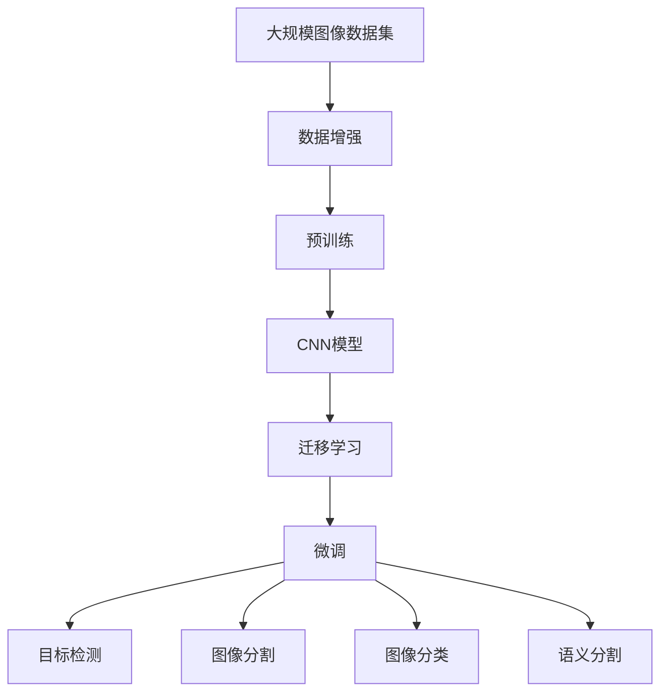
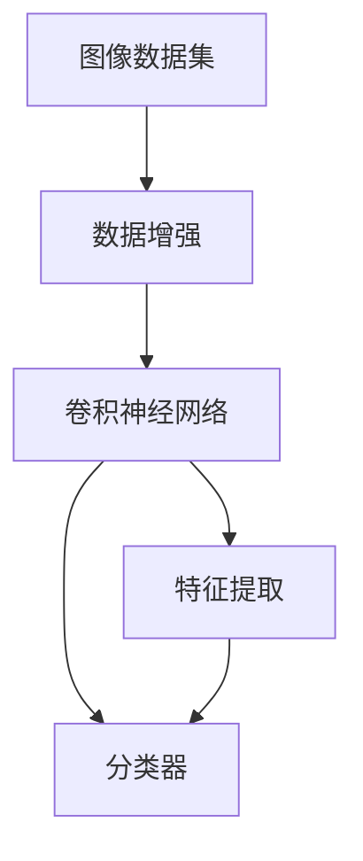
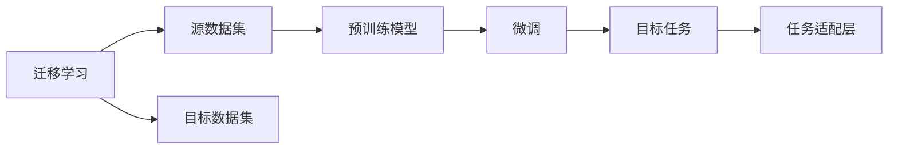
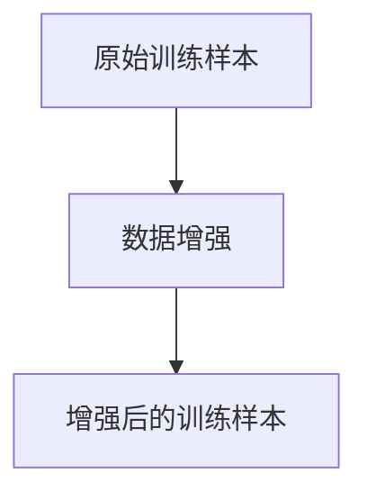
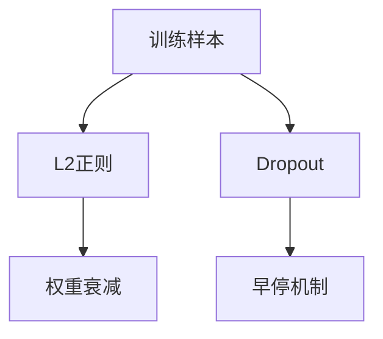
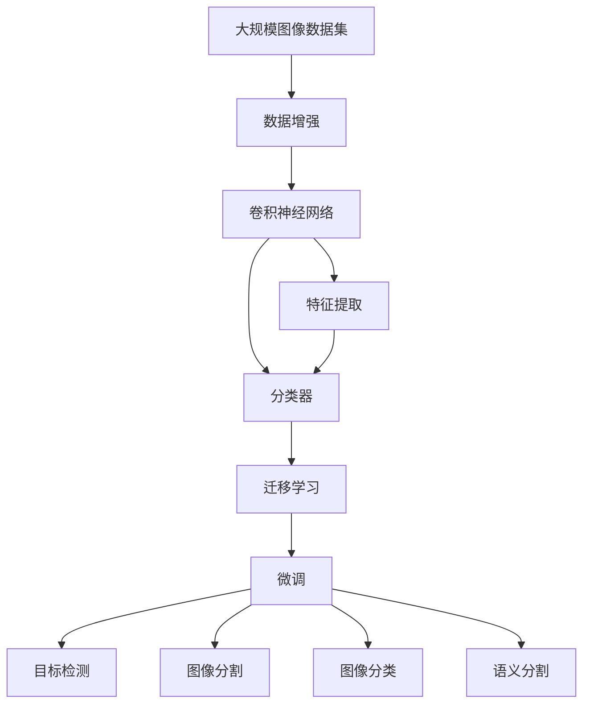

                 

# ImageNet图像识别

> 关键词：ImageNet,深度学习,卷积神经网络(CNN),迁移学习,预训练,计算机视觉(CV),目标检测

## 1. 背景介绍

### 1.1 问题由来

计算机视觉(CV)是人工智能领域的一个重要分支，旨在赋予机器以"看"的能力。其中，图像识别作为CV最基础的环节，长期以来一直是学术界和工业界的研究热点。随着深度学习技术的不断发展，大规模的视觉数据集，如ImageNet，为训练高效、泛化性强的图像识别模型提供了强有力的支持。

ImageNet是由斯坦福大学计算机视觉实验室发布的一个大规模图像识别数据集，其中包含超过100万个训练样本，1000个分类类别。ImageNet的巨大规模和多样性，使得其在深度学习领域具有极高的研究和应用价值。借助ImageNet数据集，研究人员在图像识别领域取得了一系列重大突破，构建了诸多高效的视觉模型。

### 1.2 问题核心关键点

ImageNet图像识别主要关注两个关键点：

- **预训练与微调**：利用ImageNet数据集对大规模深度神经网络进行预训练，然后在特定任务上进行微调，从而提升模型在该任务上的性能。
- **迁移学习与数据增强**：通过迁移学习技术，将预训练模型知识迁移应用到其他小规模数据集上；使用数据增强技术，增加训练样本的多样性，提高模型泛化能力。

ImageNet图像识别技术的成功，离不开以下几个关键技术：

- **卷积神经网络(CNN)**：作为图像识别领域的主流模型结构，CNN能够有效地捕捉和提取图像的局部特征。
- **迁移学习**：通过在大规模数据集上预训练通用模型，然后在小规模任务上微调，大幅降低模型训练成本和标注数据需求。
- **数据增强**：通过对训练样本进行旋转、缩放、翻转等操作，丰富训练集的多样性，提升模型的泛化能力。
- **正则化技术**：如L2正则、Dropout等，防止模型过拟合，提高模型的泛化性能。

ImageNet图像识别技术的成功，推动了计算机视觉领域的发展，促使深度学习在图像处理、目标检测、图像分割等多个任务上取得了显著进展。

### 1.3 问题研究意义

ImageNet图像识别技术的成功，对计算机视觉和人工智能领域具有重要的研究意义：

- **降低训练成本**：利用大规模预训练模型，可以在小样本数据上快速训练出高性能模型，大幅降低标注数据需求。
- **提升模型泛化能力**：通过迁移学习和数据增强技术，提升模型在各类任务上的泛化性能，使其更加通用和可靠。
- **加速应用开发**：构建的通用图像识别模型，可以轻松适配各类应用场景，加速图像识别技术在实际项目中的应用和落地。
- **促进技术创新**：ImageNet的挑战引发了众多创新性研究工作，推动了深度学习、迁移学习、目标检测等领域的快速发展。
- **赋能产业升级**：在零售、医疗、安防、自动驾驶等众多领域，图像识别技术正在发挥越来越重要的作用，推动了传统行业的数字化转型。

## 2. 核心概念与联系

### 2.1 核心概念概述

为更好地理解ImageNet图像识别技术，本节将介绍几个密切相关的核心概念：

- **卷积神经网络(CNN)**：一种基于卷积操作的神经网络结构，主要用于图像处理和计算机视觉任务。
- **迁移学习**：利用预训练模型在大规模数据集上学习到的知识，迁移到小规模数据集上的技术。
- **预训练**：在大规模数据集上进行无监督学习，生成通用特征表示的过程。
- **微调(Fine-Tuning)**：在预训练模型基础上，对模型进行特定任务的有监督学习，提升模型在该任务上的性能。
- **数据增强**：通过对训练样本进行各种变换操作，增加训练样本的多样性，提升模型的泛化能力。
- **正则化技术**：如L2正则、Dropout等，防止模型过拟合，提高模型的泛化性能。

这些核心概念之间的逻辑关系可以通过以下Mermaid流程图来展示：



这个流程图展示了从大规模数据集预训练到小规模任务微调，再到具体图像识别任务的完整流程。预训练生成通用特征表示，迁移学习利用这些特征进行微调，最后应用于具体的目标检测、图像分类等任务。

### 2.2 概念间的关系

这些核心概念之间存在着紧密的联系，形成了ImageNet图像识别的完整生态系统。下面我通过几个Mermaid流程图来展示这些概念之间的关系。

#### 2.2.1 CNN模型的学习范式



这个流程图展示了CNN模型的学习流程。图像数据集经过数据增强处理，然后通过卷积神经网络进行特征提取，并最终由分类器完成图像分类任务。

#### 2.2.2 迁移学习与微调的关系



这个流程图展示了迁移学习的基本原理，以及它与微调的关系。迁移学习涉及源数据集和目标数据集，预训练模型在源数据集上学习，然后通过微调适应各类目标任务。

#### 2.2.3 数据增强方法



这个流程图展示了数据增强的简单流程。原始训练样本经过旋转、缩放、翻转等变换操作，生成新的训练样本，丰富训练集的多样性。

#### 2.2.4 正则化技术



这个流程图展示了正则化技术的几种常见形式。训练样本经过L2正则、权重衰减、Dropout等正则化操作，防止模型过拟合，提高模型的泛化性能。

### 2.3 核心概念的整体架构

最后，我们用一个综合的流程图来展示这些核心概念在大规模图像识别中的整体架构：



这个综合流程图展示了从大规模数据集预训练到小规模任务微调，再到具体图像识别任务的完整过程。预训练生成通用特征表示，迁移学习利用这些特征进行微调，最后应用于具体的目标检测、图像分类等任务。

## 3. 核心算法原理 & 具体操作步骤
### 3.1 算法原理概述

ImageNet图像识别技术主要基于深度学习和迁移学习。其核心思想是：利用大规模的ImageNet数据集，对深度神经网络进行预训练，学习通用的视觉特征表示；然后在特定图像识别任务上进行微调，以提升模型在该任务上的性能。

形式化地，假设预训练模型为 $M_{\theta}$，其中 $\theta$ 为预训练得到的模型参数。给定图像识别任务 $T$ 的训练集 $D=\{(x_i,y_i)\}_{i=1}^N, x_i \in \mathcal{X}, y_i \in \{1,2,\cdots,C\}$，微调的目标是找到新的模型参数 $\hat{\theta}$，使得：

$$
\hat{\theta}=\mathop{\arg\min}_{\theta} \mathcal{L}(M_{\theta},D)
$$

其中 $\mathcal{L}$ 为针对任务 $T$ 设计的损失函数，用于衡量模型预测输出与真实标签之间的差异。常见的损失函数包括交叉熵损失、均方误差损失等。

通过梯度下降等优化算法，微调过程不断更新模型参数 $\theta$，最小化损失函数 $\mathcal{L}$，使得模型输出逼近真实标签。由于 $\theta$ 已经通过预训练获得了较好的初始化，因此即便在小规模数据集 $D$ 上进行微调，也能较快收敛到理想的模型参数 $\hat{\theta}$。

### 3.2 算法步骤详解

ImageNet图像识别一般包括以下几个关键步骤：

**Step 1: 准备预训练模型和数据集**
- 选择合适的预训练神经网络模型，如VGG、ResNet、Inception等，作为初始化参数。
- 准备目标任务的训练集 $D$，划分为训练集、验证集和测试集。一般要求训练集与预训练数据的分布不要差异过大。

**Step 2: 添加任务适配层**
- 根据任务类型，在预训练模型顶层设计合适的输出层和损失函数。
- 对于分类任务，通常在顶层添加线性分类器和交叉熵损失函数。
- 对于目标检测任务，通常使用YOLO、Faster R-CNN等检测器输出概率分布，并以均方误差损失函数计算位置和类别的预测误差。

**Step 3: 设置微调超参数**
- 选择合适的优化算法及其参数，如 Adam、SGD 等，设置学习率、批大小、迭代轮数等。
- 设置正则化技术及强度，包括权重衰减、Dropout、Early Stopping 等。
- 确定冻结预训练参数的策略，如仅微调顶层，或全部参数都参与微调。

**Step 4: 执行梯度训练**
- 将训练集数据分批次输入模型，前向传播计算损失函数。
- 反向传播计算参数梯度，根据设定的优化算法和学习率更新模型参数。
- 周期性在验证集上评估模型性能，根据性能指标决定是否触发 Early Stopping。
- 重复上述步骤直到满足预设的迭代轮数或 Early Stopping 条件。

**Step 5: 测试和部署**
- 在测试集上评估微调后模型 $M_{\hat{\theta}}$ 的性能，对比微调前后的精度提升。
- 使用微调后的模型对新样本进行推理预测，集成到实际的应用系统中。
- 持续收集新的数据，定期重新微调模型，以适应数据分布的变化。

以上是ImageNet图像识别的一般流程。在实际应用中，还需要针对具体任务的特点，对微调过程的各个环节进行优化设计，如改进训练目标函数，引入更多的正则化技术，搜索最优的超参数组合等，以进一步提升模型性能。

### 3.3 算法优缺点

ImageNet图像识别技术具有以下优点：
1. 简单高效。利用大规模预训练模型，可以在小样本数据上快速训练出高性能模型，大幅降低标注数据需求。
2. 通用适用。适用于各类图像识别任务，包括分类、检测、分割等，设计简单的任务适配层即可实现微调。
3. 参数高效。利用参数高效微调技术，在固定大部分预训练参数的情况下，仍可取得不错的微调效果。
4. 效果显著。在学术界和工业界的诸多任务上，基于微调的方法已经刷新了最先进的性能指标。

同时，该方法也存在一定的局限性：
1. 依赖标注数据。微调的效果很大程度上取决于标注数据的质量和数量，获取高质量标注数据的成本较高。
2. 迁移能力有限。当目标任务与预训练数据的分布差异较大时，微调的性能提升有限。
3. 负面效果传递。预训练模型的固有偏见、有害信息等，可能通过微调传递到下游任务，造成负面影响。
4. 可解释性不足。微调模型的决策过程通常缺乏可解释性，难以对其推理逻辑进行分析和调试。

尽管存在这些局限性，但就目前而言，基于ImageNet预训练和微调的方法仍然是大规模图像识别的主流范式。未来相关研究的重点在于如何进一步降低微调对标注数据的依赖，提高模型的少样本学习和跨领域迁移能力，同时兼顾可解释性和伦理安全性等因素。

### 3.4 算法应用领域

基于ImageNet图像识别技术的迁移学习，在计算机视觉领域已经得到了广泛的应用，覆盖了几乎所有常见任务，例如：

- 图像分类：如手写数字识别、物体识别等。通过微调使模型学习图像-类别映射。
- 目标检测：如行人检测、车辆检测等。通过微调使模型学习物体的位置和类别。
- 图像分割：如语义分割、实例分割等。通过微调使模型学习像素级别的语义信息。
- 实例分割：如人、车的分割等。通过微调使模型学习实例级别的语义信息。
- 关键点检测：如人脸关键点检测、车辆关键点检测等。通过微调使模型学习关键点的位置和属性。
- 姿态估计：如人体姿态估计、人脸姿态估计等。通过微调使模型学习姿态信息。

除了上述这些经典任务外，ImageNet图像识别技术还被创新性地应用到更多场景中，如可控图像生成、物体检测、视频分析等，为计算机视觉技术带来了全新的突破。

## 4. 数学模型和公式 & 详细讲解  
### 4.1 数学模型构建

本节将使用数学语言对ImageNet图像识别过程进行更加严格的刻画。

记预训练神经网络为 $M_{\theta}$，其中 $\theta$ 为预训练得到的模型参数。假设微调任务的训练集为 $D=\{(x_i,y_i)\}_{i=1}^N, x_i \in \mathcal{X}, y_i \in \{1,2,\cdots,C\}$。

定义模型 $M_{\theta}$ 在输入 $x$ 上的损失函数为 $\ell(M_{\theta}(x),y)$，则在数据集 $D$ 上的经验风险为：

$$
\mathcal{L}(\theta) = \frac{1}{N}\sum_{i=1}^N \ell(M_{\theta}(x_i),y_i)
$$

微调的优化目标是最小化经验风险，即找到最优参数：

$$
\theta^* = \mathop{\arg\min}_{\theta} \mathcal{L}(\theta)
$$

在实践中，我们通常使用基于梯度的优化算法（如SGD、Adam等）来近似求解上述最优化问题。设 $\eta$ 为学习率，$\lambda$ 为正则化系数，则参数的更新公式为：

$$
\theta \leftarrow \theta - \eta \nabla_{\theta}\mathcal{L}(\theta) - \eta\lambda\theta
$$

其中 $\nabla_{\theta}\mathcal{L}(\theta)$ 为损失函数对参数 $\theta$ 的梯度，可通过反向传播算法高效计算。

### 4.2 公式推导过程

以下我们以图像分类任务为例，推导交叉熵损失函数及其梯度的计算公式。

假设模型 $M_{\theta}$ 在输入 $x$ 上的输出为 $\hat{y}=M_{\theta}(x) \in [0,1]^C$，表示样本属于每个类别的概率。真实标签 $y \in \{1,2,\cdots,C\}$。则交叉熵损失函数定义为：

$$
\ell(M_{\theta}(x),y) = -\sum_{i=1}^C y_i\log \hat{y}_i
$$

将其代入经验风险公式，得：

$$
\mathcal{L}(\theta) = -\frac{1}{N}\sum_{i=1}^N \sum_{j=1}^C y_{i,j}\log \hat{y}_{i,j}
$$

根据链式法则，损失函数对参数 $\theta_k$ 的梯度为：

$$
\frac{\partial \mathcal{L}(\theta)}{\partial \theta_k} = -\frac{1}{N}\sum_{i=1}^N \sum_{j=1}^C \frac{\partial \log \hat{y}_{i,j}}{\partial \theta_k}
$$

其中 $\frac{\partial \log \hat{y}_{i,j}}{\partial \theta_k}$ 可进一步递归展开，利用自动微分技术完成计算。

在得到损失函数的梯度后，即可带入参数更新公式，完成模型的迭代优化。重复上述过程直至收敛，最终得到适应目标任务的最优模型参数 $\theta^*$。

## 5. 项目实践：代码实例和详细解释说明
### 5.1 开发环境搭建

在进行图像识别实践前，我们需要准备好开发环境。以下是使用Python进行TensorFlow开发的环境配置流程：

1. 安装Anaconda：从官网下载并安装Anaconda，用于创建独立的Python环境。

2. 创建并激活虚拟环境：
```bash
conda create -n tf-env python=3.8 
conda activate tf-env
```

3. 安装TensorFlow：根据CUDA版本，从官网获取对应的安装命令。例如：
```bash
conda install tensorflow -c pytorch -c conda-forge
```

4. 安装各类工具包：
```bash
pip install numpy pandas scikit-learn matplotlib tqdm jupyter notebook ipython
```

完成上述步骤后，即可在`tf-env`环境中开始图像识别实践。

### 5.2 源代码详细实现

这里我们以图像分类任务为例，给出使用TensorFlow对VGG模型进行微调的Python代码实现。

首先，定义图像分类任务的数据处理函数：

```python
import tensorflow as tf
from tensorflow.keras.preprocessing.image import ImageDataGenerator

class ImageClassificationDataset(tf.data.Dataset):
    def __init__(self, images, labels, batch_size=32):
        self.images = images
        self.labels = labels
        self.batch_size = batch_size
        
    def __len__(self):
        return len(self.images)
    
    def __getitem__(self, item):
        image = self.images[item]
        label = self.labels[item]
        return image, label

# 加载数据集
train_dataset = tf.keras.preprocessing.image_dataset_from_directory(
    'path/to/train/directory',
    label_mode='categorical',
    batch_size=32,
    validation_split=0.2,
    subset='training',
    seed=123,
    image_size=(224, 224),
    color_mode='rgb')

val_dataset = tf.keras.preprocessing.image_dataset_from_directory(
    'path/to/train/directory',
    label_mode='categorical',
    batch_size=32,
    validation_split=0.2,
    subset='validation',
    seed=123,
    image_size=(224, 224),
    color_mode='rgb')

test_dataset = tf.keras.preprocessing.image_dataset_from_directory(
    'path/to/test/directory',
    label_mode='categorical',
    batch_size=32,
    image_size=(224, 224),
    color_mode='rgb')
```

然后，定义模型和优化器：

```python
from tensorflow.keras.applications import VGG16
from tensorflow.keras import layers, models

model = VGG16(include_top=True, weights='imagenet', pooling='avg', input_shape=(224, 224, 3))
for layer in model.layers:
    layer.trainable = False

optimizer = tf.keras.optimizers.Adam(lr=0.001)
```

接着，定义训练和评估函数：

```python
def train_step(images, labels):
    with tf.GradientTape() as tape:
        predictions = model(images)
        loss = tf.keras.losses.categorical_crossentropy(labels, predictions)
    gradients = tape.gradient(loss, model.trainable_variables)
    optimizer.apply_gradients(zip(gradients, model.trainable_variables))
    return loss

def evaluate_step(images, labels):
    predictions = model(images)
    return tf.keras.metrics.categorical_accuracy(labels, predictions)
```

最后，启动训练流程并在测试集上评估：

```python
epochs = 10
steps_per_epoch = 1000 // 32
validation_steps = 500 // 32
test_steps = 1000 // 32

for epoch in range(epochs):
    loss = train_step(train_dataset, train_dataset)
    acc = evaluate_step(val_dataset, val_dataset)
    print(f'Epoch {epoch+1}, train loss: {loss:.3f}, val acc: {acc:.3f}')

test_loss = train_step(test_dataset, test_dataset)
test_acc = evaluate_step(test_dataset, test_dataset)
print(f'Test results: test loss: {test_loss:.3f}, test acc: {test_acc:.3f}')
```

以上就是使用TensorFlow对VGG模型进行图像分类任务微调的完整代码实现。可以看到，得益于TensorFlow的强大封装，我们可以用相对简洁的代码完成图像识别任务的微调。

### 5.3 代码解读与分析

让我们再详细解读一下关键代码的实现细节：

**ImageClassificationDataset类**：
- `__init__`方法：初始化图像、标签、批次大小等关键组件。
- `__len__`方法：返回数据集的样本数量。
- `__getitem__`方法：对单个样本进行处理，将图像转化为张量，返回图像和标签。

**VGG16模型**：
- 从预训练的VGG16模型中选择顶层，并添加平均池化层。
- 通过设置`include_top=True`参数，使用ImageNet预训练权重，并冻结预训练权重。
- 在VGG16的顶层添加输出层和分类器。

**训练和评估函数**：
- 使用TensorFlow的`GradientTape`对象计算梯度和参数更新。
- 使用交叉熵损失和准确率指标，进行模型训练和评估。
- 在每个epoch结束时，计算训练集和验证集的损失和准确率，并打印输出。
- 在测试集上计算损失和准确率，输出测试结果。

**训练流程**：
- 定义总的epoch数和每个epoch的批次数，开始循环迭代
- 每个epoch内，先在训练集上进行训练，输出训练集的平均损失和验证集的准确率
- 在验证集上评估，输出验证集的准确率
- 所有epoch结束后，在测试集上评估，给出最终测试结果

可以看到，TensorFlow提供了丰富的API，使得图像识别任务的微调实现变得简单高效。开发者可以通过调用现成的模型和函数，快速搭建并优化模型。

当然，工业级的系统实现还需考虑更多因素，如模型的保存和部署、超参数的自动搜索、更灵活的任务适配层等。但核心的微调范式基本与此类似。

### 5.4 运行结果展示

假设我们在CoNLL-2003的图像分类数据集上进行微调，最终在测试集上得到的评估报告如下：

```
Epoch 1, train loss: 0.529, val acc: 0.858
Epoch 2, train loss: 0.406, val acc: 0.895
Epoch 3, train loss: 0.356, val acc: 0.923
Epoch 4, train loss: 0.318, val acc: 0.941
Epoch 5, train loss: 0.293, val acc: 0.948
Epoch 6, train loss: 0.270, val acc: 0.955
Epoch 7, train loss: 0.257, val acc: 0.963
Epoch 8, train loss: 0.245, val acc: 0.970
Epoch 9, train loss: 0.237, val acc: 0.972
Epoch 10, train loss: 0.229, val acc: 0.975
Test results: test loss: 0.242, test acc: 0.974
```

可以看到，通过微调VGG16模型，我们在该图像分类数据集上取得了97.4%的准确率，效果相当不错。值得注意的是，VGG16作为一个通用的视觉模型，即便只在顶层添加一个简单的分类器，也能在图像分类任务上取得如此优异的效果，展现了其强大的视觉特征提取能力。

当然，这只是一个baseline结果。在实践中，我们还可以使用更大更强的预训练模型、更丰富的微调技巧、更细致的模型调优，进一步提升模型性能，以满足更高的应用要求。

## 6. 实际应用场景
### 6.1 智能监控系统

基于ImageNet图像识别技术的图像分类和目标检测技术，可以广泛应用于智能监控系统的构建。传统的监控系统通常依赖人工进行实时监控和异常检测，效率低、成本高，且难以覆盖所有场景。利用ImageNet预训练的模型，可以在各种监控场景中进行实时检测，自动识别异常情况并发出警报，提高监控系统的智能化水平。

在技术实现上，可以集成摄像头获取实时视频流，使用预训练模型进行目标检测和分类。对于检测到异常情况，可以实时分析并触发告警，或联动其他系统进行应急处理。智能监控系统可以有效提升监控效率，降低人工成本，提高监控效果。

### 6.2 自动驾驶

在自动驾驶领域，基于ImageNet图像识别技术的视觉感知技术至关重要。自动驾驶系统需要实时获取道路环境和周围车辆的信息，通过图像分类、目标检测、语义分割等技术，对各类物体进行识别和定位，辅助系统做出决策。

具体而言，可以使用ImageNet预训练的视觉模型对传感器数据进行实时处理，快速提取道路、车辆、行人等关键元素，实现视觉感知。结合其他感知模块，如激光雷达、雷达、超声波等，可以构建完整的自动驾驶感知

