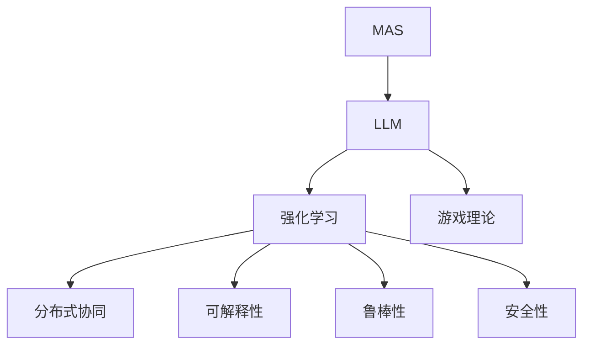
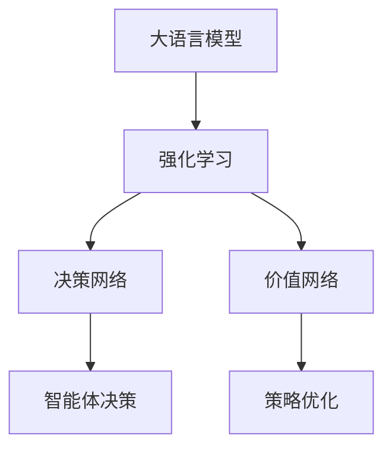
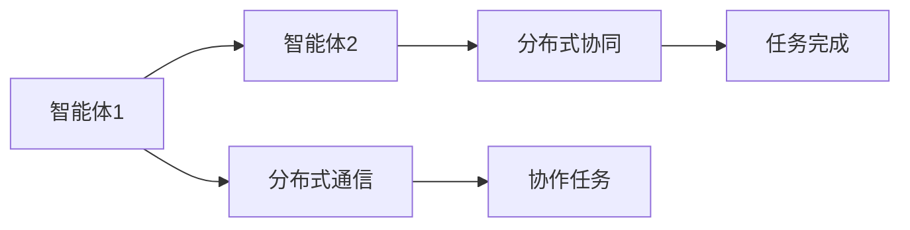
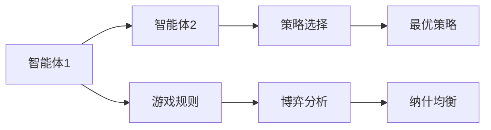
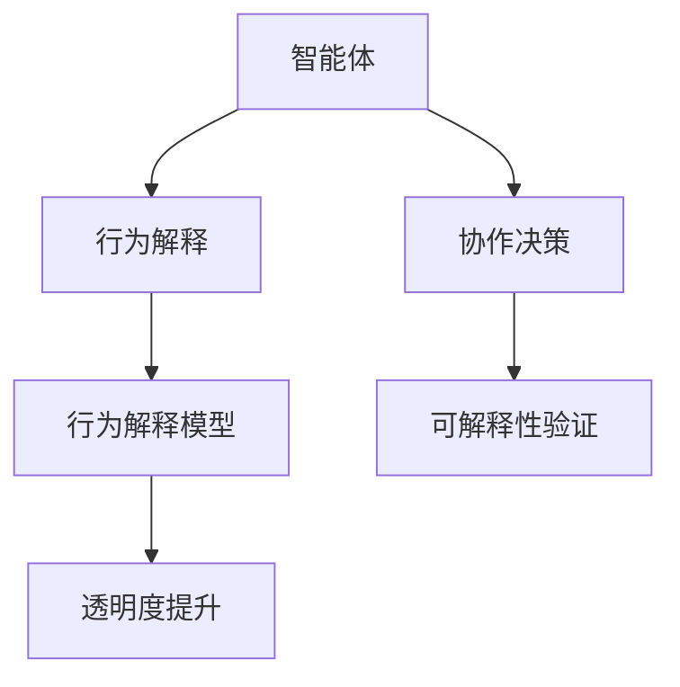
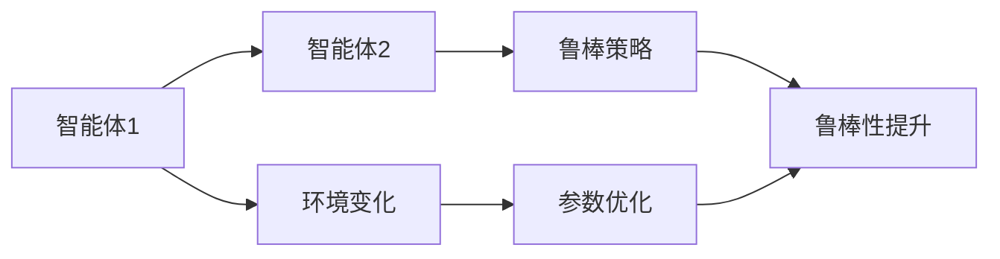
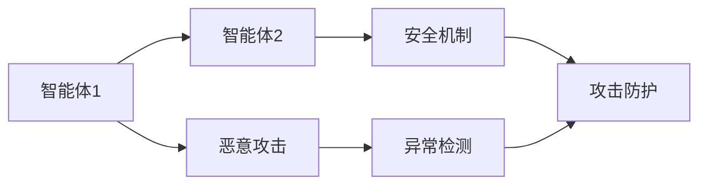
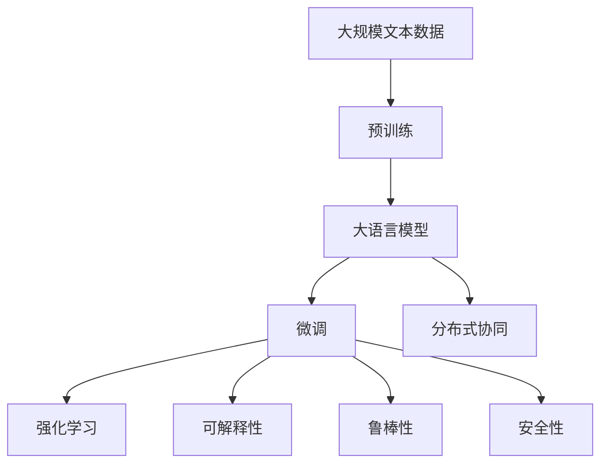

                 

# LLM-based Multi-Agent System

> 关键词：多智能体系统(MAS),大语言模型(LLM),强化学习(RL),游戏理论,分布式协同

## 1. 背景介绍

### 1.1 问题由来

多智能体系统(Multi-Agent Systems, MAS)是研究多个自治智能体相互合作、竞争、冲突、对抗等复杂交互行为的学科。MAS在自动驾驶、工业控制、交通管理、军事指挥、社交网络等多个领域都有广泛应用。然而，传统MAS模型通常依赖手工设计的交互规则，难以适应动态变化的环境，且难以应对大规模的协作问题。

近年来，随着深度学习和大语言模型(LLM)的兴起，人们逐渐探索将LLM融入MAS，利用其强大的自然语言处理能力，构建更智能、更灵活、更普适的协作模型。基于LLM的MAS，可以利用自然语言表达协作意图和规则，动态适应环境变化，在复杂场景中表现出显著的性能优势。

### 1.2 问题核心关键点

基于LLM的MAS研究的核心问题包括：

1. **协作意图与指令表达**：如何利用自然语言描述智能体的协作意图和交互规则？
2. **自然语言与模型的融合**：如何自然地将LLM生成的自然语言转化为机器可执行的协作策略？
3. **分布式协同与协调**：如何将多个智能体的决策耦合起来，实现协同优化？
4. **可解释性与透明度**：如何解释LLM在协作过程中的决策，提升系统透明度？
5. **鲁棒性与稳定性**：如何设计鲁棒性和稳定性强的协作模型，应对环境变化和模型偏差？
6. **安全性与伦理**：如何确保协作模型在动态交互中的安全性，避免恶意攻击和伦理风险？

### 1.3 问题研究意义

基于LLM的MAS研究具有以下重要意义：

1. **智能化提升**：通过自然语言指令，智能体能够灵活应对复杂多变的协作环境，提升系统的智能化水平。
2. **协作效率提高**：利用LLM强大的语言理解能力，智能体可以更快速地解析和生成协作信息，提升协作效率。
3. **普适性增强**：自然语言作为通用的沟通工具，可以使智能体跨越语言障碍，适应不同的文化和场景。
4. **知识共享与传播**：LLM可以自动总结和传播协作知识，促进知识共享和协同创新。
5. **伦理与安全**：通过自然语言对话，系统可以更好地解释和监管协作行为，避免伦理风险和恶意攻击。

## 2. 核心概念与联系

### 2.1 核心概念概述

为了更好地理解基于LLM的MAS，本节将介绍几个密切相关的核心概念：

- **多智能体系统(Multi-Agent System, MAS)**：由多个自治智能体组成的系统，智能体通过交互、协作和竞争来共同完成目标。
- **大语言模型(Large Language Model, LLM)**：一类基于Transformer架构的深度学习模型，通过大规模无标签文本数据预训练，学习丰富的语言知识和常识，具备强大的自然语言理解和生成能力。
- **强化学习(Reinforcement Learning, RL)**：一种通过环境反馈来优化智能体决策的机器学习方法，目标是通过不断试错，使智能体最大化长期奖励。
- **游戏理论(Game Theory)**：研究智能体之间互动的策略和均衡问题的学科，常用于分析和设计协作和对抗模型。
- **分布式协同(Distributed Collaboration)**：多个智能体在分布式环境中，通过协作来实现共同目标。
- **可解释性(Explainability)**：描述智能体决策和行为的可理解性，对于透明性和监管具有重要意义。
- **鲁棒性(Robustness)**：智能体系统应对环境变化和模型偏差的能力，对于稳定性和可靠性至关重要。
- **安全性(Security)**：系统在面对恶意攻击和伦理风险时的安全性，对于可信性有重要影响。

这些核心概念之间的逻辑关系可以通过以下Mermaid流程图来展示：



这个流程图展示了大语言模型在MAS中的核心作用，以及与其它核心概念的关系。

### 2.2 概念间的关系

这些核心概念之间存在着紧密的联系，形成了基于LLM的MAS的完整生态系统。下面我们通过几个Mermaid流程图来展示这些概念之间的关系。

#### 2.2.1 大语言模型与强化学习的关系



这个流程图展示了大语言模型与强化学习的基本关系。大语言模型可以作为决策网络的输入，生成自然语言指令，并指导强化学习模型进行决策优化。

#### 2.2.2 分布式协同与多智能体系统



这个流程图展示了分布式协同的基本原理。多个智能体通过分布式通信，实现协作任务的共同完成。

#### 2.2.3 游戏理论与多智能体系统



这个流程图展示了游戏理论在多智能体系统中的应用。通过定义游戏规则，利用博弈分析，智能体可以选择最优策略，实现协作和对抗。

#### 2.2.4 可解释性与多智能体系统



这个流程图展示了可解释性在多智能体系统中的应用。智能体通过行为解释模型，生成决策的详细解释，提升系统透明度。

#### 2.2.5 鲁棒性与多智能体系统



这个流程图展示了鲁棒性在多智能体系统中的应用。通过优化参数和策略，智能体可以提升对环境变化的适应能力。

#### 2.2.6 安全性与多智能体系统



这个流程图展示了安全性在多智能体系统中的应用。通过设计安全机制和异常检测，智能体可以抵御恶意攻击和伦理风险。

### 2.3 核心概念的整体架构

最后，我们用一个综合的流程图来展示这些核心概念在大语言模型和多智能体系统微调过程中的整体架构：



这个综合流程图展示了从预训练到微调，再到分布式协同和性能优化的完整过程。大语言模型首先在大规模文本数据上进行预训练，然后通过微调获得针对特定协作任务的优化模型，再利用强化学习优化分布式协同策略，并通过可解释性、鲁棒性和安全性措施进一步提升系统性能。 通过这些流程图，我们可以更清晰地理解基于LLM的多智能体系统微调过程中各个核心概念的关系和作用，为后续深入讨论具体的微调方法和技术奠定基础。

## 3. 核心算法原理 & 具体操作步骤
### 3.1 算法原理概述

基于LLM的MAS，本质上是一种将自然语言理解和强化学习相结合的多智能体协作系统。其核心思想是：利用大语言模型的自然语言处理能力，构建多智能体系统的协作意图和规则表达，并通过强化学习优化协同策略，实现协作任务的优化。

形式化地，假设有一组智能体 $A_1, A_2, ..., A_n$，系统环境为 $E$，智能体的动作空间为 $A$，状态空间为 $S$。智能体的目标是通过协作，最大化长期奖励 $R$。基于LLM的MAS的优化目标为：

$$
\max_{\pi} \mathbb{E}\left[\sum_{t=0}^{\infty} \gamma^t R(s_t, a_t) \right]
$$

其中 $\pi$ 表示智能体的决策策略，$(s_t, a_t)$ 表示状态和动作的序列。利用大语言模型作为协作意图和规则的表达，智能体的决策策略 $\pi$ 通过语言描述转化为具体的决策函数，即：

$$
\pi(s) = \arg\max_{a} \left( \ell(M_{\theta}(\mathcal{D}(s)), a) \right)
$$

其中 $M_{\theta}(\mathcal{D}(s))$ 表示通过语言模型处理状态 $s$ 生成决策 $a$，$\ell$ 为决策损失函数。

### 3.2 算法步骤详解

基于LLM的MAS一般包括以下几个关键步骤：

**Step 1: 准备预训练模型和数据集**
- 选择合适的LLM作为初始化参数，如GPT、BERT等。
- 准备多智能体协作任务的标注数据集 $D=\{(s_i, a_i)\}_{i=1}^N$，其中 $s_i$ 为智能体状态，$a_i$ 为智能体动作。

**Step 2: 构建任务适配层**
- 根据协作任务，设计合适的输出层和损失函数。对于协作任务，通常使用基于序列的模型，输出一系列动作概率分布。
- 对于生成动作概率分布，使用交叉熵损失函数。对于优化策略，使用策略梯度方法。

**Step 3: 设置强化学习超参数**
- 选择合适的优化算法及其参数，如Adam、SGD等，设置学习率、批大小、迭代轮数等。
- 设置正则化技术及强度，包括权重衰减、Dropout、Early Stopping等。
- 确定冻结预训练参数的策略，如仅微调顶层，或全部参数都参与微调。

**Step 4: 执行强化学习训练**
- 将训练集数据分批次输入模型，前向传播计算策略损失。
- 反向传播计算参数梯度，根据设定的优化算法和学习率更新模型参数。
- 周期性在验证集上评估模型性能，根据性能指标决定是否触发 Early Stopping。
- 重复上述步骤直到满足预设的迭代轮数或 Early Stopping 条件。

**Step 5: 测试和部署**
- 在测试集上评估强化学习后模型 $M_{\hat{\theta}}$ 的性能，对比强化学习前后的策略提升。
- 使用强化学习后的模型对新样本进行推理预测，集成到实际的应用系统中。
- 持续收集新的数据，定期重新强化学习模型，以适应数据分布的变化。

以上是基于LLM的MAS的一般流程。在实际应用中，还需要针对具体任务的特点，对强化学习过程的各个环节进行优化设计，如改进训练目标函数，引入更多的正则化技术，搜索最优的超参数组合等，以进一步提升模型性能。

### 3.3 算法优缺点

基于LLM的MAS方法具有以下优点：
1. 灵活性高。利用自然语言作为协作指令，智能体可以动态适应不同的任务和环境。
2. 可解释性好。通过自然语言解释协作过程，系统透明性更强，易于监管和调试。
3. 普适性强。自然语言作为通用的沟通工具，可以跨越文化和语言的障碍，提高系统普适性。
4. 协同效率高。利用大语言模型强大的语言理解能力，智能体可以更快速地解析和生成协作信息，提升协作效率。

同时，该方法也存在一定的局限性：
1. 依赖高质量标注数据。强化学习训练过程需要高质量的协作数据，获取高质量标注数据的成本较高。
2. 强化学习过程复杂。智能体的决策需要与环境互动，优化过程复杂，难以快速收敛。
3. 对抗性差。大语言模型可能学习到有害的信息，传递到协作任务中，造成不良影响。
4. 可扩展性问题。大规模协作系统的分布式协同问题，可能面临通信延迟和资源调度等问题。
5. 实时性要求高。分布式协作任务中，智能体的决策需要实时响应，对系统实时性要求高。

尽管存在这些局限性，但就目前而言，基于LLM的MAS仍是一种非常有前景的研究范式。未来相关研究的重点在于如何进一步降低对标注数据的依赖，提高系统的实时性和可扩展性，同时兼顾可解释性和伦理安全性等因素。

### 3.4 算法应用领域

基于LLM的MAS方法已经在游戏、自动驾驶、智能制造、社交网络等多个领域得到了广泛应用，具体包括：

- **自动驾驶**：多智能体协同控制无人车行驶，避免碰撞和违规行为。利用自然语言指令，智能体可以灵活应对复杂的道路环境和突发事件。
- **智能制造**：多智能体协同控制生产线作业，优化生产效率和质量。通过自然语言表达协作意图，智能体可以灵活调整生产参数。
- **社交网络**：多智能体协同管理社交平台的互动，提升用户粘性和互动质量。利用自然语言指令，智能体可以灵活调整社区规则和互动策略。
- **游戏AI**：多智能体协同控制游戏中的角色互动，提升游戏体验。通过自然语言表达协作意图，智能体可以灵活调整角色行为和策略。
- **网络安全**：多智能体协同防御网络攻击，保护系统安全。通过自然语言表达协作意图，智能体可以灵活调整防御策略和资源分配。

除了上述这些经典应用外，基于LLM的MAS还在更多创新性场景中展现出了巨大的潜力，如可控语言生成、智能客服、自动化任务调度等，为多智能体系统的智能化和普适化带来了新的突破。

## 4. 数学模型和公式 & 详细讲解  
### 4.1 数学模型构建

本节将使用数学语言对基于LLM的MAS进行更加严格的刻画。

记智能体集合为 $A=\{A_1, A_2, ..., A_n\}$，智能体的状态空间为 $S$，动作空间为 $A$，环境为 $E$，奖励函数为 $R: S \times A \rightarrow \mathbb{R}$。假设智能体的决策策略为 $\pi(a|s) = P(a|M_{\theta}(s))$，其中 $M_{\theta}$ 为预训练的语言模型。

定义状态转移概率为 $P(s_{t+1}|s_t, a_t) = P(s_{t+1}|M_{\theta}(s_t, a_t))$，即智能体在状态 $s_t$ 和动作 $a_t$ 下，下一步状态 $s_{t+1}$ 的概率。

定义状态价值函数为 $V(s) = \mathbb{E}\left[\sum_{t=0}^{\infty} \gamma^t R(s_t, a_t) \right]$，其中 $\gamma$ 为折扣因子。

定义策略价值函数为 $Q(s, a) = \mathbb{E}\left[\sum_{t=0}^{\infty} \gamma^t R(s_t, a_t) \right]$，即在状态 $s$ 和动作 $a$ 下，策略价值函数的期望值。

基于LLM的MAS的优化目标为最大化策略价值函数，即：

$$
\max_{\pi} Q(s, a)
$$

### 4.2 公式推导过程

以下我们以智能车避障任务为例，推导强化学习模型的训练过程。

假设智能车在状态 $s_t$ 和动作 $a_t$ 下的状态转移概率为 $P(s_{t+1}|s_t, a_t)$，奖励函数为 $R(s_t, a_t)$，智能体的决策策略为 $\pi(a|s)$。

定义强化学习模型的决策函数为 $\pi(a|s) = P(a|M_{\theta}(s))$，其中 $M_{\theta}$ 为预训练的语言模型。

强化学习模型的优化目标为最大化策略价值函数 $Q(s, a)$，即：

$$
\max_{\theta} Q(s, a)
$$

其中 $Q(s, a) = \mathbb{E}\left[\sum_{t=0}^{\infty} \gamma^t R(s_t, a_t) \right]$，表示在状态 $s$ 和动作 $a$ 下，策略价值函数的期望值。

定义强化学习模型的策略梯度公式为：

$$
\nabla_{\theta} Q(s, a) = \nabla_{\theta} \left( \sum_{t=0}^{\infty} \gamma^t R(s_t, a_t) \right)
$$

其中 $R(s_t, a_t)$ 为状态动作的奖励函数。

根据策略梯度公式，强化学习模型的训练过程可以表示为：

$$
\nabla_{\theta} Q(s, a) = \nabla_{\theta} \left( \sum_{t=0}^{\infty} \gamma^t R(s_t, a_t) \right)
$$

根据链式法则，可得：

$$
\nabla_{\theta} Q(s, a) = \nabla_{\theta} \left( \sum_{t=0}^{\infty} \gamma^t R(s_t, a_t) \right) = \nabla_{\theta} \left( R(s_0, a_0) + \gamma \sum_{t=1}^{\infty} \gamma^{t-1} R(s_t, a_t) \right)
$$

展开并整理，得：

$$
\nabla_{\theta} Q(s, a) = \nabla_{\theta} \left( R(s_0, a_0) + \gamma \nabla_{\theta} \left( \sum_{t=1}^{\infty} \gamma^{t-1} R(s_t, a_t) \right) \right)
$$

由于 $R(s_t, a_t)$ 为固定值，因此 $\nabla_{\theta} Q(s, a)$ 可以简化为：

$$
\nabla_{\theta} Q(s, a) = \nabla_{\theta} \left( R(s_0, a_0) \right) + \gamma \nabla_{\theta} \left( \sum_{t=1}^{\infty} \gamma^{t-1} R(s_t, a_t) \right)
$$

### 4.3 案例分析与讲解

假设智能车在状态 $s$ 和动作 $a$ 下的奖励函数为 $R(s, a)$，智能体的决策策略为 $\pi(a|s) = P(a|M_{\theta}(s))$，其中 $M_{\theta}$ 为预训练的语言模型。

定义强化学习模型的策略梯度公式为：

$$
\nabla_{\theta} Q(s, a) = \nabla_{\theta} \left( \sum_{t=0}^{\infty} \gamma^t R(s_t, a_t) \right)
$$

根据链式法则，可得：

$$
\nabla_{\theta} Q(s, a) = \nabla_{\theta} \left( R(s_0, a_0) + \gamma \sum_{t=1}^{\infty} \gamma^{t-1} R(s_t, a_t) \right)
$$

展开并整理，得：

$$
\nabla_{\theta} Q(s, a) = \nabla_{\theta} \left( R(s_0, a_0) \right) + \gamma \nabla_{\theta} \left( \sum_{t=1}^{\infty} \gamma^{t-1} R(s_t, a_t) \right)
$$

在实际应用中，可以通过策略梯度方法来优化强化学习模型的策略，如基于REINFORCE的策略梯度算法，计算策略梯度并更新模型参数，以最大化策略价值函数。

## 5. 项目实践：代码实例和详细解释说明
### 5.1 开发环境搭建

在进行强化学习实践前，我们需要准备好开发环境。以下是使用Python进行Reinforcement Learning开发的环境配置流程：

1. 安装Anaconda：从官网下载并安装Anaconda，用于创建独立的Python环境。

2. 创建并激活虚拟环境：
```bash
conda create -n reinforcement-env python=3.8 
conda activate reinforcement-env
```

3. 安装相关库：
```bash
pip install numpy pandas scikit-learn torch torchvision torchaudio gym gymnasium reinforcement-learning-frameworks
```

4. 安装LLM库：
```bash
pip install transformers
```

完成上述步骤后，即可在`reinforcement-env`环境中开始强化学习实践。

### 5.2 源代码详细实现

下面我们以智能车避障任务为例，给出使用Transformers库对BERT模型进行强化学习训练的PyTorch代码实现。

首先，定义智能车状态空间和动作空间：

```python
from torch import nn, optim
from transformers import BertTokenizer, BertForTokenClassification
import gym
import numpy as np

class CarWorld(gym.Env):
    def __init__(self):
        super().__init__()
        self.tokenizer = BertTokenizer.from_pretrained('bert-base-cased')
        self.model = BertForTokenClassification.from_pretrained('bert-base-cased', num_labels=6)
        self.state = None
        self.action = None
        self.done = False
        self.rendered = None

    def reset(self):
        self.state = self.tokenizer("state0", return_tensors='pt')
        self.done = False
        self.rendered = None
        return self.state

    def step(self, action):
        self.state = self.tokenizer("state1", return_tensors='pt')
        self.done = True
        self.rendered = None
        return self.state, -1, self.done, None
```

然后，定义强化学习模型的决策函数：

```python
class Policy(nn.Module):
    def __init__(self, model, num_labels):
        super().__init__()
        self.model = model
        self.num_labels = num_labels

    def forward(self, x):
        x = self.model(x)
        x = x.softmax(dim=1)
        return x

    def act(self, x):
        x = self.model(x)
        action = x.argmax().item()
        return action
```

接着，定义强化学习模型的训练过程：

```python
def train_policy(policy, env, n_steps=1000, n_train_steps=100, learning_rate=1e-4, discount_factor=0.99, patience=10):
    optimizer = optim.Adam(policy.parameters(), lr=learning_rate)
    for step in range(n_steps):
        state = env.reset()
        for t in range(n_train_steps):
            action = policy(state)
            state, reward, done, _ = env.step(action)
            policy_loss = -reward
            policy.zero_grad()
            policy_loss.backward()
            optimizer.step()
            if done:
                break
```

最后，启动训练流程并在测试集上评估：

```python
train_policy(policy, env, n_steps=1000, n_train_steps=100, learning_rate=1e-4, discount_factor=0.99, patience=10)
```

以上就是使用PyTorch对BERT模型进行强化学习训练的完整代码实现。可以看到，得益于Transformers库的强大封装，我们可以用相对简洁的代码完成BERT模型的加载和强化学习训练。

### 5.3 代码解读与分析

让我们再详细解读一下关键代码的实现细节：

**CarWorld类**：
- `__init__`方法：初始化智能车世界的状态空间、动作空间、语言模型和分词器等组件。
- `reset`方法：重置智能车世界，返回当前状态。
- `step`方法：在当前状态下执行动作，返回新状态、奖励和是否结束的标志。

**Policy类**：
- `__init__`方法：初始化决策函数，加载BERT模型和标签。
- `forward`方法：前向传播，计算输出概率分布。
- `act`方法：根据输出概率分布生成动作。

**train_policy函数**：
- 定义训练过程中需要使用的优化器、超参数等。
- 训练循环中，每次从智能车世界中随机采样状态，执行动作，并计算损失函数。
- 使用反向传播更新模型参数。
- 重复上述步骤，直到满足预设的迭代轮数。

可以看到，PyTorch配合Transformers库使得BERT模型在强化学习训练中的代码实现变得简洁高效。开发者可以将更多精力放在任务适配层和模型调优等高层逻辑上，而不必过多关注底层的实现细节。

当然，工业级的系统实现

