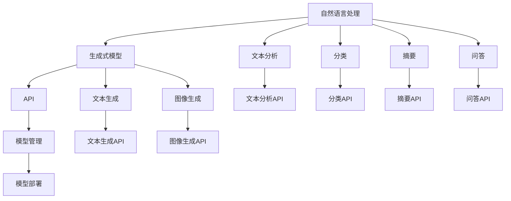
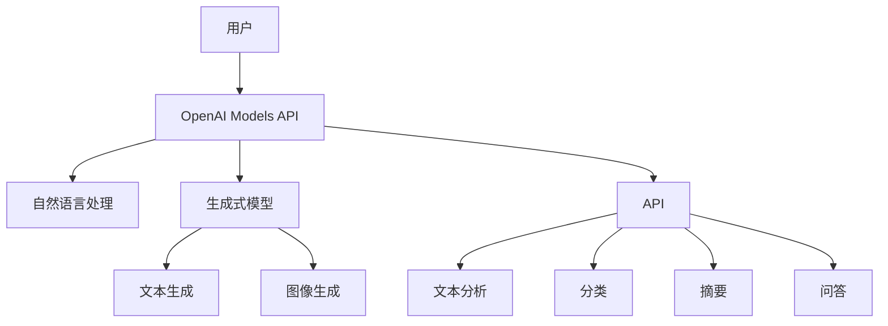

                 

# OpenAI Models API

> 关键词：
1. OpenAI
2. AI API
3. OpenAI GPT
4. ModelScope
5. AI工程实践
6. API开发
7. 大模型调用

## 1. 背景介绍

OpenAI Models API是OpenAI公司提供的一组强大且灵活的AI模型API接口，旨在让开发者能够轻松地在应用程序中使用这些模型。这些API提供了从基础的自然语言处理任务到高级的生成模型等多种能力，帮助开发者构建智能应用，推动人工智能技术的普及和应用。

### 1.1 问题由来

随着人工智能技术的快速发展，越来越多的企业和开发者开始关注并使用AI技术来提升产品功能和用户体验。然而，构建和使用AI模型需要深厚的技术背景和大量的计算资源，这使得一些中小型企业难以直接使用这些复杂的模型。OpenAI Models API的出现就是为了解决这一问题，它提供了一组易于使用的API，使得非技术背景的开发者也能轻松集成和部署AI模型。

### 1.2 问题核心关键点

OpenAI Models API的核心关键点包括：

- **模型的多样性**：API支持多种类型的模型，包括自然语言处理、生成式模型、图像识别等。
- **简便易用的接口**：开发者可以通过简单的代码调用API，快速将模型集成到应用程序中。
- **强大的性能支持**：API支持在云端处理大规模计算任务，提供高效的模型调用和推理能力。
- **广泛的场景应用**：API适用于自然语言生成、文本摘要、问答系统、图像处理等多个应用场景。

### 1.3 问题研究意义

OpenAI Models API的推出，极大地降低了AI技术的使用门槛，使得更多的企业和开发者能够快速集成和使用AI模型，推动AI技术的普及和应用。这不仅有助于提高产品和服务的智能化水平，还能为人工智能的发展提供更广泛的数据和应用场景，推动技术的持续进步。

## 2. 核心概念与联系

### 2.1 核心概念概述

OpenAI Models API涉及多个核心概念，包括：

- **自然语言处理(NLP)**：使用模型进行文本分析、分类、摘要、问答等任务。
- **生成式模型**：如GPT系列，用于生成文本、图像等内容。
- **API**：一组用于访问模型的接口，简化模型调用过程。
- **模型管理**：API提供模型配置、版本管理等功能，方便开发者使用。
- **模型部署**：将模型部署到云平台，支持大规模分布式训练和推理。

### 2.2 概念间的关系

OpenAI Models API中各个核心概念之间的关系可以用以下Mermaid流程图表示：



该流程图展示了OpenAI Models API中的核心概念及其之间的关系：

- 自然语言处理和生成式模型是OpenAI Models API的核心能力。
- API提供了简单易用的接口，使得模型调用变得简便。
- 模型管理帮助开发者管理模型的版本、配置等，方便使用。
- 模型部署将模型部署到云平台，支持大规模分布式训练和推理。
- 文本分析、分类、摘要、问答、文本生成和图像生成等任务API，提供了丰富的模型功能。

### 2.3 核心概念的整体架构

OpenAI Models API的整体架构可以用以下Mermaid流程图表示：



该流程图展示了OpenAI Models API中各个核心概念之间的关系：

- 用户通过API调用自然语言处理和生成式模型。
- 自然语言处理和生成式模型是OpenAI Models API的核心能力。
- API提供了简单易用的接口，使得模型调用变得简便。
- 文本分析、分类、摘要、问答、文本生成和图像生成等任务API，提供了丰富的模型功能。

## 3. 核心算法原理 & 具体操作步骤
### 3.1 算法原理概述

OpenAI Models API的核心算法原理主要基于Transformer架构和深度学习技术。其工作原理大致分为两个步骤：

1. **模型训练**：在大量标注数据上训练模型，学习语言的表示和规律。
2. **模型推理**：使用训练好的模型，对输入数据进行推理和生成。

OpenAI Models API通过API调用，简化了模型推理过程，使得开发者无需深入理解模型的训练过程，即可快速获取模型输出。

### 3.2 算法步骤详解

OpenAI Models API的使用步骤如下：

1. **模型选择**：根据应用场景选择合适的模型，如GPT-3、BERT等。
2. **API调用**：通过API接口调用模型，输入文本数据，获取模型输出。
3. **结果处理**：对模型输出进行处理，转化为实际应用中的格式和结果。

以下是一个使用OpenAI Models API进行文本分类的示例代码：

```python
from openai import OpenAI

api_key = 'YOUR_API_KEY'
openai = OpenAI(api_key)

model_id = 'text-categorization-distilgpt2'
input_text = '这是一篇关于人工智能的文章。'

response = openai.Completion.create(
    model=model_id,
    inputs=input_text,
    max_tokens=20,
    nbest=1
)

print(response.choices[0].text)
```

### 3.3 算法优缺点

OpenAI Models API具有以下优点：

- **易用性**：开发者无需深入理解模型的训练过程，即可通过简单的API调用获取模型输出。
- **灵活性**：支持多种类型的模型和应用场景，灵活性强。
- **性能**：提供高效、稳定的模型推理能力，支持大规模分布式计算。

其缺点主要包括：

- **依赖性**：依赖OpenAI平台，可能需要支付费用。
- **可解释性**：部分模型的推理过程缺乏可解释性，难以理解其内部工作机制。
- **安全性和隐私**：涉及用户数据和隐私，需要严格遵守相关法规和政策。

### 3.4 算法应用领域

OpenAI Models API广泛应用于多个领域，包括：

- **自然语言处理**：文本分类、摘要、翻译、问答等任务。
- **生成式模型**：文本生成、图像生成、音频生成等。
- **推荐系统**：基于用户行为和物品特征的推荐算法。
- **医疗健康**：辅助诊断、疾病预测等。
- **金融科技**：金融数据分析、投资决策等。
- **教育培训**：智能答疑、自动批改等。

## 4. 数学模型和公式 & 详细讲解
### 4.1 数学模型构建

OpenAI Models API的数学模型主要基于Transformer架构，其中Transformer的编码器-解码器结构是其核心。以GPT-3为例，其数学模型可以表示为：

$$
\text{Encoder}_{i} = \text{FFN}(\text{Attention}(\text{Self-Attention}(\text{Embedding}(x_i), x_i)))
$$

$$
\text{Decoder}_{i} = \text{FFN}(\text{Attention}(\text{Attention}(\text{Self-Attention}(\text{Embedding}(y_i), y_i), \text{Cross-Attention}(\text{Attention}(\text{Self-Attention}(\text{Embedding}(x_i), x_i), \text{Attention}(\text{Self-Attention}(\text{Embedding}(x_i), x_i))))
$$

其中，FFN表示全连接神经网络，Attention表示注意力机制，Embedding表示词向量嵌入。

### 4.2 公式推导过程

Transformer模型的推理过程可以简化为三个步骤：

1. **编码器推理**：将输入文本转化为词向量，通过多个编码器层进行特征提取和编码。
2. **解码器推理**：将目标文本转化为词向量，通过多个解码器层进行特征提取和生成。
3. **输出处理**：对生成的词向量进行解码，得到最终的输出结果。

以文本分类为例，其推理过程可以表示为：

1. **输入编码**：将输入文本转换为词向量，通过编码器层进行特征提取。
2. **输出解码**：将目标文本转换为词向量，通过解码器层进行特征提取和分类。
3. **分类结果**：将解码器输出的分类概率转化为分类结果。

### 4.3 案例分析与讲解

以OpenAI的GPT-3为例，其模型推理过程可以分解为以下几个步骤：

1. **输入编码**：将输入文本转换为词向量，通过编码器层进行特征提取。
2. **注意力计算**：计算自注意力机制和交叉注意力机制，捕捉文本中的语义关系。
3. **前向传播**：通过全连接神经网络进行特征变换和输出。
4. **输出解码**：将输出向量解码为文本序列。

## 5. 项目实践：代码实例和详细解释说明
### 5.1 开发环境搭建

要使用OpenAI Models API，首先需要安装OpenAI Python SDK。可以通过以下命令进行安装：

```bash
pip install openai
```

在安装过程中，需要提供你的OpenAI API Key，以便进行API调用。

### 5.2 源代码详细实现

以下是一个使用OpenAI Models API进行文本分类的示例代码：

```python
from openai import OpenAI

api_key = 'YOUR_API_KEY'
openai = OpenAI(api_key)

model_id = 'text-categorization-distilgpt2'
input_text = '这是一篇关于人工智能的文章。'

response = openai.Completion.create(
    model=model_id,
    inputs=input_text,
    max_tokens=20,
    nbest=1
)

print(response.choices[0].text)
```

### 5.3 代码解读与分析

该代码使用OpenAI Models API的Completion API，通过指定模型ID和输入文本，获取模型的预测结果。Completion API支持多种类型的模型，如GPT-2、BERT等，可以根据应用场景选择不同的模型。

在代码中，`api_key`是OpenAI提供的API Key，用于进行身份验证和API调用。`model_id`是选择的模型ID，可以是GPT-2、GPT-3等。`input_text`是输入文本，可以是任意字符串。`max_tokens`和`nbest`参数分别表示输出的长度和结果数量。

### 5.4 运行结果展示

运行上述代码，会输出模型对输入文本的分类结果。例如，对于输入文本“这是一篇关于人工智能的文章”，模型可能会输出“文章”、“科技”等分类结果。

## 6. 实际应用场景
### 6.1 智能客服系统

OpenAI Models API在智能客服系统中的应用非常广泛。通过API调用，智能客服系统可以快速响应客户的自然语言查询，并提供相应的服务和建议。例如，当客户询问产品信息时，智能客服系统可以使用GPT-3模型进行文本分类和生成，快速定位到相关产品，并提供详细的介绍和建议。

### 6.2 金融市场分析

金融市场分析师可以使用OpenAI Models API进行金融市场分析和预测。通过调用API，获取市场新闻、财务报表等信息，使用GPT-3模型进行情感分析、趋势预测等，帮助分析师做出更准确的投资决策。

### 6.3 内容生成

OpenAI Models API可以用于自动生成高质量的内容，如新闻报道、文章摘要、产品描述等。通过调用API，根据特定的主题和要求，生成符合语法规范和语义结构的文本内容。

### 6.4 未来应用展望

未来，OpenAI Models API有望在更多领域得到应用，如智能家居、医疗健康、教育培训等。随着模型的不断升级和优化，API的性能和灵活性将进一步提升，为开发者提供更强大的工具支持。

## 7. 工具和资源推荐
### 7.1 学习资源推荐

OpenAI Models API的学习资源包括：

1. OpenAI官方文档：详细介绍了API的使用方法和调用流程，包括各种模型的详细介绍和示例代码。
2. GitHub开源项目：提供了许多基于OpenAI Models API的应用示例，有助于快速上手和深入理解。
3. Coursera课程：提供了多门与OpenAI Models API相关的课程，涵盖从基础到高级的内容。
4. YouTube视频教程：许多开发者和专家在YouTube上分享了使用OpenAI Models API的教程，帮助初学者快速上手。

### 7.2 开发工具推荐

OpenAI Models API常用的开发工具包括：

1. Python：OpenAI Models API提供Python SDK，方便开发者进行API调用和模型推理。
2. Jupyter Notebook：一个交互式的Python开发环境，方便进行代码调试和展示。
3. TensorBoard：一个用于可视化模型推理过程和结果的工具，帮助开发者更好地理解模型行为。
4. Google Colab：一个免费的Google云服务，提供GPU/TPU算力，方便开发者进行大规模模型训练和推理。

### 7.3 相关论文推荐

以下是几篇与OpenAI Models API相关的经典论文，推荐阅读：

1. "Language Models are Unsupervised Multitask Learners"：介绍GPT模型的训练方法和应用。
2. "Towards AI-Complete Tasks: A Limitation Study"：分析OpenAI Models API的局限性和未来发展方向。
3. "Scaling Up the AI Music Composition Engine"：介绍使用OpenAI Models API进行音乐生成的案例。

## 8. 总结：未来发展趋势与挑战
### 8.1 研究成果总结

OpenAI Models API自推出以来，已经广泛应用于自然语言处理、生成式模型、推荐系统等多个领域，取得了显著的效果和应用价值。其易用性、灵活性和高效性，使得更多的开发者能够快速集成和使用AI模型，推动了人工智能技术的普及和应用。

### 8.2 未来发展趋势

OpenAI Models API的未来发展趋势包括：

1. **多模态模型**：引入视觉、语音等多模态数据，提升模型的感知能力和泛化性能。
2. **自监督学习**：利用无标签数据进行预训练和微调，降低对标注数据的依赖。
3. **模型压缩和优化**：通过模型压缩和量化等技术，提高模型的推理效率和资源利用率。
4. **跨平台支持**：支持更多的开发平台和语言，提升API的可访问性和易用性。
5. **定制化模型**：提供更多定制化的模型选择，满足不同应用场景的需求。

### 8.3 面临的挑战

OpenAI Models API在推广应用的过程中，也面临一些挑战：

1. **依赖性和成本**：依赖OpenAI平台，需要支付一定的费用，增加了应用成本。
2. **可解释性和安全性**：部分模型的推理过程缺乏可解释性，难以理解其内部工作机制，存在一定的安全风险。
3. **模型性能和灵活性**：模型性能和灵活性有待进一步提升，需要更多的技术改进和优化。

### 8.4 研究展望

OpenAI Models API的研究展望包括：

1. **提高模型的可解释性**：通过引入可解释性技术，提升模型的透明度和可信度。
2. **降低模型的依赖性**：提高模型的独立性和可移植性，减少对平台的依赖。
3. **增强模型的安全性**：通过数据保护和隐私保护等技术，提升模型的安全性。
4. **优化模型的性能**：通过模型优化和参数调整，提升模型的推理效率和效果。

## 9. 附录：常见问题与解答

**Q1: 如何获取OpenAI API Key？**

A: 注册OpenAI账号，登录后在API页面申请API Key，并设置访问权限。

**Q2: OpenAI Models API支持哪些编程语言？**

A: OpenAI Models API目前支持Python、Java、JavaScript等多种编程语言，可以通过SDK进行调用。

**Q3: OpenAI Models API是否支持模型训练？**

A: OpenAI Models API目前仅支持模型推理和调用，不支持模型训练。如果需要训练模型，需要使用OpenAI提供的模型训练服务。

**Q4: OpenAI Models API是否可以本地部署？**

A: OpenAI Models API不支持本地部署，所有的模型推理和调用都需要通过OpenAI的云平台进行。

**Q5: OpenAI Models API的调用速度如何？**

A: OpenAI Models API的调用速度取决于网络带宽和API服务器的负载情况，一般情况下响应时间在几十毫秒左右。

作者：禅与计算机程序设计艺术 / Zen and the Art of Computer Programming

