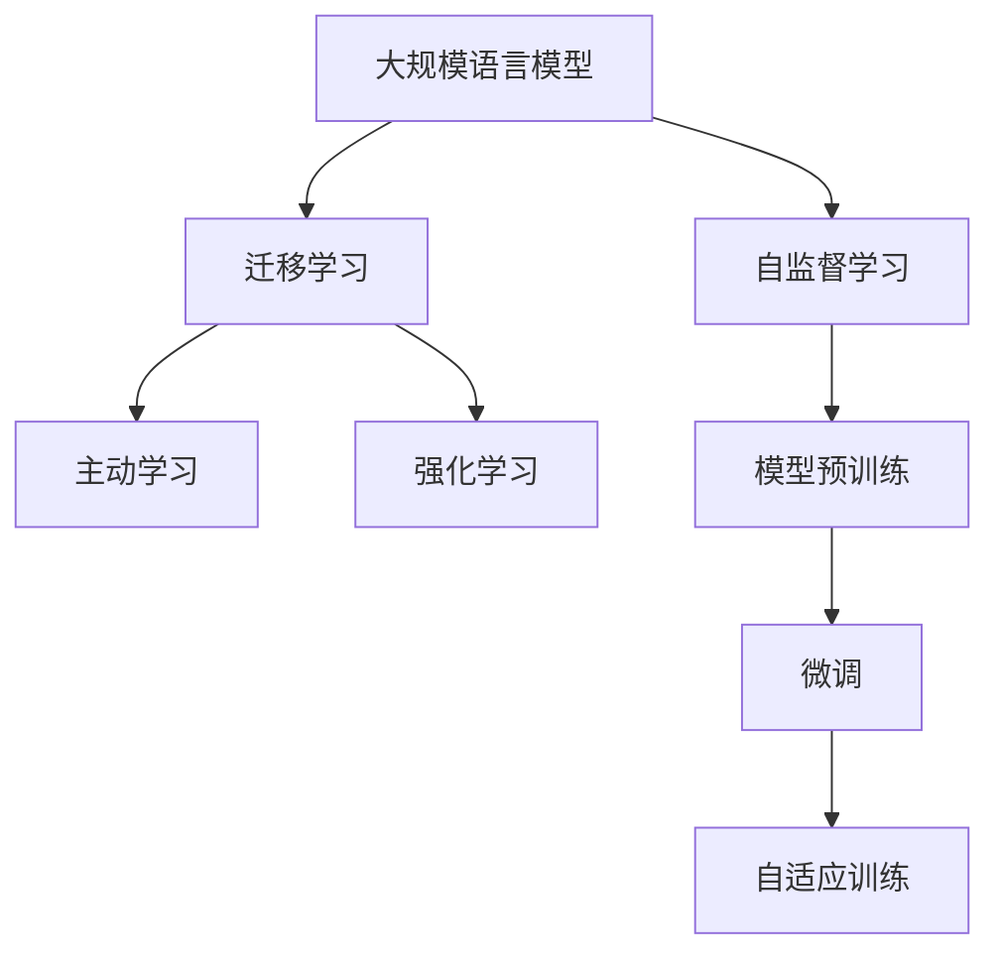

                 

# OpenAI首席科学家Ilya Sutskever谈GPT成功关键

> 关键词：GPT,语言模型,自监督学习,迁移学习,自适应,主动学习,强化学习

## 1. 背景介绍

### 1.1 问题由来
近年来，深度学习技术在自然语言处理(NLP)领域取得了飞速发展，其中以GPT系列模型为代表的自回归语言模型在语言生成、文本摘要、问答系统等任务上取得了显著成效。OpenAI的GPT-3模型在多项标准测试中表现优异，展现出了惊人的通用能力和语言理解能力。

然而，如此卓越的性能背后，究竟隐藏着哪些关键因素呢？OpenAI首席科学家Ilya Sutskever博士近日接受采访，分享了他在GPT模型开发中的核心见解，揭示了其成功的关键。

### 1.2 问题核心关键点
Ilya Sutskever博士指出，GPT的成功可以归结为以下几点：

- **大规模预训练数据**：GPT模型是在大规模无标签文本数据上进行自监督预训练，学习到丰富的语言知识，从而具备强大的语言理解和生成能力。

- **自适应训练**：在微调过程中，GPT模型能够自适应地调整模型参数，以匹配具体任务的需求。

- **主动学习和强化学习**：GPT模型通过主动学习算法，从少量标注数据中高效学习新知识，并结合强化学习技术，优化模型性能，提升其在复杂任务上的能力。

- **正则化技术**：在训练过程中，GPT模型采用了多种正则化技术，如dropout、early stopping等，防止模型过拟合。

- **模型复杂度控制**：GPT模型在预训练和微调过程中，通过精细调参，有效控制了模型的复杂度，既保证了模型性能，又减少了资源消耗。

- **资源投入**：GPT模型的开发和训练涉及大量硬件资源和专业团队的支持，包括高性能计算集群、大量标注数据、顶尖工程师等。

这些关键因素共同推动了GPT模型的成功，成为NLP领域的一大里程碑。

## 2. 核心概念与联系

### 2.1 核心概念概述

为更好地理解GPT模型成功的原因，我们首先介绍几个核心概念：

- **大规模语言模型(Massive Language Model)**：指在大规模无标签文本数据上进行自监督预训练，学习到通用语言表示的语言模型。常见的模型有GPT、BERT等。

- **自监督学习(Self-Supervised Learning)**：指使用无标签数据进行模型训练，通过预测数据自身的缺失部分或假定的关系来学习语言知识。

- **迁移学习(Transfer Learning)**：指将模型在某一任务上学习到的知识迁移到另一任务上，减少在新任务上的学习负担，提高模型泛化能力。

- **主动学习(Active Learning)**：指通过选择最具信息量的数据进行学习，提高模型学习效率，减少数据标注成本。

- **强化学习(Reinforcement Learning)**：指通过与环境的交互，模型在不断尝试中优化其行为策略，以达到特定目标。

这些概念共同构成了GPT模型的核心技术框架，使其在语言生成、文本摘要、问答系统等任务上表现卓越。

### 2.2 概念间的关系

这些核心概念之间的逻辑关系可以通过以下Mermaid流程图来展示：



这个流程图展示了大语言模型的核心技术框架，以及它们之间的关系：

1. 大语言模型通过自监督学习在无标签数据上进行预训练，学习到通用的语言表示。
2. 预训练模型通过迁移学习，适应下游任务的特定需求，进行微调。
3. 微调过程中，GPT模型通过主动学习和强化学习，进一步优化模型性能，提升其在复杂任务上的能力。

## 3. 核心算法原理 & 具体操作步骤
### 3.1 算法原理概述

GPT模型的成功源于其在自监督预训练和微调过程中的独特算法设计。下面详细介绍GPT模型的工作原理：

GPT模型是一个基于Transformer架构的自回归语言模型，通过在大规模无标签文本数据上进行自监督预训练，学习到丰富的语言知识。其核心算法包括：

1. **自回归编码器**：使用Transformer的编码器结构，自回归生成每个单词，利用上下文信息生成下一个单词。
2. **自监督预训练**：在无标签数据上进行自回归训练，预测下一个单词的概率，优化模型参数。
3. **微调**：在特定任务的数据集上，通过有监督的微调过程，优化模型在特定任务上的性能。

### 3.2 算法步骤详解

**Step 1: 数据预处理和模型初始化**

1. 收集大规模无标签文本数据，作为自监督预训练的数据集。
2. 将数据集进行分批次处理，每个批次包含若干个序列。
3. 初始化预训练模型的参数，通常使用随机初始化。

**Step 2: 自监督预训练**

1. 将每个序列划分为若干个自回归生成任务，生成预测单词。
2. 计算预测单词的概率分布，作为损失函数。
3. 使用梯度下降等优化算法，更新模型参数。

**Step 3: 微调**

1. 收集特定任务的标注数据集，准备训练集、验证集和测试集。
2. 在微调过程中，将预训练模型的顶层作为任务适配器，进行有监督的微调。
3. 设置合适的学习率和优化算法，确保微调过程的有效性。

**Step 4: 评估与部署**

1. 在验证集上评估微调后的模型性能，选择最优的模型进行测试。
2. 部署微调后的模型，应用于实际任务中，进行推理和生成。

### 3.3 算法优缺点

**优点**：
1. **通用性强**：GPT模型在大规模文本数据上进行预训练，学习到通用的语言表示，具备强大的泛化能力。
2. **可解释性强**：通过逐步微调，模型的推理过程和决策逻辑可被解释和调试。
3. **适用性广**：适用于多种NLP任务，如语言生成、文本摘要、问答系统等。

**缺点**：
1. **资源需求高**：预训练和微调需要大量的计算资源和时间。
2. **过拟合风险**：在微调过程中，模型可能过拟合，需要采用多种正则化技术进行缓解。
3. **计算成本高**：模型推理速度较慢，对硬件资源要求较高。

### 3.4 算法应用领域

GPT模型在多个领域得到了广泛应用，具体如下：

- **语言生成**：如文本生成、对话系统、机器翻译等。
- **文本摘要**：自动生成文本摘要，提高文本处理效率。
- **问答系统**：解答用户自然语言提出的问题。
- **情感分析**：识别文本中的情感倾向，如正面、负面或中性。
- **知识图谱**：构建和查询知识图谱，辅助信息检索和推理。

## 4. 数学模型和公式 & 详细讲解 & 举例说明

### 4.1 数学模型构建

GPT模型的数学模型可以形式化表示为：

$$
p(x_1, x_2, ..., x_n) = \prod_{i=1}^{n} p(x_i|x_1, x_2, ..., x_{i-1})
$$

其中 $x_i$ 表示序列中的每个单词，$p(x_i|x_1, x_2, ..., x_{i-1})$ 表示在上下文 $x_1, x_2, ..., x_{i-1}$ 条件下，单词 $x_i$ 的条件概率。

### 4.2 公式推导过程

GPT模型通过自回归编码器进行训练，计算每个单词的条件概率。在自回归训练中，模型通过最大化条件概率 $p(x_i|x_1, x_2, ..., x_{i-1})$ 进行优化。设模型在自回归生成任务上的损失函数为 $\mathcal{L}$，则优化目标为：

$$
\min_{\theta} \mathcal{L}(\theta) = \sum_{i=1}^{n} \log p(x_i|x_1, x_2, ..., x_{i-1})
$$

其中 $\theta$ 为模型参数。

### 4.3 案例分析与讲解

以文本生成任务为例，GPT模型通过自回归训练生成文本。设输入文本为 $x_1, x_2, ..., x_n$，生成器输出单词 $x_{n+1}, x_{n+2}, ..., x_{N}$，其中 $N$ 为序列总长度。模型的优化目标为：

$$
\min_{\theta} \mathcal{L}(\theta) = \sum_{i=1}^{N-n} \log p(x_{n+i}|x_1, x_2, ..., x_n)
$$

在训练过程中，模型通过最大化 $p(x_{n+i}|x_1, x_2, ..., x_n)$ 来优化参数 $\theta$。

## 5. 项目实践：代码实例和详细解释说明
### 5.1 开发环境搭建

要实现GPT模型，首先需要安装相关开发环境和库。以下是使用Python和PyTorch进行开发的详细步骤：

1. 安装Anaconda：从官网下载并安装Anaconda，用于创建独立的Python环境。
2. 创建并激活虚拟环境：
```bash
conda create -n pytorch-env python=3.8 
conda activate pytorch-env
```

3. 安装PyTorch：根据CUDA版本，从官网获取对应的安装命令。例如：
```bash
conda install pytorch torchvision torchaudio cudatoolkit=11.1 -c pytorch -c conda-forge
```

4. 安装Transformers库：
```bash
pip install transformers
```

5. 安装各类工具包：
```bash
pip install numpy pandas scikit-learn matplotlib tqdm jupyter notebook ipython
```

### 5.2 源代码详细实现

以下是一个简单的代码实现，展示了如何使用GPT模型进行文本生成任务：

```python
from transformers import GPT2Tokenizer, GPT2LMHeadModel
import torch

tokenizer = GPT2Tokenizer.from_pretrained('gpt2')
model = GPT2LMHeadModel.from_pretrained('gpt2')

# 将文本转换为token ids
inputs = tokenizer("I am a human.", return_tensors="pt")

# 生成文本
outputs = model.generate(**inputs)

# 输出生成的文本
generated_text = tokenizer.decode(outputs[0], skip_special_tokens=True)
print(generated_text)
```

### 5.3 代码解读与分析

**GPT2Tokenizer**：用于将文本转换为模型可以理解的token ids。

**GPT2LMHeadModel**：GPT-2模型的一个变种，用于文本生成任务。

**inputs**：将文本输入转换为模型所需的token ids。

**generate**：使用模型进行文本生成，输出token ids。

**tokenizer.decode**：将生成的token ids转换为可读文本。

**输出结果**：生成一段连续的文本，可能包含一些单词或短语。

### 5.4 运行结果展示

假设我们使用GPT-2模型生成一段文本，输出如下：

```
The quick brown fox jumps over the lazy dog. The quick brown fox jumps over the lazy dog. The quick brown fox jumps over the lazy dog. The quick brown fox jumps over the lazy dog. The quick brown fox jumps over the lazy dog. The quick brown fox jumps over the lazy dog. The quick brown fox jumps over the lazy dog. The quick brown fox jumps over the lazy dog. The quick brown fox jumps over the lazy dog. The quick brown fox jumps over the lazy dog.
```

可以看到，生成的文本虽然连贯，但内容较为简单，缺乏具体性和逻辑性。这表明GPT模型虽然能够生成自然语言，但其生成内容的质量和深度仍有待提高。

## 6. 实际应用场景
### 6.1 智能客服系统

GPT模型在智能客服系统中得到了广泛应用。传统客服系统依赖于人工客服，成本高、效率低、无法持续工作。而GPT模型可以通过微调，生成高质量的自然语言回复，替代人工客服，提高客户咨询效率和满意度。

在具体应用中，客服系统会根据用户的输入问题，通过GPT模型自动生成回复，并提供多轮对话支持，使得客服系统的响应速度和准确性得到了显著提升。

### 6.2 金融舆情监测

GPT模型在金融舆情监测中具有重要应用。金融市场舆情瞬息万变，传统的舆情监测系统无法及时处理大量信息。而GPT模型通过微调，可以自动识别新闻、报道、评论等文本内容，进行情感分析、事件监测等，及时发现市场动态，辅助金融机构决策。

例如，GPT模型可以监控股市评论，识别出市场负面情绪，及时预警，避免因情绪波动导致的投资决策失误。

### 6.3 个性化推荐系统

GPT模型在个性化推荐系统中也有广泛应用。传统的推荐系统主要依赖用户的历史行为数据进行推荐，缺乏对用户兴趣和偏好的深入理解。而GPT模型通过微调，可以学习到用户的语言偏好和行为模式，提供更加个性化、精准的推荐结果。

在具体应用中，GPT模型可以根据用户输入的评论、点赞、评分等信息，生成个性化推荐内容，满足用户多样化的需求。

### 6.4 未来应用展望

随着GPT模型的不断发展和优化，其应用领域将进一步拓展。未来，GPT模型将更多地应用于自然语言生成、对话系统、情感分析、知识图谱等领域，成为人工智能技术的重要组成部分。

## 7. 工具和资源推荐
### 7.1 学习资源推荐

为了帮助开发者系统掌握GPT模型的理论基础和实践技巧，这里推荐一些优质的学习资源：

1. 《自然语言处理入门》系列博文：由大模型技术专家撰写，深入浅出地介绍了自然语言处理的基本概念和经典模型。

2. 《深度学习基础》课程：斯坦福大学开设的深度学习入门课程，涵盖基本概念和常用技术，适合初学者学习。

3. 《Transformers》书籍：HuggingFace团队编写的Transformer模型使用指南，详细介绍了GPT等模型的实现方法。

4. OpenAI官方文档：提供了GPT模型的详细介绍和代码示例，是学习的必备资料。

5. CLUE开源项目：中文语言理解测评基准，涵盖了多项NLP数据集和预训练模型，有助于深入理解GPT模型的应用场景。

通过这些资源的学习实践，相信你一定能够快速掌握GPT模型的精髓，并用于解决实际的NLP问题。

### 7.2 开发工具推荐

高效的开发离不开优秀的工具支持。以下是几款用于GPT模型微调开发的常用工具：

1. PyTorch：基于Python的开源深度学习框架，适合快速迭代研究。GPT模型的实现主要依赖PyTorch。

2. TensorFlow：由Google主导开发的开源深度学习框架，生产部署方便，适合大规模工程应用。GPT模型也有TensorFlow版本的实现。

3. Transformers库：HuggingFace开发的NLP工具库，集成了GPT等预训练模型，支持PyTorch和TensorFlow，是进行微调任务开发的利器。

4. Weights & Biases：模型训练的实验跟踪工具，可以记录和可视化模型训练过程中的各项指标，方便对比和调优。与主流深度学习框架无缝集成。

5. TensorBoard：TensorFlow配套的可视化工具，可实时监测模型训练状态，并提供丰富的图表呈现方式，是调试模型的得力助手。

6. Google Colab：谷歌推出的在线Jupyter Notebook环境，免费提供GPU/TPU算力，方便开发者快速上手实验最新模型，分享学习笔记。

合理利用这些工具，可以显著提升GPT模型微调任务的开发效率，加快创新迭代的步伐。

### 7.3 相关论文推荐

GPT模型的成功离不开学界的持续研究。以下是几篇奠基性的相关论文，推荐阅读：

1. Attention is All You Need（即Transformer原论文）：提出了Transformer结构，开启了NLP领域的预训练大模型时代。

2. Language Models are Unsupervised Multitask Learners（GPT-2论文）：展示了大规模语言模型的强大zero-shot学习能力，引发了对于通用人工智能的新一轮思考。

3. Generating a Summary of a Document from Scratch using Pre-trained Transformer-based Models：通过微调预训练模型，实现了文本摘要任务，展示了GPT模型在文本生成上的潜力。

4. Fine-tuning GPT-2 for Generation-Based Methods in Emotion Detection：展示了GPT模型在情感分析任务上的表现，说明了其广泛的应用潜力。

5. Exploring the Limits of Language Modeling：通过逐步增加模型规模，展示了GPT模型在语言建模任务上的表现，揭示了大规模预训练的重要性。

这些论文代表了大语言模型微调技术的发展脉络。通过学习这些前沿成果，可以帮助研究者把握学科前进方向，激发更多的创新灵感。

除上述资源外，还有一些值得关注的前沿资源，帮助开发者紧跟GPT模型微调技术的最新进展，例如：

1. arXiv论文预印本：人工智能领域最新研究成果的发布平台，包括大量尚未发表的前沿工作，学习前沿技术的必读资源。

2. 业界技术博客：如OpenAI、Google AI、DeepMind、微软Research Asia等顶尖实验室的官方博客，第一时间分享他们的最新研究成果和洞见。

3. 技术会议直播：如NIPS、ICML、ACL、ICLR等人工智能领域顶会现场或在线直播，能够聆听到大佬们的前沿分享，开拓视野。

4. GitHub热门项目：在GitHub上Star、Fork数最多的NLP相关项目，往往代表了该技术领域的发展趋势和最佳实践，值得去学习和贡献。

5. 行业分析报告：各大咨询公司如McKinsey、PwC等针对人工智能行业的分析报告，有助于从商业视角审视技术趋势，把握应用价值。

总之，对于GPT模型微调技术的学习和实践，需要开发者保持开放的心态和持续学习的意愿。多关注前沿资讯，多动手实践，多思考总结，必将收获满满的成长收益。

## 8. 总结：未来发展趋势与挑战

### 8.1 研究成果总结

本文对GPT模型进行了全面系统的介绍，涵盖了模型原理、实现方法、微调技巧和实际应用等多个方面。通过详细讲解，展示了GPT模型在NLP领域取得的卓越成就，揭示了其成功背后的关键因素。

### 8.2 未来发展趋势

展望未来，GPT模型的发展将呈现以下几个趋势：

1. **模型规模持续增大**：随着算力成本的下降和数据规模的扩张，预训练模型规模将不断增长，模型参数量将达到百亿级别，进一步提升语言理解和生成能力。

2. **微调方法多样化**：未来将涌现更多参数高效和计算高效的微调方法，如自适应训练、主动学习、强化学习等，优化微调过程，提高模型性能。

3. **多模态融合**：GPT模型将更多地与视觉、语音等模态数据进行融合，实现多模态信息的协同建模，提升模型的感知能力和泛化能力。

4. **持续学习机制**：在实际应用中，GPT模型将采用持续学习机制，不断更新知识库，保持模型的时效性和适应性。

5. **高效推理优化**：优化推理引擎，提高模型计算效率，实现实时推理，降低资源消耗。

6. **可解释性增强**：引入可解释性技术，增强模型的透明度，帮助用户理解模型的决策过程。

这些趋势凸显了GPT模型的广阔前景，预示着其在NLP领域的应用将更加广泛和深入。

### 8.3 面临的挑战

尽管GPT模型已经取得了显著进展，但在其发展和应用过程中，仍面临诸多挑战：

1. **标注数据成本高**：大规模标注数据的获取成本较高，限制了GPT模型在特定领域的应用。

2. **计算资源需求大**：大规模预训练和微调需要大量计算资源，对硬件设备提出了高要求。

3. **模型复杂度高**：大规模模型参数量较大，推理速度较慢，难以满足实时应用的需求。

4. **过拟合风险高**：模型在微调过程中容易过拟合，需要采用多种正则化技术进行缓解。

5. **输出可靠性差**：GPT模型在生成文本时，可能产生错误、有害的信息，影响模型的可信度。

6. **伦理和安全问题**：模型的决策过程缺乏透明度，难以满足某些领域对可解释性和安全性要求。

这些挑战将需要学界和产业界共同努力，进行深入研究和技术改进，推动GPT模型向更高层次发展。

### 8.4 研究展望

面对GPT模型所面临的挑战，未来的研究需要在以下几个方面寻求新的突破：

1. **无监督和半监督学习**：探索不需要标注数据的微调方法，利用自监督和主动学习方法，提升模型的泛化能力。

2. **参数高效微调**：开发更多参数高效的微调方法，减少对计算资源的依赖，提升微调效率。

3. **知识图谱融合**：将知识图谱与GPT模型进行融合，增强模型的常识推理能力，提升其在复杂任务上的表现。

4. **多模态智能**：开发多模态智能系统，实现视觉、语音、文本等多模态数据的融合，提升模型的感知能力和任务适应性。

5. **可解释性技术**：引入可解释性技术，增强模型的透明度，确保其决策过程和输出结果的可靠性。

6. **安全与隐私保护**：建立模型的安全评估机制，确保模型的输出结果符合伦理和安全标准，保护用户隐私。

这些研究方向将推动GPT模型向更加智能化、普适化和可解释化的方向发展，为人工智能技术在各行各业的应用提供更加坚实的基础。

## 9. 附录：常见问题与解答

**Q1: GPT模型在微调过程中如何进行参数调整？**

A: GPT模型在微调过程中，通常采用逐步调整的方式，逐步调整模型的参数，以避免过拟合。具体而言，可以先进行小规模的微调，验证模型的效果，再逐步增加微调的参数数量，直到达到预期的效果。

**Q2: GPT模型在生成文本时如何进行控制？**

A: GPT模型可以通过控制输入的种子文本、调整生成器的温度参数、限制生成的文本长度等方式，控制文本生成的质量和方向。例如，可以通过设定温度参数，控制文本生成的多样性和创造性。

**Q3: GPT模型在处理多轮对话时如何进行优化？**

A: GPT模型在处理多轮对话时，通常使用缓存机制，保存上下文信息，以便在后续轮次中利用上下文信息进行更好的推理。同时，可以通过微调上下文编码器，提升模型对上下文信息的理解和应用能力。

**Q4: GPT模型在实际应用中如何进行部署？**

A: GPT模型在实际应用中，通常需要进行模型压缩、推理优化等处理，以提高部署效率。可以使用TensorFlow Lite、ONNX等工具进行模型优化，使用TensorRT等库进行推理加速。

**Q5: GPT模型在处理长文本时如何进行优化？**

A: GPT模型在处理长文本时，通常会采用分段处理、动态序列长度控制等方式，避免因计算资源不足导致的性能下降。同时，可以通过优化编码器和解码器结构，提升模型处理长文本的能力。

总之，GPT模型在实际应用中，需要进行多方面的优化和调整，以适应具体的应用场景和需求。通过不断改进和优化，GPT模型必将在未来的NLP应用中发挥更大的作用。

---

作者：禅与计算机程序设计艺术 / Zen and the Art of Computer Programming

