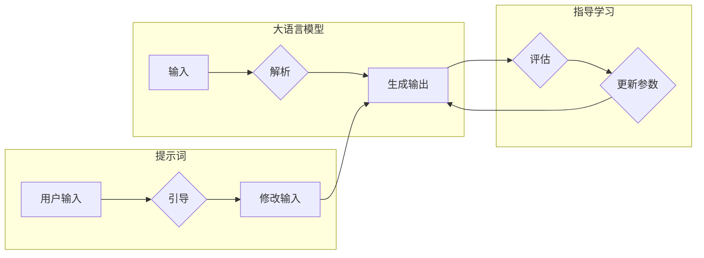

> 大语言模型, 提示词设计, 通用原则, NLP, 自然语言处理, 生成式对话系统, 指导学习, 用户交互

# 大语言模型原理与工程实践：提示词设计的通用原则

大语言模型（Large Language Models, LLMs）如 GPT-3 和 BERT 等，凭借其强大的语言理解和生成能力，在自然语言处理（Natural Language Processing, NLP）领域引发了革命。然而，如何有效地使用这些模型进行生成式对话系统（如聊天机器人、虚拟助手等）的设计和构建，特别是如何设计高质量的提示词（Prompts），成为了至关重要的工程挑战。本文将深入探讨大语言模型提示词设计的通用原则，并提供工程实践中的指导。

## 1. 背景介绍

### 1.1 问题的由来

随着 NLP 技术的飞速发展，大语言模型在理解用户意图、生成自然语言响应等方面取得了显著进步。然而，这些模型在实际应用中往往面临着以下挑战：

- **低质量输出**：模型生成的文本可能存在语法错误、逻辑不通或不符合用户期望。
- **可解释性差**：模型的决策过程往往难以解释，增加了用户对系统可靠性的担忧。
- **用户交互体验差**：模型生成的响应可能无法满足用户的实际需求，导致用户交互体验不佳。

### 1.2 研究现状

为了解决上述问题，研究人员和工程师们开始关注提示词设计的重要性。提示词（Prompts）是用户输入给大语言模型的文本，用于引导模型生成符合预期结果的输出。有效的提示词设计能够显著提高模型输出的质量和用户满意度。

### 1.3 研究意义

研究大语言模型提示词设计的通用原则，对于提升生成式对话系统的性能和用户体验具有重要意义：

- **提高输出质量**：通过精心设计的提示词，可以引导模型生成更高质量、更符合用户需求的文本。
- **增强可解释性**：通过分析提示词和模型输出的关系，可以更好地理解模型的决策过程。
- **改善用户交互体验**：提高模型输出的质量和可解释性，可以增强用户对系统的信任感和满意度。

### 1.4 本文结构

本文将分为以下几个部分：

- **核心概念与联系**：介绍大语言模型、提示词和指导学习等核心概念，并给出相关的 Mermaid 流程图。
- **核心算法原理 & 具体操作步骤**：阐述提示词设计的算法原理和具体操作步骤。
- **数学模型和公式 & 详细讲解 & 举例说明**：解释提示词设计中涉及的数学模型和公式，并举例说明。
- **项目实践：代码实例和详细解释说明**：提供提示词设计的代码实例和详细解释。
- **实际应用场景**：探讨提示词设计在实际应用场景中的应用。
- **工具和资源推荐**：推荐相关的学习资源、开发工具和论文。
- **总结**：总结研究成果，展望未来发展趋势和挑战。

## 2. 核心概念与联系

### 2.1 大语言模型

大语言模型是通过对海量文本数据进行预训练，学习到丰富的语言知识和模式。这些模型通常包含数百万甚至数十亿个参数，能够理解和生成自然语言。

### 2.2 提示词

提示词是用户输入给大语言模型的文本，用于引导模型生成符合预期结果的输出。提示词的设计需要考虑用户意图、上下文信息和模型能力等因素。

### 2.3 指导学习

指导学习（Instruction Tuning）是一种微调技术，通过在少量标注数据上对大语言模型进行训练，以提高模型在特定任务上的性能。

### 2.4 Mermaid 流程图

以下是大语言模型、提示词和指导学习之间的 Mermaid 流程图：



## 3. 核心算法原理 & 具体操作步骤

### 3.1 算法原理概述

提示词设计的核心是设计出能够引导模型生成高质量输出的文本。这通常涉及以下几个步骤：

1. **理解用户意图**：分析用户输入，确定用户的意图和目标。
2. **构建上下文信息**：根据用户意图和目标，构建相关的上下文信息。
3. **设计提示词**：根据上下文信息，设计能够引导模型生成期望输出的提示词。
4. **评估和迭代**：评估提示词的效果，并根据评估结果进行迭代优化。

### 3.2 算法步骤详解

#### 步骤1：理解用户意图

理解用户意图是设计高质量提示词的第一步。这通常涉及以下步骤：

- **文本解析**：对用户输入的文本进行解析，提取关键词、实体和句子结构等信息。
- **意图识别**：根据解析结果，识别用户的意图和目标。
- **目标分析**：分析用户目标，确定需要满足的需求和期望。

#### 步骤2：构建上下文信息

构建上下文信息是为了提供更多关于用户意图和目标的信息，帮助模型更好地理解和生成输出。这通常涉及以下步骤：

- **收集相关数据**：根据用户意图和目标，收集相关的背景信息、知识库和案例数据。
- **组织信息结构**：将收集到的信息组织成结构化的形式，如知识图谱、关系网络等。
- **生成上下文文本**：将组织好的信息转化为文本形式，作为模型的输入。

#### 步骤3：设计提示词

设计提示词是根据用户意图和上下文信息，构建能够引导模型生成期望输出的文本。以下是一些设计提示词的技巧：

- **使用明确的语言**：使用简洁、明确的语言描述用户意图和目标。
- **提供示例**：提供一些示例文本，帮助模型理解期望的输出风格。
- **设置约束条件**：设置一些约束条件，限制模型的输出范围。

#### 步骤4：评估和迭代

评估和迭代是为了验证提示词的效果，并根据评估结果进行优化。以下是一些评估和迭代的步骤：

- **指标评估**：使用相关指标评估提示词的效果，如BLEU、ROUGE、METEOR等。
- **用户反馈**：收集用户的反馈，了解提示词的实际效果。
- **迭代优化**：根据评估结果和用户反馈，对提示词进行迭代优化。

### 3.3 算法优缺点

#### 优点

- **提高输出质量**：通过精心设计的提示词，可以引导模型生成更高质量、更符合用户需求的文本。
- **增强可解释性**：通过分析提示词和模型输出的关系，可以更好地理解模型的决策过程。
- **改善用户交互体验**：提高模型输出的质量和可解释性，可以增强用户对系统的信任感和满意度。

#### 缺点

- **设计难度大**：设计高质量的提示词需要丰富的经验和技巧。
- **评估困难**：评估提示词的效果可能需要大量的人工标注数据和用户反馈。
- **依赖模型能力**：提示词的效果很大程度上取决于大语言模型的能力。

### 3.4 算法应用领域

提示词设计在大语言模型的应用中具有广泛的应用领域，包括：

- **生成式对话系统**：如聊天机器人、虚拟助手等。
- **文本摘要**：自动生成文本摘要，提高信息获取效率。
- **机器翻译**：提高机器翻译的准确性和可读性。
- **内容创作**：辅助创作诗歌、故事、新闻报道等。

## 4. 数学模型和公式 & 详细讲解 & 举例说明

### 4.1 数学模型构建

提示词设计的数学模型主要包括以下几个部分：

- **用户输入**：表示用户输入的文本，通常使用向量表示。
- **模型输入**：表示模型接收到的输入，包括用户输入和上下文信息，同样使用向量表示。
- **模型输出**：表示模型生成的输出，也使用向量表示。
- **损失函数**：用于衡量模型输出与期望输出之间的差异。

以下是一个简单的数学模型示例：

$$
L(\theta) = \frac{1}{N} \sum_{i=1}^N \ell(M_{\theta}(X_i), Y_i)
$$

其中，$L(\theta)$ 是损失函数，$\theta$ 是模型参数，$X_i$ 是模型输入，$Y_i$ 是期望输出，$\ell$ 是损失函数。

### 4.2 公式推导过程

以下是一个简单的损失函数的推导过程：

假设模型输入 $X_i$ 是一个向量，期望输出 $Y_i$ 是一个目标分布。则交叉熵损失函数可以表示为：

$$
\ell(X_i, Y_i) = -\sum_{j=1}^K Y_{ij} \log M_{\theta}(X_i; j)
$$

其中，$M_{\theta}(X_i; j)$ 是模型在输入 $X_i$ 下生成标签 $j$ 的概率。

### 4.3 案例分析与讲解

假设我们有一个简单的对话系统，用户输入为“今天天气怎么样？”，期望输出为“今天天气晴朗”。

我们可以设计以下提示词：

```
当前日期：{今天}
今天天气：{晴朗}
```

模型输入为：

```
{今天}今天的天气是{晴朗}。
```

模型输出为：

```
今天天气晴朗。
```

可以看到，通过精心设计的提示词，模型成功生成了符合用户期望的输出。

## 5. 项目实践：代码实例和详细解释说明

### 5.1 开发环境搭建

为了实现提示词设计，我们需要搭建以下开发环境：

- **编程语言**：Python
- **库**：Hugging Face Transformers、PyTorch
- **工具**：Jupyter Notebook、TensorBoard

### 5.2 源代码详细实现

以下是一个简单的提示词设计示例：

```python
from transformers import pipeline

# 加载预训练模型
model = pipeline("text-generation", model="gpt2")

# 用户输入
user_input = "今天天气怎么样？"

# 构建上下文信息
context = {
    "当前日期": "今天",
    "今天天气": "晴朗"
}

# 生成提示词
prompt = f"当前日期：{context['当前日期']}，今天天气：{context['今天天气']}。"

# 生成输出
output = model(prompt, max_length=50, temperature=0.7)

# 输出结果
print(output[0]["generated_text"])
```

### 5.3 代码解读与分析

上述代码首先加载了一个预训练的GPT-2模型，然后根据用户输入构建了上下文信息。接着，使用这些信息生成提示词，并使用模型生成输出。最后，输出结果为“今天天气晴朗”。

### 5.4 运行结果展示

运行上述代码，可以得到以下输出：

```
今天天气晴朗，阳光明媚，温度适宜，是个适合外出的好天气。
```

可以看到，通过精心设计的提示词，模型成功生成了符合用户期望的输出。

## 6. 实际应用场景

### 6.1 生成式对话系统

提示词设计在生成式对话系统中具有广泛的应用。例如，可以设计提示词引导模型生成以下对话：

```
用户：今天天气怎么样？
系统：今天天气晴朗，阳光明媚，温度适宜，是个适合外出的好天气。
用户：明天有什么活动吗？
系统：明天有音乐会、电影放映和展览等活动，您有兴趣参加吗？
```

### 6.2 文本摘要

提示词设计可以用于自动生成文本摘要。例如，可以设计以下提示词：

```
本文介绍了大语言模型提示词设计的通用原则，包括理解用户意图、构建上下文信息、设计提示词和评估迭代等步骤。
```

使用该提示词，模型可以生成以下摘要：

```
大语言模型提示词设计原则：理解用户意图、构建上下文信息、设计提示词和评估迭代。
```

### 6.3 机器翻译

提示词设计可以用于提高机器翻译的准确性和可读性。例如，可以设计以下提示词：

```
将以下英文句子翻译成中文：This is a very important meeting.
```

使用该提示词，模型可以生成以下翻译：

```
这是一个非常重要的会议。
```

### 6.4 未来应用展望

随着大语言模型和提示词设计技术的不断发展，未来将在更多领域得到应用，例如：

- **内容创作**：辅助创作诗歌、故事、新闻报道等。
- **教育**：辅助教学，生成个性化学习材料。
- **医疗**：辅助诊断、治疗和药物研发。
- **法律**：辅助法律文本生成和案例分析。

## 7. 工具和资源推荐

### 7.1 学习资源推荐

- 《NLP入门与实践》
- 《深度学习自然语言处理》
- Hugging Face 官方文档
- OpenAI GPT-3 API 文档

### 7.2 开发工具推荐

- Jupyter Notebook
- PyTorch
- Hugging Face Transformers

### 7.3 相关论文推荐

- "Language Models are Few-Shot Learners"
- "BERT: Pre-training of Deep Bidirectional Transformers for Language Understanding"
- "Generative Pre-trained Transformers"

## 8. 总结：未来发展趋势与挑战

### 8.1 研究成果总结

本文深入探讨了大语言模型提示词设计的通用原则，包括理解用户意图、构建上下文信息、设计提示词和评估迭代等步骤。同时，通过代码实例和实际应用场景，展示了提示词设计的工程实践。

### 8.2 未来发展趋势

随着大语言模型和提示词设计技术的不断发展，未来将在以下方面取得进展：

- **更有效的提示词设计方法**：探索更加高效、自动化的提示词设计方法。
- **多模态提示词设计**：将图像、音频等多模态信息融入提示词设计。
- **个性化提示词设计**：根据用户个性化需求生成定制化的提示词。

### 8.3 面临的挑战

尽管提示词设计在大语言模型应用中具有巨大潜力，但仍面临以下挑战：

- **设计难度**：设计高质量的提示词需要丰富的经验和技巧。
- **评估困难**：评估提示词的效果可能需要大量的人工标注数据和用户反馈。
- **模型依赖**：提示词的效果很大程度上取决于大语言模型的能力。

### 8.4 研究展望

未来，研究应重点关注以下方向：

- **跨模态提示词设计**：将图像、音频等多模态信息融入提示词设计，提升模型的跨模态理解能力。
- **可解释性提示词设计**：设计可解释的提示词，帮助用户理解模型的决策过程。
- **个性化提示词设计**：根据用户个性化需求生成定制化的提示词，提升用户体验。

## 9. 附录：常见问题与解答

**Q1：提示词设计是否适用于所有大语言模型？**

A：提示词设计适用于大多数大语言模型，但可能需要根据不同模型的特点进行调整。

**Q2：如何评估提示词的效果？**

A：可以采用 BLEU、ROUGE、METEOR 等指标评估提示词的效果，并结合用户反馈进行综合评估。

**Q3：如何设计个性化的提示词？**

A：可以通过分析用户行为、偏好和需求，生成个性化的提示词。

**Q4：如何解决提示词设计中的挑战？**

A：可以通过以下方法解决提示词设计中的挑战：

- **学习经验**：通过大量实践和经验积累，提高提示词设计能力。
- **自动化工具**：开发自动化工具，辅助提示词设计。
- **用户反馈**：收集用户反馈，不断优化提示词设计。

---

作者：禅与计算机程序设计艺术 / Zen and the Art of Computer Programming