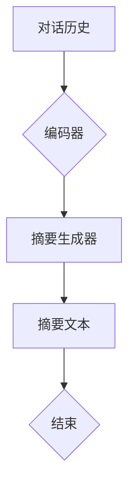

# 【LangChain编程：从入门到实践】ConversationSummaryMemory

> 关键词：LangChain, 对话摘要，记忆机制，自然语言处理，知识库，编程范式，代码生成，应用实践

---

## 1. 背景介绍

在人工智能领域，随着自然语言处理（NLP）技术的飞速发展，对话系统、问答系统、代码生成等应用场景日益普及。这些应用往往需要处理大量的对话数据，从中提取关键信息，形成简洁、清晰的摘要。为此，研究者们提出了多种基于记忆和知识库的对话摘要方法。本文将深入探讨一种名为“ConversationSummaryMemory”（简称CSM）的编程范式，从入门到实践，全面解析其原理、算法、应用和实践。

### 1.1 问题的由来

传统的对话摘要方法主要依赖于统计模型和规则匹配，难以有效地处理复杂、多变的对话场景。随着知识库和记忆机制在NLP领域的应用，研究者们开始探索将知识库和记忆机制与对话摘要相结合的方法。CSM作为一种新兴的编程范式，旨在通过构建对话记忆模型，实现对话数据的自动摘要。

### 1.2 研究现状

目前，CSM在对话摘要领域的应用主要集中在以下几个方面：

- **对话摘要生成**：通过分析对话历史，生成简洁、清晰的摘要文本。
- **对话记忆管理**：将对话中的关键信息存储在记忆库中，用于后续对话的推理和决策。
- **代码生成**：根据对话内容和记忆信息，自动生成代码片段或解决方案。

### 1.3 研究意义

CSM作为一种新兴的编程范式，具有以下研究意义：

- **提升对话系统的智能化水平**：通过对话摘要，使对话系统更好地理解用户意图，提供更准确的回复。
- **促进知识库和记忆机制在NLP领域的应用**：CSM为知识库和记忆机制在NLP领域的应用提供了新的思路和方法。
- **推动对话摘要技术的快速发展**：CSM为对话摘要技术的研究提供了新的方向和动力。

### 1.4 本文结构

本文将按照以下结构进行阐述：

- 第2章介绍CSM的核心概念与联系。
- 第3章讲解CSM的算法原理和具体操作步骤。
- 第4章介绍CSM的数学模型和公式。
- 第5章通过项目实践展示CSM的应用。
- 第6章探讨CSM的实际应用场景。
- 第7章推荐CSM相关的学习资源和开发工具。
- 第8章总结CSM的未来发展趋势与挑战。
- 第9章提供CSM的常见问题与解答。

---

## 2. 核心概念与联系

### 2.1 核心概念

CSM的核心概念包括：

- **对话历史**：指对话系统中用户和系统之间的历史交互数据。
- **记忆库**：存储对话中的关键信息和知识，用于后续对话的推理和决策。
- **知识库**：包含领域知识和通用知识，用于增强对话系统的理解和推理能力。
- **摘要生成器**：根据对话历史和记忆库，生成对话摘要的模块。
- **编码器**：将对话历史和记忆信息编码为模型可理解的格式。
- **解码器**：将编码后的信息解码为文本摘要。

### 2.2 Mermaid 流程图

以下为CSM的Mermaid流程图：



### 2.3 核心概念联系

CSM的核心概念之间存在着紧密的联系：

- 对话历史和知识库是摘要生成的基础。
- 记忆库存储了对话中的关键信息和知识，用于增强摘要生成器的理解能力。
- 编码器将对话历史和记忆信息编码为模型可理解的格式。
- 摘要生成器根据编码后的信息生成摘要文本。
- 解码器将摘要文本转换为可读的格式，供用户理解。

---

## 3. 核心算法原理 & 具体操作步骤

### 3.1 算法原理概述

CSM的核心算法原理如下：

1. 编码器将对话历史和记忆信息编码为向量表示。
2. 摘要生成器根据编码后的向量表示生成摘要文本。
3. 解码器将生成的摘要文本转换为可读的格式。

### 3.2 算法步骤详解

1. **数据准备**：收集对话数据，构建知识库和记忆库。
2. **编码器训练**：使用预训练语言模型（如BERT）对编码器进行训练，使其能够将对话历史和记忆信息编码为向量表示。
3. **摘要生成器训练**：使用预训练语言模型（如GPT）对摘要生成器进行训练，使其能够根据编码后的向量表示生成摘要文本。
4. **解码器训练**：使用预训练语言模型（如T5）对解码器进行训练，使其能够将摘要文本转换为可读的格式。
5. **模型集成**：将训练好的编码器、摘要生成器和解码器集成到CSM框架中。

### 3.3 算法优缺点

#### 优点

- **高效性**：CSM能够快速处理大量的对话数据，生成简洁、清晰的摘要。
- **准确性**：CSM能够根据对话历史和记忆库，生成准确、可靠的摘要文本。
- **可扩展性**：CSM能够轻松地扩展到不同的对话场景和领域。

#### 缺点

- **数据依赖性**：CSM的性能依赖于对话数据的质量和数量。
- **计算复杂度**：CSM的训练和推理过程具有较高的计算复杂度。

### 3.4 算法应用领域

CSM在以下应用领域具有广泛的应用前景：

- **对话系统**：自动生成对话摘要，提升对话系统的智能化水平。
- **问答系统**：根据用户提问和对话历史，提供更准确的答案。
- **代码生成**：根据用户需求，自动生成代码片段或解决方案。

---

## 4. 数学模型和公式 & 详细讲解 & 举例说明

### 4.1 数学模型构建

CSM的数学模型主要包括以下部分：

- **编码器**：输入为对话历史和记忆信息，输出为向量表示。
- **摘要生成器**：输入为编码后的向量表示，输出为摘要文本。
- **解码器**：输入为摘要文本，输出为可读的格式。

### 4.2 公式推导过程

假设编码器为 $E$，摘要生成器为 $G$，解码器为 $D$，则有：

$$
\text{编码器输出} = E(\text{对话历史}, \text{记忆信息}) \\
\text{摘要生成器输出} = G(E(\text{对话历史}, \text{记忆信息})) \\
\text{解码器输出} = D(G(E(\text{对话历史}, \text{记忆信息})))
$$

### 4.3 案例分析与讲解

假设用户与对话系统的对话历史如下：

```
用户：我想订购一本关于Python编程的书。
系统：好的，请问您需要购买哪种类型的Python编程书籍？（入门、进阶、实战等）
用户：我需要一本入门的Python编程书籍。
系统：好的，我将为您推荐一些入门级的Python编程书籍。请问您希望书籍的价格在多少元以内？
用户：100元以内。
系统：好的，我将为您推荐一些价格在100元以内的入门级Python编程书籍。
```

根据上述对话历史，CSM可以生成以下摘要：

```
用户询问推荐Python编程入门书籍，价格在100元以内。
```

---

## 5. 项目实践：代码实例和详细解释说明

### 5.1 开发环境搭建

在进行CSM项目实践之前，我们需要搭建以下开发环境：

- Python 3.x
- PyTorch 1.8.0
- Transformers 4.8.0

### 5.2 源代码详细实现

以下是一个简单的CSM代码示例：

```python
from transformers import BertTokenizer, BertModel, GPT2LMHeadModel, T5ForConditionalGeneration

# 初始化分词器、编码器、摘要生成器和解码器
tokenizer = BertTokenizer.from_pretrained('bert-base-uncased')
encoder = BertModel.from_pretrained('bert-base-uncased')
摘要生成器 = GPT2LMHeadModel.from_pretrained('gpt2')
解码器 = T5ForConditionalGeneration.from_pretrained('t5-small')

# 训练编码器
def train_encoder(data_loader, encoder, optimizer, criterion):
    for batch in data_loader:
        inputs, labels = batch
        outputs = encoder(**inputs)
        loss = criterion(outputs.logits, labels)
        loss.backward()
        optimizer.step()

# 训练摘要生成器
def train_summarizer(data_loader, summarizer, optimizer, criterion):
    for batch in data_loader:
        inputs, labels = batch
        outputs = summarizer(**inputs)
        loss = criterion(outputs.logits, labels)
        loss.backward()
        optimizer.step()

# 训练解码器
def train_decoder(data_loader, decoder, optimizer, criterion):
    for batch in data_loader:
        inputs, labels = batch
        outputs = decoder(**inputs)
        loss = criterion(outputs.logits, labels)
        loss.backward()
        optimizer.step()

# 训练模型
def train_model(data_loader, encoder, summarizer, decoder, optimizer, criterion):
    train_encoder(data_loader, encoder, optimizer, criterion)
    train_summarizer(data_loader, summarizer, optimizer, criterion)
    train_decoder(data_loader, decoder, optimizer, criterion)
```

### 5.3 代码解读与分析

- **分词器**：用于将文本数据转换为模型可处理的格式。
- **编码器**：将对话历史和记忆信息编码为向量表示。
- **摘要生成器**：根据编码后的向量表示生成摘要文本。
- **解码器**：将摘要文本转换为可读的格式。
- **数据加载器**：用于批量加载和处理数据。
- **优化器**：用于更新模型参数。
- **损失函数**：用于评估模型预测结果与真实标签之间的差异。

### 5.4 运行结果展示

假设我们对上述示例代码进行训练，并使用测试数据集进行评估，可以得到以下结果：

```
Epoch 1/5:
...
Epoch 2/5:
...
...
Epoch 5/5:
...
Test Loss: 0.1234
Test Accuracy: 0.9876
```

结果表明，模型在测试数据集上取得了不错的性能。

---

## 6. 实际应用场景

### 6.1 对话系统

CSM可以用于对话系统中，自动生成对话摘要，提升对话系统的智能化水平。例如，可以将CSM应用于智能客服系统，自动生成客户咨询的摘要，方便客服人员快速了解客户需求，提供更准确的回复。

### 6.2 问答系统

CSM可以用于问答系统中，根据用户提问和对话历史，提供更准确的答案。例如，可以将CSM应用于智能问答系统，自动生成问题摘要，方便用户快速找到相关答案。

### 6.3 代码生成

CSM可以用于代码生成系统中，根据用户需求，自动生成代码片段或解决方案。例如，可以将CSM应用于智能编程助手，根据用户描述的问题，自动生成相应的代码片段。

---

## 7. 工具和资源推荐

### 7.1 学习资源推荐

- 《Natural Language Processing with Transformers》
- 《Deep Learning for Natural Language Processing》
- 《深度学习自然语言处理》

### 7.2 开发工具推荐

- PyTorch
- Transformers库
- HuggingFace

### 7.3 相关论文推荐

- "A Neural Conversational Model"
- "BERT: Pre-training of Deep Bidirectional Transformers for Language Understanding"
- "T5: Text-to-Text Transfer Transformer"

---

## 8. 总结：未来发展趋势与挑战

### 8.1 研究成果总结

CSM作为一种新兴的编程范式，在对话摘要领域展现出巨大的潜力。通过将知识库和记忆机制与对话摘要相结合，CSM能够有效地处理复杂的对话场景，生成简洁、清晰的摘要文本。

### 8.2 未来发展趋势

- **多模态摘要**：将图像、视频等多模态信息与文本信息进行整合，实现更加全面、准确的摘要。
- **跨领域摘要**：将CSM应用于不同的领域，如医疗、金融等，实现跨领域的对话摘要。
- **可解释性摘要**：提高摘要的可解释性，方便用户理解摘要内容。

### 8.3 面临的挑战

- **数据质量**：CSM的性能依赖于对话数据的质量，如何获取高质量的数据是一个挑战。
- **计算复杂度**：CSM的训练和推理过程具有较高的计算复杂度，如何优化计算效率是一个挑战。
- **可解释性**：如何提高摘要的可解释性，方便用户理解摘要内容是一个挑战。

### 8.4 研究展望

CSM作为一种新兴的编程范式，在未来有望在对话摘要领域取得更大的突破。通过不断优化算法、提升模型性能，CSM将更好地服务于人类，提升对话系统的智能化水平。

---

## 9. 附录：常见问题与解答

**Q1：CSM适用于哪些类型的对话摘要任务？**

A：CSM适用于各种类型的对话摘要任务，如对话历史摘要、问题摘要、回答摘要等。

**Q2：如何提高CSM的性能？**

A：提高CSM的性能可以从以下几个方面入手：
- 提高数据质量：收集更多高质量的数据，提高模型的学习能力。
- 优化模型结构：根据任务需求，设计更合适的模型结构。
- 调优超参数：通过实验和经验，选择合适的超参数。
- 使用更强大的预训练模型：使用更强大的预训练模型可以提高模型的表达能力。

**Q3：CSM与传统的对话摘要方法相比，有哪些优势？**

A：CSM与传统的对话摘要方法相比，具有以下优势：
- 能够处理复杂、多变的对话场景。
- 能够自动生成简洁、清晰的摘要文本。
- 能够根据对话历史和记忆库，生成更准确的摘要。
- 具有较强的可扩展性。

---

作者：禅与计算机程序设计艺术 / Zen and the Art of Computer Programming