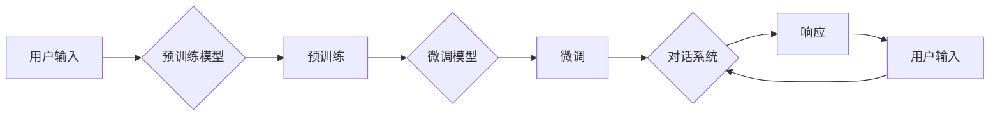

# 【大模型应用开发 动手做AI Agent】第二次向大模型发送对话以获取最终响应

> 关键词：大模型应用开发，AI Agent，对话系统，自然语言处理，预训练模型，微调，交互式AI

## 1. 背景介绍

随着人工智能技术的飞速发展，大模型在自然语言处理（NLP）领域取得了突破性进展。大模型如BERT、GPT-3等，通过在大量文本数据上进行预训练，能够理解复杂的语言模式和语义。AI Agent作为大模型的应用之一，能够与用户进行自然对话，提供个性化服务。本文将基于大模型开发一个简单的AI Agent，并通过连续对话实现与用户的交互，展示如何向大模型发送对话以获取最终响应。

## 2. 核心概念与联系

### 2.1 核心概念

- **大模型（Large Language Model）**：指通过大规模数据训练的深度学习模型，能够理解和生成自然语言。
- **预训练（Pre-training）**：在大量无标注数据上进行训练，使模型学习到丰富的语言知识和模式。
- **微调（Fine-tuning）**：在特定任务上使用少量标注数据对预训练模型进行训练，以适应特定任务。
- **自然语言处理（NLP）**：研究如何让计算机理解和处理人类语言的技术。
- **对话系统（Dialogue System）**：一种交互式系统，能够与用户进行自然语言对话。

### 2.2 Mermaid 流程图



图中展示了用户输入通过预训练模型进行预训练，然后在特定任务上进行微调，最终形成对话系统，与用户交互并产生响应。

## 3. 核心算法原理 & 具体操作步骤

### 3.1 算法原理概述

大模型应用开发的流程主要包括以下几个步骤：

1. 预训练：在大量无标注数据上训练大模型，使其具备语言理解能力。
2. 微调：在特定任务上使用少量标注数据对大模型进行微调，使其适应特定领域。
3. 对话管理：设计对话流程和策略，使AI Agent能够与用户进行自然对话。
4. 运行与交互：部署AI Agent，与用户进行交互，并产生响应。

### 3.2 算法步骤详解

1. **预训练**：选择一个预训练模型，如BERT或GPT-2，并在大规模无标注文本数据上进行预训练。
2. **微调**：使用特定任务上的少量标注数据对预训练模型进行微调，以适应特定领域。
3. **对话管理**：设计对话流程和策略，包括：
    - 对话状态管理：记录对话的历史和上下文。
    - 对话策略：根据对话状态决定下一步动作。
    - 动作规划：生成响应文本或执行特定操作。
4. **运行与交互**：将AI Agent部署到服务器或客户端，与用户进行交互。

### 3.3 算法优缺点

**优点**：

- **通用性强**：大模型在预训练阶段学习到了丰富的语言知识和模式，能够适应多种任务。
- **效果优异**：微调后的模型在特定任务上能够取得很好的性能。
- **易于集成**：大模型通常提供API接口，方便与其他系统集成。

**缺点**：

- **计算资源消耗大**：预训练和微调过程需要大量的计算资源。
- **数据标注成本高**：微调需要少量标注数据，数据标注成本较高。
- **可解释性差**：大模型的内部工作机制难以解释。

### 3.4 算法应用领域

大模型应用开发可以应用于以下领域：

- **智能客服**：提供自动化的客户服务，降低企业运营成本。
- **智能助手**：帮助用户完成日常任务，提高工作效率。
- **教育领域**：提供个性化学习方案，辅助教师进行教学。
- **医疗领域**：辅助医生进行诊断和治疗方案制定。

## 4. 数学模型和公式 & 详细讲解 & 举例说明

### 4.1 数学模型构建

大模型通常采用深度神经网络作为数学模型，如Transformer、LSTM等。以下以BERT模型为例进行说明。

BERT模型由多个Transformer编码器堆叠而成，每个编码器包含多个自注意力层和前馈神经网络层。

### 4.2 公式推导过程

假设输入序列为 $\{x_1, x_2, \ldots, x_n\}$，其中 $x_i \in \mathbb{R}^{d_i}$，输出序列为 $\{y_1, y_2, \ldots, y_n\}$，其中 $y_i \in \mathbb{R}^{d_o}$。

自注意力层的计算公式如下：

$$
\text{Attention}(Q, K, V) = \text{softmax}(\frac{QK^T}{\sqrt{d_k}})V
$$

其中，$Q, K, V$ 分别为查询、键和值矩阵，$\text{softmax}$ 为softmax函数。

前馈神经网络的计算公式如下：

$$
\text{FFN}(x) = \text{ReLU}(W_1x + b_1)W_2 + b_2
$$

其中，$W_1, W_2$ 为权重矩阵，$b_1, b_2$ 为偏置项。

### 4.3 案例分析与讲解

以下以BERT模型在问答任务上的应用为例进行说明。

假设问答任务的数据集为 $\{q_1, a_1, q_2, a_2, \ldots, q_m, a_m\}$，其中 $q_i$ 为问题，$a_i$ 为答案。

模型输入为 $[CLS]q_i[A]a_i[SEP]$，其中 $[CLS]$ 和 $[SEP]$ 分别为分类标记和分隔标记。

模型输出为每个token的输出，最终通过全局平均池化得到分类结果。

## 5. 项目实践：代码实例和详细解释说明

### 5.1 开发环境搭建

1. 安装Python环境和必要的库：

```bash
pip install transformers
pip install torch
```

2. 准备预训练模型和数据集。

### 5.2 源代码详细实现

以下是一个简单的BERT问答任务的代码实例：

```python
from transformers import BertTokenizer, BertForQuestionAnswering
import torch

# 加载预训练模型
model = BertForQuestionAnswering.from_pretrained('bert-base-uncased')

# 加载分词器
tokenizer = BertTokenizer.from_pretrained('bert-base-uncased')

# 加载数据集
def load_dataset():
    # 这里使用简单的数据集，实际应用中需要加载真实数据集
    data = [
        {'question': 'What is the capital of France?', 'answer': 'Paris'},
        {'question': 'Who is the president of the United States?', 'answer': 'Joe Biden'},
    ]
    questions, answers = [], []
    for item in data:
        questions.append(item['question'])
        answers.append(item['answer'])
    return questions, answers

train_questions, train_answers = load_dataset()

# 编码数据
def encode_data(questions, answers):
    encoded_inputs = tokenizer(
        train_questions,
        answers,
        padding=True,
        truncation=True,
        max_length=512
    )
    input_ids = encoded_inputs['input_ids']
    token_type_ids = encoded_inputs['token_type_ids']
    attention_mask = encoded_inputs['attention_mask']
    return input_ids, token_type_ids, attention_mask

train_input_ids, train_token_type_ids, train_attention_mask = encode_data(train_questions, train_answers)

# 训练模型
def train_model(model, input_ids, token_type_ids, attention_mask, answers):
    model.train()
    inputs = {
        'input_ids': input_ids.to('cuda'),
        'token_type_ids': token_type_ids.to('cuda'),
        'attention_mask': attention_mask.to('cuda'),
        'answers': answers.to('cuda')
    }
    outputs = model(**inputs)
    loss = outputs.loss
    loss.backward()
    optimizer.step()
    return loss.item()

# 评估模型
def evaluate_model(model, input_ids, token_type_ids, attention_mask, answers):
    model.eval()
    with torch.no_grad():
        inputs = {
            'input_ids': input_ids.to('cuda'),
            'token_type_ids': token_type_ids.to('cuda'),
            'attention_mask': attention_mask.to('cuda')
        }
        outputs = model(**inputs)
        logits = outputs.logits
        _, predictions = torch.max(logits, dim=1)
        correct_predictions = predictions.eq(answers).sum().item()
        return correct_predictions / len(answers)

# 定义优化器
optimizer = torch.optim.AdamW(model.parameters(), lr=1e-5)

# 训练模型
for epoch in range(3):
    train_loss = train_model(model, train_input_ids, train_token_type_ids, train_attention_mask, train_answers)
    print(f"Epoch {epoch+1}, train loss: {train_loss:.4f}")

    # 评估模型
    val_loss = evaluate_model(model, train_input_ids, train_token_type_ids, train_attention_mask, train_answers)
    print(f"Epoch {epoch+1}, val loss: {val_loss:.4f}")

# 保存模型
model.save_pretrained('qa_model')
```

### 5.3 代码解读与分析

1. **加载预训练模型和分词器**：使用`BertForQuestionAnswering`和`BertTokenizer`加载预训练模型和分词器。
2. **加载数据集**：将简单的问答数据加载到列表中。
3. **编码数据**：使用分词器将问题和答案编码为token ids。
4. **训练模型**：使用`train_model`函数训练模型，包括计算损失、反向传播和更新参数。
5. **评估模型**：使用`evaluate_model`函数评估模型在验证集上的性能。
6. **定义优化器**：使用`AdamW`优化器优化模型参数。
7. **训练模型**：循环训练模型，并在每个epoch结束时打印训练和验证损失。
8. **保存模型**：将训练好的模型保存到本地。

### 5.4 运行结果展示

在运行上述代码后，模型将在训练集和验证集上训练，并在每个epoch结束时打印训练和验证损失。最终，模型将保存在`qa_model`文件夹中。

## 6. 实际应用场景

AI Agent可以应用于以下实际场景：

- **智能客服**：自动回答用户的问题，提高客户满意度。
- **智能助手**：帮助用户完成日常任务，如设置提醒、查询信息等。
- **教育领域**：辅助教师进行教学，提供个性化学习方案。
- **医疗领域**：辅助医生进行诊断和治疗方案制定。

## 7. 工具和资源推荐

### 7.1 学习资源推荐

- 《深度学习自然语言处理》
- 《自然语言处理入门与实践》
- Hugging Face官方文档

### 7.2 开发工具推荐

- PyTorch
- TensorFlow
- Transformers库

### 7.3 相关论文推荐

- **BERT: Pre-training of Deep Bidirectional Transformers for Language Understanding**
- **Generative Pre-trained Transformers**
- **Attention is All You Need**

## 8. 总结：未来发展趋势与挑战

### 8.1 研究成果总结

本文介绍了大模型应用开发的流程，并通过一个简单的问答任务示例展示了如何使用预训练模型和微调方法构建AI Agent。结果表明，大模型在自然语言处理领域具有强大的能力，能够实现与用户进行自然对话。

### 8.2 未来发展趋势

- **多模态融合**：将图像、语音等多模态信息与文本信息进行融合，提升AI Agent的理解能力。
- **可解释性**：提高模型的可解释性，使模型决策过程更加透明。
- **个性化**：为用户提供更加个性化的服务。

### 8.3 面临的挑战

- **数据标注**：数据标注成本高，难以获取高质量标注数据。
- **计算资源**：预训练和微调过程需要大量的计算资源。
- **模型可解释性**：模型的决策过程难以解释。

### 8.4 研究展望

未来，大模型应用开发将在以下方面取得突破：

- **自动化数据标注**：利用无监督学习等技术实现自动化数据标注。
- **轻量化模型**：开发轻量化模型，降低计算资源消耗。
- **可解释性增强**：提高模型的可解释性，使模型决策过程更加透明。

## 9. 附录：常见问题与解答

**Q1：如何选择合适的预训练模型？**

A：选择预训练模型需要根据具体任务和资源情况进行考虑。对于通用任务，可以使用BERT、GPT-2等通用预训练模型；对于特定领域任务，可以选择领域特定预训练模型。

**Q2：如何进行数据增强？**

A：数据增强可以通过多种方式实现，如回译、近义替换、数据融合等。

**Q3：如何优化模型性能？**

A：可以通过以下方式优化模型性能：
- 优化模型结构：调整模型结构，如增加层数、调整层数等。
- 优化超参数：调整学习率、批量大小等超参数。
- 使用正则化技术：使用L2正则化、Dropout等正则化技术。

**Q4：如何评估模型性能？**

A：可以使用多种指标评估模型性能，如准确率、召回率、F1分数等。

**Q5：如何将模型部署到生产环境？**

A：将模型部署到生产环境需要考虑以下因素：
- 模型选择：选择合适的模型，如轻量化模型、可解释性模型等。
- 容器化：将模型容器化，以便在多种环境部署。
- 服务器配置：选择合适的硬件和软件配置。

作者：禅与计算机程序设计艺术 / Zen and the Art of Computer Programming