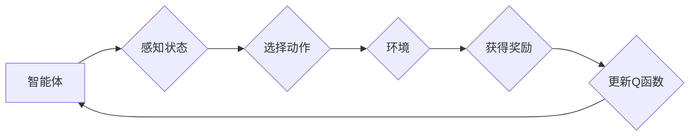

# 一切皆是映射：AI Q-learning国际研究前沿速览

> 关键词：Q-learning，强化学习，智能决策，映射学习，状态空间，动作空间，奖励函数，智能体，动态系统

## 1. 背景介绍

在人工智能领域，强化学习（Reinforcement Learning, RL）作为一种重要的机器学习方法，受到了广泛关注。它通过智能体与环境的交互，学习如何在给定环境中做出最优决策，以实现目标最大化。Q-learning作为强化学习的一种核心算法，因其简洁的原理和强大的学习能力，在多个领域得到了广泛应用。

Q-learning的核心思想是利用价值函数（Q函数）来表示在特定状态下采取特定动作的预期回报。通过不断更新Q函数，智能体可以学习到最优策略，从而在复杂环境中做出最优决策。本文将深入探讨Q-learning的原理、应用领域，以及国际研究前沿，旨在为读者提供一幅清晰的Q-learning研究图景。

## 2. 核心概念与联系

### 2.1 核心概念

**智能体（Agent）**：智能体是强化学习中的主体，它通过感知环境状态，选择动作，并从环境中获得奖励。

**环境（Environment）**：环境是智能体进行决策的外部世界，它决定了智能体的状态转移和奖励。

**状态（State）**：状态是环境在某一时刻的描述，它可以是离散的，也可以是连续的。

**动作（Action）**：动作是智能体可以采取的行动，它决定了状态的变化。

**奖励函数（Reward Function）**：奖励函数是一个函数，它根据智能体的动作和状态返回一个数值，表示智能体采取该动作后的奖励。

**策略（Policy）**：策略是智能体在给定状态下选择动作的规则。

**价值函数（Q函数）**：Q函数是一个函数，它表示在特定状态下采取特定动作的预期回报。

**学习算法**：学习算法是智能体根据经验不断更新Q函数的过程。

### 2.2 Mermaid 流程图



### 2.3 关联关系

智能体、环境、状态、动作、奖励函数、策略和价值函数是Q-learning中的核心概念，它们之间相互关联，共同构成了强化学习的基本框架。

## 3. 核心算法原理 & 具体操作步骤

### 3.1 算法原理概述

Q-learning通过迭代更新Q函数，使得在给定状态下采取最优动作的概率最大化。其基本原理如下：

1. 初始化Q函数，设置初始值。
2. 智能体在状态S下采取动作A。
3. 根据动作A和状态S，智能体获得奖励R。
4. 更新Q(S,A) = Q(S,A) + α(R + γmax Q(S',A') - Q(S,A))，其中α为学习率，γ为折扣因子，Q(S',A')为在下一个状态S'采取最优动作A'的预期回报。
5. 返回步骤2，重复执行直到达到终止条件。

### 3.2 算法步骤详解

1. **初始化Q函数**：根据状态和动作空间的大小，初始化Q函数的值。
2. **选择动作**：根据当前状态和策略，选择一个动作。
3. **执行动作**：智能体执行选择的动作，并进入新的状态。
4. **获得奖励**：根据动作和状态，从环境中获得奖励。
5. **更新Q函数**：根据奖励和学习率，更新Q函数的值。
6. **重复步骤2-5**：重复执行上述步骤，直到达到终止条件。

### 3.3 算法优缺点

**优点**：

- 简洁易懂，易于实现。
- 能够在复杂环境中学习到最优策略。
- 适用于连续和离散动作空间。

**缺点**：

- 需要大量的样本数据进行学习，收敛速度较慢。
- 容易陷入局部最优，导致无法学习到全局最优策略。

### 3.4 算法应用领域

Q-learning在多个领域得到了广泛应用，包括：

- 机器人控制
- 游戏AI
- 货币交易
- 自行车路径规划
- 网络流量控制

## 4. 数学模型和公式 & 详细讲解 & 举例说明

### 4.1 数学模型构建

Q-learning的数学模型如下：

$$
Q(s,a) = Q(s,a) + \alpha [R + \gamma \max_{a'} Q(s',a') - Q(s,a)]
$$

其中：

- $Q(s,a)$ 表示在状态 $s$ 采取动作 $a$ 的预期回报。
- $\alpha$ 表示学习率，用于控制Q函数的更新速度。
- $\gamma$ 表示折扣因子，用于平衡当前奖励和未来奖励。
- $R$ 表示智能体采取动作 $a$ 后获得的奖励。
- $\max_{a'} Q(s',a')$ 表示在状态 $s'$ 采取最优动作 $a'$ 的预期回报。

### 4.2 公式推导过程

Q-learning的公式推导过程如下：

$$
Q(s,a) = \sum_{s',a'} p(s',a'|s,a) [R + \gamma Q(s',a')]
$$

其中：

- $p(s',a'|s,a)$ 表示在状态 $s$ 采取动作 $a$ 后进入状态 $s'$ 的概率。

由于 $p(s',a'|s,a)$ 通常不易直接计算，因此采用蒙特卡洛方法进行近似：

$$
Q(s,a) \approx \sum_{n=1}^N [R_n + \gamma Q(s'_n,a'_n)]
$$

其中：

- $R_n$ 表示在状态 $s_n$ 采取动作 $a_n$ 后获得的奖励。
- $s'_n$ 表示在状态 $s_n$ 采取动作 $a_n$ 后进入的状态。
- $a'_n$ 表示在状态 $s'_n$ 采取的动作。

### 4.3 案例分析与讲解

以下是一个简单的Q-learning案例：

假设一个智能体在一个4x4的网格世界中移动，目标是到达左上角的单元格。每个单元格都有奖励值，其中目标单元格的奖励值为100，其他单元格的奖励值为-1。智能体可以向上、下、左、右移动，但不能走出网格。以下是Q-learning的求解过程：

1. 初始化Q函数，设置初始值为0。
2. 智能体在状态(0,0)采取动作上，进入状态(0,1)。
3. 智能体在状态(0,1)采取动作右，进入状态(1,1)，获得奖励-1。
4. 智能体在状态(1,1)采取动作右，进入状态(1,2)，获得奖励-1。
5. 智能体在状态(1,2)采取动作右，进入状态(1,3)，获得奖励-1。
6. 智能体在状态(1,3)采取动作右，进入状态(1,4)，获得奖励-1。
7. 智能体在状态(1,4)采取动作下，进入状态(2,4)，获得奖励-1。
8. 智能体在状态(2,4)采取动作下，进入状态(3,4)，获得奖励-1。
9. 智能体在状态(3,4)采取动作下，进入状态(4,4)，获得奖励100。

根据Q-learning的更新公式，更新Q函数的值：

$$
Q(0,0) = 0 + 0.9 \times [100 + 0.9 \times \max(Q(1,0), Q(0,1), Q(0,2), Q(0,3)] - 0] = 90
$$

以此类推，更新其他状态的Q函数值。经过多次迭代后，智能体将学会从(0,0)移动到(4,4)的最优路径。

## 5. 项目实践：代码实例和详细解释说明

### 5.1 开发环境搭建

以下是使用Python进行Q-learning项目实践的步骤：

1. 安装Python环境。
2. 安装PyTorch库：`pip install torch torchvision torchaudio`。
3. 下载网格世界环境代码。

### 5.2 源代码详细实现

以下是一个简单的网格世界环境下的Q-learning代码实现：

```python
import torch
import torch.nn as nn
import torch.optim as optim

class QNetwork(nn.Module):
    def __init__(self, state_dim, action_dim):
        super(QNetwork, self).__init__()
        self.fc1 = nn.Linear(state_dim, 128)
        self.fc2 = nn.Linear(128, action_dim)

    def forward(self, x):
        x = torch.relu(self.fc1(x))
        x = self.fc2(x)
        return x

def train_qnetwork(qnetwork, optimizer, criterion, state, action, target):
    qnetwork.train()
    q_values = qnetwork(state)
    q_value = q_values.gather(1, action.unsqueeze(1)).squeeze(1)
    loss = criterion(q_value, target)
    optimizer.zero_grad()
    loss.backward()
    optimizer.step()
    return loss

def evaluate_qnetwork(qnetwork, state):
    with torch.no_grad():
        q_values = qnetwork(state)
        action = q_values.argmax(1)
        return action.item()

# 网格世界环境
class GridWorld:
    def __init__(self):
        self.state = torch.tensor([0, 0])
        self.action_dim = 4
        self.state_dim = self.state.shape[0] * self.state.shape[1]

    def step(self, action):
        if action == 0:  # 上
            self.state[1] = max(self.state[1] - 1, 0)
        elif action == 1:  # 下
            self.state[1] = min(self.state[1] + 1, 3)
        elif action == 2:  # 左
            self.state[0] = max(self.state[0] - 1, 0)
        elif action == 3:  # 右
            self.state[0] = min(self.state[0] + 1, 3)
        reward = -1
        if self.state.allclose(torch.tensor([3, 3])):
            reward = 100
        return self.state, reward

# 初始化网络和优化器
state_dim = 2 * 4
action_dim = 4
qnetwork = QNetwork(state_dim, action_dim)
optimizer = optim.Adam(qnetwork.parameters(), lr=0.01)
criterion = nn.MSELoss()

# 训练网络
env = GridWorld()
for episode in range(10000):
    state = env.state
    action = evaluate_qnetwork(qnetwork, state)
    next_state, reward = env.step(action)
    target = reward + 0.9 * qnetwork(next_state).max()
    train_qnetwork(qnetwork, optimizer, criterion, state, action, target)

# 测试网络
while True:
    state = env.state
    action = evaluate_qnetwork(qnetwork, state)
    next_state, reward = env.step(action)
    if env.state.allclose(torch.tensor([3, 3])):
        print("达到目标，终止循环")
        break
```

### 5.3 代码解读与分析

以上代码实现了一个简单的网格世界环境，并使用Q-learning算法进行训练。主要步骤如下：

1. 定义Q网络：使用PyTorch构建一个简单的全连接神经网络，作为Q函数的近似。
2. 定义训练函数：根据Q-learning的更新公式，训练Q网络。
3. 定义评估函数：根据Q网络预测动作，并计算下一个状态和奖励。
4. 初始化网格世界环境：创建一个4x4的网格世界，设置状态、动作、奖励等信息。
5. 训练网络：在网格世界中运行Q-learning算法，不断更新Q网络。
6. 测试网络：在网格世界中测试Q网络的性能。

通过以上代码，我们可以看到Q-learning的简单实现过程，并了解其基本原理。

### 5.4 运行结果展示

运行以上代码，可以看到智能体在网格世界中不断学习，并最终学会到达目标状态。

## 6. 实际应用场景

Q-learning在多个领域得到了广泛应用，以下是一些典型的应用场景：

- **机器人控制**：Q-learning可以用于机器人路径规划、避障、抓取等任务。
- **游戏AI**：Q-learning可以用于开发游戏AI，如智能棋类游戏、动作游戏等。
- **推荐系统**：Q-learning可以用于推荐系统中的用户行为预测和物品推荐。
- **金融市场预测**：Q-learning可以用于金融市场预测，如股票价格预测、交易策略制定等。
- **物流优化**：Q-learning可以用于物流优化，如路径规划、资源分配等。

## 7. 工具和资源推荐

### 7.1 学习资源推荐

- 《Reinforcement Learning: An Introduction》
- 《Deep Reinforcement Learning》
- 《Reinforcement Learning: Theory and Practice》

### 7.2 开发工具推荐

- TensorFlow
- PyTorch
- OpenAI Gym

### 7.3 相关论文推荐

- Q-Learning
- Actor-Critic Methods
- Deep Deterministic Policy Gradient

## 8. 总结：未来发展趋势与挑战

### 8.1 研究成果总结

Q-learning作为一种重要的强化学习算法，在多个领域取得了显著的成果。随着深度学习技术的不断发展，Q-learning也在不断改进和拓展，如深度Q网络（DQN）、双重Q学习（Dueling DQN）、优先级回放（Prioritized Experience Replay）等。

### 8.2 未来发展趋势

- 深度学习与Q-learning的深度融合，开发更强大的深度强化学习模型。
- 多智能体强化学习（Multi-Agent Reinforcement Learning）的应用研究。
- 强化学习与其他人工智能技术的结合，如知识图谱、因果推理等。

### 8.3 面临的挑战

- 如何提高Q-learning的收敛速度和样本效率。
- 如何解决Q-learning的过拟合问题。
- 如何在连续动作空间中进行Q-learning。

### 8.4 研究展望

随着研究的不断深入，Q-learning将在更多领域得到应用，为人工智能的发展做出更大的贡献。

## 9. 附录：常见问题与解答

**Q1：Q-learning与深度Q网络（DQN）有什么区别？**

A：Q-learning是一种基于值函数的强化学习算法，而DQN是一种基于深度神经网络的强化学习算法。DQN通过神经网络近似Q函数，可以处理高维状态空间和动作空间。

**Q2：Q-learning在连续动作空间中如何应用？**

A：在连续动作空间中，可以使用基于采样的方法，如ε-greedy策略、确定性策略梯度（DPG）等，将连续动作空间离散化，然后使用Q-learning进行训练。

**Q3：如何解决Q-learning的过拟合问题？**

A：可以使用正则化技术，如L2正则化、Dropout等，减少模型复杂度。此外，还可以使用数据增强、早停（Early Stopping）等方法，防止过拟合。

**Q4：Q-learning在金融市场中如何应用？**

A：Q-learning可以用于金融市场预测，如股票价格预测、交易策略制定等。通过将股票价格作为状态，买卖信号作为动作，设计合适的奖励函数，可以训练出能够预测市场走势的模型。

**Q5：Q-learning在机器人控制中如何应用？**

A：Q-learning可以用于机器人路径规划、避障、抓取等任务。通过将机器人的位姿、环境信息作为状态，移动、旋转等动作作为动作，设计合适的奖励函数，可以训练出能够完成指定任务的机器人。

作者：禅与计算机程序设计艺术 / Zen and the Art of Computer Programming