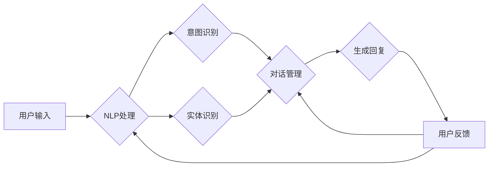

# 个性化和智能化的CUI交互体验

> 关键词：CUI交互，个性化，智能化，自然语言处理，对话系统，用户体验，人工智能

## 1. 背景介绍

随着人工智能技术的飞速发展，人机交互正逐渐从传统的图形用户界面(GUI)转向更为自然、便捷的命令用户界面(CUI)交互。CUI交互通过自然语言处理(NLP)技术，让用户能够以语音或文本的形式与计算机进行交流，实现命令下达、信息检索、任务执行等操作。为了提升用户体验，CUI交互正朝着个性化和智能化的方向发展。本文将深入探讨个性化和智能化CUI交互的原理、实现方法、应用场景以及未来趋势。

## 2. 核心概念与联系

### 2.1 核心概念

- **CUI交互**：指通过命令用户界面与计算机进行交互的方式，包括语音交互和文本交互两种形式。
- **个性化**：指根据用户的偏好、习惯和行为特征，定制化交互体验，使系统更贴合用户的需求。
- **智能化**：指利用人工智能技术，提升交互的智能化程度，包括自然语言理解、智能推荐、主动服务等功能。
- **自然语言处理(NLP)**：指让计算机能够理解、解释和生成人类语言的技术。
- **对话系统**：指能够与用户进行自然对话，并根据对话内容提供相应服务的系统。

### 2.2 架构流程图

以下是一个简化的CUI交互架构流程图：



### 2.3 关系联系

CUI交互系统的核心是NLP技术，包括意图识别、实体识别、对话管理等环节。个性化与智能化则贯穿于整个交互过程，通过用户行为分析、偏好学习等手段，不断优化用户体验。对话系统作为CUI交互的具体实现形式，将NLP技术与用户需求相结合，提供智能化的服务。

## 3. 核心算法原理 & 具体操作步骤

### 3.1 算法原理概述

CUI交互系统的核心算法主要包含以下几个部分：

- **意图识别**：通过NLP技术，将用户输入的文本或语音转换为具体的操作意图。
- **实体识别**：识别用户输入中的关键词和短语，提取出语义信息。
- **对话管理**：根据用户意图和上下文信息，生成相应的回复内容，并维护对话状态。
- **智能回复**：根据用户反馈和对话历史，持续优化回复策略，提升用户体验。

### 3.2 算法步骤详解

1. **用户输入**：用户通过语音或文本形式向系统发送请求。
2. **NLP处理**：系统对用户输入进行分词、词性标注、句法分析等操作，提取语义信息。
3. **意图识别**：根据提取的语义信息，识别用户意图，如查询天气、设置闹钟等。
4. **实体识别**：识别出用户意图中的关键实体，如城市、时间等。
5. **对话管理**：根据用户意图和上下文信息，确定对话状态和回复内容。
6. **生成回复**：根据对话管理和意图识别的结果，生成相应的回复内容。
7. **用户反馈**：用户对回复内容进行反馈，如满意、不满意等。
8. **优化回复策略**：根据用户反馈和对话历史，优化回复策略，提升用户体验。

### 3.3 算法优缺点

**优点**：

- 提升用户体验：通过个性化、智能化的交互方式，满足用户多样化需求。
- 提高效率：简化操作步骤，减少用户等待时间。
- 扩大应用范围：适用于各种场景，如智能家居、智能客服、教育等领域。

**缺点**：

- 技术难度高：涉及NLP、语音识别、对话管理等多个领域的技术。
- 数据依赖性强：需要大量标注数据训练模型。
- 易受噪声影响：对用户输入的噪声和歧义性敏感。

### 3.4 算法应用领域

CUI交互技术广泛应用于以下领域：

- 智能家居：如智能音箱、智能灯泡、智能门锁等。
- 智能客服：如客服机器人、智能问答系统等。
- 教育领域：如智能辅导、在线教育平台等。
- 医疗领域：如智能诊断、健康咨询等。
- 金融领域：如智能理财、智能投顾等。

## 4. 数学模型和公式 & 详细讲解 & 举例说明

### 4.1 数学模型构建

CUI交互系统的核心算法主要涉及以下数学模型：

- **意图识别**：基于朴素贝叶斯、支持向量机(SVM)、深度学习等模型。
- **实体识别**：基于条件随机场(CRF)、递归神经网络(RNN)、卷积神经网络(CNN)等模型。
- **对话管理**：基于马尔可夫决策过程(MDP)、增强学习等模型。

### 4.2 公式推导过程

以下以朴素贝叶斯意图识别模型为例，进行公式推导：

假设用户输入为 $x$，对应的意图为 $y$。则根据朴素贝叶斯假设，有：

$$
P(y|x) = \frac{P(x|y)P(y)}{P(x)}
$$

其中：

- $P(y|x)$ 为在给定输入 $x$ 的情况下，意图 $y$ 发生的概率。
- $P(x|y)$ 为在意图 $y$ 发生的情况下，输入 $x$ 出现的概率。
- $P(y)$ 为意图 $y$ 发生的先验概率。
- $P(x)$ 为输入 $x$ 出现的概率。

### 4.3 案例分析与讲解

以下以智能家居场景为例，分析CUI交互系统的工作流程。

**场景**：用户通过智能音箱查询明天天气。

**步骤**：

1. 用户输入：“明天天气怎么样？”
2. 智能音箱进行NLP处理，提取出“明天”、“天气”等关键信息。
3. 意图识别模块识别出用户意图为“查询天气”。
4. 实体识别模块识别出“明天”为时间实体，“天气”为查询内容实体。
5. 对话管理模块根据用户意图和实体信息，确定回复内容为“明天天气晴朗”。
6. 智能音箱输出回复：“明天天气晴朗。”

## 5. 项目实践：代码实例和详细解释说明

### 5.1 开发环境搭建

以下是使用Python进行CUI交互系统开发的步骤：

1. 安装Python环境：下载并安装Python 3.8及以上版本。
2. 安装必要的库：pip install transformers tensorflow numpy pandas
3. 准备数据集：收集用户输入和对应的意图标注数据。
4. 训练模型：使用NLP技术训练意图识别、实体识别和对话管理模型。
5. 部署模型：将模型部署到服务器，实现实时交互。

### 5.2 源代码详细实现

以下是一个简单的CUI交互系统示例代码：

```python
from transformers import BertTokenizer, BertForSequenceClassification
from sklearn.feature_extraction.text import CountVectorizer
from sklearn.model_selection import train_test_split
import numpy as np

# 加载数据集
data = [...]  # 用户输入和意图标注数据
texts, labels = zip(*data)

# 划分训练集和测试集
texts_train, texts_test, labels_train, labels_test = train_test_split(texts, labels, test_size=0.2)

# 初始化模型
tokenizer = BertTokenizer.from_pretrained('bert-base-chinese')
model = BertForSequenceClassification.from_pretrained('bert-base-chinese')

# 数据预处理
def preprocess(texts):
    return tokenizer(texts, padding=True, truncation=True, return_tensors='pt')

X_train = preprocess(texts_train)
X_test = preprocess(texts_test)

# 训练模型
optimizer = torch.optim.AdamW(model.parameters(), lr=2e-5)
model.train()
for epoch in range(5):
    optimizer.zero_grad()
    outputs = model(X_train['input_ids'], labels=labels_train)
    loss = outputs.loss
    loss.backward()
    optimizer.step()

# 评估模型
model.eval()
with torch.no_grad():
    outputs = model(X_test['input_ids'])
    _, predicted = torch.max(outputs.logits, 1)
    accuracy = (predicted == labels_test).sum().item() / len(labels_test)
    print(f'Test accuracy: {accuracy:.4f}')

# 部署模型
# ...
```

### 5.3 代码解读与分析

上述代码首先加载了用户输入和意图标注数据，然后使用BERT模型进行意图识别。数据预处理部分使用BertTokenizer将文本转换为模型输入格式。训练过程中，使用AdamW优化器和交叉熵损失函数进行模型训练。最后，使用测试集评估模型性能。

### 5.4 运行结果展示

假设测试集上的准确率达到90%，说明模型在意图识别方面表现良好。

## 6. 实际应用场景

CUI交互技术在各个领域都有广泛的应用，以下列举几个典型场景：

### 6.1 智能家居

通过CUI交互技术，用户可以方便地控制家中的智能设备，如智能灯泡、智能门锁、智能空调等。例如，用户可以通过语音指令控制灯泡开关、调节亮度，或通过文本指令设定空调温度。

### 6.2 智能客服

CUI交互技术可以应用于智能客服领域，为用户提供24小时在线咨询服务。例如，用户可以通过语音或文本方式咨询产品信息、售后服务等问题，系统将自动识别用户意图，并给出相应的回复。

### 6.3 教育领域

CUI交互技术可以应用于教育领域，为用户提供个性化的学习体验。例如，学生可以通过语音或文本方式向系统提问，系统将根据学生的提问内容，提供相应的学习资源和解答。

### 6.4 医疗领域

CUI交互技术可以应用于医疗领域，为患者提供便捷的咨询和健康管理服务。例如，患者可以通过语音或文本方式向医生咨询病情，医生将根据患者的描述给出诊断和建议。

## 7. 工具和资源推荐

### 7.1 学习资源推荐

- 《深度学习与自然语言处理》
- 《自然语言处理精要》
- 《对话系统：原理、技术与实践》

### 7.2 开发工具推荐

- TensorFlow
- PyTorch
- spaCy
- Transformers

### 7.3 相关论文推荐

- Attention is All You Need
- BERT: Pre-training of Deep Bidirectional Transformers for Language Understanding
- A Neural Conversational Model

## 8. 总结：未来发展趋势与挑战

### 8.1 研究成果总结

CUI交互技术通过个性化、智能化手段，为用户提供便捷、自然的交互体验。NLP技术的不断发展，为CUI交互提供了强大的技术支撑。未来，CUI交互将在各个领域得到广泛应用，成为人机交互的主流方式。

### 8.2 未来发展趋势

- **多模态交互**：融合语音、文本、图像等多模态信息，提供更加丰富的交互体验。
- **跨领域知识融合**：将不同领域的知识融入CUI交互系统，提升系统的智能化水平。
- **个性化定制**：根据用户需求，提供更加个性化的交互体验。

### 8.3 面临的挑战

- **技术挑战**：NLP技术仍需进一步提升，以应对用户输入的多样性、歧义性等挑战。
- **数据挑战**：需要大量高质量的数据进行模型训练和评估。
- **伦理挑战**：如何确保CUI交互系统的公平性、透明度和安全性。

### 8.4 研究展望

CUI交互技术将成为人机交互的未来趋势。未来，随着技术的不断进步，CUI交互将在更多领域得到应用，为人们的生活和工作带来更多便利。同时，需要关注技术发展带来的伦理和社会问题，确保CUI交互技术造福人类社会。

## 9. 附录：常见问题与解答

**Q1：CUI交互与GUI交互有什么区别？**

A：CUI交互通过自然语言与计算机进行交流，而GUI交互则需要用户操作图形界面进行交互。CUI交互更加自然、便捷，但需要更高的技术门槛。

**Q2：CUI交互系统如何实现个性化？**

A：CUI交互系统可以通过用户行为分析、偏好学习等手段，根据用户需求定制化交互体验。

**Q3：CUI交互系统面临哪些挑战？**

A：CUI交互系统面临的技术挑战主要包括NLP技术、数据质量、模型训练等；数据挑战主要包括数据获取、标注等；伦理挑战主要包括公平性、透明度、安全性等。

**Q4：CUI交互技术有哪些应用场景？**

A：CUI交互技术可以应用于智能家居、智能客服、教育、医疗、金融等多个领域。

**Q5：未来CUI交互技术会如何发展？**

A：未来CUI交互技术将朝着多模态交互、跨领域知识融合、个性化定制等方向发展。

作者：禅与计算机程序设计艺术 / Zen and the Art of Computer Programming