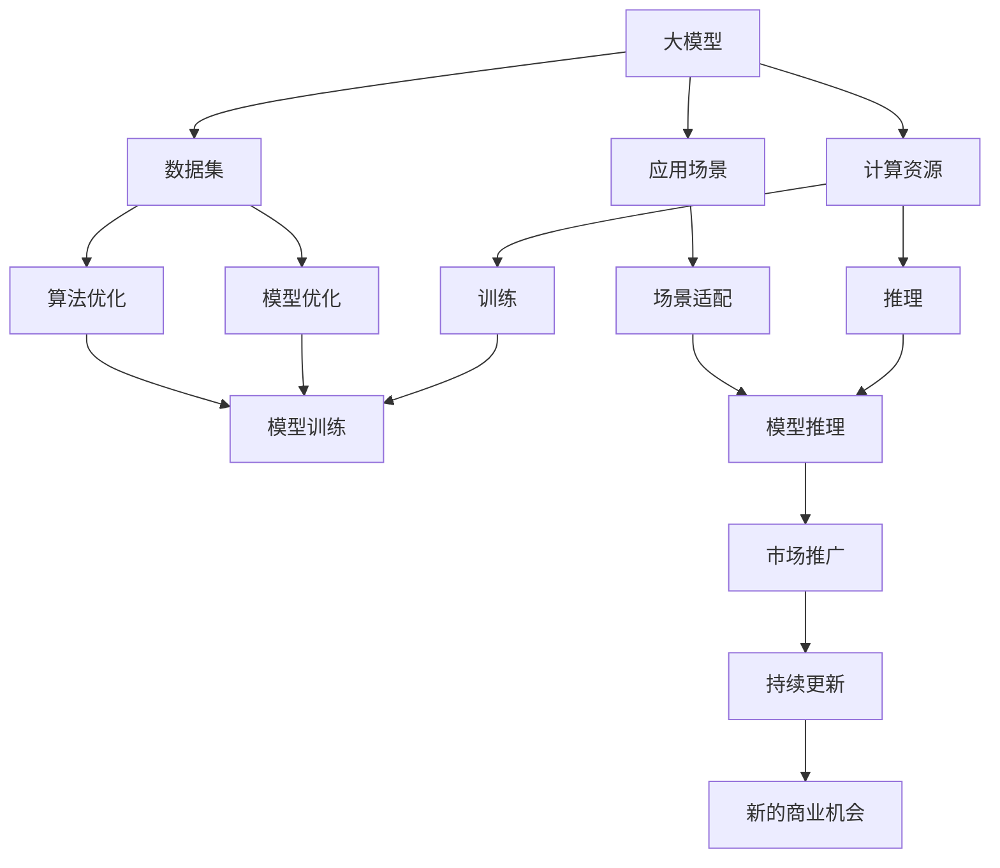
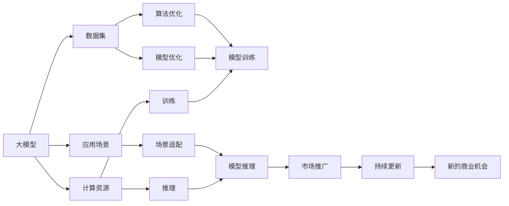

                 

# 大模型：AI技术的商业化路径

> 关键词：大模型,商业化路径,人工智能,深度学习,算法优化,商业落地,产业应用

## 1. 背景介绍

### 1.1 问题由来
近年来，人工智能（AI）技术在各个领域取得了显著的突破，其中深度学习作为AI领域的重要分支，已经成功应用于图像识别、语音识别、自然语言处理等众多场景。特别是大规模预训练模型（如GPT、BERT、T5等）的提出，极大地提升了模型在特定任务上的性能，推动了AI技术向更广泛的应用领域扩展。

然而，尽管AI技术在学术界和工业界取得了显著进展，但其商业化路径仍然面临诸多挑战。如何将先进的技术成果转化为实际商业价值，如何平衡研发投入与市场回报，如何构建可持续的商业模式，这些问题迫切需要解决。因此，本文旨在探讨大模型的商业化路径，为大模型在实际应用中的落地提供有益的参考。

### 1.2 问题核心关键点
大模型的商业化路径涉及多个关键点，包括但不限于：

- **模型选择与优化**：选择适合特定业务场景的大模型，并进行针对性的参数优化和算法改进。
- **数据集建设**：构建高质量、大规模的数据集，用于训练和测试模型。
- **计算资源调配**：合理规划计算资源，确保模型训练和推理的高效运行。
- **应用场景适配**：根据具体业务需求，适配模型输出格式和推理框架，实现模型应用。
- **市场推广与合作**：通过市场推广和合作伙伴关系，快速将大模型推向市场，扩大影响力。
- **长期维护与更新**：建立持续的技术支持与更新机制，保证模型长期稳定运行和性能提升。

本文将从这些关键点出发，深入分析大模型的商业化路径，为开发者和企业家提供切实可行的指导。

### 1.3 问题研究意义
研究大模型的商业化路径，对于推动AI技术的产业化进程，拓展AI应用场景，提升企业竞争力具有重要意义：

1. **降低技术壁垒**：将复杂的技术问题简化为模型应用，降低了企业进入AI领域的门槛。
2. **提高模型效果**：通过优化算法和模型参数，提升大模型在特定任务上的性能，满足业务需求。
3. **加速市场化进程**：借助市场推广和合作，快速将AI技术推向市场，提升企业市场份额和影响力。
4. **促进产业升级**：利用AI技术改造传统行业，推动产业数字化转型升级。
5. **带来新的商业机会**：AI技术的应用拓展了新的业务领域，为企业创造了新的增长点。

## 2. 核心概念与联系

### 2.1 核心概念概述

- **大模型（Large Model）**：通常指参数规模在十亿以上，基于深度学习算法训练的模型，如GPT、BERT等。这类模型具有强大的特征抽取和语义理解能力，广泛应用于自然语言处理、图像识别等领域。
- **商业化路径（Commercialization Path）**：指将大模型从研发到实际应用的过程，包括模型选择、数据建设、算法优化、应用适配、市场推广和长期维护等多个环节。
- **计算资源（Computational Resources）**：包括GPU、TPU、CPU等硬件设备，用于大模型的训练和推理。
- **数据集（Dataset）**：高质量、大规模的数据集，用于训练和测试模型，是模型性能的重要保障。
- **应用场景（Application Scenario）**：具体业务需求，包括文本处理、图像识别、语音识别等。
- **市场推广（Market Promotion）**：通过广告、合作、销售等方式，将大模型推向市场，扩大用户群体。
- **持续更新（Continuous Updates）**：定期对大模型进行优化和更新，保证其长期稳定运行和性能提升。

这些核心概念之间存在紧密联系，形成了大模型商业化路径的完整框架。以下通过Mermaid流程图展示这些概念之间的关系：



该流程图展示了从大模型选择与优化到市场推广和持续更新的全过程，以及各个环节之间的关联。通过这一过程，大模型可以逐步应用于不同的业务场景，创造商业价值。

### 2.2 概念间的关系

这些核心概念之间的逻辑关系可以进一步通过Mermaid流程图展示：



该流程图展示了各个概念之间的逻辑关系，包括计算资源在模型训练和推理中的应用，数据集对模型优化和算法优化的影响，应用场景对场景适配和模型推理的指导作用，以及市场推广和持续更新对商业价值的提升。

### 2.3 核心概念的整体架构

最后，我们将通过一个综合的流程图来展示这些核心概念在大模型商业化路径中的整体架构：


该综合流程图展示了从大模型选择与优化到市场推广和持续更新的完整过程，以及各个环节之间的关联。通过这一过程，大模型可以逐步应用于不同的业务场景，创造商业价值。

## 3. 核心算法原理 & 具体操作步骤
### 3.1 算法原理概述

大模型的商业化路径涉及多个关键算法和步骤，以下是详细介绍：

1. **模型选择与优化**：选择合适的预训练模型，如GPT、BERT、T5等，根据特定业务需求进行参数优化和算法改进。
2. **数据集建设**：构建高质量、大规模的数据集，用于训练和测试模型，确保模型性能。
3. **计算资源调配**：合理规划计算资源，确保模型训练和推理的高效运行。
4. **应用场景适配**：根据具体业务需求，适配模型输出格式和推理框架，实现模型应用。
5. **市场推广与合作**：通过市场推广和合作伙伴关系，快速将大模型推向市场，扩大影响力。
6. **长期维护与更新**：建立持续的技术支持与更新机制，保证模型长期稳定运行和性能提升。

### 3.2 算法步骤详解

以下将详细介绍各个算法步骤的详细步骤：

#### 3.2.1 模型选择与优化

**步骤1：选择合适的预训练模型**
- 根据业务需求选择合适的预训练模型，如GPT、BERT、T5等。
- 分析模型特点和优缺点，确保其符合业务需求。

**步骤2：模型参数优化**
- 对预训练模型进行参数微调，以适应特定的业务场景。
- 使用交叉验证等方法选择最优模型参数。

**步骤3：算法优化**
- 选择适合的优化算法，如Adam、SGD等。
- 根据模型特点和计算资源，选择适当的超参数。

#### 3.2.2 数据集建设

**步骤1：数据收集**
- 收集与业务相关的数据，如文本、图像、语音等。
- 确保数据集的多样性和代表性。

**步骤2：数据预处理**
- 对数据进行清洗、标注等预处理操作。
- 使用数据增强技术，如回译、近义替换等，扩充训练集。

**步骤3：数据划分**
- 将数据集划分为训练集、验证集和测试集。
- 确保各集之间的数据分布一致。

#### 3.2.3 计算资源调配

**步骤1：硬件选择**
- 根据模型规模和任务需求选择合适的硬件设备，如GPU、TPU等。
- 考虑硬件成本和可用性，合理规划计算资源。

**步骤2：分布式训练**
- 使用分布式训练技术，提高模型训练效率。
- 合理设计并行策略，避免资源浪费。

**步骤3：推理优化**
- 对模型进行推理优化，如量化、剪枝等，提高推理速度和资源利用率。

#### 3.2.4 应用场景适配

**步骤1：场景适配**
- 根据具体业务需求，设计适配模型输出的接口和格式。
- 使用框架如TensorFlow、PyTorch等，进行场景适配。

**步骤2：模型部署**
- 将适配后的模型部署到生产环境。
- 使用容器化技术如Docker，提高模型部署的灵活性和稳定性。

**步骤3：监控与调优**
- 实时监控模型性能，使用日志工具如ELK Stack，分析性能瓶颈。
- 根据监控结果，调整模型参数和推理策略。

#### 3.2.5 市场推广与合作

**步骤1：市场推广**
- 使用广告、宣传等方式，提升大模型的知名度。
- 与行业合作伙伴建立合作，扩大市场影响力。

**步骤2：销售策略**
- 制定合理的销售策略，如按使用量收费、按效果付费等。
- 通过试用版和免费版吸引用户，逐步扩大市场份额。

**步骤3：用户体验**
- 提供高质量的技术支持和用户体验，提升用户满意度。
- 收集用户反馈，持续改进产品和服务。

#### 3.2.6 长期维护与更新

**步骤1：技术支持**
- 建立持续的技术支持机制，及时解决用户问题。
- 提供技术文档和示例代码，帮助用户快速上手。

**步骤2：持续更新**
- 定期对大模型进行优化和更新，提高性能和鲁棒性。
- 根据业务需求，动态调整模型结构和算法。

**步骤3：知识库构建**
- 构建知识库和规则库，提供专家知识支持。
- 使用知识图谱等技术，提升模型的智能水平。

### 3.3 算法优缺点

大模型商业化路径涉及多个算法和步骤，以下详细介绍其优缺点：

#### 优点

- **高效性**：大模型预训练过程基于大规模数据集，经过充分训练，能够显著提升特定任务的性能。
- **通用性**：大模型可以应用于多种业务场景，具有良好的泛化能力。
- **灵活性**：通过适配和优化，可以灵活调整模型输出和推理策略，适应不同业务需求。
- **创新性**：大模型可以探索新的算法和应用场景，推动技术创新。
- **可扩展性**：大模型商业化路径可以逐步扩展，逐步实现市场推广和长期维护。

#### 缺点

- **高成本**：大模型需要大量的计算资源和数据资源，成本较高。
- **复杂性**：模型训练和部署过程复杂，需要专业的技术团队支持。
- **隐私风险**：大模型可能涉及敏感数据，存在隐私泄露风险。
- **维护成本**：持续的技术支持和模型更新需要较高的人力资源和维护成本。

### 3.4 算法应用领域

大模型的商业化路径涉及多个应用领域，以下是详细介绍：

- **自然语言处理（NLP）**：文本分类、情感分析、命名实体识别等。
- **计算机视觉（CV）**：图像识别、物体检测、人脸识别等。
- **语音识别（ASR）**：语音转文本、语音合成等。
- **推荐系统**：个性化推荐、内容推荐等。
- **金融科技**：风险评估、信用评分、舆情分析等。
- **医疗健康**：病历分析、诊断辅助、智能客服等。
- **智能制造**：质量检测、设备监控、预测性维护等。

## 4. 数学模型和公式 & 详细讲解 & 举例说明

### 4.1 数学模型构建

在大模型商业化路径中，数学模型和公式的应用非常重要。以下详细介绍常用的数学模型和公式：

- **损失函数（Loss Function）**：衡量模型预测与真实标签之间的差异，如交叉熵损失、均方误差损失等。
- **优化算法（Optimization Algorithm）**：用于最小化损失函数，如Adam、SGD等。
- **超参数（Hyperparameters）**：模型的关键参数，如学习率、批大小、迭代轮数等。
- **正则化（Regularization）**：防止模型过拟合，如L2正则、Dropout等。
- **数据增强（Data Augmentation）**：扩充训练集，如回译、近义替换等。

### 4.2 公式推导过程

以下详细介绍常用的数学模型和公式的推导过程：

#### 4.2.1 交叉熵损失函数

**定义**：交叉熵损失函数（Cross-Entropy Loss）用于衡量模型预测与真实标签之间的差异，公式如下：

$$
L(y, \hat{y}) = -\frac{1}{N}\sum_{i=1}^N \sum_{j=1}^C y_{i,j} \log \hat{y}_{i,j}
$$

其中，$N$为样本数量，$C$为类别数，$y_{i,j}$为真实标签，$\hat{y}_{i,j}$为模型预测。

**推导**：交叉熵损失函数的推导基于信息论中的信息熵和交叉熵概念。信息熵用于衡量随机变量的不确定性，而交叉熵则是衡量两个概率分布之间的距离。在分类任务中，交叉熵损失函数可以表示为模型预测与真实标签之间的平均差异。

#### 4.2.2 Adam优化算法

**定义**：Adam（Adaptive Moment Estimation）优化算法是一种自适应学习率优化算法，公式如下：

$$
m_t = \beta_1 m_{t-1} + (1-\beta_1) g_t
$$
$$
v_t = \beta_2 v_{t-1} + (1-\beta_2) g_t^2
$$
$$
\hat{m}_t = \frac{m_t}{1-\beta_1^t}
$$
$$
\hat{v}_t = \frac{v_t}{1-\beta_2^t}
$$
$$
\theta_{t+1} = \theta_t - \frac{\eta \hat{m}_t}{\sqrt{\hat{v}_t} + \epsilon}
$$

其中，$m_t$和$v_t$为动量和梯度平方的指数移动平均，$\beta_1$和$\beta_2$为指数衰减率，$\eta$为学习率，$\epsilon$为平滑项。

**推导**：Adam算法基于梯度的一阶矩估计和二阶矩估计，自适应地调整每个参数的学习率。具体而言，$m_t$和$v_t$分别用于估计梯度的一阶矩和二阶矩，$\hat{m}_t$和$\hat{v}_t$则是偏差校正后的估计值。在更新参数时，Adam算法结合了一阶矩估计和二阶矩估计，使学习率自适应地调整，从而更快地收敛到最优解。

#### 4.2.3 L2正则化

**定义**：L2正则化（L2 Regularization）用于防止模型过拟合，公式如下：

$$
L_{\text{reg}}(\theta) = \frac{\lambda}{2} \sum_{i=1}^d \theta_i^2
$$

其中，$\lambda$为正则化系数，$\theta_i$为模型参数。

**推导**：L2正则化通过在损失函数中引入正则化项，限制模型参数的大小。当正则化系数$\lambda$增大时，正则化项对损失函数的影响增大，从而防止模型过拟合。L2正则化的推导基于最小二乘法，是一种常用的正则化方法。

#### 4.2.4 Dropout

**定义**：Dropout是一种常用的正则化技术，随机丢弃部分神经元，减少模型的复杂性，公式如下：

$$
P(i|x) = \frac{\exp(x_i/\tau)}{\sum_{j=1}^n \exp(x_j/\tau)}
$$

其中，$x_i$为神经元的输入，$\tau$为温度参数，$P(i|x)$为神经元$i$被保留的概率。

**推导**：Dropout通过随机丢弃部分神经元，强制模型学习到更加鲁棒的特征表示。在训练过程中，每个神经元都有一定的概率被保留或丢弃，从而减少了神经元之间的依赖关系，提高了模型的泛化能力。Dropout的推导基于概率论中的伯努利分布，是一种常用的正则化方法。

### 4.3 案例分析与讲解

以下通过具体案例分析，详细讲解大模型商业化路径中的数学模型和公式的应用：

**案例1：情感分析**

情感分析（Sentiment Analysis）是NLP中的一个重要任务，用于判断文本的情感倾向。以下是一个情感分析的示例：

**步骤1：模型选择与优化**
- 选择BERT作为预训练模型，根据情感分析任务的需求进行参数微调。
- 使用Adam优化算法，设置学习率为1e-5，进行10轮迭代。

**步骤2：数据集建设**
- 收集情感分析相关的数据集，如电影评论、产品评价等。
- 对数据进行清洗和标注，使用数据增强技术扩充训练集。

**步骤3：计算资源调配**
- 使用GPU进行分布式训练，优化模型推理速度。
- 使用TensorBoard进行模型训练的监控和调试。

**步骤4：应用场景适配**
- 将情感分析模型适配到Web应用中，提供API接口。
- 使用Django等Web框架，实现实时情感分析功能。

**步骤5：市场推广与合作**
- 使用广告推广情感分析模型，吸引用户注册和试用。
- 与电商平台合作，提供情感分析服务，获取更多业务机会。

**步骤6：长期维护与更新**
- 定期收集用户反馈，更新情感分析模型，提升性能和鲁棒性。
- 使用ELK Stack进行系统监控，及时发现和解决问题。

**案例2：图像识别**

图像识别（Image Recognition）是CV中的一个重要任务，用于识别图像中的物体和场景。以下是一个图像识别的示例：

**步骤1：模型选择与优化**
- 选择ResNet作为预训练模型，根据图像识别任务的需求进行参数微调。
- 使用SGD优化算法，设置学习率为0.001，进行20轮迭代。

**步骤2：数据集建设**
- 收集图像识别相关的数据集，如CIFAR-10、ImageNet等。
- 对数据进行预处理和标注，使用数据增强技术扩充训练集。

**步骤3：计算资源调配**
- 使用TPU进行分布式训练，优化模型推理速度。
- 使用TensorFlow进行模型训练的监控和调试。

**步骤4：应用场景适配**
- 将图像识别模型适配到移动应用中，提供API接口。
- 使用React Native等跨平台框架，实现实时图像识别功能。

**步骤5：市场推广与合作**
- 使用广告推广图像识别模型，吸引用户注册和试用。
- 与智能家居公司合作，提供图像识别服务，获取更多业务机会。

**步骤6：长期维护与更新**
- 定期收集用户反馈，更新图像识别模型，提升性能和鲁棒性。
- 使用ELK Stack进行系统监控，及时发现和解决问题。

## 5. 项目实践：代码实例和详细解释说明

### 5.1 开发环境搭建

在进行大模型商业化路径的实践前，需要准备好开发环境。以下是使用Python进行PyTorch开发的环境配置流程：

1. 安装Anaconda：从官网下载并安装Anaconda，用于创建独立的Python环境。

2. 创建并激活虚拟环境：
```bash
conda create -n pytorch-env python=3.8 
conda activate pytorch-env
```

3. 安装PyTorch：根据CUDA版本，从官网获取对应的安装命令。例如：
```bash
conda install pytorch torchvision torchaudio cudatoolkit=11.1 -c pytorch -c conda-forge
```

4. 安装Transformers库：
```bash
pip install transformers
```

5. 安装各类工具包：
```bash
pip install numpy pandas scikit-learn matplotlib tqdm jupyter notebook ipython
```

完成上述步骤后，即可在`pytorch-env`环境中开始大模型商业化路径的实践。

### 5.2 源代码详细实现

下面我们以BERT情感分析任务为例，给出使用Transformers库对BERT模型进行商业化路径实践的PyTorch代码实现。

首先，定义情感分析任务的数据处理函数：

```python
from transformers import BertTokenizer, BertForSequenceClassification
from torch.utils.data import Dataset
import torch

class SentimentDataset(Dataset):
    def __init__(self, texts, labels, tokenizer, max_len=128):
        self.texts = texts
        self.labels = labels
        self.tokenizer = tokenizer
        self.max_len = max_len
        
    def __len__(self):
        return len(self.texts)
    
    def __getitem__(self, item):
        text = self.texts[item]
        label = self.labels[item]
        
        encoding = self.tokenizer(text, return_tensors='pt', max_length=self.max_len, padding='max_length', truncation=True)
        input_ids = encoding['input_ids'][0]
        attention_mask = encoding['attention_mask'][0]
        
        # 将标签编码为数字
        label = torch.tensor([label], dtype=torch.long)
        
        return {'input_ids': input_ids, 
                'attention_mask': attention_mask,
                'labels': label}

# 标签编码
label2id = {'positive': 1, 'negative': 0}
id2label = {1: 'positive', 0: 'negative'}

# 创建dataset
tokenizer = BertTokenizer.from_pretrained('bert-base-uncased')

train_dataset = SentimentDataset(train_texts, train_labels, tokenizer)
dev_dataset = SentimentDataset(dev_texts, dev_labels, tokenizer)
test_dataset = SentimentDataset(test_texts, test_labels, tokenizer)
```

然后，定义模型和优化器：

```python
from transformers import AdamW

model = BertForSequenceClassification.from_pretrained('bert-base-uncased', num_labels=2)

optimizer = AdamW(model.parameters(), lr=2e-5)
```

接着，定义训练和评估函数：

```python
from torch.utils.data import DataLoader
from tqdm import tqdm
from sklearn.metrics import accuracy_score

device = torch.device('cuda') if torch.cuda.is_available() else torch.device('cpu')
model.to(device)

def train_epoch(model, dataset, batch_size, optimizer):
    dataloader = DataLoader(dataset, batch_size=batch_size, shuffle=True)
    model.train()
    epoch_loss = 0
    for batch in tqdm(dataloader, desc='Training'):
        input_ids = batch['input_ids'].to(device)
        attention_mask = batch['attention_mask'].to(device)
        labels = batch['labels'].to(device)
        model.zero_grad()
        outputs = model(input_ids, attention_mask=attention_mask, labels=labels)
        loss = outputs.loss
        epoch_loss += loss.item()
        loss.backward()
        optimizer.step()
    return epoch_loss / len(dataloader)

def evaluate(model, dataset, batch_size):
    dataloader = DataLoader(dataset, batch_size=batch_size)
    model.eval()
    preds, labels = [], []
    with torch.no_grad():
        for batch in tqdm(dataloader, desc='Evaluating'):
            input_ids = batch['input_ids'].to(device)
            attention_mask = batch['attention_mask'].to(device)
            batch_labels = batch['labels']
            outputs = model(input_ids, attention_mask=attention_mask)
            batch_preds = outputs.logits.argmax(dim=1).to('cpu').tolist()
            batch_labels = batch_labels.to('cpu').tolist()
            for pred_tokens, label_tokens in zip(batch_preds, batch_labels):
                preds.append(pred_tokens[:len(label_tokens)])
                labels.append(label_tokens)
                
    print('Accuracy:', accuracy_score(labels, preds))
```

最后，启动训练流程并在测试集上评估：

```python
epochs = 5
batch_size = 16

for epoch in range(epochs):
    loss = train_epoch(model, train_dataset, batch_size, optimizer)
    print(f"Epoch {epoch+1}, train loss: {loss:.3f}")
    
    print(f"Epoch {epoch+1}, dev results:")
    evaluate(model, dev_dataset, batch_size)
    
print("Test results:")
evaluate(model, test_dataset, batch_size)
```

以上就是使用PyTorch对BERT进行情感分析任务商业化路径实践的完整代码实现。可以看到，得益于Transformers库的强大封装，我们可以用相对简洁的代码完成BERT模型的加载和商业化路径实践。

### 5.3 代码解读与分析

让我们再详细解读一下关键代码的实现细节：

**SentimentDataset类**：
- `__init__`方法：初始化文本、标签、分词器等关键组件。
- `__

