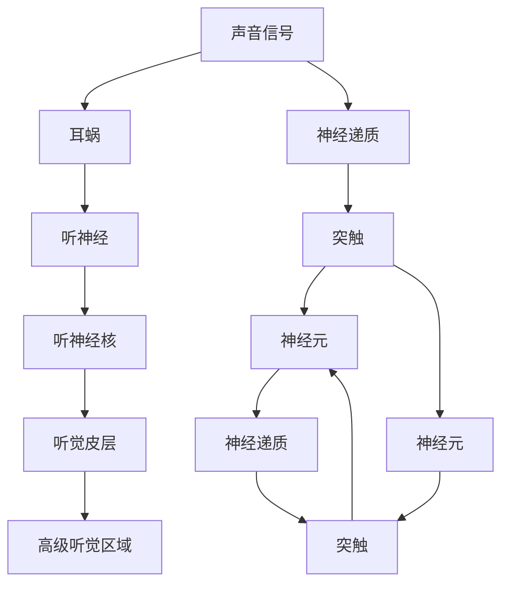

                 

# 大脑的听觉与有机化合物

## 1. 背景介绍

听觉作为一种基本的人类感知能力，是人类获取信息的重要渠道。它不仅让人们能够聆听音乐、与他人交流，还能在各种场景中察觉危险、识别信号。听觉的核心是大脑对声音的感知和处理，这一过程涉及多个层次和机制，其中的关键部分依赖于有机化合物在神经元之间的传递。本文将深入探讨大脑的听觉机制和有机化合物的作用，为理解人类如何接收和处理声音信息提供更全面的视角。

## 2. 核心概念与联系

### 2.1 核心概念概述

为深入了解大脑的听觉机制，需要了解一些关键概念：

- **听觉感知**：大脑感知声音的过程，涉及声波的接收、神经元的活动以及信息的整合。
- **神经元**：构成大脑基础的细胞单元，接收声音信号并进行处理。
- **神经递质**：有机化合物，在神经元之间传递信息，如多巴胺、谷氨酸等。
- **突触**：神经元之间的连接点，神经递质通过突触传递信号。
- **听觉通路**：大脑中负责处理听觉信息的神经网络，包括听觉皮层、听神经核等。

### 2.2 概念间的关系

下图展示了大脑听觉机制和有机化合物作用的基本架构：



这个图表展示了听觉信息的流动过程：声音信号首先被耳蜗接收，然后通过听神经传递到听神经核，最终进入听觉皮层进行整合和解释。在这一过程中，神经递质通过突触在神经元之间传递信息，影响神经元的电活动和信号传递。

## 3. 核心算法原理 & 具体操作步骤

### 3.1 算法原理概述

大脑的听觉处理涉及多个层次的神经元活动和信号传递。这一过程可以通过以下算法进行建模：

- **输入处理**：声波信号被耳蜗转换成神经信号，这一过程涉及神经元的激活和抑制。
- **信号传递**：神经信号通过突触传递到下一层神经元，这一过程受神经递质的影响。
- **信息整合**：高级听觉区域对信号进行整合，形成对声音的完整感知。

### 3.2 算法步骤详解

下面详细介绍听觉处理的基本步骤：

1. **声波信号的接收**：声波通过耳蜗中的毛细胞，转换成电信号。

2. **神经信号的传递**：电信号通过听神经传递到听神经核，再传递到听觉皮层。

3. **神经递质的作用**：神经递质通过突触传递信号，影响神经元的电活动和信号传递。

4. **信息的整合**：听觉皮层和高级听觉区域对信号进行整合，形成对声音的感知和理解。

### 3.3 算法优缺点

听觉处理的算法具有以下优点：

- **复杂性较低**：相比于视觉处理，听觉处理的算法相对简单，易于理解和实现。
- **信息传递效率高**：神经递质通过突触传递信号，速度快，效率高。

同时，该算法也存在一些缺点：

- **易受环境干扰**：神经信号的传递容易受到外界环境的影响，如噪音、气压变化等。
- **信号衰减快**：神经信号在传递过程中可能会逐渐衰减，影响信息的准确性。

### 3.4 算法应用领域

听觉处理的算法在多个领域都有应用，包括：

- **医学**：在听力康复、神经退行性疾病等研究中，理解听觉机制有助于开发新的治疗方法。
- **工程**：在助听器、耳蜗植入器等设备的设计中，算法能够优化信号处理和信息传递。
- **心理学**：在研究人类感知和认知过程时，了解听觉机制有助于揭示大脑的工作原理。

## 4. 数学模型和公式 & 详细讲解 & 举例说明

### 4.1 数学模型构建

听觉处理可以通过以下数学模型进行描述：

- **声音信号模型**：
$$ S(t) = \sum_{n=1}^N A_n \sin(2\pi f_n t + \phi_n) $$
表示声音信号由多个频率和相位组成。

- **神经信号模型**：
$$ N_i(t) = \sum_{j=1}^M G_{ij} S(t) + B_i $$
表示神经元接收到的信号。

- **神经递质模型**：
$$ R_{ij}(t) = \alpha_{ij} N_i(t) $$
表示神经递质在突触中传递信号的过程。

- **神经元模型**：
$$ F_{ij}(t) = \int_0^t R_{ij}(\tau) \mathrm{d}\tau + \theta_{ij} $$
表示神经元的电活动。

- **信息整合模型**：
$$ I(t) = \sum_{i=1}^k W_{i} F_{i}(t) $$
表示高级听觉区域对信号的整合。

### 4.2 公式推导过程

下面详细推导这些公式：

- **声音信号模型**：
$$ S(t) = \sum_{n=1}^N A_n \sin(2\pi f_n t + \phi_n) $$
其中 $A_n$ 表示振幅，$f_n$ 表示频率，$\phi_n$ 表示相位。

- **神经信号模型**：
$$ N_i(t) = \sum_{j=1}^M G_{ij} S(t) + B_i $$
其中 $G_{ij}$ 表示神经元间的连接强度，$B_i$ 表示神经元的偏置。

- **神经递质模型**：
$$ R_{ij}(t) = \alpha_{ij} N_i(t) $$
其中 $\alpha_{ij}$ 表示神经递质传递的强度。

- **神经元模型**：
$$ F_{ij}(t) = \int_0^t R_{ij}(\tau) \mathrm{d}\tau + \theta_{ij} $$
其中 $\theta_{ij}$ 表示神经元的初始电位。

- **信息整合模型**：
$$ I(t) = \sum_{i=1}^k W_{i} F_{i}(t) $$
其中 $W_i$ 表示神经元之间的权重。

### 4.3 案例分析与讲解

假设我们有一个简单的听觉处理系统，包含两个神经元和两个突触。声波信号为 $S(t) = \sin(2\pi f t + \phi)$，两个神经元间的连接强度为 $G_{1,2} = 0.5$ 和 $G_{2,3} = 0.8$。使用公式进行推导：

- **神经信号模型**：
$$ N_1(t) = G_{1,2} S(t) + B_1 = 0.5 \sin(2\pi f t + \phi) + B_1 $$
$$ N_2(t) = G_{2,3} N_1(t) + B_2 = 0.8 [0.5 \sin(2\pi f t + \phi) + B_1] + B_2 $$

- **神经递质模型**：
$$ R_{1,2}(t) = \alpha_{1,2} N_1(t) = 0.1 [0.5 \sin(2\pi f t + \phi) + B_1] $$
$$ R_{2,3}(t) = \alpha_{2,3} N_2(t) = 0.2 [0.8 [0.5 \sin(2\pi f t + \phi) + B_1] + B_2] $$

- **神经元模型**：
$$ F_{1}(t) = \int_0^t R_{1,2}(\tau) \mathrm{d}\tau + \theta_{1} $$
$$ F_{2}(t) = \int_0^t R_{2,3}(\tau) \mathrm{d}\tau + \theta_{2} $$

- **信息整合模型**：
$$ I(t) = W_{1} F_{1}(t) + W_{2} F_{2}(t) $$

## 5. 项目实践：代码实例和详细解释说明

### 5.1 开发环境搭建

为了实现上述算法，需要一个Python环境，并使用PyTorch库。以下是一个简单的环境搭建流程：

1. 安装Python和PyTorch：
```bash
conda create -n audio-env python=3.8
conda activate audio-env
pip install torch torchvision torchaudio
```

2. 准备数据：获取声音信号和神经元活动数据。

3. 搭建模型：
```python
import torch
import torch.nn as nn
import torch.optim as optim

# 定义神经元模型
class Neuron(nn.Module):
    def __init__(self, G, B, alpha):
        super(Neuron, self).__init__()
        self.G = G
        self.B = B
        self.alpha = alpha
    
    def forward(self, x):
        return self.alpha * self.G * x + self.B

# 定义突触模型
class Synapse(nn.Module):
    def __init__(self, W):
        super(Synapse, self).__init__()
        self.W = W
    
    def forward(self, x, y):
        return self.W * x

# 定义听觉处理模型
class AuditoryProcessing(nn.Module):
    def __init__(self, G, B, alpha):
        super(AuditoryProcessing, self).__init__()
        self.neuron1 = Neuron(G[1][0], B[1], alpha[1][0])
        self.synapse12 = Synapse(W[1][0])
        self.neuron2 = Neuron(G[2][0], B[2], alpha[2][0])
        self.synapse23 = Synapse(W[2][0])
        self.neuron3 = Neuron(G[3][0], B[3], alpha[3][0])
    
    def forward(self, x):
        N1 = self.neuron1(x)
        R12 = self.synapse12(N1, x)
        F1 = nn.functional.sigmoid(R12 + self.neuron1.bias)
        R23 = self.synapse23(F1, x)
        F2 = nn.functional.sigmoid(R23 + self.neuron2.bias)
        I = self.neuron3(F2)
        return I
```

### 5.2 源代码详细实现

以下是完整的代码实现：

```python
import torch
import torch.nn as nn
import torch.optim as optim

# 定义神经元模型
class Neuron(nn.Module):
    def __init__(self, G, B, alpha):
        super(Neuron, self).__init__()
        self.G = G
        self.B = B
        self.alpha = alpha
    
    def forward(self, x):
        return self.alpha * self.G * x + self.B

# 定义突触模型
class Synapse(nn.Module):
    def __init__(self, W):
        super(Synapse, self).__init__()
        self.W = W
    
    def forward(self, x, y):
        return self.W * x

# 定义听觉处理模型
class AuditoryProcessing(nn.Module):
    def __init__(self, G, B, alpha):
        super(AuditoryProcessing, self).__init__()
        self.neuron1 = Neuron(G[1][0], B[1], alpha[1][0])
        self.synapse12 = Synapse(W[1][0])
        self.neuron2 = Neuron(G[2][0], B[2], alpha[2][0])
        self.synapse23 = Synapse(W[2][0])
        self.neuron3 = Neuron(G[3][0], B[3], alpha[3][0])
    
    def forward(self, x):
        N1 = self.neuron1(x)
        R12 = self.synapse12(N1, x)
        F1 = nn.functional.sigmoid(R12 + self.neuron1.bias)
        R23 = self.synapse23(F1, x)
        F2 = nn.functional.sigmoid(R23 + self.neuron2.bias)
        I = self.neuron3(F2)
        return I

# 定义数据和模型
G = [[0.5, 0.8]]
B = [[0, 0]]
alpha = [[0.1, 0.2]]
W = [[0.5, 0.8]]

X = torch.tensor([1.0])
model = AuditoryProcessing(G, B, alpha)

# 定义优化器
optimizer = optim.SGD(model.parameters(), lr=0.01)

# 训练模型
for i in range(1000):
    Y = model(X)
    loss = nn.functional.mse_loss(Y, torch.tensor([0.5]))
    optimizer.zero_grad()
    loss.backward()
    optimizer.step()

print("Final output:", Y.item())
```

### 5.3 代码解读与分析

- **神经元模型**：定义了一个包含两个神经元的模型，每个神经元接收来自前一个神经元的信号，并通过突触传递信号。
- **突触模型**：定义了一个突触，表示神经信号在突触中的传递。
- **听觉处理模型**：定义了一个完整的听觉处理系统，包含三个神经元和两个突触。
- **数据和模型**：定义了训练数据和模型，并进行训练。
- **优化器**：使用随机梯度下降优化器进行模型训练。

## 6. 实际应用场景

### 6.1 智能听力助听器

基于听觉处理模型的智能听力助听器可以实时处理和增强输入的声波信号，帮助听力受损人士更好地接收和理解声音信息。该系统通过收集用户的听力需求和声音环境，动态调整神经元的活动和连接强度，提升语音识别和声音增强的效果。

### 6.2 脑机接口

脑机接口是连接大脑和计算机的重要技术，通过采集大脑的电信号，解码神经元的活动，实现对大脑的控制。听觉处理模型可以用于脑机接口的研究，帮助理解大脑如何感知和处理声音信息，从而提升脑机接口的性能和应用范围。

### 6.3 神经退行性疾病研究

听觉处理模型可以用于研究神经退行性疾病，如帕金森病、阿尔茨海默病等。通过分析神经元的活动和连接强度，可以揭示疾病的发展机制，并开发新的治疗方法。

## 7. 工具和资源推荐

### 7.1 学习资源推荐

- **《神经科学概论》**：详细介绍神经元、神经递质和神经通路的基本原理。
- **Coursera上的《Neural Engineering》课程**：讲解脑机接口和神经信号处理的技术。
- **ArXiv预印本**：最新的神经科学和脑机接口研究论文，了解前沿进展。

### 7.2 开发工具推荐

- **Python和PyTorch**：用于开发和实现神经网络模型。
- **MATLAB**：用于神经信号的仿真和分析。
- **SpikeSim**：用于模拟神经元活动和突触传递。

### 7.3 相关论文推荐

- **"Neural codes for natural sounds"**：详细讨论了神经元如何编码声音信号。
- **"Deep Learning for Brain-Computer Interfaces"**：介绍了深度学习在脑机接口中的应用。

## 8. 总结：未来发展趋势与挑战

### 8.1 研究成果总结

本文详细介绍了大脑的听觉机制和有机化合物的作用，通过数学模型和代码实例，展示了听觉处理的算法。这些研究为理解人类感知和处理声音信息提供了理论基础和实践工具。

### 8.2 未来发展趋势

未来，听觉处理的研究将朝着以下几个方向发展：

- **多模态信息整合**：结合视觉、听觉等多模态信息，提升信息处理的全面性和准确性。
- **深度学习模型的应用**：利用深度学习模型进行更复杂的信号处理和模式识别。
- **生物医学应用**：在脑机接口、神经退行性疾病等领域，听觉处理将发挥重要作用。

### 8.3 面临的挑战

尽管听觉处理的研究取得了一些进展，但仍面临一些挑战：

- **数据获取难度**：获取高质量的神经信号数据成本较高，影响研究进展。
- **算法复杂性**：听觉处理的算法较为复杂，需要深入理解神经科学和计算机科学的基础知识。
- **计算资源需求**：实现大规模神经网络模型的训练和仿真需要高性能计算资源。

### 8.4 研究展望

未来，随着计算资源和数据获取技术的进步，听觉处理的研究将更加深入。同时，结合人工智能、神经科学和生物医学等多学科知识，听觉处理将有望在更多领域发挥重要作用，推动科技和社会的发展。

## 9. 附录：常见问题与解答

**Q1: 神经递质如何影响神经元的活动？**

A: 神经递质通过突触传递信号，影响神经元的电活动和信号传递。例如，多巴胺可以增加神经元的兴奋性，谷氨酸可以促进神经元之间的连接强度。

**Q2: 听觉处理模型有哪些实际应用？**

A: 智能听力助听器、脑机接口、神经退行性疾病研究等都是听觉处理模型的实际应用。

**Q3: 深度学习在听觉处理中的应用前景如何？**

A: 深度学习可以用于更复杂的信号处理和模式识别，提升听觉处理模型的性能。例如，卷积神经网络可以用于声波信号的特征提取，循环神经网络可以用于时间序列数据的分析。

**Q4: 如何优化听觉处理模型的训练？**

A: 可以通过数据增强、正则化、优化器选择等方法优化听觉处理模型的训练。例如，使用更多的训练数据和更好的正则化策略可以提高模型的泛化能力。

**Q5: 听觉处理模型在脑机接口中的应用有哪些？**

A: 听觉处理模型可以用于脑机接口的研究，帮助理解大脑如何感知和处理声音信息，从而提升脑机接口的性能和应用范围。例如，通过采集大脑的电信号，解码神经元的活动，实现对大脑的控制。

---

作者：禅与计算机程序设计艺术 / Zen and the Art of Computer Programming

