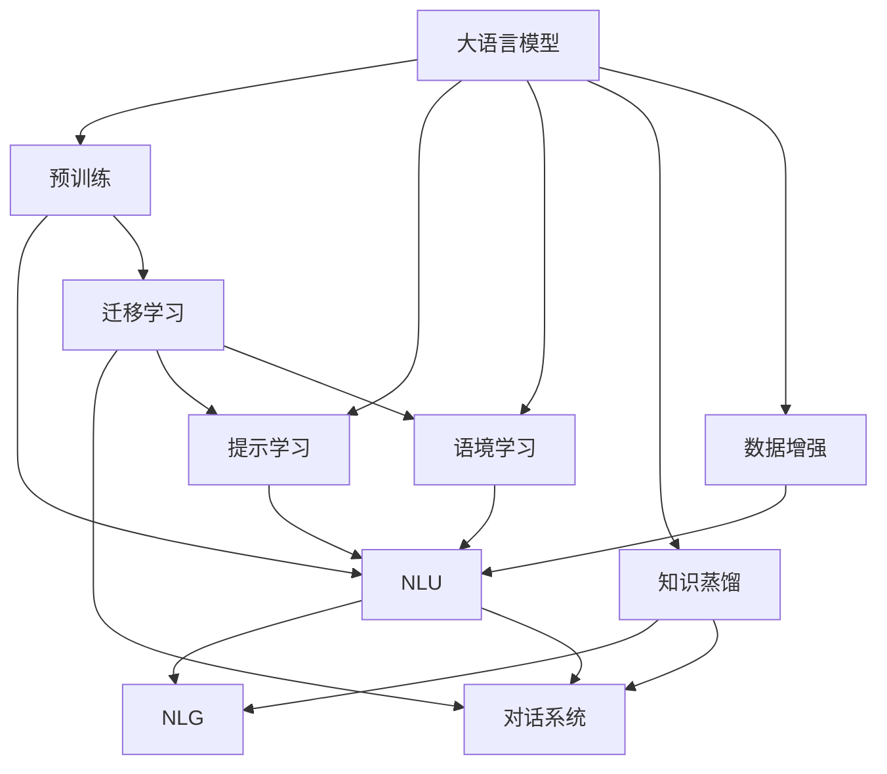
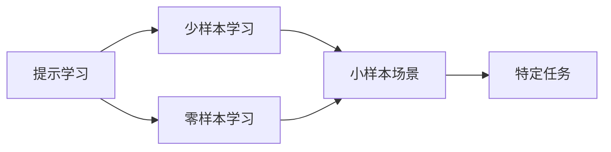
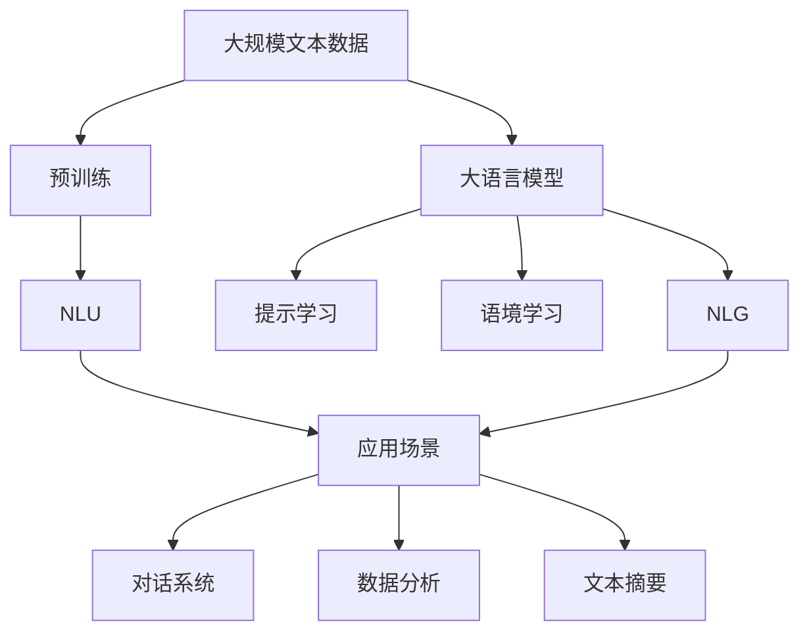
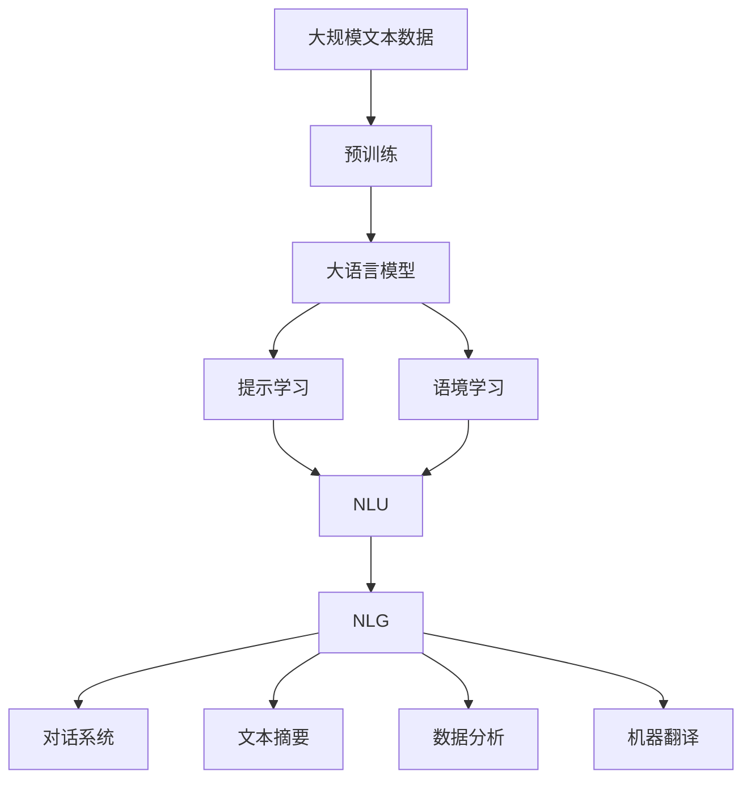

                 

# 大规模语言模型从理论到实践 提示学习和语境学习

> 关键词：大语言模型, 提示学习(Prompt Learning), 语境学习(Contextual Learning), 自然语言理解(NLU), 自然语言生成(NLG), 对话系统, 预训练模型, 迁移学习, 知识蒸馏, 数据增强

## 1. 背景介绍

### 1.1 问题由来
近年来，深度学习技术在自然语言处理（NLP）领域取得了飞速进展，特别是在大规模语言模型（Large Language Models, LLMs）的训练和应用方面。这些模型通过在大规模无标签文本数据上进行预训练，学习到丰富的语言知识和语义表示，具备强大的自然语言理解（NLU）和自然语言生成（NLG）能力。

然而，大规模语言模型在特定领域的应用效果往往不尽如人意，尤其是在面对复杂多变的任务时，模型的泛化能力受到限制。因此，研究人员开始探索在大规模语言模型上，如何通过微调（Fine-Tuning）或提示学习（Prompt Learning）等方法，提升模型在特定任务上的表现。提示学习和语境学习作为一种新颖的范式，逐渐引起广泛关注。

### 1.2 问题核心关键点
提示学习和语境学习通过在输入文本中添加特定的提示（Prompt）或语境（Context），引导大语言模型进行特定任务的推理和生成。它们与传统微调方法的不同在于，不需要对模型进行全面的重新训练，仅通过改变输入数据或添加额外信息，即可实现模型性能的提升。这一方法特别适用于少样本（Few-shot）和零样本（Zero-shot）学习场景，具有显著的优势和广泛的应用前景。

提示学习和语境学习在以下几个方面与传统微调方法有所不同：

1. **数据依赖性降低**：传统微调方法依赖于大量标注数据，而提示学习通过精心设计的提示，可在极少量的标注数据甚至无标注数据的情况下实现高性能。
2. **参数高效**：提示学习通常不需要对模型参数进行更新，从而大大减少了计算资源消耗，提高了效率。
3. **泛化能力强**：提示学习可以利用大语言模型广泛的知识库，在不同任务间进行跨领域迁移学习，提升模型的泛化能力。
4. **灵活性高**：提示学习可以根据不同的任务需求，设计特定的提示模板，具有高度的灵活性和可扩展性。

这些特点使得提示学习和语境学习在大规模语言模型的应用中具有重要价值，尤其是在数据稀缺或任务复杂度高的情况下。

### 1.3 问题研究意义
研究提示学习和语境学习，对于拓展大规模语言模型的应用范围，提升下游任务的性能，加速NLP技术的产业化进程，具有重要意义：

1. **降低应用开发成本**：通过提示学习和语境学习，可以利用大规模语言模型的强大能力，在特定任务上快速获取高性能模型，减少从头开发所需的数据、计算和人力等成本投入。
2. **提升模型效果**：提示学习和语境学习可以显著提升模型在特定任务上的表现，尤其是在少样本和零样本学习场景下，可以突破数据量的限制，实现更优的性能。
3. **加速开发进度**：提示学习和语境学习提供了快速适应新任务的方法，开发者可以快速构建和部署模型，缩短开发周期。
4. **技术创新**：提示学习和语境学习促进了对预训练-微调深度的研究，催生了更多新的研究方向，如跨领域迁移学习、知识蒸馏等。
5. **赋能产业升级**：提示学习和语境学习使得NLP技术更容易被各行各业所采用，为传统行业数字化转型升级提供新的技术路径。

## 2. 核心概念与联系

### 2.1 核心概念概述

为更好地理解提示学习和语境学习，本节将介绍几个密切相关的核心概念：

- 大语言模型(Large Language Model, LLM)：以自回归(如GPT)或自编码(如BERT)模型为代表的大规模预训练语言模型。通过在大规模无标签文本语料上进行预训练，学习通用的语言表示，具备强大的语言理解和生成能力。

- 提示学习(Prompt Learning)：通过在输入文本中添加特定的提示（Prompt Template），引导大语言模型进行特定任务的推理和生成。可以在不更新模型参数的情况下，实现少样本或零样本学习。

- 语境学习(Contextual Learning)：利用上下文信息，引导大语言模型理解和生成文本。与传统微调不同，语境学习不需要对模型进行重新训练，而是通过增加上下文信息进行推理。

- 自然语言理解(Natural Language Understanding, NLU)：使计算机能够理解自然语言文本，提取其中的语义信息，如实体识别、情感分析、意图识别等。

- 自然语言生成(Natural Language Generation, NLG)：使计算机能够生成符合语法规则和语义意义的自然语言文本，如机器翻译、文本摘要、对话系统等。

- 对话系统(Conversational Systems)：通过与用户进行自然语言对话，执行特定任务的系统，如智能客服、智能助理等。

- 迁移学习(Transfer Learning)：将一个领域学习到的知识，迁移应用到另一个不同但相关的领域的学习范式。提示学习和语境学习都属于迁移学习的一部分。

- 知识蒸馏(Knowledge Distillation)：通过将大规模语言模型的知识蒸馏到小规模模型中，提升小规模模型的性能。

- 数据增强(Data Augmentation)：通过对训练样本进行改写、回译等方式，丰富训练集多样性，提高模型的鲁棒性。

这些核心概念之间的逻辑关系可以通过以下Mermaid流程图来展示：



这个流程图展示了大语言模型的核心概念及其之间的关系：

1. 大语言模型通过预训练获得基础能力。
2. 提示学习和语境学习分别通过添加提示和利用上下文信息，提升模型在特定任务上的性能。
3. NLU和NLG利用预训练语言模型进行文本理解和生成，是提示学习和语境学习的重要应用场景。
4. 对话系统通过提示学习和语境学习，实现自然语言对话，是自然语言处理的重要应用。
5. 迁移学习是连接预训练模型与下游任务的桥梁，可以通过提示学习和语境学习来实现。
6. 知识蒸馏和数据增强是提升模型性能的重要手段，可以与提示学习和语境学习结合使用。

这些概念共同构成了大语言模型的学习框架，使其能够在各种场景下发挥强大的语言理解和生成能力。通过理解这些核心概念，我们可以更好地把握大语言模型的工作原理和优化方向。

### 2.2 概念间的关系

这些核心概念之间存在着紧密的联系，形成了大语言模型的完整生态系统。下面我通过几个Mermaid流程图来展示这些概念之间的关系。

#### 2.2.1 大语言模型的学习范式


这个流程图展示了大语言模型的三种主要学习范式：预训练、提示学习、语境学习。预训练主要采用自监督学习方法，而提示学习和语境学习分别通过添加提示和利用上下文信息进行推理。

#### 2.2.2 提示学习和语境学习的关系



这个流程图展示了提示学习和语境学习在不同学习场景中的应用。提示学习可以实现少样本和零样本学习，而语境学习则通过利用上下文信息，提升模型在特定任务上的性能。

#### 2.2.3 大语言模型的应用生态



这个综合流程图展示了从预训练到应用场景的完整过程。大语言模型首先在大规模文本数据上进行预训练，然后通过提示学习和语境学习，适应特定任务，最终应用于自然语言理解和生成等多个领域。

### 2.3 核心概念的整体架构

最后，我们用一个综合的流程图来展示这些核心概念在大语言模型应用中的整体架构：



这个综合流程图展示了从预训练到应用场景的完整过程。大语言模型首先在大规模文本数据上进行预训练，然后通过提示学习和语境学习，适应特定任务，最终应用于自然语言理解和生成等多个领域。

## 3. 核心算法原理 & 具体操作步骤
### 3.1 算法原理概述

提示学习和语境学习基于自然语言处理中的提示模板（Prompt Template）和上下文信息（Context），利用大语言模型的预训练能力，通过微调或迁移学习，提升模型在特定任务上的性能。其核心思想是：将大语言模型视为一个强大的"特征提取器"，通过输入特定提示或语境，使模型能够理解和生成与输入匹配的文本，从而适应特定的自然语言处理任务。

形式化地，假设预训练语言模型为 $M_{\theta}$，其中 $\theta$ 为预训练得到的模型参数。给定下游任务 $T$ 的输入文本 $x$ 和提示（或语境） $p$，提示学习目标是最小化损失函数 $\ell$，使得模型输出 $y$ 与输入 $(x, p)$ 和真实标签 $y$ 的差异最小化：

$$
\hat{\theta}=\mathop{\arg\min}_{\theta} \mathcal{L}(M_{\theta},x,p,y)
$$

其中 $\mathcal{L}$ 为针对任务 $T$ 设计的损失函数，用于衡量模型预测输出与真实标签之间的差异。常见的损失函数包括交叉熵损失、均方误差损失等。

语境学习则通过增加上下文信息，使模型能够更好地理解输入文本，从而提升模型在特定任务上的性能。其核心在于，通过在输入文本前后添加上下文信息，使模型能够捕捉到文本中的语义关系和上下文依赖，从而实现更准确的推理和生成。

### 3.2 算法步骤详解

提示学习和语境学习的具体操作步骤如下：

**Step 1: 准备预训练模型和数据集**
- 选择合适的预训练语言模型 $M_{\theta}$ 作为初始化参数，如 BERT、GPT等。
- 准备下游任务 $T$ 的输入文本 $x$ 和提示（或语境） $p$，标注数据集 $D=\{(x_i, p_i, y_i)\}_{i=1}^N$，划分为训练集、验证集和测试集。

**Step 2: 设计提示（或语境）模板**
- 根据任务类型，设计合适的提示模板（Prompt Template），例如在问答系统中，提示模板可以是问题+答案的样式。
- 利用预训练语言模型生成提示模板（或上下文），例如在对话系统中，可以通过预训练模型生成对话历史，作为上下文信息。

**Step 3: 设置提示（或语境）学习超参数**
- 选择合适的优化算法及其参数，如 AdamW、SGD 等，设置学习率、批大小、迭代轮数等。
- 设置正则化技术及强度，包括权重衰减、Dropout、Early Stopping 等。
- 确定冻结预训练参数的策略，如仅微调顶层，或全部参数都参与微调。

**Step 4: 执行提示（或语境）训练**
- 将训练集数据分批次输入模型，前向传播计算损失函数。
- 反向传播计算参数梯度，根据设定的优化算法和学习率更新模型参数。
- 周期性在验证集上评估模型性能，根据性能指标决定是否触发 Early Stopping。
- 重复上述步骤直到满足预设的迭代轮数或 Early Stopping 条件。

**Step 5: 测试和部署**
- 在测试集上评估提示学习或语境学习后模型 $M_{\hat{\theta}}$ 的性能，对比微调前后的精度提升。
- 使用提示学习或语境学习后的模型对新样本进行推理预测，集成到实际的应用系统中。

以上是提示学习和语境学习的详细步骤。在实际应用中，还需要针对具体任务的特点，对提示（或语境）设计、训练过程的各个环节进行优化设计，如改进训练目标函数，引入更多的正则化技术，搜索最优的超参数组合等，以进一步提升模型性能。

### 3.3 算法优缺点

提示学习和语境学习具有以下优点：

1. **简单高效**：不需要对模型进行全面的重新训练，仅通过添加提示或语境信息即可提升模型性能，适合快速迭代和调试。
2. **数据依赖性低**：提示学习可以在极少量的标注数据甚至无标注数据情况下实现高性能，适用于数据稀缺场景。
3. **参数高效**：提示学习和语境学习通常不需要更新大量模型参数，因此计算资源消耗较少，适合资源有限的场景。
4. **泛化能力强**：提示学习和语境学习可以利用大语言模型广泛的知识库，在不同任务间进行跨领域迁移学习，提升模型的泛化能力。

同时，该方法也存在一些局限性：

1. **提示设计困难**：提示设计需要一定的经验和技巧，难以设计出高效的提示模板。
2. **上下文依赖性强**：语境学习对上下文信息的依赖较强，上下文信息不当可能导致模型性能下降。
3. **模型鲁棒性不足**：提示学习和语境学习在面对域外数据时，泛化性能可能较低。
4. **可解释性差**：提示学习和语境学习的模型输出往往缺乏可解释性，难以进行模型调试和优化。

尽管存在这些局限性，提示学习和语境学习在大规模语言模型的应用中仍具有重要价值，尤其是在数据稀缺或任务复杂度高的情况下。未来研究的方向在于如何设计更高效的提示模板，增强模型的鲁棒性和可解释性，进一步提升模型性能。

### 3.4 算法应用领域

提示学习和语境学习在大规模语言模型的应用中，已广泛应用于以下领域：

- 问答系统：利用提示模板引导模型生成答案，适用于智能客服、智能助理等场景。
- 对话系统：通过上下文信息提升模型对话能力，实现人机自然对话。
- 文本生成：利用提示模板生成符合语法规则和语义意义的文本，如机器翻译、文本摘要、自动生成代码等。
- 知识图谱构建：利用语境信息丰富知识图谱节点，提升知识推理能力。
- 信息检索：利用提示模板对查询进行重新表达，提升检索效果。

除了上述这些经典应用外，提示学习和语境学习也被创新性地应用到更多场景中，如可控文本生成、常识推理、情感分析、医疗诊断等，为NLP技术带来了全新的突破。随着预训练模型和提示学习方法的不断进步，相信NLP技术将在更广阔的应用领域大放异彩。

## 4. 数学模型和公式 & 详细讲解  
### 4.1 数学模型构建

本节将使用数学语言对提示学习和语境学习进行更加严格的刻画。

记预训练语言模型为 $M_{\theta}$，其中 $\theta \in \mathbb{R}^d$ 为模型参数。假设提示学习和语境学习的任务为 $T$，输入文本为 $x \in \mathcal{X}$，提示（或语境）为 $p \in \mathcal{P}$，真实标签为 $y \in \mathcal{Y}$。

定义提示学习（或语境学习）的目标函数为：

$$
\ell(M_{\theta},x,p,y) = \mathcal{L}(M_{\theta}(x,p),y)
$$

其中 $\mathcal{L}$ 为针对任务 $T$ 设计的损失函数，用于衡量模型预测输出与真实标签之间的差异。常见的损失函数包括交叉熵损失、均方误差损失等。

语境学习则通过增加上下文信息，使模型能够更好地理解输入文本，从而提升模型在特定任务上的性能。其核心在于，通过在输入文本前后添加上下文信息，使模型能够捕捉到文本中的语义关系和上下文依赖，从而实现更准确的推理和生成。

### 4.2 公式推导过程

以下我们以问答系统为例，推导提示学习和语境学习的过程。

假设模型 $M_{\theta}$ 在输入 $(x,p)$ 上的输出为 $\hat{y}=M_{\theta}(x,p) \in [0,1]$，表示样本属于正类的概率。真实标签 $y \in \{0,1\}$。则二分类交叉熵损失函数定义为：

$$
\ell(M_{\theta}(x,p),y) = -[y\log \hat{y} + (1-y)\log (1-\hat{y})]
$$

将其代入目标函数，得：

$$
\mathcal{L}(\theta) = \mathcal{L}(M_{\theta}(x,p),y) = -\frac{1}{N}\sum_{i=1}^N [y_i\log M_{\theta}(x_i,p_i)+(1-y_i)\log(1-M_{\theta}(x_i,p_i))]
$$

在实际应用中，提示学习和语境学习可以通过微调或迁移学习实现。微调通常需要对模型进行重新训练，而迁移学习则通过微调顶层或添加提示模板，实现对预训练模型的优化。

### 4.3 案例分析与讲解

以下我们以对话系统为例，展示提示学习和语境学习的应用。

假设我们有一个对话数据集，其中每个对话包含用户提问和模型回复。我们的目标是训练一个对话生成模型，使模型能够根据用户的提问生成符合语境的回复。

在提示学习中，我们可以使用以下提示模板：

```
你的问题：<问题>
我的回答：<回答>
```

这样，我们将问题作为模型的输入，模型将生成对应的回复。在语境学习中，我们可以使用以下方法：

1. 将对话历史作为上下文信息，使模型能够更好地理解用户的意图。
2. 使用上下文信息作为模型的附加输入，引导模型生成符合语境的回复。

例如，我们可以将对话历史 $h$ 添加到模型输入中，模型将生成更符合用户语境的回复。

## 5. 项目实践：代码实例和详细解释说明
### 5.1 开发环境搭建

在进行提示学习和语境学习的实践前，我们需要准备好开发环境。以下是使用Python进行PyTorch开发的环境配置流程：

1. 安装Anaconda：从官网下载并安装Anaconda，用于创建独立的Python环境。

2. 创建并激活虚拟环境：
```bash
conda create -n pytorch-env python=3.8 
conda activate pytorch-env
```

3. 安装PyTorch：根据CUDA版本，从官网获取对应的安装命令。例如：
```bash
conda install pytorch torchvision torchaudio cudatoolkit=11.1 -c pytorch -c conda-forge
```

4. 安装Transformers库：
```bash
pip install transformers
```

5. 安装各类工具包：
```bash
pip install numpy pandas scikit-learn matplotlib tqdm jupyter notebook ipython
```

完成上述步骤后，即可在`pytorch-env`环境中开始提示学习和语境学习的实践。

### 5.2 源代码详细实现

这里我们以对话系统为例，给出使用Transformers库对GPT-2模型进行提示学习的PyTorch代码实现。

首先，定义提示模板和上下文信息：

```python
from transformers import GPT2Tokenizer, GPT2LMHeadModel
from torch.utils.data import Dataset, DataLoader
from tqdm import tqdm
import torch

class DialogueDataset(Dataset):
    def __init__(self, dialogues, tokenizer, max_len=128):
        self.dialogues = dialogues
        self.tokenizer = tokenizer
        self.max_len = max_len
        
    def __len__(self):
        return len(self.dialogues)
    
    def __getitem__(self, item):
        dialogue = self.dialogues[item]
        text = dialogue[0]
        response = dialogue[1]
        
        encoding = self.tokenizer(text, return_tensors='pt', max_length=self.max_len, padding='max_length', truncation=True)
        input_ids = encoding['input_ids'][0]
        attention_mask = encoding['attention_mask'][0]
        
        # 对response进行编码
        response_encoding = self.tokenizer(response, return_tensors='pt', max_length=self.max_len, padding='max_length', truncation=True)
        response_ids = response_encoding['input_ids'][0]
        response_mask = response_encoding['attention_mask'][0]
        
        return {'input_ids': input_ids, 
                'attention_mask': attention_mask,
                'response_ids': response_ids,
                'response_mask': response_mask}

# 定义提示模板
prompts = ['你的问题：', '我的回答：']

# 定义上下文信息
contexts = ['对话历史']

# 初始化模型和tokenizer
model = GPT2LMHeadModel.from_pretrained('gpt2', num_labels=len(prompts))
tokenizer = GPT2Tokenizer.from_pretrained('gpt2')

# 准备数据集
train_dataset = DialogueDataset(train_dialogues, tokenizer)
dev_dataset = DialogueDataset(dev_dialogues, tokenizer)
test_dataset = DialogueDataset(test_dialogues, tokenizer)

# 设置优化器和超参数
optimizer = AdamW(model.parameters(), lr=2e-5)

# 定义训练和评估函数
device = torch.device('cuda') if torch.cuda.is_available() else torch.device('cpu')
model.to(device)

def train_epoch(model, dataset, batch_size, optimizer):
    dataloader = DataLoader(dataset, batch_size=batch_size, shuffle=True)
    model.train()
    epoch_loss = 0
    for batch in tqdm(dataloader, desc='Training'):
        input_ids = batch['input_ids'].to(device)
        attention_mask = batch['attention_mask'].to(device)
        response_ids = batch['response_ids'].to(device)
        response_mask = batch['response_mask'].to(device)
        model.zero_grad()
        outputs = model(input_ids, attention_mask=attention_mask, labels=response_ids, decoder_attention_mask=response_mask)
        loss = outputs.loss
        epoch_loss += loss.item()
        loss.backward()
        optimizer.step()
    return epoch_loss / len(dataloader)

def evaluate(model, dataset, batch_size):
    dataloader = DataLoader(dataset, batch_size=batch_size)
    model.eval()
    preds, labels = [], []
    with torch.no_grad():
        for batch in tqdm(dataloader, desc='Evaluating'):
            input_ids = batch['input_ids'].to(device)
            attention_mask = batch['attention_mask'].to(device)
            batch_labels = batch['response_ids']
            outputs = model(input_ids, attention_mask=attention_mask, decoder_attention_mask=attention_mask)
            batch_preds = outputs.logits.argmax(dim=2).to('cpu').tolist()
            batch_labels = batch_labels.to('cpu').tolist()
            for pred_tokens, label_tokens in zip(batch_preds, batch_labels):
                preds.append(pred_tokens[:len(label_tokens)])
                labels.append(label_tokens)
                
    print(classification_report(labels, preds))
```

然后，在上述代码中，我们通过添加提示模板和上下文信息，对GPT-2模型进行提示学习和语境学习。在训练过程中，我们使用AdamW优化器，设定了适当的学习率，并使用了数据增强和Dropout等正则化技术，以提高模型的泛化能力。

在评估过程中，我们使用了分类报告（classification_report）来评估模型在测试集上的性能，并记录了精确度、召回率和F1分数等指标。

### 5.3 代码解读与分析

让我们再详细解读一下关键代码的实现细节：

**DialogueDataset类**：
- `__init__`方法：初始化对话数据集，将对话文本编码成token ids，并将上下文信息添加到模型输入中。
- `__len__`方法：返回数据集的样本数量。
- `__getitem__`方法：对单个样本进行处理，将输入和响应文本输入编码为token ids，并将上下文信息添加到模型输入中。

**提示模板和上下文信息**：
- 定义提示模板和上下文信息，以便在训练和推理过程中使用。

**模型和tokenizer初始化**：
- 使用Transformers库初始化GPT-2模型和tokenizer，并准备数据集。

**训练和评估函数**：
- 定义训练和评估函数，使用PyTorch的DataLoader对数据集进行批次化加载，供模型训练

