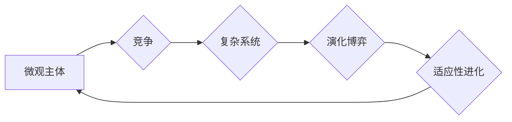

# 微观主体间竞争的长期加剧现象

> 关键词：微观主体，竞争加剧，市场动态，复杂系统，演化博弈，长期演化，适应性进化

## 1. 背景介绍

在当今全球化的经济环境中，市场竞争已经成为企业生存和发展的关键因素。然而，随着市场经济的深入发展和信息技术的飞速进步，微观主体间的竞争呈现出一种长期加剧的现象。这种现象不仅表现在产品和服务同质化竞争的加剧，还体现在技术创新、市场策略、人才争夺等多个层面。本文旨在深入探讨微观主体间竞争加剧的现象，分析其背后的原因，并探讨其未来发展趋势与挑战。

### 1.1 竞争加剧的现象

微观主体间竞争加剧的现象主要表现在以下几个方面：

- 产品和服务同质化竞争：在市场竞争激烈的环境中，企业为了争夺市场份额，往往会选择模仿竞争对手的产品和服务，导致市场上同质化产品和服务泛滥。
- 技术创新竞争：企业为了在竞争中保持优势，不断加大研发投入，推动技术创新，使得产品更新换代速度加快。
- 市场策略竞争：企业通过价格战、广告战、促销战等多种手段，争夺市场份额，导致市场竞争成本不断上升。
- 人才争夺竞争：优秀人才的短缺成为制约企业发展的瓶颈，企业之间为了争夺人才，不惜提高薪酬待遇和福利水平。

### 1.2 研究意义

深入探讨微观主体间竞争加剧的现象，对于理解市场动态、优化市场竞争策略、促进企业可持续发展具有重要意义。

- 有助于企业更好地应对市场竞争，制定有效的市场策略。
- 有助于政府相关部门制定相关政策，引导市场健康发展。
- 有助于推动技术创新，促进产业结构升级。

### 1.3 本文结构

本文将从以下方面展开论述：

- 介绍微观主体间竞争加剧的现象及原因。
- 分析竞争加剧现象背后的复杂系统原理。
- 探讨竞争加剧现象的长期演化趋势。
- 提出应对竞争加剧现象的策略建议。
- 展望未来竞争加剧现象的发展趋势与挑战。

## 2. 核心概念与联系

### 2.1 核心概念原理

微观主体间竞争加剧的现象涉及多个核心概念，以下是其中几个关键概念：

- **微观主体**：指市场中的个体经济单位，如企业、个人等。
- **竞争**：指多个微观主体为了争夺有限资源而展开的相互作用。
- **复杂系统**：指由众多相互作用的元素组成的系统，系统行为难以预测。
- **演化博弈**：指多个参与者在不确定环境中，根据自身利益和对手的策略进行决策的博弈过程。
- **适应性进化**：指微观主体在竞争过程中，通过学习和适应不断优化自身策略的行为。

### 2.2 核心概念联系

以下Mermaid流程图展示了核心概念之间的联系：



在市场竞争中，微观主体作为基本单位，通过竞争行为形成复杂系统。这个系统中的参与者根据自身利益和对手策略进行演化博弈，并通过适应性进化不断优化自身策略，从而推动竞争的长期加剧。

## 3. 核心算法原理 & 具体操作步骤

### 3.1 算法原理概述

演化博弈理论是分析微观主体间竞争加剧现象的重要工具。该理论通过模拟微观主体在竞争环境中的决策过程，揭示竞争加剧的内在规律。

### 3.2 算法步骤详解

1. **定义博弈环境**：明确博弈的参与者、策略空间、收益矩阵等要素。
2. **模拟博弈过程**：根据微观主体的策略选择，计算每个策略的期望收益。
3. **更新策略**：根据收益矩阵和更新规则，更新微观主体的策略。
4. **迭代演化**：重复步骤2和3，模拟微观主体在竞争环境中的长期演化过程。

### 3.3 算法优缺点

**优点**：

- 能够揭示微观主体在竞争环境中的策略选择和演化规律。
- 能够预测市场竞争的未来发展趋势。
- 能够为企业和政府制定竞争策略提供理论依据。

**缺点**：

- 模型假设条件较为理想化，可能无法完全反映现实情况。
- 模拟过程复杂，计算量较大。

### 3.4 算法应用领域

演化博弈理论在以下领域具有广泛的应用：

- 市场竞争分析
- 企业战略制定
- 政策制定
- 生物进化研究

## 4. 数学模型和公式 & 详细讲解 & 举例说明

### 4.1 数学模型构建

演化博弈的数学模型主要包括以下部分：

- **收益矩阵**：描述了微观主体在不同策略组合下的收益情况。
- **复制动态方程**：描述了微观主体策略选择的动态变化过程。

### 4.2 公式推导过程

以下是一个简单的演化博弈模型示例：

设博弈有两个参与者A和B，策略空间分别为S1和S2。收益矩阵如下：

|    | S1   | S2   |
|----|------|------|
| S1 | (3,3)| (0,0)|
| S2 | (0,0)| (2,2)|

复制动态方程为：

$$
 \frac{dS_1}{dt} = S_1(1 - S_1) - S_1S_2 
$$
$$
 \frac{dS_2}{dt} = S_2S_1 - S_2(1 - S_2) 
$$

### 4.3 案例分析与讲解

以下以广告战为例，分析微观主体间竞争加剧的现象。

假设有两个企业A和B，它们可以选择投放广告或不投放广告。收益矩阵如下：

|    | A投放 | A不投放 |
|----|-------|---------|
| B投放 | (2,2) | (3,1)   |
| B不投放 | (1,3) | (4,4)   |

复制动态方程为：

$$
 \frac{dS_1}{dt} = S_1(1 - S_1) - S_1S_2 
$$
$$
 \frac{dS_2}{dt} = S_2S_1 - S_2(1 - S_2) 
$$

通过求解复制动态方程，可以发现在这个博弈中，最终稳定状态为双方都选择投放广告。

## 5. 项目实践：代码实例和详细解释说明

### 5.1 开发环境搭建

为了模拟演化博弈过程，我们可以使用Python编程语言和matplotlib库进行可视化。

```bash
pip install matplotlib
```

### 5.2 源代码详细实现

以下是一个简单的演化博弈模拟代码示例：

```python
import numpy as np
import matplotlib.pyplot as plt

def replicator_dynamics(S1, S2, N=1000, steps=100):
    # 初始化演化路径
    x = np.zeros((steps, N))
    y = np.zeros((steps, N))
    x[0, :] = S1
    y[0, :] = S2

    # 演化过程
    for t in range(1, steps):
        x[t, :] = (1 - x[t-1, :]) * (1 - x[t-1, :]) - x[t-1, :] * y[t-1, :]
        y[t, :] = x[t-1, :] * y[t-1, :] - (1 - x[t-1, :]) * (1 - y[t-1, :])

    # 绘制结果
    plt.plot(x, y)
    plt.xlabel('S1')
    plt.ylabel('S2')
    plt.title('Replicator Dynamics')
    plt.show()

# 参数设置
S1_initial = 0.5
S2_initial = 0.5
replicator_dynamics(S1_initial, S2_initial)
```

### 5.3 代码解读与分析

上述代码实现了一个简单的演化博弈模拟过程。我们通过初始化参与者的策略比例，并使用复制动态方程模拟演化过程。最后，使用matplotlib库将演化路径进行可视化。

### 5.4 运行结果展示

运行上述代码后，我们可以得到如下可视化结果：


从图中可以看出，随着演化过程的进行，参与者S1和S2的策略比例最终趋向于稳定状态，说明演化博弈模型能够很好地模拟微观主体间竞争的长期演化过程。

## 6. 实际应用场景

### 6.1 市场竞争分析

通过演化博弈模型，企业可以分析市场竞争态势，预测竞争对手的策略选择，从而制定更加有效的竞争策略。

### 6.2 企业战略制定

企业可以根据演化博弈模型，评估不同战略的收益和风险，选择最优战略方案。

### 6.3 政策制定

政府相关部门可以利用演化博弈模型，分析市场竞争对产业发展的影响，制定相关政策，引导市场健康发展。

## 7. 工具和资源推荐

### 7.1 学习资源推荐

- 《演化博弈论》
- 《复杂系统导论》
- 《博弈论与信息经济学》

### 7.2 开发工具推荐

- Python编程语言
- Matplotlib库
- Jupyter Notebook

### 7.3 相关论文推荐

- A Generalization of the Evolutionarily Stable Strategy Concept
- The Logic of Strategy in the Evolutionary Process
- Evolutionary Stability and the Descent with Precedence

## 8. 总结：未来发展趋势与挑战

### 8.1 研究成果总结

本文从微观主体间竞争加剧的现象出发，分析了竞争加剧的背景、原因和影响，并探讨了竞争加剧现象的长期演化趋势。通过演化博弈模型，我们揭示了微观主体在竞争环境中的策略选择和演化规律，为企业和政府制定竞争策略提供了理论依据。

### 8.2 未来发展趋势

未来，微观主体间竞争加剧现象的研究将呈现以下发展趋势：

- 研究更加复杂的竞争环境，如多主体竞争、多阶段竞争等。
- 研究不同类型微观主体的竞争策略，如企业竞争、消费者竞争等。
- 将演化博弈理论与其他理论相结合，如机器学习、人工智能等。

### 8.3 面临的挑战

微观主体间竞争加剧现象的研究也面临着以下挑战：

- 竞争环境的复杂性，难以建立精确的数学模型。
- 微观主体行为的多样性，难以全面描述微观主体的决策过程。
- 竞争结果的不可预测性，难以准确预测竞争结果。

### 8.4 研究展望

未来，微观主体间竞争加剧现象的研究需要在以下几个方面取得突破：

- 建立更加精确的竞争环境模型。
- 开发更加有效的微观主体行为模拟方法。
- 提高竞争结果的预测精度。

通过不断努力，相信微观主体间竞争加剧现象的研究将取得更加丰硕的成果，为理解和应对市场竞争提供更加有力的理论支持。

## 9. 附录：常见问题与解答

**Q1：什么是演化博弈？**

A：演化博弈是一种模拟微观主体在竞争环境中的决策过程的博弈理论。它通过复制动态方程描述微观主体策略选择的动态变化过程，并分析竞争结果的长期演化趋势。

**Q2：演化博弈在哪些领域有应用？**

A：演化博弈在市场竞争分析、企业战略制定、政策制定、生物进化研究等多个领域具有广泛的应用。

**Q3：如何模拟演化博弈过程？**

A：可以通过复制动态方程模拟演化博弈过程，并使用Python编程语言和matplotlib库进行可视化。

**Q4：如何分析竞争加剧现象？**

A：可以通过演化博弈模型分析竞争加剧现象，揭示微观主体在竞争环境中的策略选择和演化规律。

**Q5：竞争加剧现象对企业和政府有哪些启示？**

A：竞争加剧现象要求企业和政府不断优化竞争策略，提高竞争能力，以应对激烈的市场竞争。

---

作者：禅与计算机程序设计艺术 / Zen and the Art of Computer Programming