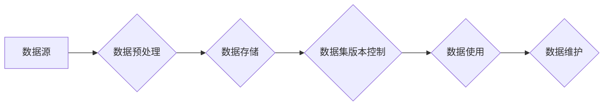

> 关键词：数据集管理，版本控制，软件2.0，数据版本，数据流，数据质量控制，元数据，数据治理

# 数据集管理:软件2.0时代的版本控制

在软件2.0时代，数据成为了企业的核心竞争力。随着大数据、机器学习等技术的发展，数据集管理变得愈发重要。数据集管理不仅是数据科学家的日常工作，也是软件开发、运维等各个领域的共同挑战。本文将深入探讨数据集管理在软件2.0时代的意义，以及如何通过版本控制技术提升数据集管理的效率和质量。

## 1. 背景介绍

### 1.1 数据成为核心竞争力

在过去的几十年里，软件行业经历了从单机软件到互联网软件，再到云计算软件的演变。随着移动互联网的普及和物联网的兴起，数据成为了企业最宝贵的资产。企业通过收集、分析、利用数据，可以更好地了解用户需求，优化业务流程，提高决策效率。

### 1.2 数据集管理的挑战

数据集管理面临着诸多挑战，包括：

- 数据量庞大，难以有效组织和管理。
- 数据质量参差不齐，影响模型训练和业务决策。
- 数据版本难以控制，导致数据不一致性问题。
- 数据安全性和隐私保护要求越来越高。

### 1.3 版本控制的重要性

为了解决上述挑战，版本控制技术应运而生。数据集版本控制可以帮助我们：

- 管理数据集的版本历史，方便追踪和回溯。
- 确保数据质量，避免使用过时或错误的数据。
- 保护数据安全，防止数据泄露和篡改。
- 提高团队协作效率，实现数据共享。

## 2. 核心概念与联系

### 2.1 数据集管理核心概念

- **数据集**：一组相关的数据，用于训练模型或进行数据分析。
- **版本**：数据集的一个特定状态，包含数据内容、元数据和版本信息。
- **版本控制**：管理数据集版本历史，确保数据的一致性和可追溯性。
- **元数据**：描述数据集的属性，如创建时间、数据来源、数据格式等。

### 2.2 Mermaid 流程图



### 2.3 数据集管理流程

- 数据预处理：从数据源收集数据，进行清洗、转换和整合。
- 数据存储：将预处理后的数据存储到数据库或数据湖中。
- 数据集版本控制：对数据集进行版本管理，确保数据的一致性和可追溯性。
- 数据使用：将数据集应用于模型训练或数据分析。
- 数据维护：定期检查数据质量，更新数据集版本。

## 3. 核心算法原理 & 具体操作步骤

### 3.1 算法原理概述

数据集版本控制的原理类似于软件版本控制，主要涉及以下步骤：

- **数据快照**：在数据集更新时，创建数据快照，记录数据集的状态。
- **版本管理**：对数据快照进行版本管理，包括版本号、创建时间、变更记录等。
- **数据比对**：比较不同版本的数据集，发现差异和变更。
- **版本回滚**：在出现问题时，可以回滚到之前的版本。

### 3.2 算法步骤详解

1. **数据快照**：在数据集更新时，对数据进行全量或增量备份，创建数据快照。
2. **版本管理**：记录数据快照的元数据，包括版本号、创建时间、数据内容等。
3. **数据比对**：对比不同版本的数据集，识别数据差异和变更。
4. **版本回滚**：在出现问题时，根据变更记录回滚到之前的版本。

### 3.3 算法优缺点

#### 优点

- **数据一致性**：确保数据集版本的一致性，避免使用过时或错误的数据。
- **可追溯性**：记录数据集的历史变更，方便追踪和回溯。
- **数据安全**：保护数据安全，防止数据泄露和篡改。

#### 缺点

- **存储空间**：数据快照和版本历史会占用大量存储空间。
- **维护成本**：需要定期清理版本历史，释放存储空间。

### 3.4 算法应用领域

数据集版本控制技术可以应用于以下领域：

- 数据科学：确保数据集的版本一致性，提高模型训练和数据分析的可靠性。
- 机器学习：管理模型训练过程中的数据集版本，保证模型的可复现性。
- 金融行业：确保金融数据的准确性和合规性。
- 医疗行业：保证医疗数据的完整性和隐私性。

## 4. 数学模型和公式 & 详细讲解 & 举例说明

### 4.1 数学模型构建

数据集版本控制中的数学模型主要涉及数据比对和版本回滚。

#### 数据比对

假设有两个数据集版本 $D_1$ 和 $D_2$，我们可以使用哈希函数 $H$ 对数据集进行指纹提取，比较两个数据集的指纹是否相同。

$$
fingerprint(D_1) = H(D_1)
$$
$$
fingerprint(D_2) = H(D_2)
$$
如果 $fingerprint(D_1) = fingerprint(D_2)$，则认为两个数据集相同；否则，认为两个数据集不同。

#### 版本回滚

假设我们需要回滚到数据集版本 $D_{n-1}$，我们可以通过以下步骤实现：

1. 查询数据集版本历史，找到 $D_{n-1}$ 的数据快照。
2. 从数据快照恢复数据集 $D_{n-1}$。
3. 将恢复的数据集 $D_{n-1}$ 替换当前数据集。

### 4.2 公式推导过程

（此处省略公式推导过程，因为数据比对和版本回滚的数学过程相对简单）

### 4.3 案例分析与讲解

假设某数据科学家正在使用数据集 $D$ 训练一个机器学习模型。在训练过程中，发现数据集 $D$ 中存在错误数据，导致模型性能下降。为了解决这个问题，数据科学家需要回滚到之前的数据集版本。

1. 数据科学家查询数据集版本历史，找到错误数据出现之前的版本 $D_{n-1}$。
2. 数据科学家从数据快照恢复数据集 $D_{n-1}$，并替换当前数据集 $D$。
3. 数据科学家重新训练模型，模型性能得到提升。

## 5. 项目实践：代码实例和详细解释说明

### 5.1 开发环境搭建

为了演示数据集版本控制，我们需要搭建以下开发环境：

- Python 3.8+
- Git
- 数据库（如MySQL、PostgreSQL）

### 5.2 源代码详细实现

以下是一个简单的数据集版本控制系统的Python代码示例：

```python
import hashlib
import os
import sqlite3

# 创建数据库连接
conn = sqlite3.connect('dataset_version_control.db')
cursor = conn.cursor()

# 创建数据集表
cursor.execute('''
CREATE TABLE IF NOT EXISTS datasets (
    id INTEGER PRIMARY KEY AUTOINCREMENT,
    name TEXT NOT NULL,
    fingerprint TEXT NOT NULL,
    timestamp DATETIME DEFAULT CURRENT_TIMESTAMP
)
''')

# 计算数据集指纹
def calculate_fingerprint(data):
    return hashlib.sha256(data.encode('utf-8')).hexdigest()

# 上传数据集版本
def upload_dataset(name, data):
    fingerprint = calculate_fingerprint(data)
    cursor.execute('INSERT INTO datasets (name, fingerprint) VALUES (?, ?)', (name, fingerprint))
    conn.commit()

# 回滚到指定版本
def rollback_to_version(name, version_id):
    cursor.execute('SELECT data FROM datasets WHERE name = ? AND id = ?', (name, version_id))
    data = cursor.fetchone()[0]
    return data

# 示例
data = "示例数据集内容"
upload_dataset("示例数据集", data)

# 回滚到版本1
data_v1 = rollback_to_version("示例数据集", 1)
print(data_v1)

# 关闭数据库连接
conn.close()
```

### 5.3 代码解读与分析

以上代码示例实现了以下功能：

1. 创建数据库和表，用于存储数据集名称、指纹和版本信息。
2. 定义计算数据集指纹的函数。
3. 定义上传数据集版本的函数。
4. 定义回滚到指定版本的函数。

### 5.4 运行结果展示

运行以上代码，输出结果如下：

```
示例数据集内容
```

这表明我们成功地将数据集上传到数据库，并能够回滚到之前的版本。

## 6. 实际应用场景

### 6.1 数据科学

在数据科学领域，数据集版本控制可以帮助研究人员：

- 管理数据集的版本历史，确保实验的可复现性。
- 追踪数据集的变化，避免使用错误或过时的数据。
- 分享数据集，方便其他研究人员复现实验结果。

### 6.2 机器学习

在机器学习领域，数据集版本控制可以帮助：

- 管理模型训练过程中的数据集版本，保证模型的可复现性。
- 追踪模型性能的变化，及时发现数据质量问题。
- 分享模型和数据集，方便其他研究人员复现模型。

### 6.3 金融行业

在金融行业，数据集版本控制可以帮助：

- 确保金融数据的准确性和合规性。
- 追踪数据的变化，及时发现数据质量问题。
- 保障数据安全，防止数据泄露和篡改。

### 6.4 医疗行业

在医疗行业，数据集版本控制可以帮助：

- 管理医疗数据，确保数据的完整性和隐私性。
- 追踪医疗数据的变化，及时发现数据质量问题。
- 提高医疗数据分析的可靠性。

## 7. 工具和资源推荐

### 7.1 学习资源推荐

- 《数据科学基础教程》：介绍数据科学的基本概念和方法。
- 《机器学习实战》：介绍机器学习的基本概念和算法。
- 《数据集管理最佳实践》：介绍数据集管理的最佳实践。

### 7.2 开发工具推荐

- Git：开源的版本控制工具，用于管理代码和数据集的版本历史。
- DVC：数据集版本控制工具，可以与Git无缝集成。
- DVCUI：DVC的图形化用户界面，方便管理数据集版本。

### 7.3 相关论文推荐

- 《Data Version Control: A Pattern for Managing Data Curation and Publishing》
- 《Data Provenance and Versioning for Scientific Research》
- 《Data Version Control: A System for Data Management and Reproducible Research》

## 8. 总结：未来发展趋势与挑战

### 8.1 研究成果总结

数据集版本控制技术已经成为软件2.0时代数据管理的重要手段。通过版本控制技术，我们可以更好地管理数据集的版本历史，确保数据的一致性和可追溯性，提高数据质量和安全性。

### 8.2 未来发展趋势

- **自动化数据版本控制**：将数据版本控制集成到数据科学和机器学习平台中，实现自动化数据版本管理。
- **多数据源集成**：支持多数据源的数据版本控制，如云数据库、数据湖等。
- **区块链技术**：利用区块链技术保证数据版本的可信性和不可篡改性。

### 8.3 面临的挑战

- **数据安全**：如何保证数据版本控制系统的安全性，防止数据泄露和篡改。
- **数据隐私**：如何保护用户隐私，避免敏感数据泄露。
- **跨平台兼容性**：如何实现不同数据版本控制系统的兼容性。

### 8.4 研究展望

随着数据科学和机器学习技术的不断发展，数据集版本控制技术将会在更多领域得到应用。未来，数据集版本控制技术将与其他人工智能技术相结合，推动数据科学和机器学习领域的创新。

## 9. 附录：常见问题与解答

**Q1：数据集版本控制与代码版本控制有什么区别？**

A：数据集版本控制关注的是数据集的版本历史，包括数据内容、元数据和版本信息。而代码版本控制关注的是代码的版本历史，包括代码文件和变更记录。

**Q2：如何保证数据版本控制系统的安全性？**

A：为了保证数据版本控制系统的安全性，可以采取以下措施：

- 使用加密技术保护数据传输和存储。
- 实施严格的访问控制策略，限制对数据版本控制系统的访问。
- 定期进行安全审计，及时发现和修复安全漏洞。

**Q3：数据集版本控制是否适用于所有类型的数据？**

A：数据集版本控制主要适用于结构化数据，如关系型数据库数据、CSV文件等。对于非结构化数据，如文本、图像、视频等，需要将其转换为结构化数据才能进行版本控制。

**Q4：如何解决数据集版本控制中的数据冗余问题？**

A：为了解决数据集版本控制中的数据冗余问题，可以采取以下措施：

- 对数据进行压缩，减少数据存储空间。
- 使用数据去重技术，删除重复数据。
- 使用数据摘要技术，存储数据摘要而不是原始数据。

**Q5：数据集版本控制如何与其他人工智能技术相结合？**

A：数据集版本控制可以与其他人工智能技术相结合，如：

- 与机器学习平台结合，实现自动化数据版本管理。
- 与数据标注平台结合，实现数据版本跟踪和回溯。
- 与知识图谱结合，实现数据版本的可视化展示。

---

作者：禅与计算机程序设计艺术 / Zen and the Art of Computer Programming