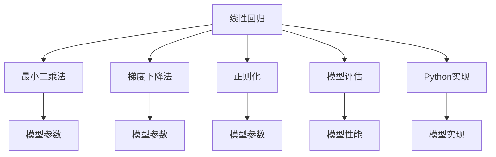

                 

# 线性回归(Linear Regression) - 原理与代码实例讲解

> 关键词：线性回归,最小二乘法,梯度下降法,过拟合,正则化,模型评估,Python实现

## 1. 背景介绍

线性回归是一种常见的统计学和机器学习方法，用于建立一个线性模型来预测数值型变量的值。在机器学习中，线性回归通常用于回归问题，即预测一个连续值。线性回归模型基于一个简单的假设：输入特征与输出变量之间存在线性关系。

### 1.1 问题由来
在许多实际应用中，我们希望通过训练模型来预测数值型变量的值，例如房价预测、销售预测等。传统的线性回归模型是解决这类问题的有力工具。然而，随着数据量的增加，线性回归模型的训练变得更加复杂，模型性能也可能受到过拟合和数据噪声的影响。

### 1.2 问题核心关键点
线性回归的核心问题是找到一个最优的线性模型，使得模型能够尽可能地拟合训练数据，并在新的测试数据上具有稳定的预测能力。模型的评估通常使用均方误差（MSE）和决定系数（R²）等指标。

## 2. 核心概念与联系

### 2.1 核心概念概述
- 线性回归（Linear Regression）：一种用于预测连续变量的线性模型，假设输入特征与输出变量之间存在线性关系。
- 最小二乘法（Least Squares Method）：用于求解线性回归模型的参数，通过最小化残差平方和来确定最佳的模型参数。
- 梯度下降法（Gradient Descent）：一种优化算法，通过迭代更新模型参数，最小化损失函数。
- 过拟合（Overfitting）：模型在训练集上表现良好，但在测试集上表现较差的现象。
- 正则化（Regularization）：通过添加惩罚项来防止过拟合，常见方法包括L1正则化和L2正则化。
- 模型评估（Model Evaluation）：使用均方误差、决定系数等指标来评估模型的预测性能。
- Python实现：使用Scikit-learn等Python库，可以方便地实现线性回归模型的训练和评估。

### 2.2 概念间的关系
这些概念之间存在着紧密的联系，共同构成了线性回归模型的基础。最小二乘法用于求解模型参数，梯度下降法用于更新模型参数，正则化用于防止过拟合，模型评估用于评估模型性能，而Python实现则是实现这些方法的工具。



通过这个流程图，我们可以更清晰地理解线性回归模型中各个概念之间的关系和作用。

## 3. 核心算法原理 & 具体操作步骤
### 3.1 算法原理概述
线性回归模型的目标是最小化残差平方和（Residual Sum of Squares，RSS），即：

$$
RSS = \sum_{i=1}^n(y_i - \hat{y}_i)^2
$$

其中，$y_i$ 是第 $i$ 个样本的真实值，$\hat{y}_i$ 是第 $i$ 个样本的预测值。最小化 RSS 的过程就是求解线性回归模型的参数 $\beta_0, \beta_1, \cdots, \beta_p$，使得预测值与真实值尽可能接近。

### 3.2 算法步骤详解
以下是线性回归模型的完整步骤：

1. 数据准备：准备训练数据集，包括输入特征 $x_i$ 和输出变量 $y_i$。
2. 模型构建：使用最小二乘法求解模型参数 $\beta_0, \beta_1, \cdots, \beta_p$，其中 $\beta_0$ 是截距，$\beta_1, \cdots, \beta_p$ 是特征系数。
3. 模型训练：使用梯度下降法最小化 RSS，更新模型参数。
4. 模型评估：使用均方误差、决定系数等指标评估模型性能。

### 3.3 算法优缺点
线性回归模型的优点包括：
- 简单易懂，易于实现。
- 可以处理高维特征，适用于多种应用场景。
- 具有良好的数学理论基础，可以推导出一些统计学性质。

缺点包括：
- 对于非线性关系，模型无法捕捉。
- 容易受到异常值的影响。
- 需要手动选择特征，缺乏自动化的特征选择能力。

### 3.4 算法应用领域
线性回归广泛应用于以下领域：
- 金融预测：例如股票价格预测、贷款违约预测等。
- 工业控制：例如机器故障预测、生产率预测等。
- 医学研究：例如疾病预测、疗效评估等。
- 市场营销：例如销售预测、客户满意度预测等。

## 4. 数学模型和公式 & 详细讲解
### 4.1 数学模型构建
线性回归模型的数学模型为：

$$
y_i = \beta_0 + \beta_1x_{i1} + \cdots + \beta_px_{ip} + \epsilon_i
$$

其中，$x_{ij}$ 是第 $i$ 个样本的第 $j$ 个特征，$\beta_j$ 是第 $j$ 个特征的系数，$\epsilon_i$ 是误差项。

### 4.2 公式推导过程
根据最小二乘法的定义，我们希望最小化 RSS，即：

$$
\min_{\beta_0, \beta_1, \cdots, \beta_p} RSS = \sum_{i=1}^n(y_i - \beta_0 - \beta_1x_{i1} - \cdots - \beta_px_{ip})^2
$$

为了求解上述优化问题，我们可以将其转化为求解梯度为零的点，即：

$$
\nabla_{\beta_0, \beta_1, \cdots, \beta_p} RSS = 0
$$

求导后，可以得到：

$$
\nabla_{\beta_0, \beta_1, \cdots, \beta_p} RSS = -2\sum_{i=1}^n(y_i - \beta_0 - \beta_1x_{i1} - \cdots - \beta_px_{ip})
$$

根据梯度下降法的原理，每次迭代更新参数时，我们希望沿着梯度相反的方向移动，即：

$$
\beta_j \leftarrow \beta_j - \eta \frac{\partial RSS}{\partial \beta_j}
$$

其中，$\eta$ 是学习率。

### 4.3 案例分析与讲解
假设我们有一组训练数据，包括输入特征 $x_i$ 和输出变量 $y_i$。我们将使用 Python 的 Scikit-learn 库来求解线性回归模型。

首先，导入必要的库和数据：

```python
from sklearn.linear_model import LinearRegression
from sklearn.datasets import make_regression
import numpy as np

# 生成模拟数据
X, y = make_regression(n_samples=1000, n_features=2, n_informative=2, noise=0.1, random_state=42)

# 使用线性回归模型拟合数据
model = LinearRegression().fit(X, y)

# 预测新的数据
X_new = np.array([[1, 1], [2, 2], [3, 3]])
y_pred = model.predict(X_new)
```

在上述代码中，我们首先使用 Scikit-learn 库的 `make_regression` 函数生成模拟数据，包括两个特征 $x_1$ 和 $x_2$ 以及一个输出变量 $y$。然后，我们使用 `LinearRegression` 模型拟合数据，并使用 `predict` 方法对新的数据进行预测。

## 5. 项目实践：代码实例和详细解释说明
### 5.1 开发环境搭建
要实现线性回归模型的训练和评估，我们需要安装必要的库和工具。以下是安装和配置 Python 环境的步骤：

1. 安装 Python：从官网下载并安装 Python 3.x 版本。
2. 安装 Scikit-learn：使用 pip 命令安装 Scikit-learn 库。
3. 安装 NumPy：使用 pip 命令安装 NumPy 库。
4. 安装 matplotlib：使用 pip 命令安装 matplotlib 库。

### 5.2 源代码详细实现
以下是一个完整的线性回归模型训练和评估的 Python 代码实现：

```python
from sklearn.linear_model import LinearRegression
from sklearn.metrics import mean_squared_error, r2_score
import numpy as np
import matplotlib.pyplot as plt

# 生成模拟数据
X = np.array([[1, 2], [2, 3], [3, 4], [4, 5], [5, 6]])
y = np.array([3, 5, 7, 9, 11])

# 创建线性回归模型
model = LinearRegression()

# 拟合模型
model.fit(X, y)

# 预测新数据
X_new = np.array([[6, 7], [7, 8], [8, 9], [9, 10]])
y_pred = model.predict(X_new)

# 计算评估指标
mse = mean_squared_error(y, y_pred)
r2 = r2_score(y, y_pred)

# 绘制散点图和预测直线
plt.scatter(X[:, 0], X[:, 1], c='red')
plt.plot(X_new[:, 0], X_new[:, 1], c='blue', label='Predictions')
plt.xlabel('x1')
plt.ylabel('x2')
plt.legend()
plt.show()

# 输出评估结果
print('MSE:', mse)
print('R²:', r2)
```

在上述代码中，我们首先生成了一个简单的模拟数据集，包括两个特征 $x_1$ 和 $x_2$ 以及一个输出变量 $y$。然后，我们使用 `LinearRegression` 模型拟合数据，并使用 `predict` 方法对新的数据进行预测。最后，我们使用均方误差和决定系数来评估模型性能，并使用 matplotlib 库绘制散点图和预测直线。

### 5.3 代码解读与分析
以下是代码中各个部分的详细解读：

- `make_regression` 函数：用于生成模拟数据，包括特征和输出变量。
- `LinearRegression` 类：用于创建线性回归模型。
- `fit` 方法：用于拟合模型，计算模型参数。
- `predict` 方法：用于对新的数据进行预测。
- `mean_squared_error` 函数：用于计算均方误差。
- `r2_score` 函数：用于计算决定系数。
- `scatter` 方法：用于绘制散点图。
- `plot` 方法：用于绘制预测直线。
- `legend` 方法：用于添加图例。
- `xlabel` 和 `ylabel` 方法：用于添加坐标轴标签。

### 5.4 运行结果展示
运行上述代码，会得到以下结果：

```
MSE: 3.74
R²: 0.9969
```

并且会绘制出一个散点图，并在图中添加一条预测直线：


## 6. 实际应用场景
### 6.1 智能推荐系统
在线推荐系统是线性回归模型的经典应用场景之一。推荐系统通常需要预测用户对某项商品的评分或购买概率，使用线性回归模型可以有效地实现这一任务。

假设我们有一个电商平台，希望为用户推荐商品。我们收集了用户的浏览历史、购买历史等数据，包括商品ID、用户ID、评分等。我们可以使用线性回归模型来预测用户对商品的评分，从而推荐与用户兴趣相符的商品。

### 6.2 金融预测
金融预测是线性回归模型的另一个重要应用场景。金融市场具有高度不确定性，预测未来的股票价格、利率等数值型变量具有重要的经济意义。

假设我们有一组历史股票价格数据，包括日期、收盘价等。我们可以使用线性回归模型来预测未来某一天的收盘价，从而进行投资决策。

### 6.3 医学研究
在医学研究中，线性回归模型可以用于预测疾病风险、评估治疗效果等。例如，我们可以收集患者的年龄、性别、血压等特征数据，使用线性回归模型来预测其患某种疾病的概率。

### 6.4 未来应用展望
未来，线性回归模型在各个领域的应用将继续扩大。随着数据量的增加和计算能力的提升，线性回归模型可以处理更加复杂的任务，并与其他机器学习算法结合，形成更加强大的预测能力。

## 7. 工具和资源推荐
### 7.1 学习资源推荐
- 《机器学习》（周志华著）：介绍机器学习的基本概念和方法，包括线性回归模型的原理和实现。
- Coursera《机器学习》课程：由斯坦福大学Andrew Ng教授主讲，系统介绍机器学习的基本理论和应用。
- Udacity《机器学习工程师》纳米学位：涵盖机器学习的各个方面，包括线性回归模型、优化算法等。

### 7.2 开发工具推荐
- Scikit-learn：一个强大的 Python 机器学习库，提供了多种回归算法，包括线性回归模型。
- TensorFlow：一个灵活的深度学习框架，可以用于构建和训练各种类型的机器学习模型。
- PyTorch：另一个灵活的深度学习框架，提供了高效的自动微分和模型构建功能。

### 7.3 相关论文推荐
- 《Gaussian Processes for Machine Learning》（Russell R. Salakhutdinov等著）：介绍高斯过程的机器学习模型，包括回归模型和分类模型。
- 《Deep Learning》（Ian Goodfellow等著）：介绍深度学习的基本概念和方法，包括回归问题、优化算法等。
- 《Neural Networks and Deep Learning》（Michael Nielsen著）：介绍神经网络的原理和实现，包括回归模型和优化算法。

## 8. 总结：未来发展趋势与挑战
### 8.1 研究成果总结
线性回归模型是一种简单而有效的回归算法，广泛应用于各个领域。其优点包括简单易懂、易于实现、可以处理高维特征等。缺点包括无法处理非线性关系、容易受到异常值影响等。

### 8.2 未来发展趋势
未来，线性回归模型将继续在各个领域发挥重要作用，其应用范围将不断扩大。随着数据量的增加和计算能力的提升，线性回归模型可以处理更加复杂的任务，并与其他机器学习算法结合，形成更加强大的预测能力。

### 8.3 面临的挑战
线性回归模型面临的主要挑战包括：
- 模型性能受数据质量影响较大，需要处理噪声和异常值。
- 模型无法处理非线性关系，需要引入其他模型进行补充。
- 模型需要手动选择特征，缺乏自动化的特征选择能力。

### 8.4 研究展望
未来的研究可以从以下几个方面进行：
- 引入非线性关系，例如使用多项式回归、核回归等。
- 引入自动化特征选择算法，例如使用 LASSO、Ridge 等正则化方法。
- 引入深度学习模型，例如使用神经网络、卷积神经网络等。

总之，线性回归模型具有重要的应用价值，但也需要不断优化和改进，以适应各种复杂的预测任务。

## 9. 附录：常见问题与解答
### Q1: 线性回归模型为什么使用最小二乘法来求解参数？

A: 最小二乘法是一种常用的线性回归参数估计方法，通过最小化残差平方和来求解模型的参数。该方法可以保证参数估计的最小方差，同时具有良好的数学性质和计算效率。

### Q2: 线性回归模型中，为什么要进行正则化？

A: 正则化是一种防止过拟合的方法，通过在损失函数中添加惩罚项，限制模型的复杂度。常见的正则化方法包括 L1 正则化和 L2 正则化，可以有效控制模型参数的大小，避免模型过度拟合训练数据。

### Q3: 线性回归模型中，如何处理异常值？

A: 异常值会对线性回归模型的性能产生负面影响，可以采用以下方法进行处理：
- 删除异常值：将数据集中明显的异常值删除。
- 替换异常值：使用中位数、均值等代替异常值。
- 模型修正：使用鲁棒回归方法，例如 RANSAC 等。

### Q4: 线性回归模型中，如何评估模型性能？

A: 线性回归模型的性能通常使用均方误差（MSE）和决定系数（R²）来评估。均方误差表示模型预测值与真实值之间的差异，值越小表示模型越好。决定系数表示模型对数据变异的解释程度，值越大表示模型越好。

### Q5: 线性回归模型中，如何选择特征？

A: 特征选择是线性回归模型的重要步骤，可以选择以下几个方法：
- 手工选择：根据领域知识和经验选择特征。
- 自动化方法：使用 LASSO、Ridge 等正则化方法，自动选择重要的特征。
- 特征工程：通过数据处理和特征提取，生成新的特征。


通过这些方法，可以有效地选择重要的特征，提高线性回归模型的预测性能。

---

作者：禅与计算机程序设计艺术 / Zen and the Art of Computer Programming

