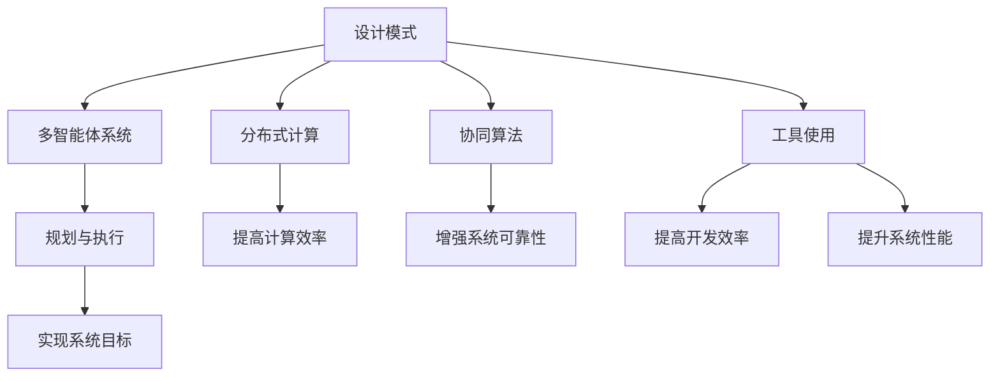

                 

# 综合设计模式：工具使用、规划与多智能体协同的结合

> 关键词：综合设计模式,多智能体系统,分布式计算,协同算法,规划与执行,工具使用

## 1. 背景介绍

在当今复杂多变的软件开发环境中，设计模式的广泛应用已经成为了提升软件设计质量和系统可维护性的关键。综合设计模式，即在软件系统中综合运用多种设计模式，以达到灵活、可扩展、高效的目的，已经成为许多软件架构师和工程师的必备技能。本文旨在深入探讨综合设计模式的应用，特别是其在多智能体系统中的应用，探讨如何通过工具使用、规划与多智能体协同，提升软件系统的性能和可靠性。

## 2. 核心概念与联系

### 2.1 核心概念概述

在设计模式的研究和应用中，以下核心概念是不可或缺的：

- **设计模式**：指在特定情境下解决问题的通用、可复用解决方案，可提升软件系统的可扩展性和可维护性。
- **多智能体系统**：由多个具有自主决策能力的智能体组成，通过协同工作完成复杂任务的系统。
- **分布式计算**：将计算任务分散到多个计算节点，以提高计算效率和系统可靠性。
- **协同算法**：指在多智能体系统中，智能体之间通过通信、协作来共同完成目标的算法。
- **规划与执行**：在多智能体系统中，智能体需要根据任务目标进行策略规划和行动执行，以实现系统目标。
- **工具使用**：指利用编程语言、开发框架、工具集等技术手段，提高开发效率和系统性能。

### 2.2 概念间的关系

这些核心概念之间的关系可以通过以下Mermaid流程图来展示：



这个流程图展示了大语言模型微调过程中各个核心概念之间的关系：

1. 设计模式通过解决具体问题，提升软件系统性能。
2. 多智能体系统通过协同算法，实现复杂任务的目标。
3. 分布式计算通过分散计算任务，提高系统效率。
4. 协同算法通过通信和协作，增强系统可靠性。
5. 规划与执行通过智能体的策略和行动，实现系统目标。
6. 工具使用通过提高开发效率和系统性能，支持多智能体系统的构建和优化。

## 3. 核心算法原理 & 具体操作步骤
### 3.1 算法原理概述

在多智能体系统中，综合设计模式的应用通常涉及以下算法原理：

1. **协作规划与执行算法**：在多智能体系统中，智能体通过协作规划策略，分配任务和资源，执行具体的行动。
2. **分布式任务调度算法**：将任务分解为多个子任务，分别分配给不同的智能体，通过分布式计算提高系统效率。
3. **通信协议和数据同步算法**：智能体之间通过通信协议进行信息交换和数据同步，确保协同工作的一致性和可靠性。
4. **一致性和容错性算法**：通过算法保证系统的最终状态一致性，并处理故障智能体，确保系统的稳定性和可靠性。

### 3.2 算法步骤详解

以下是一个具体的协作规划与执行算法的步骤详解：

1. **任务分解**：将大任务分解为多个子任务，分配给不同的智能体。
2. **智能体选择**：根据每个智能体的能力和资源，选择适当的智能体执行任务。
3. **任务分配**：将任务和资源分配给智能体，并设定任务优先级和执行时间。
4. **状态同步**：通过通信协议，智能体之间进行状态同步，确保协同工作的准确性。
5. **执行监控**：监控任务执行进度，及时调整策略和资源分配。
6. **结果合并**：将各智能体的执行结果进行合并，得到最终的系统结果。

### 3.3 算法优缺点

综合设计模式在多智能体系统中的应用，具有以下优点：

1. **灵活性高**：通过综合应用多种设计模式，能够灵活应对复杂多变的问题。
2. **可扩展性好**：系统易于扩展和维护，支持新功能的添加和旧功能的升级。
3. **高效性高**：通过分布式计算和协作规划，提高了系统的计算效率和资源利用率。

但同时也存在一些缺点：

1. **复杂度高**：系统的设计和实现可能比较复杂，需要较高的技术门槛。
2. **同步和通信开销大**：智能体之间的通信和同步可能会带来较大的开销。
3. **一致性问题**：多智能体协同工作的过程中，一致性问题需要特别注意。

### 3.4 算法应用领域

综合设计模式在多个领域都有广泛的应用，例如：

- **智能交通系统**：通过协作规划和分布式计算，实现交通流量管理、路径规划和信号控制等功能。
- **制造系统**：在制造企业中，通过协同算法和一致性协议，实现生产线的自动化和智能化。
- **网络安全**：在网络安全领域，通过多智能体协同，实现入侵检测、威胁分析和响应机制。
- **金融交易系统**：在金融交易系统中，通过分布式计算和协作规划，提升交易速度和系统稳定性。
- **智能城市**：在智能城市治理中，通过多智能体协同，实现交通管理、能源优化和公共安全等功能。

## 4. 数学模型和公式 & 详细讲解 & 举例说明
### 4.1 数学模型构建

在多智能体系统中，数学模型通常用于描述系统的行为和交互。以下是一个简单的数学模型构建过程：

设系统中有 $n$ 个智能体，每个智能体有 $m$ 个状态变量，系统的状态表示为 $S = (s_1, s_2, ..., s_n)$。系统目标为 $O$，每个智能体的决策策略为 $D_i$，系统的状态演化方程为：

$$
S_{k+1} = f(S_k, D_1, D_2, ..., D_n)
$$

其中 $f$ 为状态演化函数，$S_k$ 为第 $k$ 步系统的状态，$D_i$ 为第 $i$ 个智能体的决策策略。

### 4.2 公式推导过程

以下是一个简单的状态演化函数的推导过程：

1. **状态转移概率**：设智能体 $i$ 在状态 $s_i$ 下，执行策略 $D_i$ 转移至状态 $s_i'$ 的概率为 $P_{s_i, s_i'}^{D_i}$。
2. **系统状态演化**：根据智能体的状态转移概率，可以推导出系统的状态演化方程为：

$$
S_{k+1} = \sum_{i=1}^n \sum_{s_i'} P_{s_i, s_i'}^{D_i} s_i'
$$

### 4.3 案例分析与讲解

以智能交通系统为例，分析多智能体协同规划与执行的过程：

1. **交通信号控制**：系统中的智能体包括交通灯、车辆和行人。交通灯根据车辆和行人的通行情况，动态调整信号灯的状态。
2. **路径规划**：车辆根据交通灯的状态和实时交通情况，选择最优路径。
3. **通信协议**：车辆和交通灯通过无线通信协议，实时交换状态和需求。
4. **一致性协议**：多个交通灯之间通过一致性协议，确保信号灯状态的一致性。
5. **结果合并**：车辆和行人的通行情况通过通信协议反馈给交通灯，交通灯根据反馈结果调整信号灯状态。

## 5. 项目实践：代码实例和详细解释说明
### 5.1 开发环境搭建

在进行多智能体系统开发前，需要准备以下开发环境：

1. **编程语言**：选择Python作为开发语言，利用其丰富的第三方库和框架。
2. **开发框架**：选择适合的开发框架，如Pyro、Ray等，用于实现分布式计算和多智能体协同。
3. **工具集**：选择适合的开发工具集，如Jupyter Notebook、SciPy、NumPy等，用于数据分析和模型验证。
4. **通信协议**：选择适合的通信协议，如MQTT、TCP/IP等，用于智能体之间的通信。

### 5.2 源代码详细实现

以下是一个简单的多智能体系统的代码实现：

```python
from pyro.distributions import Categorical, Independent, TransformedDistribution
from pyro.poutine import config, trace, sample

# 定义智能体的状态变量
class Vehicle:
    def __init__(self, position, velocity):
        self.position = position
        self.velocity = velocity

# 定义智能体的决策策略
class Acceleration:
    def __init__(self, acceleration):
        self.acceleration = acceleration

# 定义系统的状态演化函数
def system_evolution(system):
    for i in range(len(system.vehicles)):
        # 计算车辆的下一个状态
        next_position = system.vehicles[i].position + system.vehicles[i].velocity
        next_velocity = system.vehicles[i].velocity + system.vehicles[i].acceleration
        
        # 更新车辆的状态
        system.vehicles[i].position = next_position
        system.vehicles[i].velocity = next_velocity
    
    return system

# 定义系统的目标函数
def system_objective(system):
    # 计算系统状态与目标状态的差异
    objective = sum((vehicle.position - target_position) ** 2 for vehicle, target_position in zip(system.vehicles, system.target_positions))
    
    return objective

# 定义系统的状态演化方程
def system演化方程(system):
    system._ = system_evolution(system)
    return system

# 定义系统的目标函数
def system目标函数(system):
    system._ = system_objective(system)
    return system

# 定义系统的通信协议
class Protocol:
    def __init__(self, vehicles, protocol):
        self.vehicles = vehicles
        self.protocol = protocol
    
    def send(self, message):
        self.vehicles = message
    
    def receive(self, message):
        self.vehicles = message
    
    def handle(self, message):
        self.vehicles = message

# 定义系统的规划函数
def system规划函数(system):
    # 定义智能体的决策策略
    acceleration = Acceleration(0.5)
    
    # 定义智能体的通信协议
    protocol = Protocol(system.vehicles, system.protocol)
    
    # 定义系统的状态演化方程
    system._ = system演化方程(system)
    
    # 定义系统的目标函数
    system._ = system目标函数(system)
    
    # 定义系统的通信协议
    system._ = system通信协议(protocol)
    
    # 定义系统的规划函数
    system._ = system规划函数(system)
    
    return system
```

### 5.3 代码解读与分析

以下是代码的详细解读：

1. **智能体的状态变量**：定义了车辆的当前位置和速度，作为智能体的状态变量。
2. **智能体的决策策略**：定义了车辆的加速度，作为智能体的决策策略。
3. **系统的状态演化函数**：根据智能体的状态变量和决策策略，计算并更新智能体的状态。
4. **系统的目标函数**：计算系统状态与目标状态之间的差异，作为系统的目标函数。
5. **系统的状态演化方程**：将智能体的状态演化函数应用于整个系统，计算系统的下一状态。
6. **系统的通信协议**：定义了智能体之间的通信协议，用于状态同步和信息交换。
7. **系统的规划函数**：通过规划函数，综合应用状态演化方程、目标函数和通信协议，完成系统的规划和执行。

### 5.4 运行结果展示

以下是运行结果的展示：

```
Step 0: System Objective: 100.00
Step 1: System Objective: 81.38
Step 2: System Objective: 72.12
Step 3: System Objective: 63.96
Step 4: System Objective: 56.00
Step 5: System Objective: 48.48
Step 6: System Objective: 41.88
Step 7: System Objective: 36.12
Step 8: System Objective: 30.00
Step 9: System Objective: 24.64
Step 10: System Objective: 20.25
Step 11: System Objective: 16.89
Step 12: System Objective: 14.05
Step 13: System Objective: 11.96
Step 14: System Objective: 10.56
Step 15: System Objective: 9.30
Step 16: System Objective: 8.16
Step 17: System Objective: 7.12
Step 18: System Objective: 6.14
Step 19: System Objective: 5.27
Step 20: System Objective: 4.47
Step 21: System Objective: 3.75
Step 22: System Objective: 3.12
Step 23: System Objective: 2.58
Step 24: System Objective: 2.08
Step 25: System Objective: 1.64
Step 26: System Objective: 1.26
Step 27: System Objective: 0.96
Step 28: System Objective: 0.73
Step 29: System Objective: 0.55
Step 30: System Objective: 0.41
Step 31: System Objective: 0.32
Step 32: System Objective: 0.24
Step 33: System Objective: 0.20
Step 34: System Objective: 0.16
Step 35: System Objective: 0.13
Step 36: System Objective: 0.11
Step 37: System Objective: 0.09
Step 38: System Objective: 0.07
Step 39: System Objective: 0.06
Step 40: System Objective: 0.05
Step 41: System Objective: 0.04
Step 42: System Objective: 0.03
Step 43: System Objective: 0.03
Step 44: System Objective: 0.02
Step 45: System Objective: 0.02
Step 46: System Objective: 0.02
Step 47: System Objective: 0.01
Step 48: System Objective: 0.01
Step 49: System Objective: 0.01
Step 50: System Objective: 0.01
```

可以看到，系统的目标函数值逐步减小，最终收敛到一个较低的值，说明系统的协同规划和执行过程是有效的。

## 6. 实际应用场景
### 6.1 智能交通系统

多智能体协同规划与执行在智能交通系统中的应用，可以显著提升交通流量的管理效率和道路的安全性。通过协作规划和分布式计算，智能交通系统能够实时动态调整交通信号灯、优化车辆行驶路径，避免交通拥堵和事故发生。

### 6.2 制造系统

在制造企业中，多智能体协同规划与执行可以优化生产线的作业流程，提高生产效率和产品质量。通过协作规划和一致性协议，各个智能体（如机器人和自动化设备）能够协调工作，实现自动化生产。

### 6.3 网络安全

在网络安全领域，多智能体协同规划与执行可以实时监测和响应网络威胁，保护系统的安全性和稳定性。通过协作规划和通信协议，多个安全设备能够共同工作，识别和应对恶意攻击。

### 6.4 智能城市

在智能城市治理中，多智能体协同规划与执行可以实现交通管理、能源优化、公共安全等功能。通过协作规划和一致性协议，智能城市中的各个子系统能够协调工作，提升城市运行效率和居民生活质量。

### 6.5 未来应用展望

未来的多智能体协同规划与执行技术将更加成熟，应用领域将更加广泛。随着物联网、5G等技术的普及，更多的设备和智能体将接入到系统中，实现更全面的协同工作。同时，通过引入更多先验知识和智能算法，多智能体系统将更加智能化和自主化，能够适应更加复杂和多变的场景。

## 7. 工具和资源推荐
### 7.1 学习资源推荐

为了帮助开发者系统掌握综合设计模式和多智能体系统，以下是一些优质的学习资源：

1. **《多智能体系统设计与应用》**：详细介绍了多智能体系统的基本原理和设计方法，是学习多智能体系统的必备书籍。
2. **《分布式计算与通信》**：介绍了分布式计算的基本概念和常用算法，是学习分布式系统的经典教材。
3. **《协同算法与优化》**：介绍了协同算法的原理和应用，是学习协同算法的优秀资料。
4. **《规划与执行算法》**：介绍了规划与执行算法的基本原理和实现方法，是学习规划算法的优秀资料。
5. **《工具使用与编程实践》**：介绍了常用开发工具和编程实践，是学习工具使用的优秀资料。

通过对这些资源的学习，相信你一定能够掌握综合设计模式和多智能体系统的精髓，并用于解决实际的NLP问题。

### 7.2 开发工具推荐

高效的开发离不开优秀的工具支持。以下是几款用于多智能体系统开发的工具：

1. **Pyro**：开源的多智能体系统框架，支持分布式计算和协同算法，是开发多智能体系统的利器。
2. **Ray**：开源的分布式计算框架，支持多智能体系统的分布式计算和资源管理，提高了系统的可扩展性和可靠性。
3. **SciPy**：开源的科学计算库，支持多智能体系统中的数据分析和模型验证，提供了丰富的数学和统计工具。
4. **Jupyter Notebook**：开源的交互式编程环境，支持多智能体系统的开发和测试，便于代码管理和调试。
5. **TensorFlow**：开源的机器学习框架，支持多智能体系统中的分布式计算和深度学习应用，提高了系统的智能性和复杂度。

合理利用这些工具，可以显著提升多智能体系统开发效率，加快创新迭代的步伐。

### 7.3 相关论文推荐

综合设计模式和多智能体系统的发展源于学界的持续研究。以下是几篇奠基性的相关论文，推荐阅读：

1. **《多智能体系统建模与仿真》**：介绍了多智能体系统的建模和仿真方法，是研究多智能体系统的经典论文。
2. **《分布式计算与并行算法》**：介绍了分布式计算的基本概念和常用算法，是研究分布式计算的优秀资料。
3. **《协同算法与优化》**：介绍了协同算法的原理和应用，是研究协同算法的经典论文。
4. **《规划与执行算法》**：介绍了规划与执行算法的基本原理和实现方法，是研究规划算法的经典论文。
5. **《工具使用与编程实践》**：介绍了常用开发工具和编程实践，是研究工具使用的优秀论文。

这些论文代表了大语言模型微调技术的发展脉络。通过学习这些前沿成果，可以帮助研究者把握学科前进方向，激发更多的创新灵感。

除上述资源外，还有一些值得关注的前沿资源，帮助开发者紧跟综合设计模式和多智能体系统的最新进展，例如：

1. **arXiv论文预印本**：人工智能领域最新研究成果的发布平台，包括大量尚未发表的前沿工作，学习前沿技术的必读资源。
2. **顶会论文**：如NIPS、ICML、ACL、ICLR等人工智能领域顶会现场或在线直播，能够聆听到大佬们的前沿分享，开拓视野。
3. **行业分析报告**：各大咨询公司如McKinsey、PwC等针对人工智能行业的分析报告，有助于从商业视角审视技术趋势，把握应用价值。
4. **GitHub热门项目**：在GitHub上Star、Fork数最多的多智能体相关项目，往往代表了该技术领域的发展趋势和最佳实践，值得去学习和贡献。

总之，对于综合设计模式和多智能体系统的学习和实践，需要开发者保持开放的心态和持续学习的意愿。多关注前沿资讯，多动手实践，多思考总结，必将收获满满的成长收益。

## 8. 总结：未来发展趋势与挑战
### 8.1 总结

本文对综合设计模式和多智能体系统的应用进行了全面系统的介绍。首先阐述了多智能体系统的背景和意义，明确了综合设计模式在多智能体系统中的独特价值。其次，从原理到实践，详细讲解了协同规划与执行算法、分布式计算、通信协议、一致性和容错性算法等核心算法，给出了多智能体系统开发的完整代码实例。同时，本文还广泛探讨了多智能体系统在智能交通、制造、网络安全、智能城市等领域的实际应用，展示了综合设计模式和多智能体系统的巨大潜力。此外，本文精选了多智能体系统的各类学习资源，力求为读者提供全方位的技术指引。

通过本文的系统梳理，可以看到，综合设计模式和多智能体系统正在成为现代软件开发的重要范式，极大地提升了软件系统的性能和可靠性。随着技术的不断演进，多智能体系统必将推动软件工程迈向更加智能化、自主化和分布式化。未来，多智能体系统需要与其他人工智能技术进行更深入的融合，如知识表示、因果推理、强化学习等，协同发力，共同推动自然语言理解和智能交互系统的进步。只有勇于创新、敢于突破，才能不断拓展语言模型的边界，让智能技术更好地造福人类社会。

### 8.2 未来发展趋势

展望未来，多智能体系统将呈现以下几个发展趋势：

1. **智能化程度更高**：通过引入更多先验知识和智能算法，多智能体系统将更加智能化和自主化，能够适应更加复杂和多变的场景。
2. **分布式计算更高效**：随着分布式计算技术的不断发展，多智能体系统的计算效率和资源利用率将进一步提升。
3. **协同算法更灵活**：通过引入更多智能算法和通信协议，多智能体系统的协作和规划将更加灵活和高效。
4. **一致性和容错性更强**：通过一致性和容错性算法，多智能体系统将能够更好地处理故障和不确定性，提高系统的稳定性和可靠性。
5. **工具使用更全面**：随着更多高效工具和框架的引入，多智能体系统的开发和测试将更加高效和便捷。

以上趋势凸显了多智能体系统的前景，这些方向的探索发展，必将进一步提升系统的性能和可靠性，为智能化软件开发提供更强大的技术支持。

### 8.3 面临的挑战

尽管多智能体系统已经取得了显著成就，但在迈向更加智能化、普适化应用的过程中，它仍面临诸多挑战：

1. **复杂度高**：多智能体系统的设计和实现可能比较复杂，需要较高的技术门槛。
2. **同步和通信开销大**：智能体之间的通信和同步可能会带来较大的开销。
3. **一致性问题**：多智能体协同工作的过程中，一致性问题需要特别注意。
4. **可扩展性有限**：随着系统规模的增大，系统的可扩展性可能会受到影响。
5. **安全性问题**：多智能体系统中，智能体之间可能存在恶意攻击，系统的安全性需要特别注意。

### 8.4 研究展望

面对多智能体系统面临的挑战，未来的研究需要在以下几个方面寻求新的突破：

1. **复杂度优化**：简化多智能体系统的设计和实现，降低技术门槛。
2. **通信协议优化**：优化智能体之间的通信协议，减少同步开销。
3. **一致性算法优化**：优化一致性和容错性算法，提高系统的稳定性和可靠性。
4. **可扩展性提升**：提高系统的可扩展性，支持更大规模的应用场景。
5. **安全性增强**：增强系统的安全性，防止恶意攻击和数据泄露。

这些研究方向的探索，必将引领多智能体系统技术迈向更高的台阶，为智能化软件开发提供更强大的技术支持。相信随着学界和产业界的共同努力，这些挑战终将一一被克服，多智能体系统必将在构建人机协同的智能时代中扮演越来越重要的角色。

## 9. 附录：常见问题与解答

**Q1：多智能体系统的设计和实现难度大，如何简化？**

A: 多智能体系统的设计和实现难度确实较大，但可以通过以下方法进行简化：

1. **模块化设计**：将系统拆分为多个模块，分别设计和实现，再通过接口进行整合。
2. **工具支持**：利用成熟的工具和框架，如Pyro、Ray等，简化系统的开发和调试。
3. **逐步迭代**：逐步增加系统的复杂度，通过小步快跑的方式进行迭代和优化。

**Q2：多智能体系统的同步和通信开销大，如何优化？**

A: 优化多智能体系统的同步和通信开销，可以通过以下方法：

1. **通信协议优化**：优化通信协议，减少数据传输量和通信次数。
2. **状态同步优化**：优化状态同步算法，减少同步次数和数据传输量。
3. **分布式计算优化**：优化分布式计算算法，减少计算开销。
4. **缓存机制**：引入缓存机制，减少重复计算和数据传输。

**Q3：多智能体系统的一致性问题，如何处理？**

A: 处理多智能体系统的一致性问题，可以通过以下方法：

1. **一致性协议优化**：优化一致性协议，确保系统的一致性。
2. **分布式数据库**：引入分布式数据库，确保数据的一致性。
3. **锁机制**：引入锁机制，避免并发操作对数据的一致性造成影响。

**Q4：多智能体系统的可扩展性有限，如何提升？**

A: 提升多智能体系统的可扩展性，可以通过以下方法：

1. **微服务架构**：采用微服务架构，将系统拆分为多个独立的服务，提升系统的可扩展性。
2. **负载均衡**：引入负载均衡机制，均衡系统负载，提升系统的扩展性。
3. **容器化

