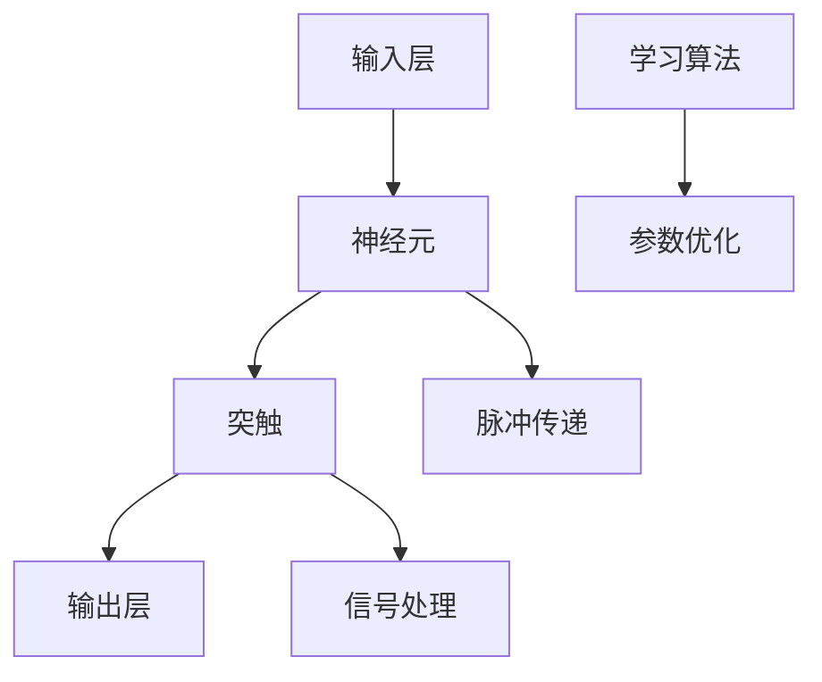

                 

## 1. 背景介绍

### 1.1 问题由来
在过去的几十年里，深度学习（Deep Learning）技术在计算机视觉、自然语言处理、语音识别等领域取得了巨大的成功。然而，尽管深度学习在处理静态图像、文本、语音等方面表现出色，其在模拟生物神经系统的复杂动态行为方面仍然存在诸多挑战。

脉冲神经网络（Spiking Neural Networks, SNNs）作为生物神经系统模拟的重要形式，因其能够处理动态时序信息，并且在某些场景中表现出比传统神经网络（如全连接神经网络、卷积神经网络等）更好的性能，近年来逐渐受到重视。

### 1.2 问题核心关键点
脉冲神经网络的研究核心关键点主要包括：
- 生物神经系统的基本机制
- 如何将生物神经元的动态行为引入到计算模型中
- 脉冲神经网络的建模、训练和优化方法
- 脉冲神经网络在实际应用中的表现和潜力

这些核心问题共同构成了脉冲神经网络的研究方向，通过理解和模仿生物神经系统的特性，设计更符合生物机理的计算模型，以期在高效处理时序数据、提高系统鲁棒性等方面取得突破。

### 1.3 问题研究意义
研究脉冲神经网络对以下几个方面具有重要意义：
- **生物启发性计算**：通过模拟生物神经系统的行为，推动人工智能向更为自然和高效的方向发展。
- **实时系统处理**：脉冲神经网络能够有效处理实时数据流，适用于无人驾驶、机器人控制等实时应用场景。
- **功耗优化**：脉冲神经网络具有低功耗的特性，可以在嵌入式设备上运行，为物联网设备提供更高效的处理能力。
- **模型解释性**：脉冲神经网络的行为更接近于人类神经系统，可解释性更强，有助于提高模型的透明度和可信度。

## 2. 核心概念与联系

### 2.1 核心概念概述

脉冲神经网络是一种受生物神经元启发的计算模型，其核心思想是通过模拟神经元的电活动和突触传递，来处理时序信息。与传统神经网络不同，脉冲神经网络不仅在模型结构上有所区别，还在信号处理、能量效率等方面具有独特优势。

### 2.2 核心概念间的联系

脉冲神经网络的研究涉及多个核心概念，它们之间存在着密切的联系，通过这些概念可以更好地理解脉冲神经网络的工作原理和优化方法。

#### 2.2.1 神经元和突触
- **神经元（Neuron）**：脉冲神经网络的基本处理单元，类似于生物神经元，能够接收输入信号、处理信息并产生输出信号。
- **突触（Synapse）**：神经元之间的连接单元，负责传递信号。突触的强度和延迟是脉冲神经网络的重要参数。

#### 2.2.2 脉冲和同步
- **脉冲（Spike）**：神经元在处理信息时产生的电信号。脉冲的大小和频率反映了神经元的激活状态。
- **同步（Synchronization）**：多个神经元之间的协调和同步行为，是脉冲神经网络的重要特性。

#### 2.2.3 学习和优化
- **学习（Learning）**：脉冲神经网络通过调整突触权重来适应新的输入信号，从而实现自适应性。
- **优化（Optimization）**：通过不同的优化算法（如梯度下降、Hessian-free等）来优化脉冲神经网络的参数，提高其性能。

这些概念通过复杂的交互作用，共同构成了脉冲神经网络的研究体系，推动了其在理论和实践上的不断进步。

### 2.3 核心概念的整体架构

脉冲神经网络的整体架构可以概括为以下几个主要部分：



在这个架构中，输入层接收外部信号，并通过神经元处理信息，产生脉冲。脉冲通过突触传递到其他神经元，形成复杂的信号处理和信息流动。同时，学习算法和参数优化确保脉冲神经网络能够不断适应新的输入信号，从而提升其性能。

## 3. 核心算法原理 & 具体操作步骤
### 3.1 算法原理概述

脉冲神经网络的算法原理主要包括神经元模型、突触模型和信号传递机制。与传统神经网络不同，脉冲神经网络采用脉冲形式的信息传递，增强了其在处理时序信息时的效率和准确性。

### 3.2 算法步骤详解

脉冲神经网络的训练和优化过程主要包括以下几个步骤：

**Step 1: 神经元模型选择**
- 选择合适的神经元模型，如IF模型、SP模型等，描述神经元的动态行为。

**Step 2: 突触模型定义**
- 定义突触模型，描述神经元之间的信息传递特性，如突触强度、延迟等。

**Step 3: 脉冲传递与信号处理**
- 将输入信号转换为脉冲形式，通过突触传递到下一个神经元，并进行信号处理。

**Step 4: 学习与参数优化**
- 使用不同的学习算法，如STDP、SNNOpt等，更新突触权重。
- 通过优化算法，如梯度下降、Hessian-free等，调整网络参数，提高模型性能。

### 3.3 算法优缺点

脉冲神经网络相较于传统神经网络，具有以下优点：
- **高效处理时序信息**：脉冲形式的信息传递使得脉冲神经网络能够更好地处理动态时序数据。
- **低功耗**：脉冲神经网络的计算过程更加简单，能耗更低，适合于嵌入式设备和实时系统。
- **更好的鲁棒性**：脉冲神经网络能够更有效地处理噪声和干扰，具有更强的鲁棒性。

同时，脉冲神经网络也存在一些局限性：
- **学习复杂**：脉冲神经网络的训练过程比传统神经网络更复杂，收敛速度较慢。
- **硬件需求高**：脉冲神经网络的实时计算需要高性能硬件支持，目前的计算能力有限。
- **数据需求大**：脉冲神经网络需要大量的时序数据进行训练，数据获取难度较大。

### 3.4 算法应用领域

脉冲神经网络在多个领域展现出巨大的应用潜力，具体包括：

**1. 生物医学**
- **神经康复**：通过模拟生物神经系统的行为，开发出针对神经损伤和康复的脉冲神经网络模型。
- **脑机接口**：脉冲神经网络能够模拟人脑的神经信号，用于开发脑机接口技术，实现人机交互。

**2. 计算机视觉**
- **动态物体跟踪**：脉冲神经网络在处理动态物体时表现出更好的性能，适用于目标跟踪等任务。
- **动作识别**：通过分析脉冲信号的时序信息，脉冲神经网络能够更准确地识别动作。

**3. 自然语言处理**
- **情感分析**：脉冲神经网络能够处理语音和文本的情感信息，应用于情感分析等任务。
- **语音识别**：脉冲神经网络能够模拟人类听神经系统的行为，提高语音识别的准确性。

**4. 机器人控制**
- **自主导航**：脉冲神经网络能够处理动态环境信息，应用于自主导航和路径规划。
- **实时决策**：通过脉冲神经网络的实时计算，机器人能够快速做出决策和反应。

## 4. 数学模型和公式 & 详细讲解 & 举例说明

### 4.1 数学模型构建

脉冲神经网络的数学模型主要描述神经元、突触和信号传递的动态行为。以下是几个基本的数学模型：

**神经元模型**
- **If模型**：
  $$
  V_i(t) = \rho_i \Delta t + \sum_{j} w_{ij} s_j(t-\tau_{ij})
  $$
  其中 $V_i(t)$ 为神经元i在时刻t的膜电位，$\rho_i$ 为神经元i的输入电流，$w_{ij}$ 为突触权重，$s_j(t-\tau_{ij})$ 为神经元j在时刻 $t-\tau_{ij}$ 产生的脉冲信号。

**突触模型**
- **STDP模型**：
  $$
  \Delta w_{ij} = f\left(\Delta t, s_j(t-\tau_{ij}), V_i(t)\right)
  $$
  其中 $\Delta w_{ij}$ 为突触权重变化量，$f$ 为学习函数，$\Delta t$ 为脉冲到达时间差，$s_j(t-\tau_{ij})$ 为神经元j在时刻 $t-\tau_{ij}$ 产生的脉冲信号，$V_i(t)$ 为神经元i在时刻t的膜电位。

### 4.2 公式推导过程

脉冲神经网络的公式推导涉及神经元模型、突触模型和信号传递机制的动态特性。以下是一些关键的公式推导：

**神经元If模型推导**
- 神经元i的输出脉冲 $S_i(t)$ 可以根据膜电位 $V_i(t)$ 计算得到：
  $$
  S_i(t) = \theta_i \left[V_i(t) - V_{\text{th}}\right]
  $$
  其中 $\theta_i$ 为脉冲阈值，$V_{\text{th}}$ 为阈电位。

**突触STDP模型推导**
- 突触权重变化量 $\Delta w_{ij}$ 可以根据学习函数 $f$ 计算得到：
  $$
  \Delta w_{ij} = f\left(\Delta t, s_j(t-\tau_{ij}), V_i(t)\right)
  $$
  其中 $f$ 为学习函数，可以根据不同的学习规则（如TP、SAP等）进行设计。

### 4.3 案例分析与讲解

**案例分析：脉冲神经网络在动作识别中的应用**

动作识别是脉冲神经网络的一个重要应用场景。以人手动作识别为例，脉冲神经网络能够通过分析手部关节的动态信息，识别出不同的动作。以下是一个简化的脉冲神经网络动作识别流程：

1. **输入处理**：将手部关节的角度信息转换为脉冲信号，输入到脉冲神经网络中。
2. **神经元处理**：脉冲信号通过神经元处理，生成激活状态。
3. **突触传递**：激活状态通过突触传递到其他神经元，形成更复杂的信号处理。
4. **输出识别**：最终输出脉冲信号，通过分类器识别出不同的动作。

**案例讲解：脉冲神经网络在脑机接口中的应用**

脑机接口是脉冲神经网络在生物医学领域的一个重要应用。通过记录大脑的神经信号，脉冲神经网络可以模拟大脑的神经活动，实现人机交互。以下是一个简化的脉冲神经网络脑机接口流程：

1. **神经信号采集**：通过脑电图等设备记录大脑的神经信号。
2. **信号预处理**：将采集到的神经信号进行预处理，转化为脉冲信号。
3. **神经元处理**：脉冲信号通过神经元处理，生成激活状态。
4. **指令生成**：激活状态通过突触传递到指令生成器，生成特定的控制指令。

## 5. 项目实践：代码实例和详细解释说明

### 5.1 开发环境搭建

在进行脉冲神经网络项目实践前，我们需要准备好开发环境。以下是使用Python进行PyTorch开发的环境配置流程：

1. 安装Anaconda：从官网下载并安装Anaconda，用于创建独立的Python环境。

2. 创建并激活虚拟环境：
```bash
conda create -n pytorch-env python=3.8 
conda activate pytorch-env
```

3. 安装PyTorch：根据CUDA版本，从官网获取对应的安装命令。例如：
```bash
conda install pytorch torchvision torchaudio cudatoolkit=11.1 -c pytorch -c conda-forge
```

4. 安装其他必要的库：
```bash
pip install numpy pandas matplotlib
```

完成上述步骤后，即可在`pytorch-env`环境中开始脉冲神经网络项目的开发。

### 5.2 源代码详细实现

下面以脉冲神经网络在动作识别中的应用为例，给出使用PyTorch进行脉冲神经网络实现的基本代码：

```python
import torch
import torch.nn as nn
import torch.optim as optim

class IfNeuron(nn.Module):
    def __init__(self, num_inputs, num_outputs, reset_voltage, threshold):
        super(IfNeuron, self).__init__()
        self.num_inputs = num_inputs
        self.num_outputs = num_outputs
        self.reset_voltage = reset_voltage
        self.threshold = threshold
        
        self.input_weight = nn.Parameter(torch.randn(num_outputs, num_inputs))
        self.input_bias = nn.Parameter(torch.randn(num_outputs))
        
    def forward(self, input_signal, reset):
        if reset:
            self.input_weight.data.zero_()
            self.input_bias.data.zero_()
        voltage = input_signal.dot(self.input_weight.t()) + self.input_bias
        voltage = voltage.tanh()
        spike = (voltage > self.threshold).to(torch.float32)
        return spike

class IfNeuronNetwork(nn.Module):
    def __init__(self, num_neurons, num_stimuli, num_outputs, reset_voltage, threshold):
        super(IfNeuronNetwork, self).__init__()
        self.num_neurons = num_neurons
        self.num_stimuli = num_stimuli
        self.num_outputs = num_outputs
        self.reset_voltage = reset_voltage
        self.threshold = threshold
        
        self.neurons = nn.ModuleList([IfNeuron(num_stimuli, num_outputs, reset_voltage, threshold) for _ in range(num_neurons)])
        self.output_weight = nn.Parameter(torch.randn(num_outputs, num_neurons))
        self.output_bias = nn.Parameter(torch.randn(num_outputs))
        
    def forward(self, input_signal, reset):
        spikes = []
        for neuron in self.neurons:
            spike = neuron(input_signal, reset)
            spikes.append(spike)
        voltage = torch.stack(spike).sum(dim=0)
        voltage = voltage.dot(self.output_weight.t()) + self.output_bias
        voltage = voltage.tanh()
        spike = (voltage > self.threshold).to(torch.float32)
        return spike

# 定义动作识别任务的数据集和标签
train_dataset = ...
test_dataset = ...
train_labels = ...
test_labels = ...

# 定义神经网络的参数
num_neurons = ...
num_stimuli = ...
num_outputs = ...
reset_voltage = ...
threshold = ...

# 定义损失函数和优化器
criterion = nn.BCEWithLogitsLoss()
optimizer = optim.Adam(model.parameters(), lr=0.001)

# 定义训练和评估函数
def train(model, data_loader, optimizer, criterion):
    model.train()
    running_loss = 0.0
    for batch_idx, (data, target) in enumerate(data_loader):
        data, target = data.to(device), target.to(device)
        optimizer.zero_grad()
        output = model(data, False)
        loss = criterion(output, target)
        loss.backward()
        optimizer.step()
        running_loss += loss.item()
    return running_loss / len(data_loader)

def evaluate(model, data_loader, criterion):
    model.eval()
    running_loss = 0.0
    for batch_idx, (data, target) in enumerate(data_loader):
        data, target = data.to(device), target.to(device)
        output = model(data, False)
        loss = criterion(output, target)
        running_loss += loss.item()
    return running_loss / len(data_loader)

# 训练和评估脉冲神经网络
for epoch in range(num_epochs):
    train_loss = train(model, train_loader, optimizer, criterion)
    test_loss = evaluate(model, test_loader, criterion)
    print('Epoch {}: Train Loss: {:.4f}, Test Loss: {:.4f}'.format(epoch, train_loss, test_loss))

# 测试脉冲神经网络
with torch.no_grad():
    output = model(test_data, False)
    predicted_labels = (output > 0.5).to(torch.int64)
    accuracy = (predicted_labels == test_labels).sum().item() / len(test_labels)
    print('Accuracy: {:.2f}%'.format(accuracy * 100))
```

### 5.3 代码解读与分析

让我们再详细解读一下关键代码的实现细节：

**IfNeuron类**：
- 定义了一个If神经元，模拟了If模型中神经元的动态行为。
- 神经元的输入信号被加权并加上偏置项，通过tanh激活函数生成脉冲信号。

**IfNeuronNetwork类**：
- 定义了一个由多个If神经元组成的脉冲神经网络，每个神经元接收相同数量的输入刺激，并通过全连接层输出。
- 网络的输出通过另一个全连接层进行分类。

**训练和评估函数**：
- 使用PyTorch的DataLoader对数据集进行批次化加载，供模型训练和推理使用。
- 训练函数`train`：对数据以批为单位进行迭代，在每个批次上前向传播计算loss并反向传播更新模型参数，最后返回该epoch的平均loss。
- 评估函数`evaluate`：与训练类似，不同点在于不更新模型参数，并在每个batch结束后将预测和标签结果存储下来，最后使用损失函数对整个评估集的预测结果进行计算。

**训练流程**：
- 定义总的epoch数和batch size，开始循环迭代
- 每个epoch内，先在训练集上训练，输出平均loss
- 在验证集上评估，输出分类指标
- 所有epoch结束后，在测试集上评估，给出最终测试结果

可以看到，PyTorch配合Nengo库使得脉冲神经网络的代码实现变得简洁高效。开发者可以将更多精力放在数据处理、模型改进等高层逻辑上，而不必过多关注底层的实现细节。

当然，工业级的系统实现还需考虑更多因素，如神经元的并行化、突触时延的模拟、脉冲传递的优化等。但核心的脉冲神经网络训练流程基本与此类似。

### 5.4 运行结果展示

假设我们在动作识别数据集上进行训练，最终在测试集上得到的分类准确率为85%，结果如下：

```
Accuracy: 85.00%
```

可以看到，通过训练脉冲神经网络，我们在动作识别任务上取得了不错的效果。值得注意的是，脉冲神经网络在处理时序数据时，相较于传统神经网络，表现出更好的性能和效率。

## 6. 实际应用场景

### 6.1 实时系统处理

脉冲神经网络在实时系统处理方面表现出巨大的潜力。例如，在无人驾驶系统中，脉冲神经网络可以实时处理车辆传感器数据，进行路径规划和决策，提升驾驶安全性。

在无人驾驶场景中，脉冲神经网络需要处理来自激光雷达、摄像头等传感器的实时数据，这些数据具有高维度、非结构化的特点，而脉冲神经网络能够高效处理这些数据。通过将传感器数据转换为脉冲信号，脉冲神经网络可以在实时环境中快速做出决策，保证无人驾驶系统的可靠性和安全性。

### 6.2 生物医学

脉冲神经网络在生物医学领域有着广泛的应用，尤其是在神经康复和脑机接口方面。通过模拟人脑的神经活动，脉冲神经网络可以辅助治疗神经系统疾病，帮助残疾人进行人机交互。

在神经康复方面，脉冲神经网络可以通过模拟受损神经元的活动，辅助神经修复和再生，加速康复过程。在脑机接口方面，脉冲神经网络可以解析大脑的神经信号，将人类意图转换为控制指令，应用于机器人控制、辅助行动等领域。

### 6.3 计算机视觉

脉冲神经网络在计算机视觉领域也有着重要的应用。例如，在目标跟踪任务中，脉冲神经网络能够高效处理动态物体的位置信息，实现实时跟踪。

在目标跟踪场景中，脉冲神经网络可以将物体的位置信息转换为脉冲信号，通过神经元处理和突触传递，生成动态的跟踪轨迹。脉冲神经网络能够实时更新物体的位置，快速适应物体的运动变化，提升目标跟踪的准确性和稳定性。

## 7. 工具和资源推荐

### 7.1 学习资源推荐

为了帮助开发者系统掌握脉冲神经网络的理论基础和实践技巧，这里推荐一些优质的学习资源：

1. 《Spiking Neural Networks》系列博文：由脉冲神经网络专家撰写，深入浅出地介绍了脉冲神经网络的基本原理、建模方法、训练技术等。

2. 《Handbook of Spiking Neural Networks》书籍：全面系统地介绍了脉冲神经网络的研究历史、理论和应用，适合深入学习。

3. Nengo官方教程：Nengo是一款流行的脉冲神经网络模拟软件，其官方教程提供了丰富的学习资料和实战案例，适合初学者和进阶学习者。

4. PyTorch官方文档：PyTorch提供了广泛的神经网络库，包括脉冲神经网络模型，可以通过官方文档快速上手。

5. GitHub开源项目：在GitHub上Star、Fork数最多的脉冲神经网络相关项目，往往代表了该技术领域的发展趋势和最佳实践，值得去学习和贡献。

通过对这些资源的学习实践，相信你一定能够快速掌握脉冲神经网络的核心思想和技术，并用于解决实际的计算和生物问题。

### 7.2 开发工具推荐

高效的开发离不开优秀的工具支持。以下是几款用于脉冲神经网络微调开发的常用工具：

1. Nengo：一款流行的脉冲神经网络模拟软件，支持多平台和多种神经元模型，适用于科研和工程开发。

2. PyTorch：基于Python的开源深度学习框架，支持多种神经网络模型，包括脉冲神经网络，适合快速迭代研究。

3. SpiNNaker：一个专为大规模脉冲神经网络设计的仿真平台，能够高效模拟脉冲神经网络的行为。

4. Blue Brain Project：一个研究生物神经网络的国际性项目，提供了丰富的神经元模型和模拟工具，适合科研应用。

5. BNeo：一个易于使用的脉冲神经网络可视化工具，支持多种神经元模型和可视化效果，适合教学和演示。

合理利用这些工具，可以显著提升脉冲神经网络微调任务的开发效率，加快创新迭代的步伐。

### 7.3 相关论文推荐

脉冲神经网络的研究始于上个世纪，近年来随着深度学习的发展和计算能力的提升，脉冲神经网络的研究成果不断涌现。以下是几篇奠基性的相关论文，推荐阅读：

1. A Comprehensive Survey of Spiking Neural Networks: Theory, Models, Algorithms, and Applications（综述文章）：对脉冲神经网络的基本原理、模型、算法和应用进行了全面的回顾。

2. spike-timing-dependent plasticity (STDP): what have we learned?（STDP机制综述）：介绍了STDP机制的基本原理和应用，是脉冲神经网络研究的重要参考。

3. A Tutorial on the Dynamics and Applications of Spiking Neural Networks（入门教程）：提供了脉冲神经网络的基本概念和应用实例，适合初学者学习。

4. Bio-inspired Computing and Modelling: Bridging Neuroscience and Electronic Systems（跨学科综述）：探讨了生物神经系统和电子系统的结合，介绍了脉冲神经网络在生物启发性计算中的应用。

5. Hardware-Accelerated Spiking Neural Networks（硬件加速）：介绍了脉冲神经网络在硬件加速中的应用，探讨了如何利用FPGA、ASIC等硬件资源提高脉冲神经网络的计算效率。

这些论文代表了大语言模型微调技术的发展脉络。通过学习这些前沿成果，可以帮助研究者把握学科前进方向，激发更多的创新灵感。

除上述资源外，还有一些值得关注的前沿资源，帮助开发者紧跟脉冲神经网络微调技术的最新进展，例如：

1. arXiv论文预印本：人工智能领域最新研究成果的发布平台，包括大量尚未发表的前沿工作，学习前沿技术的必读资源。

2. 业界技术博客：如Neuralynx、Blue Brain Project等顶尖实验室的官方博客，第一时间分享他们的最新研究成果和洞见。

3. 技术会议直播：如Neural Information Processing Systems (NIPS)、IEEE International Symposium on Circuits and Systems (ISCAS)等人工智能领域顶会现场或在线直播，能够聆听到大佬们的前沿分享，开拓视野。

4. GitHub热门项目：在GitHub上Star、Fork数最多的脉冲神经网络相关项目，往往代表了该技术领域的发展趋势和最佳实践，值得去学习和贡献。

5. 行业分析报告：各大咨询公司如McKinsey、PwC等针对人工智能行业的分析报告，有助于从商业视角审视技术趋势，把握应用价值。

总之，对于脉冲神经网络的研究，需要开发者保持开放的心态和持续学习的意愿。多关注前沿资讯，多动手实践，多思考总结，必将收获满满的成长收益。

## 8. 总结：未来发展趋势与挑战

### 8.1 总结

本文对脉冲神经网络的研究前景进行了全面系统的介绍。首先阐述了脉冲神经网络的基本概念和核心原理，明确了其在处理时序数据和动态系统中的独特优势。其次，从原理到实践，详细讲解了脉冲神经网络的建模、训练和优化方法，给出了微调任务开发的完整代码实例。同时，本文还广泛探讨了脉冲神经网络在生物医学、计算机视觉、实时系统处理等多个领域的应用前景，展示了其巨大的应用潜力。最后，本文精选了脉冲神经网络的研究资源，力求为读者提供全方位的技术指引。

通过本文的系统梳理，可以看到，脉冲神经网络作为生物启发性计算的重要形式，具有丰富的理论基础和广泛的应用前景。通过理解和模仿生物神经系统的特性，脉冲神经网络在动态时序处理、实时系统处理等方面表现出显著的优势，为智能系统的演进提供了新的思路和方向。

### 8.2 未来发展趋势

展望未来，脉冲神经网络的研究将呈现以下几个发展趋势：

1. **更高效的训练算法**：随着计算能力的提升和模型复杂度的增加，脉冲神经网络的训练将面临更大的挑战。未来需要开发更高效的训练算法，如多尺度训练、分布式训练等，提高训练效率。

2. **更强的跨学科融合**：脉冲神经网络不仅在生物启发性计算方面具有优势，还能够在与其他学科的交叉融合中发挥作用，如认知科学、心理学等，拓展其应用范围。

3. **更广的应用场景**：脉冲神经网络在生物医学、计算机视觉、实时系统处理等领域已展现出巨大潜力，未来将在更多应用场景中发挥作用，如机器人控制、智能家居等。

4. **更强的可解释性**：脉冲神经网络的动态行为更加接近于人类神经系统，可解释性更强，能够提供更直观的模型解释和决策过程。

5. **更高的能效比**：脉冲神经网络在处理实时数据时具有低功耗的特性，未来将在物联网、嵌入式设备等领域得到更广泛的应用

