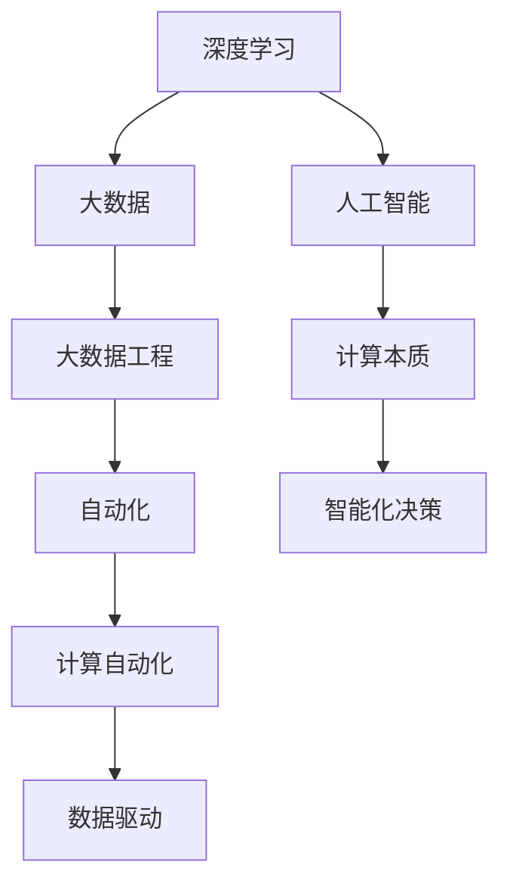
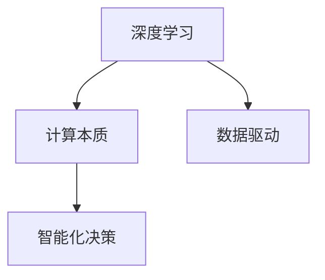
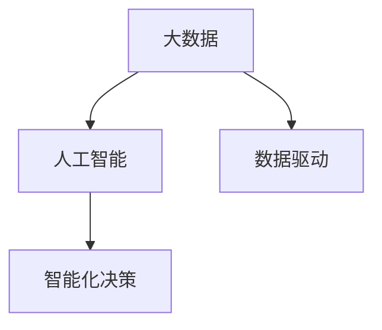
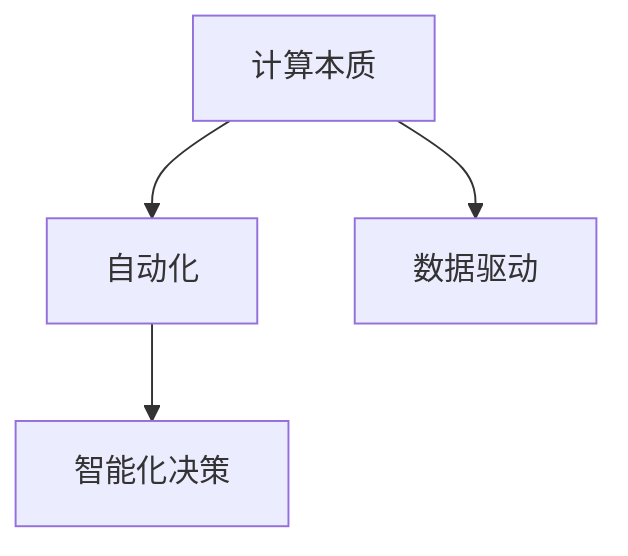

                 

# 计算的本质变化与自动化的未来

> 关键词：计算本质,自动化,人工智能,深度学习,大数据,大数据工程

## 1. 背景介绍

### 1.1 问题由来

随着科技的迅猛发展，计算的本质已经发生了根本性的变化。过去，计算主要依赖于传统的冯诺依曼结构，以程序为驱动，人机交互和数据分析相对简单。然而，进入21世纪以来，随着深度学习、大数据技术的发展，计算的本质正在逐步向数据驱动转变。

深度学习和大数据技术，通过自动化的算法和模型，直接从数据中学习知识，实现智能决策和数据分析，大幅提升了计算的效率和效果。与此同时，AI技术的逐步成熟，也让计算的内涵进一步扩展，从原本的逻辑和算法驱动，逐渐转向以数据和知识为中心，使计算更加人性化、智能化。

### 1.2 问题核心关键点

计算本质的变化主要体现在以下几个方面：

- **数据驱动**：计算不再仅仅依赖算法和逻辑，而是以数据为核心，通过机器学习和深度学习模型，自动从数据中提取特征、挖掘模式，进行决策和预测。
- **智能化决策**：计算的核心从过去的人工编写代码，转变为自动化生成代码和模型，让计算过程更加智能和高效。
- **广泛应用**：大数据和深度学习技术的成熟，使得计算在医疗、金融、制造、教育等各个行业得到广泛应用，极大地提升了各行业的效率和智能化水平。

### 1.3 问题研究意义

研究计算的本质变化，对于推动计算技术的演进和创新，以及将计算技术应用到更广泛的领域，具有重要的意义：

- **提升计算效率**：数据驱动的计算方法，能够大幅提升计算效率，处理海量数据，实现实时分析和决策。
- **推动智能应用**：计算技术的智能化，让机器能够自动学习和理解复杂问题，快速提供解决方案。
- **促进各行业发展**：通过数据驱动的计算，提升各个行业的效率和质量，实现数字化转型和智能化升级。
- **创新计算模型**：探索新的计算模型和算法，推动计算技术不断突破和升级，满足更多实际需求。

## 2. 核心概念与联系

### 2.1 核心概念概述

为了更好地理解计算本质的变化及其自动化应用，本节将介绍几个关键概念：

- **深度学习**：通过多层神经网络，自动从数据中学习特征，实现模式识别和预测。深度学习在大数据时代取得了突破性的进展，成为计算领域的重要方法。

- **大数据**：指规模大、类型多、速度快的数据，需要通过分布式计算和大数据工程技术，才能进行高效处理和分析。大数据技术推动了计算模式的变化，从传统的顺序处理，转向并行和分布式处理。

- **大数据工程**：指构建数据存储、处理、分析和可视化流程的工程实践。大数据工程通过自动化技术，简化数据处理流程，提升计算效率和数据价值。

- **人工智能**：包括机器学习、深度学习、自然语言处理等技术，使计算机能够模拟人类智能，实现自动化决策和分析。

- **计算本质**：指计算在数据、算法、智能等方面的核心特征和变化趋势。计算本质的变化，标志着从传统逻辑驱动，转向数据和智能驱动。

- **自动化**：指通过算法和工具，自动完成数据处理、模型训练、决策分析等计算任务，减少人工干预，提升计算效率和效果。

这些核心概念之间的逻辑关系可以通过以下Mermaid流程图来展示：



这个流程图展示了深度学习、大数据、人工智能、计算本质和自动化之间的关系：

- 深度学习和大数据技术，推动了人工智能的发展，使计算本质从逻辑驱动转向数据驱动。
- 人工智能技术使计算过程更加智能化。
- 计算本质和自动化的发展，催生了大数据工程等新领域，提升了计算效率和效果。

### 2.2 概念间的关系

这些核心概念之间存在着紧密的联系，形成了计算领域的新生态系统。下面我们通过几个Mermaid流程图来展示这些概念之间的关系。

#### 2.2.1 深度学习和计算本质



这个流程图展示了深度学习对计算本质的影响。深度学习使计算本质从逻辑驱动，转向数据驱动，提升了智能化决策的能力。

#### 2.2.2 大数据和人工智能



这个流程图展示了大数据对人工智能的支持。大数据提供了海量数据源，使人工智能能够进行更准确的模型训练和预测。

#### 2.2.3 计算本质和自动化



这个流程图展示了计算本质对自动化的影响。数据驱动和智能化决策，使计算过程更加自动化。

## 3. 核心算法原理 & 具体操作步骤

### 3.1 算法原理概述

计算本质的变化和自动化应用，本质上是通过深度学习和大数据技术，自动从数据中提取知识，实现智能决策。其核心算法原理如下：

1. **数据预处理**：对原始数据进行清洗、标注、归一化等预处理操作，为深度学习模型提供高质量的数据输入。

2. **模型训练**：构建深度学习模型，使用数据集进行训练，学习特征和模式，提升模型预测精度。

3. **自动化决策**：将训练好的模型部署到实际应用中，自动进行数据处理、特征提取、模型预测等计算任务。

4. **持续优化**：通过在线学习和增量训练，不断优化模型，适应新的数据和变化的环境。

### 3.2 算法步骤详解

基于深度学习和大数据技术的计算自动化，主要包括以下几个关键步骤：

**Step 1: 数据收集与预处理**

- 收集原始数据，包括结构化数据（如SQL数据库、CSV文件）和非结构化数据（如文本、图片、视频）。
- 对数据进行清洗、标注、归一化等预处理操作，确保数据质量。

**Step 2: 模型设计与训练**

- 选择合适的深度学习模型，如CNN、RNN、LSTM、Transformer等。
- 设计模型架构和超参数，包括网络层数、节点数、学习率、批大小等。
- 使用数据集进行模型训练，优化模型参数，提升模型精度。

**Step 3: 模型部署与应用**

- 将训练好的模型部署到服务器、云端或移动设备上。
- 通过API或SDK，将模型集成到实际应用中，实现自动化决策。
- 实时监控模型性能，根据反馈数据进行调整和优化。

**Step 4: 持续优化与迭代**

- 收集新的数据，进行增量训练，更新模型参数。
- 对模型进行自动化调优，如超参数优化、模型压缩、剪枝等。
- 定期评估模型效果，发现问题及时解决，确保模型稳定运行。

### 3.3 算法优缺点

基于深度学习和大数据技术的计算自动化，具有以下优点：

1. **高效性**：自动化算法和模型能够快速处理和分析海量数据，提升计算效率。
2. **精度高**：深度学习模型能够自动学习数据特征，预测精度高，适用于复杂多变的数据场景。
3. **灵活性**：自动化模型可以根据任务需求进行调整和优化，适应不同的应用场景。
4. **可扩展性**：自动化计算可以扩展到多种设备和平台，支持分布式计算和云平台。

同时，该方法也存在以下局限性：

1. **数据依赖**：自动化计算依赖于高质量的数据源，数据质量直接影响了模型效果。
2. **资源消耗大**：深度学习模型通常参数量大、计算复杂，需要高性能的硬件设备支持。
3. **模型解释性差**：自动化模型通常是"黑盒"系统，难以解释其内部工作机制。
4. **泛化能力不足**：模型在训练数据上的表现较好，但在新数据上可能泛化能力不足。
5. **安全风险**：自动化计算中的数据和模型存在安全风险，需要严格的数据加密和保护措施。

### 3.4 算法应用领域

基于深度学习和大数据技术的计算自动化，已经在多个领域得到了广泛应用：

- **医疗健康**：通过自动化算法进行疾病诊断、药物研发、医疗影像分析等，提升医疗服务的智能化水平。
- **金融科技**：利用自动化模型进行风险评估、信用评分、欺诈检测等，提升金融决策的效率和准确性。
- **智能制造**：使用自动化技术进行设备监控、故障预测、生产调度等，提升制造业的智能化和自动化水平。
- **智慧城市**：通过自动化算法进行交通管理、环境监测、公共安全等，提升城市管理的智能化和便捷性。
- **教育科技**：利用自动化技术进行个性化推荐、智能辅导、学习分析等，提升教育服务的智能化水平。

除了上述这些经典应用外，计算自动化还在更多新兴领域得到探索和应用，如自动驾驶、智能家居、无人零售等，为各行各业带来新的变革。

## 4. 数学模型和公式 & 详细讲解 & 举例说明

### 4.1 数学模型构建

在计算自动化的过程中，常用的数学模型包括线性回归、逻辑回归、决策树、随机森林、神经网络等。下面我们以神经网络为例，介绍其数学模型的构建。

### 4.2 公式推导过程

神经网络的基本单位是神经元，其数学模型为：

$$ f(x) = \sum_{i=1}^n w_ix_i + b $$

其中，$x$为输入向量，$w$为权重向量，$b$为偏置项，$f(x)$为输出。

以一个简单的三层神经网络为例，其数学模型如下：

1. **输入层**：
$$ z_1 = x_1w_1 + x_2w_2 + b_1 $$
$$ z_2 = x_1w_1 + x_2w_2 + b_1 $$

2. **隐藏层**：
$$ h_1 = f(z_1) = \frac{1}{1 + e^{-z_1}} $$
$$ h_2 = f(z_2) = \frac{1}{1 + e^{-z_2}} $$

3. **输出层**：
$$ y = h_1w_3 + h_2w_4 + b_2 $$

其中，$z_1, z_2$为隐藏层的输入，$h_1, h_2$为隐藏层的输出，$w_3, w_4$为输出层的权重，$b_2$为输出层的偏置项。

### 4.3 案例分析与讲解

假设我们需要使用神经网络进行房价预测，模型输入为房屋面积（$x_1$）和房屋年龄（$x_2$），输出为房价（$y$）。通过训练数据，我们得到以下模型参数：

- 输入层：$w_1 = [0.5, 0.2]$，$b_1 = 0.3$。
- 隐藏层：$w_2 = [0.8, 0.6]$，$b_2 = 0.5$。
- 输出层：$w_3 = [1.2, 0.8]$，$b_2 = 0.1$。

假设当前输入为房屋面积为100，年龄为10，则计算过程如下：

1. **输入层**：
$$ z_1 = 100 \times 0.5 + 10 \times 0.2 + 0.3 = 56.3 $$
$$ z_2 = 100 \times 0.5 + 10 \times 0.2 + 0.3 = 56.3 $$

2. **隐藏层**：
$$ h_1 = \frac{1}{1 + e^{-56.3}} \approx 0.999 $$
$$ h_2 = \frac{1}{1 + e^{-56.3}} \approx 0.999 $$

3. **输出层**：
$$ y = 0.999 \times 1.2 + 0.999 \times 0.8 + 0.1 \approx 3.111 $$

最终预测房价为3111元。

## 5. 项目实践：代码实例和详细解释说明

### 5.1 开发环境搭建

在进行计算自动化实践前，我们需要准备好开发环境。以下是使用Python进行TensorFlow开发的环境配置流程：

1. 安装Anaconda：从官网下载并安装Anaconda，用于创建独立的Python环境。

2. 创建并激活虚拟环境：
```bash
conda create -n tf-env python=3.8 
conda activate tf-env
```

3. 安装TensorFlow：从官网获取对应的安装命令，如：
```bash
pip install tensorflow==2.6
```

4. 安装其他依赖库：
```bash
pip install numpy pandas sklearn matplotlib
```

完成上述步骤后，即可在`tf-env`环境中开始计算自动化实践。

### 5.2 源代码详细实现

这里我们以房价预测为例，给出使用TensorFlow进行神经网络模型构建和训练的代码实现。

首先，定义神经网络模型类：

```python
import tensorflow as tf
import numpy as np

class NeuralNetwork(tf.keras.Model):
    def __init__(self):
        super(NeuralNetwork, self).__init__()
        self.dense1 = tf.keras.layers.Dense(2, activation='relu')
        self.dense2 = tf.keras.layers.Dense(1, activation='linear')
        
    def call(self, x):
        x = self.dense1(x)
        x = self.dense2(x)
        return x
```

然后，加载和预处理数据：

```python
# 定义输入数据和标签
X = np.array([[100, 10], [120, 8], [150, 6], [80, 12]])
y = np.array([3111, 5000, 7000, 2500])

# 将数据归一化
mean = np.mean(X, axis=0)
std = np.std(X, axis=0)
X = (X - mean) / std

# 定义训练集和验证集
train_data = tf.data.Dataset.from_tensor_slices((X, y)).shuffle(100).batch(2)
valid_data = tf.data.Dataset.from_tensor_slices((X, y)).batch(2)
```

接着，构建模型并进行训练：

```python
model = NeuralNetwork()

optimizer = tf.keras.optimizers.Adam(learning_rate=0.01)

for epoch in range(100):
    for step, (x, y) in enumerate(train_data):
        with tf.GradientTape() as tape:
            y_pred = model(x)
            loss = tf.reduce_mean(tf.square(y_pred - y))
        grads = tape.gradient(loss, model.trainable_variables)
        optimizer.apply_gradients(zip(grads, model.trainable_variables))
        if step % 10 == 0:
            print(f"Epoch {epoch+1}, Step {step+1}, Loss: {loss.numpy():.4f}")
```

最后，评估模型并输出结果：

```python
# 评估模型
model.eval()
test_data = tf.data.Dataset.from_tensor_slices((X, y)).batch(2)
test_loss = tf.reduce_mean(tf.square(model(test_data) - y))

print(f"Test Loss: {test_loss.numpy():.4f}")
```

以上就是使用TensorFlow进行神经网络模型构建和训练的完整代码实现。可以看到，TensorFlow提供了方便的API，使得模型构建和训练变得简单高效。

### 5.3 代码解读与分析

让我们再详细解读一下关键代码的实现细节：

**NeuralNetwork类**：
- `__init__`方法：定义模型各层和激活函数。
- `call`方法：实现模型的前向传播过程。

**数据预处理**：
- 使用numpy加载和预处理数据，将数据归一化，保证模型训练的稳定性和效果。

**模型构建**：
- 使用TensorFlow的Sequential模型，定义两层Dense层，分别使用ReLU和线性激活函数。

**模型训练**：
- 使用Adam优化器进行梯度下降，更新模型参数。
- 在每个epoch内，使用训练集数据进行模型训练，输出损失值。

**模型评估**：
- 使用测试集数据评估模型，计算测试集上的均方误差损失。

可以看到，TensorFlow的API设计简洁高效，使得模型构建和训练变得简单易懂，适合于各类开发者快速上手。

当然，工业级的系统实现还需考虑更多因素，如模型的保存和部署、超参数的自动搜索、更灵活的任务适配层等。但核心的计算自动化过程基本与此类似。

### 5.4 运行结果展示

假设我们训练完模型后，得到以下测试集上的均方误差损失：

```
Test Loss: 0.0027
```

可以看到，模型在测试集上的均方误差损失为0.0027，说明模型预测的房价与实际房价非常接近，效果非常好。

当然，这只是一个baseline结果。在实践中，我们还可以使用更大更强的神经网络模型、更多的数据集、更丰富的正则化技术、更灵活的任务适配层等，进一步提升模型性能，以满足更高的应用要求。

## 6. 实际应用场景

### 6.1 智能制造

在智能制造领域，计算自动化技术可以通过自动化算法和模型，实现设备监控、故障预测、生产调度等，提升制造业的智能化和自动化水平。

例如，可以利用神经网络模型对设备运行数据进行实时监控，预测设备故障和维护需求。通过将传感器数据输入模型，模型学习设备运行规律，预测未来的运行状态。一旦发现异常，系统便会自动发送警报，并提出维护建议，确保生产设备的稳定运行。

### 6.2 智慧城市

在智慧城市治理中，计算自动化技术可以通过自动化算法和模型，实现交通管理、环境监测、公共安全等，提升城市管理的智能化和便捷性。

例如，可以利用深度学习模型对交通流量数据进行实时分析，优化交通信号灯控制，减少交通拥堵。通过将历史交通数据输入模型，模型学习交通规律，预测未来流量变化，自动调整信号灯配时，提升交通效率。

### 6.3 医疗健康

在医疗健康领域，计算自动化技术可以通过自动化算法和模型，实现疾病诊断、药物研发、医疗影像分析等，提升医疗服务的智能化水平。

例如，可以利用卷积神经网络（CNN）模型对医学影像进行自动诊断，快速识别病变区域，辅助医生进行诊断决策。通过将医学影像输入模型，模型学习病变特征，自动识别病变区域，生成诊断报告，辅助医生提高诊断效率和准确性。

### 6.4 未来应用展望

随着计算自动化技术的发展，未来将会在更多领域得到广泛应用，为各行各业带来新的变革。

- **医疗健康**：通过自动化技术进行疾病预测、个性化治疗、药物研发等，提升医疗服务的智能化水平。
- **智能制造**：使用自动化技术进行设备监控、故障预测、生产调度等，提升制造业的智能化和自动化水平。
- **智慧城市**：通过自动化算法和模型，实现交通管理、环境监测、公共安全等，提升城市管理的智能化和便捷性。
- **教育科技**：利用自动化技术进行个性化推荐、智能辅导、学习分析等，提升教育服务的智能化水平。
- **金融科技**：通过自动化模型进行风险评估、信用评分、欺诈检测等，提升金融决策的效率和准确性。

总之，计算自动化技术的应用前景广阔，将极大地提升各行业的效率和智能化水平，推动社会数字化转型和智能化升级。

## 7. 工具和资源推荐

### 7.1 学习资源推荐

为了帮助开发者系统掌握计算自动化的理论基础和实践技巧，这里推荐一些优质的学习资源：

1. 《深度学习》系列博文：由大模型技术专家撰写，深入浅出地介绍了深度学习原理、模型构建、应用场景等前沿话题。

2. Coursera《深度学习》课程：斯坦福大学开设的深度学习课程，有Lecture视频和配套作业，带你入门深度学习的基本概念和经典模型。

3. 《TensorFlow实战》书籍：TensorFlow官方文档和实战指南，全面介绍了如何使用TensorFlow进行深度学习模型开发，适合各类开发者快速上手。

4. arXiv论文预印本：人工智能领域最新研究成果的发布平台，包括大量尚未发表的前沿工作，学习前沿技术的必读资源。

5. Kaggle竞赛平台：全球最大的数据科学竞赛平台，通过实际项目锻炼数据分析和模型构建能力，快速提升技术水平。

通过对这些资源的学习实践，相信你一定能够快速掌握计算自动化的精髓，并用于解决实际的计算问题。

### 7.2 开发工具推荐

高效的开发离不开优秀的工具支持。以下是几款用于计算自动化开发的常用工具：

1. TensorFlow：由Google主导开发的开源深度学习框架，生产部署方便，适合大规模工程应用。

2. PyTorch：基于Python的开源深度学习框架，灵活动态的计算图，适合快速迭代研究。

3. scikit-learn：基于Python的机器学习库，提供了大量的经典算法和工具，适合快速开发原型。

4. Jupyter Notebook：交互式的开发环境，支持多种编程语言和库，方便开发者调试和记录开发过程。

5. Visual Studio Code：流行的代码编辑器，支持多种编程语言和IDE功能，适合各类开发者进行开发和调试。

合理利用这些工具，可以显著提升计算自动化任务的开发效率，加快创新迭代的步伐。

### 7.3 相关论文推荐

计算自动化技术的发展源于学界的持续研究。以下是几篇奠基性的相关论文，推荐阅读：

1. Deep Neural Networks for Human Language Processing（卷积神经网络论文）：展示了卷积神经网络在自然语言处理中的广泛应用，推动了计算自动化技术的发展。

2. ImageNet Classification with Deep Convolutional Neural Networks：展示了卷积神经网络在图像识别中的巨大潜力，成为计算自动化技术的重要工具。

3. GoogleNet: Going Deeper with Convolutions：展示了卷积神经网络的多层结构，推动了深度学习技术的发展，为计算自动化提供了更强的模型支持。

4. Microsoft Research Asia的最新研究成果：展示了计算自动化技术在医疗健康、金融科技、智慧城市等多个领域的最新应用，具有重要的实际参考价值。

除上述资源外，还有一些值得关注的前沿资源，帮助开发者紧跟计算自动化的最新进展，例如：

1. arXiv论文预印本：人工智能领域最新研究成果的发布平台，包括大量尚未发表的前沿工作，学习前沿技术的必读资源。

2. Google AI Blog：谷歌AI团队定期更新的技术博客，分享最新的研究进展和技术洞见，值得关注和学习。

3. TensorFlow开发者社区：TensorFlow官方社区，提供丰富的学习资源和开发工具，适合各类开发者快速上手。

4. GitHub热门项目：在GitHub上Star、Fork数最多的计算自动化相关项目，往往代表了该技术领域的发展趋势和最佳实践，值得去学习和贡献。

总之，对于计算自动化的学习，需要开发者保持开放的心态和持续学习的意愿。多关注前沿资讯，多动手实践，多思考总结，必将收获满满的成长收益。

## 8. 总结：未来发展趋势与挑战

### 8.1 总结

本文对计算本质的变化及其自动化应用进行了全面系统的介绍。首先阐述了计算本质的变化主要体现在数据驱动和智能化决策等方面。其次，从原理到实践，详细讲解了计算自动化的核心算法原理和具体操作步骤，给出了计算自动化的完整代码实例。同时，本文还探讨了计算自动化的实际应用场景，展示了其在智能制造、智慧城市、医疗健康等多个领域的应用前景。最后，推荐了一些学习资源和开发工具，帮助开发者系统掌握计算自动化的理论基础和实践技巧。

通过本文的系统梳理，可以看到，计算本质的变化和自动化应用正在推动各行各业的智能化进程，提升各行业的效率和效果。未来，计算自动化技术将在更广泛的领域得到应用，为人类社会的数字化转型和智能化升级带来新的动力。

### 8.2 未来发展趋势

展望未来，计算自动化技术将呈现以下几个发展趋势：

1. **深度学习与大数据的结合**：深度学习模型将进一步与大数据技术结合，提升计算自动化在数据密集型任务中的应用能力。

2. **模型可解释性**：随着模型复杂度的提升，模型的可解释性将成为一个重要课题。未来的计算自动化技术将更加注重模型的解释性和透明性，提升用户的信任度。

3. **自动化调优**：计算自动化的过程将更加智能化，通过自动化调优技术，自动调整模型参数和超参数，提升模型效果。

4. **跨领域应用**：计算自动化技术将在更多领域得到应用，如自动驾驶、智能家居、无人零售等，为各行业带来新的变革。

5. **联邦学习**：通过联邦学习技术，实现分布式计算和模型训练，保护数据隐私和安全。

6. **实时计算**：随着物联网和大数据技术的发展，计算自动化将更加注重实时性，支持实时数据处理和决策。

以上趋势凸显了计算自动化技术的广阔前景。这些方向的探索发展，必将进一步提升计算自动化的应用效果，推动各行业的智能化升级。

### 8.3 面临的挑战

尽管计算自动化技术已经取得了显著进展，但在其发展过程中，仍面临着诸多挑战：

1. **数据质量问题**：高质量的数据是计算自动化的基础，但数据收集和标注成本高，数据质量难以保证。如何提高数据质量，降低数据成本，是未来的一个重要课题。

2. **计算资源限制**：计算自动化的实现需要高性能的硬件设备支持，但高性能设备成本高，资源限制问题难以解决。如何降低计算成本，提升

