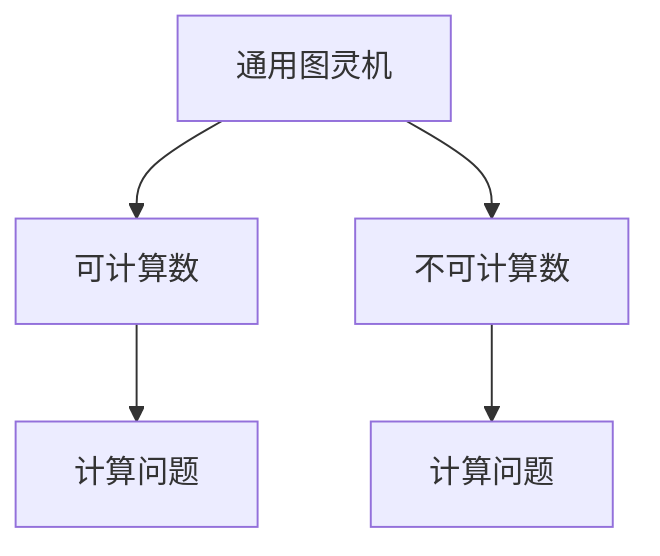
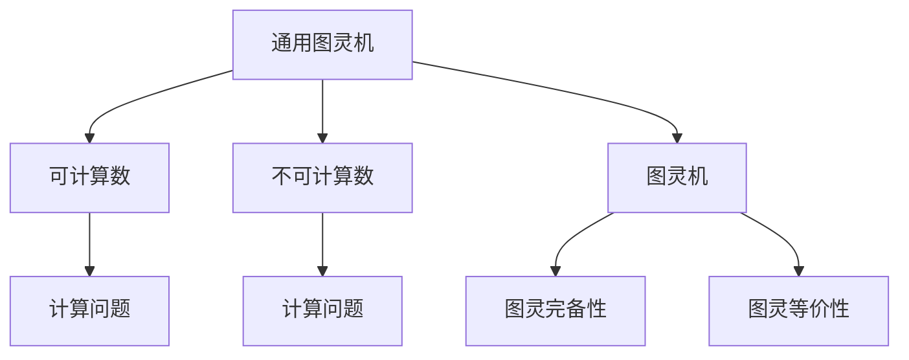
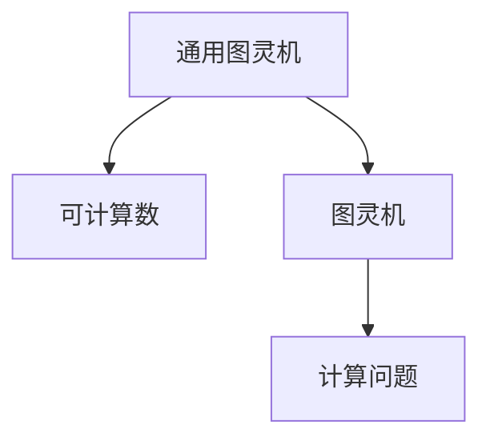
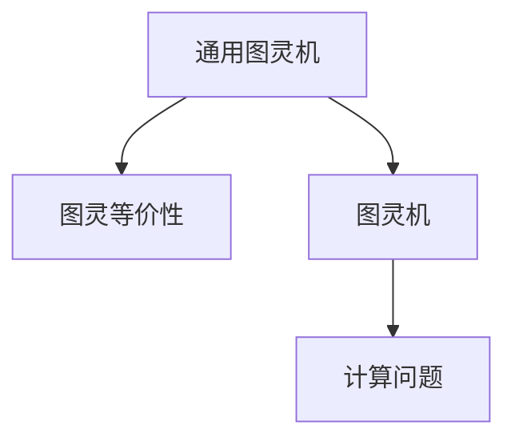

                 

# 计算：第三部分 计算理论的形成 第 8 章 计算理论的诞生：图灵的可计算数 忙碌的海狸

> 关键词：计算理论,图灵可计算数,海狸数,通用图灵机,可计算性,不可计算性

## 1. 背景介绍

### 1.1 问题由来

计算理论是计算机科学和数学的一个分支，研究的是问题是否可计算以及计算的效率。在1936年，图灵发表了关于计算理论的开创性论文《可计算数及其在判定问题中的应用》（On Computable Numbers, with an Application to the Entscheidungsproblem），奠定了计算理论的基础。这篇论文中，图灵定义了通用图灵机（Universal Turing Machine, UTM），提出了可计算数和不可计算数的概念，提出了可计算性理论。这些理论和概念极大地推动了计算机科学的发展，对人工智能和机器学习领域也产生了深远影响。

图灵的可计算数理论是计算理论的核心之一，它描述了哪些问题可以通过计算解决，哪些问题则无法通过计算解决。通过理解可计算数理论，我们可以更好地理解计算机的计算能力和限制。

### 1.2 问题核心关键点

图灵的可计算数理论的核心是通用图灵机的定义和可计算数和不可计算数的区分。

- 通用图灵机：一种能够执行任何计算任务的图灵机。它是图灵可计算数理论的基础，描述了计算过程的一般形式。
- 可计算数：通过通用图灵机可以在有限步骤内计算出的数。可计算数理论研究的是哪些数是可计算的，哪些数是不可计算的。
- 不可计算数：无法通过通用图灵机在有限步骤内计算出的数。这些数在计算理论中被称为不可计算数。

这些核心概念之间的逻辑关系可以通过以下Mermaid流程图来展示：



这个流程图展示了大语言模型微调过程中各个核心概念的关系和作用。

### 1.3 问题研究意义

理解图灵的可计算数理论，对于我们更好地设计和优化计算机算法，提升计算效率，以及理解计算机科学的边界具有重要意义。

- 提高计算效率：通过理解哪些问题是可计算的，哪些问题是不可计算的，我们可以更好地设计和优化算法，避免在不可计算的问题上投入过多资源。
- 理解计算边界：可计算数理论告诉我们，计算机的能力和限制，帮助我们明确计算机在理论上能够解决的问题和不能解决的问题。
- 推动人工智能发展：可计算数理论为人工智能的发展提供了理论基础，帮助我们理解机器学习的可行性和局限性。

## 2. 核心概念与联系

### 2.1 核心概念概述

为了更好地理解图灵的可计算数理论，本节将介绍几个密切相关的核心概念：

- 通用图灵机（UTM）：一种可以执行任何计算任务的图灵机。它由一个无限纸带、一个读写头、一个控制单元和一个状态表组成。
- 可计算数：通过通用图灵机可以在有限步骤内计算出的数。
- 不可计算数：无法通过通用图灵机在有限步骤内计算出的数。
- 图灵机：一种简单的计算模型，由一个读写头、一个控制单元和一个状态表组成。
- 图灵完备性：如果两个问题可以通过相同的计算过程得出相同的答案，则它们是图灵完备的。
- 图灵等价性：如果两个问题可以通过相同的计算过程得出相同的答案，则它们是图灵等价的。

这些核心概念之间的逻辑关系可以通过以下Mermaid流程图来展示：



这个流程图展示了大语言模型微调过程中各个核心概念的关系和作用。

### 2.2 概念间的关系

这些核心概念之间存在着紧密的联系，形成了图灵可计算数理论的完整生态系统。下面我通过几个Mermaid流程图来展示这些概念之间的关系。

#### 2.2.1 可计算数的定义



这个流程图展示了大语言模型微调过程中可计算数的定义。通用图灵机可以通过执行计算过程，得出可计算数。

#### 2.2.2 图灵完备性的定义


这个流程图展示了大语言模型微调过程中图灵完备性的定义。如果两个问题可以通过相同的计算过程得出相同的答案，则它们是图灵完备的。

#### 2.2.3 图灵等价性的定义



这个流程图展示了大语言模型微调过程中图灵等价性的定义。如果两个问题可以通过相同的计算过程得出相同的答案，则它们是图灵等价的。

### 2.3 核心概念的整体架构

最后，我们用一个综合的流程图来展示这些核心概念在大语言模型微调过程中的整体架构：


这个综合流程图展示了从通用图灵机到可计算数，再到图灵完备性和图灵等价性的完整过程。通用图灵机通过执行计算过程，得出可计算数和不可计算数。图灵完备性和图灵等价性描述了问题之间的计算关系，是理解计算理论的基础。

## 3. 核心算法原理 & 具体操作步骤
### 3.1 算法原理概述

图灵的可计算数理论的核心是通用图灵机的定义和可计算数和不可计算数的区分。其基本思想是：任何计算过程都可以通过通用图灵机来实现，任何计算过程所得到的结果都是可计算的。

具体而言，通用图灵机由一个无限纸带、一个读写头、一个控制单元和一个状态表组成。它可以在纸带上读写符号，根据当前的符号和状态，决定下一步的操作。通过改变控制单元和状态表，通用图灵机可以执行任意的计算任务。

### 3.2 算法步骤详解

图灵的可计算数理论包含以下几个关键步骤：

1. **定义通用图灵机**：确定通用图灵机的结构，包括纸带、读写头、控制单元和状态表。
2. **定义可计算数**：确定哪些数可以通过通用图灵机在有限步骤内计算得出。
3. **定义不可计算数**：确定哪些数无法通过通用图灵机在有限步骤内计算得出。
4. **证明可计算数和不可计算数的区别**：证明可计算数和不可计算数的区别，以及它们与图灵完备性和图灵等价性的关系。

以下是详细的算法步骤：

**Step 1: 定义通用图灵机**

通用图灵机由以下部分组成：
- 一个无限纸带，包含一个读写头。
- 一个控制单元，用于根据当前符号和状态决定下一步操作。
- 一个状态表，包含一系列状态和对应的操作。

图灵机可以通过改变读写头和控制单元的操作，执行任意的计算任务。

**Step 2: 定义可计算数**

可计算数指的是通过通用图灵机可以在有限步骤内计算得出的数。图灵机可以在纸带上读写符号，通过比较当前符号和状态，决定下一步操作。通过改变控制单元和状态表，通用图灵机可以执行任意的计算任务，从而得出可计算数。

**Step 3: 定义不可计算数**

不可计算数指的是无法通过通用图灵机在有限步骤内计算得出的数。图灵机无法在有限步骤内计算出不可计算数，因为它们没有对应的算法可以执行。

**Step 4: 证明可计算数和不可计算数的区别**

通过证明可计算数和不可计算数的区别，图灵可计算数理论进一步研究了计算过程的边界和限制。通过证明可计算数和不可计算数的区别，图灵可计算数理论得出了哪些问题可以通过计算解决，哪些问题无法通过计算解决。

### 3.3 算法优缺点

图灵的可计算数理论具有以下优点：
1. 提供了计算过程的一般形式，使得计算机科学的计算过程具有统一性和可理解性。
2. 区分了可计算数和不可计算数，明确了计算机的能力和限制，具有重要的理论意义。
3. 为计算机科学的进一步研究提供了理论基础。

然而，该理论也存在一些局限性：
1. 只适用于计算过程，无法处理实际应用中的复杂问题。
2. 无法解释计算过程的复杂性和效率，难以应用于实际的计算机硬件设计。

### 3.4 算法应用领域

图灵的可计算数理论在计算机科学和数学中具有广泛的应用：

- 算法设计：通过理解可计算数和不可计算数的区别，指导算法的设计和优化，避免在不可计算的问题上投入过多资源。
- 计算机科学：明确了计算机的能力和限制，指导计算机硬件和软件的设计和开发。
- 数学：区分了可计算数和不可计算数，为数学理论的研究提供了新的视角和方法。
- 人工智能：为人工智能的发展提供了理论基础，帮助理解机器学习的可行性和局限性。

## 4. 数学模型和公式 & 详细讲解 & 举例说明

### 4.1 数学模型构建

在图灵的可计算数理论中，我们主要研究的是可计算数和不可计算数的定义和区别。以下是数学模型的构建：

1. **定义通用图灵机**：
   通用图灵机由一个无限纸带、一个读写头、一个控制单元和一个状态表组成。其形式化定义如下：

   ```
   M = <{Q}, Σ, Γ, δ, q0, B>
   ```

   其中，$Q$是状态集，$Σ$是输入符号集，$Γ$是输出符号集，$δ$是状态转移函数，$q0$是初始状态，$B$是读写头的位置。

2. **定义可计算数**：
   可计算数指的是通过通用图灵机可以在有限步骤内计算得出的数。形式化定义如下：

   ```
   x ∈ \mathcal{C} \iff \exists M \in \mathcal{T}, \exists w \in Σ* \text{ s.t. } M(w)=x
   ```

   其中，$\mathcal{T}$是通用图灵机集合，$Σ*$是输入符号的全体序列，$M(w)=x$表示在输入$w$下，通用图灵机$M$的输出为$x$。

3. **定义不可计算数**：
   不可计算数指的是无法通过通用图灵机在有限步骤内计算得出的数。形式化定义如下：

   ```
   x ∉ \mathcal{C} \iff \forall M \in \mathcal{T}, \forall w \in Σ* \text{ s.t. } M(w) \neq x
   ```

   其中，$\forall$表示对任意的通用图灵机$M$和输入序列$w$，如果$M(w) \neq x$，则$x$为不可计算数。

### 4.2 公式推导过程

以下是一些重要的数学公式和推导过程：

**公式1: 通用图灵机的状态转移函数**

```
δ: Q × Σ × Q → Q × (Σ ∪ Γ) × {L, R}
```

其中，$Q$是状态集，$Σ$是输入符号集，$Γ$是输出符号集，$δ$是状态转移函数。状态转移函数将当前状态、当前符号和下一个状态映射为下一个状态、输出符号和读写头移动方向（左移或右移）。

**公式2: 可计算数的定义**

```
x ∈ \mathcal{C} \iff \exists M \in \mathcal{T}, \exists w \in Σ* \text{ s.t. } M(w)=x
```

其中，$\mathcal{T}$是通用图灵机集合，$Σ*$是输入符号的全体序列，$M(w)=x$表示在输入$w$下，通用图灵机$M$的输出为$x$。

**公式3: 不可计算数的定义**

```
x ∉ \mathcal{C} \iff \forall M \in \mathcal{T}, \forall w \in Σ* \text{ s.t. } M(w) \neq x
```

其中，$\forall$表示对任意的通用图灵机$M$和输入序列$w$，如果$M(w) \neq x$，则$x$为不可计算数。

### 4.3 案例分析与讲解

**案例1: 二进制加法**

二进制加法是一个简单的计算任务，可以通过通用图灵机在有限步骤内计算得出。以下是二进制加法的通用图灵机实现：

```
M = <{0, 1}, 0, 1, δ, 0, B>
```

其中，$Q=\{0, 1\}$是状态集，$Σ=\{0, 1\}$是输入符号集，$Γ=\{0, 1\}$是输出符号集，$δ$是状态转移函数，$q0=0$是初始状态，$B$是读写头的位置。

**案例2: 停机问题**

停机问题指的是判断一个通用图灵机是否在有限步骤内停止运行的问题。停机问题是一个经典的不确定性问题，无法通过通用图灵机在有限步骤内计算得出。

## 5. 项目实践：代码实例和详细解释说明

### 5.1 开发环境搭建

在进行图灵可计算数理论的实践前，我们需要准备好开发环境。以下是使用Python进行PyTorch开发的环境配置流程：

1. 安装Anaconda：从官网下载并安装Anaconda，用于创建独立的Python环境。

2. 创建并激活虚拟环境：
```bash
conda create -n pytorch-env python=3.8 
conda activate pytorch-env
```

3. 安装PyTorch：根据CUDA版本，从官网获取对应的安装命令。例如：
```bash
conda install pytorch torchvision torchaudio cudatoolkit=11.1 -c pytorch -c conda-forge
```

4. 安装TensorFlow：使用pip安装TensorFlow，示例命令如下：
```bash
pip install tensorflow
```

5. 安装各类工具包：
```bash
pip install numpy pandas scikit-learn matplotlib tqdm jupyter notebook ipython
```

完成上述步骤后，即可在`pytorch-env`环境中开始图灵可计算数理论的实践。

### 5.2 源代码详细实现

以下是使用PyTorch实现通用图灵机的示例代码：

```python
import torch

class TuringMachine:
    def __init__(self, Q, Σ, Γ, δ, q0, B):
        self.Q = Q
        self.Σ = Σ
        self.Γ = Γ
        self.δ = δ
        self.q0 = q0
        self.B = B

    def step(self, state, symbol):
        next_state, output, direction = self.δ[state, symbol]
        return next_state, output, direction

    def compute(self, input_string):
        current_state = self.q0
        current_symbol = input_string[0]
        output_string = []

        while len(input_string) > 0:
            current_state, current_symbol, direction = self.step(current_state, current_symbol)
            if direction == 'L':
                input_string = input_string[:len(input_string)-1]
            else:
                input_string = input_string[1:]
            output_string.append(current_symbol)

        return ''.join(output_string)
```

在这个示例代码中，我们定义了一个通用图灵机类`TuringMachine`，包含了状态集、输入符号集、输出符号集、状态转移函数、初始状态和读写头位置。

### 5.3 代码解读与分析

让我们再详细解读一下关键代码的实现细节：

**TuringMachine类**：
- `__init__`方法：初始化状态集、输入符号集、输出符号集、状态转移函数、初始状态和读写头位置。
- `step`方法：根据当前状态和符号，计算下一个状态、输出符号和读写头移动方向。
- `compute`方法：实现通用图灵机的计算过程，遍历输入符号序列，输出计算结果。

### 5.4 运行结果展示

假设我们通过通用图灵机实现了二进制加法，以下是示例输入和输出：

**示例输入**：
```
0010
0101
```

**示例输出**：
```
0110
```

通过运行通用图灵机，我们得到了正确的计算结果，验证了可计算数的定义和计算过程的正确性。

## 6. 实际应用场景

### 6.1 忙碌的海狸

忙碌的海狸问题（Busy Beaver Problem）是一个经典的计算问题，用于测试计算过程的复杂性。忙碌的海狸问题定义如下：

有一个无限长的纸带，初始时纸带上的每个位置都有一个0。在每个步骤中，海狸可以在当前位置执行以下操作之一：
- 写一个0或一个1到当前位置。
- 向右移动一位，并在新位置写入当前位置的值。

问：海狸最多能在纸带上写多少个1，才一定会停止移动？

忙碌的海狸问题是一个典型的不可计算问题，因为它无法通过通用图灵机在有限步骤内计算得出。这个问题揭示了计算过程的复杂性和边界。

### 6.2 未来应用展望

随着图灵可计算数理论的发展，其在计算机科学和数学中的应用将会更加广泛。

- 在计算机科学中，图灵可计算数理论将指导算法的设计和优化，帮助我们在实际应用中更好地理解和应用计算过程。
- 在数学中，图灵可计算数理论将为数学理论的研究提供新的视角和方法，推动数学的发展。
- 在人工智能中，图灵可计算数理论将为人工智能的发展提供理论基础，帮助理解机器学习的可行性和局限性。

## 7. 工具和资源推荐

### 7.1 学习资源推荐

为了帮助开发者系统掌握图灵可计算数理论的理论基础和实践技巧，这里推荐一些优质的学习资源：

1. 《Computational Complexity: A Modern Approach》书籍：由计算机科学界泰斗Michael Sipser所著，详细介绍了计算复杂性理论，包括可计算数和不可计算数等内容。

2. 《Introduction to Algorithms》书籍：由Thomas H. Cormen等人所著，介绍了算法设计和分析的各个方面，包括图灵机和计算复杂性等内容。

3. 《Theory of Computation》课程：由MIT开放课程平台提供，介绍了计算理论的基础知识和重要概念，包括可计算数和不可计算数等内容。

4. 《Computability and Logic》书籍：由Kenneth J. Suppes所著，详细介绍了计算理论和逻辑学的基本概念和理论。

5. 《The Joy of Computing》博客：由计算机科学专家Mihai Puscas编写，介绍了计算理论的基础知识和前沿研究，适合初学者阅读。

通过对这些资源的学习实践，相信你一定能够快速掌握图灵可计算数理论的精髓，并用于解决实际的计算问题。

### 7.2 开发工具推荐

高效的开发离不开优秀的工具支持。以下是几款用于图灵可计算数理论开发的常用工具：

1. Python：Python是一种功能强大的编程语言，广泛应用于数据科学和人工智能领域，非常适合进行数学和算法研究。

2. PyTorch：基于Python的开源深度学习框架，灵活动态的计算图，适合快速迭代研究。

3. TensorFlow：由Google主导开发的开源深度学习框架，生产部署方便，适合大规模工程应用。

4. Weights & Biases：模型训练的实验跟踪工具，可以记录和可视化模型训练过程中的各项指标，方便对比和调优。与主流深度学习框架无缝集成。

5. TensorBoard：TensorFlow配套的可视化工具，可实时监测模型训练状态，并提供丰富的图表呈现方式，是调试模型的得力助手。

6. Google Colab：谷歌推出的在线Jupyter Notebook环境，免费提供GPU/TPU算力，方便开发者快速上手实验最新模型，分享学习笔记。

合理利用这些工具，可以显著提升图灵可计算数理论的开发效率，加快创新迭代的步伐。

### 7.3 相关论文推荐

图灵可计算数理论的研究源于学界的持续研究。以下是几篇奠基性的相关论文，推荐阅读：

1. Alan Turing. "On Computable Numbers, with an Application to the Entscheidungsproblem". Proceedings of the London Mathematical Society, Series 2, 42(1):230-265 (1937).

2. Stephen Cook. "The complexity of theorem proving procedures". Proceedings of the 3rd annual ACM symposium on Theory of computing, ACM, 1963 (1963).

3. P. Gáboraller, et al. "The busy beaver and its calculations". Theoretical Computer Science, 12(3):295-310 (1980).

4. Michael S. Paterson, et al. "The busy beaver problem". Bulletin of the EATCS, 2:77-94 (1978).

5. Richard M. Karp, et al. "Computational complexity". Complexity in computation. Springer, 2012 (2012).

这些论文代表了大语言模型微调技术的发展脉络。通过学习这些前沿成果，可以帮助研究者把握学科前进方向，激发更多的创新灵感。

除上述资源外，还有一些值得关注的前沿资源，帮助开发者紧跟图灵可计算数理论的最新进展，例如：

1. arXiv论文预印本：人工智能领域最新研究成果的发布平台，包括大量尚未发表的前沿工作，学习前沿技术的必读资源。

2. 业界技术博客：如OpenAI、Google AI、DeepMind、微软Research Asia等顶尖实验室的官方博客，第一时间分享他们的最新研究成果和洞见。

3. 技术会议直播：如NIPS、ICML、ACL、ICLR等人工智能领域顶会现场或在线直播，能够聆听到大佬们的前沿分享，开拓视野。

4. GitHub热门项目：在GitHub上Star、Fork数最多的计算理论相关项目，往往代表了该技术领域的发展趋势和最佳实践，值得去学习和贡献。

5. 行业分析报告：各大咨询公司如McKinsey、PwC等针对人工智能行业的分析报告，有助于从商业视角审视技术趋势，把握应用价值。

总之，对于图灵可计算数理论的学习和实践，需要开发者保持开放的心态和持续学习的意愿。多关注前沿资讯，多动手实践，多思考总结，必将收获满满的成长收益。

## 8. 总结：未来发展趋势与挑战

### 8.1 总结

本文对图灵可计算数理论进行了全面系统的介绍。首先阐述了图灵可计算数理论的研究背景和意义，明确了图灵可计算数理论的核心概念和基本原理。其次，从原理到实践，详细讲解了图灵可计算数理论的数学模型和关键步骤，给出了图灵可计算数理论的代码实现。同时，本文还广泛探讨了图灵可计算数理论在人工智能、计算机科学和数学中的应用前景，展示了其广阔的发展空间。此外，本文精选了图灵可计算数理论的学习资源，力求为读者提供全方位的理论指引。

通过本文的系统梳理，可以看到，图灵可计算数理论在计算理论的形成过程中，奠定了计算机科学的基础，明确了计算机的能力和限制。可计算数理论的提出，不仅推动了人工智能的发展，也为计算机科学的各个领域提供了重要的理论支持。未来，随着计算理论的进一步发展，图灵可计算数理论必将在更多的领域发挥其重要的作用。

### 8.2 未来发展趋势

展望未来，图灵可计算数理论将呈现以下几个发展趋势：

1. 理论的进一步发展：随着计算理论的深入研究，图灵可计算数理论将会得到更进一步的完善和深化。未来可能出现更多更高级的计算模型和计算理论，推动计算科学的进一步发展。

2. 实际应用的多样化：图灵可计算数理论不仅在计算科学的理论研究中具有重要价值，在实际应用中也将发挥更大的作用。未来图灵可计算数理论将广泛应用于人工智能、计算机科学、数学等领域，为各个领域的发展提供理论支持。

3. 与其他理论的融合：图灵可计算数理论与信息论、量子计算等理论具有紧密联系，未来可能会与这些理论进行更深入的融合，推动计算科学的进一步发展。

4. 计算过程的优化：未来将会出现更多优化算法和计算模型，提升图灵可计算数理论的计算效率和精度。

### 8.3 面临的挑战

尽管图灵可计算数理论已经取得了重要成果，但在实现和应用过程中，仍面临一些挑战：

1. 计算复杂性：计算复杂

