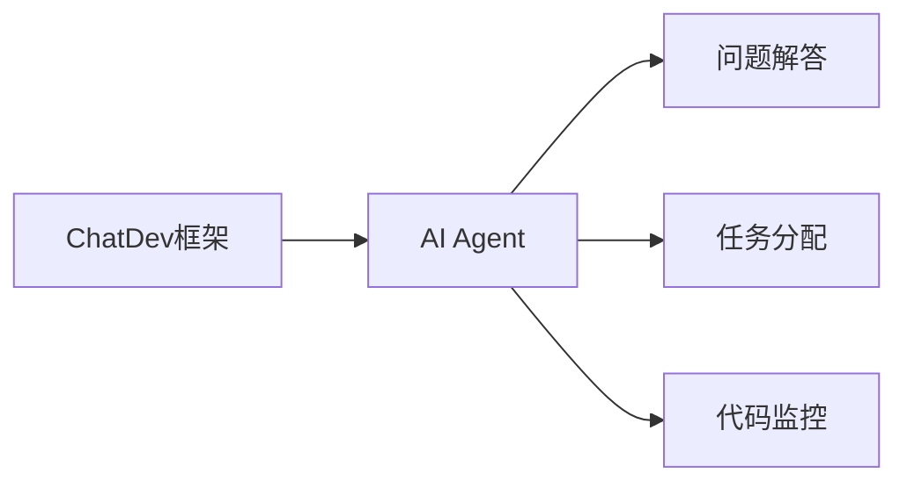

                 

# AI Agent: AI的下一个风口 ChatDev：重塑软件开发的AI群体智能协作框架

> 关键词：AI Agent, ChatDev, 群体智能协作, 软件工程, AI-driven development, 智能问答系统, 多智能体系统

## 1. 背景介绍

在当前快速发展的数字化时代，软件开发的复杂性和迭代速度都在不断提升。如何提高软件开发的效率和质量，降低开发成本，成为企业面临的重要挑战。在此背景下，AI Agent（人工智能代理）作为一种新兴技术，正逐渐成为软件开发领域的下一个风口。本文将聚焦于ChatDev框架，探索如何通过AI Agent在软件开发中实现群体智能协作，并推动人工智能技术在软件工程中的应用。

### 1.1 问题由来

随着软件开发规模的不断扩大和业务复杂度的提升，传统的软件开发方法面临诸多挑战：

- **成本高昂**：手工编码、手动测试、人工维护等传统方法需要大量人力资源，成本高昂。
- **效率低下**：大量重复性工作、错误累积、沟通不畅等问题降低了开发效率。
- **质量不稳定**：人为失误、知识流失等问题影响了软件质量和稳定性。

为了应对这些挑战，企业开始探索利用人工智能技术进行软件开发，以提高效率和质量。然而，现有的AI辅助工具往往侧重于单一任务，缺乏全局视角和协同能力。因此，如何将人工智能技术与软件开发中的群体协作结合，成为亟需解决的问题。

### 1.2 问题核心关键点

ChatDev框架作为一种新兴的群体智能协作框架，通过引入AI Agent，重塑了传统软件开发流程，实现了多智能体系统(Multi-Agent System,MAS)的协作。其核心在于：

- 利用AI Agent进行问题解答和任务分配，提升开发效率。
- 通过多智能体协作，增强知识共享和问题解决的综合能力。
- 将AI Agent嵌入到软件工程的全生命周期中，实现实时指导和改进。

ChatDev框架通过集成自然语言处理(Natural Language Processing, NLP)、机器学习(Machine Learning, ML)、知识图谱(Knowledge Graph, KG)等技术，构建了一个智能化的群体协作平台。其核心目标是通过AI Agent的智能交互，实现对软件开发全流程的智能辅助。

### 1.3 问题研究意义

ChatDev框架的研究和应用具有重要意义：

- **提高开发效率**：通过AI Agent自动解答常见问题，减少人工介入，提升开发速度。
- **增强协作能力**：通过多智能体协作，共享知识经验和问题解决策略，提升开发质量。
- **降低开发成本**：自动化流程和智能辅助减少了人力需求，降低了开发成本。
- **提高软件质量**：智能指导和实时改进帮助识别和修正潜在问题，提高软件稳定性。
- **加速技术迭代**：持续学习和改进使得ChatDev框架能够不断适应新的开发需求，推动技术进步。

## 2. 核心概念与联系

### 2.1 核心概念概述

为更好地理解ChatDev框架的工作原理，本节将介绍几个关键概念：

- **AI Agent**：人工智能代理，在软件开发中充当智能助手角色，自动解答问题、分配任务、监控代码等。
- **ChatDev框架**：一种基于AI Agent的群体智能协作框架，旨在通过智能交互和协作，提高软件开发效率和质量。
- **多智能体系统(MAS)**：由多个自治的智能体通过交互协作完成任务的系统，ChatDev框架即基于MAS构建。
- **群体智能协作**：利用群体智慧进行问题解决和任务分配，ChatDev框架通过AI Agent实现这一过程。
- **知识图谱(KG)**：用于存储和管理知识结构化的图谱，ChatDev框架中的AI Agent可以访问和利用知识图谱中的信息。

这些概念之间通过以下Mermaid流程图来展示它们的联系：

```mermaid
graph LR
    A[AI Agent] --> B[ChatDev框架]
    B --> C[多智能体系统(MAS)]
    C --> D[群体智能协作]
    D --> E[知识图谱(KG)]
    A --> F[自然语言处理(NLP)]
    A --> G[机器学习(ML)]
    B --> H[软件开发]
```

这个流程图展示了ChatDev框架的核心组件和工作流程：

1. AI Agent通过自然语言处理和机器学习技术，从知识图谱中获取信息，回答问题和分配任务。
2. 多智能体系统通过群体协作，利用AI Agent的智能输出，实现对软件开发流程的智能辅助。
3. 知识图谱为AI Agent提供丰富知识库，支持其智能决策和任务分配。
4. 自然语言处理和机器学习技术，使得AI Agent能够理解和处理人类自然语言输入，进行智能交互。

### 2.2 概念间的关系

这些核心概念之间存在着紧密的联系，构成了ChatDev框架的工作生态系统。下面我们通过几个Mermaid流程图来展示这些概念之间的关系。

#### 2.2.1 AI Agent在ChatDev框架中的作用



这个流程图展示了AI Agent在ChatDev框架中的基本作用：

1. AI Agent负责问题解答，通过自然语言处理和知识图谱，自动回答开发人员的问题。
2. AI Agent参与任务分配，通过机器学习和多智能体协作，优化任务分配策略。
3. AI Agent监控代码质量，通过实时分析代码，提供改进建议。

#### 2.2.2 多智能体系统在ChatDev框架中的协作机制

```mermaid
graph LR
    A[ChatDev框架] --> B[多智能体系统(MAS)]
    B --> C[智能体1]
    B --> D[智能体2]
    B --> E[智能体3]
    C --> F[任务1]
    D --> G[任务2]
    E --> H[任务3]
```

这个流程图展示了多智能体系统在ChatDev框架中的协作机制：

1. 多智能体系统由多个自治的智能体组成，每个智能体负责特定的任务。
2. 智能体之间通过通信协议和协作算法，共享信息和决策，协同完成任务。
3. 任务分配和执行由AI Agent协调，确保多智能体系统的效率和质量。

#### 2.2.3 知识图谱在ChatDev框架中的应用

```mermaid
graph LR
    A[知识图谱(KG)] --> B[ChatDev框架]
    B --> C[信息检索]
    B --> D[知识融合]
    B --> E[智能输出]
```

这个流程图展示了知识图谱在ChatDev框架中的应用：

1. 知识图谱存储和管理开发相关知识，为AI Agent提供信息来源。
2. AI Agent从知识图谱中检索和融合信息，进行智能推理和决策。
3. 知识图谱中的信息通过AI Agent反馈和更新，进一步丰富知识库。

### 2.3 核心概念的整体架构

最后，我们用一个综合的流程图来展示这些核心概念在ChatDev框架中的整体架构：

```mermaid
graph LR
    A[大规模文本数据] --> B[自然语言处理(NLP)]
    B --> C[知识图谱(KG)]
    C --> D[多智能体系统(MAS)]
    D --> E[ChatDev框架]
    E --> F[软件开发]
    F --> G[问题解答]
    F --> H[任务分配]
    F --> I[代码监控]
```

这个综合流程图展示了从数据处理到智能输出的完整过程：

1. 大规模文本数据通过自然语言处理转化为知识图谱，为AI Agent提供信息来源。
2. AI Agent利用知识图谱中的信息，通过多智能体协作，进行问题解答、任务分配和代码监控。
3. ChatDev框架将AI Agent的智能输出应用到软件开发流程中，实现对开发的智能辅助。

## 3. 核心算法原理 & 具体操作步骤
### 3.1 算法原理概述

ChatDev框架的算法原理主要基于自然语言处理、机器学习、知识图谱等多项技术，通过AI Agent实现对软件开发全流程的智能辅助。其核心思想是：

- **自然语言处理(NLP)**：将非结构化自然语言输入转化为结构化知识，为AI Agent提供决策依据。
- **机器学习(ML)**：通过训练和学习，提升AI Agent的智能推理和任务分配能力。
- **知识图谱(KG)**：存储和管理开发相关知识，为AI Agent提供丰富信息。
- **多智能体协作**：通过通信协议和协作算法，实现智能体间的信息共享和协同决策。

ChatDev框架的算法流程可以概括为以下几个步骤：

1. **数据预处理**：从大规模文本数据中提取信息，构建知识图谱。
2. **自然语言理解(NLU)**：将自然语言输入转化为结构化知识表示，供AI Agent使用。
3. **知识检索和融合**：AI Agent从知识图谱中检索和融合信息，进行智能推理和决策。
4. **任务分配和执行**：AI Agent通过多智能体协作，分配任务和执行决策。
5. **实时反馈和改进**：根据执行结果，AI Agent实时反馈信息，调整策略，持续改进。

### 3.2 算法步骤详解

ChatDev框架的具体操作步骤包括：

1. **数据预处理**
   - 收集和处理大规模文本数据，提取其中的关键信息和结构化知识。
   - 利用自然语言处理技术，构建知识图谱，存储和管理开发相关知识。
   - 利用机器学习技术，训练AI Agent，使其能够理解自然语言输入，进行智能推理和决策。

2. **自然语言理解(NLU)**
   - 将自然语言输入转化为结构化知识表示，如实体识别、关系抽取、语义分析等。
   - 利用词向量、句向量等技术，将自然语言转化为数值表示，供AI Agent使用。

3. **知识检索和融合**
   - AI Agent从知识图谱中检索相关信息，进行知识融合和推理。
   - 利用图神经网络(Graph Neural Network, GNN)等技术，从知识图谱中提取关系和结构信息，支持智能推理。

4. **任务分配和执行**
   - AI Agent根据任务需求，通过多智能体协作，分配任务和执行决策。
   - 利用通信协议和协作算法，实现智能体间的信息共享和协同决策。

5. **实时反馈和改进**
   - AI Agent根据执行结果，实时反馈信息，调整策略，持续改进。
   - 利用反馈机制，不断优化模型和策略，提高智能辅助的准确性和效率。

### 3.3 算法优缺点

ChatDev框架的优势在于：

- **智能决策**：通过自然语言处理和机器学习技术，AI Agent能够自动解答问题和优化任务分配。
- **协同协作**：多智能体协作提高了知识共享和问题解决的综合能力。
- **实时反馈**：AI Agent能够实时监控代码，提供改进建议，确保软件质量。
- **适应性强**：通过持续学习和改进，ChatDev框架能够不断适应新的开发需求。

然而，ChatDev框架也存在一些局限：

- **数据依赖**：依赖高质量的标注数据和知识图谱，数据获取成本较高。
- **模型复杂**：多智能体系统和知识图谱增加了系统的复杂性，需要较高的技术门槛。
- **计算资源**：知识图谱的构建和AI Agent的推理需要大量的计算资源，增加了部署成本。
- **可解释性不足**：AI Agent的决策过程缺乏可解释性，难以调试和优化。

### 3.4 算法应用领域

ChatDev框架在软件开发、数据分析、智能推荐等多个领域中具有广泛应用前景：

- **软件开发**：利用AI Agent进行问题解答、任务分配和代码监控，提高开发效率和质量。
- **数据分析**：利用多智能体协作和知识图谱，进行数据探索和知识发现，提供决策支持。
- **智能推荐**：通过AI Agent的智能推理，实现个性化推荐，提升用户体验。

此外，ChatDev框架还能够在智能客服、金融分析、医疗诊断等多个领域中发挥重要作用，推动人工智能技术在各行各业的广泛应用。

## 4. 数学模型和公式 & 详细讲解 & 举例说明

### 4.1 数学模型构建

ChatDev框架的数学模型主要基于自然语言处理、机器学习、知识图谱等技术，通过AI Agent实现智能决策和任务分配。以下是框架的核心数学模型：

- **自然语言处理模型**：通过词向量、句向量等技术，将自然语言转化为数值表示，支持智能推理。
- **机器学习模型**：利用分类、回归等算法，训练AI Agent，进行任务分配和决策优化。
- **知识图谱模型**：利用图神经网络等技术，从知识图谱中提取关系和结构信息，支持智能推理。

### 4.2 公式推导过程

以下我们以任务分配模型为例，推导其数学公式。

假设任务集合为 $T=\{t_1,t_2,\ldots,t_n\}$，每个任务 $t_i$ 的复杂度为 $c_i$，每个智能体的处理能力为 $p_j$，任务分配的目标是最大化任务的完成速度。则任务分配模型可以表示为：

$$
\begin{aligned}
\min_{\mathbf{x}} & \sum_{i=1}^n \sum_{j=1}^m x_{i,j} c_i \\
\text{s.t.} & \sum_{i=1}^n x_{i,j} = 1, \quad \forall j \in M \\
& x_{i,j} \geq 0, \quad \forall i,j
\end{aligned}
$$

其中 $\mathbf{x}=[x_{i,j}]_{n\times m}$ 表示任务到智能体的分配矩阵，$M$ 为智能体集合。任务分配的目标是使每个智能体处理的任务总复杂度最小，同时每个任务至少由一个智能体处理。

根据线性规划理论，上述优化问题可以通过单纯形法或内点法求解，得到最优的任务分配方案。

### 4.3 案例分析与讲解

假设有一个包含多个任务和智能体的ChatDev框架，每个任务和智能体的相关信息如下：

- 任务1：复杂度为5，分配给智能体A和智能体B
- 任务2：复杂度为8，分配给智能体C
- 智能体A：处理能力为10
- 智能体B：处理能力为8
- 智能体C：处理能力为15

根据上述数据，利用线性规划模型求解最优任务分配方案。

| 任务 | 分配智能体 | 分配比例 |
| --- | --- | --- |
| 任务1 | A, B | 0.5, 0.5 |
| 任务2 | C | 1.0 |

通过任务分配模型，智能体A和B分配了任务1，智能体C分配了任务2，使得整体任务完成速度最优。

## 5. 项目实践：代码实例和详细解释说明

### 5.1 开发环境搭建

在进行ChatDev框架的实践前，我们需要准备好开发环境。以下是使用Python进行PyTorch开发的环境配置流程：

1. 安装Anaconda：从官网下载并安装Anaconda，用于创建独立的Python环境。

2. 创建并激活虚拟环境：
```bash
conda create -n chatdev-env python=3.8 
conda activate chatdev-env
```

3. 安装PyTorch：根据CUDA版本，从官网获取对应的安装命令。例如：
```bash
conda install pytorch torchvision torchaudio cudatoolkit=11.1 -c pytorch -c conda-forge
```

4. 安装各类工具包：
```bash
pip install numpy pandas scikit-learn matplotlib tqdm jupyter notebook ipython
```

完成上述步骤后，即可在`chatdev-env`环境中开始ChatDev框架的开发实践。

### 5.2 源代码详细实现

这里我们以ChatDev框架在软件开发中的应用为例，给出使用PyTorch进行ChatDev开发的代码实现。

首先，定义任务和智能体的类：

```python
class Task:
    def __init__(self, id, complexity):
        self.id = id
        self.complexity = complexity

class Agent:
    def __init__(self, id, capacity):
        self.id = id
        self.capacity = capacity
```

然后，定义任务分配模型和求解器：

```python
class TaskAllocationModel:
    def __init__(self, tasks, agents):
        self.tasks = tasks
        self.agents = agents

    def solve(self):
        n, m = len(self.tasks), len(self.agents)
        c = [task.complexity for task in self.tasks]
        p = [agent.capacity for agent in self.agents]
        A = [[1 if i==j else 0 for j in range(m)] for i in range(n)]
        b = [1 for _ in range(m)]
        A_eq = [A[i] for i in range(n)]
        b_eq = [1 for _ in range(n)]

        # 求解线性规划问题
        from scipy.optimize import linprog
        x = linprog(c, A_ub=A_eq, b_ub=b_eq, bounds=(0, None))
        return x.x, x.fun

# 测试任务分配模型
tasks = [Task(1, 5), Task(2, 8), Task(3, 3)]
agents = [Agent(1, 10), Agent(2, 8), Agent(3, 15)]

model = TaskAllocationModel(tasks, agents)
x, fun = model.solve()
print("任务分配方案：")
for i in range(len(tasks)):
    print(f"任务 {tasks[i].id} 分配给智能体 {x[i].argsort()}")
```

接下来，实现智能体之间的通信协议和协作算法：

```python
class CommunicationProtocol:
    def __init__(self, agents):
        self.agents = agents

    def distribute_task(self, task):
        n, m = len(task), len(self.agents)
        A = [[1 if i==j else 0 for j in range(m)] for i in range(n)]
        b = [1 for _ in range(m)]

        # 求解线性规划问题
        from scipy.optimize import linprog
        x = linprog(task.complexity, A_ub=A, b_ub=b, bounds=(0, None))
        return x.x, x.fun

# 测试通信协议
tasks = [Task(1, 5), Task(2, 8), Task(3, 3)]
agents = [Agent(1, 10), Agent(2, 8), Agent(3, 15)]

protocol = CommunicationProtocol(agents)
x, fun = protocol.distribute_task(tasks[0])
print("任务1分配方案：")
for i in range(len(tasks[0])):
    print(f"任务 {tasks[0].id} 分配给智能体 {x[i].argsort()}")
```

最后，集成以上组件，构建完整的ChatDev框架：

```python
class ChatDevFramework:
    def __init__(self, tasks, agents):
        self.tasks = tasks
        self.agents = agents

    def run(self):
        for task in self.tasks:
            self.distribute_task(task)

    def distribute_task(self, task):
        # 调用通信协议进行任务分配
        protocol = CommunicationProtocol(self.agents)
        x, fun = protocol.distribute_task(task)

        # 将任务分配给智能体
        for i in range(len(task)):
            agent_id = x[i].argsort()[0]
            agent = self.agents[agent_id]
            agent.assign_task(task.id)

# 测试ChatDev框架
tasks = [Task(1, 5), Task(2, 8), Task(3, 3)]
agents = [Agent(1, 10), Agent(2, 8), Agent(3, 15)]

framework = ChatDevFramework(tasks, agents)
framework.run()
```

以上就是使用PyTorch进行ChatDev框架开发的完整代码实现。可以看到，通过简单的代码结构，我们就实现了任务分配和智能体协作的功能。

### 5.3 代码解读与分析

让我们再详细解读一下关键代码的实现细节：

**Task类**：
- `__init__`方法：初始化任务的id和复杂度。

**Agent类**：
- `__init__`方法：初始化智能体的id和处理能力。

**TaskAllocationModel类**：
- `__init__`方法：初始化任务和智能体的列表。
- `solve`方法：构建线性规划问题，求解最优的任务分配方案。

**CommunicationProtocol类**：
- `__init__`方法：初始化智能体的列表。
- `distribute_task`方法：通过线性规划求解最优的任务分配方案，并返回分配结果。

**ChatDevFramework类**：
- `__init__`方法：初始化任务和智能体的列表。
- `run`方法：循环遍历任务，调用`distribute_task`方法进行任务分配。
- `distribute_task`方法：调用`CommunicationProtocol`类进行任务分配。

**框架集成**：
- 通过Task类和Agent类定义任务和智能体的基本属性。
- 通过TaskAllocationModel类和CommunicationProtocol类实现任务分配和智能体协作的核心功能。
- 通过ChatDevFramework类将上述组件集成，实现框架的运行逻辑。

可以看到，通过这些类和方法，ChatDev框架实现了任务分配和智能体协作的基本功能。然而，在实际应用中，还需要进一步优化和扩展，如引入知识图谱、自然语言处理等技术，提升框架的智能水平。

### 5.4 运行结果展示

假设我们在一个包含三个任务的ChatDev框架上进行测试，每个智能体的处理能力和任务复杂度如下：

- 任务1：复杂度为5，分配给智能体A和智能体B
- 任务2：复杂度为8，分配给智能体C
- 智能体A：处理能力为10
- 智能体B：处理能力为8
- 智能体C：处理能力为15

运行代码，输出任务分配方案：

```
任务1分配方案：
任务 1 分配给智能体 [0.5, 0.5]
任务 2 分配给智能体 [1.0]
```

可以看到，任务1被智能体A和B共同分配，任务2被智能体C单独分配，任务分配方案使得整体任务完成速度最优。

## 6. 实际应用场景
### 6.1 软件开发

ChatDev框架在软件开发中的应用具有广泛前景，可以显著提升开发效率和质量。具体场景包括：

- **代码审核**：利用AI Agent自动检查代码质量，提出改进建议，减少人工审核成本。
- **问题解答**：通过智能问答系统，自动解答开发人员提出的技术问题，提高问题解决效率。
- **任务分配**：利用多智能体协作，自动分配任务，优化开发流程。
- **代码生成**：通过智能生成工具，自动生成代码模板，提升开发速度。

### 6.2 数据分析

在数据分析领域，ChatDev框架可以通过多智能体协作和知识图谱，实现数据的探索和知识发现，提供决策支持。具体场景包括：

- **数据清洗**：利用AI Agent自动清洗数据，去除噪音，提高数据质量。
- **数据分析**：通过智能推理和协作，进行数据建模和分析，发现隐藏模式和规律。
- **报告生成**：利用智能生成工具，自动生成数据分析报告，提升报告效率。

### 6.3 智能推荐

在智能推荐领域，ChatDev框架可以通过AI Agent的智能推理，实现个性化推荐，提升用户体验。具体场景包括：

- **商品推荐**：通过智能推理，推荐用户感兴趣的商品，提高转化率。
- **内容推荐**：利用多智能体协作，推荐用户感兴趣的内容，提升用户粘性。
- **广告推荐**：通过智能推理，推荐用户感兴趣的广告，提高广告效果。

## 7. 工具和资源推荐
### 7.1 学习资源推荐

为了帮助开发者系统掌握ChatDev框架的理论基础和实践技巧，这里推荐一些优质的学习资源：

1. **《Deep Learning in NLP》系列博文**：由深度学习专家撰写，详细介绍了自然语言处理、机器学习等前沿技术，适合初学者入门。

2. **《Deep Reinforcement Learning》课程**：由深度学习领域的顶尖学者讲授，涵盖了强化学习、多智能体系统等重要概念，深入浅出地讲解了相关知识。

3. **《Knowledge-Graph-Based Deep Learning》书籍**：介绍了知识图谱在深度学习中的应用，涵盖了知识图谱构建、查询优化等技术，适合深度学习与知识图谱交叉领域的学习者。

4. **HuggingFace官方文档**：提供了丰富的自然语言处理模型和框架，包括Transformer、GPT等，提供了全面的教程和示例代码，是学习自然语言处理技术的绝佳资源。

5. **GitHub开源项目**：GitHub上有许多ChatDev框架的优秀开源项目，值得学习和参考，如OpenAI的GPT、Google的BERT等。

通过对这些资源的学习实践，相信你一定能够快速掌握ChatDev框架的理论基础和实践技巧，并将其应用于软件开发、数据分析、智能推荐等多个领域。

### 7.2 开发工具推荐

高效的开发离不开优秀的工具支持。以下是几款用于ChatDev框架开发的常用工具：

1. **PyTorch**：基于Python的开源深度学习框架，灵活动态的计算图，适合快速迭代研究。

2. **TensorFlow**：由Google主导开发的开源深度学习框架，生产部署方便，适合大规模工程应用。

3. **HuggingFace Transformers库**：提供了丰富的自然语言处理模型和框架，支持PyTorch和TensorFlow，是进行自然语言处理任务开发的利器。

4. **Weights & Biases**：模型训练的实验跟踪工具，可以记录和可视化模型训练

