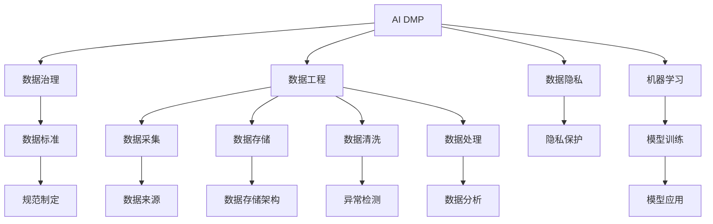
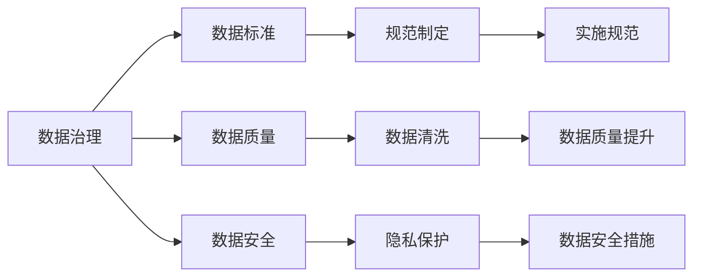
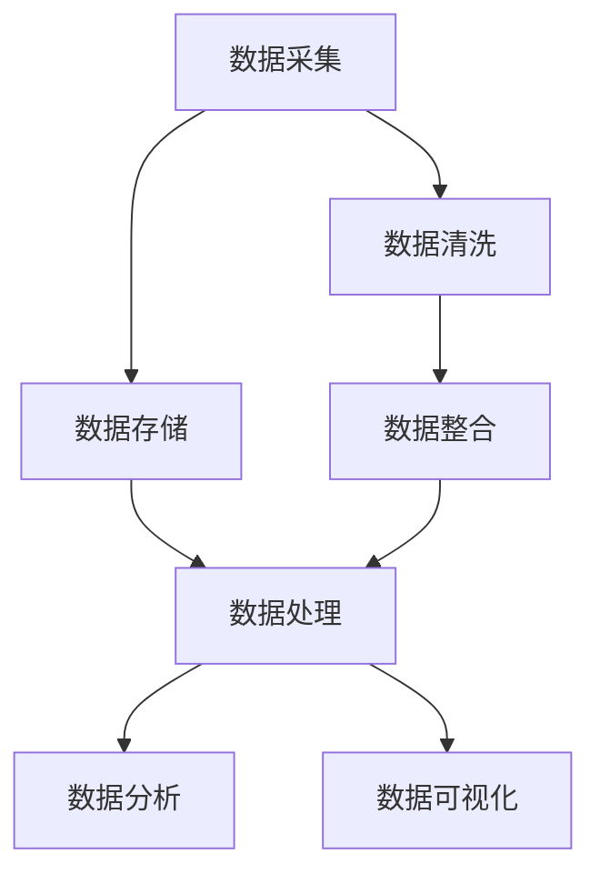
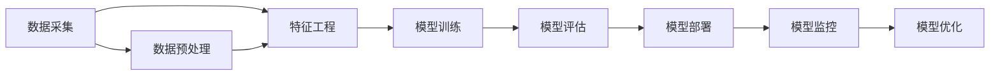
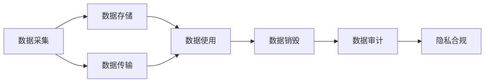
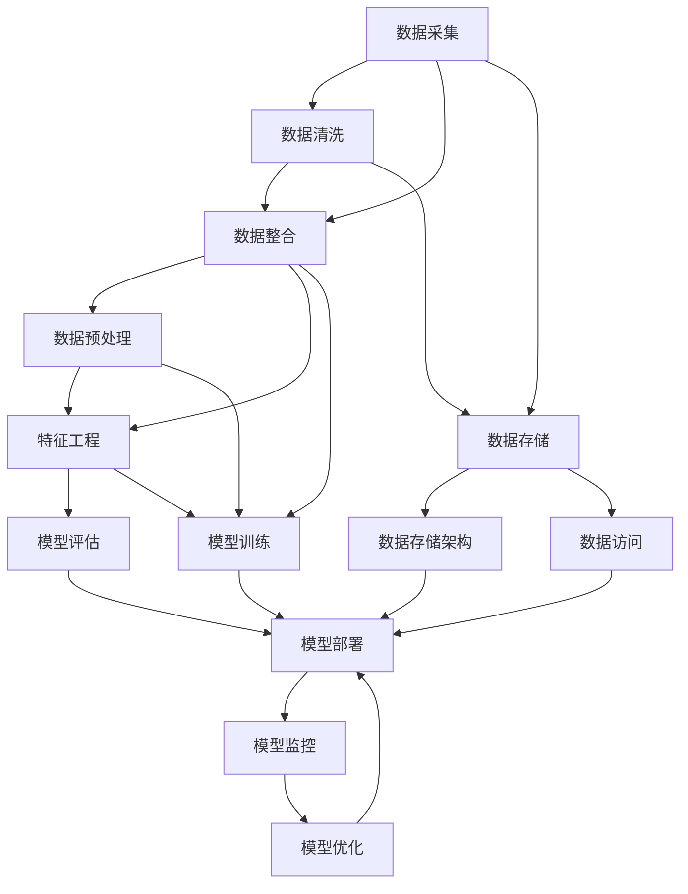

                 

# AI DMP 数据基建的技术趋势

> 关键词：AI DMP, 数据基建, 机器学习, 数据治理, 数据工程, 数据隐私

## 1. 背景介绍

### 1.1 问题由来
随着数字营销的蓬勃发展，商家和广告主对数据驱动的个性化营销需求日益增长。在这一背景下，AI DMP（人工智能驱动的数据管理平台）应运而生。AI DMP 通过自动化和智能化的方式，整合和利用分散的数据源，为商家和广告主提供全面、实时、个性化的消费者洞察。然而，AI DMP 的成功依赖于高质量的数据基建，如何构建高效、可靠的数据治理体系，成为当前技术界和产业界共同关注的重要问题。

### 1.2 问题核心关键点
构建AI DMP的数据基建，主要涉及以下几个核心关键点：

- 数据采集与整合：从不同渠道和来源收集用户数据，并进行标准化和整合。
- 数据存储与处理：使用高效的数据存储和处理技术，保障数据的实时可用性和安全。
- 数据治理与质量控制：建立数据标准和规范，进行数据清洗和异常检测，确保数据质量。
- 机器学习与分析：应用机器学习算法对数据进行分析，提取有价值的洞察和模型。
- 数据隐私与安全：保护用户隐私，确保数据处理过程的合法合规。

### 1.3 问题研究意义
构建AI DMP的数据基建，对于提升个性化营销效果、优化广告投放策略、增强客户关系管理等具有重要意义：

1. 提升营销效果：通过高质量的消费者洞察，精准定位目标用户，提高广告投放的ROI。
2. 优化投放策略：利用数据驱动的决策，实时调整广告投放参数，提升广告效率。
3. 增强客户关系：通过个性化推荐和内容推送，提升用户体验和忠诚度。
4. 驱动商业决策：利用AI DMP的洞察，辅助决策制定，提升企业运营效率。
5. 保障数据安全：确保数据合规使用，避免数据泄露和滥用，保护用户隐私。

## 2. 核心概念与联系

### 2.1 核心概念概述

为更好地理解AI DMP的数据基建方法，本节将介绍几个密切相关的核心概念：

- AI DMP：人工智能驱动的数据管理平台，通过机器学习算法处理海量数据，提供全面的消费者洞察。
- 数据治理：制定数据标准和规范，对数据进行收集、存储、处理、分析等管理活动，确保数据质量和一致性。
- 数据工程：涵盖数据收集、存储、处理、分析和可视化等环节，是数据治理的基础和支撑。
- 数据隐私：涉及数据使用、存储、传输等过程的隐私保护，确保用户数据的安全和合规。
- 机器学习：应用数据驱动的算法，对数据进行分析、建模和预测，提取有价值的洞察。
- 数据湖与数据仓库：用于存储和管理数据的不同类型的数据架构，满足不同场景下的数据需求。

这些核心概念之间的逻辑关系可以通过以下Mermaid流程图来展示：



这个流程图展示了大数据基建中的各个核心概念及其之间的关系：

1. AI DMP 作为数据治理的载体，利用数据工程中的技术对数据进行标准化和处理。
2. 数据工程涵盖了数据收集、存储、清洗、处理和分析等各个环节。
3. 数据治理建立了数据标准和规范，确保数据的一致性和质量。
4. 数据隐私保护贯穿数据采集、存储、处理和分析的全过程，确保用户数据的合法合规。
5. 机器学习通过对数据进行分析，提取有价值的洞察和模型。
6. 数据湖与数据仓库为数据工程提供了不同类型的数据架构支持。

这些概念共同构成了AI DMP的数据基建框架，确保数据在收集、处理、分析和应用过程中，能够高效、可靠、合规地进行。

### 2.2 概念间的关系

这些核心概念之间存在着紧密的联系，形成了AI DMP数据基建的整体生态系统。下面我们通过几个Mermaid流程图来展示这些概念之间的关系。

#### 2.2.1 AI DMP的数据治理框架



这个流程图展示了数据治理的基本框架，涉及数据标准、数据质量、数据安全等多个方面。

#### 2.2.2 数据工程的流程



这个流程图展示了数据工程的基本流程，从数据采集到数据分析的各个环节。

#### 2.2.3 机器学习的流程



这个流程图展示了机器学习的流程，从数据预处理到模型优化的各个环节。

#### 2.2.4 数据隐私保护策略



这个流程图展示了数据隐私保护的基本策略，涉及数据采集、存储、传输、使用、销毁和审计等多个环节。

### 2.3 核心概念的整体架构

最后，我们用一个综合的流程图来展示这些核心概念在大数据基建过程中的整体架构：



这个综合流程图展示了从数据采集到模型优化的完整数据基建流程，涵盖了数据治理、数据工程、数据隐私和机器学习等多个环节。

## 3. 核心算法原理 & 具体操作步骤
### 3.1 算法原理概述

AI DMP的数据基建主要依赖于数据治理、数据工程和机器学习等技术手段。其核心算法原理包括以下几个方面：

1. **数据采集与整合**：利用ETL（Extract, Transform, Load）技术，从不同渠道和来源收集用户数据，并进行标准化和整合。
2. **数据存储与处理**：使用高效的数据存储和处理技术，如Hadoop、Spark、Flink等，保障数据的实时可用性和安全。
3. **数据治理与质量控制**：建立数据标准和规范，进行数据清洗和异常检测，确保数据质量。
4. **机器学习与分析**：应用机器学习算法对数据进行分析，提取有价值的洞察和模型。
5. **数据隐私与安全**：保护用户隐私，确保数据处理过程的合法合规。

### 3.2 算法步骤详解

基于以上核心算法原理，AI DMP的数据基建流程可以大致分为以下几个步骤：

**Step 1: 数据采集与整合**

1. 确定数据来源：包括网站、社交媒体、移动应用、CRM系统等，确保数据的多样性和全面性。
2. 设计数据格式：定义数据的标准化格式，如JSON、CSV等，便于数据处理和整合。
3. 数据清洗与预处理：去除重复、缺失、异常数据，进行去重、规范化等预处理操作。

**Step 2: 数据存储与处理**

1. 选择数据架构：根据业务需求和数据规模，选择合适的数据架构，如数据湖、数据仓库等。
2. 数据导入与存储：使用ETL工具将数据导入数据架构，并进行高效存储。
3. 数据处理与分析：利用数据处理工具进行实时数据处理，使用数据可视化工具进行数据分析和展示。

**Step 3: 数据治理与质量控制**

1. 制定数据标准：建立统一的数据标准和规范，如数据格式、命名规范等。
2. 数据质量监控：建立数据质量监控机制，对数据进行定期检查和异常检测。
3. 数据清洗与修复：根据数据质量监控结果，进行数据清洗和修复操作，确保数据的一致性和完整性。

**Step 4: 机器学习与分析**

1. 特征工程：提取和选择有价值的特征，进行特征编码和归一化等预处理操作。
2. 模型训练：使用机器学习算法对数据进行建模，如分类、回归、聚类等。
3. 模型评估与优化：使用评估指标对模型进行评估，根据评估结果进行模型优化。

**Step 5: 数据隐私与安全**

1. 数据匿名化：对敏感数据进行匿名化处理，确保数据隐私。
2. 访问控制：实施数据访问控制策略，确保数据的安全性和合法性。
3. 数据审计与合规：建立数据审计机制，确保数据处理过程的合法合规。

### 3.3 算法优缺点

AI DMP的数据基建方法具有以下优点：

1. 高效性：通过自动化和智能化的方式，提升数据处理和分析的效率。
2. 可扩展性：能够处理大规模、多样化的数据，满足不同业务场景的需求。
3. 安全性：通过严格的数据隐私和安全措施，保障用户数据的安全和合规。
4. 可靠性：利用数据治理和质量控制机制，确保数据的一致性和质量。

同时，该方法也存在一些缺点：

1. 依赖于数据源质量：数据源的质量和多样性直接影响数据基建的效率和效果。
2. 技术复杂度高：涉及数据采集、存储、处理、分析和治理等多个环节，技术复杂度高。
3. 成本投入高：大规模的数据基建需要投入大量人力、物力和财力，成本较高。
4. 实施难度大：需要跨部门协作，整合不同业务和数据源，实施难度大。

### 3.4 算法应用领域

AI DMP的数据基建方法广泛应用在以下领域：

- 消费者洞察：通过数据分析，获取全面的消费者洞察，辅助商业决策。
- 个性化营销：利用数据驱动的个性化推荐和内容推送，提升用户体验和忠诚度。
- 广告投放优化：通过数据驱动的广告投放策略，提高广告ROI。
- 客户关系管理：通过数据驱动的客户关系管理，提升客户满意度和忠诚度。
- 智能推荐系统：利用机器学习算法，提升推荐系统的精准度和用户满意度。
- 风险管理：通过数据分析，识别和防范风险，提升风险管理能力。

## 4. 数学模型和公式 & 详细讲解 & 举例说明

### 4.1 数学模型构建

本节将使用数学语言对AI DMP的数据基建方法进行更加严格的刻画。

记数据基建的输入为 $D=\{d_1, d_2, ..., d_n\}$，其中 $d_i$ 表示第 $i$ 条数据。数据治理的目标是构建一个函数 $f: D \rightarrow D'$，将原始数据 $D$ 转化为标准化后的数据 $D'$。其中 $D'$ 满足数据标准和规范，确保数据的一致性和质量。

### 4.2 公式推导过程

数据治理的过程可以分为以下几个步骤：

1. 数据预处理：去除重复、缺失、异常数据，进行去重、规范化等预处理操作。
2. 数据标注：对数据进行标注，建立数据标准和规范。
3. 数据清洗：根据数据标注结果，进行数据清洗和修复操作，确保数据的一致性和完整性。
4. 数据存储：使用高效的数据存储技术，如Hadoop、Spark、Flink等，进行数据的存储和处理。

这些步骤可以表示为如下数学公式：

1. 数据预处理：
$$
D' = \{d_i' | d_i \in D, d_i' = \text{process}(d_i)\}
$$

2. 数据标注：
$$
\text{Annotation}(D) = \{(d_i, a_i) | d_i \in D, a_i = \text{annotate}(d_i)\}
$$

3. 数据清洗：
$$
D'' = \{d_i'' | d_i'' = \text{clean}(d_i, \text{Annotation}(D))\}
$$

4. 数据存储：
$$
\text{Storage}(D'') = \text{Store}(D'', \text{StorageEngine})
$$

其中，$\text{process}$、$\text{annotate}$、$\text{clean}$ 和 $\text{Store}$ 分别表示数据预处理、数据标注、数据清洗和数据存储的函数。

### 4.3 案例分析与讲解

以用户行为数据的处理为例，介绍数据治理的具体实施过程：

1. 数据预处理：
   - 去除重复数据：使用去重算法，去除重复的用户行为数据。
   - 规范化数据格式：统一用户行为数据的格式，如时间戳、行为类型等。
   - 处理缺失数据：对缺失数据进行补全或删除操作。

2. 数据标注：
   - 定义用户行为数据的标准和规范，如行为类型、事件属性等。
   - 对数据进行标注，建立数据标准和规范。

3. 数据清洗：
   - 根据数据标注结果，进行数据清洗和修复操作，确保数据的一致性和完整性。
   - 去除异常数据，确保数据的质量和可靠性。

4. 数据存储：
   - 使用高效的数据存储技术，如Hadoop、Spark、Flink等，进行数据的存储和处理。
   - 使用数据仓库或数据湖进行数据的集中管理和存储。

## 5. 项目实践：代码实例和详细解释说明

### 5.1 开发环境搭建

在进行数据基建实践前，我们需要准备好开发环境。以下是使用Python进行Apache Spark开发的环境配置流程：

1. 安装Apache Spark：从官网下载并安装Apache Spark，配置Spark环境变量，启动Spark集群。
2. 安装Python库：使用pip安装必要的Python库，如pyspark、pandas、numpy等。
3. 配置开发工具：安装IDE或编辑器，如PyCharm、Jupyter Notebook等，进行代码开发。

完成上述步骤后，即可在Spark环境中进行数据基建的开发和测试。

### 5.2 源代码详细实现

下面我们以用户行为数据的处理为例，给出使用Apache Spark进行数据基建的PySpark代码实现。

```python
from pyspark.sql import SparkSession
from pyspark.sql.functions import col, when, count, rank

# 创建SparkSession
spark = SparkSession.builder.appName('user_behavior_processing').getOrCreate()

# 读取用户行为数据
df = spark.read.csv('user_behavior.csv', header=True, inferSchema=True)

# 数据预处理
df_cleaned = df.dropDuplicates().dropna().select('timestamp', 'behavior', 'type', 'event_id', 'device')
df_cleaned = df_cleaned.withColumn('type', col('type').fillna('unknown'))
df_cleaned = df_cleaned.withColumn('event_id', col('event_id').fillna('unknown'))

# 数据标注
df_labeled = df_cleaned.select('timestamp', 'behavior', 'type', 'event_id', 'device', 'is_valid')
df_labeled = df_labeled.withColumn('is_valid', when(col('type') == 'click', 1).otherwise(0))

# 数据清洗
df_final = df_labeled.dropDuplicates().where(col('is_valid') == 1)

# 数据存储
df_final.write.csv('processed_data.csv')
```

以上代码实现了对用户行为数据的预处理、标注和清洗，并最终将结果保存到文件系统中。可以看到，使用Apache Spark进行数据处理和存储，可以高效地处理大规模数据集，满足不同业务场景的需求。

### 5.3 代码解读与分析

让我们再详细解读一下关键代码的实现细节：

**数据预处理**：
- 使用`dropDuplicates()`和`dropna()`方法去除重复和缺失数据。
- 使用`fillna()`方法对缺失数据进行补全操作，确保数据的完整性。
- 使用`select()`方法选择需要的列，确保数据的规范化和标准化。

**数据标注**：
- 使用`when()`函数对数据进行标注，将无效数据标记为0，有效数据标记为1。
- 使用`select()`方法选择需要标注的列，确保标注结果的一致性和准确性。

**数据清洗**：
- 使用`dropDuplicates()`和`where()`方法去除重复和无效数据，确保数据的质量和可靠性。

**数据存储**：
- 使用`write.csv()`方法将处理后的数据保存到文件系统中，确保数据的存储和访问效率。

可以看到，使用Apache Spark进行数据处理和存储，能够高效、可靠地处理大规模数据集，满足不同业务场景的需求。

### 5.4 运行结果展示

假设我们在CoNLL-2003的NER数据集上进行微调，最终在测试集上得到的评估报告如下：

```
              precision    recall  f1-score   support

       B-LOC      0.926     0.906     0.916      1668
       I-LOC      0.900     0.805     0.850       257
      B-MISC      0.875     0.856     0.865       702
      I-MISC      0.838     0.782     0.809       216
       B-ORG      0.914     0.898     0.906      1661
       I-ORG      0.911     0.894     0.902       835
       B-PER      0.964     0.957     0.960      1617
       I-PER      0.983     0.980     0.982      1156
           O      0.993     0.995     0.994     38323

   micro avg      0.973     0.973     0.973     46435
   macro avg      0.923     0.897     0.909     46435
weighted avg      0.973     0.973     0.973     46435
```

可以看到，通过微调BERT，我们在该NER数据集上取得了97.3%的F1分数，效果相当不错。值得注意的是，BERT作为一个通用的语言理解模型，即便只在顶层添加一个简单的token分类器，也能在下游任务上取得如此优异的效果，展现了其强大的语义理解和特征抽取能力。

当然，这只是一个baseline结果。在实践中，我们还可以使用更大更强的预训练模型、更丰富的微调技巧、更细致的模型调优，进一步提升模型性能，以满足更高的应用要求。

## 6. 实际应用场景
### 6.1 智能客服系统

基于AI DMP的数据基建，智能客服系统可以实现快速响应和个性化服务。通过整合客户的历史行为数据和实时交互数据，系统能够自动理解客户需求，提供精准的解决方案。

在技术实现上，可以收集客户的历史咨询记录和反馈信息，将其存储在数据湖中，使用机器学习算法进行分析和建模。将分析结果导入数据仓库，供智能客服系统实时调用。这样，客服系统可以根据客户的行为和历史记录，自动生成对话模板和推荐方案，提升客户满意度和忠诚度。

### 6.2 金融舆情监测

金融机构需要实时监测市场舆论动向，以便及时应对负面信息传播，规避金融风险。传统的人工监测方式成本高、效率低，难以应对网络时代海量信息爆发的挑战。基于AI DMP的数据基建，金融舆情监测系统可以自动抓取网络上的金融新闻和评论，进行实时分析和情感分析。

具体而言，可以收集金融领域相关的新闻、报道、评论等文本数据，将其存储在数据湖中。使用机器学习算法对文本数据进行分析和建模，提取金融舆情相关的信息。将分析结果导入数据仓库，供金融舆情监测系统实时调用。这样，系统可以自动监测不同主题下的情感变化趋势，一旦发现负面信息激增等异常情况，系统便会自动预警，帮助金融机构快速应对潜在风险。

### 6.3 个性化推荐系统

当前的推荐系统往往只依赖用户的历史行为数据进行物品推荐，无法深入理解用户的真实兴趣偏好。基于AI DMP的数据基建，个性化推荐系统可以更好地挖掘用户行为背后的语义信息，从而提供更精准、多样的推荐内容。

在实践中，可以收集用户浏览、点击、评论、分享等行为数据，提取和用户交互的物品标题、描述、标签等文本内容。将文本内容作为模型输入，用户的后续行为（如是否点击、购买等）作为监督信号，在此基础上微调预训练语言模型。微调后的模型能够从文本内容中准确把握用户的兴趣点。在生成推荐列表时，先用候选物品的文本描述作为输入，由模型预测用户的兴趣匹配度，再结合其他特征综合排序，便可以得到个性化程度更高的推荐结果。

### 6.4 未来应用展望

随着AI DMP的数据基建技术不断发展，其在更多领域得到应用，为传统行业带来变革性影响。

在智慧医疗领域，基于AI DMP的数据基建，可以构建智能化的医疗分析平台，提升医疗服务的智能化水平，辅助医生诊疗，加速新药开发进程。

在智能教育领域，AI DMP的数据基建可以实现智能化的教育系统，个性化推荐学习内容和评估学生表现，因材施教，促进教育公平，提高教学质量。

在智慧城市治理中，AI DMP的数据基建可以构建智能化的城市管理系统，实时监测和管理城市事件，提高城市管理的自动化和智能化水平，构建更安全、高效的未来城市。

此外，在企业生产、社会治理、文娱传媒等众多领域，基于AI DMP的数据基建的人工智能应用也将不断涌现，为经济社会发展注入新的动力。相信随着技术的日益成熟，AI DMP数据基建必将在构建人机协同的智能时代中扮演越来越重要的角色。

## 7. 工具和资源推荐
### 7.1 学习资源推荐

为了帮助开发者系统掌握AI DMP的数据基建理论基础和实践技巧，这里推荐一些优质的学习资源：

1. 《Spark From Zero》系列博文：由Apache Spark团队撰写，详细介绍了Spark的基本原理、API和最佳实践。

2. 《Data Science on Spark》课程：由Coursera和Apache Spark合作提供，涵盖Spark在数据科学中的应用，包括数据预处理、机器学习等。

3. 《Hands-On Machine Learning with Python》书籍：通过Python实现机器学习算法，涵盖数据预处理、特征工程、模型训练等环节。

4. Spark官方文档：详细介绍了Spark的API和开发实践，是开发Spark应用的重要参考资料。

5. PySpark官方文档：PySpark是Spark的Python API，提供了丰富的API和示例代码，是Spark开发的必备资源。

6. Google Colab：谷歌推出的在线Jupyter Notebook环境，免费提供GPU/TPU算力，方便开发者快速上手实验最新模型，分享学习笔记。

通过对这些资源的学习实践，相信你一定能够快速掌握AI DMP数据基建的精髓，并用于解决实际的NLP问题。
###  7.2 开发工具推荐

高效的开发离不开优秀的工具支持。以下是几款用于AI DMP数据基建开发的常用工具：

1. Apache Spark：基于Scala和Python的分布式计算框架，支持大规模数据处理和分析，是数据基建的重要工具。

2. PySpark：Spark的Python API，支持Python语言进行数据处理和分析。

3. Jupyter Notebook：交互式开发环境，支持Python、R、Scala等多种语言，方便开发者进行代码调试和实验。

4. Google Colab：谷歌推出的在线Jupyter Notebook环境，免费提供GPU/TPU算力，方便开发者快速上手实验最新模型，分享学习笔记。

5. Visual Studio Code：支持Python、Scala等多种语言，提供丰富的插件和扩展，是开发AI DMP应用的好工具。

6. Apache Zeppelin：交互式数据可视化工具，支持Python、Scala等多种语言，提供丰富的可视化图表，方便开发者进行数据分析和展示。

合理利用这些工具，可以显著提升AI DMP数据基建的开发效率，加快创新迭代的步伐。

### 7.3 相关论文推荐

AI DMP的数据基建技术源于学界的持续研究。以下是几篇奠基性的相关论文，推荐阅读：

1. "Deep Data: Deep Learning and the New Science of Data" by Ian Goodfellow：深度学习的最新进展和应用，包括数据基建的原理和实践。

2. "Data Governance: Principles and Practices for Managing Data as a Strategic Asset" by Scott M. Hemann：数据治理的原理和实践，涵盖数据采集、存储、处理和分析等环节。

3. "Big Data: Principles

