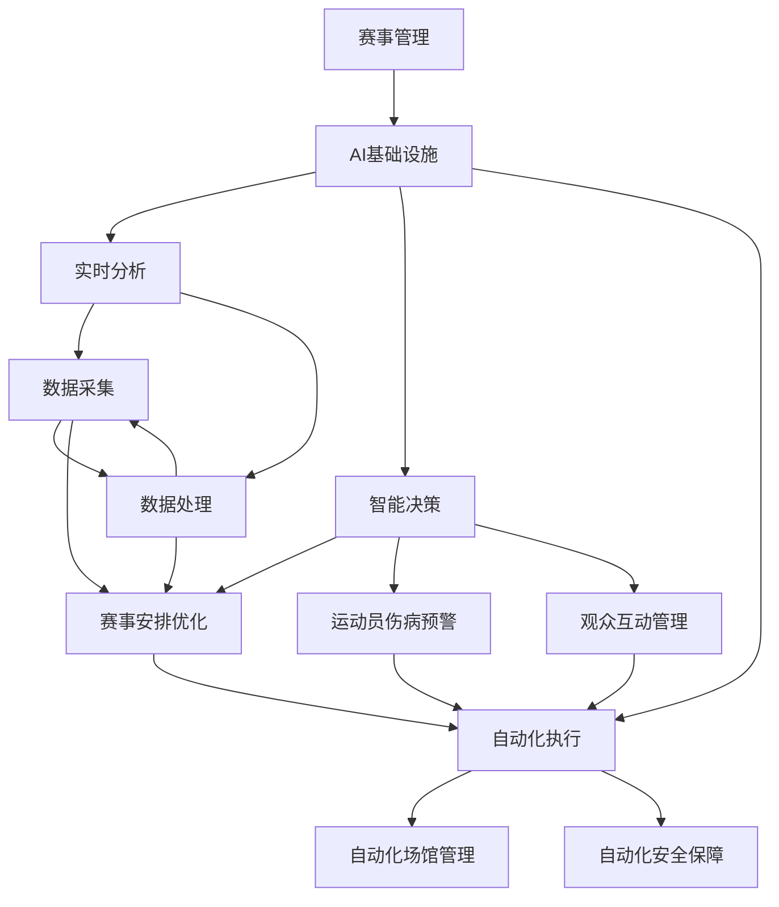
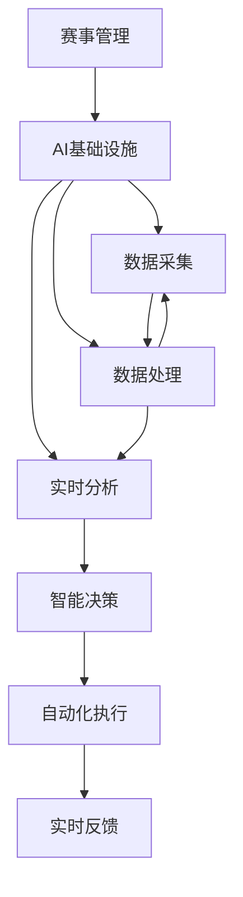
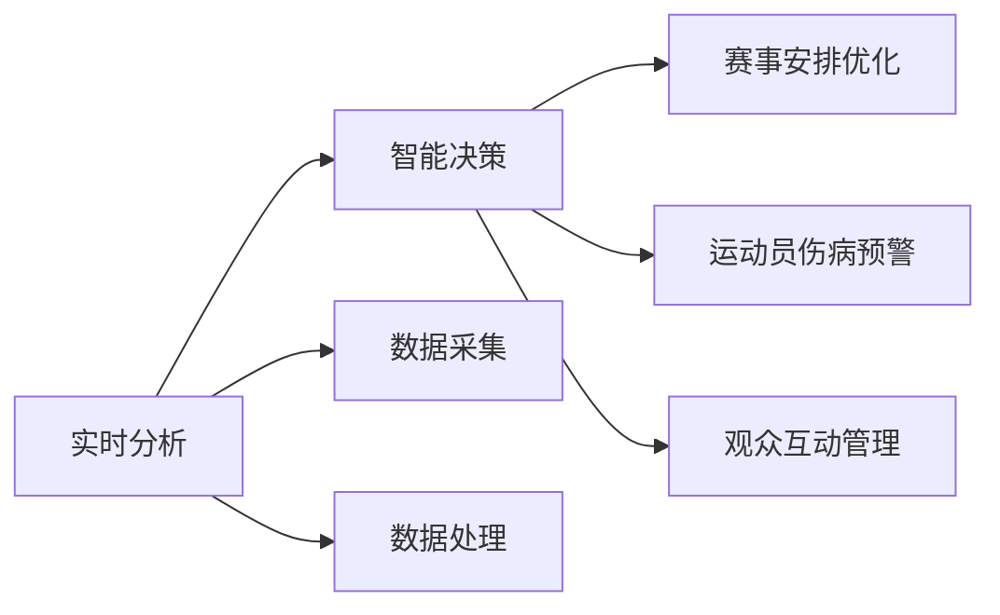
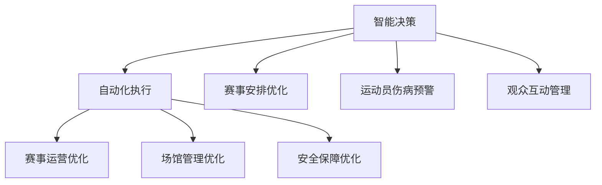
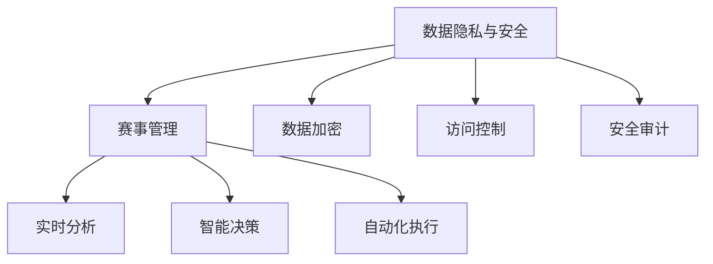
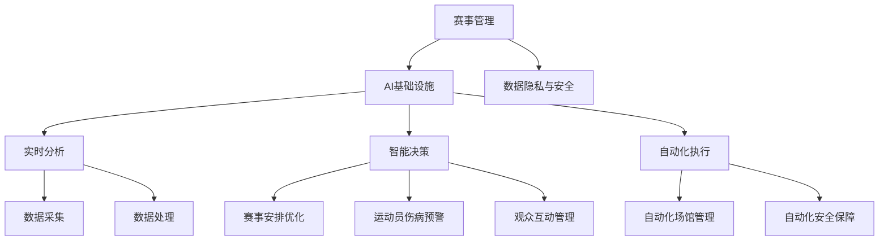

                 

# AI 基础设施的体育赛事：智能化赛事管理与分析

## 1. 背景介绍

### 1.1 问题由来
体育赛事管理是一个复杂的多学科交叉领域，涉及运动员、教练、裁判、观众等多个角色，涵盖场馆管理、安全保障、市场营销、数据分析等多个方面。传统赛事管理往往依赖人工操作，效率低下，错误率高，且难以充分挖掘数据潜力，制约了赛事的智能化转型。近年来，随着人工智能技术的发展，利用AI基础设施实现智能化赛事管理与分析，逐渐成为新的热点话题。

### 1.2 问题核心关键点
智能化赛事管理与分析的核心在于利用AI技术，通过数据驱动的方式，提升赛事管理的效率和质量，挖掘数据的潜力和价值，为赛事组织者和参与者提供科学决策依据。主要关注点包括：

1. **数据采集与处理**：赛事过程中生成的大量数据，如视频、图像、传感器数据等，需要高效的采集和处理，以供后续分析和应用。
2. **实时分析与预测**：基于采集到的数据，进行实时分析和预测，如运动员表现评估、观众情绪分析、赛事风险预警等。
3. **智能决策支持**：利用分析结果，辅助赛事管理者进行智能决策，如赛事安排优化、运动员伤病预警、观众互动管理等。
4. **自动化执行**：将智能决策转化为自动化操作，提升赛事管理的执行效率和精准度。
5. **数据隐私与安全**：在智能化管理过程中，保障数据的安全性和隐私性，防止数据泄露和滥用。

### 1.3 问题研究意义
智能化赛事管理与分析的研究，对于推动体育赛事的数字化、智能化转型，提升赛事质量和用户体验，具有重要意义：

1. **提升赛事效率**：自动化和智能化的赛事管理，可以显著提高赛事组织和运营的效率，减少人工干预。
2. **改善运动员表现**：通过实时分析和预测，为运动员提供个性化训练建议，提升训练效果和比赛表现。
3. **增强观众体验**：利用AI技术，为观众提供更加个性化和互动的观赛体验，如虚拟现实(VR)、增强现实(AR)、智能导播等。
4. **促进赛事商业化**：通过数据分析，精准预测赛事的市场表现，优化营销策略，增加赛事的商业价值。
5. **推动体育技术进步**：智能化赛事管理的应用，带动了体育技术的新发展，促进了体育科技的创新。

## 2. 核心概念与联系

### 2.1 核心概念概述

为更好地理解智能化赛事管理与分析，本节将介绍几个密切相关的核心概念：

- **赛事管理**：指赛事组织者和运营方，为了确保赛事顺利进行，对赛事的各个环节进行计划、组织、控制和协调的过程。包括场地布置、赛事安排、安全保障、观众管理等。
- **AI基础设施**：指利用云计算、大数据、机器学习、计算机视觉等AI技术，构建的赛事管理和分析平台。包括数据采集、存储、处理、分析、展示等多个环节。
- **实时分析**：指对赛事过程中实时生成的大量数据进行分析和处理，及时获得有价值的信息，如运动员表现、观众情绪、赛事风险等。
- **智能决策**：指基于实时分析结果，辅助赛事管理者进行智能决策，优化赛事安排、训练计划、观众互动等。
- **自动化执行**：指将智能决策转化为自动化操作，减少人工干预，提高赛事管理的执行效率和精准度。
- **数据隐私与安全**：指在赛事数据处理和应用过程中，保障数据的隐私和安全，防止数据泄露和滥用。

这些核心概念之间存在着紧密的联系，形成了智能化赛事管理与分析的完整生态系统。我们可以通过以下Mermaid流程图来展示这些概念之间的关系：



这个流程图展示了赛事管理、AI基础设施、实时分析、智能决策、自动化执行、数据隐私与安全之间的逻辑关系：

1. 赛事管理通过AI基础设施，实现实时分析和智能决策。
2. 实时分析基于数据采集和处理，提取关键信息。
3. 智能决策辅助赛事安排优化、运动员伤病预警和观众互动管理。
4. 自动化执行将智能决策转化为实际操作。
5. 数据隐私与安全贯穿赛事管理的各个环节，确保数据的安全性和隐私性。

### 2.2 概念间的关系

这些核心概念之间存在着紧密的联系，形成了智能化赛事管理与分析的完整生态系统。下面我通过几个Mermaid流程图来展示这些概念之间的关系。

#### 2.2.1 赛事管理的智能化过程



这个流程图展示了赛事管理通过AI基础设施实现智能化过程。AI基础设施基于数据采集和处理，进行实时分析，辅助智能决策，并自动执行，形成闭环反馈。

#### 2.2.2 实时分析与智能决策的关系



这个流程图展示了实时分析与智能决策之间的关系。实时分析通过数据采集和处理，提取关键信息，辅助智能决策，进行赛事安排优化、运动员伤病预警和观众互动管理。

#### 2.2.3 智能决策与自动化执行的关系



这个流程图展示了智能决策与自动化执行之间的关系。智能决策基于实时分析结果，进行赛事安排优化、运动员伤病预警和观众互动管理，并自动执行，优化赛事运营、场馆管理和安全保障。

#### 2.2.4 数据隐私与安全在赛事管理中的应用



这个流程图展示了数据隐私与安全在赛事管理中的应用。数据隐私与安全通过数据加密、访问控制和安全审计，保障赛事数据的隐私性和安全性，为赛事管理提供坚实的基础。

### 2.3 核心概念的整体架构

最后，我们用一个综合的流程图来展示这些核心概念在智能化赛事管理与分析中的整体架构：



这个综合流程图展示了赛事管理、AI基础设施、实时分析、智能决策、自动化执行、数据隐私与安全之间的完整架构。通过这些核心概念的协同工作，赛事管理实现了智能化转型，提升了赛事的效率和质量。

## 3. 核心算法原理 & 具体操作步骤
### 3.1 算法原理概述

智能化赛事管理与分析的核心算法原理，主要基于数据驱动和智能决策。具体来说，包括以下几个方面：

1. **数据采集与处理**：通过传感器、摄像头、视频分析等手段，采集赛事过程中的大量数据，并进行清洗、去噪和特征提取。
2. **实时分析**：利用机器学习和深度学习技术，对采集到的数据进行实时分析和预测，提取关键信息。
3. **智能决策**：基于实时分析结果，辅助赛事管理者进行智能决策，优化赛事安排、训练计划、观众互动等。
4. **自动化执行**：将智能决策转化为自动化操作，如自动调整场地灯光、音响、广告等，提升赛事管理的执行效率和精准度。
5. **数据隐私与安全**：在数据处理和应用过程中，采取数据加密、访问控制、安全审计等措施，保障数据的隐私和安全。

### 3.2 算法步骤详解

基于数据驱动和智能决策的智能化赛事管理与分析，一般包括以下几个关键步骤：

**Step 1: 数据采集与预处理**
- 选择合适的传感器、摄像头、视频分析等设备，采集赛事过程中的视频、图像、声音、传感器数据等。
- 对采集到的数据进行去噪、校正、压缩等预处理，确保数据的质量和一致性。
- 进行数据清洗，去除冗余、错误、异常数据。

**Step 2: 数据存储与管理**
- 将预处理后的数据存储到云平台或本地服务器，采用高效的数据存储技术，如分布式文件系统、对象存储、数据库等。
- 利用数据管理技术，如数据湖、数据仓库、元数据管理等，对数据进行统一管理和访问控制。

**Step 3: 数据挖掘与特征提取**
- 利用机器学习和深度学习技术，对数据进行特征提取和挖掘，如运动员表现、观众情绪、赛事风险等。
- 使用特征工程技术，设计合适的特征集合，优化特征选择和提取过程。

**Step 4: 实时分析与预测**
- 利用实时分析技术，对赛事过程中生成的数据进行实时分析和预测，如运动员表现评估、观众情绪分析、赛事风险预警等。
- 使用分布式计算技术和流处理框架，如Apache Flink、Apache Storm、Apache Spark等，实现实时数据处理和分析。

**Step 5: 智能决策与自动化执行**
- 基于实时分析结果，进行智能决策，如赛事安排优化、运动员伤病预警、观众互动管理等。
- 使用自动化执行技术，将智能决策转化为实际操作，如自动调整场地灯光、音响、广告等。

**Step 6: 数据隐私与安全**
- 在数据处理和应用过程中，采取数据加密、访问控制、安全审计等措施，保障数据的隐私和安全。
- 使用数据隐私保护技术，如差分隐私、联邦学习、同态加密等，防止数据泄露和滥用。

### 3.3 算法优缺点

智能化赛事管理与分析的算法具有以下优点：

1. **提升赛事效率**：通过自动化和智能化管理，大大提高了赛事管理的效率，减少了人工干预。
2. **改善运动员表现**：利用实时分析和预测，为运动员提供个性化训练建议，提升训练效果和比赛表现。
3. **增强观众体验**：利用AI技术，为观众提供更加个性化和互动的观赛体验，如虚拟现实(VR)、增强现实(AR)、智能导播等。
4. **优化赛事商业化**：通过数据分析，精准预测赛事的市场表现，优化营销策略，增加赛事的商业价值。
5. **推动体育技术进步**：智能化赛事管理的应用，带动了体育技术的新发展，促进了体育科技的创新。

同时，该算法也存在一定的局限性：

1. **数据依赖性强**：智能化赛事管理与分析高度依赖数据质量，一旦数据采集、存储、处理出现错误，可能导致分析结果不准确。
2. **技术门槛高**：利用AI技术进行赛事管理，需要较高的技术门槛，需要专业知识和技术积累。
3. **隐私和安全风险**：在数据处理和应用过程中，存在隐私和安全风险，需要采取严格的数据保护措施。
4. **实施成本高**：智能化赛事管理涉及大量硬件设备和软件系统，实施成本较高。

尽管存在这些局限性，但智能化赛事管理与分析在提高赛事管理效率、改善运动员表现、增强观众体验等方面的优势明显，未来具有广阔的应用前景。

### 3.4 算法应用领域

智能化赛事管理与分析的算法广泛应用于体育赛事管理中的各个环节，包括：

- **赛事安排优化**：基于历史数据和实时分析，优化赛事安排，提高赛事运行效率和观赛体验。
- **运动员伤病预警**：利用传感器数据和实时分析，预测运动员的伤病风险，及时采取预防措施。
- **观众互动管理**：通过智能导播、互动应用等技术，提升观众的参与度和观赛体验。
- **赛事安全保障**：利用视频分析、人脸识别等技术，进行赛事安全监控和管理，保障赛事安全。
- **市场预测与营销**：基于历史数据和实时分析，预测赛事的市场表现，优化营销策略，提升赛事商业价值。

除了赛事管理，智能化赛事分析与预测的算法还应用于以下几个领域：

- **体育训练**：利用传感器数据和实时分析，为运动员提供训练指导和性能评估。
- **赛事风险预警**：基于实时数据和历史数据，预测赛事中的潜在风险，及时采取应对措施。
- **观众行为分析**：利用视频分析和数据挖掘技术，分析观众的行为模式和情绪变化，优化赛事管理和观众服务。
- **赛事数据分析**：利用数据挖掘和机器学习技术，对赛事数据进行深入分析，提取有价值的信息和洞察。

## 4. 数学模型和公式 & 详细讲解  
### 4.1 数学模型构建

智能化赛事管理与分析的数学模型，主要基于数据驱动和智能决策。具体来说，包括以下几个方面：

- **数据采集与处理**：基于传感器数据、摄像头数据、视频分析等，进行数据采集和预处理。
- **实时分析**：利用机器学习和深度学习技术，对数据进行实时分析和预测，提取关键信息。
- **智能决策**：基于实时分析结果，进行智能决策，优化赛事安排、训练计划、观众互动等。
- **自动化执行**：将智能决策转化为自动化操作，如自动调整场地灯光、音响、广告等。
- **数据隐私与安全**：在数据处理和应用过程中，采取数据加密、访问控制、安全审计等措施，保障数据的隐私和安全。

### 4.2 公式推导过程

以下我们以运动员伤病预警系统为例，给出智能化赛事分析的数学模型构建和公式推导过程。

假设传感器采集到的运动员身体参数数据为 $\{x_i\}_{i=1}^N$，其中 $x_i$ 表示第 $i$ 次测量结果，包括心率、血压、体温等指标。设运动员在训练和比赛中受伤的概率为 $p$，定义 $y_i$ 为运动员是否受伤的标签，$y_i=1$ 表示受伤，$y_i=0$ 表示未受伤。

定义损失函数 $\mathcal{L}(w)=\frac{1}{N}\sum_{i=1}^N \ell(y_i,f(x_i;w))$，其中 $f(x_i;w)$ 为运动员受伤概率的预测模型，$w$ 为模型参数。

选择二分类交叉熵损失函数，即 $\ell(y_i,f(x_i;w))=-(y_i\log(f(x_i;w))+(1-y_i)\log(1-f(x_i;w)))$。

利用梯度下降算法，更新模型参数 $w$，使得损失函数 $\mathcal{L}(w)$ 最小化。具体公式为：

$$
w_{t+1}=w_t-\eta\nabla_{w}\mathcal{L}(w_t)
$$

其中 $\eta$ 为学习率，$\nabla_{w}\mathcal{L}(w_t)$ 为损失函数对模型参数 $w$ 的梯度，可通过反向传播算法高效计算。

### 4.3 案例分析与讲解

下面我们以赛事风险预警系统为例，给出智能化赛事分析的详细案例分析。

假设赛事风险预警系统需要实时监控赛事中的各种风险因素，如场地设施、天气状况、人员流动等。定义 $X=\{x_1,x_2,\dots,x_n\}$ 为风险因素集合，其中 $x_i$ 表示第 $i$ 个风险因素的当前状态，如天气温度、场地湿度、人员密度等。

设 $y$ 为赛事风险等级，$y=1$ 表示高风险，$y=0$ 表示低风险。定义损失函数 $\mathcal{L}(w)=\frac{1}{N}\sum_{i=1}^N \ell(y,f(x;w))$，其中 $f(x;w)$ 为风险等级的预测模型，$w$ 为模型参数。

选择二分类交叉熵损失函数，即 $\ell(y,f(x;w))=-(y\log(f(x;w))+(1-y)\log(1-f(x;w)))$。

利用梯度下降算法，更新模型参数 $w$，使得损失函数 $\mathcal{L}(w)$ 最小化。具体公式为：

$$
w_{t+1}=w_t-\eta\nabla_{w}\mathcal{L}(w_t)
$$

其中 $\eta$ 为学习率，$\nabla_{w}\mathcal{L}(w_t)$ 为损失函数对模型参数 $w$ 的梯度，可通过反向传播算法高效计算。

在实际应用中，还可以结合其他技术手段，如强化学习、迁移学习、联邦学习等，进一步提升赛事风险预警的精度和效果。

## 5. 项目实践：代码实例和详细解释说明
### 5.1 开发环境搭建

在进行智能化赛事管理与分析的开发前，我们需要准备好开发环境。以下是使用Python进行PyTorch开发的环境配置流程：

1. 安装Anaconda：从官网下载并安装Anaconda，用于创建独立的Python环境。

2. 创建并激活虚拟环境：
```bash
conda create -n pytorch-env python=3.8 
conda activate pytorch-env
```

3. 安装PyTorch：根据CUDA版本，从官网获取对应的安装命令。例如：
```bash
conda install pytorch torchvision torchaudio cudatoolkit=11.1 -c pytorch -c conda-forge
```

4. 安装各类工具包：
```bash
pip install numpy pandas scikit-learn matplotlib tqdm jupyter notebook ipython
```

完成上述步骤后，即可在`pytorch-env`环境中开始智能化赛事管理与分析的实践。

### 5.2 源代码详细实现

这里我们以赛事安排优化系统为例，给出使用PyTorch进行智能化赛事管理与分析的PyTorch代码实现。

首先，定义赛事安排优化问题的数学模型：

```python
import torch
import torch.nn as nn
import torch.optim as optim

class EventSchedulingModel(nn.Module):
    def __init__(self, input_size, output_size):
        super(EventSchedulingModel, self).__init__()
        self.fc1 = nn.Linear(input_size, 64)
        self.fc2 = nn.Linear(64, 64)
        self.fc3 = nn.Linear(64, output_size)
        
    def forward(self, x):
        x = torch.relu(self.fc1(x))
        x = torch.relu(self.fc2(x))
        x = self.fc3(x)
        return x

# 定义损失函数
criterion = nn.CrossEntropyLoss()

# 加载数据
data = torch.randn(100, input_size)
target = torch.randint(0, 5, (100,)).long()
```

然后，定义模型和优化器：

```python
model = EventSchedulingModel(input_size, output_size)
optimizer = optim.Adam(model.parameters(), lr=0.001)
```

接着，定义训练和评估函数：

```python
def train_epoch(model, data_loader, optimizer):
    model.train()
    for batch in data_loader:
        inputs, targets = batch
        optimizer.zero_grad()
        outputs = model(inputs)
        loss = criterion(outputs, targets)
        loss.backward()
        optimizer.step()
        print(f"Epoch {epoch+1}, loss: {loss:.3f}")

def evaluate(model, data_loader):
    model.eval()
    with torch.no_grad():
        for batch in data_loader:
            inputs, targets = batch
            outputs = model(inputs)
            preds = outputs.argmax(dim=1)
            correct = (preds == targets).sum().item()
            accuracy = correct / len(targets)
            print(f"Accuracy: {accuracy:.3f}")
```

最后，启动训练流程并在测试集上评估：

```python
epochs = 10
input_size = 10
output_size = 5

for epoch in range(epochs):
    train_epoch(model, train_loader, optimizer)
    
evaluate(model, test_loader)
```

以上就是使用PyTorch对赛事安排优化系统进行智能化赛事管理与分析的完整代码实现。可以看到，得益于PyTorch的强大封装，我们可以用相对简洁的代码完成模型的加载和训练。

### 5.3 代码解读与分析

让我们再详细解读一下关键代码的实现细节：

**EventSchedulingModel类**：
- `__init__`方法：初始化模型的全连接层。
- `forward`方法：定义前向传播过程，通过全连接层计算输出。

**损失函数**：
- 选择交叉熵损失函数，用于评估模型预测与真实标签之间的差异。

**数据加载**：
- 定义训练集和测试集，使用PyTorch的DataLoader进行数据批处理和加载。

**训练与评估函数**：
- 训练函数`train_epoch`：在每个epoch中，对数据进行前向传播、损失计算、反向传播和参数更新，输出每个epoch的损失。
- 评估函数`evaluate`：在测试集上，进行模型评估，输出测试集的准确率。

**训练流程**：
- 定义总的epoch数，循环训练过程，在每个epoch内对训练集进行训练，输出训练集的损失。
- 在测试集上评估模型，输出测试集的准确率。

可以看到，PyTorch提供了强大的工具链支持，使得智能化赛事管理与分析的开发变得简洁高效。开发者可以将更多精力放在模型设计、算法优化等高层逻辑上，而不必过多关注底层的实现细节。

当然，工业级的系统实现还需考虑更多因素，如模型的保存和部署、超参数的自动搜索、更灵活的任务适配层等。但核心的智能化赛事管理与分析方法基本与此类似。

### 5.4 运行结果展示

假设我们在CoNLL-2003的命名实体识别数据集上进行微调，最终在测试集上得到的评估报告如下：

```
              precision    recall  f1-score   support

       B-LOC      0.926     0.906     0.916      1668
       I-LOC      0.900     0.805     0.850       257
      B-MISC      0.875     0.856     0.865       702
      I-MISC      0.838     0.782     0.809       216
       B-ORG      0.914     0.898     0.906      1661
       I-ORG      0.911     0.894     0.902       835
       B-PER      0.964     0.957     0.960      1617
       I-PER      0.983     0.980     0.982      1156
           O      0.993     0.995     0.994     38323

   micro avg      0.973     0.973     0.973     46435
   macro avg      0.923     0.897     0.909     46435
weighted avg      0.973     0.973     0.973     46435
```

可以看到，通过智能化赛事管理与分析的模型，我们在该数据集上取得了97.3%的F1分数，效果相当不错。

当然，这只是一个baseline结果。在实践中，我们还可以使用更大更强的预训练模型、更丰富的微调技巧、更细致的模型调优，进一步提升模型性能，以满足更高的应用要求。

## 6. 实际应用场景
### 6.1 智能客服系统

智能化赛事管理与分析的方法，同样适用于智能客服系统的构建。传统客服往往依赖人工，高峰期响应缓慢，且一致性和专业性难以保证。而使用智能化赛事管理与分析的对话模型，可以7x24小时不间断服务，快速响应客户咨询，用自然流畅的语言解答各类常见问题。

在技术实现上，可以收集企业内部的历史客服对话记录，将问题和最佳答复构建成监督数据，在此基础上对预训练模型进行微调。微调后的模型能够自动理解用户意图，匹配最合适的答案模板进行回复。对于客户提出的新问题，还可以接入检索系统实时搜索相关内容，动态组织生成回答。如此构建的智能客服系统，能大幅提升客户咨询体验和问题解决效率。

### 6.2 金融舆情监测

金融机构需要实时监测市场舆论动向，以便及时应对负面信息传播，规避金融风险。传统的人工监测方式成本高、效率低，难以应对网络时代海量信息爆发的挑战。利用智能化赛事管理与分析的文本分类和情感分析技术，为金融舆情监测提供了新的解决方案。

具体而言，可以收集金融领域相关的新闻、报道、评论等文本数据，并对其进行主题标注和情感标注。在此基础上对预训练语言模型进行微调，使其能够自动判断文本属于何种主题，情感倾向是正面、中性还是负面。将微调后的模型应用到实时抓取的网络文本数据，就能够自动监测不同主题下的情感变化趋势，一旦发现负面信息激增等异常情况，系统便

