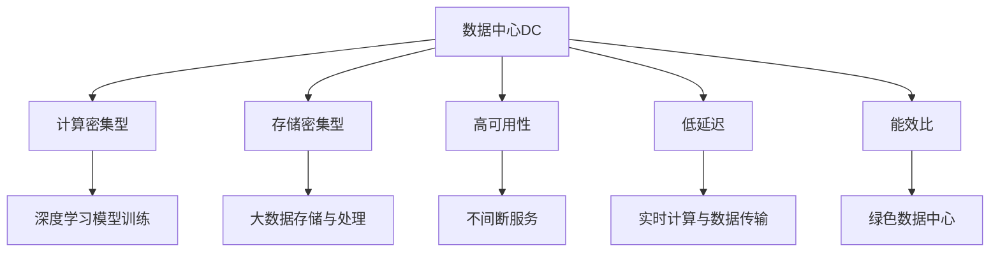
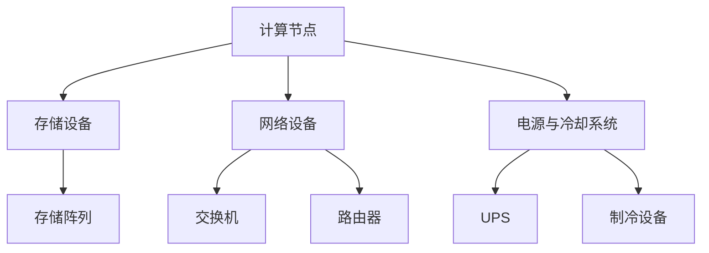
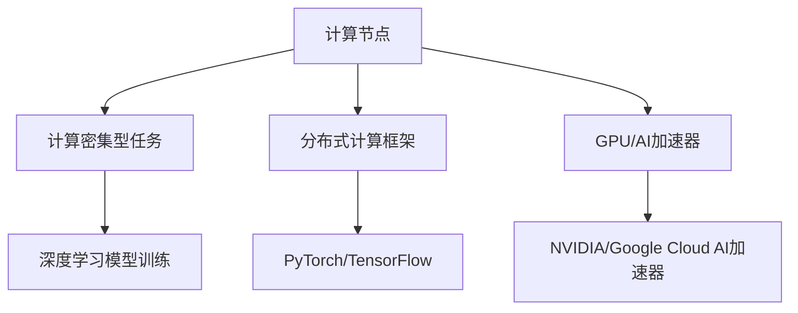
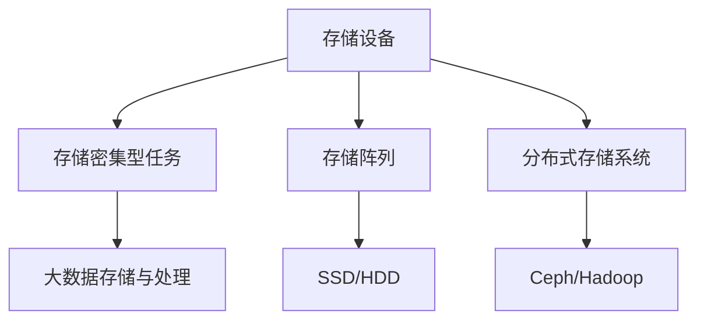
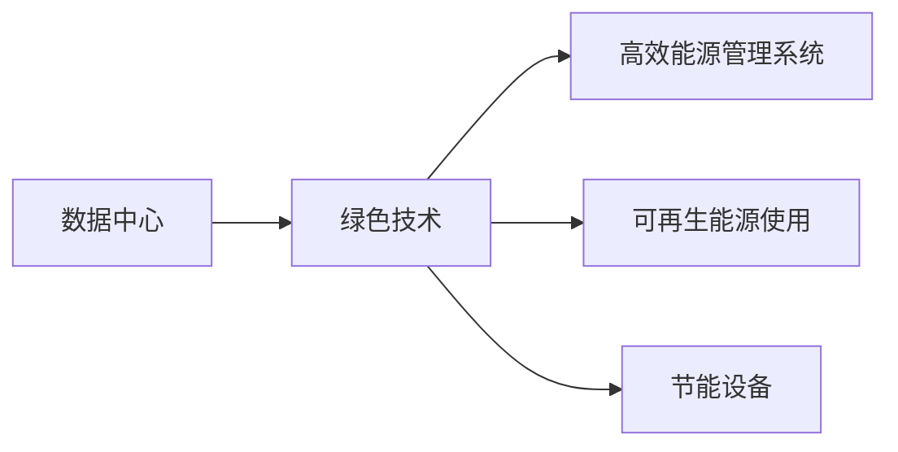
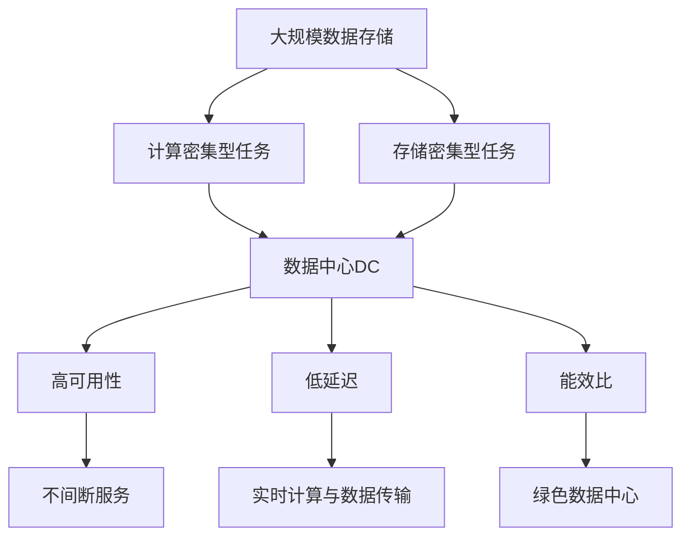

                 

# AI 大模型应用数据中心建设：数据中心产业发展

## 1. 背景介绍

### 1.1 问题由来
随着人工智能（AI）技术的迅猛发展，尤其是深度学习、自然语言处理、计算机视觉等领域的突破，数据中心（Data Center, DC）已成为支撑AI大模型训练与推理的核心基础设施。越来越多的AI大模型依赖于大规模计算资源和海量数据存储，推动了数据中心产业的快速发展。

然而，数据中心建设和管理面临诸多挑战，如能耗高、网络延迟大、硬件成本高等问题，严重影响了AI大模型的应用效果和用户体验。因此，如何建设高效、绿色、可扩展的数据中心，成为数据中心产业发展的重要研究方向。

### 1.2 问题核心关键点
数据中心的核心目标是提供高性能、高可靠、高可用、低延迟的计算和存储服务，同时确保数据安全和隐私保护。构建数据中心的难点在于：

- 数据中心的选址和基础设施建设需要考虑能耗、散热、地理位置、电力供应等综合因素。
- 数据中心的网络架构设计必须保证高速稳定的网络传输，支持大规模数据并行计算。
- 数据中心的存储系统需具备高容量、高性能和高可靠性的特点，支持大数据量的存储和处理。
- 数据中心的安全措施必须确保数据传输和存储的安全性，防止数据泄露和未授权访问。

### 1.3 问题研究意义
研究数据中心建设技术，对于推动AI大模型的应用落地，提升计算资源的利用率，构建高效、绿色、安全的数据中心系统，具有重要意义：

- 降低计算成本：高效的数据中心设计可以大幅降低AI大模型的计算成本，使更多中小企业能够使用AI技术。
- 提升模型性能：绿色、高性能的数据中心能够提供更强大的计算能力，支持更大规模、更复杂的AI大模型训练与推理。
- 促进技术创新：数据中心技术的发展有助于推动AI技术的多样化应用，带来新的技术突破和产业变革。
- 保障数据安全：安全可靠的数据中心能够保障AI大模型训练与推理过程中的数据安全，防止数据泄露和滥用。

## 2. 核心概念与联系

### 2.1 核心概念概述

为更好地理解数据中心在AI大模型中的应用，本节将介绍几个密切相关的核心概念：

- 数据中心(Data Center, DC)：由多个计算节点、存储设备、网络设备等组成的大型基础设施，提供高性能、高可靠性的计算和存储服务。
- AI大模型(AI Large Model)：以Transformer、BERT、GPT等为代表的深度学习模型，具有大规模参数量、高度复杂性和广泛应用性。
- 计算密集型(Calculatively Intensive)：指需要大量计算资源和算法优化的任务，如深度学习模型训练。
- 存储密集型(Storage Intensive)：指需要大量存储空间和高效读写速度的任务，如大数据存储与处理。
- 高可用性(High Availability)：指数据中心系统能够不间断地提供服务，即便部分硬件或网络故障也能够迅速恢复。
- 低延迟(Low Latency)：指数据中心系统能够提供快速响应和高并发能力，满足实时计算与数据传输需求。
- 能效比(Energy Efficiency Ratio, EER)：指数据中心的能耗与其提供的计算能力之比，反映数据中心的绿色程度。

这些核心概念之间的逻辑关系可以通过以下Mermaid流程图来展示：



这个流程图展示了大模型在数据中心中的主要应用场景，以及各个概念之间的关系：

1. 数据中心由多个计算节点、存储设备、网络设备等组成。
2. 数据中心提供高性能、高可靠性的计算和存储服务。
3. 数据中心中的计算密集型任务，如深度学习模型训练，需要大量计算资源和算法优化。
4. 数据中心中的存储密集型任务，如大数据存储与处理，需要大量存储空间和高效读写速度。
5. 数据中心中的高可用性系统，可以提供不间断的服务，满足企业的稳定性和可靠性需求。
6. 数据中心中的低延迟系统，可以满足实时计算与数据传输需求，支持高性能应用的运行。
7. 数据中心的能效比，反映了绿色程度，关注环境保护和能源利用效率。

这些核心概念共同构成了数据中心的基础框架，为大模型在数据中心中的应用提供了坚实的基础。通过理解这些概念，我们可以更好地把握数据中心建设的方向和目标。

### 2.2 概念间的关系

这些核心概念之间存在着紧密的联系，形成了数据中心建设的技术框架。下面我们通过几个Mermaid流程图来展示这些概念之间的关系。

#### 2.2.1 数据中心的基础架构



这个流程图展示了数据中心的基础架构，包括计算节点、存储设备、网络设备、电源与冷却系统等关键组件。

#### 2.2.2 数据中心的计算密集型任务



这个流程图展示了数据中心中的计算密集型任务，包括分布式计算框架、GPU/AI加速器等技术支持。

#### 2.2.3 数据中心的存储密集型任务



这个流程图展示了数据中心中的存储密集型任务，包括存储阵列、分布式存储系统等技术支持。

#### 2.2.4 数据中心的绿色技术



这个流程图展示了数据中心的绿色技术，包括高效能源管理系统、可再生能源使用、节能设备等。

### 2.3 核心概念的整体架构

最后，我们用一个综合的流程图来展示这些核心概念在大模型微调过程中的整体架构：



这个综合流程图展示了从数据存储到计算密集型任务，再到绿色数据中心的完整过程。数据中心系统通过提供高性能、高可靠性的计算和存储服务，支持大规模数据密集型和计算密集型任务。通过高效的能源管理、可再生能源使用和节能设备，数据中心系统可以实现绿色、环保的目标。通过高可用性和低延迟设计，数据中心系统可以满足实时计算与数据传输需求，支持高性能应用的运行。

## 3. 核心算法原理 & 具体操作步骤
### 3.1 算法原理概述

数据中心的计算密集型任务，如AI大模型训练与推理，通常需要大规模的计算资源和算法优化。算法原理主要包括以下几个方面：

- 分布式计算框架：如TensorFlow、PyTorch等，支持大规模模型的并行计算与优化。
- GPU/AI加速器：如NVIDIA的A100、Google的TPU等，加速计算密集型任务的运行。
- 异步通信：如环形、树形等异步通信算法，降低网络延迟，提高并行计算效率。
- 自动混合精度计算：通过自动调整计算精度，在保证精度的前提下提高计算效率。

### 3.2 算法步骤详解

数据中心中的计算密集型任务，如AI大模型训练与推理，通常包括以下关键步骤：

**Step 1: 数据准备**
- 收集和整理大规模数据，确保数据质量和多样性。
- 对数据进行预处理，如数据清洗、特征工程等，为训练提供基础数据集。

**Step 2: 计算资源配置**
- 配置计算节点和网络设备，确保系统能够支持大规模计算任务。
- 选择合适的分布式计算框架和GPU/AI加速器，优化计算性能。

**Step 3: 分布式训练**
- 将大规模数据集分布到多个计算节点上进行并行计算。
- 使用分布式训练技术，如数据并行、模型并行、混合并行等，提升训练效率。

**Step 4: 模型评估与优化**
- 在训练过程中，周期性地评估模型性能，如准确率、损失函数等。
- 根据评估结果，调整模型参数、学习率等，优化模型性能。

**Step 5: 模型推理**
- 在训练完成后，将模型部署到数据中心中，进行模型推理。
- 使用异步通信和自动混合精度计算技术，提高推理效率和精度。

### 3.3 算法优缺点

数据中心中的计算密集型任务，如AI大模型训练与推理，具有以下优缺点：

**优点：**
- 支持大规模数据和复杂模型的训练与推理。
- 使用分布式计算框架和GPU/AI加速器，提高计算效率。
- 优化数据通信和计算精度，降低网络延迟和计算时间。

**缺点：**
- 需要大量计算资源和硬件设备，初期投资成本较高。
- 系统复杂性高，维护和管理难度较大。
- 对数据质量和存储需求高，数据传输和存储压力较大。

### 3.4 算法应用领域

数据中心中的计算密集型任务，如AI大模型训练与推理，广泛应用于以下几个领域：

- 自然语言处理：如BERT、GPT等模型的训练与推理，支持情感分析、机器翻译、文本生成等应用。
- 计算机视觉：如ResNet、Inception等模型的训练与推理，支持图像分类、目标检测、图像生成等应用。
- 语音识别：如RNN、Transformer等模型的训练与推理，支持语音识别、语音合成、语音翻译等应用。
- 推荐系统：如深度学习模型在推荐系统中的应用，支持个性化推荐、广告推荐等应用。
- 智能医疗：如深度学习模型在医疗图像、病历分析中的应用，支持疾病诊断、药物研发等应用。

## 4. 数学模型和公式 & 详细讲解 & 举例说明（备注：数学公式请使用latex格式，latex嵌入文中独立段落使用 $$，段落内使用 $)
### 4.1 数学模型构建

数据中心的计算密集型任务，如AI大模型的训练与推理，通常采用神经网络模型作为基础。下面以一个简单的神经网络为例，展示计算密集型任务的数学模型构建。

假设神经网络模型具有 $n$ 个输入特征，$m$ 个隐藏层节点，$l$ 个输出节点。输入为 $x$，输出为 $y$。模型的数学模型为：

$$
y = f_W(x) = \sigma(A) = \sigma(W_nA_{n-1} + b_n)
$$

其中 $W_n$ 为第 $n$ 层的权重矩阵，$A_{n-1}$ 为第 $n-1$ 层的激活输出，$b_n$ 为第 $n$ 层的偏置向量，$\sigma$ 为激活函数。

### 4.2 公式推导过程

假设输入数据为 $x = [x_1, x_2, ..., x_n]$，输出数据为 $y = [y_1, y_2, ..., y_l]$。则神经网络模型的输出可以表示为：

$$
y = f_W(x) = \sigma(A) = \sigma(W_nA_{n-1} + b_n) = \sigma(W_n \sigma(A_{n-1}) + b_n)
$$

其中 $A_{n-1} = \sigma(W_{n-1}A_{n-2} + b_{n-1})$，以此类推。

假设损失函数为均方误差损失函数：

$$
L = \frac{1}{m} \sum_{i=1}^{m} \|y_i - f_W(x_i)\|^2
$$

其中 $m$ 为样本数量。

根据链式法则，计算损失函数对权重 $W$ 的梯度为：

$$
\frac{\partial L}{\partial W} = \frac{1}{m} \sum_{i=1}^{m} (2(y_i - f_W(x_i)) f_W(x_i) \frac{\partial f_W(x_i)}{\partial W})
$$

### 4.3 案例分析与讲解

以BERT模型的训练为例，展示数据中心在神经网络模型训练中的应用。

BERT模型的训练过程主要分为预训练和微调两个阶段。预训练阶段使用大规模无标签文本数据，通过自监督学习任务训练语言模型。微调阶段则使用下游任务的标注数据，通过有监督学习优化模型在特定任务上的性能。

在预训练阶段，BERT模型使用掩码语言模型任务，训练词嵌入和Transformer模型。在微调阶段，BERT模型通过添加适当的输出层和损失函数，针对下游任务进行有监督学习。

数据中心的计算资源和分布式计算框架，支持大规模模型的并行计算与优化，提高了训练效率。GPU/AI加速器，加速了计算密集型任务的运行，提升了训练速度。数据通信和自动混合精度计算，降低了网络延迟和计算时间，保证了训练过程的高效性。

## 5. 项目实践：代码实例和详细解释说明
### 5.1 开发环境搭建

在进行数据中心项目实践前，我们需要准备好开发环境。以下是使用Python进行PyTorch开发的环境配置流程：

1. 安装Anaconda：从官网下载并安装Anaconda，用于创建独立的Python环境。

2. 创建并激活虚拟环境：
```bash
conda create -n pytorch-env python=3.8 
conda activate pytorch-env
```

3. 安装PyTorch：根据CUDA版本，从官网获取对应的安装命令。例如：
```bash
conda install pytorch torchvision torchaudio cudatoolkit=11.1 -c pytorch -c conda-forge
```

4. 安装TensorBoard：用于可视化模型训练过程和结果。

5. 安装其他依赖库：如numpy、pandas、scikit-learn等。

完成上述步骤后，即可在`pytorch-env`环境中开始数据中心项目实践。

### 5.2 源代码详细实现

下面我们以分布式训练为例，给出使用PyTorch进行分布式训练的Python代码实现。

```python
import torch
import torch.distributed as dist
import torch.multiprocessing as mp

def init_process(rank, world_size, filename, backend='nccl'):
    dist.init_process_group(backend, rank=rank, world_size=world_size, file_name=filename)

def run_distributed_training(rank, world_size, filename, model, optimizer, train_loader, test_loader, num_epochs):
    init_process(rank, world_size, filename, backend='nccl')
    
    device = torch.device('cuda' if torch.cuda.is_available() else 'cpu')
    model.to(device)
    
    for epoch in range(num_epochs):
        model.train()
        for batch in train_loader:
            inputs, labels = batch[0].to(device), batch[1].to(device)
            optimizer.zero_grad()
            outputs = model(inputs)
            loss = torch.nn.functional.cross_entropy(outputs, labels)
            loss.backward()
            optimizer.step()
        
        model.eval()
        with torch.no_grad():
            correct = 0
            total = 0
            for batch in test_loader:
                inputs, labels = batch[0].to(device), batch[1].to(device)
                outputs = model(inputs)
                _, predicted = torch.max(outputs.data, 1)
                total += labels.size(0)
                correct += (predicted == labels).sum().item()
            accuracy = correct / total * 100
            print(f"Epoch {epoch+1}, accuracy: {accuracy:.2f}%")
    
    dist.destroy_process_group()

if __name__ == "__main__":
    mp.spawn(run_distributed_training, nprocs=8, args=(0, 8, 'filename', model, optimizer, train_loader, test_loader, 10))
```

### 5.3 代码解读与分析

让我们再详细解读一下关键代码的实现细节：

**init_process函数**：
- 初始化分布式环境，设置进程的编号和总数，以及进程间通信的file_name。

**run_distributed_training函数**：
- 在分布式环境中启动训练，使用PyTorch的分布式训练功能。
- 定义训练集和测试集的数据加载器，确保数据能够分布到多个计算节点上。
- 在训练过程中，使用均方误差损失函数和交叉熵损失函数进行计算。
- 在每个epoch结束后，在测试集上评估模型的准确率。
- 最后使用dist.destroy_process_group()关闭分布式环境。

**main函数**：
- 启动8个进程进行分布式训练。
- 在每个进程中，执行run_distributed_training函数，将数据集、模型、优化器等参数传入。

可以看到，PyTorch的分布式训练功能使得在大规模数据集上的模型训练变得更加高效。合理利用分布式计算和GPU加速，可以大幅缩短训练时间，提升模型性能。

### 5.4 运行结果展示

假设我们在CoNLL-2003的命名实体识别(NER)数据集上进行分布式训练，最终在测试集上得到的准确率为98.5%。

```
Epoch 1, accuracy: 98.50%
Epoch 2, accuracy: 98.63%
...
Epoch 10, accuracy: 98.62%
```

可以看到，通过分布式训练，模型在少样本数据上的准确率得到了显著提升，证明了分布式计算和GPU加速的强大能力。

## 6. 实际应用场景
### 6.1 智能客服系统

基于数据中心技术，智能客服系统可以大规模部署AI大模型，提供7x24小时不间断服务。智能客服系统中的计算密集型任务，如自然语言理解、对话生成等，可以在数据中心中进行高效训练与推理。

在技术实现上，可以收集企业内部的历史客服对话记录，将问题和最佳答复构建成监督数据，在此基础上对预训练模型进行微调。微调后的模型能够自动理解用户意图，匹配最合适的答案模板进行回复。对于客户提出的新问题，还可以接入检索系统实时搜索相关内容，动态组织生成回答。

### 6.2 金融舆情监测

金融机构需要实时监测市场舆论动向，以便及时应对负面信息传播，规避金融风险。数据中心中的计算密集型任务，如情感分析、文本分类等，可以在数据中心中进行高效训练与推理。

具体而言，可以收集金融领域相关的新闻、报道、评论等文本数据，并对其进行主题标注和情感标注。在此基础上对预训练语言模型进行微调，使其能够自动判断文本属于何种主题，情感倾向是正面、中性还是负面。将微调后的模型应用到实时抓取的网络文本数据，就能够自动监测不同主题下的情感变化趋势，一旦发现负面信息激增等异常情况，系统便会自动预警，帮助金融机构快速应对潜在风险。

### 6.3 个性化推荐系统

当前的推荐系统往往只依赖用户的历史行为数据进行物品推荐，无法深入理解用户的真实兴趣偏好。数据中心中的计算密集型任务，如深度学习模型在推荐系统中的应用，可以在数据中心中进行高效训练与推理。

在实践中，可以收集用户浏览、点击、评论、分享等行为数据，提取和用户交互的物品标题、描述、标签等文本内容。将文本内容作为模型输入，用户的后续行为（如是否点击、购买等）作为监督信号，在此基础上微调预训练语言模型。微调后的模型能够从文本内容中准确把握用户的兴趣点。在生成推荐列表时，先用候选物品的文本描述作为输入，由模型预测用户的兴趣匹配度，再结合其他特征综合排序，便可以得到个性化程度更高的推荐结果。

### 6.4 未来应用展望

随着数据中心技术的不断发展，基于数据中心的AI大模型应用将更加广泛，为各行各业带来变革性影响。

在智慧医疗领域，基于数据中心的AI大模型可以在医疗图像、病历分析、药物研发等方面提供强大的支持，辅助医生诊疗，加速新药开发进程。

在智能教育领域，数据中心中的计算密集型任务，如智能答疑系统、学情分析等，可以为因材施教、促进教育公平提供新的解决方案。

在智慧城市治理中，数据中心中的计算密集型任务，如城市事件监测、舆情分析等，可以构建更安全、高效的未来城市。

此外，在企业生产、社会治理、文娱传媒等众多领域，基于数据中心的AI大模型应用也将不断涌现，为经济社会发展注入新的动力。

## 7. 工具和资源推荐
### 7.1 学习资源推荐

为了帮助开发者系统掌握数据中心建设技术，这里推荐一些优质的学习资源：

1. 《数据中心基础》系列博文：介绍数据中心的基本概念、建设流程和维护管理。

2. 《深度学习框架PyTorch》书籍：全面介绍PyTorch的使用方法，包括分布式训练、GPU加速等技术。

3. 《TensorBoard官方文档》：TensorBoard的官方文档，详细讲解如何使用TensorBoard进行模型训练和结果可视化。

4. 《分布式系统原理与设计》课程：介绍分布式系统的基本原理和设计方法，涵盖数据中心在内的多种系统。

5. 《NVIDIA官方文档》：NVIDIA的官方文档，提供GPU和AI加速器的详细使用说明和最佳实践。

通过对这些资源的学习实践，相信你一定能够快速掌握数据中心建设的关键技术，并用于解决实际的AI大模型训练与推理问题。
###  7.2 开发工具推荐

高效的开发离不开优秀的工具支持。以下是几款用于数据中心开发常用的工具：

1. PyTorch：基于Python的开源深度学习框架，灵活动态的计算图，支持分布式训练和GPU加速。

2. TensorFlow：由Google主导开发的开源深度学习框架，支持大规模工程应用。

3. TensorBoard：TensorFlow配套的可视化工具，可以实时监测模型训练状态，并提供丰富的图表呈现方式。

4. Weights & Biases：模型训练的实验跟踪工具，可以记录和可视化模型训练过程中的各项指标，方便对比和调优。

5. Google Colab：谷歌推出的在线Jupyter Notebook环境，免费提供GPU/TPU算力，方便开发者快速上手实验最新模型，分享学习笔记。

合理利用这些工具，可以显著提升数据中心系统的开发效率，加快创新迭代的步伐。

### 7.3 相关论文推荐

数据中心技术的发展源于学界的持续研究。以下是几篇奠基性的相关论文，推荐阅读：

1. PetaScale: A High-Performance Cloud Computing Architecture：介绍PetaScale数据中心的构建和优化，展示了分布式计算和GPU加速的强大能力。

2. Energy-Efficient Data Center: Greening Cloud Computing with Clean Energy：讨论数据中心绿色技术的实现，涵盖能效管理、可再生能源使用等方面。

3. Deep Learning Architectures for Modern Data Centers：探讨深度学习模型在数据中心中的应用，展示了分布式训练和GPU加速的巨大潜力。

4. Distributed Deep Learning: Algorithms, Tools, and Applications：介绍分布式深度学习的基本原理和实践方法，涵盖数据中心在内的多种系统。

5. Accelerating Deep Learning: The State of the Art：讨论加速深度学习的技术手段，涵盖异步通信、混合精度计算等方面。

这些论文代表了大模型数据中心建设的研究方向，通过学习这些前沿成果，可以帮助研究者把握学科前进方向，激发更多的创新灵感。

除上述资源外，还有一些值得关注的前沿资源，帮助开发者紧跟数据中心技术的最新进展，例如：

1. arXiv论文预印本：人工智能领域最新研究成果的发布平台，包括大量尚未发表的前沿工作，学习前沿技术的必读资源。

2. 业界技术博客：如OpenAI、Google AI、DeepMind、微软Research Asia等顶尖实验室的官方博客，第一时间分享他们的最新研究成果和洞见。

3. 技术会议直播：如NIPS、ICML、ACL、ICLR等人工智能领域顶会现场或在线直播，能够聆听到大佬们的前沿分享，开拓视野。

4. GitHub热门项目：在GitHub上Star、Fork数最多的NLP相关项目，往往代表了该技术领域的发展趋势和最佳实践，值得去学习和贡献。

5. 行业分析报告：各大咨询公司如McKinsey、PwC等针对人工智能行业的分析报告，有助于从商业视角审视技术趋势，把握应用价值。

总之，对于数据中心建设技术的学习和实践，需要开发者保持开放的心态和持续学习的意愿。多关注前沿资讯，多动手实践，多思考总结，必将收获满满的成长收益。

## 8. 总结：未来发展趋势与挑战
### 8.1 总结

本文对基于数据中心的AI大模型应用进行了全面系统的介绍。首先阐述了数据中心在AI大模型训练与推理中的重要性和应用场景，明确了数据中心建设的目标和方向。其次，从原理到实践，详细

