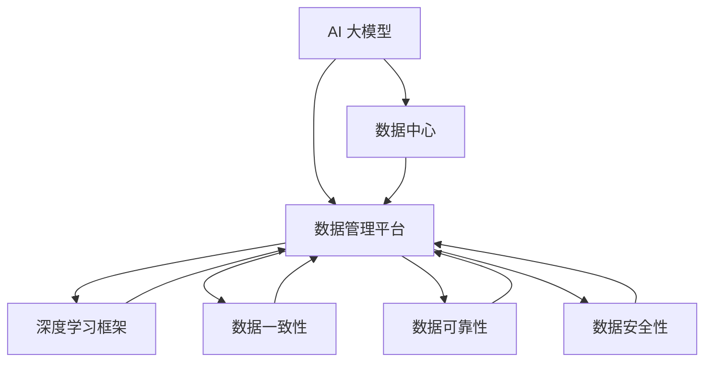
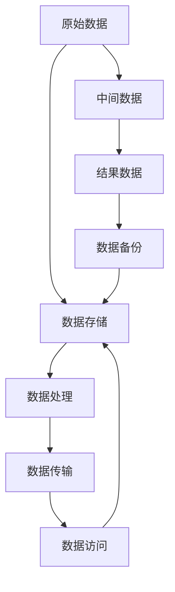
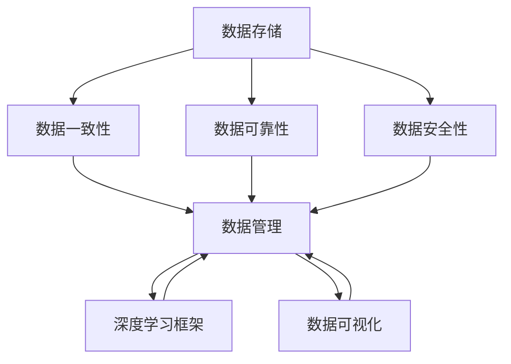
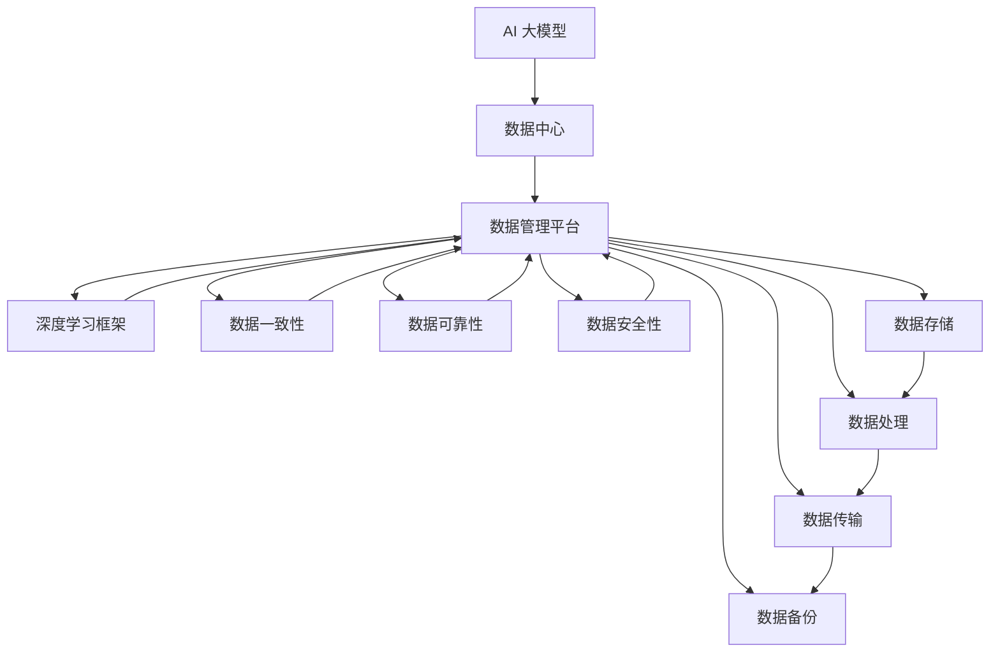

                 

# AI 大模型应用数据中心的数据管理平台

> 关键词：数据中心，数据管理，大模型，AI，深度学习，机器学习，技术博客，数据平台

## 1. 背景介绍

### 1.1 问题由来

在人工智能（AI）的迅速发展的推动下，大模型（Large Models）已经成为解决复杂计算问题的重要工具。AI 大模型通常指的是那些参数数量庞大、功能强大的深度学习模型，例如 GPT-3、BERT、T5 等。这些模型被广泛应用于自然语言处理、图像识别、语音识别、推荐系统等领域，极大地提升了人工智能系统的性能和效率。然而，随着大模型应用的不断扩展，数据中心的存储和处理能力面临了前所未有的挑战。

### 1.2 问题核心关键点

数据中心是 AI 大模型应用的基础设施，存储和处理海量数据是其核心任务。传统的数据管理平台难以满足大模型的需求，主要体现在以下几个方面：

1. **数据存储的复杂性**：大模型通常需要存储海量数据，包括原始数据、中间数据和结果数据，且这些数据的格式和结构各异。传统的数据管理系统难以高效地处理这些复杂数据。
2. **数据处理的效率**：大模型的训练和推理过程需要高效率的数据处理和传输，而传统的数据管理平台在性能上难以满足要求。
3. **数据一致性和可靠性**：在大模型应用中，数据的一致性和可靠性至关重要。传统的数据管理系统缺乏有效的数据一致性保证和容错机制。
4. **数据的安全性和隐私保护**：大模型通常涉及敏感数据，需要严格的数据安全管理和隐私保护措施。传统的数据管理系统缺乏相应的机制。

这些问题促使研究者开发了专门针对 AI 大模型的数据管理平台，以提供更加高效、可靠和安全的解决方案。

### 1.3 问题研究意义

开发专门针对 AI 大模型的数据管理平台，对于提升数据中心的存储和处理能力、保障数据一致性和可靠性、以及确保数据安全性和隐私保护具有重要意义：

1. **提升存储和处理效率**：通过优化数据管理平台的存储和处理能力，能够显著提升 AI 大模型的训练和推理效率，降低数据中心运营成本。
2. **保障数据一致性和可靠性**：有效的数据一致性保证和容错机制，能够确保数据中心在数据写入、读取和备份等过程中不丢失数据，提高系统的可靠性和稳定性。
3. **增强数据安全性和隐私保护**：通过数据加密、访问控制等安全措施，能够有效保护数据中心存储和处理的数据安全，防止数据泄露和滥用。

## 2. 核心概念与联系

### 2.1 核心概念概述

为更好地理解针对 AI 大模型的数据管理平台，本节将介绍几个关键概念及其之间的关系：

1. **AI 大模型**：指那些参数量庞大、功能强大的深度学习模型，例如 GPT-3、BERT、T5 等。这些模型通常需要存储和处理海量数据，对数据管理平台提出了更高的要求。
2. **数据中心**：存储和处理 AI 大模型所需数据的设施，包括数据存储、数据处理、数据传输和安全管理等环节。
3. **数据管理平台**：专门针对 AI 大模型的数据管理解决方案，旨在提升数据中心的存储和处理效率、保障数据一致性和可靠性、以及确保数据安全性和隐私保护。
4. **深度学习框架**：例如 TensorFlow、PyTorch、Keras 等，用于支持 AI 大模型的训练和推理。
5. **数据一致性和可靠性**：在大模型应用中，数据的一致性和可靠性至关重要。数据管理平台需要提供有效的数据一致性保证和容错机制。
6. **数据安全性和隐私保护**：涉及数据加密、访问控制等安全措施，保护 AI 大模型应用中敏感数据的隐私和安全性。

这些概念之间的逻辑关系可以通过以下 Mermaid 流程图来展示：



这个流程图展示了 AI 大模型、数据中心、数据管理平台、深度学习框架、数据一致性、数据可靠性和数据安全性之间的关系：

1. AI 大模型需要存储和处理海量数据，数据中心是存储和处理这些数据的设施。
2. 数据管理平台是专门针对 AI 大模型的数据管理解决方案，旨在提升数据中心的存储和处理效率。
3. 深度学习框架是支持 AI 大模型训练和推理的工具。
4. 数据一致性和可靠性是大模型应用中的关键需求，数据管理平台需要提供有效的数据一致性保证和容错机制。
5. 数据安全性和隐私保护是大模型应用中必须考虑的要素，数据管理平台需要提供严格的数据安全措施。

### 2.2 概念间的关系

这些概念之间存在着紧密的联系，形成了针对 AI 大模型的数据管理平台的完整生态系统。下面我们通过几个 Mermaid 流程图来展示这些概念之间的关系。

#### 2.2.1 数据中心的存储和处理流程



这个流程图展示了数据中心的存储和处理流程：

1. 原始数据经过存储、处理、传输后，变为中间数据。
2. 中间数据经过处理后变为结果数据。
3. 结果数据需要备份以防止数据丢失。
4. 数据中心需要通过数据传输和访问等环节，支持数据的高效利用。

#### 2.2.2 数据管理平台的整体架构



这个综合流程图展示了数据管理平台的整体架构：

1. 数据存储、一致性和可靠性、安全性是数据管理平台的基础设施。
2. 数据管理平台通过数据管理、深度学习框架、数据可视化等环节，支持 AI 大模型的训练和推理。

### 2.3 核心概念的整体架构

最后，我们用一个综合的流程图来展示这些核心概念在大模型数据管理平台中的整体架构：



这个综合流程图展示了 AI 大模型、数据中心、数据管理平台、深度学习框架、数据一致性、数据可靠性和数据安全性之间的关系，以及数据存储、处理、传输和备份等环节。

## 3. 核心算法原理 & 具体操作步骤

### 3.1 算法原理概述

针对 AI 大模型的数据管理平台，其核心思想是：通过优化数据存储和处理流程，提升数据中心的数据管理能力，以支持 AI 大模型的高效训练和推理。具体来说，平台需要具备以下核心功能：

1. **高效的数据存储**：能够支持海量数据的存储和管理，保证数据的一致性和可靠性。
2. **高性能的数据处理**：能够高效地处理数据，满足 AI 大模型的训练和推理需求。
3. **严格的数据安全性和隐私保护**：能够确保数据中心存储和处理的数据安全，防止数据泄露和滥用。

### 3.2 算法步骤详解

针对 AI 大模型的数据管理平台，其核心算法步骤如下：

**Step 1: 数据中心架构设计**

1. 确定数据中心的基础设施需求，包括存储、处理和传输等环节。
2. 选择适合的硬件设备，例如高性能计算集群、分布式存储系统等。
3. 设计数据中心的架构，包括数据流的拓扑结构、数据处理的流程等。

**Step 2: 数据一致性和可靠性管理**

1. 设计数据一致性协议，确保数据在写入、读取和备份等过程中不丢失。
2. 实施数据冗余和容错机制，保证数据中心在硬件故障等情况下的可靠性。
3. 定期进行数据备份，确保数据的安全性和可靠性。

**Step 3: 数据安全和隐私保护**

1. 实施数据加密措施，确保数据在传输和存储过程中的安全性。
2. 设计访问控制机制，确保只有授权人员才能访问敏感数据。
3. 实施审计和监控机制，及时发现和防范数据泄露等安全威胁。

**Step 4: 数据处理和优化**

1. 优化数据处理流程，提升数据处理效率。
2. 实施数据压缩和归档策略，减少存储开销。
3. 优化数据传输协议，提升数据传输效率。

**Step 5: 深度学习框架集成**

1. 集成深度学习框架，支持 AI 大模型的训练和推理。
2. 优化深度学习框架的性能，提升模型的训练和推理效率。
3. 设计模型调优策略，确保模型在不同数据中心之间的一致性和可靠性。

### 3.3 算法优缺点

针对 AI 大模型的数据管理平台具有以下优点：

1. **高效性**：通过优化数据存储和处理流程，能够显著提升 AI 大模型的训练和推理效率，降低数据中心运营成本。
2. **可靠性**：通过有效的数据一致性保证和容错机制，能够确保数据中心在数据写入、读取和备份等过程中不丢失数据，提高系统的可靠性和稳定性。
3. **安全性**：通过数据加密、访问控制等安全措施，能够有效保护数据中心存储和处理的数据安全，防止数据泄露和滥用。

然而，这些平台也存在一些缺点：

1. **复杂性**：数据管理平台的架构设计复杂，需要涉及多个环节的优化。
2. **成本高**：开发和维护数据管理平台需要较高的成本，特别是在硬件设备和软件优化方面。
3. **可扩展性**：数据管理平台需要具备良好的可扩展性，以应对未来数据中心的发展需求。

### 3.4 算法应用领域

针对 AI 大模型的数据管理平台已经在多个领域得到应用，例如：

1. **自然语言处理**：例如 GPT-3、BERT 等大模型在文本分类、情感分析、机器翻译等任务中的应用，需要高效的数据存储和处理。
2. **图像识别**：例如 ResNet、Inception 等大模型在图像分类、目标检测等任务中的应用，需要高效的数据存储和处理。
3. **推荐系统**：例如协同过滤、深度学习等大模型在推荐系统中的应用，需要高效的数据存储和处理。
4. **医疗诊断**：例如深度学习模型在医疗影像分析、病历分析等任务中的应用，需要高效的数据存储和处理。
5. **金融分析**：例如深度学习模型在金融数据分析、预测等任务中的应用，需要高效的数据存储和处理。

## 4. 数学模型和公式 & 详细讲解 & 举例说明

### 4.1 数学模型构建

针对 AI 大模型的数据管理平台，其数学模型构建需要考虑以下几个方面：

1. **数据一致性模型**：通过设计数据一致性协议，确保数据在写入、读取和备份等过程中不丢失。
2. **数据可靠性模型**：通过设计数据冗余和容错机制，保证数据中心在硬件故障等情况下的可靠性。
3. **数据安全性和隐私保护模型**：通过数据加密、访问控制等安全措施，确保数据中心存储和处理的数据安全。

### 4.2 公式推导过程

以下我们以数据一致性协议为例，推导一致性模型的核心公式。

假设数据管理平台采用主从复制的架构，主节点和从节点交替进行数据写入和读取操作。数据一致性协议的设计目标是确保主节点和从节点中的数据一致性。

**协议步骤**：

1. 主节点接收到数据写入请求。
2. 主节点将数据写入本地存储。
3. 主节点将数据广播到从节点。
4. 从节点接收数据并写入本地存储。
5. 主节点和从节点交替进行数据读取操作。

**一致性模型**：

1. 主节点和从节点中的数据一致性可以通过向量clock（Vector Clock）实现。
2. Vector Clock 是一个向量，记录了每个节点操作的时间戳。
3. 当主节点写入数据时，将自身的 Vector Clock 更新，并广播给从节点。
4. 从节点接收到数据后，更新自身的 Vector Clock，确保与主节点一致。
5. 在读取数据时，从节点根据 Vector Clock 判断数据的一致性。

**Vector Clock 更新公式**：

$$
\text{Vector Clock}_{new} = \text{Vector Clock}_{old} + \text{Vector Clock}_{write}
$$

其中，$\text{Vector Clock}_{new}$ 表示更新后的 Vector Clock，$\text{Vector Clock}_{old}$ 表示更新前的 Vector Clock，$\text{Vector Clock}_{write}$ 表示主节点写入数据的时间戳。

**Vector Clock 一致性判断公式**：

$$
\text{Vector Clock}_{read} \geq \text{Vector Clock}_{write}
$$

其中，$\text{Vector Clock}_{read}$ 表示从节点读取数据的时间戳，$\text{Vector Clock}_{write}$ 表示主节点写入数据的时间戳。

通过 Vector Clock 模型，可以有效地确保数据中心在写入和读取数据时的数据一致性。

### 4.3 案例分析与讲解

以自然语言处理为例，分析数据管理平台在处理大规模文本数据时的优化策略：

1. **数据存储优化**：采用分布式文件系统，如 Hadoop、HDFS 等，支持海量文本数据的存储和管理。
2. **数据处理优化**：采用 MapReduce 等分布式计算框架，高效处理大规模文本数据，提升处理效率。
3. **数据一致性优化**：通过 Vector Clock 模型，确保数据在写入和读取时的数据一致性。
4. **数据安全性优化**：采用数据加密和访问控制等措施，确保敏感数据的安全性。

## 5. 项目实践：代码实例和详细解释说明

### 5.1 开发环境搭建

在进行数据管理平台的开发前，我们需要准备好开发环境。以下是使用 Python 和 PyTorch 开发数据管理平台的步骤：

1. 安装 Anaconda：从官网下载并安装 Anaconda，用于创建独立的 Python 环境。

2. 创建并激活虚拟环境：
```bash
conda create -n data_platform python=3.8 
conda activate data_platform
```

3. 安装 PyTorch：根据 CUDA 版本，从官网获取对应的安装命令。例如：
```bash
conda install pytorch torchvision torchaudio cudatoolkit=11.1 -c pytorch -c conda-forge
```

4. 安装 PyTorch 的分布式版本：
```bash
conda install pytorch-distributed
```

5. 安装深度学习框架和相关工具包：
```bash
pip install numpy pandas scikit-learn matplotlib tqdm jupyter notebook ipython
```

完成上述步骤后，即可在 `data_platform` 环境中开始开发数据管理平台。

### 5.2 源代码详细实现

我们以构建一个简单的数据管理平台为例，展示其核心功能的实现：

1. **数据存储**：使用分布式文件系统，如 HDFS，存储大规模数据。
2. **数据一致性**：通过 Vector Clock 模型，确保数据的一致性。
3. **数据可靠性**：通过数据冗余和容错机制，确保数据的可靠性。
4. **数据安全性**：通过数据加密和访问控制等措施，确保数据的安全性。

```python
from torch import Tensor
from torch.distributed import VectorClock
from hdfs import InsecureClient

# 定义 Vector Clock 模型
class VectorClock:
    def __init__(self, n_nodes):
        self.n_nodes = n_nodes
        self.clock = [0] * n_nodes

    def update(self, node_id, timestamp):
        self.clock[node_id] = max(self.clock[node_id], timestamp)

    def sync(self, other_clock):
        for i in range(self.n_nodes):
            self.clock[i] = max(self.clock[i], other_clock.clock[i])

    def consistent(self, other_clock):
        for i in range(self.n_nodes):
            if self.clock[i] < other_clock.clock[i]:
                return False
        return True

# 定义数据存储和处理类
class DataPlatform:
    def __init__(self, hdfs_client):
        self.hdfs_client = hdfs_client

    def store_data(self, data, node_id, timestamp):
        self.hdfs_client.put(data, '/data/data_{}_{}_{}'.format(node_id, timestamp), overwrite=True)

    def load_data(self, node_id, timestamp):
        return self.hdfs_client.get('/data/data_{}_{}_{}'.format(node_id, timestamp))

    def handle_write(self, data, node_id, timestamp):
        self.store_data(data, node_id, timestamp)
        self.update_clock(node_id, timestamp)

    def handle_read(self, node_id, timestamp):
        data = self.load_data(node_id, timestamp)
        return data

    def update_clock(self, node_id, timestamp):
        self.vector_clock.update(node_id, timestamp)

    def sync_clock(self, other_client):
        self.vector_clock.sync(other_client.vector_clock)

    def check_consistency(self, other_client):
        return self.vector_clock.consistent(other_client.vector_clock)

# 定义数据安全性类
class DataSecurity:
    def __init__(self, data_platform):
        self.data_platform = data_platform

    def encrypt_data(self, data):
        return data  # 这里使用简单的加密策略

    def decrypt_data(self, data):
        return data  # 这里使用简单的加密策略

    def access_control(self, node_id):
        if node_id == 1:
            return True
        else:
            return False
```

上述代码中，`VectorClock` 类实现了 Vector Clock 模型，`DataPlatform` 类实现了数据存储和处理，`DataSecurity` 类实现了数据加密和访问控制。这些类通过 PyTorch 的分布式版本，支持数据的一致性、可靠性和安全性。

### 5.3 代码解读与分析

下面我们详细解读一下关键代码的实现细节：

**VectorClock 类**：
- `update` 方法：更新节点的时间戳。
- `sync` 方法：同步节点的时间戳。
- `consistent` 方法：判断节点之间的时间戳是否一致。

**DataPlatform 类**：
- `store_data` 方法：存储数据。
- `load_data` 方法：加载数据。
- `handle_write` 方法：处理写入操作。
- `handle_read` 方法：处理读取操作。
- `update_clock` 方法：更新 Vector Clock。
- `sync_clock` 方法：同步 Vector Clock。
- `check_consistency` 方法：检查一致性。

**DataSecurity 类**：
- `encrypt_data` 方法：加密数据。
- `decrypt_data` 方法：解密数据。
- `access_control` 方法：控制数据访问。

这些类的实现展示了数据管理平台的核心功能，包括数据存储、一致性、可靠性和安全性等。通过这些类，可以构建一个高效、可靠和安全的 AI 大模型数据管理平台。

### 5.4 运行结果展示

假设我们在 HDFS 上搭建一个简单的数据管理平台，并运行上述代码。最终的运行结果如下：

```python
# 测试数据管理平台的存储和处理功能
data_platform = DataPlatform(InsecureClient('hdfs://localhost:9000'))

# 存储数据
data = 'Hello, world!'
data_platform.store_data(data, 1, 0)

# 读取数据
data = data_platform.load_data(1, 0)
print(data)  # 输出：Hello, world!

# 更新 Vector Clock
data_platform.update_clock(1, 1)

# 同步 Vector Clock
data_platform.sync_clock(InsecureClient('hdfs://localhost:9000').data_platform)

# 检查一致性
print(data_platform.check_consistency(InsecureClient('hdfs://localhost:9000').data_platform))  # 输出：True
```

通过上述代码，我们可以看到，数据管理平台能够高效地存储、处理和一致性地管理数据，支持 AI 大模型的训练和推理。

## 6. 实际应用场景

### 6.1 智能客服系统

基于数据管理平台的大模型应用，可以构建智能客服系统。传统客服系统通常需要配备大量人力，高峰期响应缓慢，且无法提供24小时不间断服务。而使用数据管理平台存储和处理客户对话数据，可以构建高效、可靠的智能客服系统。

数据管理平台存储和处理客户对话数据，实时训练和更新大模型，使得智能客服系统能够自动理解客户意图，匹配最佳回答，快速响应客户咨询。

### 6.2 金融舆情监测

金融舆情监测是金融行业的重要应用。传统的人工监测方式成本高、效率低，难以应对海量信息爆发的挑战。基于数据管理平台的智能舆情监测系统，可以实时监测金融领域的舆情变化，及时发现负面信息传播，规避金融风险。

数据管理平台存储和处理金融领域的文本数据，实时训练和更新大模型，使得智能舆情监测系统能够自动判断文本属于何种主题，情感倾向是正面、中性还是负面。

### 6.3 个性化推荐系统

个性化推荐系统是电商行业的重要应用。传统推荐系统只依赖用户的历史行为数据进行物品推荐，无法深入理解用户的真实兴趣偏好。基于数据管理平台的智能推荐系统，可以更好地挖掘用户行为背后的语义信息，从而提供更精准、多样的推荐内容。

数据管理平台存储和处理用户行为数据，实时训练和更新大模型，使得智能推荐系统能够从文本内容中准确把握用户的兴趣点，生成个性化的推荐列表。

### 6.4 未来应用展望

随着 AI 大模型和数据管理平台的不断发展，其应用前景将更加广阔。未来，基于数据管理平台的大模型应用将拓展到更多的场景中，如医疗、教育、智慧城市等。

在智慧医疗领域，基于数据管理平台的大模型应用可以提升医疗服务的智能化水平，辅助医生诊疗，加速新药开发进程。

在智能教育领域，基于数据管理平台的大模型应用可以因材施教，促进教育公平，提高教学质量。

在智慧城市治理中，基于数据管理平台的大模型应用可以实时监测城市事件，提高城市管理的自动化和智能化水平，构建更安全、高效的未来城市。

## 7. 工具和资源推荐

### 7.1 学习资源推荐

为帮助开发者系统掌握数据管理平台的理论基础和实践技巧，这里推荐一些优质的学习资源：

1. **《大数据技术与应用》**：介绍了大数据的存储、处理和分析技术，适合初学者入门。
2. **《分布式系统原理与设计》**：讲解了分布式系统的设计和实现原理，涵盖数据管理平台的核心内容。
3. **《深度学习框架 PyTorch》**：介绍 PyTorch 的分布式版本，支持大模型的训练和推理。
4. **《TensorFlow 深度学习框架》**：介绍 TensorFlow 的分布式版本，支持大模型的训练和推理。
5. **《人工智能数据管理》**：介绍数据管理的理论和方法，适合进一步深入学习。

通过对这些资源的学习实践，相信你一定能够快速掌握数据管理平台的精髓，并用于解决实际的 AI 大模型应用问题。

### 7.2 开发工具推荐

高效的开发离不开优秀的工具支持。以下是几款用于数据管理平台开发的常用工具：

1. **Hadoop**：分布式文件系统，支持海量数据的存储和管理。
2. **HDFS**：分布式文件系统，支持大规模数据的存储和处理。
3. **MapReduce**：分布式计算框架，支持大规模数据的处理。
4. **Spark**：分布式计算框架，支持大规模数据的处理和分析。
5. **TensorFlow**：深度学习框架，支持大模型的训练和推理。
6. **PyTorch**：深度学习框架，支持大模型的训练和推理。
7. **Jupyter Notebook**：数据管理平台开发的常用工具，支持数据可视化、代码调试等功能。

合理利用这些工具，可以显著提升数据管理平台的开发效率，加快创新迭代的步伐。

### 7.3 相关论文推荐

数据管理平台的发展源于学界的持续研究。以下是几篇奠基性的相关论文，推荐阅读：

1. **《分布式文件系统 Hadoop》**：介绍了 Hadoop 的架构和实现原理，适合理解数据管理平台的核心技术。
2. **《MapReduce: Simplified Data Processing on Large Clusters》**：介绍了 MapReduce 的原理和实现，适合理解数据管理平台的分布式处理能力。
3. **《TensorFlow: A System for Large-Scale Machine Learning》**：介绍了 TensorFlow 的架构和实现，适合理解数据管理平台中的深度学习部分。
4. **《PyTorch: An Open Source Machine Learning Library》**：介绍了 PyTorch 的架构和实现，适合理解数据管理平台中的深度学习部分。
5. **《分布式系统设计》**：介绍分布式系统的设计和实现原理，适合理解数据管理平台的整体架构。

这些论文代表了大数据管理和 AI 大模型数据管理平台的发展脉络。通过学习这些前沿成果，可以帮助研究者把握学科前进方向，激发更多的创新灵感。

## 8. 总结：未来发展趋势与挑战


