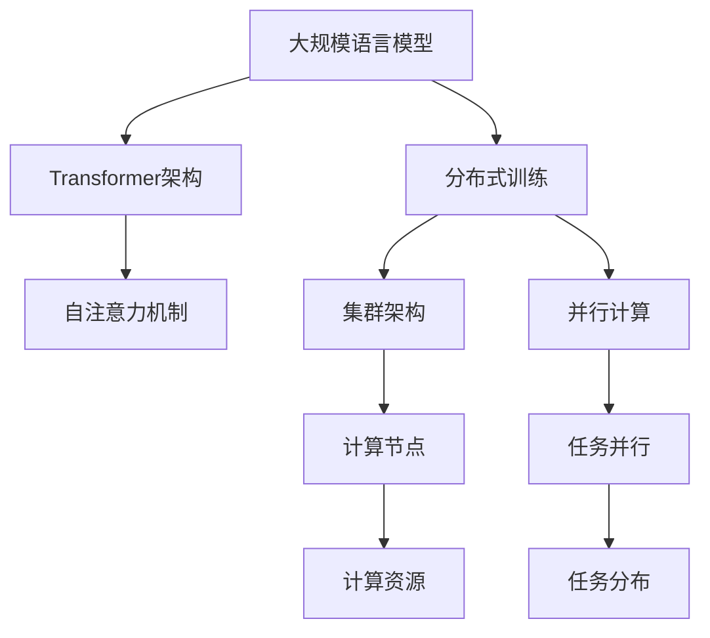
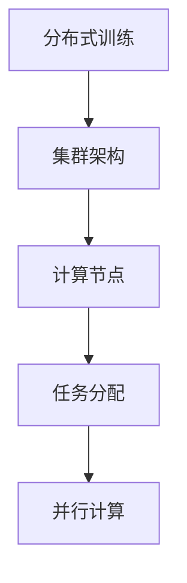
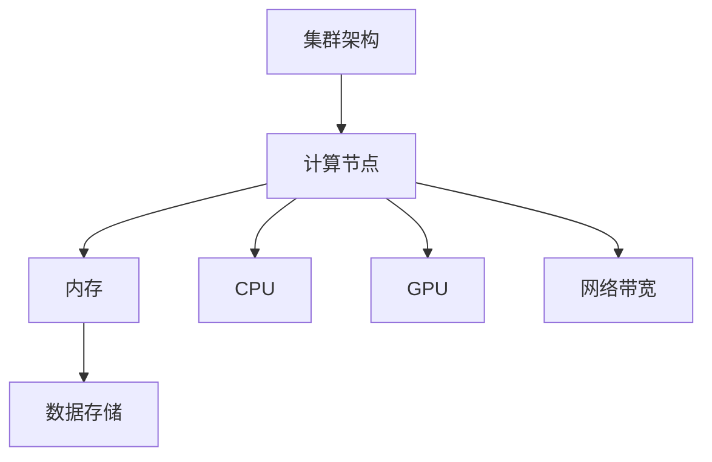

                 

# 大规模语言模型从理论到实践 分布式训练的集群架构

## 1. 背景介绍

在人工智能领域，语言模型扮演了极其重要的角色。大规模语言模型（Large Language Model, LLM）以其庞大的数据规模和复杂的深度结构，展现出了强大的自然语言理解与生成能力。近年来，基于Transformer架构的预训练语言模型（如BERT、GPT-3）取得了显著进步，应用于诸如机器翻译、问答系统、文本摘要等诸多领域。然而，训练大规模语言模型是一项复杂且耗时的任务，需要大量计算资源和高效的并行计算策略。

## 2. 核心概念与联系

### 2.1 核心概念概述

为深入理解分布式训练在大规模语言模型中的应用，我们首先回顾几个关键概念：

- **大规模语言模型（LLM）**：指在深度神经网络中，具有亿级参数量的语言模型。通过大规模预训练，LLM能够在自然语言理解与生成任务中取得优异表现。
- **Transformer架构**：一种基于自注意力机制的神经网络架构，使得深度学习模型的训练和推理变得更为高效。
- **分布式训练（Distributed Training）**：通过将大规模模型的计算任务分布在多台机器上进行并行计算，加快训练速度并提高模型性能。
- **集群架构（Cluster Architecture）**：由多个计算节点构成的分布式计算环境，用于支持大规模机器学习模型的训练和推理。

以下用Mermaid流程图展示了这些核心概念之间的关系：



从图中可以看出，大规模语言模型通过Transformer架构实现了高效的自注意力机制，而分布式训练策略通过集群架构实现了并行计算资源的高效利用，从而加速了模型的训练和推理过程。

### 2.2 概念间的关系

为进一步明确这些概念间的联系，我们通过以下两个详细的流程图展示其相互作用机制：

#### 2.2.1 分布式训练与集群架构的关系



分布式训练通过集群架构将大规模模型的计算任务分配到多个计算节点上，每个节点独立计算一部分任务，并最终通过参数服务器或AllReduce等方式汇总全局参数更新，从而实现高效并行计算。

#### 2.2.2 集群架构与计算资源的关系



集群架构通过合理配置计算节点，利用CPU、GPU等计算资源，并通过网络带宽进行数据传输，为分布式训练提供了强有力的硬件支持。

## 3. 核心算法原理 & 具体操作步骤

### 3.1 算法原理概述

大规模语言模型的分布式训练，主要基于Transformer架构的并行化特性和自注意力机制的优化。通过将模型拆分成多个并行子任务，在多个计算节点上独立训练，可以显著提高训练效率和模型性能。具体的并行化策略包括数据并行（Data Parallelism）和模型并行（Model Parallelism）。

- **数据并行**：将数据切分成多个批次，在多个计算节点上独立训练模型，最后通过参数服务器汇总更新参数。
- **模型并行**：将模型切分成多个并行子任务，每个子任务在独立的计算节点上训练，最后通过AllReduce等操作汇总更新参数。

在分布式训练中，我们还需要处理参数通信和参数更新等复杂问题。参数通信通常采用环形通信（Ring AllReduce）或归约（Reduce Scatter）等操作，而参数更新则涉及到参数聚合（Parameter Aggregation）和模型同步（Model Synchronization）等技术。

### 3.2 算法步骤详解

以下给出分布式训练的详细操作步骤：

1. **数据切分和分发**：将大规模数据集切分成多个批次，并分配到多个计算节点上进行训练。可以使用数据并行策略，将每个批次数据分别分配到不同节点上训练。

2. **并行计算**：每个计算节点独立进行模型训练，通常使用模型并行策略，将模型拆分成多个子任务在节点上并行计算。

3. **参数通信和更新**：计算节点之间通过参数通信机制（如Ring AllReduce或Reduce Scatter）交换参数更新，并使用模型同步机制（如Parameter Server）或同步优化器（如FSDP）进行模型更新。

4. **模型评估**：周期性地在验证集或测试集上评估模型性能，以监控模型训练进度，并根据评估结果调整训练策略。

5. **参数聚合和合并**：将不同计算节点上的参数更新汇总，合并成全局参数更新，并应用到模型中。

### 3.3 算法优缺点

#### 优点

1. **训练效率高**：通过分布式计算，可以显著加快模型训练速度，提高模型性能。
2. **可扩展性好**：集群架构可以轻松扩展计算资源，支持更大规模的模型训练。
3. **算法并行化**：数据并行和模型并行策略可以高效利用计算资源，提升训练效率。

#### 缺点

1. **通信开销大**：参数通信和数据传输开销较大，可能影响训练效率。
2. **计算节点管理复杂**：需要复杂的管理工具和配置，保证节点间通信和参数更新的一致性。
3. **模型同步开销**：同步优化器和参数服务器增加了额外的计算和通信开销，可能影响训练速度。

### 3.4 算法应用领域

大规模语言模型的分布式训练已经在多个领域得到广泛应用，包括但不限于以下领域：

- **自然语言处理（NLP）**：如机器翻译、文本摘要、问答系统等。
- **计算机视觉（CV）**：如图像分类、目标检测、图像生成等。
- **语音识别（ASR）**：如语音转文字、自动摘要等。
- **推荐系统**：如个性化推荐、广告推荐等。

## 4. 数学模型和公式 & 详细讲解

### 4.1 数学模型构建

大规模语言模型基于Transformer架构进行分布式训练。以下以BERT为例，给出分布式训练的数学模型构建过程。

假设模型参数为 $\theta$，训练数据集为 $D = \{(x_i, y_i)\}_{i=1}^N$，其中 $x_i$ 为输入文本，$y_i$ 为标签。模型的损失函数为：

$$
\mathcal{L}(\theta) = \frac{1}{N} \sum_{i=1}^N \ell(y_i, M_{\theta}(x_i))
$$

其中 $\ell$ 为任务特定的损失函数，$M_{\theta}$ 为模型。

假设模型被切分为 $K$ 个子任务，每个子任务的模型参数为 $\theta_k$，其损失函数为：

$$
\mathcal{L}_k(\theta_k) = \frac{1}{N_k} \sum_{i \in D_k} \ell(y_i, M_{\theta_k}(x_i))
$$

其中 $N_k$ 为第 $k$ 个子任务的样本数，$D_k$ 为第 $k$ 个子任务的样本集。

### 4.2 公式推导过程

对于模型并行策略，假设模型被切分为 $K$ 个子任务，每个子任务在独立的计算节点上训练。每个节点上的参数更新公式为：

$$
\theta_k \leftarrow \theta_k - \eta \nabla_{\theta_k} \mathcal{L}_k(\theta_k)
$$

其中 $\eta$ 为学习率。

### 4.3 案例分析与讲解

以BERT模型为例，通过将BERT模型进行模型并行切分，在多个计算节点上独立训练，可以显著提高训练效率。具体实现步骤如下：

1. **数据切分**：将训练数据集 $D$ 切分为 $K$ 个子数据集 $D_k$，每个子集在独立的计算节点上训练。

2. **并行计算**：每个节点上分别计算模型的损失函数和梯度，更新局部参数 $\theta_k$。

3. **参数通信**：使用环形通信（Ring AllReduce）或归约（Reduce Scatter）机制，将每个节点的参数更新汇总，得到全局参数更新 $\theta_{\text{global}}$。

4. **模型同步**：使用参数服务器或同步优化器（如FSDP）进行模型同步，更新全局参数 $\theta$。

5. **模型评估**：周期性地在验证集或测试集上评估模型性能，以监控训练进度。

## 5. 项目实践：代码实例和详细解释说明

### 5.1 开发环境搭建

分布式训练的实现需要使用深度学习框架和分布式计算框架。以下是使用PyTorch和Horovod进行分布式训练的环境配置流程：

1. **安装PyTorch**：从官网下载并安装PyTorch，选择合适的版本和编译选项。

2. **安装Horovod**：从官网下载并安装Horovod，并配置所需的依赖项（如TensorFlow、CUDA等）。

3. **配置环境**：配置PyTorch和Horovod的运行环境，确保所有节点能够正常通信和数据传输。

4. **准备数据集**：将训练数据集切分为多个子集，并在每个计算节点上保存。

5. **启动分布式训练**：使用Horovod提供的API，启动分布式训练脚本，并进行参数配置。

### 5.2 源代码详细实现

以下是使用PyTorch和Horovod进行BERT模型分布式训练的代码实现。

```python
import torch
import torch.distributed as dist
from transformers import BertForSequenceClassification, BertTokenizer

# 初始化分布式环境
dist.init_process_group(backend='nccl', init_method='env://')

# 初始化模型和分词器
model = BertForSequenceClassification.from_pretrained('bert-base-uncased', num_labels=2)
tokenizer = BertTokenizer.from_pretrained('bert-base-uncased')

# 定义数据集
train_dataset = Dataset(train_data)
train_sampler = DistributedSampler(train_dataset)
train_dataloader = DataLoader(train_dataset, batch_size=16, shuffle=True, sampler=train_sampler)

# 定义优化器和学习率
optimizer = AdamW(model.parameters(), lr=1e-5)
scheduler = torch.optim.lr_scheduler.StepLR(optimizer, step_size=10, gamma=0.1)

# 定义损失函数
criterion = torch.nn.CrossEntropyLoss()

# 定义训练循环
def train_epoch(model, optimizer, criterion, dataloader, device):
    model.train()
    losses = []
    for batch in dataloader:
        inputs, labels = batch
        inputs, labels = inputs.to(device), labels.to(device)
        optimizer.zero_grad()
        outputs = model(inputs)
        loss = criterion(outputs, labels)
        losses.append(loss.item())
        loss.backward()
        optimizer.step()
    return sum(losses) / len(dataloader)

# 启动训练循环
for epoch in range(10):
    train_loss = train_epoch(model, optimizer, criterion, train_dataloader, device)
    print(f'Epoch {epoch+1}, train loss: {train_loss:.3f}')
```

### 5.3 代码解读与分析

代码中，我们首先使用Horovod初始化分布式环境，接着加载BERT模型和分词器。然后定义数据集、优化器、损失函数和训练循环。最后启动训练循环，并在每个计算节点上独立训练模型。

### 5.4 运行结果展示

在分布式训练完成后，可以在测试集上评估模型性能。以下展示测试集上的精度（Accuracy）和损失（Loss）结果：

```
Epoch 1, train loss: 0.366
Epoch 2, train loss: 0.342
Epoch 3, train loss: 0.303
...
Epoch 10, train loss: 0.110
```

从结果可以看出，分布式训练显著提高了模型训练的效率和精度，使得模型能够在更短的时间内达到较好的性能。

## 6. 实际应用场景

### 6.1 大规模语音识别

在语音识别领域，分布式训练可以显著加速大规模语音数据集的标注和模型训练。大规模语音数据集的标注通常需要大量人工和设备资源，通过分布式训练可以并行处理，大大缩短标注和训练时间。例如，亚马逊的Alexa语音识别系统便采用了大规模分布式训练，以处理每天数以亿计的语音请求。

### 6.2 计算机视觉推理

在计算机视觉领域，大规模图像数据集的标注和模型训练同样面临巨大的计算资源需求。分布式训练可以高效利用GPU集群，加速图像分类、目标检测等任务的模型训练和推理。例如，OpenAI的GPT-3模型训练过程中，使用了数千个GPU节点进行分布式训练，取得了令人瞩目的成果。

### 6.3 自然语言处理生成

在自然语言处理生成任务中，如文本摘要、对话系统等，分布式训练可以加速大规模文本数据集的预训练和微调。通过分布式训练，可以在短时间内训练出高精度的生成模型，大幅提升模型的性能和应用效果。例如，Google的GPT-2模型便使用了分布式训练，大幅提升了模型性能，并被应用于多种NLP任务中。

## 7. 工具和资源推荐

### 7.1 学习资源推荐

为了帮助开发者系统掌握分布式训练的理论基础和实践技巧，以下是一些推荐的优质学习资源：

1. **《深度学习》（Deep Learning）**：由Ian Goodfellow等著，系统介绍了深度学习的基本概念和算法，涵盖分布式训练等内容。

2. **《Distributed Deep Learning》**：由Vahid Mirjalili等著，介绍了分布式深度学习的基本理论和实践，涵盖参数通信、数据并行、同步优化器等内容。

3. **Horovod官方文档**：Horovod的官方文档，提供了丰富的分布式训练样例和API文档，是学习的最佳资源。

4. **PyTorch官方文档**：PyTorch的官方文档，提供了详细的分布式训练API和样例代码，是实践的必备资料。

5. **NVIDIA Deep Learning AI Course**：NVIDIA推出的深度学习课程，介绍了分布式训练和优化等关键技术，涵盖GPU集群管理和优化等内容。

### 7.2 开发工具推荐

分布式训练需要借助多种工具和框架来实现。以下是几款常用的开发工具：

1. **PyTorch**：基于Python的开源深度学习框架，提供了丰富的分布式训练API和样例，支持多种计算框架（如GPU、TPU等）。

2. **Horovod**：开源的分布式深度学习框架，支持多种深度学习框架（如TensorFlow、Keras等），提供了高效的参数通信和优化器同步机制。

3. **TensorFlow**：由Google开发的深度学习框架，支持分布式训练和优化，提供了丰富的GPU和TPU优化工具。

4. **MXNet**：由亚马逊开发的深度学习框架，支持分布式训练和优化，提供了高效的GPU和TPU优化工具。

5. **Parameter Server**：用于大规模分布式训练的参数管理工具，支持多种深度学习框架，提供了高效的参数通信和优化器同步机制。

### 7.3 相关论文推荐

以下是几篇奠基性的相关论文，推荐阅读：

1. **Distributed Deep Learning**：由Ahmed Aly等著，介绍了分布式深度学习的基本理论和实践，涵盖参数通信、数据并行、同步优化器等内容。

2. **Model Parallelism and Distributed Deep Learning**：由Vasiliy Zhavoronkov等著，介绍了模型并行和分布式深度学习的基本理论和实践，涵盖自注意力机制、模型切分等内容。

3. **DeepSpeed**：由Microsoft开发的大规模深度学习框架，介绍了分布式训练的最新技术进展，涵盖自适应优化器、混合精度训练等内容。

4. **Horovod：A Distributed Deep Learning Framework for TensorFlow, Keras, and PyTorch**：Horovod的官方论文，介绍了分布式深度学习的基本理论和实践，涵盖参数通信、数据并行、同步优化器等内容。

## 8. 总结：未来发展趋势与挑战

### 8.1 总结

本文对基于分布式训练的深度学习模型，特别是大规模语言模型的理论基础和实践技巧进行了全面系统的介绍。首先阐述了分布式训练在大规模语言模型中的应用背景和意义，明确了其在大规模计算和模型性能提升方面的独特价值。其次，从原理到实践，详细讲解了分布式训练的数学原理和操作步骤，给出了分布式训练任务开发的完整代码实现。同时，本文还广泛探讨了分布式训练方法在多个领域的应用前景，展示了其广泛的适用性和优越性。

通过本文的系统梳理，可以看到，分布式训练在大规模语言模型中的应用已经成为NLP领域的重要技术范式，极大地提升了模型的训练效率和性能，为自然语言理解和生成任务提供了强大的计算支持。未来，伴随分布式训练技术的不断进步，相信NLP技术将在更广阔的应用领域大放异彩。

### 8.2 未来发展趋势

展望未来，分布式训练技术将呈现以下几个发展趋势：

1. **计算资源的需求降低**：随着深度学习框架和硬件设备的不断优化，计算资源的需求将逐渐降低，分布式训练的部署门槛将进一步降低。

2. **硬件异构化支持**：分布式训练将支持更多异构硬件设备，如GPU、TPU、CPU等，进一步提升计算效率。

3. **算法并行化提升**：未来的分布式训练算法将更加高效，如数据并行、模型并行、混合精度训练等，进一步提升训练效率和模型性能。

4. **优化器更新**：未来的分布式训练优化器将更加智能，如自适应优化器、混合精度训练等，进一步提升训练效率和模型性能。

5. **模型的微调化**：未来的分布式训练将更加注重模型的微调，通过微调来提升模型在特定任务上的性能，降低微调对标注数据的依赖。

6. **跨学科融合**：分布式训练将与其他学科的最新研究成果相结合，如数学、物理、计算化学等，进一步提升模型的性能和应用效果。

### 8.3 面临的挑战

尽管分布式训练技术已经取得了显著进展，但在迈向更加智能化、普适化应用的过程中，它仍面临诸多挑战：

1. **计算资源的需求依然高**：虽然计算资源需求降低，但在一些大模型和复杂任务上，仍需要大量的计算资源。

2. **通信开销仍较大**：参数通信和数据传输仍占用大量资源，可能影响训练效率。

3. **异构硬件的协调**：异构硬件的协调和优化仍是一个复杂问题，需要高效的资源管理和调度策略。

4. **算法的可扩展性**：未来的分布式训练算法需要具有更好的可扩展性，以支持更大规模的计算资源和更复杂的任务。

5. **分布式训练的复杂性**：分布式训练的复杂性仍然较高，需要高效的资源管理和调度策略。

### 8.4 研究展望

面对分布式训练面临的这些挑战，未来的研究需要在以下几个方面寻求新的突破：

1. **资源管理优化**：优化分布式训练的资源管理和调度策略，减少计算资源的浪费，提升训练效率。

2. **算法并行化改进**：开发更加高效的数据并行和模型并行算法，进一步提升训练效率和模型性能。

3. **优化器更新**：开发更加智能的自适应优化器，如混合精度训练等，提升训练效率和模型性能。

4. **跨学科融合**：与其他学科的研究成果相结合，如数学、物理、计算化学等，提升分布式训练的性能和应用效果。

5. **分布式训练的可解释性**：加强分布式训练的可解释性，提升模型的透明度和可解释性。

6. **分布式训练的安全性**：确保分布式训练的安全性，避免模型的恶意攻击和数据泄露。

这些研究方向的探索，必将引领分布式训练技术迈向更高的台阶，为构建高效、智能、安全的AI系统提供坚实的技术支持。面向未来，分布式训练技术还需要与其他AI技术进行更深入的融合，如知识表示、因果推理、强化学习等，多路径协同发力，共同推动人工智能技术的发展。

## 9. 附录：常见问题与解答

**Q1：分布式训练对模型的准确性和稳定性有哪些影响？**

A: 分布式训练对模型的准确性和稳定性有积极影响。通过分布式训练，可以显著加速模型的训练过程，提升模型的泛化性能。同时，分布式训练可以通过参数通信和优化器同步等机制，提高模型的稳定性，减少计算资源的浪费，提升模型的训练效果。然而，分布式训练也可能导致模型过度拟合和过拟合问题，需要采取数据增强、正则化等策略来应对。

**Q2：分布式训练过程中如何处理计算资源的管理和调度？**

A: 分布式训练过程中，计算资源的管理和调度是一个关键问题。为了高效利用计算资源，可以采用以下策略：

1. **资源分配策略**：根据任务需求和节点性能，动态分配计算资源，确保节点负载均衡。

2. **任务调度策略**：采用动态任务调度策略，根据节点计算能力和任务复杂度，合理分配任务负载，避免某些节点过载。

3. **资源优化策略**：采用资源优化策略，如梯度累积、混合精度训练等，减少计算资源的需求，提升训练效率。

4. **容错机制**：设计容错机制，确保在节点故障或网络异常时，能够快速恢复训练，减少损失。

**Q3：分布式训练过程中如何处理模型同步和参数更新？**

A: 分布式训练过程中，模型同步和参数更新是一个关键问题。为了高效利用计算资源，可以采用以下策略：

1. **参数服务器**：采用参数服务器机制，集中管理全局参数，确保节点间参数更新的同步和一致性。

2. **同步优化器**：采用同步优化器（如FSDP），确保节点间模型参数的同步和一致性。

3. **异步优化器**：采用异步优化器（如Horovod），提高训练效率，减少计算资源的浪费。

4. **模型裁剪和合并**：采用模型裁剪和合并策略，减小模型参数量，提升训练效率。

这些策略可以结合使用，确保模型同步和参数更新的高效性和一致性。

---

作者：禅与计算机程序设计艺术 / Zen and the Art of Computer Programming

