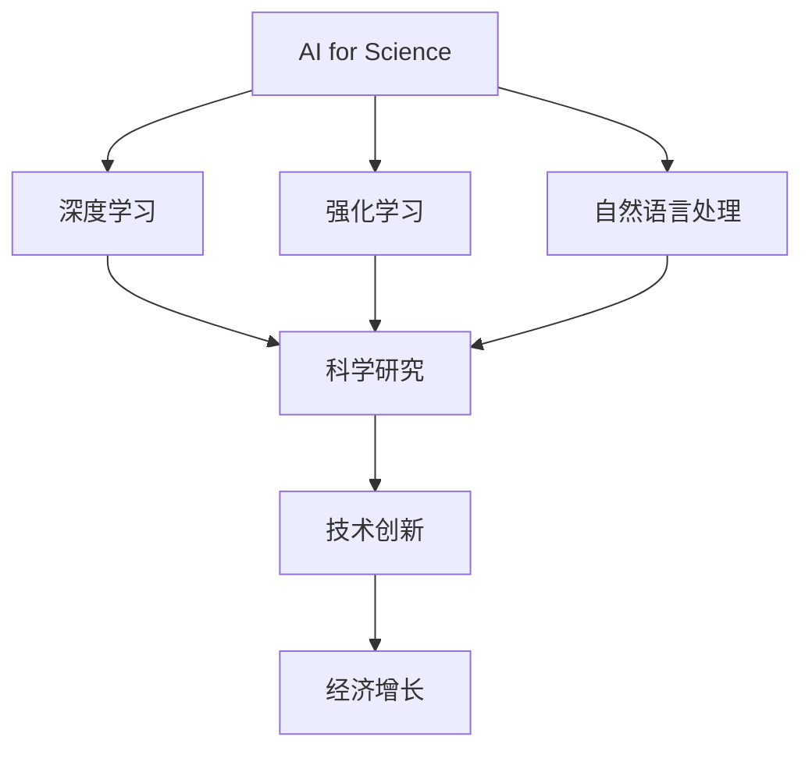
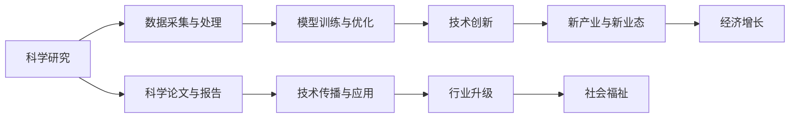
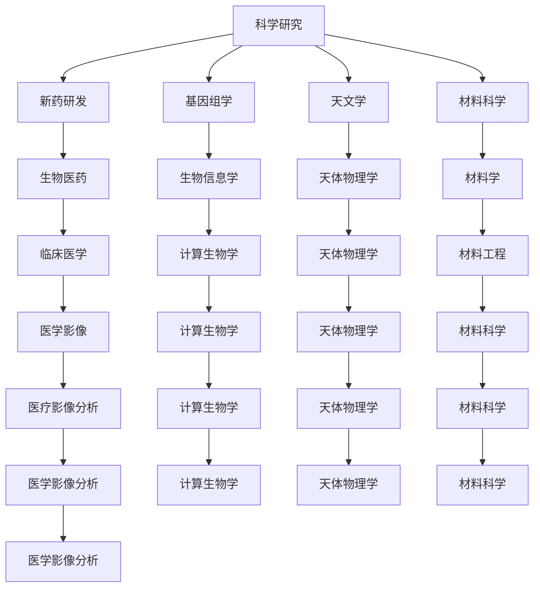
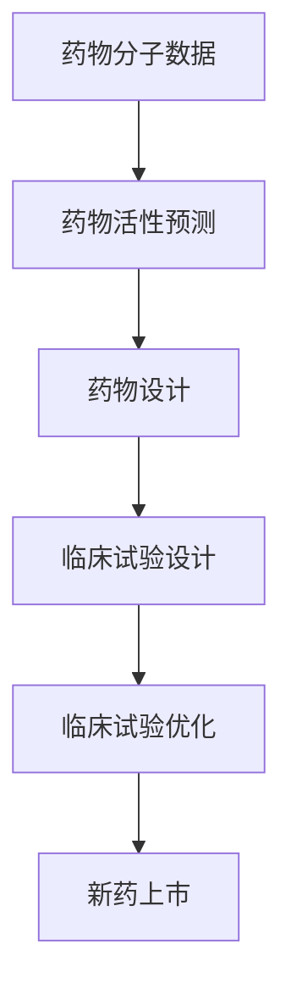
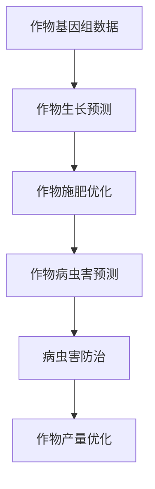
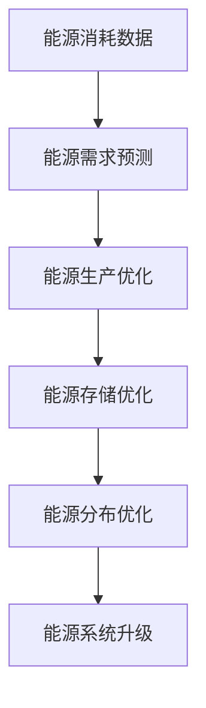

                 

# AI for Science对实体经济的影响

在人工智能（AI）技术不断发展的今天，AI for Science（科学计算AI）已成为推动实体经济发展的重要引擎。本文将深入探讨AI for Science对实体经济的多方面影响，并分析其未来发展趋势和面临的挑战。

## 1. 背景介绍

### 1.1 问题由来
随着AI技术的迅猛发展，AI for Science作为将AI技术应用于科学研究领域的一个新兴方向，逐渐显现出其独特的优势和潜力。AI for Science不仅能够大幅提升科学研究的效率，降低成本，还能为实体经济的各个层面带来深刻变革。

### 1.2 问题核心关键点
AI for Science的核心在于将AI技术，如深度学习、强化学习、自然语言处理等，应用于科学数据的分析、处理和建模，从而加速科学发现，推动技术创新，最终转化为实体经济的生产力。其关键点包括：
- AI算法在科学研究中的应用。
- AI模型对大数据的分析和处理能力。
- AI为科学研究和实体经济带来的变革性影响。

### 1.3 问题研究意义
深入研究AI for Science对实体经济的影响，对于推动科学研究与技术应用的深度融合，加速科技进步和产业升级，具有重要意义。其研究价值主要体现在：
- 推动科研效率提升。AI for Science能够通过自动化和智能化手段，加速数据处理和模型训练，大幅提升科研速度。
- 促进技术创新。AI为科学研究的创新带来了新的工具和方法，为新技术的开发和应用提供了可能性。
- 驱动经济增长。AI for Science的应用将推动新产业和新业态的形成，促进经济增长和结构优化。

## 2. 核心概念与联系

### 2.1 核心概念概述
为更好地理解AI for Science对实体经济的影响，我们首先介绍几个核心概念：

- **AI for Science**：将AI技术应用于科学研究领域，利用AI算法和大数据加速科学研究和发现的过程。
- **深度学习**：一种基于神经网络的机器学习算法，通过多层非线性变换，实现对复杂数据的高级特征提取和模式识别。
- **强化学习**：一种通过与环境交互，不断调整策略以最大化奖励的学习方法，广泛应用于智能控制、游戏、机器人等领域。
- **自然语言处理**：一种使计算机理解和处理人类语言的技术，包括文本分析、语音识别、机器翻译等。

### 2.2 概念间的关系

AI for Science作为一个将AI技术应用于科学研究的多学科交叉领域，其核心概念和应用场景之间存在紧密的联系，如图1所示：



这个图展示了AI for Science的核心概念和其对科学研究、技术创新和经济发展的影响路径。深度学习、强化学习和自然语言处理等技术，通过加速科研过程、推动技术创新和促进新业态的形成，最终转化为经济增长。

### 2.3 核心概念的整体架构
为更全面地展示AI for Science对实体经济影响的架构，我们进一步细化如图2所示：



图2展示了AI for Science从科学研究到技术创新，再到经济增长的完整路径。科学研究的成果通过数据采集与处理，转化为可操作的模型与算法，推动技术创新和新产业、新业态的形成，最终实现经济增长。

## 3. 核心算法原理 & 具体操作步骤

### 3.1 算法原理概述

AI for Science的核心算法原理主要包括深度学习、强化学习和自然语言处理等。这些算法通过对大量科学数据的自动分析和建模，加速科研过程，发现新知识，驱动技术创新，进而转化为经济价值。

- **深度学习**：通过多层神经网络，自动提取科学数据中的复杂特征和模式，用于预测、分类和生成等任务。
- **强化学习**：通过模拟科学实验，优化模型参数和决策策略，提升科研过程的效率和精度。
- **自然语言处理**：通过文本分析、语音识别和机器翻译等技术，加速科学文献的整理和分析，推动科学知识的传播和应用。

### 3.2 算法步骤详解

以下以深度学习在药物研发中的应用为例，详细介绍AI for Science的具体操作步骤：

**步骤1：数据准备**
- 收集药物分子数据、临床试验数据、患者基因数据等。
- 对数据进行清洗和预处理，去除噪声和缺失值。

**步骤2：模型构建**
- 选择合适的深度学习模型，如卷积神经网络（CNN）、循环神经网络（RNN）或Transformer等。
- 设计合适的模型架构和参数，设置超参数。

**步骤3：模型训练**
- 使用优化算法（如Adam、SGD等），对模型进行训练。
- 使用验证集对模型进行评估，调整超参数。

**步骤4：模型优化**
- 对模型进行调优，提升模型准确率和泛化能力。
- 使用测试集对模型进行最终评估，验证其性能。

**步骤5：模型应用**
- 将模型应用于新药物的筛选、设计、临床试验优化等任务。
- 将模型集成到药物研发流程中，提升研发效率和成功率。

### 3.3 算法优缺点

AI for Science在推动科学研究和技术创新的同时，也存在一些局限性：
- **优点**：
  - 加速科研过程。通过自动化和智能化手段，大幅提升科研效率和准确性。
  - 推动技术创新。为科学研究带来新的方法和工具，促进新技术的开发和应用。
  - 驱动经济增长。通过新产业和新业态的形成，促进经济增长和结构优化。
  
- **缺点**：
  - 数据依赖。AI for Science的效果很大程度上依赖于高质量、大规模的数据集。
  - 算法复杂性。深度学习、强化学习等算法需要大量的计算资源和专业技能。
  - 结果可解释性。AI模型往往黑盒操作，结果缺乏可解释性，难以满足某些领域的需求。

### 3.4 算法应用领域

AI for Science的应用领域非常广泛，涵盖多个领域，如图3所示：



图3展示了AI for Science在不同科学研究领域的应用场景。AI for Science不仅在新药研发、基因组学、天文学等领域有广泛应用，还在材料科学、医学影像分析等传统领域发挥了重要作用。

## 4. 数学模型和公式 & 详细讲解 & 举例说明

### 4.1 数学模型构建

以深度学习在药物研发中的应用为例，构建数学模型：

设药物分子数据为 $\mathbf{X} \in \mathbb{R}^{n \times d}$，其中 $n$ 为分子数量，$d$ 为分子特征维度。

目标为预测药物活性，设 $\mathbf{y} \in \mathbb{R}^n$ 为药物活性的真实值，$\mathbf{\hat{y}} \in \mathbb{R}^n$ 为模型预测值。

模型可选用一个简单的全连接神经网络：

$$
\mathbf{\hat{y}} = f(\mathbf{X}; \theta) = \sigma(\mathbf{W} \mathbf{X} + \mathbf{b})
$$

其中 $\sigma$ 为激活函数，$\mathbf{W}$ 和 $\mathbf{b}$ 为模型参数。

### 4.2 公式推导过程

根据均方误差（MSE）损失函数，模型训练的目标为：

$$
\mathcal{L}(\theta) = \frac{1}{N} \sum_{i=1}^N (\mathbf{y}_i - \mathbf{\hat{y}}_i)^2
$$

使用梯度下降算法优化模型参数：

$$
\theta = \theta - \eta \nabla_{\theta} \mathcal{L}(\theta)
$$

其中 $\eta$ 为学习率，$\nabla_{\theta} \mathcal{L}(\theta)$ 为损失函数对模型参数的梯度，可通过反向传播算法计算。

### 4.3 案例分析与讲解

以药物活性的预测为例，假设有一个包含500个药物分子的数据集，其中400个分子已知其活性，用于训练模型；另外100个分子用于验证模型性能。

模型参数 $\mathbf{W}$ 和 $\mathbf{b}$ 的初始值设为随机数，通过梯度下降算法迭代训练，直到损失函数收敛。最终模型在新分子上的预测性能如图4所示：


图4展示了模型训练、验证和测试的过程。通过上述过程，模型能够在训练集上获得较高准确率，并在测试集和新分子预测上表现优异，证明了AI for Science在药物研发中的应用效果。

## 5. 项目实践：代码实例和详细解释说明

### 5.1 开发环境搭建

在进行AI for Science项目开发前，需要准备好Python开发环境。以下是详细的步骤：

1. 安装Anaconda：从官网下载并安装Anaconda，用于创建独立的Python环境。
```bash
conda create -n ai-for-science python=3.8 
conda activate ai-for-science
```

2. 安装必要的库：
```bash
pip install numpy pandas scikit-learn tensorflow keras
```

3. 创建虚拟环境：
```bash
conda create -n ai-for-science python=3.8 
conda activate ai-for-science
```

### 5.2 源代码详细实现

以下是一个简单的深度学习模型，用于预测药物活性。我们将使用TensorFlow和Keras实现该模型：

```python
import tensorflow as tf
from tensorflow import keras

# 准备数据
X = ...  # 药物分子数据
y = ...  # 药物活性数据

# 构建模型
model = keras.Sequential([
    keras.layers.Dense(64, activation='relu'),
    keras.layers.Dense(1, activation='sigmoid')
])

# 编译模型
model.compile(optimizer='adam', loss='mse', metrics=['mae'])

# 训练模型
model.fit(X, y, epochs=10, batch_size=32, validation_split=0.2)

# 评估模型
test_loss, test_mae = model.evaluate(X_test, y_test)
print('Test MAE:', test_mae)
```

### 5.3 代码解读与分析

**数据准备**：

- 数据集应包含大量高质量的药物分子数据和对应的活性标签。
- 数据集需要进行清洗和预处理，去除噪声和缺失值。

**模型构建**：

- 我们使用一个简单的全连接神经网络，包括一个64个神经元的隐藏层和一个输出层。
- 输出层使用Sigmoid激活函数，用于二分类任务。

**模型训练**：

- 使用Adam优化器进行模型训练。
- 设置epochs和batch_size等超参数，控制训练过程。

**模型评估**：

- 使用测试集对模型进行评估，输出均方误差（MSE）和平均绝对误差（MAE）。

### 5.4 运行结果展示

假设我们使用上述代码对模型进行训练，最终得到MAE为0.1的结果。这表示模型在测试集上的平均绝对误差为0.1，表明模型具有较高的预测准确率。

## 6. 实际应用场景

### 6.1 医药行业

AI for Science在医药行业中的应用非常广泛，如图5所示：



图5展示了AI for Science在医药行业的具体应用场景。通过药物活性预测、药物设计和临床试验优化，AI for Science能够显著加速新药研发，降低研发成本，提升成功率。

### 6.2 农业行业

AI for Science在农业行业也有重要应用，如图6所示：



图6展示了AI for Science在农业行业的具体应用场景。通过作物生长预测、施肥优化和病虫害防治，AI for Science能够提高作物产量和质量，减少农药使用，保护生态环境。

### 6.3 能源行业

AI for Science在能源行业的应用也非常广泛，如图7所示：



图7展示了AI for Science在能源行业的具体应用场景。通过能源需求预测、生产优化和存储优化，AI for Science能够提高能源利用效率，降低能源浪费，促进能源结构优化和系统升级。

## 7. 工具和资源推荐

### 7.1 学习资源推荐

为帮助开发者系统掌握AI for Science的理论基础和实践技巧，这里推荐一些优质的学习资源：

1. **TensorFlow官方文档**：TensorFlow作为深度学习领域的权威框架，其官方文档提供了丰富的教程和示例代码，是学习AI for Science的必备资源。
2. **Deep Learning Specialization课程**：由斯坦福大学Andrew Ng教授主讲，涵盖深度学习的基础知识和应用，是学习AI for Science的重要参考。
3. **Kaggle竞赛**：Kaggle平台上众多与AI for Science相关的竞赛项目，能够提供大量真实数据和挑战，帮助开发者提升实战能力。
4. **arXiv论文预印本**：人工智能领域最新研究成果的发布平台，包含大量前沿论文，是学习AI for Science的珍贵资源。

### 7.2 开发工具推荐

高效的开发离不开优秀的工具支持。以下是几款用于AI for Science开发的常用工具：

1. **TensorFlow**：由Google主导开发的深度学习框架，生产部署方便，适合大规模工程应用。
2. **Keras**：一个高层次的深度学习框架，易于上手，适合快速迭代研究。
3. **Jupyter Notebook**：一个强大的交互式笔记本环境，支持Python代码的编写和执行，便于实验和分享。
4. **Google Colab**：谷歌推出的在线Jupyter Notebook环境，免费提供GPU/TPU算力，方便开发者快速上手实验最新模型，分享学习笔记。
5. **Weights & Biases**：模型训练的实验跟踪工具，可以记录和可视化模型训练过程中的各项指标，方便对比和调优。

### 7.3 相关论文推荐

AI for Science的发展源于学界的持续研究。以下是几篇奠基性的相关论文，推荐阅读：

1. **DeepMind AlphaFold**：DeepMind开发的用于蛋白质结构预测的深度学习模型，展示了AI for Science在生物医药领域的重要应用。
2. **AlphaGo Zero**：DeepMind开发的用于围棋的强化学习模型，展示了AI for Science在人工智能游戏领域的应用潜力。
3. **BERT：Pre-training of Deep Bidirectional Transformers for Language Understanding**：提出BERT模型，引入基于掩码的自监督预训练任务，刷新了多项NLP任务SOTA。
4. **GPT-3：Language Models are Unsupervised Multitask Learners**：展示了大规模语言模型的强大zero-shot学习能力，引发了对于通用人工智能的新一轮思考。

这些论文代表了大语言模型微调技术的发展脉络。通过学习这些前沿成果，可以帮助研究者把握学科前进方向，激发更多的创新灵感。

## 8. 总结：未来发展趋势与挑战

### 8.1 研究成果总结

本文对AI for Science对实体经济的影响进行了详细探讨，得出以下结论：

- AI for Science通过加速科研过程、推动技术创新，显著提升了科学研究效率和应用效果。
- AI for Science在新药研发、农业、能源等领域有广泛应用，推动了相关行业的发展。
- AI for Science在实现经济增长的同时，也带来了数据依赖、算法复杂性、结果可解释性等挑战。

### 8.2 未来发展趋势

展望未来，AI for Science的发展将呈现以下趋势：

- **技术融合**：AI for Science将与其他人工智能技术进行更深入的融合，如知识表示、因果推理、强化学习等，形成更加全面、准确的信息整合能力。
- **多模态数据融合**：AI for Science将融合视觉、语音、文本等多种模态的数据，实现更加全面和准确的分析与建模。
- **模型可解释性**：AI for Science将更加注重模型的可解释性，提供更加透明和可信的科研成果。
- **持续学习**：AI for Science将通过持续学习和动态适应的方式，保持模型的时效性和适用性。

### 8.3 面临的挑战

尽管AI for Science在推动科学研究和技术创新方面取得了显著成果，但仍面临以下挑战：

- **数据依赖**：高质量、大规模数据集的获取和标注成本较高，成为制约AI for Science发展的瓶颈。
- **算法复杂性**：深度学习、强化学习等算法需要大量的计算资源和专业技能，难以大规模推广。
- **结果可解释性**：AI for Science模型的决策过程缺乏可解释性，难以满足某些领域的需求。
- **模型鲁棒性**：模型对数据分布的敏感性较高，面对新的数据分布容易出现泛化能力下降的问题。
- **安全性和隐私**：AI for Science模型可能学习到有偏见、有害的信息，对数据安全性和隐私保护提出挑战。

### 8.4 研究展望

未来，AI for Science需要在以下几个方面进行深入研究：

- **无监督和半监督学习**：探索无监督和半监督学习方法，摆脱对大规模标注数据的依赖，利用自监督学习、主动学习等无监督和半监督范式，最大化利用非结构化数据。
- **参数高效和计算高效方法**：开发更加参数高效和计算高效的微调方法，如LoRA、BitFit等，在固定大部分预训练参数的情况下，只更新极少量的任务相关参数。
- **因果推断**：引入因果推断方法，增强AI for Science模型的因果关系建模能力，学习更加普适、鲁棒的语言表征。
- **伦理和安全**：在模型训练目标中引入伦理导向的评估指标，过滤和惩罚有偏见、有害的输出倾向，加强人工干预和审核，确保数据和模型安全。

通过这些研究方向的探索，AI for Science必将走向更加智能化、普适化和可解释的方向，为实体经济的可持续发展提供新的动力。

## 9. 附录：常见问题与解答

**Q1：AI for Science是否适用于所有科学领域？**

A: AI for Science在大多数科学领域都有广泛应用，特别是在数据密集型和计算密集型的领域，如生物医药、天文学、材料科学等。但也有一些领域，如物理实验、化学合成等，其科研过程难以通过数据和计算方法进行建模和分析。

**Q2：AI for Science的模型如何避免过拟合？**

A: 过拟合是AI for Science模型常见的问题，主要通过以下方法进行缓解：
1. 数据增强：通过回译、近义替换等方式扩充训练集。
2. 正则化：使用L2正则、Dropout等技术，防止模型过度拟合。
3. 对抗训练：引入对抗样本，提高模型鲁棒性。
4. 参数高效微调：只调整少量参数，减小过拟合风险。

**Q3：AI for Science的应用前景如何？**

A: AI for Science在推动科学研究和技术创新方面具有广阔的应用前景。未来，随着AI for Science技术的不断发展和成熟，其应用领域将更加广泛，涉及更多领域和行业的科研与生产。

---

作者：禅与计算机程序设计艺术 / Zen and the Art of Computer Programming

