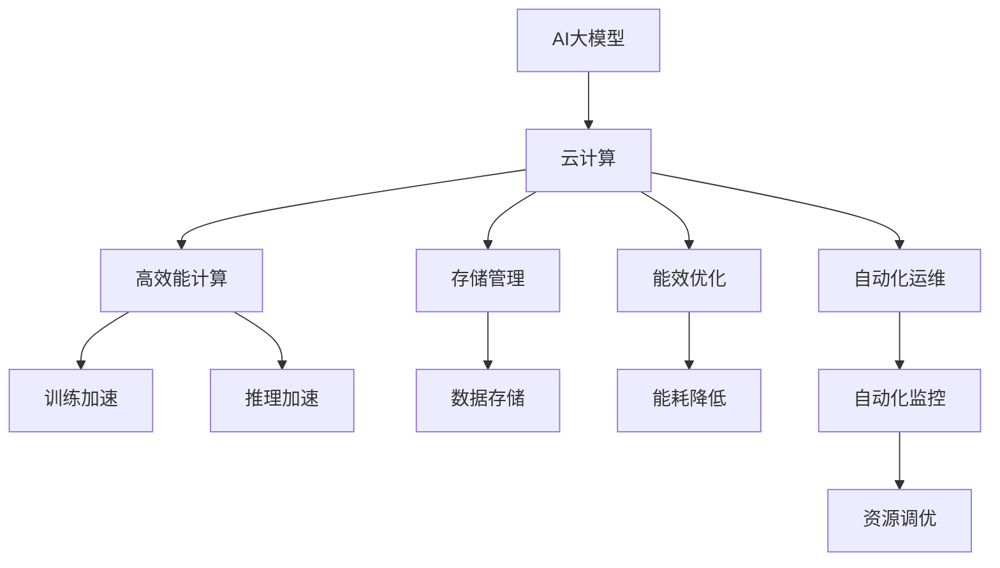
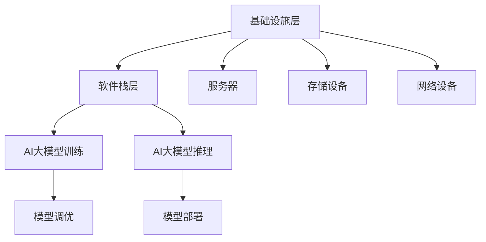

                 

# AI 大模型应用数据中心建设：数据中心运营与管理

> 关键词：AI大模型,数据中心,运营管理,云计算,高效能计算,存储管理,能效优化,自动化运维

## 1. 背景介绍

随着人工智能技术的不断进步，大模型在各类AI应用中发挥着越来越重要的作用。AI大模型在自然语言处理、图像识别、智能推荐等领域展现出卓越的性能。然而，大模型的训练和应用需要庞大的计算资源和存储资源，这使得数据中心（Data Center）建设成为了AI应用的瓶颈。数据中心的运营与管理成为保障大模型应用稳定性和效率的关键。

本文章将从数据中心的视角，深入探讨AI大模型的应用，阐述数据中心在AI大模型训练和应用中的关键作用，以及如何通过有效的运营与管理，保障大模型的高效应用。

## 2. 核心概念与联系

### 2.1 核心概念概述

数据中心是计算资源的载体，通过硬件、软件和网络设施，为计算任务提供基础设施。在大模型应用场景中，数据中心的运营与管理包括但不限于以下几个关键概念：

- **AI大模型**：利用深度学习、自然语言处理等技术，构建的超大参数量的模型，用于解决复杂的AI任务。
- **云计算**：通过互联网，以服务的形式提供计算资源，支持大模型的训练和应用。
- **高效能计算**：针对AI模型高计算密度的需求，设计专门的高性能计算设备，提升计算效率。
- **存储管理**：大模型的训练和应用涉及海量数据的存储和访问，需要高效、可靠、安全的数据存储和管理技术。
- **能效优化**：在满足计算需求的同时，如何最小化能源消耗，是数据中心运营的重要目标。
- **自动化运维**：利用AI和自动化技术，提升数据中心的运维效率和管理水平。

### 2.2 概念间的关系

AI大模型的应用离不开数据中心的支撑。从模型训练、部署、运行到数据存储，每个环节都与数据中心的运营与管理紧密相关。下图展示了核心概念之间的关系：



该图展示了AI大模型应用中的各个环节与数据中心运营的联系。云计算提供计算资源的弹性分配，高效能计算提升模型训练和推理的效率，存储管理保证数据的可靠访问，能效优化降低运营成本，自动化运维提高管理效率。

### 2.3 核心概念的整体架构

从整体架构来看，AI大模型的应用数据中心建设可以分为以下几个关键层次：

1. **基础设施层**：包括服务器、存储设备、网络设备等硬件设施，是数据中心的基础。
2. **软件栈层**：包括操作系统、中间件、编程框架、AI大模型的训练和推理框架等，提供软件支持。
3. **应用层**：包括AI大模型的训练、推理、调优等，实现具体任务。

下图展示了数据中心建设的整体架构：



## 3. 核心算法原理 & 具体操作步骤

### 3.1 算法原理概述

AI大模型在数据中心的应用涉及大规模数据处理、高计算密度计算、高效存储管理等多个技术领域。其核心算法原理可以概括为以下几个方面：

- **分布式计算**：利用多台计算机的并行计算能力，提升计算效率。
- **异构计算**：通过不同类型计算设备的组合，优化计算性能。
- **数据分布式存储**：将数据分布在多个存储设备中，实现数据的可靠性和高并发访问。
- **能效优化算法**：设计算法最小化计算过程中的能源消耗。
- **自动化运维技术**：利用AI和自动化技术，优化数据中心的运营管理。

### 3.2 算法步骤详解

AI大模型的数据中心运营与管理涉及多个步骤。下面以训练为例，详细介绍其具体操作步骤：

1. **硬件选择与配置**：根据模型的计算需求，选择合适的硬件设备，并进行配置。
2. **软件部署与调优**：安装所需的计算和存储软件，并进行调优。
3. **模型训练与监控**：在数据中心进行模型的训练，并实时监控计算资源的使用情况。
4. **模型优化与部署**：根据训练结果，优化模型参数，并进行部署。
5. **自动化运维与故障处理**：利用自动化工具进行日常运维，并及时处理异常情况。

下图展示了模型训练的具体步骤：


### 3.3 算法优缺点

AI大模型的数据中心运营与管理具有以下优点：

- **灵活性高**：利用云计算的弹性资源，可以根据计算需求动态调整资源。
- **效率高**：通过分布式计算和异构计算，提升计算和存储效率。
- **可靠性高**：多副本冗余和数据分片存储，保障数据的可靠性和高可用性。
- **能效高**：通过能效优化算法，最小化能源消耗，降低运营成本。

同时，也存在一些缺点：

- **成本高**：初期硬件和软件投入较大，需要较大的资金支持。
- **复杂度高**：系统结构复杂，涉及多个硬件和软件组件，管理难度大。
- **依赖性强**：对云服务商的依赖较强，数据中心的稳定性和安全性受其影响。

### 3.4 算法应用领域

AI大模型在数据中心的应用广泛，涵盖以下多个领域：

- **自然语言处理**：如BERT、GPT等模型的训练和应用，提升文本理解能力。
- **图像识别**：如ResNet、Inception等模型的训练和应用，提升图像识别能力。
- **推荐系统**：利用深度学习模型进行用户行为分析，提升推荐效果。
- **语音识别**：利用深度学习模型进行语音特征提取和识别，提升人机交互体验。
- **智能运维**：利用AI技术进行数据中心设备的智能监控和故障诊断。

## 4. 数学模型和公式 & 详细讲解  
### 4.1 数学模型构建

在AI大模型训练中，通常采用深度学习框架进行模型训练。以下以TensorFlow为例，介绍模型的数学模型构建。

假设模型为 $M_{\theta}$，其中 $\theta$ 为模型参数，数据集为 $D=\{(x_i,y_i)\}_{i=1}^N$，其中 $x_i$ 为输入数据，$y_i$ 为标签。模型的训练目标是使损失函数 $\mathcal{L}(\theta)$ 最小化，即：

$$
\theta^* = \mathop{\arg\min}_{\theta} \mathcal{L}(\theta)
$$

其中 $\mathcal{L}(\theta)$ 为损失函数，通常采用交叉熵损失函数：

$$
\mathcal{L}(\theta) = -\frac{1}{N}\sum_{i=1}^N \sum_{j=1}^C y_{ij}\log(M_{\theta}(x_i)_{ij})
$$

其中 $C$ 为类别数，$y_{ij}$ 为第 $i$ 个样本的第 $j$ 个类别的标签，$M_{\theta}(x_i)_{ij}$ 为模型在输入 $x_i$ 下预测第 $j$ 个类别的概率。

### 4.2 公式推导过程

在模型训练过程中，采用梯度下降法进行参数更新：

$$
\theta_{t+1} = \theta_t - \eta \nabla_{\theta} \mathcal{L}(\theta_t)
$$

其中 $\eta$ 为学习率，$\nabla_{\theta} \mathcal{L}(\theta_t)$ 为损失函数对参数 $\theta$ 的梯度。

在分布式训练中，需要设计合理的并行计算策略，如数据并行、模型并行、混合并行等，以提升计算效率。

## 5. 项目实践：代码实例和详细解释说明

### 5.1 开发环境搭建

进行AI大模型训练和应用开发，需要搭建以下开发环境：

1. **硬件环境**：高性能服务器或集群，支持分布式计算。
2. **软件环境**：TensorFlow、PyTorch等深度学习框架，以及相应的依赖库。
3. **网络环境**：高速网络，支持大数据量传输。

### 5.2 源代码详细实现

以下以TensorFlow为例，介绍AI大模型在数据中心的应用开发。

```python
import tensorflow as tf
from tensorflow.keras import layers

# 构建模型
model = tf.keras.Sequential([
    layers.Dense(64, activation='relu', input_shape=(784,)),
    layers.Dense(10, activation='softmax')
])

# 编译模型
model.compile(optimizer='adam',
              loss='categorical_crossentropy',
              metrics=['accuracy'])

# 训练模型
model.fit(x_train, y_train, epochs=10, validation_data=(x_test, y_test))
```

### 5.3 代码解读与分析

上述代码展示了使用TensorFlow构建、训练和评估一个简单的分类模型的过程。关键步骤如下：

- **构建模型**：使用Sequential模型，依次添加全连接层和输出层。
- **编译模型**：指定优化器、损失函数和评价指标。
- **训练模型**：使用fit方法进行模型训练，设置训练轮数和验证数据集。

在实际应用中，还需要考虑更多的因素，如模型优化、分布式训练、超参数调优等。

### 5.4 运行结果展示

训练结果可以通过模型评估指标进行展示：

```python
# 评估模型
loss, acc = model.evaluate(x_test, y_test)
print(f'Test loss: {loss:.2f}, Test accuracy: {acc:.2f}')
```

## 6. 实际应用场景

### 6.1 智能客服

AI大模型在智能客服系统中应用广泛。通过训练和微调，模型能够理解用户意图，提供智能回复。数据中心为智能客服提供计算和存储支持，确保系统稳定运行。

### 6.2 金融风控

金融风控系统利用AI大模型进行风险评估和欺诈检测。数据中心提供高并发计算和数据存储，支持模型的实时训练和推理。

### 6.3 医疗影像

医疗影像分析系统利用AI大模型进行图像识别和疾病诊断。数据中心提供高性能计算和存储，支持大规模图像数据处理。

### 6.4 未来应用展望

未来，AI大模型将在更多领域得到应用。数据中心将面临更高的计算和存储需求，需要进一步提升能效和运维水平。

## 7. 工具和资源推荐

### 7.1 学习资源推荐

1. **深度学习框架文档**：如TensorFlow、PyTorch等官方文档，提供详细的API和代码示例。
2. **在线课程**：如Coursera、edX上的深度学习课程，涵盖模型的构建、训练和优化。
3. **书籍**：《深度学习》、《动手学深度学习》等书籍，深入讲解深度学习理论和技术。

### 7.2 开发工具推荐

1. **TensorFlow**：支持分布式计算和异构计算，提供丰富的计算资源。
2. **PyTorch**：支持动态计算图，提供灵活的模型构建方式。
3. **Kubeflow**：基于Kubernetes的AI平台，支持模型训练和部署的自动化。

### 7.3 相关论文推荐

1. **深度学习架构**：如TensorFlow、PyTorch等框架的设计和实现。
2. **分布式计算**：如MapReduce、Spark等分布式计算框架。
3. **能效优化**：如Google的Tensor Processing Unit（TPU），提升AI计算效率。

## 8. 总结：未来发展趋势与挑战

### 8.1 研究成果总结

AI大模型的应用离不开数据中心的支撑。数据中心提供了强大的计算和存储能力，支持AI模型的训练和应用。未来，数据中心将面临更高的计算需求和能效挑战，需要不断提升计算和存储效率。

### 8.2 未来发展趋势

1. **边缘计算**：利用分布式计算，将计算任务离散化，提升响应速度。
2. **量子计算**：利用量子计算提升计算效率，加速模型训练。
3. **智能运维**：利用AI技术进行智能运维，提升数据中心的管理效率。

### 8.3 面临的挑战

1. **成本问题**：大模型训练和应用需要大量的计算和存储资源，初期投入较大。
2. **能效问题**：数据中心的能耗高，如何提升能效是一个重要课题。
3. **安全问题**：数据中心存储大量敏感数据，安全问题不容忽视。

### 8.4 研究展望

1. **模型优化**：提升模型的计算效率和推理速度，减少资源消耗。
2. **硬件优化**：设计更加高效能的计算和存储设备，提升计算性能。
3. **数据管理**：优化数据存储和访问，提升数据的可靠性和安全性。

## 9. 附录：常见问题与解答

**Q1: 数据中心如何保障AI大模型的高效应用？**

A: 数据中心通过分布式计算、异构计算、高效存储管理和能效优化等技术，提升AI大模型的计算和存储效率，保障模型的高效应用。

**Q2: 数据中心如何处理数据冗余和备份？**

A: 数据中心采用数据分片和冗余存储策略，确保数据的可靠性和高可用性。同时，定期进行数据备份，保障数据安全。

**Q3: 数据中心如何优化能效？**

A: 数据中心通过硬件优化、能效优化算法和自动化运维等手段，提升能源利用效率，降低运营成本。

**Q4: 数据中心如何保障数据安全？**

A: 数据中心通过访问控制、加密存储、审计记录等手段，保障数据的安全性和隐私性。

**Q5: 数据中心如何应对突发事件？**

A: 数据中心建立应急预案，进行定期演练，确保在突发事件发生时能够迅速响应和恢复。

作者：禅与计算机程序设计艺术 / Zen and the Art of Computer Programming

