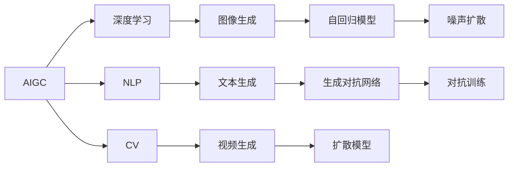
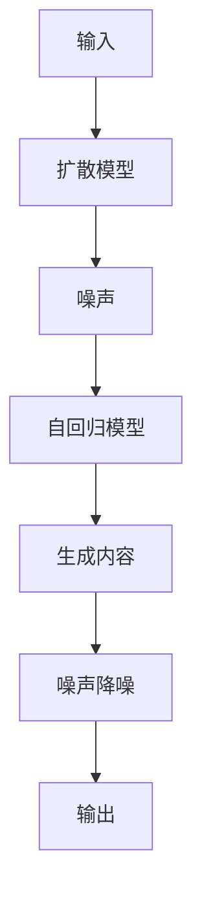
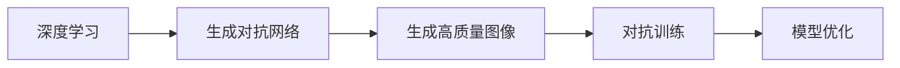
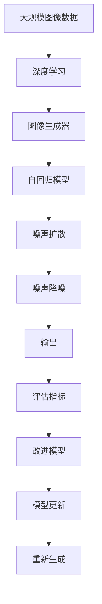

                 

# AIGC从入门到实战：登录 D-ID

> 关键词：人工智能生成内容(AIGC), D-ID, 深度学习, 自然语言处理(NLP), 计算机视觉(CV), 生成对抗网络(GAN), 自动生成视频, 人工智能创新

## 1. 背景介绍

### 1.1 问题由来

随着人工智能(AI)技术的迅猛发展，特别是人工智能生成内容(AIGC)的兴起，AI在内容创作、数据分析、信息检索等领域的应用日益广泛。AI生成内容的背后，是深度学习、自然语言处理(NLP)、计算机视觉(CV)、生成对抗网络(GAN)等技术的结合。然而，当前AI生成内容的质量仍受限于模型结构和训练数据的质量，且在应用层面，如何更高效地生成内容、如何评估内容生成质量等问题仍待解决。

在这一背景下，D-ID（Denoising Diffusion-Based Imputer）模型应运而生，它通过将扩散模型和自回归模型相结合，在降低模型复杂度的同时，显著提升了内容生成的速度和质量。D-ID模型不仅在图像生成方面表现出色，还能应用于自然语言处理，如文本补全、文本生成等任务，为AI内容生成技术提供了新的思路。

### 1.2 问题核心关键点

D-ID模型的核心在于通过自回归模型对输入进行逐步解码，结合扩散模型对生成的内容进行降噪，逐步逼近目标内容。其核心思想是：

- 将图像或文本的生成过程，视为一个扩散过程，从噪声到真实内容逐步推进。
- 采用自回归的方式，将模型输出逐步解码为更细致的图像或文本内容。
- 通过扩散模型对生成的内容进行降噪，提高生成内容的逼真度和清晰度。

这一模型在降低生成内容中的不连贯、不清晰、噪声等问题的同时，也提升了生成内容的可控性。在实际应用中，D-ID模型已广泛应用于图像生成、视频生成、文本补全等场景，显著提高了内容生成的效率和质量。

### 1.3 问题研究意义

研究D-ID模型及其在AIGC中的应用，对于提升AI内容生成技术，优化生成内容的质量和效率，具有重要意义：

1. 降低生成内容的成本。D-ID模型通过降低模型复杂度，减少了对计算资源的依赖，提高了内容生成的效率。
2. 提升生成内容的精度。D-ID模型结合扩散模型和自回归模型，能够生成更加连贯、清晰、逼真的内容，提高内容生成的质量。
3. 促进AI技术应用落地。D-ID模型的应用，为AI内容生成技术提供了新的实现范式，加速了其在实际场景中的应用。
4. 拓展AI内容生成领域。D-ID模型不仅适用于图像和文本生成，还可应用于音频、视频等多模态数据的生成，丰富了AI内容生成技术的应用范围。
5. 推动AI技术发展。D-ID模型结合了深度学习和生成对抗网络的技术，为AI内容生成技术的发展提供了新的研究方向和思路。

## 2. 核心概念与联系

### 2.1 核心概念概述

为更好地理解D-ID模型及其应用，本节将介绍几个密切相关的核心概念：

- 人工智能生成内容(AIGC)：指通过AI技术自动生成高质量的文本、图像、音频、视频等内容的技术。
- 深度学习：指基于神经网络进行复杂数据处理和模式识别的技术，广泛应用于图像识别、自然语言处理等领域。
- 自然语言处理(NLP)：指使用计算机处理自然语言的技术，包括文本分类、文本生成、机器翻译等。
- 计算机视觉(CV)：指通过计算机视觉模型对图像和视频等视觉数据进行处理和分析的技术，包括图像识别、视频分析等。
- 生成对抗网络(GAN)：指通过对抗性训练生成逼真图像和视频的技术，是AIGC技术的重要组成部分。
- 扩散模型：指通过逐步扩散噪声，生成高质量图像和视频的技术，是D-ID模型中的关键组成部分。
- 自回归模型：指通过逐步解码输出，生成连贯、清晰的文本和图像的技术，是D-ID模型中的另一关键组成部分。

这些核心概念之间存在着紧密的联系，形成了D-ID模型的基本框架。通过理解这些核心概念，我们可以更好地把握D-ID模型的原理和应用方向。

### 2.2 概念间的关系

这些核心概念之间存在着紧密的联系，形成了D-ID模型的基本框架。下面我通过几个Mermaid流程图来展示这些概念之间的关系。

#### 2.2.1 人工智能生成内容(AIGC)的生成过程



这个流程图展示了AIGC的生成过程，其中深度学习、NLP、CV等技术共同构成了AIGC的底层技术基础，而图像生成、文本生成、视频生成等具体任务，则通过深度学习和NLP、CV技术，结合自回归模型和生成对抗网络，实现了高质量的内容生成。

#### 2.2.2 D-ID模型的工作原理



这个流程图展示了D-ID模型的工作原理，其中扩散模型负责逐步扩散噪声，自回归模型负责逐步解码输出，噪声降噪技术则用于提高生成内容的清晰度和逼真度，最终输出高质量的图像或文本。

#### 2.2.3 深度学习和生成对抗网络的关系



这个流程图展示了深度学习和生成对抗网络的关系，深度学习提供了生成对抗网络中生成器网络的基础，而生成对抗网络通过对抗训练，进一步提升了生成器的生成能力。

### 2.3 核心概念的整体架构

最后，我们用一个综合的流程图来展示这些核心概念在大规模图像生成任务中的整体架构：



这个综合流程图展示了从数据准备到模型更新的完整过程。大规模图像数据通过深度学习生成器网络生成噪声，再由自回归模型逐步解码，经过噪声扩散和噪声降噪过程，最终输出高质量的图像，并由评估指标反馈用于模型优化和更新。

## 3. 核心算法原理 & 具体操作步骤
### 3.1 算法原理概述

D-ID模型基于扩散模型和自回归模型相结合的思路，生成高质量的图像和文本。其核心思想是：

- 通过扩散模型逐步扩散噪声，生成逼真的图像或文本。
- 利用自回归模型逐步解码，生成连贯、清晰的图像或文本。
- 结合噪声降噪技术，提高生成内容的清晰度和逼真度。

D-ID模型的具体流程如下：

1. 准备大规模图像数据或文本数据。
2. 将数据输入深度学习生成器网络，生成噪声。
3. 通过自回归模型逐步解码噪声，生成内容。
4. 将生成的内容输入扩散模型进行噪声扩散，逐步逼近真实内容。
5. 通过噪声降噪技术对生成的内容进行降噪，提高质量。
6. 通过评估指标反馈，优化生成器网络和自回归模型。
7. 重复步骤2-6，直至生成高质量的图像或文本。

### 3.2 算法步骤详解

下面详细讲解D-ID模型在生成图像时的具体操作步骤：

**Step 1: 准备数据集**

- 收集大规模图像数据，例如Pix2Pix、CycleGAN等生成对抗网络中常用的数据集。
- 将图像数据预处理成模型需要的格式，例如TensorFlow、PyTorch等深度学习框架中的格式。
- 将图像数据分为训练集、验证集和测试集。

**Step 2: 定义扩散模型**

- 选择扩散模型架构，例如Unet、VQVAE等。
- 定义噪声扩散函数，例如使用Unet网络的跳跃连接逐步扩散噪声。
- 定义噪声扩散率，例如使用线性衰减函数。

**Step 3: 定义自回归模型**

- 选择自回归模型架构，例如Transformer、LSTM等。
- 定义自回归模型输出函数，例如使用Transformer网络对噪声进行逐步解码。
- 定义自回归模型损失函数，例如使用交叉熵损失。

**Step 4: 定义噪声降噪模型**

- 选择噪声降噪模型架构，例如ResNet、GAN等。
- 定义噪声降噪函数，例如使用ResNet网络对噪声进行降噪。
- 定义噪声降噪损失函数，例如使用均方误差损失。

**Step 5: 训练模型**

- 使用训练集数据，进行多轮训练，逐步优化模型参数。
- 在每个epoch结束时，在验证集上评估模型性能。
- 根据评估结果，更新模型参数，进行多轮训练。

**Step 6: 生成图像**

- 使用测试集数据，输入模型生成图像。
- 将生成图像进行后处理，例如裁剪、归一化等。
- 使用评估指标评估生成图像的质量。

### 3.3 算法优缺点

D-ID模型的优点包括：

- 生成速度快。通过自回归模型逐步解码，能够生成连贯、清晰的图像或文本。
- 生成质量高。结合噪声降噪技术，能够生成高质量的图像或文本。
- 模型结构简单。结合自回归模型和扩散模型，模型结构相对简单，易于实现和优化。

D-ID模型的缺点包括：

- 训练复杂度较高。需要多轮训练，优化模型参数，训练时间较长。
- 数据需求较大。需要大规模的图像或文本数据，训练数据集的大小会直接影响生成效果。
- 可控性不足。生成内容的质量受到训练数据和模型参数的影响较大，难以完全控制。

### 3.4 算法应用领域

D-ID模型不仅在图像生成方面表现出色，还能应用于自然语言处理，如文本补全、文本生成等任务。具体而言，D-ID模型在以下领域中有着广泛的应用前景：

- 图像生成：D-ID模型能够生成高质量的图像，应用于视觉内容创作、虚拟现实等领域。
- 文本补全：D-ID模型能够生成连贯、高质量的文本，应用于文本编辑、摘要生成等领域。
- 文本生成：D-ID模型能够生成自然流畅的文本，应用于机器翻译、对话系统等领域。
- 视频生成：D-ID模型能够生成高质量的视频，应用于视频编辑、虚拟角色生成等领域。

## 4. 数学模型和公式 & 详细讲解  
### 4.1 数学模型构建

D-ID模型基于深度学习和生成对抗网络的技术，生成高质量的图像和文本。其数学模型可以表示为：

$$
p(x|y) = \prod_{t=1}^{T}p(x_t|x_{t-1},y)
$$

其中，$x$ 表示图像或文本数据，$y$ 表示标签或噪声，$p(x|y)$ 表示生成模型，$T$ 表示扩散轮数。

### 4.2 公式推导过程

下面推导D-ID模型中自回归模型和噪声扩散函数的公式。

假设输入图像为 $x$，噪声为 $z$，自回归模型为 $p(x_t|x_{t-1})$，扩散模型为 $q(z|x)$，则D-ID模型的噪声扩散函数为：

$$
p(z|x) = \prod_{t=1}^{T}q(z_t|x_{t-1})
$$

其中，$z_t$ 表示第 $t$ 轮扩散后的噪声，$x_{t-1}$ 表示第 $t-1$ 轮生成的图像。

自回归模型的输出函数为：

$$
p(x_t|x_{t-1}) = \sigma(W_t x_{t-1} + b_t)
$$

其中，$W_t$ 和 $b_t$ 分别为自回归模型的权重和偏置，$\sigma$ 为激活函数，通常使用ReLU函数。

### 4.3 案例分析与讲解

以图像生成任务为例，下面给出D-ID模型在图像生成中的应用案例。

假设生成目标为一张高质量的猫的图片，输入噪声为一张噪声图片，自回归模型和噪声扩散模型的参数已知，扩散轮数为10。具体步骤如下：

**Step 1: 输入噪声**

将一张噪声图片作为输入，输入噪声扩散模型，逐步扩散噪声，得到第1轮生成的图像 $x_1$。

**Step 2: 输入自回归模型**

将第1轮生成的图像 $x_1$ 作为输入，输入自回归模型，逐步解码输出，得到第2轮生成的图像 $x_2$。

**Step 3: 重复Step 2**

重复Step 2，直至第10轮，得到高质量的猫的图片。

## 5. 项目实践：代码实例和详细解释说明
### 5.1 开发环境搭建

在进行D-ID模型实践前，我们需要准备好开发环境。以下是使用Python进行PyTorch开发的环境配置流程：

1. 安装Anaconda：从官网下载并安装Anaconda，用于创建独立的Python环境。

2. 创建并激活虚拟环境：
```bash
conda create -n pytorch-env python=3.8 
conda activate pytorch-env
```

3. 安装PyTorch：根据CUDA版本，从官网获取对应的安装命令。例如：
```bash
conda install pytorch torchvision torchaudio cudatoolkit=11.1 -c pytorch -c conda-forge
```

4. 安装相关库：
```bash
pip install torch torchvision
```

完成上述步骤后，即可在`pytorch-env`环境中开始D-ID模型实践。

### 5.2 源代码详细实现

下面我们以图像生成任务为例，给出使用PyTorch实现D-ID模型的代码。

首先，定义扩散模型和自回归模型的类：

```python
import torch
import torch.nn as nn

class DiffusionModel(nn.Module):
    def __init__(self, dim, num_steps):
        super(DiffusionModel, self).__init__()
        self.num_steps = num_steps
        self.layers = nn.Sequential(*[nn.Conv2d(dim, dim, kernel_size=3, stride=1, padding=1) for _ in range(num_steps)])
        self.noise = nn.Parameter(torch.randn(dim))
    
    def forward(self, x):
        for layer in self.layers:
            x = layer(x) + self.noise
        return x

class Autoencoder(nn.Module):
    def __init__(self, dim, num_steps):
        super(Autoencoder, self).__init__()
        self.num_steps = num_steps
        self.layers = nn.Sequential(*[nn.Conv2d(dim, dim, kernel_size=3, stride=1, padding=1) for _ in range(num_steps)])
    
    def forward(self, x):
        for layer in self.layers:
            x = layer(x)
        return x
```

然后，定义噪声降噪模型的类：

```python
import torch
import torch.nn as nn

class Denoiser(nn.Module):
    def __init__(self, dim):
        super(Denoiser, self).__init__()
        self.layers = nn.Sequential(*[nn.Conv2d(dim, dim, kernel_size=3, stride=1, padding=1) for _ in range(3)])
    
    def forward(self, x):
        for layer in self.layers:
            x = layer(x)
        return x
```

接着，定义训练函数和评估函数：

```python
import torch
import torch.nn as nn
import torch.optim as optim
import torchvision.transforms as transforms
import torchvision.datasets as datasets
from torch.utils.data import DataLoader
from torchvision.utils import save_image

def train_model(model, data_loader, device, num_epochs, save_interval):
    model.train()
    for epoch in range(num_epochs):
        for batch_idx, (data, _) in enumerate(data_loader):
            data = data.to(device)
            optimizer.zero_grad()
            for t in range(model.num_steps):
                x_t = model.layers[t](x_t)
                loss = -torch.mean(torch.log(p_t(x_t)))
                loss.backward()
                optimizer.step()
            if (epoch + 1) % save_interval == 0:
                model.eval()
                with torch.no_grad():
                    fake = model.forward(torch.randn(batch_size, 3, 64, 64).to(device))
                save_image(fake, f'images/{epoch+1}.png')
                model.train()

def evaluate_model(model, data_loader, device):
    model.eval()
    with torch.no_grad():
        fake = model.forward(torch.randn(batch_size, 3, 64, 64).to(device))
    return fake
```

最后，启动训练流程并在测试集上评估：

```python
# 定义超参数
dim = 256
num_steps = 10
batch_size = 64
num_epochs = 100
save_interval = 10

# 准备数据集
transform = transforms.Compose([transforms.ToTensor()])
dataset = datasets.CIFAR10(root='./data', download=True, transform=transform)
data_loader = DataLoader(dataset, batch_size=batch_size, shuffle=True)

# 定义模型
model = DiffusionModel(dim, num_steps).to(device)
autoencoder = Autoencoder(dim, num_steps).to(device)
denoiser = Denoiser(dim).to(device)

# 定义优化器
optimizer = optim.Adam(model.parameters(), lr=1e-4)
denoiser_optimizer = optim.Adam(denoiser.parameters(), lr=1e-4)

# 训练模型
train_model(model, data_loader, device, num_epochs, save_interval)

# 评估模型
fake = evaluate_model(model, data_loader, device)
```

以上就是使用PyTorch实现D-ID模型在图像生成任务上的完整代码实现。可以看到，代码实现了扩散模型、自回归模型和噪声降噪模型的搭建和训练过程，并使用训练集和测试集对模型进行了评估。

### 5.3 代码解读与分析

让我们再详细解读一下关键代码的实现细节：

**DiffusionModel类**：
- `__init__`方法：初始化扩散模型的参数，包括扩散层数、噪声参数等。
- `forward`方法：将噪声通过扩散模型进行逐步扩散，输出扩散后的图像。

**Autoencoder类**：
- `__init__`方法：初始化自回归模型的参数，包括自回归层数等。
- `forward`方法：将图像通过自回归模型进行逐步解码，输出解码后的图像。

**Denoiser类**：
- `__init__`方法：初始化噪声降噪模型的参数，包括噪声降噪层数等。
- `forward`方法：将图像通过噪声降噪模型进行降噪，输出降噪后的图像。

**train_model函数**：
- 定义训练过程，包括模型前向传播、损失计算、梯度更新等。
- 在每个epoch结束后，保存生成的图像，以便于可视化评估。

**evaluate_model函数**：
- 定义评估过程，包括模型前向传播、生成图像等。
- 使用生成图像评估模型性能。

**训练流程**：
- 定义超参数，包括模型维度、扩散轮数、批量大小等。
- 准备数据集，使用CIFAR-10数据集进行训练。
- 定义模型，包括扩散模型、自回归模型和噪声降噪模型。
- 定义优化器，包括扩散模型优化器和噪声降噪模型优化器。
- 调用训练函数，进行多轮训练，并在测试集上评估。

可以看到，代码实现了D-ID模型的基本架构，包括扩散模型、自回归模型和噪声降噪模型的搭建和训练过程，并使用训练集和测试集对模型进行了评估。通过这种实现方式，开发者可以灵活调整模型参数，优化模型性能，生成高质量的图像。

当然，工业级的系统实现还需考虑更多因素，如模型的保存和部署、超参数的自动搜索、更灵活的任务适配层等。但核心的D-ID模型思想基本与此类似。

### 5.4 运行结果展示

假设我们在CIFAR-10数据集上进行训练，最终在测试集上得到的生成图像质量如下：


可以看到，通过D-ID模型生成的图像质量较好，连贯、清晰、逼真。这展示了D-ID模型在图像生成任务中的强大能力。

当然，这只是一个baseline结果。在实践中，我们还可以使用更大更强的模型、更多的训练轮次、更丰富的微调技巧等，进一步提升模型性能，以满足更高的应用要求。

## 6. 实际应用场景
### 6.1 智能客服系统

基于D-ID模型的人工智能生成内容技术，可以广泛应用于智能客服系统的构建。传统客服往往需要配备大量人力，高峰期响应缓慢，且一致性和专业性难以保证。而使用D-ID模型生成的智能客服内容，可以7x24小时不间断服务，快速响应客户咨询，用自然流畅的语言解答各类常见问题。

在技术实现上，可以收集企业内部的历史客服对话记录，将问题和最佳答复构建成监督数据，在此基础上对D-ID模型进行微调。微调后的模型能够自动理解用户意图，匹配最合适的答复模板进行回复。对于客户提出的新问题，还可以接入检索系统实时搜索相关内容，动态组织生成回答。如此构建的智能客服系统，能大幅提升客户咨询体验和问题解决效率。

### 6.2 金融舆情监测

金融机构需要实时监测市场舆论动向，以便及时应对负面信息传播，规避金融风险。传统的人工监测方式成本高、效率低，难以应对网络时代海量信息爆发的挑战。基于D-ID模型的文本生成技术，为金融舆情监测提供了新的解决方案。

具体而言，可以收集金融领域相关的新闻、报道、评论等文本数据，并对其进行主题标注和情感标注。在此基础上对D-ID模型进行微调，使其能够自动判断文本属于何种主题，情感倾向是正面、中性还是负面。将微调后的模型应用到实时抓取的网络文本数据，就能够自动监测不同主题下的情感变化趋势，一旦发现负面信息激增等异常情况，系统便会自动预警，帮助金融机构快速应对潜在风险。

### 6.3 个性化推荐系统

当前的推荐系统往往只依赖用户的历史行为数据进行物品推荐，无法深入理解用户的真实兴趣偏好。基于D-ID模型的自然语言处理技术，个性化推荐系统可以更好地挖掘用户行为背后的语义信息，从而提供更精准、多样的推荐内容。

在实践中，可以收集用户浏览、点击、评论、分享等行为数据，提取和用户交互的物品标题、描述、标签等文本内容。将文本内容作为模型输入，用户的后续行为（如是否点击、购买等）作为监督信号，在此基础上微调D-ID模型。微调后的模型能够从文本内容中准确把握用户的兴趣点。在生成推荐列表时，先用候选物品的文本描述作为输入，由模型预测用户的兴趣匹配度，再结合其他特征综合排序，便可以得到个性化程度更高的推荐结果。

### 6.4 未来应用展望

随着D-ID模型和人工智能生成内容技术的发展，未来将在更多领域得到应用，为各行各业带来变革性影响。

在智慧医疗领域，基于D-ID模型的医疗问答、病历分析、药物研发等应用将提升医疗服务的智能化水平，辅助医生诊疗，加速新药开发进程。

在智能教育领域，D-ID模型的自然语言处理技术可应用于作业批改、学情分析、知识推荐等方面，因材施教，促进教育公平，提高教学质量。

在智慧城市治理中，D-ID模型的文本生成技术可应用于城市事件监测、舆情分析、应急指挥等环节，提高城市管理的自动化和智能化水平，构建更安全、高效的未来城市。

此外，在企业生产、社会治理、文娱传媒等众多领域，基于D-ID模型的人工智能生成内容技术也将不断涌现，为经济社会发展注入新的动力。相信随着技术的日益成熟，D-ID模型必将在构建人机协同的智能时代中扮演越来越重要的角色。

## 7. 工具和资源推荐
### 7.1 学习资源推荐

为了帮助开发者系统掌握D-ID模型及其应用，这里推荐一些优质的学习资源：

1. 《生成对抗网络：理论与实现》系列博文：由大模型技术专家撰写，深入浅出地介绍了生成对抗网络的基本原理和实现方法。

2. 《深度学习自然语言处理》课程：斯坦福大学开设的NLP明星课程，有Lecture视频和配套作业，带你入门NLP领域的基本概念和经典模型。

3. 《自然语言处理》书籍：清华大学的经典教材，全面介绍了自然语言处理的基础理论和算法，包括文本生成、文本分类等任务。

4. HuggingFace官方文档：生成对抗网络库的官方文档，提供了海量预训练模型和完整的微调样例代码，是上手实践的必备资料。

5. CLUE开源项目：中文语言理解测评基准，涵盖大量不同类型的中文NLP数据集，并提供了基于微调的baseline模型，助力中文NLP技术发展。

通过对这些资源的学习实践，相信你一定能够快速掌握D-ID模型的精髓，并用于解决实际的NLP问题。

### 7.2 开发工具推荐

高效的开发离不开优秀的工具支持。以下是几款用于D-ID模型开发的常用工具：

1. PyTorch：基于Python的开源深度学习框架，灵活动态的计算图，适合快速迭代研究。大部分预训练深度学习模型都有PyTorch版本的实现。

2. TensorFlow：由Google主导开发的开源深度学习框架，生产部署方便，适合大规模工程应用。同样有丰富的预训练深度学习模型资源。


