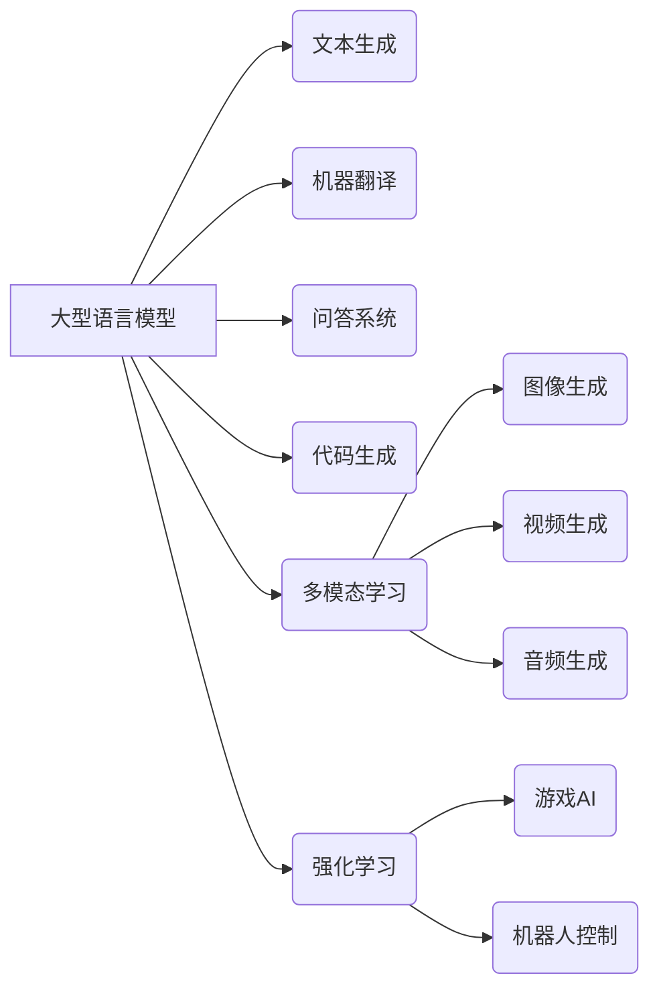

## 未来大型模型应用的四个关键方向

> 关键词：大型语言模型、生成式AI、多模态学习、强化学习、伦理与安全

### 1. 背景介绍

近年来，人工智能领域取得了令人瞩目的进展，其中大型语言模型（LLM）的出现尤为引人注目。LLM 拥有海量参数和强大的学习能力，能够理解和生成人类语言，并在文本生成、翻译、问答等任务中表现出令人惊叹的性能。随着计算能力的不断提升和训练数据的积累，LLM 的规模和能力将持续增长，其应用场景也将更加广泛。

然而，LLM 的发展也面临着一些挑战，例如训练成本高、数据偏见、可解释性差等。为了更好地利用 LLMs 的潜力，我们需要探索其在不同领域的应用方向，并解决其面临的挑战。

### 2. 核心概念与联系

**2.1 核心概念**

* **大型语言模型 (LLM):** 指参数数量超过数十亿甚至千亿的深度学习模型，能够理解和生成人类语言。
* **生成式AI:** 指能够生成新内容的 AI 系统，例如文本、图像、音频等。
* **多模态学习:** 指模型能够处理多种类型的数据，例如文本、图像、音频等，并从中学习知识和模式。
* **强化学习:** 指模型通过与环境交互，学习最优策略以获得最大奖励。

**2.2 架构关系**



**2.3 联系分析**

LLMs 作为生成式AI 的核心技术，能够在文本生成、机器翻译、问答系统等领域发挥重要作用。通过多模态学习，LLMs 可以扩展到处理图像、音频等数据，实现更丰富的应用场景。强化学习可以进一步提升 LLMs 的能力，使其能够学习更复杂的策略，例如游戏AI 和机器人控制。

### 3. 核心算法原理 & 具体操作步骤

**3.1 算法原理概述**

LLMs 通常基于 Transformer 架构，其核心是注意力机制。注意力机制能够让模型关注输入序列中重要的部分，从而更好地理解上下文信息。

**3.2 算法步骤详解**

1. **输入处理:** 将输入文本序列转换为数字向量。
2. **编码:** 使用 Transformer 的编码器层将输入向量编码成上下文表示。
3. **解码:** 使用 Transformer 的解码器层根据上下文表示生成输出文本序列。
4. **输出处理:** 将输出向量转换为文本。

**3.3 算法优缺点**

* **优点:** 能够处理长文本序列，具有强大的文本理解和生成能力。
* **缺点:** 训练成本高，数据偏见问题难以解决，可解释性差。

**3.4 算法应用领域**

* 文本生成
* 机器翻译
* 问答系统
* 代码生成
* 文本摘要
* 情感分析

### 4. 数学模型和公式 & 详细讲解 & 举例说明

**4.1 数学模型构建**

LLMs 通常使用神经网络模型，其核心是 Transformer 架构。Transformer 架构由编码器和解码器两部分组成，每个部分由多层 Transformer 块构成。

**4.2 公式推导过程**

Transformer 块的核心是注意力机制和多头注意力机制。注意力机制能够让模型关注输入序列中重要的部分，而多头注意力机制能够学习到不同类型的注意力模式。

**4.3 案例分析与讲解**

例如，在机器翻译任务中，LLM 可以使用 Transformer 架构将源语言文本编码成上下文表示，然后根据上下文表示生成目标语言文本。

**举例说明:**

假设我们有一个源语言文本 "Hello, world!"，目标语言是 "你好，世界！"。LLM 可以使用 Transformer 架构将 "Hello, world!" 编码成一个上下文表示，然后根据这个上下文表示生成 "你好，世界！"。

**4.4 数学公式**

* **注意力机制:**

$$
Attention(Q, K, V) = \frac{exp(Q \cdot K^T / \sqrt{d_k})}{exp(Q \cdot K^T / \sqrt{d_k})} \cdot V
$$

其中，Q、K、V 分别代表查询矩阵、键矩阵和值矩阵。

* **多头注意力机制:**

$$
MultiHead(Q, K, V) = Concat(head_1, head_2,..., head_h) \cdot W_o
$$

其中，head_1、head_2、..., head_h 分别代表 h 个注意力头的输出，W_o 是一个线性变换矩阵。

### 5. 项目实践：代码实例和详细解释说明

**5.1 开发环境搭建**

* Python 3.7+
* PyTorch 或 TensorFlow
* CUDA 和 cuDNN

**5.2 源代码详细实现**

```python
import torch
import torch.nn as nn

class TransformerBlock(nn.Module):
    def __init__(self, d_model, nhead, dim_feedforward=2048, dropout=0.1):
        super(TransformerBlock, self).__init__()
        self.self_attn = nn.MultiheadAttention(d_model, nhead, dropout=dropout)
        self.linear1 = nn.Linear(d_model, dim_feedforward)
        self.dropout = nn.Dropout(dropout)
        self.linear2 = nn.Linear(dim_feedforward, d_model)

    def forward(self, x):
        # Self-attention
        attn_output, _ = self.self_attn(x, x, x)
        x = x + self.dropout(attn_output)

        # Feed-forward network
        x = self.linear2(self.dropout(torch.relu(self.linear1(x))))
        x = x + x

        return x

#...
```

**5.3 代码解读与分析**

* TransformerBlock 类定义了一个 Transformer 块，包含自注意力机制和前馈神经网络。
* self_attn 属性是一个多头注意力机制，用于计算输入序列之间的注意力权重。
* linear1 和 linear2 属性是前馈神经网络的线性层。
* dropout 属性是一个 dropout 层，用于防止过拟合。

**5.4 运行结果展示**

训练好的 LLMs 可以用于各种自然语言处理任务，例如文本生成、机器翻译、问答系统等。

### 6. 实际应用场景

**6.1 文本生成**

* 自动生成新闻报道、小说、诗歌等文本。
* 创建聊天机器人、虚拟助手等对话系统。
* 辅助写作，例如生成邮件、报告等。

**6.2 机器翻译**

* 将文本从一种语言翻译成另一种语言。
* 支持多种语言对的翻译，例如英语-中文、法语-西班牙语等。
* 提高翻译质量和效率。

**6.3 问答系统**

* 回答用户提出的问题，例如事实问题、概念问题等。
* 基于知识库或文本语料库进行回答。
* 提供更智能、更自然的交互体验。

**6.4 代码生成**

* 根据自然语言描述生成代码。
* 提高开发效率，减少代码编写错误。
* 支持多种编程语言。

**6.5 其他应用场景**

* 文本摘要
* 情感分析
* 代码注释
* 文本分类

**6.6 未来应用展望**

LLMs 将在更多领域得到应用，例如教育、医疗、法律等。

### 7. 工具和资源推荐

**7.1 学习资源推荐**

* **书籍:**
    * 《深度学习》
    * 《自然语言处理》
* **在线课程:**
    * Coursera: 自然语言处理
    * edX: 深度学习
* **博客:**
    * The Gradient
    * OpenAI Blog

**7.2 开发工具推荐**

* **框架:**
    * PyTorch
    * TensorFlow
* **库:**
    * Hugging Face Transformers
    * Gensim
* **平台:**
    * Google Colab
    * Paperspace Gradient

**7.3 相关论文推荐**

* Attention Is All You Need
* BERT: Pre-training of Deep Bidirectional Transformers for Language Understanding
* GPT-3: Language Models are Few-Shot Learners

### 8. 总结：未来发展趋势与挑战

**8.1 研究成果总结**

LLMs 在文本生成、机器翻译、问答系统等领域取得了显著进展，展现出强大的潜力。

**8.2 未来发展趋势**

* 模型规模和能力将继续提升。
* 多模态学习将成为主流方向。
* 伦理和安全问题将得到更多关注。

**8.3 面临的挑战**

* 训练成本高。
* 数据偏见问题难以解决。
* 可解释性差。
* 伦理和安全风险。

**8.4 研究展望**

* 开发更高效的训练方法。
* 构建更公平、更安全的 LLMs。
* 提升 LLMs 的可解释性。
* 探索 LLMs 在更多领域的应用。

### 9. 附录：常见问题与解答

* **什么是大型语言模型？**

LLM 是参数数量超过数十亿甚至千亿的深度学习模型，能够理解和生成人类语言。

* **LLMs 的训练成本高吗？**

是的，LLMs 的训练成本很高，需要大量的计算资源和数据。

* **LLMs 是否存在数据偏见问题？**

是的，LLMs 的训练数据可能存在偏见，导致模型输出也存在偏见。

* **如何解决 LLMs 的可解释性问题？**

这是一个开放性问题，目前还没有完美的解决方案。

* **LLMs 是否存在伦理和安全风险？**

是的，LLMs 可能被用于生成虚假信息、进行攻击等恶意活动。


作者：禅与计算机程序设计艺术 / Zen and the Art of Computer Programming 
