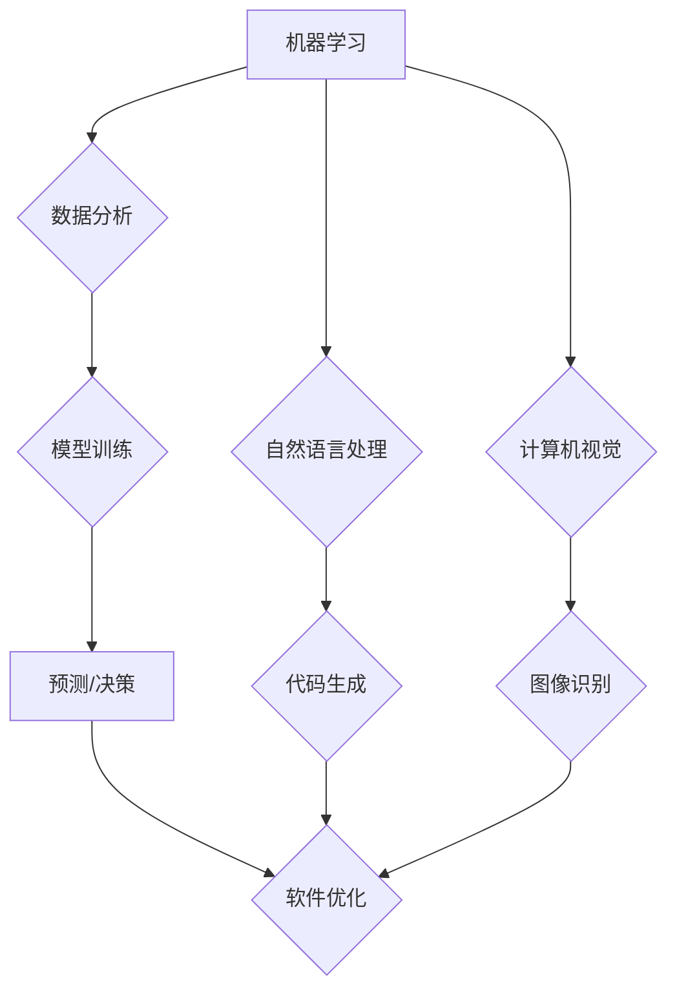

## 软件 2.0 的应用：从实验室走向现实

> 关键词：人工智能、软件架构、机器学习、深度学习、自适应系统、可解释性、软件进化

### 1. 背景介绍

软件行业正处于一个前所未有的变革时期。传统的软件开发模式，以人为中心，依赖于静态的代码和预先设定的规则，越来越难以应对日益复杂、动态变化的业务需求。 

近年来，人工智能（AI）技术取得了飞速发展，为软件开发带来了全新的可能性。AI 算法能够学习和理解数据，自动生成代码、优化软件性能、预测软件故障等，为软件开发带来了革命性的变革。

我们正迈入软件 2.0 时代，其核心特征是：

* **智能化：** 软件能够像人类一样学习、思考和决策，并根据环境变化自适应调整行为。
* **自动化：** AI 算法可以自动化许多重复性任务，例如代码生成、测试和部署，提高开发效率。
* **可解释性：** 软件的决策过程更加透明，能够解释其背后的逻辑，增强用户信任。
* **进化性：** 软件能够持续学习和改进，随着时间的推移不断完善和优化。

### 2. 核心概念与联系

软件 2.0 的实现依赖于一系列核心概念和技术的融合，包括：

* **机器学习（ML）：**  算法从数据中学习模式和规律，用于预测、分类和决策。
* **深度学习（DL）：**  一种更高级的机器学习方法，利用多层神经网络模拟人类大脑的学习过程。
* **自然语言处理（NLP）：**  使计算机能够理解和处理人类语言，例如代码生成、文档分析和聊天机器人。
* **计算机视觉（CV）：**  使计算机能够“看”图像和视频，例如图像识别、物体检测和视频分析。
* **云计算：**  提供强大的计算资源和存储空间，支持大规模数据处理和模型训练。

这些技术相互关联，共同构成了软件 2.0 的基础。

**Mermaid 流程图：**



### 3. 核心算法原理 & 具体操作步骤

#### 3.1  算法原理概述

软件 2.0 中常用的核心算法包括：

* **强化学习（RL）：**  通过奖励机制训练智能体，使其在特定环境中做出最优决策。
* **生成对抗网络（GAN）：**  由两个神经网络组成，一个生成器生成数据，另一个鉴别器判断数据真实性，通过对抗训练生成逼真的数据。
* **图神经网络（GNN）：**  用于处理图结构数据，例如社交网络和知识图谱，可以学习节点和边的关系。

这些算法能够学习复杂的模式和规律，为软件开发提供强大的工具。

#### 3.2  算法步骤详解

以强化学习为例，其基本步骤如下：

1. **环境建模：**  定义软件开发环境，包括状态、动作和奖励函数。
2. **智能体设计：**  设计一个能够感知环境状态并做出动作的智能体，例如一个基于深度学习的代理。
3. **训练过程：**  智能体在环境中进行交互，根据奖励函数更新其策略，使其在长期内获得最大奖励。
4. **部署和评估：**  训练好的智能体部署到实际环境中，并评估其性能。

#### 3.3  算法优缺点

每个算法都有其独特的优缺点：

* **强化学习：**  优点：能够学习复杂的策略，适应动态环境。缺点：训练过程复杂，需要大量数据和计算资源。
* **生成对抗网络：**  优点：能够生成逼真的数据，应用于代码生成和测试用例生成。缺点：训练过程不稳定，容易陷入局部最优。
* **图神经网络：**  优点：能够处理图结构数据，应用于软件依赖关系分析和漏洞检测。缺点：对图结构数据有依赖性，难以处理大型图。

#### 3.4  算法应用领域

这些算法在软件开发领域有着广泛的应用：

* **代码生成：**  利用 NLP 和 GAN 生成代码，提高开发效率。
* **测试用例生成：**  利用 RL 和 GAN 生成测试用例，提高测试覆盖率。
* **软件缺陷检测：**  利用 GNN 和机器学习分析代码，预测和检测软件缺陷。
* **软件性能优化：**  利用 RL 和机器学习优化软件架构和代码，提高性能。
* **软件安全分析：**  利用 GNN 和机器学习分析软件依赖关系和代码结构，识别安全漏洞。

### 4. 数学模型和公式 & 详细讲解 & 举例说明

#### 4.1  数学模型构建

强化学习的核心是马尔可夫决策过程（MDP），其数学模型包括：

* **状态空间 S：**  软件开发环境的所有可能状态。
* **动作空间 A：**  智能体可以采取的所有动作。
* **转移概率 P(s' | s, a)：**  从状态 s 执行动作 a 后转移到状态 s' 的概率。
* **奖励函数 R(s, a)：**  在状态 s 执行动作 a 后获得的奖励。
* **折扣因子 γ：**  未来奖励的权重。

#### 4.2  公式推导过程

强化学习的目标是找到一个策略 π(s)，使得智能体在长期内获得最大奖励。可以使用动态规划或蒙特卡罗方法来求解最优策略。

最优价值函数 V*(s) 表示从状态 s 开始执行最优策略的期望累积奖励：

$$V^*(s) = \max_{\pi} \mathbb{E}_{\pi} \sum_{t=0}^{\infty} \gamma^t R(s_t, a_t)$$

其中，π 表示策略，$\mathbb{E}_{\pi}$ 表示对策略 π 下的期望。

#### 4.3  案例分析与讲解

例如，在代码生成任务中，状态空间可以是代码片段，动作空间可以是添加代码元素，奖励函数可以是代码正确性的指标。通过强化学习，智能体可以学习到生成高质量代码的策略。

### 5. 项目实践：代码实例和详细解释说明

#### 5.1  开发环境搭建

* **操作系统：**  Linux 或 macOS
* **编程语言：**  Python
* **深度学习框架：**  TensorFlow 或 PyTorch
* **其他工具：**  Git、Jupyter Notebook

#### 5.2  源代码详细实现

以下是一个简单的代码生成示例，使用 TensorFlow 和 RNN 模型：

```python
import tensorflow as tf

# 定义 RNN 模型
model = tf.keras.Sequential([
    tf.keras.layers.Embedding(input_dim=vocab_size, output_dim=embedding_dim),
    tf.keras.layers.LSTM(units=lstm_units),
    tf.keras.layers.Dense(units=vocab_size, activation='softmax')
])

# 编译模型
model.compile(optimizer='adam', loss='sparse_categorical_crossentropy', metrics=['accuracy'])

# 训练模型
model.fit(x_train, y_train, epochs=epochs)

# 生成代码
input_text = "def hello_world():"
generated_text = model.predict(input_text)
```

#### 5.3  代码解读与分析

* **Embedding 层：** 将单词映射到低维向量空间，捕捉单词之间的语义关系。
* **LSTM 层：**  一种循环神经网络，能够处理序列数据，例如代码片段。
* **Dense 层：**  全连接层，输出每个单词的概率分布。
* **训练过程：**  使用训练数据训练模型，使其能够预测下一个单词。
* **代码生成：**  输入一段代码片段，模型会根据训练数据预测下一个单词，并生成新的代码。

#### 5.4  运行结果展示

训练好的模型可以生成类似于以下的代码：

```python
def hello_world():
    print("Hello, world!")
```

### 6. 实际应用场景

软件 2.0 的应用场景非常广泛：

* **自动代码生成：**  自动生成代码模板、函数和类，提高开发效率。
* **智能代码补全：**  根据上下文自动补全代码，减少代码编写错误。
* **代码质量分析：**  自动分析代码质量，识别潜在的缺陷和安全漏洞。
* **软件测试自动化：**  自动生成测试用例，提高测试覆盖率和效率。
* **软件维护和升级：**  自动分析软件代码，识别需要维护和升级的部分。

### 6.4  未来应用展望

未来，软件 2.0 将在更多领域得到应用，例如：

* **个性化软件开发：**  根据用户的需求自动生成个性化的软件。
* **自适应软件系统：**  软件能够根据环境变化自动调整其行为。
* **协同软件开发：**  AI 辅助软件开发人员协同工作，提高开发效率。

### 7. 工具和资源推荐

#### 7.1  学习资源推荐

* **书籍：**
    * 《深度学习》
    * 《强化学习：原理、算法和应用》
    * 《软件工程》
* **在线课程：**
    * Coursera
    * edX
    * Udacity

#### 7.2  开发工具推荐

* **深度学习框架：**
    * TensorFlow
    * PyTorch
* **代码生成工具：**
    * Tabnine
    * GitHub Copilot
* **软件测试工具：**
    * Selenium
    * Appium

#### 7.3  相关论文推荐

* **强化学习在软件工程中的应用：**
    * [https://arxiv.org/abs/1909.01913](https://arxiv.org/abs/1909.01913)
* **生成对抗网络在代码生成中的应用：**
    * [https://arxiv.org/abs/1706.05481](https://arxiv.org/abs/1706.05481)
* **图神经网络在软件缺陷检测中的应用：**
    * [https://arxiv.org/abs/1906.08519](https://arxiv.org/abs/1906.08519)

### 8. 总结：未来发展趋势与挑战

#### 8.1  研究成果总结

软件 2.0 的研究取得了显著进展，AI 算法在软件开发领域展现出巨大的潜力。

#### 8.2  未来发展趋势

未来，软件 2.0 将朝着以下方向发展：

* **更智能的软件：**  软件能够更好地理解用户需求，并提供更个性化和智能化的服务。
* **更自动化的软件开发：**  AI 将进一步自动化软件开发流程，提高开发效率。
* **更安全的软件：**  AI 将帮助识别和修复软件缺陷，提高软件安全性。

#### 8.3  面临的挑战

软件 2.0 的发展也面临一些挑战：

* **数据获取和隐私问题：**  AI 算法需要大量数据进行训练，如何获取高质量数据并保护用户隐私是一个重要问题。
* **可解释性问题：**  AI 算法的决策过程往往难以理解，如何提高 AI 的可解释性是一个关键挑战。
* **伦理问题：**  AI 技术的应用可能带来一些伦理问题，例如算法偏见和工作岗位替代，需要认真思考和解决。

#### 8.4  研究展望

未来，我们需要继续深入研究 AI 算法，提高其智能化、自动化和可解释性，并解决数据获取、隐私和伦理等问题，推动软件 2.0 的健康发展。

### 9. 附录：常见问题与解答

* **什么是软件 2.0？**

软件 2