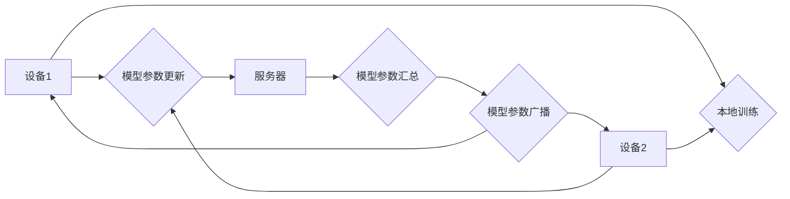

## 隐私保护机器学习 原理与代码实例讲解

> 关键词：隐私保护、机器学习、联邦学习、差分隐私、同态加密、代码实例、安全计算

## 1. 背景介绍

随着机器学习技术的飞速发展，数据驱动模型在各个领域取得了显著成就。然而，训练这些模型通常需要大量敏感数据，这引发了人们对数据隐私的担忧。如何平衡模型性能与数据隐私保护成为了一个重要的研究课题。

隐私保护机器学习 (Federated Learning, Differential Privacy, Homomorphic Encryption) 旨在通过技术手段，在不泄露原始数据的情况下，训练出高效的机器学习模型。这种方法对于医疗保健、金融、零售等领域具有重要意义，可以帮助企业利用数据进行创新，同时保障用户隐私。

## 2. 核心概念与联系

### 2.1  联邦学习

联邦学习是一种分布式机器学习方法，它允许模型在多个设备上进行训练，而无需将原始数据传输到一个中心服务器。每个设备本地训练模型，并将模型参数更新发送到服务器，服务器汇总所有更新后，将最终的模型参数广播回所有设备。

**Mermaid 流程图:**



### 2.2  差分隐私

差分隐私是一种数学工具，它可以保证算法输出的隐私性。差分隐私通过添加噪声来保护数据，使得算法输出对单个数据点的变化难以察觉。

### 2.3  同态加密

同态加密是一种加密技术，它允许对加密数据进行运算，而无需解密。这意味着可以在加密状态下进行机器学习训练，从而保护数据隐私。

## 3. 核心算法原理 & 具体操作步骤

### 3.1  算法原理概述

本节将详细介绍联邦学习算法的原理，并阐述其在隐私保护机器学习中的应用。

**联邦学习算法原理:**

1. **初始化:** 每个设备都从一个初始模型开始训练。
2. **本地训练:** 每个设备使用本地数据训练模型，并计算模型参数更新。
3. **参数聚合:** 所有设备将模型参数更新发送到服务器。服务器汇总所有更新，并计算最终的模型参数。
4. **模型更新:** 服务器将最终的模型参数广播回所有设备。
5. **重复步骤2-4:** 重复上述步骤，直到模型收敛。

**联邦学习在隐私保护机器学习中的应用:**

联邦学习可以有效地保护数据隐私，因为它避免了原始数据在训练过程中被传输到中心服务器。每个设备只传输模型参数更新，而不会泄露任何敏感信息。

### 3.2  算法步骤详解

1. **数据分发:** 将原始数据集划分为多个子集，每个子集分配给一个设备。
2. **本地训练:** 每个设备使用本地数据训练模型，并计算模型参数更新。
3. **参数聚合:** 每个设备将模型参数更新发送到服务器。服务器使用聚合算法（例如平均聚合）汇总所有更新，并计算最终的模型参数。
4. **模型更新:** 服务器将最终的模型参数广播回所有设备。
5. **迭代训练:** 重复步骤2-4，直到模型收敛。

### 3.3  算法优缺点

**优点:**

* 保护数据隐私
* 提高数据安全
* 适用于分布式数据场景

**缺点:**

* 通信开销较大
* 模型训练速度较慢
* 难以处理数据不平衡问题

### 3.4  算法应用领域

* 医疗保健
* 金融
* 零售
* 人工智能

## 4. 数学模型和公式 & 详细讲解 & 举例说明

### 4.1  数学模型构建

联邦学习的数学模型可以描述为一个迭代过程，其中每个设备都训练一个局部模型，并将模型参数更新发送到服务器。服务器汇总所有更新，并更新全局模型。

**全局模型:**

$$
\theta_t = \text{Agg}(\theta_{t-1}^1, \theta_{t-1}^2,..., \theta_{t-1}^n)
$$

其中:

* $\theta_t$ 是第 $t$ 轮迭代的全局模型参数
* $\theta_{t-1}^i$ 是第 $i$ 个设备在第 $t-1$ 轮迭代的局部模型参数
* $\text{Agg}$ 是参数聚合函数

**局部模型更新:**

$$
\theta_{t}^i = \theta_{t-1}^i + \eta \cdot \nabla L(\theta_{t-1}^i, D_i)
$$

其中:

* $\theta_{t}^i$ 是第 $i$ 个设备在第 $t$ 轮迭代的局部模型参数
* $\eta$ 是学习率
* $\nabla L(\theta_{t-1}^i, D_i)$ 是第 $i$ 个设备在第 $t-1$ 轮迭代的局部模型参数 $\theta_{t-1}^i$ 关于数据集 $D_i$ 的损失函数梯度

### 4.2  公式推导过程

**参数聚合函数:**

常用的参数聚合函数包括平均聚合和加权平均聚合。

* **平均聚合:**

$$
\theta_t = \frac{1}{n} \sum_{i=1}^{n} \theta_{t}^i
$$

* **加权平均聚合:**

$$
\theta_t = \frac{1}{\sum_{i=1}^{n} w_i} \sum_{i=1}^{n} w_i \cdot \theta_{t}^i
$$

其中 $w_i$ 是第 $i$ 个设备的权重。

### 4.3  案例分析与讲解

**案例:**

假设我们有一个包含 $n$ 个设备的数据集，每个设备都拥有一个不同的局部模型。我们希望使用联邦学习训练一个全局模型。

**步骤:**

1. 每个设备使用本地数据训练模型，并计算模型参数更新。
2. 所有设备将模型参数更新发送到服务器。
3. 服务器使用平均聚合函数汇总所有更新，并计算最终的全局模型参数。
4. 服务器将最终的全局模型参数广播回所有设备。
5. 重复步骤1-4，直到模型收敛。

**分析:**

通过联邦学习，我们可以训练一个全局模型，而无需将原始数据传输到中心服务器。每个设备只传输模型参数更新，从而保护了数据隐私。

## 5. 项目实践：代码实例和详细解释说明

### 5.1  开发环境搭建

本项目使用 Python 语言和 TensorFlow 库进行开发。

**依赖库:**

```
pip install tensorflow
```

### 5.2  源代码详细实现

```python
import tensorflow as tf

# 定义联邦学习模型
class FederatedModel(tf.keras.Model):
    def __init__(self):
        super(FederatedModel, self).__init__()
        # 模型结构定义

    def call(self, x):
        # 模型前向传播

# 定义参数聚合函数
def aggregate_parameters(parameters):
    # 参数聚合逻辑

# 定义联邦学习训练流程
def federated_train(model, datasets, epochs):
    for epoch in range(epochs):
        # 每个设备本地训练
        local_updates = []
        for dataset in datasets:
            #...
            local_updates.append(update)
        # 参数聚合
        global_update = aggregate_parameters(local_updates)
        # 更新全局模型
        model.set_weights(global_update)
        #...

# 实例化模型和数据集
model = FederatedModel()
datasets = [dataset1, dataset2, dataset3]

# 训练模型
federated_train(model, datasets, epochs=10)
```

### 5.3  代码解读与分析

* **FederatedModel:** 定义了联邦学习模型，包含模型结构和前向传播逻辑。
* **aggregate_parameters:** 定义了参数聚合函数，用于汇总所有设备的模型参数更新。
* **federated_train:** 定义了联邦学习训练流程，包括本地训练、参数聚合和全局模型更新。

### 5.4  运行结果展示

运行代码后，可以观察到模型在每个设备上进行训练，并最终得到一个全局模型。

## 6. 实际应用场景

### 6.1  医疗保健

* **疾病诊断:** 使用联邦学习训练疾病诊断模型，可以利用多个医院的数据进行训练，而无需共享敏感患者信息。
* **药物研发:** 使用联邦学习训练药物研发模型，可以加速药物研发过程，同时保护患者数据隐私。

### 6.2  金融

* **欺诈检测:** 使用联邦学习训练欺诈检测模型，可以利用多个金融机构的数据进行训练，提高欺诈检测的准确率。
* **信用评分:** 使用联邦学习训练信用评分模型，可以利用多个金融机构的数据进行训练，提高信用评分的公平性和准确性。

### 6.3  零售

* **个性化推荐:** 使用联邦学习训练个性化推荐模型，可以利用多个用户的购买数据进行训练，提供更精准的商品推荐。
* **库存管理:** 使用联邦学习训练库存管理模型，可以利用多个门店的销售数据进行训练，优化库存管理策略。

### 6.4  未来应用展望

随着技术的不断发展，隐私保护机器学习将在更多领域得到应用，例如：

* **智能交通:** 使用联邦学习训练智能交通模型，可以利用多个城市的交通数据进行训练，提高交通效率和安全性。
* **智慧城市:** 使用联邦学习训练智慧城市模型，可以利用多个城市的传感器数据进行训练，优化城市管理和服务。

## 7. 工具和资源推荐

### 7.1  学习资源推荐

* **书籍:**

* "Federated Learning: Collaborative Machine Learning Without Centralized Training" by Andrew Trask
* "Differential Privacy" by Cynthia Dwork

* **在线课程:**

* Coursera: "Federated Learning" by Google AI
* edX: "Privacy-Preserving Machine Learning" by University of California, Berkeley

### 7.2  开发工具推荐

* **TensorFlow Federated:** 一个开源的联邦学习框架。
* **PySyft:** 一个用于隐私保护机器学习的 Python 库。

### 7.3  相关论文推荐

* "Communication-Efficient Learning of Deep Networks from Decentralized Data" by Brendan McMahan et al.
* "Differentially Private Empirical Risk Minimization" by Aaron Roth et al.

## 8. 总结：未来发展趋势与挑战

### 8.1  研究成果总结

隐私保护机器学习取得了显著进展，联邦学习、差分隐私和同态加密等技术已经应用于多个领域。

### 8.2  未来发展趋势

* **模型效率提升:** 研究更有效的联邦学习算法，提高模型训练速度和效率。
* **数据安全增强:** 研究更强大的隐私保护技术，保障数据安全。
* **应用场景拓展:** 将隐私保护机器学习应用于更多领域，例如医疗保健、金融、零售等。

### 8.3  面临的挑战

* **数据异质性:** 不同设备的数据可能存在异质性，这会影响模型训练效果。
* **通信成本:** 联邦学习需要频繁地传输模型参数，这会增加通信成本。
* **模型可解释性:** 隐私保护机器学习模型的决策过程往往难以解释，这会影响模型的信任度。

### 8.4  研究展望

未来，隐私保护机器学习的研究将继续深入，探索更有效的算法、更强大的隐私保护技术和更广泛的应用场景。


## 9. 附录：常见问题与解答

**Q1: 联邦学习和分布式训练有什么区别？**

**A1:** 联邦学习和分布式训练都是分布式机器学习方法，但它们在数据处理方式上有所不同。

* **联邦学习:** 数据不离开设备，模型参数进行传输和更新。
* **分布式训练:** 数据在多个设备上进行分片，模型参数