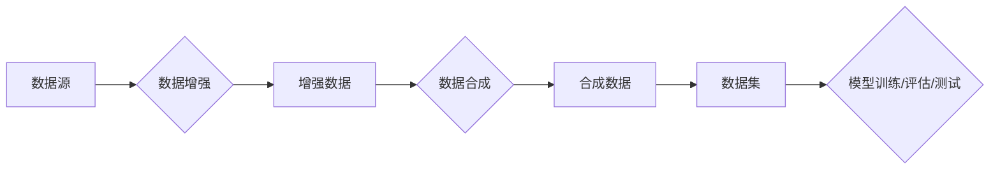

# 数据合成与数据混合，软件2.0的数据魔法

> 关键词：数据合成，数据混合，软件2.0，数据生成，数据增强，隐私保护，人工智能，机器学习

## 1. 背景介绍

随着数字化转型的深入，数据已经成为现代社会的重要资产。然而，数据获取、处理和使用的挑战也随之而来。数据隐私、数据质量、数据稀缺等问题限制了人工智能和机器学习技术的发展。为了克服这些挑战，数据合成与数据混合技术应运而生，它们为软件2.0时代的数据魔法提供了强有力的工具。

### 1.1 问题的由来

**数据稀缺**：某些领域，如医学、金融等，由于隐私保护的要求，很难获取到足够的数据用于模型训练。

**数据隐私**：用户隐私保护法规的加强，限制了数据的自由流动和使用。

**数据质量**：现实世界的数据往往存在噪声、缺失和不一致性，影响了模型的性能。

为了解决这些问题，数据合成与数据混合技术成为了一种重要的解决方案。

### 1.2 研究现状

数据合成与数据混合技术已经取得了显著的进展，包括以下几种主要方法：

- **数据增强**：通过对现有数据进行变换，如旋转、缩放、裁剪等，来增加数据的多样性。

- **数据生成**：使用生成模型，如生成对抗网络（GANs），来创建新的数据样本。

- **数据混合**：将不同来源、不同类型的数据进行融合，以获得更全面、更丰富的数据集。

### 1.3 研究意义

数据合成与数据混合技术在以下方面具有重要意义：

- **提升模型性能**：通过增加数据量和多样性，可以提高模型的泛化能力和鲁棒性。

- **保护用户隐私**：通过合成数据代替真实数据，可以保护用户隐私。

- **降低数据获取成本**：可以减少对真实数据的依赖，降低数据获取成本。

## 2. 核心概念与联系

### 2.1 核心概念原理

**数据合成**：数据合成是指使用算法生成与真实数据具有相似分布的新数据。这些新数据可以用于训练、评估或测试机器学习模型。

**数据增强**：数据增强是指对现有数据进行变换，以增加数据的多样性。这些变换可以是简单的，如旋转、缩放、裁剪等，也可以是复杂的，如风格迁移、内容增强等。

**数据混合**：数据混合是指将不同来源、不同类型的数据进行融合，以获得更全面、更丰富的数据集。

### 2.2 架构的 Mermaid 流程图



### 2.3 核心概念联系

数据增强和数据合成都是数据增强技术的子集，它们的目的都是增加数据的多样性。数据混合则是将不同来源的数据进行融合，以获得更全面的数据集。这三个概念在数据增强和数据集构建过程中相互联系，共同推动机器学习模型的进步。

## 3. 核心算法原理 & 具体操作步骤

### 3.1 算法原理概述

数据合成与数据混合的算法原理主要包括以下几个方面：

- **生成模型**：如GANs、变分自编码器（VAEs）等，用于生成与真实数据具有相似分布的新数据。

- **数据变换**：如旋转、缩放、裁剪、颜色变换等，用于增加数据的多样性。

- **数据融合**：如特征融合、数据集拼接等，用于融合不同来源、不同类型的数据。

### 3.2 算法步骤详解

**数据增强**：

1. 选择数据增强方法，如旋转、缩放、裁剪等。

2. 对现有数据进行变换，生成增强数据。

3. 将增强数据添加到原始数据集中。

**数据合成**：

1. 选择生成模型，如GANs、VAEs等。

2. 使用真实数据训练生成模型。

3. 使用生成模型生成新数据。

**数据混合**：

1. 选择数据融合方法，如特征融合、数据集拼接等。

2. 将不同来源、不同类型的数据进行融合。

3. 创建新的数据集。

### 3.3 算法优缺点

**数据增强**：

优点：简单易行，可以显著增加数据多样性。

缺点：可能引入噪声，影响模型性能。

**数据合成**：

优点：可以生成与真实数据具有相似分布的新数据，提高模型泛化能力。

缺点：生成模型训练难度大，可能生成与真实数据差异较大的数据。

**数据混合**：

优点：可以融合不同来源、不同类型的数据，获得更全面的数据集。

缺点：数据融合方法选择不当，可能导致数据质量下降。

### 3.4 算法应用领域

数据合成与数据混合技术可以应用于以下领域：

- **机器学习模型训练**：增加数据量，提高模型性能。

- **数据隐私保护**：使用合成数据代替真实数据，保护用户隐私。

- **数据复用**：减少对真实数据的依赖，降低数据获取成本。

## 4. 数学模型和公式 & 详细讲解 & 举例说明

### 4.1 数学模型构建

数据合成与数据混合的数学模型主要包括以下几种：

- **生成模型**：如GANs、VAEs等，其数学模型可以表示为：

  $$ G(z) = \text{Generator}(z) $$

  $$ D(x) = \text{Discriminator}(x) $$

  其中 $G(z)$ 是生成模型，$D(x)$ 是判别模型，$z$ 是噪声向量。

- **数据变换**：如旋转、缩放、裁剪等，其数学模型可以表示为：

  $$ T(x) = F(x) $$

  其中 $T(x)$ 是变换函数，$F(x)$ 是原始数据。

- **数据融合**：如特征融合、数据集拼接等，其数学模型可以表示为：

  $$ F(x,y) = [x,y] $$

  其中 $F(x,y)$ 是融合函数，$x$ 和 $y$ 是来自不同来源、不同类型的数据。

### 4.2 公式推导过程

由于数据合成与数据混合的数学模型涉及多种复杂算法，这里不进行详细的推导过程。读者可以参考相关领域的专业书籍或论文。

### 4.3 案例分析与讲解

以下是一个使用GANs进行数据合成的案例：

**目标**：使用GANs生成与MNIST手写数字数据集具有相似分布的新数据。

**步骤**：

1. 构建GANs模型，包括生成模型 $G(z)$ 和判别模型 $D(x)$。

2. 使用MNIST数据集训练GANs模型。

3. 使用训练好的生成模型 $G(z)$ 生成新数据。

4. 评估生成数据的质量。

**代码示例**：

```python
import torch
import torchvision
from torchvision.utils import save_image

# 构建GANs模型
class Generator(nn.Module):
    def __init__(self):
        super(Generator, self).__init__()
        self.net = nn.Sequential(
            nn.Linear(100, 128),
            nn.LeakyReLU(0.2),
            nn.Linear(128, 256),
            nn.LeakyReLU(0.2),
            nn.Linear(256, 512),
            nn.LeakyReLU(0.2),
            nn.Linear(512, 1024),
            nn.LeakyReLU(0.2),
            nn.Linear(1024, 28*28),
            nn.Tanh()
        )

    def forward(self, x):
        return self.net(x)

class Discriminator(nn.Module):
    def __init__(self):
        super(Discriminator, self).__init__()
        self.net = nn.Sequential(
            nn.Linear(28*28, 1024),
            nn.LeakyReLU(0.2),
            nn.Linear(1024, 512),
            nn.LeakyReLU(0.2),
            nn.Linear(512, 256),
            nn.LeakyReLU(0.2),
            nn.Linear(256, 1),
            nn.Sigmoid()
        )

    def forward(self, x):
        return self.net(x)

# 训练GANs模型
def train_gan(model_g, model_d, dataloader, epochs):
    for epoch in range(epochs):
        for real_data in dataloader:
            real_data = real_data.to(device)
            # 训练判别模型
            model_d.zero_grad()
            output = model_d(real_data)
            d_real_loss = criterion(output, torch.ones(real_data.size(0)).to(device))
            fake_data = model_g(z).detach()
            output = model_d(fake_data)
            d_fake_loss = criterion(output, torch.zeros(real_data.size(0)).to(device))
            d_loss = d_real_loss + d_fake_loss
            d_loss.backward()
            d_optimizer.step()

            # 训练生成模型
            model_g.zero_grad()
            fake_data = model_g(z)
            output = model_d(fake_data)
            g_loss = criterion(output, torch.ones(fake_data.size(0)).to(device))
            g_loss.backward()
            g_optimizer.step()

            if epoch % 100 == 0:
                print(f"Epoch {epoch}, D loss: {d_loss.item()}, G loss: {g_loss.item()}")

        # 保存生成数据
        save_image(fake_data.data, f"epochs_{epoch}.png", nrow=10, normalize=True)

# 加载数据集
transform = transforms.Compose([
    transforms.ToTensor(),
    transforms.Normalize((0.5, 0.5, 0.5), (0.5, 0.5, 0.5))
])
dataloader = DataLoader(
    torchvision.datasets.MNIST(root='./data', train=True, transform=transform, download=True),
    batch_size=64, shuffle=True
)

# 初始化模型和优化器
model_g = Generator().to(device)
model_d = Discriminator().to(device)
g_optimizer = torch.optim.Adam(model_g.parameters(), lr=0.0002, betas=(0.5, 0.999))
d_optimizer = torch.optim.Adam(model_d.parameters(), lr=0.0002, betas=(0.5, 0.999))
criterion = nn.BCELoss()

# 训练GANs模型
train_gan(model_g, model_d, dataloader, epochs=1000)
```

以上代码示例使用PyTorch和GANs算法生成MNIST手写数字数据集的合成数据。通过训练GANs模型，可以生成与真实数据具有相似分布的新数据。

## 5. 项目实践：代码实例和详细解释说明

### 5.1 开发环境搭建

为了进行数据合成与数据混合的实践，需要以下开发环境：

- Python 3.6及以上版本

- PyTorch 1.8及以上版本

- torchvision 0.9及以上版本

- matplotlib 3.1及以上版本

### 5.2 源代码详细实现

以下是一个使用PyTorch进行数据增强的代码示例：

```python
import torch
import torchvision.transforms as transforms
from torchvision.utils import save_image

# 加载数据集
transform = transforms.Compose([
    transforms.ToTensor(),
    transforms.Normalize((0.5, 0.5, 0.5), (0.5, 0.5, 0.5))
])
dataloader = DataLoader(
    torchvision.datasets.MNIST(root='./data', train=True, transform=transform, download=True),
    batch_size=64, shuffle=True
)

# 定义数据增强函数
def augment(data):
    data = transforms.RandomCrop(data, 224).cuda()
    data = transforms.RandomHorizontalFlip()(data)
    data = transforms.RandomRotation(10)(data)
    data = transforms.ToTensor()(data)
    return data

# 遍历数据集并进行数据增强
for data, target in dataloader:
    data = augment(data)
    save_image(data, "augmented.png", normalize=True)
```

以上代码示例使用PyTorch和torchvision库对MNIST手写数字数据集进行数据增强。通过定义数据增强函数，可以对每个样本进行随机裁剪、水平翻转、旋转等操作，从而增加数据的多样性。

### 5.3 代码解读与分析

以上代码示例使用PyTorch和torchvision库对MNIST手写数字数据集进行数据增强。首先，定义了数据增强函数 `augment`，该函数使用 `RandomCrop`、`RandomHorizontalFlip` 和 `RandomRotation` 等数据增强方法对每个样本进行操作。然后，遍历数据集，并对每个样本进行数据增强，最后将增强后的数据保存为图片。

### 5.4 运行结果展示

运行以上代码，可以在当前目录下生成名为 "augmented.png" 的图片，展示了数据增强后的MNIST手写数字样本。

## 6. 实际应用场景

### 6.1 机器学习模型训练

数据合成与数据混合技术在机器学习模型训练中具有广泛的应用，以下是一些典型应用场景：

- **图像识别**：使用数据增强技术提高图像识别模型的鲁棒性。

- **自然语言处理**：使用数据合成技术生成新的文本数据，用于训练文本分类、情感分析等模型。

- **语音识别**：使用数据增强技术提高语音识别模型的泛化能力。

### 6.2 数据隐私保护

数据合成与数据混合技术在数据隐私保护方面具有重要作用，以下是一些典型应用场景：

- **用户隐私保护**：使用合成数据代替真实数据进行模型训练，保护用户隐私。

- **数据脱敏**：使用数据合成技术对敏感数据进行脱敏处理。

- **数据共享**：使用数据混合技术将不同来源的数据进行融合，促进数据共享。

### 6.3 数据复用

数据合成与数据混合技术在数据复用方面具有重要作用，以下是一些典型应用场景：

- **模型迁移**：使用合成数据替换真实数据，实现模型在不同领域的迁移。

- **数据集构建**：使用数据合成技术构建新的数据集，用于模型训练和评估。

- **数据备份**：使用数据混合技术对重要数据进行备份，提高数据安全性。

## 7. 工具和资源推荐

### 7.1 学习资源推荐

- **书籍**：

  - 《Python数据增强技术》

  - 《GANs实战：生成对抗网络应用与实战》

  - 《数据科学实战：Python机器学习与深度学习》

- **在线课程**：

  - Coursera上的《机器学习》课程

  - Udacity上的《深度学习纳米学位》课程

  - fast.ai上的《深度学习》课程

### 7.2 开发工具推荐

- **框架和库**：

  - PyTorch

  - TensorFlow

  - torchvision

  - matplotlib

- **平台**：

  - Google Colab

  - Kaggle

  - GitHub

### 7.3 相关论文推荐

- **《Unsupervised Representation Learning with Deep Convolutional Generative Adversarial Networks》**

- **《Generative Adversarial Text to Image Synthesis》**

- **《GANs for Text: A Survey of GAN-based Text Generation Models》**

## 8. 总结：未来发展趋势与挑战

### 8.1 研究成果总结

数据合成与数据混合技术在数据增强、数据隐私保护和数据复用等方面取得了显著成果，为软件2.0时代的数据魔法提供了强有力的工具。

### 8.2 未来发展趋势

- **更先进的生成模型**：如基于Transformer的生成模型，将进一步提高数据合成质量。

- **跨模态数据合成**：将图像、文本、音频等多模态数据进行合成，为多模态机器学习提供更多可能性。

- **可解释的数据增强**：开发可解释的数据增强方法，提高数据增强过程的透明度和可控性。

### 8.3 面临的挑战

- **数据质量**：保证合成数据的真实性和可靠性。

- **计算效率**：提高数据合成和混合过程的计算效率。

- **可解释性**：提高数据合成和混合过程的可解释性。

### 8.4 研究展望

数据合成与数据混合技术将成为软件2.0时代的重要技术之一，为人工智能和机器学习的发展提供更多可能性。未来，随着技术的不断发展和完善，数据合成与数据混合技术将在更多领域发挥重要作用。

## 9. 附录：常见问题与解答

**Q1：数据合成和数据增强有什么区别？**

A：数据合成和数据增强都是数据增强技术的子集，但它们的侧重点不同。数据合成是使用算法生成与真实数据具有相似分布的新数据，而数据增强是对现有数据进行变换，以增加数据的多样性。

**Q2：数据合成如何保证数据质量？**

A：保证数据合成质量的关键在于选择合适的生成模型和数据增强方法。例如，使用GANs可以生成与真实数据具有相似分布的新数据，而使用数据增强方法可以增加数据的多样性。

**Q3：数据合成和数据混合如何应用于实际场景？**

A：数据合成和数据混合可以应用于机器学习模型训练、数据隐私保护和数据复用等场景。例如，可以使用数据合成技术生成新的文本数据，用于训练文本分类模型；可以使用数据混合技术将不同来源的数据进行融合，以获得更全面的数据集。

**Q4：数据合成和数据混合技术有哪些潜在风险？**

A：数据合成和数据混合技术的潜在风险包括：数据质量、计算效率、可解释性等。需要通过技术手段和规范来控制这些风险。

作者：禅与计算机程序设计艺术 / Zen and the Art of Computer Programming