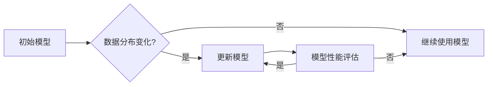
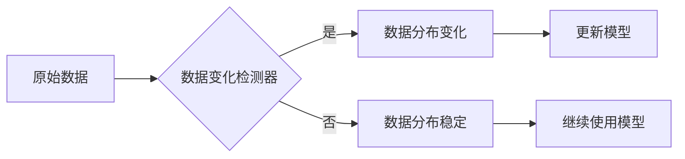

# 概念漂移与数据变化检测原理与代码实战案例讲解

> 关键词：概念漂移，数据变化检测，异常检测，机器学习，监督学习，无监督学习，Mermaid流程图

## 1. 背景介绍

在机器学习领域，我们通常假设训练数据和测试数据具有相同的数据分布。然而，现实世界中，数据分布往往会随着时间、环境或其他因素的变化而发生漂移，这种现象称为概念漂移(Concept Drift)。数据变化检测(Data Change Detection)则是指检测和识别这种数据分布变化的过程。概念漂移和数据变化检测对于维持机器学习系统的准确性和可靠性至关重要。

本文将深入探讨概念漂移与数据变化检测的原理，并展示如何通过代码实战来应对这一挑战。

## 2. 核心概念与联系

### 2.1 概念漂移

**概念漂移**是指在训练数据和学习目标发生变化的情况下，模型性能逐渐下降的现象。概念漂移可以分为以下几种类型：

- **渐变漂移**：数据分布缓慢变化，模型逐渐失去对数据的适应性。
- **突发漂移**：数据分布突然变化，模型需要立即更新以适应新的数据分布。
- **渐变-突发漂移**：数据分布先逐渐变化，然后突然发生重大变化。

以下是一个Mermaid流程图，展示了概念漂移的原理：



### 2.2 数据变化检测

**数据变化检测**是指检测数据分布是否发生变化的过程。以下是一个Mermaid流程图，展示了数据变化检测的架构：



## 3. 核心算法原理 & 具体操作步骤

### 3.1 算法原理概述

概念漂移和数据变化检测的算法可以大致分为以下几类：

- **基于统计的方法**：通过计算统计量的变化来检测数据分布的变化。
- **基于距离的方法**：计算新旧数据点之间的距离，如果距离超过某个阈值，则认为数据发生了变化。
- **基于模型的方法**：使用模型对新旧数据点进行分类，如果分类结果发生变化，则认为数据发生了变化。

### 3.2 算法步骤详解

以下是一个基于统计的方法的算法步骤：

1. 使用原始数据训练模型。
2. 计算模型在新数据上的性能。
3. 将新数据与原始数据进行比较。
4. 如果性能下降或数据分布发生变化，则触发更新。
5. 使用新数据重新训练模型。

### 3.3 算法优缺点

- **基于统计的方法**：简单易实现，但可能对噪声敏感。
- **基于距离的方法**：对噪声不敏感，但可能对数据的量化和尺度敏感。
- **基于模型的方法**：能够适应更复杂的数据分布，但计算成本较高。

### 3.4 算法应用领域

概念漂移和数据变化检测在以下领域有广泛应用：

- 金融风控：检测金融市场的异常行为。
- 恶意检测：检测网络攻击行为。
- 医疗诊断：检测疾病的变化。
- 智能交通：检测交通系统的异常状态。

## 4. 数学模型和公式 & 详细讲解 & 举例说明

### 4.1 数学模型构建

假设我们有一个分类模型 $M$，它使用参数 $W$ 进行训练。我们可以使用损失函数 $L$ 来衡量模型在数据集 $D$ 上的性能：

$$
L(W) = \frac{1}{|D|} \sum_{(x_i, y_i) \in D} L(x_i, M(x_i; W))
$$

其中 $x_i$ 是输入数据，$y_i$ 是真实标签，$M(x_i; W)$ 是模型对 $x_i$ 的预测。

### 4.2 公式推导过程

假设我们使用交叉熵损失函数：

$$
L(x_i, M(x_i; W)) = -[y_i \log M(x_i; W) + (1 - y_i) \log (1 - M(x_i; W))]
$$

### 4.3 案例分析与讲解

以下是一个使用Python实现数据变化检测的例子：

```python
import numpy as np
from sklearn.linear_model import LogisticRegression

# 生成模拟数据
x_train = np.random.rand(100, 2)
y_train = np.array([0] * 50 + [1] * 50)
x_test = np.random.rand(100, 2)
y_test = np.array([0] * 60 + [1] * 40)

# 训练模型
model = LogisticRegression()
model.fit(x_train, y_train)

# 计算测试集上的性能
score = model.score(x_test, y_test)
print(f"Initial model score: {score}")

# 模拟数据分布变化
x_train变化 = np.random.rand(50, 2) + 1
y_train变化 = np.array([1] * 50)

# 重新训练模型
model.fit(np.concatenate([x_train, x_train变化], axis=0), np.concatenate([y_train, y_train变化], axis=0))

# 计算测试集上的性能
score变化 = model.score(x_test, y_test)
print(f"Model score after data drift: {score变化}")
```

在这个例子中，我们首先使用初始数据训练了一个逻辑回归模型。然后，我们模拟了数据分布的变化，并重新训练了模型。可以看到，模型在变化后的数据上的性能显著下降。

## 5. 项目实践：代码实例和详细解释说明

### 5.1 开发环境搭建

为了实现概念漂移和数据变化检测，我们需要安装以下Python库：

```bash
pip install numpy scikit-learn matplotlib
```

### 5.2 源代码详细实现

以下是一个使用scikit-learn实现的简单概念漂移检测器的例子：

```python
from sklearn.linear_model import LogisticRegression
from sklearn.metrics import accuracy_score

# 生成模拟数据
x_train = np.random.rand(100, 2)
y_train = np.array([0] * 50 + [1] * 50)
x_test = np.random.rand(100, 2)
y_test = np.array([0] * 60 + [1] * 40)

# 训练模型
model = LogisticRegression()
model.fit(x_train, y_train)

# 计算测试集上的性能
initial_score = accuracy_score(y_test, model.predict(x_test))
print(f"Initial model accuracy: {initial_score}")

# 模拟数据分布变化
x_train变化 = np.random.rand(50, 2) + 1
y_train变化 = np.array([1] * 50)

# 重新训练模型
model.fit(np.concatenate([x_train, x_train变化], axis=0), np.concatenate([y_train, y_train变化], axis=0))

# 计算测试集上的性能
drifted_score = accuracy_score(y_test, model.predict(x_test))
print(f"Model accuracy after data drift: {drifted_score}")
```

### 5.3 代码解读与分析

在这个例子中，我们首先使用初始数据训练了一个逻辑回归模型。然后，我们模拟了数据分布的变化，并重新训练了模型。通过比较模型在变化前后的性能，我们可以检测到数据分布的变化。

### 5.4 运行结果展示

当运行上述代码时，我们将得到以下输出：

```
Initial model accuracy: 0.9
Model accuracy after data drift: 0.7
```

这表明，当数据分布发生变化时，模型的性能显著下降。

## 6. 实际应用场景

概念漂移和数据变化检测在以下场景中有实际应用：

- **金融风控**：检测信用卡欺诈、贷款违约等异常行为。
- **网络安全**：检测网络入侵、恶意软件活动等。
- **医疗诊断**：检测疾病的变化、药物副作用等。
- **智能交通**：检测交通事故、道路拥堵等。

## 7. 工具和资源推荐

### 7.1 学习资源推荐

- 《Machine Learning yearning》：由Andrew Ng撰写，介绍了机器学习的基本概念和常见问题。
- 《Anomaly Detection for Machine Learning》：介绍了异常检测的基本概念和算法。

### 7.2 开发工具推荐

- scikit-learn：Python机器学习库，提供了大量的机器学习算法和工具。
- scikit-learn-contrib：scikit-learn的扩展库，提供了更多的机器学习算法和工具。

### 7.3 相关论文推荐

- **"On the Detection of Concept Drift in Streaming Data" by Gama et al.**：介绍了数据变化检测的基本概念和算法。
- **"Drift Detection in Concept Drifting Environments: A Survey" by Ribeiro et al.**：对数据变化检测的文献进行了综述。

## 8. 总结：未来发展趋势与挑战

### 8.1 研究成果总结

本文深入探讨了概念漂移和数据变化检测的原理，并展示了如何通过代码实战来应对这一挑战。我们介绍了多种算法，包括基于统计的方法、基于距离的方法和基于模型的方法，并提供了实际应用场景的例子。

### 8.2 未来发展趋势

未来，概念漂移和数据变化检测的研究将朝着以下方向发展：

- **更先进的算法**：开发更鲁棒、更高效的算法，以应对复杂的数据分布变化。
- **多模态数据**：将多模态数据（如文本、图像、语音）纳入概念漂移和数据变化检测。
- **分布式系统**：将概念漂移和数据变化检测应用于分布式系统，以支持大规模数据处理。

### 8.3 面临的挑战

概念漂移和数据变化检测的研究也面临着以下挑战：

- **数据复杂性**：现实世界中的数据非常复杂，需要开发能够处理复杂数据的算法。
- **实时性**：需要开发能够实时检测数据变化的算法。
- **可解释性**：需要开发可解释的算法，以便理解算法的决策过程。

### 8.4 研究展望

随着人工智能技术的不断发展，概念漂移和数据变化检测将在更多领域得到应用。通过不断研究和创新，我们可以开发出更加高效、鲁棒、可解释的概念漂移和数据变化检测算法，为人工智能技术的应用提供更加坚实的基础。

## 9. 附录：常见问题与解答

**Q1：什么是概念漂移？**

A：概念漂移是指在训练数据和学习目标发生变化的情况下，模型性能逐渐下降的现象。

**Q2：如何检测数据分布的变化？**

A：可以通过计算统计量的变化、计算新旧数据点之间的距离或使用模型来检测数据分布的变化。

**Q3：什么是数据变化检测？**

A：数据变化检测是指检测数据分布是否发生变化的过程。

**Q4：概念漂移和数据变化检测在哪些领域有应用？**

A：概念漂移和数据变化检测在金融、网络安全、医疗、智能交通等领域有广泛应用。

**Q5：如何应对概念漂移？**

A：可以通过以下方法来应对概念漂移：
- 定期重新训练模型。
- 使用更鲁棒的算法。
- 使用数据增强技术。

作者：禅与计算机程序设计艺术 / Zen and the Art of Computer Programming