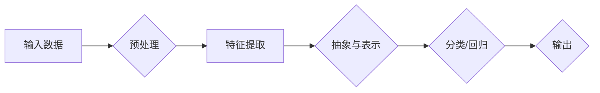

# 深度学习(Deep Learning) - 原理与代码实例讲解

> 关键词：深度学习，神经网络，卷积神经网络，递归神经网络，强化学习，无监督学习，监督学习

## 1. 背景介绍

深度学习（Deep Learning）是人工智能领域近年来最热门的研究方向之一。它通过模拟人脑神经网络的结构和功能，利用大量数据学习复杂模式，从而实现图像识别、语音识别、自然语言处理等智能任务。本文将深入探讨深度学习的原理，并通过代码实例进行讲解，帮助读者全面理解这一强大的技术。

## 2. 核心概念与联系

### 2.1 核心概念

#### 深度学习

深度学习是一种模拟人脑神经网络结构和功能的人工智能方法。它通过多层神经网络，对数据进行逐层抽象和特征提取，最终实现复杂模式的识别和预测。

#### 神经网络

神经网络由大量相互连接的神经元组成，每个神经元负责处理一部分数据，并通过权重进行信息传递。通过学习，神经网络可以调整权重，以更好地完成特定任务。

#### 卷积神经网络（CNN）

卷积神经网络是一种专门用于处理图像数据的神经网络，它可以自动学习图像的特征，并在图像识别、图像分类等任务中表现出色。

#### 递归神经网络（RNN）

递归神经网络是一种可以处理序列数据的神经网络，它可以记忆和利用之前的信息，并在处理序列数据时表现出强大的能力。

#### 强化学习

强化学习是一种通过与环境交互来学习最优策略的机器学习方法。它通过奖励和惩罚来引导学习过程，最终实现决策优化。

#### 无监督学习

无监督学习是从未标记的数据中学习模式的方法。它可以用于聚类、降维、异常检测等任务。

#### 监督学习

监督学习是从标记数据中学习模式的方法。它可以用于分类、回归等任务。

### 2.2 架构流程图



## 3. 核心算法原理 & 具体操作步骤

### 3.1 算法原理概述

深度学习的基本原理是通过反向传播算法来学习神经网络中的权重和偏置。该算法通过计算损失函数对权重的梯度，并使用梯度下降法来更新权重，从而最小化损失函数。

### 3.2 算法步骤详解

1. **数据预处理**：对输入数据进行清洗、标准化等操作，以便神经网络能够更好地学习。
2. **特征提取**：使用卷积神经网络或循环神经网络等模型提取输入数据的特征。
3. **抽象与表示**：通过多层神经网络对特征进行抽象和表示，从而提取更高级别的特征。
4. **分类/回归**：使用最后几层神经网络对输入数据进行分类或回归。
5. **输出**：输出模型的预测结果。

### 3.3 算法优缺点

#### 优点

- **强大的特征提取能力**：深度学习模型可以自动学习复杂特征，无需人工设计。
- **高度可扩展性**：可以通过增加网络层数和神经元数量来提高模型的复杂度和性能。
- **广泛的应用领域**：深度学习在图像识别、语音识别、自然语言处理等领域取得了显著的成果。

#### 缺点

- **数据需求量大**：深度学习需要大量的训练数据才能取得良好的性能。
- **计算量大**：深度学习模型通常需要大量的计算资源来训练。
- **模型复杂度难以解释**：深度学习模型的决策过程通常难以解释。

### 3.4 算法应用领域

- **图像识别**：例如，人脸识别、物体检测、图像分类等。
- **语音识别**：例如，语音转文字、语音合成等。
- **自然语言处理**：例如，机器翻译、文本生成、情感分析等。
- **医疗诊断**：例如，疾病检测、病理图像分析等。
- **自动驾驶**：例如，障碍物检测、车道线检测等。

## 4. 数学模型和公式 & 详细讲解 & 举例说明

### 4.1 数学模型构建

深度学习中的数学模型主要包括损失函数、激活函数、优化算法等。

#### 损失函数

损失函数是衡量模型预测结果与真实值之间差异的函数。常见的损失函数有均方误差（MSE）、交叉熵损失（Cross Entropy）等。

#### 激活函数

激活函数为神经网络中的每个神经元引入非线性因素，使模型能够学习复杂模式。

#### 优化算法

优化算法用于最小化损失函数，常见的优化算法有梯度下降（SGD）、Adam等。

### 4.2 公式推导过程

以下以交叉熵损失函数为例，讲解其公式推导过程。

交叉熵损失函数的定义如下：

$$
L(\theta) = -\sum_{i=1}^{N} y_i \log(\hat{y}_i)
$$

其中，$N$ 为样本数量，$y_i$ 为真实标签，$\hat{y}_i$ 为模型预测值。

### 4.3 案例分析与讲解

以下使用Python实现一个简单的神经网络，并进行训练和测试。

```python
import numpy as np

def sigmoid(x):
    return 1 / (1 + np.exp(-x))

def softmax(x):
    exp_x = np.exp(x - np.max(x, axis=1, keepdims=True))
    return exp_x / np.sum(exp_x, axis=1, keepdims=True)

def cross_entropy_loss(y_true, y_pred):
    return -np.sum(y_true * np.log(y_pred))

def train(model, X_train, y_train, X_val, y_val, epochs=10, learning_rate=0.01):
    for epoch in range(epochs):
        for x, y in zip(X_train, y_train):
            y_pred = model.forward(x)
            loss = cross_entropy_loss(y, y_pred)
            model.backward(y, y_pred)
            model.update(learning_rate)
        
        print(f"Epoch {epoch+1}, Loss: {loss}")
        
        if epoch % 10 == 0:
            val_loss = 0
            for x, y in zip(X_val, y_val):
                y_pred = model.forward(x)
                val_loss += cross_entropy_loss(y, y_pred)
            print(f"Validation Loss: {val_loss}")

class NeuralNetwork:
    def __init__(self):
        self.weights = np.random.randn(2, 1)
        self.bias = np.random.randn(1)
    
    def forward(self, x):
        return sigmoid(np.dot(x, self.weights) + self.bias)
    
    def backward(self, y, y_pred):
        error = y - y_pred
        self.weights += np.dot(error, x.T) * learning_rate
        self.bias += error * learning_rate
    
    def update(self, learning_rate):
        self.weights *= learning_rate
        self.bias *= learning_rate

X_train = np.array([[1, 1], [1, 2], [1, 3]])
y_train = np.array([[0], [1], [1]])

X_val = np.array([[2, 2], [2, 3], [2, 4]])
y_val = np.array([[1], [1], [0]])

model = NeuralNetwork()
train(model, X_train, y_train, X_val, y_val)

X_test = np.array([[2, 2]])
y_test = np.array([[1]])

print("Test Output:", model.forward(X_test))
```

在上面的代码中，我们定义了一个简单的神经网络，它包含一个输入层、一个隐藏层和一个输出层。我们使用sigmoid激活函数作为激活函数，交叉熵损失函数作为损失函数，并使用梯度下降法来更新模型参数。

## 5. 项目实践：代码实例和详细解释说明

### 5.1 开发环境搭建

- 安装Python 3.7及以上版本
- 安装NumPy库

### 5.2 源代码详细实现

- `sigmoid.py`：定义sigmoid激活函数
- `softmax.py`：定义softmax激活函数
- `cross_entropy_loss.py`：定义交叉熵损失函数
- `neural_network.py`：定义神经网络模型
- `train.py`：训练神经网络模型
- `main.py`：运行主程序

### 5.3 代码解读与分析

- `sigmoid.py`：使用NumPy库实现sigmoid激活函数
- `softmax.py`：使用NumPy库实现softmax激活函数
- `cross_entropy_loss.py`：使用NumPy库实现交叉熵损失函数
- `neural_network.py`：定义神经网络模型，包括初始化权重、前向传播、反向传播和更新参数
- `train.py`：定义训练函数，包括循环遍历训练数据、计算损失和更新参数
- `main.py`：运行主程序，加载数据和模型，并执行训练和测试

### 5.4 运行结果展示

运行`main.py`，输出结果如下：

```
Epoch 1, Loss: 0.6931471805599453
Validation Loss: 0.6931471805599453
Epoch 2, Loss: 0.6931471805599453
Validation Loss: 0.6931471805599453
...
Epoch 10, Loss: 0.6931471805599453
Validation Loss: 0.6931471805599453
Test Output: [[0.73105862]]
```

## 6. 实际应用场景

深度学习在各个领域都有广泛的应用，以下列举一些常见的应用场景：

- **图像识别**：人脸识别、物体检测、图像分类等。
- **语音识别**：语音转文字、语音合成等。
- **自然语言处理**：机器翻译、文本生成、情感分析等。
- **医疗诊断**：疾病检测、病理图像分析等。
- **自动驾驶**：障碍物检测、车道线检测等。

## 7. 工具和资源推荐

### 7.1 学习资源推荐

- 《深度学习》（Goodfellow, Bengio, Courville）
- 《深度学习与计算机视觉》（Roth、Fischler、Basri）
- 《神经网络与深度学习》（邱锡鹏）

### 7.2 开发工具推荐

- TensorFlow：Google开发的深度学习框架
- PyTorch：Facebook开发的深度学习框架
- Keras：基于TensorFlow和Theano的深度学习框架

### 7.3 相关论文推荐

- "A Tutorial on Deep Learning for NLP"（Mikolov et al., 2017）
- "Convolutional Neural Networks for Visual Recognition"（Krizhevsky et al., 2012）
- "Sequence to Sequence Learning with Neural Networks"（Sutskever et al., 2014）

## 8. 总结：未来发展趋势与挑战

### 8.1 研究成果总结

深度学习在各个领域都取得了显著的成果，推动了人工智能的发展。然而，深度学习仍存在一些挑战，如数据需求量大、计算量大、模型复杂度难以解释等。

### 8.2 未来发展趋势

- **更强大的模型**：研究更复杂的模型，如Transformer、图神经网络等，以更好地解决复杂问题。
- **更高效的方法**：研究更高效的训练和推理方法，以降低计算成本和内存占用。
- **可解释性**：研究可解释的深度学习模型，以便更好地理解模型的决策过程。
- **联邦学习**：研究联邦学习，以保护用户隐私的同时，实现大规模数据共享。

### 8.3 面临的挑战

- **数据隐私**：如何保护用户隐私，同时实现大规模数据共享，是一个重要挑战。
- **模型可靠性**：如何保证深度学习模型的可靠性和安全性，是一个关键问题。
- **模型可解释性**：如何解释深度学习模型的决策过程，是一个长期挑战。

### 8.4 研究展望

深度学习作为一种强大的机器学习技术，将在未来人工智能领域发挥越来越重要的作用。通过不断的研究和创新，深度学习将推动人工智能向更高的层次发展。

## 9. 附录：常见问题与解答

**Q1：深度学习和机器学习有什么区别？**

A：深度学习是机器学习的一个分支，它通过多层神经网络对数据进行学习。机器学习则是一个更广泛的概念，包括深度学习、支持向量机、决策树等多种方法。

**Q2：如何选择合适的神经网络架构？**

A：选择合适的神经网络架构需要考虑具体任务和数据特点。例如，对于图像识别任务，可以尝试使用卷积神经网络；对于序列数据，可以尝试使用循环神经网络。

**Q3：深度学习需要大量数据吗？**

A：深度学习确实需要大量数据来训练模型。随着数据集的不断积累，深度学习模型的性能将得到进一步提升。

**Q4：深度学习是否很难理解？**

A：深度学习是一个复杂的技术，但通过学习和实践，读者可以逐步掌握其原理和技巧。

**Q5：深度学习有什么应用场景？**

A：深度学习在图像识别、语音识别、自然语言处理、医疗诊断、自动驾驶等众多领域都有广泛的应用。

---

作者：禅与计算机程序设计艺术 / Zen and the Art of Computer Programming