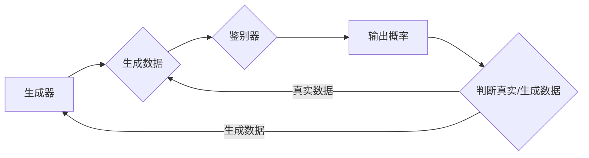

> 生成对抗网络, GAN, 对抗生成模型, 敌对网络, 隐蔽层, 数据生成, 无监督学习, 深度学习

# 生成对抗网络GAN原理与代码实例讲解

生成对抗网络（Generative Adversarial Networks，GANs）是深度学习领域中一个革命性的概念，它通过对抗训练的方式，让两个神经网络相互竞争，从而生成逼真的数据。本文将深入探讨GAN的原理、操作步骤、优缺点、应用领域，并通过实际代码实例进行讲解。

## 1. 背景介绍

### 1.1 问题的由来

在计算机视觉、自然语言处理等领域，如何生成与真实数据分布相似的新数据一直是研究者们关注的焦点。传统的生成方法，如贝叶斯网络、隐马尔可夫模型等，往往依赖于大量的标注数据或复杂的先验知识，而难以生成高质量的无标签数据。GAN的出现，为无监督学习领域带来了新的突破。

### 1.2 研究现状

GAN自2014年由Ian Goodfellow等人提出以来，已经成为深度学习领域的研究热点。近年来，随着研究的深入，GAN在图像生成、视频生成、音频生成等多个领域都取得了显著的成果。

### 1.3 研究意义

GAN作为一种无监督学习算法，具有以下重要意义：

- **无需标注数据**：GAN可以通过无监督学习的方式生成高质量的数据，降低了数据标注的成本。
- **生成逼真数据**：GAN能够生成与真实数据分布相似的新数据，适用于图像、视频、音频等多种类型的数据生成。
- **研究深度学习**：GAN的研究推动了深度学习在无监督学习领域的应用，为深度学习理论的发展提供了新的视角。

### 1.4 本文结构

本文将分为以下章节：

- 第2章介绍GAN的核心概念与联系。
- 第3章详细阐述GAN的算法原理和操作步骤。
- 第4章讲解GAN的数学模型和公式。
- 第5章通过代码实例展示GAN的应用。
- 第6章探讨GAN的实际应用场景和未来展望。
- 第7章推荐相关的学习资源和开发工具。
- 第8章总结GAN的研究成果、发展趋势和挑战。
- 第9章提供常见问题的解答。

## 2. 核心概念与联系

### 2.1 核心概念

**生成器（Generator）**：生成器负责生成与真实数据分布相似的新数据。在GAN中，生成器通常是一个神经网络，其输入是随机噪声，输出是生成的数据。

**鉴别器（Discriminator）**：鉴别器负责判断输入数据是真实数据还是生成数据。在GAN中，鉴别器也是一个神经网络，其输入是数据，输出是概率。

**对抗训练（Adversarial Training）**：对抗训练是GAN的核心思想，即生成器和鉴别器通过不断对抗，最终达到一个动态平衡的状态。

### 2.2 核心概念原理和架构的 Mermaid 流程图



### 2.3 核心概念的联系

生成器和鉴别器在GAN中相互对抗，生成器试图生成更接近真实数据的数据，而鉴别器则试图区分真实数据和生成数据。通过这种对抗过程，生成器逐渐学习到如何生成高质量的数据。

## 3. 核心算法原理 & 具体操作步骤

### 3.1 算法原理概述

GAN通过对抗训练的方式，让生成器和鉴别器相互竞争，最终达到一个动态平衡的状态。在这个过程中，生成器不断学习生成更接近真实数据的数据，而鉴别器则不断学习区分真实数据和生成数据。

### 3.2 算法步骤详解

1. 初始化生成器和鉴别器。
2. 随机生成一批噪声向量作为生成器的输入。
3. 生成器根据噪声向量生成一批数据。
4. 将生成器和真实数据同时输入鉴别器。
5. 鉴别器输出概率，判断输入数据是真实数据还是生成数据。
6. 根据鉴别器的输出，计算生成器和鉴别器的损失。
7. 使用梯度下降算法更新生成器和鉴别器的参数。
8. 重复步骤2-7，直到模型收敛。

### 3.3 算法优缺点

**优点**：

- 无需标注数据：GAN可以通过无监督学习的方式生成高质量的数据。
- 生成逼真数据：GAN能够生成与真实数据分布相似的新数据。
- 灵活性高：GAN可以应用于图像、视频、音频等多种类型的数据生成。

**缺点**：

- 训练困难：GAN的训练过程非常困难，容易陷入局部最优解。
- 模型不稳定：GAN的模型容易产生模式崩塌（mode collapse）问题，即生成器生成的数据过于简单或重复。
- 难以解释：GAN的内部工作原理难以解释，难以确定生成数据的真实性和质量。

### 3.4 算法应用领域

GAN在以下领域得到了广泛的应用：

- 图像生成：如人脸生成、图像超分辨率、图像修复等。
- 视频生成：如视频预测、动作捕捉等。
- 音频生成：如音乐生成、语音合成等。
- 文本生成：如文本摘要、对话生成等。

## 4. 数学模型和公式 & 详细讲解 & 举例说明

### 4.1 数学模型构建

GAN的数学模型主要包括生成器模型、鉴别器模型和对抗训练过程。

#### 生成器模型

生成器模型通常是一个神经网络，其输入是随机噪声，输出是生成数据。假设生成器的参数为 $\theta_G$，则生成器模型可以表示为：

$$
G(z;\theta_G) = \phi_G(z;\theta_G)
$$

其中 $z$ 是随机噪声，$\phi_G$ 是生成器的函数，$\theta_G$ 是生成器的参数。

#### 鉴别器模型

鉴别器模型通常也是一个神经网络，其输入是数据，输出是概率。假设鉴别器的参数为 $\theta_D$，则鉴别器模型可以表示为：

$$
D(x;\theta_D) = \sigma(\phi_D(x;\theta_D))
$$

其中 $x$ 是输入数据，$\phi_D$ 是鉴别器的函数，$\theta_D$ 是鉴别器的参数，$\sigma$ 是Sigmoid函数。

#### 对抗训练过程

对抗训练的目标是最小化生成器的损失函数和最大化鉴别器的损失函数。生成器的损失函数为：

$$
L_G = \mathbb{E}_{z \sim p_z(z)}[D(G(z;\theta_G))] - \mathbb{E}_{x \sim p_{data}(x)}[D(x;\theta_D)]
$$

鉴别器的损失函数为：

$$
L_D = \mathbb{E}_{x \sim p_{data}(x)}[D(x;\theta_D)] - \mathbb{E}_{z \sim p_z(z)}[D(G(z;\theta_G))]
$$

其中 $p_z(z)$ 是噪声分布，$p_{data}(x)$ 是真实数据分布。

### 4.2 公式推导过程

GAN的公式推导过程相对复杂，涉及到概率论、信息论和优化理论等多个领域。本文不展开详细推导，读者可参考相关文献。

### 4.3 案例分析与讲解

以下以图像生成为例，分析GAN的数学模型。

#### 生成器模型

假设生成器模型是一个全连接神经网络，输入是随机噪声 $z \in \mathbb{R}^n$，输出是图像 $x \in \mathbb{R}^{289}$。生成器模型可以表示为：

$$
G(z;\theta_G) = \phi_G(z;\theta_G) = \sigma(W_2^T \sigma(W_1^T z + b_1) + b_2)
$$

其中 $W_1$、$W_2$ 和 $b_1$、$b_2$ 分别是生成器模型的权重和偏置。

#### 鉴别器模型

假设鉴别器模型也是一个全连接神经网络，输入是图像 $x \in \mathbb{R}^{289}$，输出是概率 $D(x;\theta_D)$。鉴别器模型可以表示为：

$$
D(x;\theta_D) = \sigma(W_2^T \sigma(W_1^T x + b_1) + b_2)
$$

其中 $W_1$、$W_2$ 和 $b_1$、$b_2$ 分别是鉴别器模型的权重和偏置。

#### 对抗训练过程

生成器的损失函数为：

$$
L_G = \mathbb{E}_{z \sim p_z(z)}[D(G(z;\theta_G))] - \mathbb{E}_{x \sim p_{data}(x)}[D(x;\theta_D)]
$$

鉴别器的损失函数为：

$$
L_D = \mathbb{E}_{x \sim p_{data}(x)}[D(x;\theta_D)] - \mathbb{E}_{z \sim p_z(z)}[D(G(z;\theta_G))]
$$

在实际训练过程中，我们使用随机噪声 $z$ 和真实图像 $x$ 作为生成器的输入，使用真实图像 $x$ 和生成图像 $G(z;\theta_G)$ 作为鉴别器的输入。

## 5. 项目实践：代码实例和详细解释说明

### 5.1 开发环境搭建

以下是使用Python和TensorFlow搭建GAN开发环境的步骤：

1. 安装TensorFlow和Keras：
```bash
pip install tensorflow keras
```

2. 下载MNIST数据集：
```bash
python -c "import tensorflow as tf; tf.keras.datasets.mnist.load_data()"
```

### 5.2 源代码详细实现

以下是一个简单的GAN代码实例，用于生成MNIST数据集的图像：

```python
import tensorflow as tf
from tensorflow.keras.layers import Input, Dense, Reshape
from tensorflow.keras.models import Model

# 定义生成器模型
def build_generator(z_dim):
    model = tf.keras.Sequential([
        Dense(128, input_shape=(z_dim,)),
        tf.keras.layers.LeakyReLU(alpha=0.2),
        Dense(256),
        tf.keras.layers.LeakyReLU(alpha=0.2),
        Dense(512),
        tf.keras.layers.LeakyReLU(alpha=0.2),
        Dense(784),
        Reshape((28, 28, 1))
    ])
    return model

# 定义鉴别器模型
def build_discriminator(x_dim):
    model = tf.keras.Sequential([
        tf.keras.layers.Flatten(input_shape=(28, 28, 1)),
        Dense(512),
        tf.keras.layers.LeakyReLU(alpha=0.2),
        Dense(256),
        tf.keras.layers.LeakyReLU(alpha=0.2),
        Dense(1, activation='sigmoid')
    ])
    return model

# 定义GAN模型
def build_gan(generator, discriminator):
    model = tf.keras.Sequential([
        generator,
        discriminator
    ])
    model.compile(loss='binary_crossentropy', optimizer='adam', metrics=['accuracy'])
    return model

# 加载MNIST数据集
(x_train, _), (_, _) = tf.keras.datasets.mnist.load_data()

# 数据预处理
x_train = x_train.astype('float32') / 255.
x_train = x_train.reshape(-1, 28, 28, 1)

# 定义生成器和鉴别器
z_dim = 100
generator = build_generator(z_dim)
discriminator = build_discriminator(x_train.shape[1])

# 定义GAN模型
gan = build_gan(generator, discriminator)

# 训练GAN模型
gan.fit(x_train, epochs=50, batch_size=32)
```

### 5.3 代码解读与分析

以上代码定义了生成器、鉴别器和GAN模型，并使用MNIST数据集进行训练。以下是代码的关键部分：

- `build_generator`函数：定义了生成器模型的结构，包括多层全连接层和LeakyReLU激活函数。
- `build_discriminator`函数：定义了鉴别器模型的结构，包括多层全连接层和LeakyReLU激活函数。
- `build_gan`函数：定义了GAN模型的结构，将生成器和鉴别器串联起来。
- `tf.keras.datasets.mnist.load_data()`：加载MNIST数据集。
- `x_train = x_train.astype('float32') / 255.`：将数据转换为浮点数并归一化。
- `x_train = x_train.reshape(-1, 28, 28, 1)`：将数据 reshape 为 (样本数, 28, 28, 1) 的形状。
- `generator = build_generator(z_dim)`：创建生成器模型。
- `discriminator = build_discriminator(x_train.shape[1])`：创建鉴别器模型。
- `gan = build_gan(generator, discriminator)`：创建GAN模型。
- `gan.fit(x_train, epochs=50, batch_size=32)`：训练GAN模型。

### 5.4 运行结果展示

训练完成后，可以使用生成器生成新的MNIST图像：

```python
import numpy as np

# 生成随机噪声
z = np.random.uniform(-1, 1, (100, 100))

# 使用生成器生成图像
images = generator.predict(z)

# 展示生成的图像
for i in range(10):
    plt.imshow(images[i, :, :, 0], cmap='gray')
    plt.show()
```

以上代码将展示10个由GAN生成的MNIST图像。

## 6. 实际应用场景

### 6.1 图像生成

GAN在图像生成领域取得了显著的成果，可以用于以下应用：

- 人脸生成：生成逼真的逼真人脸图像。
- 图像超分辨率：将低分辨率图像转换为高分辨率图像。
- 图像修复：修复损坏的图像或去除图像中的特定元素。
- 艺术创作：生成具有艺术风格的图像，如印象派、抽象画等。

### 6.2 视频生成

GAN在视频生成领域也取得了显著的成果，可以用于以下应用：

- 视频预测：根据视频片段预测后续的画面。
- 动作捕捉：生成逼真的动作序列。
- 视频编辑：将视频中的物体或场景替换为其他物体或场景。

### 6.3 音频生成

GAN在音频生成领域也取得了显著的成果，可以用于以下应用：

- 音乐生成：生成新的音乐片段或完整的曲目。
- 语音合成：合成逼真的语音。
- 音频修复：修复损坏的音频或去除噪音。

### 6.4 未来应用展望

随着GAN技术的不断发展，相信它在更多领域的应用将会得到拓展，如：

- 数据增强：在数据集较小的情况下，通过GAN生成更多的训练数据。
- 数据隐私保护：使用GAN生成与真实数据分布相似的数据，保护用户隐私。
- 智能设计：在工业设计、建筑设计等领域，利用GAN生成新的设计方案。

## 7. 工具和资源推荐

### 7.1 学习资源推荐

- 《Generative Adversarial Nets》：GAN的创始人Ian Goodfellow的论文，详细介绍了GAN的原理和实现。
- 《Deep Learning with Python》：一份全面介绍深度学习的书籍，其中包含对GAN的介绍。
- 《Generative Models with TensorFlow 2.0》：使用TensorFlow 2.0实现GAN的教程。

### 7.2 开发工具推荐

- TensorFlow：一个开源的深度学习框架，支持GAN的构建和训练。
- PyTorch：另一个开源的深度学习框架，也支持GAN的构建和训练。
- Keras：一个高级神经网络API，可以方便地构建和训练GAN。

### 7.3 相关论文推荐

- Goodfellow, I., Pouget-Abadie, J., Mirza, M., Xu, B., Warde-Farley, D., Ozair, S., ... & Bengio, Y. (2014). Generative adversarial nets. In Advances in neural information processing systems (pp. 2672-2680).
- Arjovsky, M., Chintala, S., & Bottou, L. (2017). Wasserstein GAN. In ICLR.
- Radford, A., Metz, L., & Chintala, S. (2015). Unsupervised representation learning with deep convolutional generative adversarial networks. arXiv preprint arXiv:1511.06434.

## 8. 总结：未来发展趋势与挑战

### 8.1 研究成果总结

GAN作为一种无监督学习算法，在图像、视频、音频等多种类型的数据生成领域取得了显著的成果。它为深度学习领域带来了新的研究方向，推动了计算机视觉、自然语言处理等多个领域的发展。

### 8.2 未来发展趋势

- **模型结构多样化**：随着研究的深入，GAN的模型结构将更加多样化，以满足不同领域的需求。
- **训练效率提升**：为了解决GAN训练困难的问题，未来将出现更加高效的训练方法。
- **模型稳定性增强**：为了解决GAN容易产生模式崩塌的问题，未来将出现更加稳定的模型。

### 8.3 面临的挑战

- **训练困难**：GAN的训练过程非常困难，容易陷入局部最优解。
- **模型稳定性**：GAN的模型容易产生模式崩塌问题。
- **模型解释性**：GAN的内部工作原理难以解释。

### 8.4 研究展望

随着研究的深入，GAN将在更多领域得到应用，并推动相关领域的发展。未来，GAN有望成为深度学习领域的重要工具，为人工智能技术的发展做出更大的贡献。

## 9. 附录：常见问题与解答

### 9.1 生成器如何生成逼真的图像？

生成器通过学习真实数据的分布，生成与真实数据分布相似的新数据。在训练过程中，生成器不断学习生成更接近真实数据的图像，而鉴别器则不断学习区分真实图像和生成图像。通过这种对抗过程，生成器逐渐学习到如何生成逼真的图像。

### 9.2 GAN如何解决过拟合问题？

GAN通过对抗训练的方式，使得生成器和鉴别器相互竞争，从而避免了过拟合问题。在训练过程中，生成器不断学习生成更接近真实数据的图像，而鉴别器则不断学习区分真实图像和生成图像。这种对抗过程迫使生成器和鉴别器都保持一定的泛化能力，从而避免了过拟合问题。

### 9.3 GAN如何解决模式崩塌问题？

模式崩塌是GAN训练过程中常见的问题，即生成器生成的图像过于简单或重复。为了解决这个问题，可以采取以下措施：

- 增加生成器的容量。
- 使用更多的训练数据。
- 使用更复杂的模型结构。
- 使用多种多样的噪声分布。

### 9.4 GAN可以应用于哪些领域？

GAN可以应用于以下领域：

- 计算机视觉：图像生成、图像超分辨率、图像修复等。
- 自然语言处理：文本生成、对话生成等。
- 音频处理：音乐生成、语音合成等。
- 视频处理：视频预测、动作捕捉等。

---

作者：禅与计算机程序设计艺术 / Zen and the Art of Computer Programming