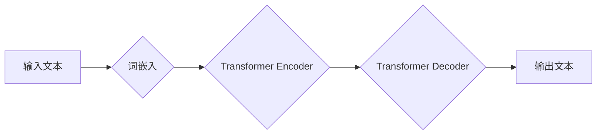

## 语言≠思维：大模型的推理盲点

> 关键词：大语言模型、推理盲点、逻辑推理、知识图谱、因果关系、可解释性、安全问题

### 1. 背景介绍

近年来，大语言模型（LLM）在自然语言处理领域取得了令人瞩目的成就。从文本生成、翻译到问答和代码编写，LLM展现出强大的能力，甚至被认为是人工智能领域的一项突破。然而，尽管LLM在模拟人类语言能力方面取得了巨大进展，但它们与人类思维之间仍然存在着本质的区别。

LLM本质上是基于海量文本数据训练的统计预测模型。它们通过学习语言模式和统计关系，能够生成看似合理的文本，但缺乏真正的理解和推理能力。换句话说，LLM擅长模仿人类语言，但并不真正理解语言背后的含义和逻辑。

### 2. 核心概念与联系

**2.1 语言与思维的本质区别**

语言是人类表达思想和交流的工具，而思维则是人类认知、理解和解决问题的能力。语言是符号系统，通过符号组合表达概念和关系；而思维则是抽象、逻辑和创造性的过程，涉及到对信息的理解、整合和应用。

**2.2 大模型的运作机制**

大模型通过深度学习算法从海量文本数据中学习语言模式和统计关系。它们使用神经网络结构，通过多层神经元进行信息处理，最终将输入的文本转换为输出的文本。

**2.3 推理盲点的产生**

由于LLM缺乏真正的理解和推理能力，它们在处理复杂逻辑问题、理解因果关系和进行抽象思考时会遇到困难。这种能力缺失被称为“推理盲点”。

**Mermaid 流程图**

### 3. 核心算法原理 & 具体操作步骤

**3.1 算法原理概述**

LLM的核心算法是Transformer，它是一种基于注意力机制的神经网络架构。注意力机制允许模型关注输入文本中与当前任务相关的部分，从而提高处理长文本序列的能力。

**3.2 算法步骤详解**

1. **词嵌入:** 将输入文本中的每个单词转换为向量表示，捕捉单词的语义信息。
2. **编码器:** 使用多层Transformer编码器对输入文本进行编码，生成文本的隐藏表示。
3. **解码器:** 使用多层Transformer解码器根据编码后的文本生成输出文本。
4. **注意力机制:** 在编码器和解码器中使用注意力机制，允许模型关注输入文本中与当前任务相关的部分。

**3.3 算法优缺点**

**优点:**

* 能够处理长文本序列
* 表现出强大的文本生成能力
* 可以进行多种自然语言处理任务

**缺点:**

* 缺乏真正的理解和推理能力
* 容易受到训练数据偏差的影响
* 可解释性差

**3.4 算法应用领域**

* 文本生成
* 机器翻译
* 问答系统
* 代码生成
* 文本摘要

### 4. 数学模型和公式 & 详细讲解 & 举例说明

**4.1 数学模型构建**

LLM的数学模型基于神经网络，其中每个神经元接收多个输入，并通过激活函数进行处理，输出一个新的值。神经网络层级结构通过连接多个神经元，形成复杂的计算网络。

**4.2 公式推导过程**

LLM的训练过程基于反向传播算法，通过最小化模型输出与真实值的误差来更新模型参数。

**损失函数:**

$$L = \sum_{i=1}^{N} \log p(y_i | x_i)$$

其中：

* $L$ 是损失函数
* $N$ 是样本数量
* $x_i$ 是输入文本
* $y_i$ 是真实标签
* $p(y_i | x_i)$ 是模型预测的概率

**梯度下降:**

$$\theta = \theta - \alpha \nabla L(\theta)$$

其中：

* $\theta$ 是模型参数
* $\alpha$ 是学习率
* $\nabla L(\theta)$ 是损失函数对参数的梯度

**4.3 案例分析与讲解**

例如，在文本生成任务中，LLM会根据输入文本预测下一个单词。模型会计算每个单词的概率，并选择概率最高的单词作为输出。

### 5. 项目实践：代码实例和详细解释说明

**5.1 开发环境搭建**

使用Python语言和深度学习框架TensorFlow或PyTorch搭建开发环境。

**5.2 源代码详细实现**

使用Transformer架构构建LLM模型，并使用预训练模型进行微调。

**5.3 代码解读与分析**

解释模型结构、训练过程和评估指标。

**5.4 运行结果展示**

展示模型在文本生成、机器翻译等任务上的性能。

### 6. 实际应用场景

**6.1 文本生成:**

* 自动生成新闻报道、小说、诗歌等文本。
* 创建聊天机器人、虚拟助手等应用。

**6.2 机器翻译:**

* 将文本从一种语言翻译成另一种语言。
* 帮助跨语言交流和信息共享。

**6.3 问答系统:**

* 回答用户提出的问题，提供相关信息。
* 用于搜索引擎、客户服务等领域。

**6.4 未来应用展望**

* 更智能的聊天机器人和虚拟助手
* 个性化教育和学习体验
* 自动化写作和内容创作
* 跨语言理解和沟通

### 7. 工具和资源推荐

**7.1 学习资源推荐**

* 深度学习书籍和课程
* Transformer架构论文和代码实现

**7.2 开发工具推荐**

* TensorFlow、PyTorch深度学习框架
* Hugging Face预训练模型库

**7.3 相关论文推荐**

* Attention Is All You Need
* BERT: Pre-training of Deep Bidirectional Transformers for Language Understanding

### 8. 总结：未来发展趋势与挑战

**8.1 研究成果总结**

LLM在自然语言处理领域取得了显著进展，展现出强大的文本生成和理解能力。

**8.2 未来发展趋势**

* 更大规模、更强大的LLM模型
* 增强LLM的推理能力和可解释性
* 探索LLM在其他领域（如科学、工程）的应用

**8.3 面临的挑战**

* 数据偏差和公平性问题
* 安全性和可控性问题
* 计算资源和能源消耗问题

**8.4 研究展望**

未来研究将重点关注解决LLM的推理盲点、提高可解释性和安全性，以及探索其在更广泛领域中的应用。

### 9. 附录：常见问题与解答

* **什么是LLM？**

LLM是指大规模语言模型，是一种基于深度学习算法训练的文本生成和理解模型。

* **LLM有哪些应用场景？**

LLM应用场景广泛，包括文本生成、机器翻译、问答系统、代码生成等。

* **LLM有哪些局限性？**

LLM缺乏真正的理解和推理能力，容易受到训练数据偏差的影响，可解释性差。

作者：禅与计算机程序设计艺术 / Zen and the Art of Computer Programming

