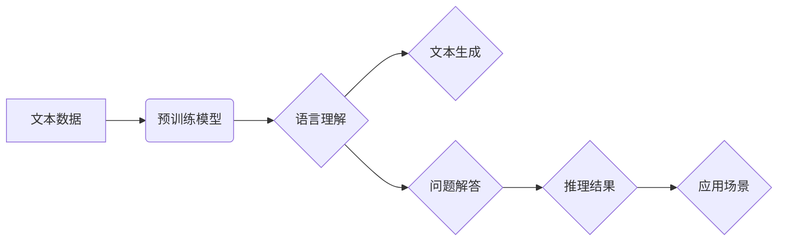

## 语言与推理：大模型的盲区

> 关键词：大语言模型、推理能力、逻辑缺陷、知识图谱、因果关系、可解释性、安全问题

### 1. 背景介绍

近年来，大语言模型（LLM）在自然语言处理领域取得了令人瞩目的成就。从文本生成、翻译到问答和代码编写，LLM展现出强大的能力，甚至被认为是人工智能领域的一项突破。然而，尽管LLM在模拟人类语言能力方面取得了巨大进展，但它们在推理能力方面仍然存在着显著的局限性。

传统的AI系统通常依赖于明确定义的规则和逻辑，而LLM则通过学习海量文本数据来掌握语言模式和关系。这种学习方式使得LLM能够生成流畅、连贯的文本，但同时也导致了它们在推理方面的缺陷。

### 2. 核心概念与联系

**2.1  大语言模型 (LLM)**

大语言模型是一种基于Transformer架构的深度学习模型，通过训练海量文本数据来学习语言的语法、语义和上下文关系。它们能够理解和生成人类语言，并执行各种自然语言处理任务。

**2.2  推理能力**

推理能力是指AI系统根据已知信息和逻辑规则推导出新的知识或结论的能力。它涉及到理解因果关系、识别模式、解决问题和做出决策等复杂认知过程。

**2.3  LLM的推理盲区**

尽管LLM在语言理解方面表现出色，但它们在推理能力方面仍然存在着一些盲区：

* **缺乏逻辑推理能力:** LLM主要依赖于统计模式，而非严格的逻辑规则。因此，它们难以处理需要逻辑推理的复杂问题。
* **容易受到样本偏差的影响:** LLM的训练数据可能存在偏差，导致它们在推理时产生错误或偏见的结果。
* **难以理解因果关系:** LLM主要学习文本之间的关联关系，但难以理解因果关系。这使得它们难以解决需要因果推理的问题。
* **缺乏可解释性:** LLM的决策过程非常复杂，难以解释其推理结果。这使得它们难以被信任和应用于需要透明度和可解释性的领域。

**2.4  Mermaid 流程图**



### 3. 核心算法原理 & 具体操作步骤

**3.1  算法原理概述**

LLM的训练主要基于Transformer架构，它利用自注意力机制来学习文本序列之间的关系。通过训练大量的文本数据，LLM能够掌握语言的语法、语义和上下文关系，从而实现文本生成、翻译、问答等任务。

**3.2  算法步骤详解**

1. **数据预处理:** 将文本数据进行清洗、分词、标记等预处理操作，使其能够被模型理解。
2. **模型构建:** 使用Transformer架构构建LLM模型，包括编码器和解码器。
3. **模型训练:** 使用海量文本数据训练LLM模型，通过反向传播算法优化模型参数。
4. **模型评估:** 使用测试数据评估模型的性能，例如准确率、BLEU分数等。
5. **模型部署:** 将训练好的模型部署到实际应用场景中。

**3.3  算法优缺点**

**优点:**

* 能够处理长文本序列
* 学习能力强，能够掌握复杂的语言关系
* 在文本生成、翻译等任务上表现出色

**缺点:**

* 计算资源消耗大
* 训练时间长
* 容易受到样本偏差的影响
* 推理能力有限

**3.4  算法应用领域**

* 自然语言处理：文本生成、翻译、问答、摘要、情感分析等
* 人机交互：聊天机器人、语音助手
* 代码生成：自动生成代码

### 4. 数学模型和公式 & 详细讲解 & 举例说明

**4.1  数学模型构建**

LLM的核心数学模型是Transformer架构，它基于自注意力机制来学习文本序列之间的关系。

**4.2  公式推导过程**

自注意力机制的核心公式是：

$$
Attention(Q, K, V) = \frac{exp(Q \cdot K^T / \sqrt{d_k})}{exp(Q \cdot K^T / \sqrt{d_k})} \cdot V
$$

其中：

* $Q$：查询矩阵
* $K$：键矩阵
* $V$：值矩阵
* $d_k$：键向量的维度

**4.3  案例分析与讲解**

假设我们有一个句子“我爱吃苹果”，我们需要计算每个单词对句子的整体语义的影响。

使用自注意力机制，我们可以将每个单词作为查询向量、键向量和值向量，然后计算每个单词对其他单词的注意力权重。

例如，“我”对“爱”的注意力权重可能较高，因为它们在语义上密切相关。

通过计算所有单词之间的注意力权重，我们可以得到一个表示句子整体语义的向量。

### 5. 项目实践：代码实例和详细解释说明

**5.1  开发环境搭建**

* Python 3.7+
* PyTorch 或 TensorFlow
* CUDA 和 cuDNN

**5.2  源代码详细实现**

```python
import torch
import torch.nn as nn

class Transformer(nn.Module):
    def __init__(self, vocab_size, embedding_dim, num_heads, num_layers):
        super(Transformer, self).__init__()
        self.embedding = nn.Embedding(vocab_size, embedding_dim)
        self.transformer_layers = nn.ModuleList([
            nn.TransformerEncoderLayer(embedding_dim, num_heads)
            for _ in range(num_layers)
        ])
        self.linear = nn.Linear(embedding_dim, vocab_size)

    def forward(self, x):
        x = self.embedding(x)
        for layer in self.transformer_layers:
            x = layer(x)
        x = self.linear(x)
        return x
```

**5.3  代码解读与分析**

* `Transformer`类定义了一个Transformer模型。
* `embedding`层将单词索引转换为词向量。
* `transformer_layers`是一个模块列表，包含多个`TransformerEncoderLayer`层。
* `linear`层将输出向量映射到词汇表大小。

**5.4  运行结果展示**

训练好的LLM模型可以用于各种自然语言处理任务，例如文本生成、翻译、问答等。

### 6. 实际应用场景

**6.1  聊天机器人**

LLM可以用于构建更智能、更自然的聊天机器人，能够理解用户的意图并提供更准确的回复。

**6.2  文本摘要**

LLM可以自动生成文本摘要，提取文本的关键信息，节省用户阅读时间。

**6.3  代码生成**

LLM可以根据用户需求自动生成代码，提高开发效率。

**6.4  未来应用展望**

LLM在未来将应用于更多领域，例如教育、医疗、法律等，帮助人们更高效地获取信息、解决问题和进行创作。

### 7. 工具和资源推荐

**7.1  学习资源推荐**

* **论文:** “Attention Is All You Need”
* **书籍:** “Deep Learning”
* **在线课程:** Coursera、edX

**7.2  开发工具推荐**

* **PyTorch:** https://pytorch.org/
* **TensorFlow:** https://www.tensorflow.org/

**7.3  相关论文推荐**

* “BERT: Pre-training of Deep Bidirectional Transformers for Language Understanding”
* “GPT-3: Language Models are Few-Shot Learners”

### 8. 总结：未来发展趋势与挑战

**8.1  研究成果总结**

近年来，LLM取得了显著进展，在语言理解和生成方面展现出强大的能力。

**8.2  未来发展趋势**

* **模型规模更大:** 训练更大规模的LLM模型，提升其性能和能力。
* **推理能力增强:** 研究更有效的算法和方法，提升LLM的推理能力。
* **可解释性提升:** 开发更可解释的LLM模型，使其决策过程更加透明。
* **安全性和鲁棒性:** 研究LLM的安全性和鲁棒性，防止其被恶意利用。

**8.3  面临的挑战**

* **计算资源消耗大:** 训练大型LLM模型需要大量的计算资源，成本高昂。
* **数据获取和标注:** 训练高质量的LLM模型需要海量高质量的文本数据，数据获取和标注成本高。
* **伦理问题:** LLM的应用可能引发伦理问题，例如信息操纵、隐私泄露等。

**8.4  研究展望**

未来，LLM研究将继续朝着更强大、更安全、更可解释的方向发展，为人类社会带来更多福祉。

### 9. 附录：常见问题与解答

**9.1  LLM如何理解因果关系？**

LLM主要学习文本之间的关联关系，难以理解因果关系。

**9.2  如何提高LLM的推理能力？**

可以通过以下方法提高LLM的推理能力：

* 使用更复杂的模型架构
* 训练更大的模型
* 使用更丰富的训练数据
* 引入逻辑推理规则

**9.3  LLM的应用有哪些伦理问题？**

LLM的应用可能引发以下伦理问题：

* 信息操纵
* 隐私泄露
* 偏见和歧视
* 工作岗位替代

作者：禅与计算机程序设计艺术 / Zen and the Art of Computer Programming


