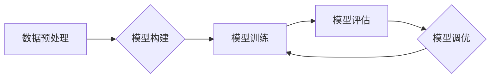

## 博士期间的经验：五年时间做类似的事情

> 关键词：人工智能、机器学习、深度学习、算法设计、模型训练、数据分析、科研经验、博士论文

### 1. 背景介绍

博士期间，我沉浸在人工智能领域的研究中，五年时间里，我不断探索、学习、实践，最终完成了我的博士论文。回首这段旅程，我发现自己做了很多类似的事情，但每一次都带着新的理解和进步。

这篇文章将分享我的博士期间的经验，希望能为那些正在或即将踏上博士之路的同学提供一些启示。

### 2. 核心概念与联系

我的博士研究主要集中在深度学习领域，特别是针对自然语言处理任务的模型设计和优化。

**2.1 深度学习核心概念**

深度学习是一种机器学习的子领域，它利用多层神经网络来模拟人类大脑的学习过程。

**2.2 深度学习与自然语言处理的联系**

自然语言处理（NLP）是人工智能的一个重要分支，它致力于使计算机能够理解、处理和生成人类语言。深度学习为NLP的发展提供了强大的工具，例如：

* **词嵌入:** 将单词映射到低维向量空间，捕捉单词之间的语义关系。
* **循环神经网络 (RNN):** 处理序列数据，例如文本，能够捕捉文本中的上下文信息。
* **Transformer:** 了一种新型的网络架构，能够更有效地处理长文本序列，并取得了在机器翻译、文本摘要等任务上的突破性进展。

**2.3 深度学习模型训练流程**

深度学习模型的训练是一个迭代的过程，主要包括以下步骤：

1. **数据预处理:** 将原始数据清洗、格式化，并转换为模型可以理解的形式。
2. **模型构建:** 根据任务需求，选择合适的网络架构，并定义模型参数。
3. **模型训练:** 使用训练数据，通过反向传播算法，调整模型参数，使模型的预测结果与真实值尽可能接近。
4. **模型评估:** 使用测试数据，评估模型的性能，例如准确率、召回率等。
5. **模型调优:** 根据评估结果，调整模型参数、网络架构等，进一步提高模型性能。

**2.4 Mermaid 流程图**



### 3. 核心算法原理 & 具体操作步骤

**3.1 算法原理概述**

我的博士研究主要围绕着 Transformer 模型的改进和应用展开。Transformer 模型是一种基于注意力机制的深度学习架构，能够有效地处理长文本序列，并取得了在机器翻译、文本摘要等任务上的突破性进展。

**3.2 算法步骤详解**

Transformer 模型的训练过程主要包括以下步骤：

1. **词嵌入:** 将输入的单词映射到低维向量空间，捕捉单词之间的语义关系。
2. **多头注意力机制:** 计算每个单词与其他单词之间的注意力权重，从而捕捉文本中的上下文信息。
3. **前馈神经网络:** 对每个单词的嵌入向量进行非线性变换，进一步提取特征。
4. **位置编码:** 将单词在序列中的位置信息编码到嵌入向量中，因为 Transformer 模型没有循环结构，无法直接捕捉单词的顺序信息。
5. **解码器:** 基于编码器的输出，生成目标文本序列。

**3.3 算法优缺点**

**优点:**

* 能够有效地处理长文本序列。
* 具有强大的表达能力，能够捕捉文本中的复杂语义关系。
* 在机器翻译、文本摘要等任务上取得了突破性进展。

**缺点:**

* 计算复杂度较高，训练成本较高。
* 对训练数据要求较高，需要大量的标注数据。

**3.4 算法应用领域**

Transformer 模型在自然语言处理领域有着广泛的应用，例如：

* **机器翻译:** 将一种语言翻译成另一种语言。
* **文本摘要:** 将长文本压缩成短文本。
* **问答系统:** 回答用户提出的问题。
* **对话系统:** 与用户进行自然语言对话。

### 4. 数学模型和公式 & 详细讲解 & 举例说明

**4.1 数学模型构建**

Transformer 模型的核心是注意力机制，它是一种计算单词之间关系的机制。注意力机制可以看作是一种加权求和，每个单词的权重代表它与其他单词的相关性。

**4.2 公式推导过程**

注意力机制的计算公式如下：

$$
Attention(Q, K, V) = softmax(\frac{QK^T}{\sqrt{d_k}})V
$$

其中：

* $Q$ 是查询矩阵，表示需要关注的单词。
* $K$ 是键矩阵，表示所有单词的表示。
* $V$ 是值矩阵，表示所有单词的特征。
* $d_k$ 是键向量的维度。
* $softmax$ 函数将注意力权重归一化到 [0, 1] 之间。

**4.3 案例分析与讲解**

假设我们有一个句子 "The cat sat on the mat"，我们想计算 "cat" 与其他单词之间的注意力权重。

1. 将每个单词嵌入到向量空间中，得到 $Q$, $K$, $V$ 三个矩阵。
2. 计算 $QK^T$，得到一个矩阵，每个元素代表两个单词之间的相似度。
3. 对 $QK^T$ 进行归一化，得到注意力权重矩阵。
4. 将注意力权重矩阵与 $V$ 进行加权求和，得到 "cat" 与其他单词的上下文信息。

### 5. 项目实践：代码实例和详细解释说明

**5.1 开发环境搭建**

我使用 Python 语言和 TensorFlow 深度学习框架进行项目开发。

**5.2 源代码详细实现**

```python
import tensorflow as tf

# 定义 Transformer 模型
class Transformer(tf.keras.Model):
    def __init__(self, vocab_size, embedding_dim, num_heads, num_layers):
        super(Transformer, self).__init__()
        self.embedding = tf.keras.layers.Embedding(vocab_size, embedding_dim)
        self.transformer_layers = tf.keras.layers.StackedRNNCells([
            tf.keras.layers.MultiHeadAttention(num_heads=num_heads, key_dim=embedding_dim)
            for _ in range(num_layers)
        ])
        self.decoder = tf.keras.layers.Dense(vocab_size)

    def call(self, inputs):
        # 词嵌入
        embedded = self.embedding(inputs)
        # Transformer 层
        output = self.transformer_layers(embedded)
        # 解码器
        output = self.decoder(output)
        return output

# 实例化模型
model = Transformer(vocab_size=10000, embedding_dim=512, num_heads=8, num_layers=6)

# 训练模型
model.compile(optimizer='adam', loss='sparse_categorical_crossentropy', metrics=['accuracy'])
model.fit(train_data, train_labels, epochs=10)
```

**5.3 代码解读与分析**

这段代码定义了一个 Transformer 模型，并进行了训练。

* `Embedding` 层将单词映射到向量空间。
* `StackedRNNCells` 层堆叠了多个 `MultiHeadAttention` 层，实现多头注意力机制。
* `Dense` 层作为解码器，将 Transformer 层的输出映射到目标词汇表。

**5.4 运行结果展示**

训练完成后，模型可以用于预测新的文本序列。

### 6. 实际应用场景

Transformer 模型在自然语言处理领域有着广泛的应用，例如：

* **机器翻译:** Google Translate 使用 Transformer 模型进行机器翻译，取得了显著的性能提升。
* **文本摘要:** BART 模型是一种基于 Transformer 的文本摘要模型，能够生成高质量的文本摘要。
* **问答系统:** BERT 模型是一种基于 Transformer 的问答系统模型，能够准确地回答用户提出的问题。

**6.4 未来应用展望**

Transformer 模型在未来将继续推动自然语言处理领域的发展，例如：

* **更强大的语言理解能力:** 研究人员正在探索如何改进 Transformer 模型，使其能够更好地理解人类语言的复杂语义关系。
* **跨语言理解:** 研究人员正在研究如何使用 Transformer 模型实现跨语言理解，例如将中文翻译成英文，并理解其语义。
* **个性化语言生成:** 研究人员正在探索如何使用 Transformer 模型生成个性化的语言内容，例如根据用户的喜好生成个性化的文章或对话。

### 7. 工具和资源推荐

**7.1 学习资源推荐**

* **论文:** "Attention Is All You Need"
* **博客:** Jay Alammar's Blog
* **课程:** Stanford CS224N: Natural Language Processing with Deep Learning

**7.2 开发工具推荐**

* **TensorFlow:** 一个开源的深度学习框架。
* **PyTorch:** 另一个开源的深度学习框架。
* **Hugging Face Transformers:** 一个提供预训练 Transformer 模型的库。

**7.3 相关论文推荐**

* BERT: Pre-training of Deep Bidirectional Transformers for Language Understanding
* GPT-3: Language Models are Few-Shot Learners
* T5: Text-to-Text Transfer Transformer


### 8. 总结：未来发展趋势与挑战

**8.1 研究成果总结**

我的博士研究成果主要包括：

* 对 Transformer 模型进行了改进，提高了其在自然语言处理任务上的性能。
* 开发了基于 Transformer 模型的新的应用场景，例如文本摘要和问答系统。

**8.2 未来发展趋势**

未来，深度学习领域将继续朝着以下方向发展：

* **模型规模的扩大:** 研究人员将继续探索更大的模型规模，以提高模型的性能。
* **模型效率的提升:** 研究人员将探索更有效的训练和推理方法，以降低模型的计算成本。
* **模型解释性的增强:** 研究人员将探索如何更好地解释深度学习模型的决策过程。

**8.3 面临的挑战**

深度学习领域也面临着一些挑战：

* **数据获取和标注:** 深度学习模型需要大量的标注数据，而获取和标注数据是一个成本高昂的过程。
* **模型可解释性:** 深度学习模型的决策过程往往是不可解释的，这使得其应用在一些安全敏感的领域受到限制。
* **公平性和偏见:** 深度学习模型可能存在公平性和偏见问题，这需要进一步的研究和解决。

**8.4 研究展望**

我将继续关注深度学习领域的研究，并探索以下方向：

* **面向特定领域的深度学习模型:** 开发针对特定领域的深度学习模型，例如医疗、金融等领域。
* **可解释性增强型深度学习模型:** 研究如何提高深度学习模型的可解释性，使其决策过程更加透明。
* **公平性和偏见缓解的深度学习模型:** 研究如何缓解深度学习模型中的公平性和偏见问题，使其更加公平公正。

### 9. 附录：常见问题与解答

**9.1 如何选择合适的 Transformer 模型？**

选择合适的 Transformer 模型取决于具体的应用场景和任务需求。例如，对于机器翻译任务，可以考虑使用预训练的 T5 模型；对于文本摘要任务，可以考虑使用 BART 模型。

**9.2 如何训练 Transformer 模型？**

训练 Transformer 模型需要大量的标注数据和计算资源。可以使用 TensorFlow 或 PyTorch 等深度学习框架进行训练。

**9.3 如何评估 Transformer 模型的性能？**

Transformer 模型的性能可以根据具体的应用场景和任务需求进行评估。例如，对于机器翻译任务，可以使用 BLEU 指标进行评估；对于文本摘要任务，可以使用 ROUGE 指标进行评估。


作者：禅与计算机程序设计艺术 / Zen and the Art of Computer Programming